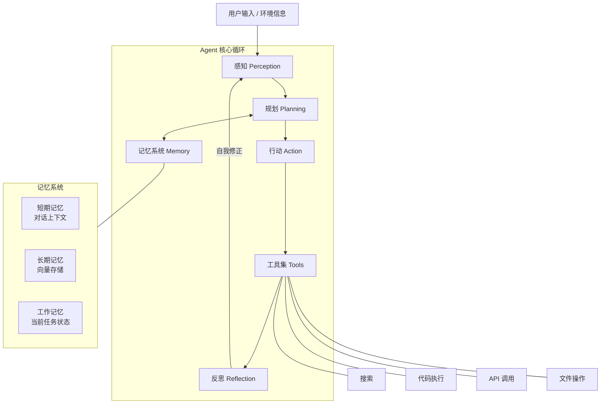
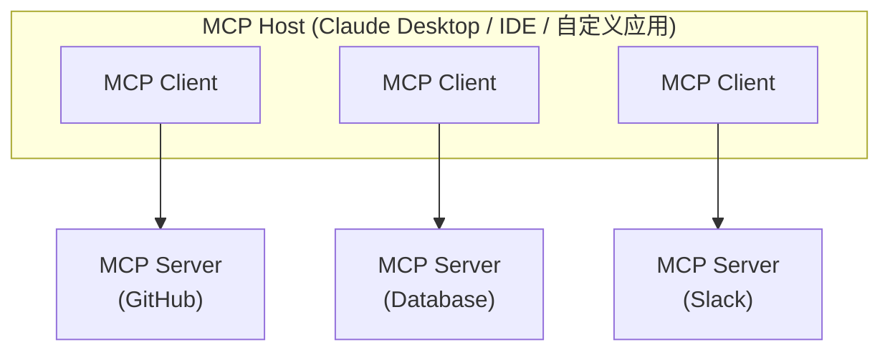

# AI Agent 智能体

<span class="dig-tag dig-tag--category">AI 技术</span> <span class="dig-tag dig-tag--hard">⭐⭐⭐ 高级</span> <span class="dig-tag dig-tag--hot">🔥🔥🔥 高频</span>

::: tip 💡 核心要点
AI Agent（智能体）是以大语言模型为核心推理引擎，能够**自主感知环境、制定计划、调用工具并根据反馈迭代优化**的智能系统。与简单的 LLM 调用不同，Agent 具备**自主决策循环**——它不仅能生成文本，还能分解复杂任务、操作外部工具、维护记忆状态，并通过反思机制自我修正。Agent 是当前 LLM 应用架构中最重要的演进方向。
:::

## 什么是 AI Agent

### 与简单 LLM 调用的区别

简单的 LLM 调用是**一次性的输入-输出映射**——给定 Prompt，返回回答，流程即结束。而 AI Agent 是一个**持续运行的决策循环**，能够根据中间结果动态调整行为。

| 对比维度 | 简单 LLM 调用 | AI Agent |
|----------|---------------|----------|
| **交互模式** | 单轮输入→输出 | 多轮自主循环 |
| **任务复杂度** | 单步可完成的任务 | 多步骤、需规划的复杂任务 |
| **工具使用** | 无或有限 | 主动选择和调用多种工具 |
| **错误处理** | 无自我修正能力 | 可检测错误并重试 |
| **记忆** | 仅当前上下文窗口 | 短期 + 长期记忆系统 |
| **自主性** | 完全被动响应 | 主动规划和执行 |

### 直观示例

```
简单 LLM 调用：
  用户: "帮我写一封邮件"  →  LLM: [生成邮件文本]  →  结束

AI Agent：
  用户: "帮我调研竞品 X 并写一份分析报告"
    → Agent 思考: 我需要先搜索竞品信息
    → Agent 行动: 调用搜索工具获取竞品数据
    → Agent 思考: 数据不够，我需要查看他们的定价页面
    → Agent 行动: 调用网页抓取工具获取定价信息
    → Agent 思考: 现在信息足够了，我来组织报告结构
    → Agent 行动: 生成分析报告
    → Agent 反思: 报告缺少市场份额数据，我补充一下
    → Agent 行动: 再次搜索并补充数据
    → 最终输出: 完整的竞品分析报告
```

---

## Agent 核心架构

AI Agent 的运行遵循**感知 → 规划 → 行动 → 记忆**的循环模式：



---

## 核心组件详解

### 规划 Planning

规划模块负责将复杂任务**分解为可执行的子步骤**，并确定执行顺序。

#### ReAct 模式

ReAct（Reasoning + Acting）是最经典的 Agent 规划模式，交替进行**推理**和**行动**：

```python
def react_agent_loop(question: str, tools: dict,
                     llm, max_steps: int = 10) -> str:
    """
    ReAct Agent 核心循环。

    Args:
        question: 用户问题
        tools: 可用工具字典 {"tool_name": tool_function}
        llm: 大语言模型
        max_steps: 最大迭代步数
    Returns:
        最终回答
    """
    history = f"问题: {question}\n"

    for step in range(max_steps):
        # 让 LLM 生成下一步的思考和行动
        response = llm.generate(
            f"""{history}
请按以下格式输出下一步：
Thought: 你的思考过程
Action: 工具名称
Action Input: 工具输入参数
（如果你已经有足够信息回答，请输出：）
Thought: 我已经有足够信息
Final Answer: 最终回答"""
        )

        history += response + "\n"

        # 检查是否已得出最终答案
        if "Final Answer:" in response:
            return response.split("Final Answer:")[-1].strip()

        # 解析并执行工具调用
        action = parse_action(response)
        if action and action["tool"] in tools:
            observation = tools[action["tool"]](action["input"])
            history += f"Observation: {observation}\n"

    return "达到最大步数限制，未能得出结论。"
```

#### Plan-and-Solve 模式

先生成完整的执行计划，然后按计划逐步执行，适合有明确步骤的任务：

```python
plan_and_solve_prompt = """请为以下任务生成一个分步执行计划，
然后按照计划逐步执行。

任务: {task}

请先输出计划：
Plan:
1. [第一步]
2. [第二步]
...

然后逐步执行每一步，展示中间结果。"""
```

**两种模式对比**：

| 特性 | ReAct | Plan-and-Solve |
|------|-------|----------------|
| **规划方式** | 边推理边行动，动态调整 | 先生成完整计划再执行 |
| **灵活性** | 高——可根据中间结果调整方向 | 较低——计划一旦生成不易修改 |
| **适用场景** | 探索性任务、信息不确定 | 步骤明确、流程化任务 |
| **风险** | 可能偏离目标 | 计划可能与实际情况脱节 |

---

### 记忆 Memory

记忆系统使 Agent 能够**保持上下文连贯性**并**利用历史经验**，是区别于简单 LLM 调用的关键能力。

| 记忆类型 | 实现方式 | 存储内容 | 生命周期 |
|----------|----------|----------|----------|
| **短期记忆（Short-term）** | 对话历史（消息列表） | 当前对话的上下文 | 单次会话 |
| **长期记忆（Long-term）** | 向量数据库（Vector Store） | 历史经验、用户偏好、知识 | 跨会话持久化 |
| **工作记忆（Working）** | 结构化状态变量 | 当前任务进度、中间结果 | 单次任务 |

```python
class AgentMemory:
    """Agent 记忆系统实现。"""

    def __init__(self, vector_store, max_short_term: int = 20):
        self.short_term = []        # 短期记忆：对话历史
        self.working = {}           # 工作记忆：当前任务状态
        self.vector_store = vector_store  # 长期记忆：向量数据库
        self.max_short_term = max_short_term

    def add_message(self, role: str, content: str):
        """添加对话消息到短期记忆。"""
        self.short_term.append({"role": role, "content": content})
        # 超出限制时，将旧消息存入长期记忆
        if len(self.short_term) > self.max_short_term:
            old_messages = self.short_term[:5]
            summary = self._summarize(old_messages)
            self.vector_store.add(text=summary, metadata={"type": "conversation"})
            self.short_term = self.short_term[5:]

    def retrieve_relevant(self, query: str, top_k: int = 3) -> list:
        """从长期记忆中检索与当前查询相关的历史信息。"""
        return self.vector_store.similarity_search(query, top_k=top_k)

    def update_working(self, key: str, value):
        """更新工作记忆中的任务状态。"""
        self.working[key] = value

    def get_context(self, query: str) -> str:
        """组合所有记忆源，构建完整上下文。"""
        # 短期记忆
        recent = self.short_term[-10:]
        # 长期记忆（相关部分）
        long_term = self.retrieve_relevant(query)
        # 工作记忆
        working = self.working

        return self._format_context(recent, long_term, working)

    def _summarize(self, messages: list) -> str:
        """将多条消息压缩为摘要。"""
        content = "\n".join(f"{m['role']}: {m['content']}" for m in messages)
        return f"对话摘要: {content[:500]}"

    def _format_context(self, recent, long_term, working) -> str:
        """格式化组合上下文。"""
        parts = ["=== 近期对话 ==="]
        for msg in recent:
            parts.append(f"{msg['role']}: {msg['content']}")
        if long_term:
            parts.append("\n=== 相关历史经验 ===")
            for item in long_term:
                parts.append(item.text)
        if working:
            parts.append("\n=== 当前任务状态 ===")
            for k, v in working.items():
                parts.append(f"{k}: {v}")
        return "\n".join(parts)
```

---

### 工具 Tools

工具是 Agent **与外部世界交互的接口**，赋予 LLM 超越纯文本生成的能力。

| 工具类型 | 示例 | 能力扩展 |
|----------|------|----------|
| **信息检索** | Web 搜索、知识库查询、数据库查询 | 获取实时信息和私有数据 |
| **代码执行** | Python 沙箱、Shell 命令 | 精确计算、数据处理 |
| **API 调用** | REST API、第三方服务 | 连接外部系统和服务 |
| **文件操作** | 读写文件、解析 PDF/Excel | 处理各种格式文档 |
| **交互操作** | 浏览器自动化、GUI 操作 | 模拟用户操作 |

```python
# 工具定义示例
class Tool:
    """Agent 工具的基类。"""

    def __init__(self, name: str, description: str, func):
        self.name = name
        self.description = description
        self.func = func

    def run(self, input_data: str) -> str:
        """执行工具并返回结果。"""
        try:
            result = self.func(input_data)
            return f"成功: {result}"
        except Exception as e:
            return f"错误: {str(e)}"

# 注册工具
tools = [
    Tool(
        name="web_search",
        description="搜索互联网获取最新信息。输入应为搜索关键词。",
        func=lambda q: search_engine.search(q)
    ),
    Tool(
        name="python_executor",
        description="在沙箱中执行 Python 代码并返回结果。输入应为合法 Python 代码。",
        func=lambda code: sandbox.execute(code)
    ),
    Tool(
        name="file_reader",
        description="读取指定路径的文件内容。输入应为文件路径。",
        func=lambda path: open(path).read()
    ),
]
```

---

### 反思 Reflection

反思模块使 Agent 能够**评估自身行为的质量**并在必要时**自我修正**，是实现高可靠性的关键。

```python
reflection_prompt = """请评估你刚才完成的任务：

任务目标: {original_goal}
执行步骤: {steps_taken}
当前结果: {current_output}

请回答以下问题：
1. 当前结果是否完整地解决了任务目标？(是/否)
2. 结果中是否存在事实错误或逻辑漏洞？
3. 是否遗漏了重要信息？
4. 如果需要改进，具体应该怎么做？

评估结果："""

def reflection_loop(agent, task: str, max_reflections: int = 3) -> str:
    """
    带反思的 Agent 执行循环。

    Args:
        agent: Agent 实例
        task: 任务描述
        max_reflections: 最大反思次数
    Returns:
        最终输出
    """
    result = agent.execute(task)

    for i in range(max_reflections):
        # 自我评估
        evaluation = agent.llm.generate(
            reflection_prompt.format(
                original_goal=task,
                steps_taken=agent.get_history(),
                current_output=result
            )
        )

        # 如果评估通过，结束循环
        if "是" in evaluation.split("\n")[0] and "无" in evaluation:
            break

        # 根据评估结果改进
        result = agent.execute(
            f"根据以下反馈改进之前的结果：\n{evaluation}\n原始结果：\n{result}"
        )

    return result
```

---

## Agent 框架对比

| 框架 | 开发者 | 核心特点 | 适用场景 | 学习曲线 |
|------|--------|----------|----------|----------|
| **LangChain Agent** | LangChain | 生态丰富、工具集成广泛、文档齐全 | 通用 Agent 开发、快速原型 | 中等 |
| **LangGraph** | LangChain | 基于图的工作流、支持循环和状态管理 | 复杂 Agent 工作流 | 较高 |
| **AutoGPT** | Significant Gravitas | 全自主执行、目标驱动 | 探索性实验 | 低 |
| **CrewAI** | CrewAI | 多 Agent 角色扮演、任务协作 | 多 Agent 协作场景 | 中等 |
| **AutoGen** | Microsoft | 多 Agent 对话式编排、灵活拓扑、代码执行 | 研究探索、复杂多 Agent 协作 | 较高 |
| **Claude Agent SDK** | Anthropic | 原生 Tool Use、简洁 API | Anthropic 生态应用 | 低 |
| **OpenAI Assistants** | OpenAI | 托管服务、内置代码解释器和文件检索 | OpenAI 生态应用 | 低 |
| **Dify** | Dify.AI | 可视化编排、低代码平台 | 快速搭建 AI 应用 | 低 |
| **Coze** | 字节跳动 | 可视化 Agent 构建、丰富插件生态 | 国内应用场景 | 低 |

---

## Function Calling 与工具调用

Function Calling（函数调用）是 Agent 与外部世界交互的核心能力。LLM 在生成过程中**识别需要调用外部工具的时机**，并输出结构化的调用参数。

### 工作流程

```
User Query --> LLM Decision
                  |
           +------+------+
           |             |
      Need Tools    No Tools
           |             |
    Output tool      Generate
    name + args      response
           |
    App executes
    tool call
           |
    Return result
    to LLM
           |
    LLM generates
    final response
```

### 工具定义示例

```python
# OpenAI Function Calling 格式
tools = [
    {
        "type": "function",
        "function": {
            "name": "get_weather",
            "description": "获取指定城市的当前天气信息",
            "parameters": {
                "type": "object",
                "properties": {
                    "city": {"type": "string", "description": "城市名称，如：北京"},
                    "unit": {"type": "string", "enum": ["celsius", "fahrenheit"]}
                },
                "required": ["city"]
            }
        }
    }
]

# Anthropic Claude Tool Use 格式
anthropic_tools = [
    {
        "name": "get_weather",
        "description": "获取指定城市的当前天气信息",
        "input_schema": {
            "type": "object",
            "properties": {
                "city": {"type": "string", "description": "城市名称"},
                "unit": {"type": "string", "enum": ["celsius", "fahrenheit"]}
            },
            "required": ["city"]
        }
    }
]
```

### 工具调用模式

| 模式 | 说明 | 适用场景 |
|------|------|----------|
| **串行调用** | LLM 一次请求一个工具，等待结果后继续 | 步骤有依赖关系的任务 |
| **并行调用** | LLM 一次请求多个工具，同时执行 | 独立的数据获取任务 |
| **链式调用** | 一个工具的输出作为另一个工具的输入 | 多步处理流水线 |

**关键要点**：Function Calling 的本质是让模型输出**结构化的工具调用意图**，实际的工具执行由应用层代码完成，模型本身不执行任何外部操作。

---

## MCP（Model Context Protocol）

MCP 是 Anthropic 于 2024 年发布的**开放协议**，旨在标准化 LLM 应用与外部数据源和工具之间的通信方式——类似于"AI 领域的 USB 接口"。

### 为什么需要 MCP

| 问题 | 没有 MCP | 有 MCP |
|------|---------|--------|
| **工具集成** | 每个工具每个平台需单独适配 (M×N) | 工具实现一次 MCP Server，所有平台通用 (M+N) |
| **协议标准** | OpenAI、Claude、Gemini 格式各不同 | 统一的开放协议 |
| **生态复用** | 工具代码无法跨项目复用 | MCP Server 可直接在不同应用间共享 |

### 架构



- **Host**：LLM 应用（如 Claude Desktop、IDE 扩展）
- **Client**：Host 内的连接管理器，与 Server 建立 1:1 连接
- **Server**：轻量级进程，暴露工具、资源和 Prompt 模板

### MCP 核心原语

| 原语 | 说明 | 类比 |
|------|------|------|
| **Tools** | Agent 可调用的函数（如搜索、查询数据库） | Function Calling |
| **Resources** | 只读数据源（如文件内容、API 数据） | RESTful GET 端点 |
| **Prompts** | 预定义的 Prompt 模板 | Prompt 库 |

### MCP vs 原生 Function Calling

| 维度 | Function Calling | MCP |
|------|-----------------|-----|
| **定义位置** | 在 API 请求中定义工具 | 在独立的 MCP Server 中定义 |
| **可复用性** | 绑定到特定应用代码 | Server 可跨应用复用 |
| **标准化** | 各厂商格式不同 | 统一开放协议 |
| **生态** | 每个应用自己实现 | 社区共享 MCP Server |
| **传输层** | HTTP API | stdio / HTTP+SSE |

---

## Agent Skills（技能系统）

Skills 是 Agent 架构中一个重要的设计模式——将**特定领域的能力封装为可复用的技能模块**，Agent 根据任务需求动态加载和调用。Skills 解决的核心问题是：如何让 Agent 在不膨胀 System Prompt 的情况下，具备越来越多的专业能力。

### 为什么需要 Skills

| 问题 | 没有 Skills | 有 Skills |
|------|-----------|-----------|
| **能力扩展** | 所有能力塞进一个巨大的 Prompt | 按需加载，保持 Prompt 精简 |
| **复用性** | 每个 Agent 重复定义相同逻辑 | 一次编写，多个 Agent 共享 |
| **可维护性** | 修改一个能力要改整个 Prompt | 独立更新单个 Skill 文件 |
| **上下文窗口** | 容易超出 Token 限制 | 只加载当前需要的 Skill |

### Skill 的核心结构

一个 Skill 通常包含以下要素：

```
┌─────────────────────────────────────────┐
│              Skill 定义                  │
├─────────────────────────────────────────┤
│  name: "code-review"                    │
│  description: "审查代码质量与安全性"       │
│  trigger: 用户请求或 Agent 自动匹配       │
├─────────────────────────────────────────┤
│  输入: 需要的上下文信息                    │
│  指令: 具体的执行步骤和规范                │
│  输出: 期望的结果格式                     │
├─────────────────────────────────────────┤
│  可用工具: 该 Skill 可以调用的工具子集      │
│  约束: 安全边界、权限限制                  │
└─────────────────────────────────────────┘
```

### 典型的 Skill 设计模式

```python
# 方式一：基于 Prompt 模板的 Skill
class PromptSkill:
    """最简单的 Skill——一段专业化的 Prompt 模板。"""

    def __init__(self, name: str, instruction: str,
                 tools: list[str] = None):
        self.name = name
        self.instruction = instruction
        self.tools = tools or []

    def activate(self, context: dict) -> str:
        """将 Skill 指令注入到当前对话上下文中。"""
        return self.instruction.format(**context)


# 方式二：基于文件的 Skill（如 Claude Code 的 Skills 机制）
# skills/
#   code-review/
#     skill.md          ← Skill 定义（name, description, 指令）
#     checklist.md      ← 附属资源
#   debugging/
#     skill.md
#     flowchart.md

# 方式三：基于代码的 Skill（如 Agent SDK）
class CodeReviewSkill:
    """封装完整的代码审查逻辑。"""

    name = "code-review"
    description = "审查代码的质量、安全性和最佳实践"

    async def execute(self, agent, code: str, language: str):
        # 1. 静态分析
        lint_result = await agent.call_tool("run_linter",
                                            code=code, lang=language)
        # 2. LLM 审查
        review = await agent.think(
            f"审查以下代码:\n{code}\n\nLint 结果:\n{lint_result}"
        )
        # 3. 生成报告
        return {"lint": lint_result, "review": review}
```

### Skill 路由：Agent 如何选择 Skill

Agent 需要一个**路由机制**来决定何时激活哪个 Skill：

```
用户输入
  ↓
Skill 路由器（Router）
  ├── 关键词匹配: "审查代码" → code-review Skill
  ├── 意图分类: LLM 判断意图 → 对应 Skill
  ├── 用户显式指定: "/review" → code-review Skill
  └── 无匹配 → 通用对话能力
  ↓
加载 Skill 指令 + 工具集
  ↓
Agent 执行
```

| 路由方式 | 优点 | 缺点 | 适用场景 |
|---------|------|------|---------|
| 关键词/正则匹配 | 快速、确定性高 | 不够灵活 | 命令式触发（如 `/commit`） |
| LLM 意图分类 | 理解自然语言 | 有误判风险、消耗 Token | 自然对话中自动匹配 |
| 用户显式选择 | 零误判 | 需要用户了解可用 Skill | 专业工具型 Agent |
| 混合路由 | 兼顾准确和灵活 | 实现复杂 | 生产级 Agent |

### Skills 与其他概念的关系

| 概念 | 定位 | 与 Skills 的关系 |
|------|------|-----------------|
| **Tools** | 原子操作（搜索、计算、API 调用） | Skill 内部可以调用多个 Tools |
| **Prompt 模板** | 单一的提示文本 | Skill 包含 Prompt 但还有工具集、约束等 |
| **Workflow / Chain** | 预定义的固定流程 | Skill 更灵活，Agent 自主决定如何使用 |
| **Plugin** | 第三方扩展 | Skill 通常是内置的领域能力 |
| **MCP Server** | 标准化的工具服务 | Skill 可以调用 MCP Server 提供的工具 |

### 实际案例：Claude Code 的 Skills 系统

Claude Code 实现了一个基于文件的 Skills 机制，是 Skill 设计模式的典型应用：

```
用户: "/commit"
  ↓
Claude Code 识别 Skill 触发（斜杠命令）
  ↓
加载 skills/commit/skill.md
  ├── 指令: 分析变更、生成 commit message、执行 git commit
  ├── 工具: Bash (git), Read, Grep
  └── 约束: 不 push、不 force push
  ↓
Agent 按 Skill 指令执行
  ↓
输出: 生成并执行 commit
```

**Skill 的分类**：
- **刚性 Skill**（如 TDD、Debugging）：严格按步骤执行，不允许偏离
- **柔性 Skill**（如代码风格、架构建议）：提供原则和指导，允许灵活应用

### Skill 的生命周期管理

在生产级 Agent 系统中，Skills 会持续增加和演化，需要系统化的管理策略：

#### 1. Skill 注册与发现

```python
class SkillRegistry:
    """集中管理所有可用 Skills。"""

    def __init__(self):
        self._skills: dict[str, Skill] = {}

    def register(self, skill: Skill):
        """注册新 Skill，检查命名冲突。"""
        if skill.name in self._skills:
            raise ValueError(f"Skill '{skill.name}' already registered")
        self._skills[skill.name] = skill

    def unregister(self, name: str):
        """移除 Skill（热更新场景）。"""
        self._skills.pop(name, None)

    def discover(self, query: str) -> list[Skill]:
        """根据用户意图，返回匹配的 Skills。"""
        return [s for s in self._skills.values()
                if s.matches(query)]

    def list_all(self) -> list[dict]:
        """返回所有 Skill 的摘要（供 LLM 路由决策）。"""
        return [{"name": s.name, "description": s.description}
                for s in self._skills.values()]
```

#### 2. 新增 Skill 的标准流程

```
1. 定义 Skill
   ├── 明确触发条件（什么场景激活）
   ├── 编写指令（具体执行步骤）
   ├── 声明依赖的 Tools
   └── 设定约束和边界

2. 注册到路由器
   ├── 添加关键词/意图映射
   ├── 设定优先级（避免与现有 Skill 冲突）
   └── 更新 Skill 列表摘要（供 LLM 路由参考）

3. 测试验证
   ├── 单元测试：Skill 指令是否正确执行
   ├── 路由测试：是否在正确场景被激活
   ├── 冲突测试：是否误触发其他 Skill
   └── 集成测试：与现有 Skills 的协作

4. 上线与监控
   ├── 灰度发布（先对部分用户开放）
   ├── 监控激活率和成功率
   └── 收集反馈迭代优化
```

#### 3. 修改 Skill 的注意事项

| 修改类型 | 风险 | 建议做法 |
|---------|------|---------|
| **指令调整**（改 Prompt 措辞） | 低 — 不影响接口 | 直接修改，回归测试 |
| **工具集变更**（增删依赖的 Tools） | 中 — 可能影响执行能力 | 版本管理 + 兼容性测试 |
| **触发条件变更** | 高 — 可能影响路由 | 同时检查其他 Skill 的触发条件是否冲突 |
| **重命名** | 高 — 影响所有引用方 | 保留旧名称作为别名过渡 |

#### 4. Skill 版本管理

```
skills/
  code-review/
    skill.md              ← 当前版本
    CHANGELOG.md           ← 变更记录
  commit/
    skill.md
    CHANGELOG.md

# 或者用版本化目录
skills/
  code-review/
    v1/skill.md
    v2/skill.md            ← 当前生效版本
    manifest.json          ← 指定 active_version: "v2"
```

**关键原则**：
- **向后兼容**：修改 Skill 时不破坏已有的触发方式和输出格式
- **变更日志**：记录每次修改的原因和内容，便于回溯
- **渐进式发布**：重大修改先在小范围验证，再全量推广

#### 5. 多 Skill 冲突处理

当 Skill 数量增多时，最常见的问题是**路由冲突**——多个 Skill 都匹配同一输入：

```python
class SkillRouter:
    """带优先级和冲突检测的 Skill 路由器。"""

    def route(self, query: str) -> Skill | None:
        matches = []
        for skill in self.registry.list_all():
            score = skill.match_score(query)
            if score > self.threshold:
                matches.append((skill, score))

        if not matches:
            return None

        if len(matches) > 1:
            # 策略一：按优先级排序
            matches.sort(key=lambda x: (-x[0].priority, -x[1]))
            # 策略二：让 LLM 从候选中选择
            # return self.llm_disambiguate(query, matches)

        return matches[0][0]
```

| 冲突场景 | 解决策略 |
|---------|---------|
| 两个 Skill 关键词重叠 | 用优先级（priority）区分，或合并为一个 Skill |
| 新 Skill 抢占了旧 Skill 的流量 | 细化触发条件，缩小各自的匹配范围 |
| 用户意图模糊，无法确定 Skill | LLM 二次分类，或反问用户确认 |

### 面试怎么答

**Q: Agent 的 Skill 机制是什么？**

Skill 是 Agent 的能力封装模式，将特定领域的 Prompt 模板、工具集和执行约束打包为可复用的模块。Agent 通过路由机制（关键词匹配、意图分类或用户指定）选择合适的 Skill 加载执行。好处是保持 System Prompt 精简、能力可复用、易于维护和扩展。典型实现有基于 Prompt 文件的（如 Claude Code Skills）和基于代码的（如 Agent SDK 中的 Tool 组合）。

**Q: Skill 数量增多后怎么管理？**

三个关键机制：一是**集中注册**，用 SkillRegistry 统一管理，避免散落各处；二是**路由优先级**，每个 Skill 声明优先级和匹配条件，路由器按优先级排序并处理冲突；三是**版本管理**，修改 Skill 时保持向后兼容，记录变更日志，重大修改灰度发布。核心原则是新增 Skill 不破坏现有 Skill 的触发和行为。

---

## 多 Agent 系统

当单个 Agent 难以胜任复杂任务时，可以通过**多个 Agent 协作**来完成。

### 协作模式

```
Pattern 1: Orchestrator-Worker

  Orchestrator ----> Agent A (Search)
       |-----------> Agent B (Analyze)
       |-----------> Agent C (Write)
       |
    Aggregate --> Final Output


Pattern 2: Debate

  Agent A --> Propose
  Agent B --> Challenge
  Agent A --> Revise
  Judge   --> Final Decision


Pattern 3: Pipeline

  Agent A --> Agent B --> Agent C --> Final Output
  (Research)  (Analyze)   (Write)
```

### 多 Agent 示例

```python
class MultiAgentSystem:
    """
    多 Agent 协作系统（主从模式）。
    """

    def __init__(self, orchestrator_llm, worker_configs: list):
        self.orchestrator = orchestrator_llm
        self.workers = {}
        for config in worker_configs:
            self.workers[config["name"]] = Agent(
                name=config["name"],
                role=config["role"],
                tools=config["tools"],
                llm=config["llm"]
            )

    def execute(self, task: str) -> str:
        """
        执行多 Agent 协作任务。

        Args:
            task: 任务描述
        Returns:
            最终汇总结果
        """
        # Step 1: Orchestrator 分解任务并分配
        plan = self.orchestrator.generate(
            f"""将以下任务分解为子任务，并分配给合适的 Agent。

可用 Agent:
{self._format_workers()}

任务: {task}

请以 JSON 格式输出分配方案:
[{{"agent": "agent_name", "subtask": "子任务描述"}}]"""
        )

        assignments = parse_json(plan)

        # Step 2: 各 Agent 并行/串行执行子任务
        results = {}
        for assignment in assignments:
            agent_name = assignment["agent"]
            subtask = assignment["subtask"]
            if agent_name in self.workers:
                results[agent_name] = self.workers[agent_name].execute(subtask)

        # Step 3: Orchestrator 汇总结果
        summary = self.orchestrator.generate(
            f"""以下是各 Agent 完成的子任务结果：

{self._format_results(results)}

请汇总为一个完整、连贯的最终输出。

原始任务: {task}"""
        )

        return summary

    def _format_workers(self) -> str:
        return "\n".join(
            f"- {name}: {agent.role}" for name, agent in self.workers.items()
        )

    def _format_results(self, results: dict) -> str:
        return "\n\n".join(
            f"[{name}]:\n{result}" for name, result in results.items()
        )
```

---

## Agentic Workflows vs Simple Chains

理解**Agentic 工作流**与**简单链式调用**的区别是设计 LLM 应用架构的关键。

| 特性 | Simple Chain（简单链） | Agentic Workflow（智能体工作流） |
|------|----------------------|-------------------------------|
| **控制流** | 预定义的固定顺序 | 模型动态决策下一步 |
| **分支** | 无或简单 if-else | 基于中间结果的复杂分支 |
| **循环** | 不支持 | 支持迭代和重试 |
| **错误恢复** | 整体失败 | 局部重试和回退 |
| **适用场景** | 步骤固定的流水线任务 | 需要判断和决策的复杂任务 |

```python
# Simple Chain：固定流程
def simple_chain(document: str) -> dict:
    summary = llm.generate(f"总结以下文档：{document}")
    keywords = llm.generate(f"从以下摘要中提取关键词：{summary}")
    category = llm.generate(f"根据关键词分类：{keywords}")
    return {"summary": summary, "keywords": keywords, "category": category}

# Agentic Workflow：动态决策
def agentic_workflow(task: str) -> str:
    agent = Agent(llm=llm, tools=tools)
    # Agent 自行决定需要几步、用什么工具、是否需要重试
    return agent.execute(task)
```

---

## Claude Agent SDK 与 Anthropic Tool Use

Anthropic 提供了原生的 Tool Use 能力，允许 Claude 模型直接与外部工具交互：

```python
import anthropic

client = anthropic.Anthropic()

# 定义工具
tools = [
    {
        "name": "query_database",
        "description": "查询数据库获取用户信息",
        "input_schema": {
            "type": "object",
            "properties": {
                "user_id": {"type": "string", "description": "用户 ID"},
                "fields": {
                    "type": "array",
                    "items": {"type": "string"},
                    "description": "需要查询的字段列表"
                }
            },
            "required": ["user_id"]
        }
    }
]

# Agent 循环：持续调用直到模型停止请求工具
messages = [{"role": "user", "content": "查询用户 U12345 的订单历史"}]

while True:
    response = client.messages.create(
        model="claude-sonnet-4-20250514",
        max_tokens=1024,
        tools=tools,
        messages=messages
    )

    # 如果模型不再需要工具，输出最终回答
    if response.stop_reason == "end_turn":
        final_answer = response.content[0].text
        break

    # 解析并执行工具调用
    for block in response.content:
        if block.type == "tool_use":
            tool_result = execute_tool(block.name, block.input)
            messages.append({"role": "assistant", "content": response.content})
            messages.append({
                "role": "user",
                "content": [{
                    "type": "tool_result",
                    "tool_use_id": block.id,
                    "content": str(tool_result)
                }]
            })
```

---

## 挑战与应对

### 幻觉（Hallucination）

Agent 在多步推理中可能**累积错误**——一步的幻觉会传播到后续所有步骤。

**应对措施**：
- 在关键步骤加入**事实验证**（如搜索确认）
- 使用 RAG 提供可靠上下文
- 反思机制检查中间结果的一致性

### 无限循环（Infinite Loops）

Agent 可能在两个状态间反复跳转，或不断重复相同行为。

**应对措施**：
- 设置**最大迭代步数**（如 10~20 步）
- 检测连续重复的行为模式并强制终止
- 记录每步状态，检测循环

### 成本控制

Agent 的循环特性可能导致**大量 API 调用**，Token 消耗远超预期。

```python
class CostAwareAgent:
    """带成本控制的 Agent。"""

    def __init__(self, llm, max_tokens: int = 50000,
                 max_steps: int = 15):
        self.llm = llm
        self.max_tokens = max_tokens
        self.max_steps = max_steps
        self.total_tokens = 0
        self.step_count = 0

    def execute(self, task: str) -> str:
        while self.step_count < self.max_steps:
            if self.total_tokens >= self.max_tokens:
                return self._force_conclude("Token 预算耗尽")

            response = self.llm.generate(self._build_prompt(task))
            self.total_tokens += response.usage.total_tokens
            self.step_count += 1

            if self._is_final_answer(response):
                return response.text

        return self._force_conclude("达到最大步数限制")

    def _force_conclude(self, reason: str) -> str:
        """强制生成结论。"""
        return self.llm.generate(
            f"由于{reason}，请基于目前收集的信息给出最佳答案。"
        )
```

---

### Agent 评估方法

评估 Agent 系统的效果比评估单次 LLM 调用更复杂，需要从多个维度衡量：

| 评估维度 | 指标 | 说明 |
|----------|------|------|
| **任务完成率** | 成功完成目标任务的比例 | 最核心的指标 |
| **工具选择准确率** | 选择正确工具的比例 | 反映规划能力 |
| **步骤效率** | 完成任务的平均步数 vs 最优步数 | 越接近最优越好 |
| **错误恢复率** | 遇到错误后成功恢复的比例 | 反映鲁棒性 |
| **成本效率** | 完成任务消耗的 Token 数 / API 调用次数 | 生产环境关键指标 |

**主流评估基准**：

| 基准 | 考察能力 | 说明 |
|------|----------|------|
| **AgentBench** | 多种环境下的 Agent 能力 | 包含 Web、数据库、代码等 8 个环境 |
| **SWE-Bench** | 自动修复真实 GitHub Issue | 考察代码理解和修改能力，难度高 |
| **WebArena** | 浏览器操作自动化 | 在真实网站上完成任务 |
| **GAIA** | 通用 AI 助手能力 | 需要多种工具和多步推理 |

---

## 常见陷阱

::: warning ⚠️ 常见误区

1. **Agent 过度设计**：简单任务不需要 Agent。如果任务可以通过一次 LLM 调用或固定链式调用完成，引入 Agent 反而增加复杂度、延迟和成本。应根据任务复杂度选择合适的架构层级。

2. **工具描述不清晰**：Agent 选择工具完全依赖工具的文本描述。描述模糊或缺少示例会导致模型频繁选错工具或传入错误参数。每个工具的 description 应包含功能说明、参数约束和使用场景。

3. **缺少终止条件**：未设置最大步数、Token 上限或超时限制，可能导致 Agent 陷入无限循环或产生巨额费用。生产环境必须配置多层次的终止保护。

4. **记忆管理缺失**：随着对话轮次增加，上下文窗口被历史消息填满，导致关键信息被截断。应实现记忆压缩（摘要）和分级存储机制。

5. **忽视工具执行的安全性**：Agent 可能生成危险的工具调用（如删除文件、执行恶意代码）。所有工具执行必须在**沙箱环境**中运行，关键操作需人工审批。

:::

---

<div class="dig-questions">
  <div class="dig-questions__header">
    <span>📝 面试真题</span>
    <span style="font-size: 12px; opacity: 0.8;">4 道高频</span>
  </div>
  <div class="dig-questions__item">
    <span>1. 请描述 AI Agent 的核心架构及其与简单 LLM 调用的区别</span>
    <span class="dig-tag dig-tag--medium" style="margin: 0;">中等</span>
  </div>
  <div class="dig-questions__item">
    <span>2. Agent 系统中的记忆机制有哪些类型？各自的作用和实现方式是什么？</span>
    <span class="dig-tag dig-tag--hard" style="margin: 0;">困难</span>
  </div>
  <div class="dig-questions__item">
    <span>3. 在生产环境中部署 Agent 系统，面临哪些主要挑战？如何应对？</span>
    <span class="dig-tag dig-tag--hard" style="margin: 0;">困难</span>
  </div>
  <div class="dig-questions__item">
    <span>4. 如何评估一个 Agent 系统的性能？有哪些关键指标？</span>
    <span class="dig-tag dig-tag--medium" style="margin: 0;">中等</span>
  </div>
</div>

## 面试真题详解

### Q1：请描述 AI Agent 的核心架构及其与简单 LLM 调用的区别

**要点**：

AI Agent 是以 LLM 为核心推理引擎的自主决策系统，其架构包含四个核心模块：

1. **感知（Perception）**：接收用户输入和外部环境信息（包括工具返回的结果），是循环的起点
2. **规划（Planning）**：利用 LLM 的推理能力，将复杂任务分解为子步骤，并决定下一步行动。典型模式包括 ReAct（边推理边行动）和 Plan-and-Solve（先规划后执行）
3. **行动（Action）**：调用外部工具执行具体操作——搜索信息、执行代码、调用 API 等
4. **记忆（Memory）**：维护短期记忆（当前对话上下文）、长期记忆（向量数据库中的历史经验）和工作记忆（当前任务状态）

**与简单 LLM 调用的关键区别**在于 Agent 拥有**自主决策循环**——它不是一次性地生成回答，而是持续运行"推理→行动→观察→再推理"的循环，直到任务完成。这赋予了 Agent 处理多步骤、需要外部信息和工具协助的复杂任务的能力。

---

### Q2：Agent 系统中的记忆机制有哪些类型？各自的作用和实现方式是什么？

**要点**：

Agent 的记忆系统分为三个层次：

**短期记忆（Short-term Memory）**：
- 存储当前会话的对话历史
- 实现方式：消息列表（message list），直接放入 LLM 的上下文窗口
- 局限：受上下文窗口大小限制，历史过长时需要截断或压缩

**长期记忆（Long-term Memory）**：
- 存储跨会话的持久化信息，如用户偏好、历史交互经验、领域知识
- 实现方式：向量数据库（如 Chroma、Pinecone），将历史信息 Embedding 后存储，按语义相似度检索
- 典型场景：记住用户上周提到的偏好设置，复用之前类似任务的解决方案

**工作记忆（Working Memory）**：
- 存储当前任务的执行状态、中间结果和待办事项
- 实现方式：结构化变量（如字典、JSON），在任务执行过程中动态更新
- 作用：让 Agent 知道"做到了哪一步"、"哪些子任务已完成"、"中间数据是什么"

**关键设计**：当短期记忆超出窗口限制时，应将旧消息通过 LLM 生成摘要，存入长期记忆，实现"遗忘但可回忆"的机制。

---

### Q3：在生产环境中部署 Agent 系统，面临哪些主要挑战？如何应对？

**要点**：

| 挑战 | 具体表现 | 应对策略 |
|------|----------|----------|
| **幻觉累积** | 中间推理步骤中的错误逐步放大 | 关键步骤加入事实验证；使用 RAG 提供可靠依据；反思机制交叉检查 |
| **无限循环** | Agent 反复执行相同操作或在状态间跳转 | 设置最大步数和超时时间；检测重复行为模式；强制终止并总结 |
| **成本失控** | 循环调用导致 Token 消耗远超预算 | 设置 Token 预算上限；监控每次执行的成本；选择合适模型（简单步骤用小模型） |
| **安全风险** | Agent 可能生成危险的工具调用 | 沙箱执行；最小权限原则；关键操作人工审批；输入/输出过滤 |
| **可观测性不足** | 多步执行过程难以调试和追踪 | 完整的执行日志和追踪链；可视化每一步的决策和工具调用 |
| **延迟过高** | 多轮 LLM 调用和工具执行导致响应时间长 | 并行执行独立任务；缓存常见子任务结果；流式输出中间状态 |

**核心原则**：在生产环境中，应采用**渐进式自主**策略——从人机协作（Human-in-the-Loop）开始，观察 Agent 的可靠性后再逐步减少人工干预。

---

### Q4：如何评估一个 Agent 系统的性能？有哪些关键指标？

**要点**：

Agent 评估比单次 LLM 调用评估更复杂，需要从**五个维度**综合衡量：

1. **任务完成率**：最核心指标——Agent 是否真正解决了用户的问题。需要明确定义"完成"的标准（如代码通过测试、信息完整准确）
2. **工具选择准确率**：Agent 是否选对了工具、传入了正确参数。错误的工具选择会导致连锁失败
3. **步骤效率**：完成任务用了多少步？与最优路径相比是否有大量冗余步骤
4. **错误恢复率**：当工具调用失败或中间结果不符预期时，Agent 能否自行修正
5. **成本效率**：Token 消耗和 API 调用次数，直接影响生产环境的运营成本

**评估基准**：SWE-Bench（代码修复）是最有影响力的 Agent 基准，因为它使用真实 GitHub Issue 作为任务，贴近实际开发场景。AgentBench 和 GAIA 则提供更广泛的通用能力评估。

**面试加分点**：指出 Agent 评估应区分**过程评估**（每步决策质量）和**结果评估**（最终任务完成），两者都很重要——一个 Agent 可能通过低效路径完成任务，过程评估能发现改进空间。

---

## 延伸阅读

- [LLM Powered Autonomous Agents (Lilian Weng, 2023)](https://lilianweng.github.io/posts/2023-06-23-agent/)
- [ReAct: Synergizing Reasoning and Acting in Language Models](https://arxiv.org/abs/2210.03629)
- [Generative Agents: Interactive Simulacra of Human Behavior](https://arxiv.org/abs/2304.03442)
- [AutoGPT GitHub Repository](https://github.com/Significant-Gravitas/AutoGPT)
- [LangGraph Documentation](https://langchain-ai.github.io/langgraph/)
- [Anthropic Tool Use Documentation](https://docs.anthropic.com/en/docs/build-with-claude/tool-use/overview)
