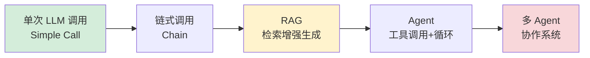
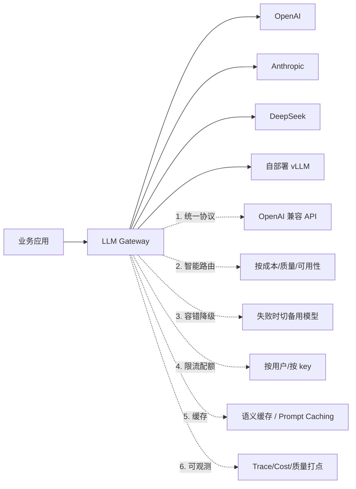
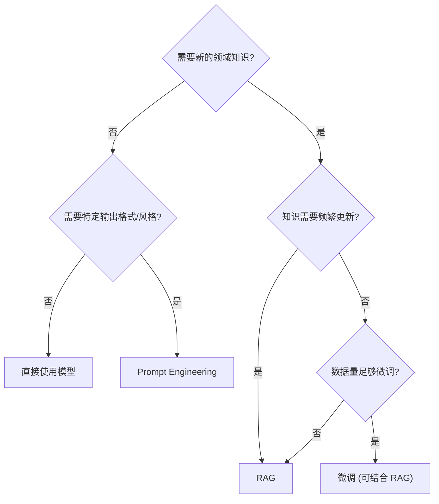
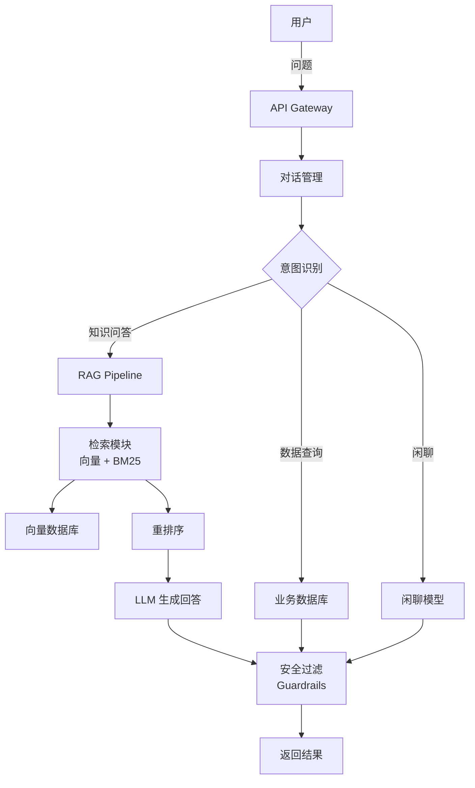

# AI 应用架构设计

<span class="dig-tag dig-tag--category">AI 技术</span> <span class="dig-tag dig-tag--hard">⭐⭐⭐ 高级</span> <span class="dig-tag dig-tag--hot">🔥🔥 中频</span>

::: tip 💡 核心要点
AI 应用架构设计涵盖从模型选型、推理优化到系统工程的完整链路。核心决策点包括：**何时使用 RAG vs 微调 vs Prompt Engineering**、**如何优化推理性能和成本**、**如何构建可靠的生产级 AI 系统**。这些知识是将 AI 理论落地为可用产品的关键。
:::

## LLM 应用架构模式

根据任务复杂度和需求，LLM 应用架构从简单到复杂分为多个层级：



### 架构选型指南

| 场景 | 推荐架构 | 原因 |
|------|----------|------|
| 文本分类、翻译、摘要 | 单次 LLM 调用 | 任务简单明确，无需额外复杂度 |
| 多步骤文档处理 | Prompt Chain | 步骤固定、可预测、无需动态决策 |
| 企业知识问答 | RAG Pipeline | 需要外部知识、实时更新、数据隐私 |
| 复杂研究任务 | Agent Loop | 需要动态决策、多工具协作 |
| 软件开发、数据分析 | 多 Agent 协作 | 任务可分解、需要多种专业能力 |

---

## 推理优化

> 更详细的推理优化技术介绍请参阅 [LLM 推理优化](./inference-optimization)。

### KV Cache

在自回归生成中，每生成一个新 Token 都需要计算注意力。由于已生成 Token 的 Key 和 Value 不会改变，可以将其**缓存**起来，避免重复计算。

KV Cache 缓存已计算的 Key/Value，每步只需计算新 Token 的 Q/K/V，将总计算量从 O(n^2) 降为每步 O(n)。(详见 [LLM 推理优化](./inference-optimization))

- KV Cache 是所有 LLM 推理框架的**标配优化**
- **代价**：显存消耗随序列长度线性增长（长上下文场景下成为瓶颈）

### 量化 Quantization

将模型参数从高精度（FP16/BF16）转换为低精度（INT8/INT4），减少显存占用和加速推理：

| 量化方案 | 精度损失 | 显存节省 | 特点 |
|----------|----------|----------|------|
| **FP16/BF16** | 无 | 基准 | 训练和推理标准精度 |
| **INT8** | 极低 | ~50% | 生产部署的安全选择 |
| **GPTQ** | 低 | ~75% | 训练后量化，需要校准数据集 |
| **AWQ** | 低 | ~75% | 保护"重要"权重，效果优于 GPTQ |
| **GGUF** | 低~中 | ~75% | llama.cpp 格式，支持 CPU 推理 |

### 推测解码 Speculative Decoding

使用一个**小模型（Draft Model）**快速生成多个候选 Token，再由**大模型一次性验证**：

```
小模型（快）: 连续预测 K 个 Token → [t1, t2, t3, t4, t5]
大模型（慢）: 一次性验证全部 K 个   → 接受前 3 个 [t1, t2, t3] ✓
                                      → 第 4 个拒绝，从大模型重新采样 t4'
```

- **不损失生成质量**——数学上保证与大模型直接生成等价
- 推理速度可提升 **2~3 倍**
- 适用于大模型推理延迟敏感的场景

### 连续批处理 Continuous Batching

传统静态批处理在所有请求完成后才整体返回，导致短请求被长请求拖慢。连续批处理允许请求在完成后立即返回，新请求可随时加入：

静态批处理要求所有请求完成后才整体返回；连续批处理允许请求完成后立即释放资源，新请求可随时加入当前批次。(详见 [LLM 推理优化](./inference-optimization))

---

## 模型服务框架

| 框架 | 特点 | 适用场景 |
|------|------|----------|
| **vLLM** | PagedAttention、连续批处理、高吞吐 | 大规模生产部署 |
| **TGI（Text Generation Inference）** | Hugging Face 官方、Docker 部署简单 | Hugging Face 生态 |
| **Ollama** | 一键部署、支持 GGUF 格式、Mac 友好 | 本地开发和实验 |
| **TensorRT-LLM** | NVIDIA 深度优化、最高性能 | NVIDIA GPU 生产环境 |
| **llama.cpp** | 纯 C++ 实现、支持 CPU 推理 | 边缘设备、低资源环境 |

---

## API 设计

### 流式传输 Streaming

LLM 生成通常需要数秒到数十秒，使用 Server-Sent Events（SSE）流式返回可显著改善用户体验：

```python
from fastapi import FastAPI
from fastapi.responses import StreamingResponse

app = FastAPI()

async def generate_stream(prompt: str):
    """流式生成 LLM 响应"""
    async for chunk in llm.stream(prompt):
        yield f"data: {json.dumps({'text': chunk})}\n\n"
    yield "data: [DONE]\n\n"

@app.post("/v1/chat/completions")
async def chat(request: ChatRequest):
    if request.stream:
        return StreamingResponse(
            generate_stream(request.prompt),
            media_type="text/event-stream"
        )
    else:
        result = await llm.generate(request.prompt)
        return {"text": result}
```

### Token 预算控制

```python
class TokenBudget:
    """Token 预算管理器"""

    def __init__(self, max_input_tokens: int = 4096,
                 max_output_tokens: int = 2048):
        self.max_input = max_input_tokens
        self.max_output = max_output_tokens

    def check(self, prompt: str) -> bool:
        input_tokens = self.count_tokens(prompt)
        if input_tokens > self.max_input:
            raise TokenBudgetExceeded(
                f"输入 {input_tokens} tokens 超过限制 {self.max_input}"
            )
        return True

    def truncate_context(self, context: str, reserved: int = 512) -> str:
        """截断上下文以适应 Token 预算"""
        max_context = self.max_input - reserved
        tokens = self.tokenize(context)
        if len(tokens) > max_context:
            tokens = tokens[:max_context]
        return self.detokenize(tokens)
```

---

## 成本优化

### 模型路由

根据查询复杂度**动态选择模型**——简单问题用小模型，复杂问题用大模型：

```python
class ModelRouter:
    """根据查询复杂度路由到不同模型"""

    def __init__(self):
        self.models = {
            "simple": "claude-haiku-4-5-20251001",    # 低成本
            "complex": "claude-sonnet-4-6",     # 高能力
        }

    def route(self, query: str) -> str:
        complexity = self.classify_complexity(query)
        return self.models[complexity]

    def classify_complexity(self, query: str) -> str:
        # 简单规则或用轻量级分类器判断
        if len(query) < 50 and "?" in query:
            return "simple"
        return "complex"
```

### LLM 网关与多模型管理

2025 年起，**LLM 网关（Gateway）** 已成为生产 AI 应用的标准中间件——所有 LLM 调用不直接打到 OpenAI/Anthropic/DeepSeek，而是先经过统一网关。这是 2025-2026 年 AI 架构面试的高频考点。

#### 为什么需要 LLM 网关

| 痛点（没网关）| 解决（有网关）|
|------------|------------|
| 切换模型要改一堆代码 | 统一 OpenAI 兼容协议，换模型只改配置 |
| 各家 SDK 错误处理不一 | 网关层统一重试、降级、超时 |
| 单家厂商宕机就全挂 | 多家厂商自动故障转移（Fallback） |
| 成本/用量不可见 | 网关统一打点、计费、限额 |
| 各业务线 API Key 混乱 | 网关统一鉴权、虚拟密钥 |
| 缓存逻辑每个应用各写 | 网关层做语义缓存，全局复用 |

#### 主流 LLM 网关对比

| 方案 | 部署 | 核心特性 | 适用 |
|------|------|---------|------|
| **LiteLLM** | 自建 / SaaS | 100+ 模型统一 SDK，路由 / 重试 / 缓存 / Spend Tracking | **最广泛使用**，Python 团队首选 |
| **Portkey** | SaaS / 自建 | 网关 + 可观测 + Prompt 库 + Guardrails | 想要"开箱即用全套" |
| **Helicone** | SaaS / 自建 | 轻量代理，重点在可观测与成本分析 | 已有调用层，只想加观测 |
| **OpenRouter** | SaaS | 100+ 模型聚合，按 token 转售 | 个人/小团队快速试模型 |
| **Kong AI Gateway** | 自建 | 企业级 API 网关 + AI 插件 | 已用 Kong 的企业 |
| **自建网关** | 自建 | 完全可控 | 大厂、合规要求严苛 |

#### LLM 网关的 6 大职责（面试黄金答案）



#### LiteLLM 最小实战

```python
import litellm

# 1. 统一 API 调用任何模型
response = litellm.completion(
    model="claude-sonnet-4-6",     # 改成 "gpt-4o" / "deepseek-chat" 即可
    messages=[{"role": "user", "content": "Hello"}],
)

# 2. 自动 Fallback：主模型失败时按列表降级
response = litellm.completion(
    model="claude-sonnet-4-6",
    messages=[...],
    fallbacks=["gpt-4o", "deepseek-chat"],  # Claude 挂了打 GPT，再挂打 DeepSeek
)

# 3. 路由策略（最低延迟 / 最低成本 / 加权轮询）
from litellm import Router
router = Router(
    model_list=[
        {"model_name": "smart", "litellm_params": {"model": "claude-sonnet-4-6"}},
        {"model_name": "smart", "litellm_params": {"model": "gpt-4o"}},
        {"model_name": "smart", "litellm_params": {"model": "deepseek-chat"}},
    ],
    routing_strategy="latency-based-routing",  # 自动挑当前最快的
)
response = router.completion(model="smart", messages=[...])
```

#### 自建 vs 用现成网关

| 维度 | 用 LiteLLM/Portkey | 自建网关 |
|------|-------------------|---------|
| **接入速度** | 1 天 | 数周 |
| **可观测/计费** | 开箱即用 | 自研 |
| **合规/数据出境** | 受厂商政策约束 | 完全自控 |
| **极致性能** | 中（多一跳代理）| 高（可贴近业务优化）|
| **推荐起点** | 早期 + 中等规模 | 大流量 + 强合规 |

**面试加分点**：能区分 **LLM 网关 vs Model Router vs Reverse Proxy**——
- **Reverse Proxy**（Nginx）只做转发，不懂 LLM 协议
- **Model Router** 只决定"这个请求用哪个模型"，是网关内的一个模块
- **LLM Gateway** 是包含 Router + 协议适配 + 容错 + 计费 + 缓存 + 可观测的**完整中间件层**

### 缓存策略

| 层级 | 说明 | 效果 |
|------|------|------|
| **Prompt 缓存** | 缓存 System Prompt 的编码结果（Anthropic Prompt Caching） | 减少 90% 预处理 Token 成本 |
| **语义缓存** | 对语义相似的查询返回缓存结果 | 避免重复 LLM 调用 |
| **响应缓存** | 对完全相同的输入缓存输出 | 零延迟返回 |

### 成本估算参考

> **注意**：模型定价变化频繁，以下仅为参考。请以各提供商官网最新定价为准。

| 模型 | 输入价格（/1M Token） | 输出价格（/1M Token） |
|------|----------------------|----------------------|
| GPT-4o | $2.50 | $10.00 |
| GPT-4.1 | $2.00 | $8.00 |
| Claude Sonnet 4.6 | $3.00 | $15.00 |
| Claude Haiku 4.5 | $0.80 | $4.00 |
| Qwen 2.5（自部署） | 硬件成本 | 硬件成本 |

---

## 安全与护栏

### 输入过滤

```python
class InputGuard:
    """输入安全检查"""

    def check(self, user_input: str) -> tuple[bool, str]:
        # 1. 长度限制
        if len(user_input) > 10000:
            return False, "输入过长"

        # 2. Prompt 注入检测
        injection_patterns = [
            r"忽略(之前|以上|所有)(的)?(指令|规则)",
            r"ignore (previous|all) instructions",
            r"system prompt",
        ]
        for pattern in injection_patterns:
            if re.search(pattern, user_input, re.IGNORECASE):
                return False, "检测到潜在的 Prompt 注入"

        # 3. PII 检测（个人身份信息）
        if self.detect_pii(user_input):
            return False, "输入包含个人身份信息"

        return True, "通过"
```

### 输出过滤

- **内容审核**：检查输出是否包含有害、违规内容
- **事实核验**：对关键声明与知识库交叉验证
- **格式校验**：确保输出符合预期的结构化格式
- **来源引用**：RAG 场景要求模型标注信息来源

---

## 可观测性

### LLM 调用追踪

生产级 AI 系统需要完整的调用链追踪：

| 维度 | 需要记录的信息 |
|------|---------------|
| **请求** | Prompt 内容、模型名称、参数（temperature 等） |
| **响应** | 输出内容、Token 用量（input/output）、延迟 |
| **RAG** | 检索到的文档、相似度分数、重排序结果 |
| **Agent** | 每步决策、工具调用、中间结果 |
| **成本** | 单次调用成本、累计成本、预算剩余 |

常用的 LLM 可观测性工具：**LangSmith**、**Helicone**、**Langfuse**。

---

## 架构选型：RAG vs 微调 vs Prompt Engineering

| 维度 | Prompt Engineering | RAG | 微调 |
|------|-------------------|-----|------|
| **知识更新** | 不改变模型知识 | 实时更新知识库 | 需要重新训练 |
| **成本** | 最低 | 中等（向量数据库+检索） | 最高（训练+数据） |
| **实施周期** | 分钟级 | 天级 | 周级 |
| **适用场景** | 通用任务、格式控制 | 企业知识问答、文档检索 | 领域适配、行为调整 |
| **数据需求** | 无 | 需要知识库 | 需要标注数据 |

### 决策流程



---

## LLMOps

### MCP（Model Context Protocol）

MCP 是由 Anthropic 提出并逐步成为行业标准的**模型-工具集成协议**。它定义了 LLM 应用与外部工具、数据源之间的标准化通信方式：

- **统一接口**：工具提供方只需实现一次 MCP Server，即可被所有支持 MCP 的客户端调用
- **动态发现**：LLM 应用可以在运行时发现和连接可用的工具和数据源
- **标准化交互**：定义了 Resources（数据读取）、Tools（操作执行）、Prompts（提示模板）三类能力
- **生态兼容**：已被 Claude Code、Cursor、VS Code 等主流开发工具采用

在架构设计中，MCP 正在替代传统的自定义 Function Calling 集成方式，成为 Agent 和工具调用场景的标准模式。

将 DevOps 理念应用到 LLM 应用的全生命周期管理：

| 实践 | 说明 |
|------|------|
| **Prompt 版本管理** | 使用 Git 管理 Prompt 模板，变更可追溯 |
| **评估自动化** | CI/CD 中集成 Prompt 回归测试，防止 Prompt 修改导致质量退化 |
| **A/B 测试** | 线上灰度对比不同 Prompt 或模型的效果 |
| **监控告警** | 对延迟、成本、错误率设置阈值告警 |
| **回退机制** | 模型服务异常时自动降级到备用模型 |

---

::: warning ⚠️ 常见误区

1. **所有场景都上 Agent**：Agent 引入了循环和不确定性，简单任务使用 Agent 会增加延迟、成本和不可预测性。**先尝试最简单的架构，复杂度不够时再升级。**

2. **忽视推理成本**：LLM API 按 Token 计费，未做成本控制的系统在流量上涨时成本可能失控。必须在架构层面设计预算、缓存和模型路由。

3. **不做评估就上线**：没有持续评估体系的 AI 系统会在"不知不觉中退化"。模型更新、数据变化、Prompt 修改都可能影响输出质量。

4. **低估安全风险**：Prompt 注入、数据泄露、有害内容生成是 AI 应用特有的安全风险。必须在输入和输出两侧都设置安全护栏。

:::

---

<div class="dig-questions">
  <div class="dig-questions__header">
    <span>📝 面试真题</span>
    <span style="font-size: 12px; opacity: 0.8;">3 道高频</span>
  </div>
  <div class="dig-questions__item">
    <span>1. 设计一个企业级知识问答系统的整体架构</span>
    <span class="dig-tag dig-tag--hard" style="margin: 0;">困难</span>
  </div>
  <div class="dig-questions__item">
    <span>2. 如何优化 LLM 推理的延迟和成本？</span>
    <span class="dig-tag dig-tag--medium" style="margin: 0;">中等</span>
  </div>
  <div class="dig-questions__item">
    <span>3. RAG、微调、Prompt Engineering 各适用什么场景？如何选择？</span>
    <span class="dig-tag dig-tag--medium" style="margin: 0;">中等</span>
  </div>
</div>

## 面试真题详解

### Q1：设计一个企业级知识问答系统的整体架构

**要点**：

**架构全景**：



**关键设计决策**：
1. 混合检索（语义+关键词）确保召回率
2. 两阶段检索（粗排+精排）平衡速度和精度
3. 语义缓存减少重复 LLM 调用
4. 流式响应改善用户体验
5. 输入/输出双重安全过滤

---

### Q2：如何优化 LLM 推理的延迟和成本？

**要点**：

**延迟优化**：
- **KV Cache**：避免重复计算注意力，标配优化
- **量化**：INT8/INT4 减少计算量，推理速度提升 2-4 倍
- **推测解码**：小模型草稿+大模型验证，速度提升 2-3 倍
- **连续批处理**：vLLM 的 PagedAttention，提高 GPU 利用率
- **流式响应**：SSE 让用户看到逐 Token 输出，感知延迟大幅降低

**成本优化**：
- **模型路由**：简单查询→小模型（Haiku），复杂查询→大模型（Sonnet）
- **Prompt 缓存**：Anthropic Prompt Caching 可减少 90% 预处理 Token 成本
- **语义缓存**：相似查询直接返回缓存结果
- **Prompt 精简**：减少冗余指令，压缩 System Prompt
- **输出长度控制**：设置合理的 max_tokens，避免冗长输出

---

### Q3：RAG、微调、Prompt Engineering 各适用什么场景？如何选择？

**要点**：

| 方面 | Prompt Engineering | RAG | 微调 |
|------|-------------------|-----|------|
| **核心能力** | 改变模型行为方式 | 注入外部知识 | 改变模型内在能力 |
| **适用场景** | 格式控制、角色设定、简单任务 | 知识问答、实时信息、私有数据 | 领域专精、风格适配 |
| **实施成本** | 最低 | 中等 | 最高 |
| **迭代速度** | 最快 | 中等 | 最慢 |

**选择原则**：
1. **先试 Prompt Engineering**——80% 的需求可以通过好的 Prompt 解决
2. **需要外部知识用 RAG**——特别是知识需要频繁更新的场景
3. **行为模式改变用微调**——如统一输出风格、领域术语适配
4. **三者可以组合**——如"微调模型 + RAG 知识库 + 精心设计的 Prompt"

---

## 延伸阅读

- [Building LLM Applications for Production (Chip Huyen)](https://huyenchip.com/2023/04/11/llm-engineering.html)
- [Efficient Memory Management for LLM Serving with PagedAttention (vLLM)](https://arxiv.org/abs/2309.06180)
- [A Survey on Efficient Inference for Large Language Models](https://arxiv.org/abs/2404.14294)
- [Model Context Protocol (MCP) Specification](https://modelcontextprotocol.io/)
