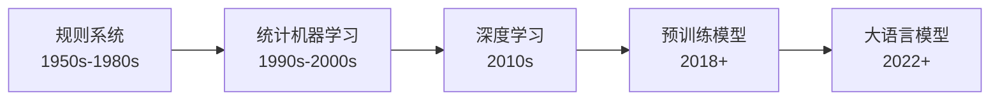
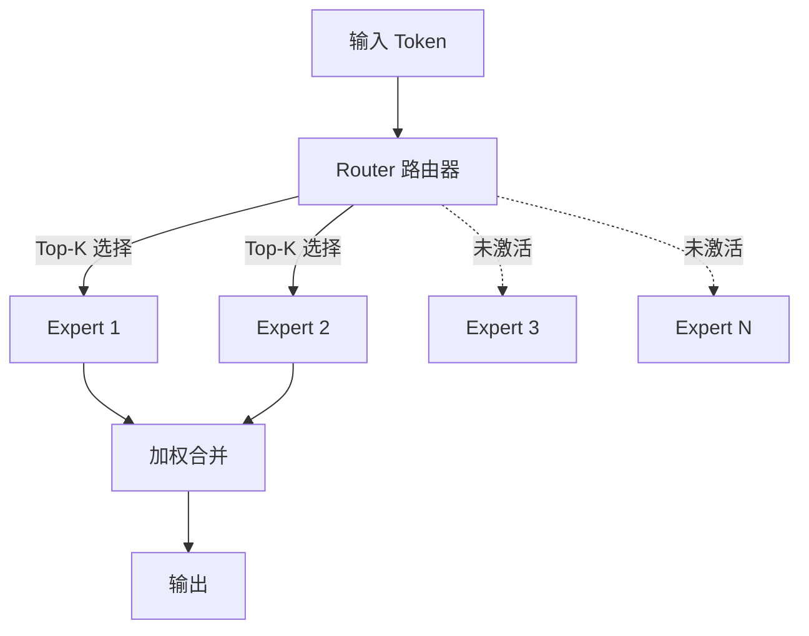

# AI 概述与发展历程

<span class="dig-tag dig-tag--category">AI 技术</span> <span class="dig-tag dig-tag--easy">⭐ 入门</span> <span class="dig-tag dig-tag--hot">🔥 低频</span>

::: tip 💡 核心要点
人工智能（Artificial Intelligence, AI）是让机器模拟人类智能的技术总称。当前 AI 的核心是**大语言模型（LLM）**，基于 Transformer 架构和海量数据训练，具备强大的语言理解与生成能力。理解 AI 的发展脉络和核心概念分类，是深入学习 LLM、RAG、Agent 等技术的基础。
:::

## 什么是人工智能

人工智能是计算机科学的一个分支，旨在构建能够执行通常需要人类智能的任务的系统。根据能力范围，AI 可分为三个层次：

| 层次 | 定义 | 现状 |
|------|------|------|
| **弱 AI（Narrow AI）** | 针对特定任务的智能系统 | 当前所有 AI 系统，包括 GPT-4o、Claude 4、o3 |
| **强 AI（AGI）** | 具备人类级别通用智能 | 尚未实现，是行业主要研究方向 |
| **超级 AI（ASI）** | 全面超越人类智能 | 纯理论阶段 |

当前所有商用 AI 系统——无论是 ChatGPT、Claude 还是自动驾驶——都属于弱 AI 范畴。

---

## 发展历程

AI 的发展经历了多次范式转变，每一次都伴随着核心方法论的根本性变化：



### 关键里程碑

| 年份 | 事件 | 意义 |
|------|------|------|
| 1950 | 图灵测试提出 | 首次定义"机器智能"的评判标准 |
| 1997 | 深蓝击败国际象棋冠军 | 规则系统的巅峰 |
| 2012 | AlexNet 赢得 ImageNet | 深度学习革命的起点 |
| 2017 | Transformer 论文发表 | 注意力机制取代 RNN，成为后续所有 LLM 的基础 |
| 2018 | BERT / GPT 发布 | 预训练+微调范式确立 |
| 2020 | GPT-3（175B 参数） | 展示 In-Context Learning 涌现能力 |
| 2022 | ChatGPT 发布 | LLM 进入大众视野，RLHF 对齐技术成熟 |
| 2023 | GPT-4 / Claude 2 | 多模态能力、长上下文、推理能力大幅提升 |
| 2024 | 模型全面进化 | Claude 3/3.5、GPT-4o、Gemini 1.5、LLaMA 3、o1 推理模型；开源模型缩小与闭源差距 |
| 2025 | 推理模型与 Agent 爆发 | Claude 4、GPT-4.1、o3/o4-mini、Gemini 2.5、DeepSeek R1、LLaMA 4；AI Agent 进入生产 |

---

## AI 模型分类

### 按学习方式分类

| 类型 | 定义 | 典型应用 |
|------|------|----------|
| **监督学习** | 从标注数据中学习输入→输出映射 | 分类、回归、目标检测 |
| **无监督学习** | 从无标注数据中发现结构和模式 | 聚类、降维、异常检测 |
| **自监督学习** | 从数据本身构造监督信号 | LLM 预训练（下一个词预测）、BERT（掩码预测） |
| **强化学习** | 通过与环境交互和奖励信号学习策略 | 游戏 AI、RLHF 对齐、机器人控制 |

LLM 的训练本质上是**自监督学习**——通过预测下一个 Token 来学习语言的统计规律，不需要人工标注。

### 按模型功能分类

| 类型 | 特点 | 代表模型 |
|------|------|----------|
| **判别式模型（Discriminative）** | 学习 $P(Y\|X)$，预测类别或标签 | BERT、分类器、检测模型 |
| **生成式模型（Generative）** | 学习 $P(X)$ 或 $P(X\|Y)$，生成新数据 | GPT 系列、Claude、Stable Diffusion |

当前 LLM 属于生成式模型——给定前文，生成后续文本。

### 按架构分类

| 架构 | 特点 | 代表 | 适用任务 |
|------|------|------|----------|
| **Encoder-Only** | 双向注意力，适合理解 | BERT | 文本分类、NER、语义相似度 |
| **Decoder-Only** | 因果注意力，自回归生成 | GPT、Claude、LLaMA | 文本生成、对话、推理 |
| **Encoder-Decoder** | 编码器理解+解码器生成 | T5、BART | 翻译、摘要 |

**当前主流 LLM 几乎全部采用 Decoder-Only 架构。**

---

## Scaling Laws 规模定律

2020 年 OpenAI 发表的 Scaling Laws 研究揭示了一个关键规律：模型性能（用交叉熵损失衡量）主要取决于三个因素，且可预测地随规模增长而提升：

$$
L(N, D, C) \approx \left(\frac{N_c}{N}\right)^{\alpha_N} + \left(\frac{D_c}{D}\right)^{\alpha_D} + L_\infty
$$

其中 $N$ 为参数量，$D$ 为数据量，$C$ 为计算量，$L_\infty$ 为不可约损失。

核心发现：
- **参数量、数据量、计算量**三者同步增长时，模型性能持续提升
- 存在**涌现能力（Emergent Abilities）**：某些能力只在模型达到一定规模后才突然出现
- **Chinchilla 定律**（2022）：最优训练应保持参数量和数据 Token 数大致 1:20 的比例

这解释了为什么 LLM 的参数量从 GPT-2 的 1.5B 一路增长到 GPT-4 级别的数千亿参数。

---

## 2024-2025 主流模型格局

| 模型 | 开发者 | 架构 | 参数规模 | 开源 | 特点 |
|------|--------|------|----------|------|------|
| **GPT-4o / 4.1** | OpenAI | Decoder-Only (MoE) | 未公开 | 否 | 多模态原生；GPT-4.1（2025.4）强化指令遵循与长上下文 |
| **o1 / o3 / o4-mini** | OpenAI | Decoder-Only | 未公开 | 否 | 推理模型系列，链式思考（CoT）推理能力突出 |
| **Claude 3.5 Sonnet** | Anthropic | Decoder-Only | 未公开 | 否 | 长上下文（200K）、代码能力强、安全对齐 |
| **Claude 4.6 Opus/Sonnet** | Anthropic | Decoder-Only | 未公开 | 否 | 2025 旗舰，代码与推理能力大幅提升，支持 Agent 场景 |
| **Gemini 2.0/2.5** | Google | Decoder-Only | 未公开 | 否 | 原生多模态、长上下文（1M+）、搜索集成 |
| **LLaMA 3 / 4** | Meta | Decoder-Only | 8B-405B / MoE | 是 | 社区生态丰富；LLaMA 4（2025）引入 MoE 架构 |
| **Qwen 2.5** | 阿里云 | Decoder-Only | 0.5B ~ 72B | 是 | 中英文表现优异 |
| **DeepSeek V3 / R1** | DeepSeek | Decoder-Only (MoE) | 671B (37B 激活) | 是 | V3 高性价比训练；R1（2025）推理能力对标 o1 |
| **Mistral Large** | Mistral | Decoder-Only (MoE) | 未公开 | 部分 | 欧洲团队、高效架构 |

### MoE（Mixture of Experts）架构

MoE 是近年来大模型的重要趋势。与稠密模型（Dense Model）不同，MoE 在每次推理时只激活部分参数：



- **优势**：总参数量大（知识容量高），但每次推理计算量与小模型相当
- **代表**：GPT-4（传闻 8×220B）、DeepSeek V3（671B 总参/37B 激活）、Mixtral、LLaMA 4 Scout/Maverick

---

## 多模态 AI

多模态 AI 能够同时处理和生成多种类型的数据：

| 模态 | 能力 | 代表模型 |
|------|------|----------|
| **文本 + 图像理解** | 看图说话、图表分析、OCR | GPT-4o、Claude 4.6 Sonnet、Gemini 2.5 |
| **图像生成** | 根据文本描述生成图像 | DALL-E 3、Midjourney、Stable Diffusion |
| **语音** | 语音识别 + 语音合成 | Whisper、GPT-4o |
| **视频** | 视频理解与生成 | Sora、Gemini |

多模态能力使 AI 从"只能读文字"扩展到"能看、能听、能画"，极大拓宽了应用场景。

---

## AI 技术全景图

本章节的后续文章按以下结构组织，由基础到进阶：

```
AI Technology
|
+-- Fundamentals
|   +-- AI Overview
|   +-- LLM Principles
|
+-- LLM Applications
|   +-- Prompt Engineering
|   +-- Embedding & Vector DB
|   +-- RAG
|
+-- AI Agent
|   +-- Agent Architecture
|   +-- MCP
|
+-- AI Engineering
    +-- Fine-tuning
    +-- Architecture Design
```

建议的学习路径：
1. **入门**：本文 → [LLM 大语言模型原理](./llm-fundamentals)
2. **应用**：[Prompt Engineering](./prompt-engineering) → [Embedding 与向量数据库](./embedding-and-vector-db) → [RAG](./rag)
3. **进阶**：[AI Agent 智能体](./ai-agents) → [模型微调与训练](./model-training) → [AI 应用架构设计](./ai-architecture)

---

::: warning ⚠️ 常见误区

1. **混淆 AI、机器学习、深度学习的关系**：AI 是最广义的概念，机器学习是 AI 的子集，深度学习是机器学习的子集，LLM 是深度学习的一个具体方向。它们是包含关系，不是并列关系。

2. **认为参数量越大模型越好**：Scaling Laws 只说明性能随规模提升，但实际效果还取决于训练数据质量、对齐方法、架构设计等。小模型配合好的数据和微调，可能在特定任务上超过大模型。

3. **混淆开源与闭源模型的使用场景**：闭源模型（GPT-4o、Claude 4）通常更强但有 API 成本和数据隐私顾虑；开源模型（LLaMA、Qwen、DeepSeek）可私有部署但需要自己管理基础设施。选择取决于具体需求。

:::

---

<div class="dig-questions">
  <div class="dig-questions__header">
    <span>📝 面试真题</span>
    <span style="font-size: 12px; opacity: 0.8;">3 道基础</span>
  </div>
  <div class="dig-questions__item">
    <span>1. 简述 AI、机器学习、深度学习、大语言模型之间的关系</span>
    <span class="dig-tag dig-tag--easy" style="margin: 0;">简单</span>
  </div>
  <div class="dig-questions__item">
    <span>2. Scaling Laws 的核心发现是什么？对 LLM 发展有什么指导意义？</span>
    <span class="dig-tag dig-tag--medium" style="margin: 0;">中等</span>
  </div>
  <div class="dig-questions__item">
    <span>3. 对比 Encoder-Only、Decoder-Only、Encoder-Decoder 三种架构的区别和适用场景</span>
    <span class="dig-tag dig-tag--medium" style="margin: 0;">中等</span>
  </div>
</div>

## 面试真题详解

### Q1：简述 AI、机器学习、深度学习、大语言模型之间的关系

**要点**：

它们是**层层包含**的关系：

> **AI ⊃ ML ⊃ DL ⊃ LLM**：人工智能（AI）包含机器学习（ML），机器学习包含深度学习（DL），大语言模型（LLM）是深度学习中基于 Transformer 的一个分支。

- **AI**：让机器模拟人类智能的总称，包括规则系统、搜索算法等非 ML 方法
- **ML**：通过数据自动学习规律的方法，是 AI 的主流实现路径
- **DL**：使用多层神经网络的 ML 方法，能自动学习特征表示
- **LLM**：基于 Transformer 架构、参数量达数十亿以上的语言模型，是 DL 在 NLP 方向的最新进展

---

### Q2：Scaling Laws 的核心发现是什么？对 LLM 发展有什么指导意义？

**要点**：

Scaling Laws（规模定律）的核心发现：
- 模型性能（交叉熵损失）与**参数量 N、数据量 D、计算量 C** 呈幂律关系
- 三者需要**同步增长**才能高效提升性能
- 性能提升是**可预测**的——可以用小规模实验预测大规模训练的结果

**指导意义**：
1. 为"堆算力"提供了理论依据——只要资源到位，性能提升是确定性的
2. **Chinchilla 定律**指出最优的参数-数据配比约为 1:20，避免了"只堆参数不堆数据"的浪费
3. 解释了**涌现能力**——某些能力（如推理、代码生成）只在模型达到一定规模后才出现
4. 指导了训练资源的分配决策——在固定计算预算下，如何分配参数量和训练数据量

---

### Q3：对比 Encoder-Only、Decoder-Only、Encoder-Decoder 三种架构

**要点**：

| 维度 | Encoder-Only | Decoder-Only | Encoder-Decoder |
|------|-------------|-------------|-----------------|
| **注意力方式** | 双向注意力 | 因果注意力（只看前文） | 编码器双向 + 解码器因果 |
| **预训练任务** | 掩码语言模型（MLM） | 下一个词预测（NTP） | 去噪自编码 |
| **代表模型** | BERT、RoBERTa | GPT、Claude、LLaMA | T5、BART |
| **擅长任务** | 理解类（分类、NER） | 生成类（对话、写作） | 序列到序列（翻译、摘要） |

**为什么当前主流 LLM 都是 Decoder-Only？**
1. 自回归生成天然适合对话和文本创作
2. 架构简单，易于扩展到大规模参数
3. 在足够大的规模下，Decoder-Only 模型也能很好地完成理解类任务
4. Scaling Laws 在 Decoder-Only 架构上得到了最充分的验证

---

## 延伸阅读

- [Attention Is All You Need (Vaswani et al., 2017)](https://arxiv.org/abs/1706.03762)
- [Scaling Laws for Neural Language Models (Kaplan et al., 2020)](https://arxiv.org/abs/2001.08361)
- [Training Compute-Optimal Large Language Models (Chinchilla, 2022)](https://arxiv.org/abs/2203.15556)
- [A Survey of Large Language Models (Zhao et al., 2023)](https://arxiv.org/abs/2303.18223)
