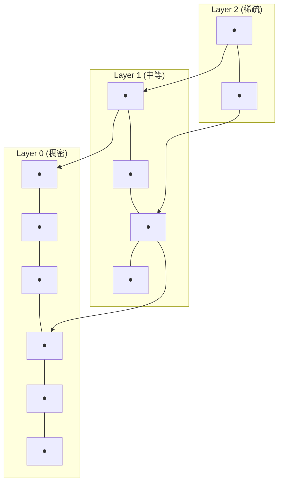

# Embedding 与向量数据库

<span class="dig-tag dig-tag--category">AI 技术</span> <span class="dig-tag dig-tag--medium">⭐⭐ 中级</span> <span class="dig-tag dig-tag--hot">🔥🔥 中频</span>

::: tip 💡 核心要点
Embedding（嵌入）是将文本、图像等非结构化数据映射到**稠密向量空间**的技术，使得语义相近的内容在向量空间中距离更近。向量数据库则是专门用于**高效存储和检索**这些高维向量的基础设施。二者共同构成了 RAG、语义搜索、推荐系统等现代 AI 应用的底层支撑。
:::

## 什么是 Embedding

### 从离散到连续

传统文本表示（如 One-Hot 编码）将每个词映射为一个高维稀疏向量，无法捕获词与词之间的语义关系。Embedding 则将文本映射到低维稠密向量空间，使得：

- **语义相近的文本**在向量空间中**距离更近**
- **语义无关的文本**在向量空间中**距离更远**

```
传统表示 (One-Hot):
  "猫" = [1, 0, 0, 0, 0, ...]     维度 = 词表大小（数万）
  "狗" = [0, 1, 0, 0, 0, ...]     无法反映"猫"和"狗"的语义相近

Embedding 表示:
  "猫" = [0.21, -0.35, 0.68, ...]  维度 = 768~3072
  "狗" = [0.23, -0.31, 0.65, ...]  向量相近 → 语义相近
  "汽车" = [-0.45, 0.82, -0.12, ...]  向量远离 → 语义不同
```

### 发展历程

| 阶段 | 方法 | 特点 |
|------|------|------|
| **2013** | Word2Vec（CBOW / Skip-gram） | 首次将词映射到稠密向量，发现向量算术（king - man + woman ≈ queen） |
| **2014** | GloVe | 基于全局词共现统计训练词向量 |
| **2018** | ELMo / BERT | 上下文相关的动态 Embedding，同一个词在不同语境中有不同向量 |
| **2022+** | 专用 Embedding 模型 | 针对检索优化的 Embedding（对比学习训练），如 text-embedding-3、BGE |

在 Word2Vec 时代，每个词有一个**固定**的向量。现代 Embedding 模型基于 Transformer 编码器，生成的是**上下文相关**的句子/段落级 Embedding。

---

## Embedding 模型原理

### 编码器架构

现代 Embedding 模型通常基于 **BERT 类编码器**架构，通过双向注意力机制理解完整上下文：

```
Text --> Tokenizer --> Transformer Encoder --> Pooling --> Embedding Vector
                                                          [0.12, -0.34, ...]
```

### 训练方法：对比学习

现代 Embedding 模型主要通过**对比学习（Contrastive Learning）**训练：

$$
\mathcal{L} = -\log \frac{\exp(\text{sim}(q, d^+) / \tau)}{\exp(\text{sim}(q, d^+) / \tau) + \sum_{i=1}^{N} \exp(\text{sim}(q, d_i^-) / \tau)}
$$

其中 $q$ 是查询，$d^+$ 是正样本（相关文档），$d_i^-$ 是负样本（不相关文档），$\tau$ 是温度参数。

**核心思想**：拉近查询与相关文档的距离，推远查询与不相关文档的距离。

### 负样本挖掘策略

对比学习的效果高度依赖负样本的质量：

| 策略 | 说明 | 效果 |
|------|------|------|
| **随机负样本** | 从语料库随机采样 | 简单但效果有限 |
| **批内负样本** | 同一批次中其他样本的正样本作为负样本 | 高效，广泛使用 |
| **困难负样本** | 用 BM25 或初步模型检索出的"似是而非"的文档 | 显著提升模型区分能力 |

---

## 相似度度量

将文本转为 Embedding 后，需要定义"距离"来衡量两个向量的相似程度。

### 余弦相似度（Cosine Similarity）

$$
\text{cos\_sim}(\mathbf{a}, \mathbf{b}) = \frac{\mathbf{a} \cdot \mathbf{b}}{\|\mathbf{a}\| \cdot \|\mathbf{b}\|}
$$

- 范围：$[-1, 1]$，值越大越相似
- **忽略向量的长度**，只关注方向
- 最常用的相似度度量

### 欧氏距离（Euclidean Distance）

$$
d(\mathbf{a}, \mathbf{b}) = \sqrt{\sum_{i=1}^{n} (a_i - b_i)^2}
$$

- 范围：$[0, +\infty)$，值越小越相似
- 受向量长度影响
- 适合已归一化的向量

### 点积（Dot Product / Inner Product）

$$
\mathbf{a} \cdot \mathbf{b} = \sum_{i=1}^{n} a_i \cdot b_i
$$

- 范围：$(-\infty, +\infty)$，值越大越相似
- 同时考虑方向和长度
- 当向量已归一化时，等价于余弦相似度

### 如何选择

| 场景 | 推荐度量 | 原因 |
|------|----------|------|
| 通用语义搜索 | 余弦相似度 | 对向量长度不敏感，跨文档稳定 |
| 已归一化的向量 | 点积 | 计算更快，结果等价余弦 |
| 需要考虑"重要性"差异 | 点积 | 向量模长可编码重要性信息 |

---

## 主流 Embedding 模型

| 模型 | 开发者 | 维度 | 最大长度 | 特点 |
|------|--------|------|----------|------|
| **text-embedding-3-large** | OpenAI | 3072 | 8191 Token | 英文综合性能优异 |
| **text-embedding-3-small** | OpenAI | 1536 | 8191 Token | 性价比高 |
| **BGE-M3** | BAAI（智源） | 1024 | 8192 Token | 多语言、多粒度、多功能 |
| **GTE-Qwen2** | 阿里云 | 1536 | 32K Token | 长文本、中文表现优异 |
| **Jina-embeddings-v3** | Jina AI | 1024 | 8192 Token | 多语言、任务适配 |
| **Cohere embed-v3** | Cohere | 1024 | 512 Token | 支持压缩和搜索类型 |

### 选择要点

- **中文场景**：优先 BGE 系列或 GTE 系列，中文语义捕获更精准
- **多语言场景**：BGE-M3 或 Jina 系列
- **成本敏感**：text-embedding-3-small 性价比最高
- **长文本**：GTE-Qwen2 支持 32K Token 上下文
- **私有部署**：BGE 和 GTE 均为开源模型，可本地部署

---

## 向量数据库

### 为什么需要向量数据库

传统数据库（MySQL、PostgreSQL）擅长精确匹配查询（`WHERE id = 123`），但无法高效处理"找到与这个向量最相似的 K 个向量"的查询。

向量数据库解决的核心问题：
- **高维向量的高效相似度搜索**——在数百万到数十亿向量中，毫秒级返回 Top-K 结果
- **索引优化**——使用 ANN（近似最近邻）算法，用微小精度损失换取数量级的速度提升
- **混合查询**——结合向量相似度搜索和元数据过滤（如 `category = 'AI' AND similarity > 0.8`）

### 主流向量数据库

| 数据库 | 类型 | 特点 | 适用场景 |
|--------|------|------|----------|
| **Chroma** | 嵌入式 | 轻量、Python 原生、零配置 | 原型开发、小规模应用 |
| **Pinecone** | 云托管 | 全托管、自动扩缩容、无需运维 | 生产环境、无运维团队 |
| **Milvus** | 分布式 | 高性能、支持十亿级向量、开源 | 大规模生产、私有化部署 |
| **pgvector** | PostgreSQL 扩展 | 复用现有 PG 基础设施、支持 SQL 混合查询 | 已有 PG 技术栈的团队 |
| **Qdrant** | 独立部署 | Rust 实现、性能优异、过滤灵活 | 高性能需求的生产环境 |
| **FAISS** | 库（非数据库） | Meta 开发、纯向量检索、不含持久化 | 研究实验、自建存储层 |

---

## ANN 索引算法

精确最近邻搜索（暴力遍历所有向量）的时间复杂度为 $O(n \cdot d)$，在大规模数据集上不可接受。ANN 算法通过构建索引结构，将搜索从**线性扫描**加速到**对数级或亚线性级**。

### HNSW（Hierarchical Navigable Small World）

HNSW 是目前最流行的 ANN 索引算法，构建多层图结构：



查询过程：从最高层入口节点开始，在当前层贪心搜索最近邻，逐层下降，最终在底层返回 Top-K 结果。

- **时间复杂度**：$O(\log n)$
- **优点**：查询精度高（recall > 95%）、不需要训练
- **缺点**：内存占用大（需存储图结构），构建索引较慢
- **适用场景**：数据量 < 1 亿、对精度要求高

### IVF（Inverted File Index）

IVF 先将向量空间**聚类**成 $k$ 个区域，查询时只搜索最相关的 $n_{probe}$ 个区域：

> IVF 将向量空间划分为多个聚类（Voronoi cells），查询时只搜索最近的几个聚类，将搜索范围从全量缩小到 $\frac{nprobe}{nlist}$。

- **时间复杂度**：$O(n_{probe} \cdot n/k)$
- **优点**：内存效率高、适合大规模数据
- **缺点**：需要训练聚类中心、精度受 $n_{probe}$ 影响
- **适用场景**：数据量 > 1 亿、需要平衡速度和内存

### PQ（Product Quantization）

PQ 将高维向量**切分为多个子段**，每个子段独立量化压缩：

> PQ 将高维向量切分为多个子空间，每个子空间独立量化为码本索引，大幅压缩存储空间（如 128 维 float32 → 16 字节）。

- **优点**：极大减少内存占用（可压缩 32~64 倍）
- **缺点**：精度损失相对较大
- **适用场景**：十亿级以上数据、内存受限环境
- 通常与 IVF 结合使用（IVF-PQ）

### 索引选择对比

| 算法 | 查询速度 | 内存占用 | 精度 | 构建速度 | 推荐规模 |
|------|----------|----------|------|----------|----------|
| **暴力搜索** | 慢 | 低 | 100% | 无需构建 | < 10 万 |
| **HNSW** | 最快 | 高 | 最高 | 慢 | < 1 亿 |
| **IVF** | 快 | 中 | 高 | 中 | 1 亿+ |
| **PQ** | 快 | 最低 | 中 | 中 | 10 亿+ |
| **IVF-PQ** | 快 | 低 | 中高 | 中 | 10 亿+ |

---

## 实践：构建语义搜索

以下示例演示使用 OpenAI Embedding 和 FAISS 构建一个简单的语义搜索系统：

```python
import numpy as np
import faiss
from openai import OpenAI

client = OpenAI()

def get_embeddings(texts: list[str], model: str = "text-embedding-3-small") -> np.ndarray:
    """批量获取文本的 Embedding 向量"""
    response = client.embeddings.create(input=texts, model=model)
    return np.array([item.embedding for item in response.data], dtype="float32")

# 1. 准备文档
documents = [
    "Transformer 是一种基于自注意力机制的深度学习架构",
    "RAG 通过检索外部知识来增强语言模型的生成能力",
    "向量数据库使用 ANN 算法实现高效的相似度搜索",
    "LoRA 是一种参数高效的模型微调方法",
    "Docker 是一个开源的容器化平台",
    "Redis 是一个高性能的内存键值数据库",
]

# 2. 生成 Embedding 并构建索引
doc_embeddings = get_embeddings(documents)
dimension = doc_embeddings.shape[1]

index = faiss.IndexFlatIP(dimension)              # 内积索引（向量已归一化时等价余弦）
faiss.normalize_L2(doc_embeddings)                # L2 归一化
index.add(doc_embeddings)

# 3. 查询
query = "如何优化大模型的训练效率"
query_embedding = get_embeddings([query])
faiss.normalize_L2(query_embedding)

scores, indices = index.search(query_embedding, k=3)

print("查询:", query)
for i, (score, idx) in enumerate(zip(scores[0], indices[0])):
    print(f"  Top-{i+1} (相似度: {score:.4f}): {documents[idx]}")
```

---

## 生产环境最佳实践

### 索引调优

| 参数 | 影响 | 建议 |
|------|------|------|
| **HNSW: M**（每节点连接数） | M 越大精度越高，但构建越慢、内存越多 | 通常 16~64 |
| **HNSW: ef_construction** | 构建时搜索范围，越大索引质量越高 | 100~500 |
| **HNSW: ef_search** | 查询时搜索范围，越大精度越高 | 50~200 |
| **IVF: nlist**（聚类数） | 聚类越多查询越快但精度可能下降 | $\sqrt{n}$ 到 $4\sqrt{n}$ |
| **IVF: nprobe** | 搜索聚类数，越多精度越高但越慢 | nlist 的 1%~10% |

### 元数据过滤

生产中通常需要结合结构化过滤和向量搜索：

```python
# Qdrant 示例：结合元数据过滤
from qdrant_client import QdrantClient
from qdrant_client.models import Filter, FieldCondition, MatchValue

results = client.search(
    collection_name="articles",
    query_vector=query_embedding,
    query_filter=Filter(
        must=[
            FieldCondition(key="category", match=MatchValue(value="AI")),
            FieldCondition(key="language", match=MatchValue(value="zh")),
        ]
    ),
    limit=10,
)
```

### 关键决策

| 决策点 | 选项 | 建议 |
|--------|------|------|
| **Embedding 模型** | 开源 vs API 调用 | 小规模用 API（如 OpenAI），大规模或隐私敏感用开源（BGE） |
| **向量数据库** | 嵌入式 vs 独立部署 vs 云托管 | 原型用 Chroma，生产用 Milvus/Qdrant/Pinecone |
| **索引类型** | HNSW vs IVF vs PQ | 数据量小选 HNSW，数据量大选 IVF-PQ |
| **维度选择** | 高维 vs 低维 | 效果:高维 > 低维，速度:低维 > 高维。平衡点在 768~1536 |

---

::: warning ⚠️ 常见误区

1. **认为向量数据库可以替代传统数据库**：向量数据库专注于相似度搜索，不擅长精确匹配、事务处理、复杂 SQL 查询。两者是互补关系。

2. **忽视 Embedding 模型的选择**：不同 Embedding 模型对不同语言和领域的效果差异很大。中文场景使用英文模型可能导致检索质量大幅下降。

3. **混淆精确搜索和近似搜索**：ANN 算法返回的是**近似**最近邻，可能遗漏真正的最近邻。recall 参数的调优直接影响搜索质量。

4. **盲目追求高维 Embedding**：更高维度不一定带来更好效果，但一定会增加存储和计算成本。实际应用中 768~1536 维通常足够。

:::

---

<div class="dig-questions">
  <div class="dig-questions__header">
    <span>📝 面试真题</span>
    <span style="font-size: 12px; opacity: 0.8;">3 道高频</span>
  </div>
  <div class="dig-questions__item">
    <span>1. 解释 HNSW 索引算法的工作原理及其优缺点</span>
    <span class="dig-tag dig-tag--medium" style="margin: 0;">中等</span>
  </div>
  <div class="dig-questions__item">
    <span>2. 对比余弦相似度和点积，什么场景下结果一致？</span>
    <span class="dig-tag dig-tag--easy" style="margin: 0;">简单</span>
  </div>
  <div class="dig-questions__item">
    <span>3. 如何为千万级文档的语义搜索系统选择向量数据库和索引方案？</span>
    <span class="dig-tag dig-tag--hard" style="margin: 0;">困难</span>
  </div>
</div>

## 面试真题详解

### Q1：解释 HNSW 索引算法的工作原理及其优缺点

**要点**：

HNSW（Hierarchical Navigable Small World）是一种基于**多层图结构**的近似最近邻搜索算法：

**构建过程**：
1. 为每个向量随机分配一个层级（概率指数递减，高层节点少）
2. 在每层中，将新向量与最近的 M 个节点建立双向连接
3. 形成一个从稀疏（高层）到稠密（底层）的多层导航图

**查询过程**：
1. 从最高层的入口节点出发
2. 在当前层进行贪心搜索，找到局部最近邻
3. 下降到下一层，以上一层的结果为起点继续搜索
4. 在底层（Layer 0）找到最终的 Top-K 结果

**优点**：查询速度快（$O(\log n)$）、召回率高（> 95%）、无需训练、支持动态插入。
**缺点**：内存占用大（需存储图连接关系）、构建索引慢。

---

### Q2：对比余弦相似度和点积，什么场景下结果一致？

**要点**：

- **余弦相似度**只衡量向量的**方向**，忽略模长
- **点积**同时考虑向量的**方向和模长**

当向量已经过 **L2 归一化**（即 $\|\mathbf{a}\| = \|\mathbf{b}\| = 1$）时，两者结果完全一致：

$$
\text{cos\_sim}(\mathbf{a}, \mathbf{b}) = \frac{\mathbf{a} \cdot \mathbf{b}}{1 \times 1} = \mathbf{a} \cdot \mathbf{b}
$$

大多数 Embedding 模型输出的向量默认已归一化，因此实际应用中两者通常等价。使用点积计算更快（少一步归一化），所以生产环境中常用点积代替余弦相似度。

---

### Q3：如何为千万级文档的语义搜索系统选择向量数据库和索引方案？

**要点**：

**规模分析**：千万级（~10M）文档，假设 1536 维 Embedding。

**向量数据库选择**：
- 有 PostgreSQL 基础设施 → **pgvector**（简单，但性能到千万级可能瓶颈）
- 需要高性能 → **Qdrant** 或 **Milvus**
- 不想自运维 → **Pinecone**

**索引方案**：
- 千万级在 HNSW 的最佳适用范围内（< 1 亿）
- 推荐 **HNSW**：M=32, ef_construction=200, ef_search=100
- 内存估算：10M × 1536 × 4 bytes ≈ 60GB（原始向量）+ ~30GB（HNSW 图结构）≈ 90GB
- 如果内存受限，可选择 **IVF-PQ**：nlist=10000, 128 子段，内存可降至 ~10GB

**其他考虑**：
- 元数据过滤需求 → 选择支持 pre-filtering 的数据库（Qdrant、Milvus）
- 实时更新需求 → HNSW 支持动态插入，IVF 需要定期重建聚类
- 多副本高可用 → Milvus 或 Pinecone

---

## 延伸阅读

- [Efficient and robust approximate nearest neighbor search using Hierarchical Navigable Small World graphs](https://arxiv.org/abs/1603.09320)
- [Sentence-BERT: Sentence Embeddings using Siamese BERT-Networks](https://arxiv.org/abs/1908.10084)
- [Text Embeddings by Weakly-Supervised Contrastive Pre-training (E5)](https://arxiv.org/abs/2212.03533)
- [C-Pack: Packaged Resources To Advance General Chinese Embedding (BGE)](https://arxiv.org/abs/2309.07597)
