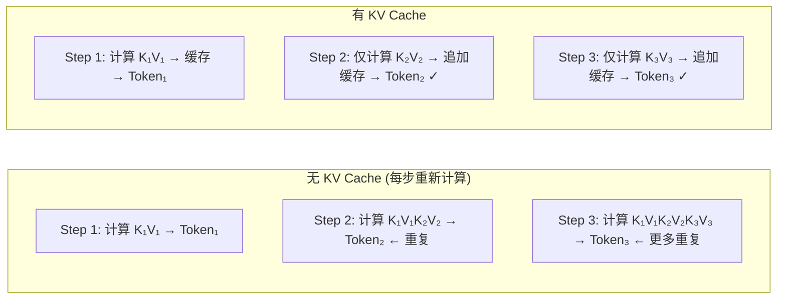
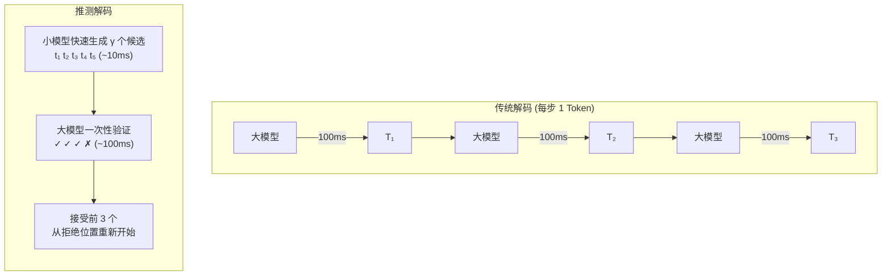

# LLM 推理优化

<span class="dig-tag dig-tag--category">AI 技术</span> <span class="dig-tag dig-tag--hard">⭐⭐⭐ 高级</span> <span class="dig-tag dig-tag--hot">🔥🔥🔥 高频</span>

::: tip 💡 核心要点
LLM 推理优化是系统设计面试的高频考点。自回归解码的**逐 Token 生成**特性使推理成为 memory-bound 任务，KV Cache、量化、推测解码和持续批处理是四大核心优化技术。理解这些技术的原理和权衡，是设计高性能 LLM 服务的基础。
:::

## 为什么推理优化重要

LLM 推理分为两个阶段：

- **预填充（Prefill）**：一次性处理所有输入 Token，是 **compute-bound**（计算密集型）
- **解码（Decode）**：逐个生成输出 Token，每步需要访问所有历史 KV 状态，是 **memory-bound**（访存密集型）

解码阶段是推理延迟的主要瓶颈——每生成一个 Token 都需要一次完整的前向传播，但实际计算量远小于显存读写量。优化推理的核心就是**减少访存、提高并行度、降低精度换取速度**。

### 推理性能三角

| 指标 | 含义 | 优化方向 |
|------|------|----------|
| **延迟（Latency）** | 首 Token 时间（TTFT）+ 每 Token 时间（TPOT） | 模型压缩、推测解码 |
| **吞吐量（Throughput）** | 每秒生成的 Token 数（tokens/s） | 批处理、并行化 |
| **成本（Cost）** | 每百万 Token 的计算费用 | 量化、缓存、模型选择 |

三者往往存在权衡：高吞吐可能增加单请求延迟，低精度量化降低成本但可能影响质量。

---

## KV Cache

### 原理

在自回归生成中，每生成一个新 Token，模型需要对整个序列（包括所有历史 Token）计算注意力。如果每步都重新计算所有 Token 的 Key 和 Value，会产生大量冗余计算。

**KV Cache 的核心思想**：缓存已计算的 Key 和 Value 矩阵，新 Token 生成时只需计算当前 Token 的 Q/K/V，然后与缓存的 K/V 拼接即可。



### KV Cache 显存开销

KV Cache 的大小随序列长度线性增长：

$$
\text{KV Cache Size} = 2 \times n_{\text{layers}} \times n_{\text{heads}} \times d_{\text{head}} \times \text{seq\_len} \times \text{batch\_size} \times \text{bytes}
$$

例如：LLaMA-70B（80 层、64 头、128 维、FP16）在序列长度 4096、batch=32 时，KV Cache 约需 **40 GB** 显存。

### KV Cache 优化技术

#### Multi-Query Attention (MQA) 与 Grouped-Query Attention (GQA)

标准多头注意力中，每个头有独立的 K/V。MQA 和 GQA 通过共享 K/V 头来减少 KV Cache 大小：

| 方案 | K/V 头数 | Cache 大小 | 质量 | 代表模型 |
|------|---------|-----------|------|----------|
| **MHA** | = Q 头数 | 100% | 最好 | GPT-3 |
| **GQA** | Q 头数 / g（分组） | 100/g % | 接近 MHA | LLaMA 2 70B, Qwen |
| **MQA** | 1 | 极小 | 略有下降 | PaLM, Falcon |

#### PagedAttention（vLLM 核心）

传统实现为每个请求预分配连续显存块存放 KV Cache，但实际序列长度不可预知，导致严重的**显存碎片化**。

PagedAttention 借鉴操作系统的虚拟内存分页思想：
- 将 KV Cache 分成固定大小的**页（Block）**
- 使用**页表**映射逻辑位置到物理显存
- 按需分配，避免预分配浪费
- 支持跨请求共享页（如共享 System Prompt 的 KV Cache）

显存利用率从传统方案的 ~50% 提升到 **>95%**。

#### KV Cache 压缩

| 技术 | 原理 | 场景 |
|------|------|------|
| **H2O（Heavy-Hitter Oracle）** | 保留注意力分数高的"重要"Token 的 KV，淘汰低分 Token | 超长序列 |
| **StreamingLLM** | 保留开头 Token + 滑动窗口内 Token 的 KV | 流式/无限长度生成 |
| **KV Cache 量化** | 将 KV Cache 从 FP16 压缩到 INT8/INT4 | 显存受限场景 |

---

## 量化 Quantization

量化是将模型权重和/或激活值从高精度（FP32/FP16）转换为低精度（INT8/INT4）表示，以减少显存占用和加速计算。

### 量化基础

| 精度 | 位宽 | 压缩比 | 说明 |
|------|------|--------|------|
| FP16 | 16 bit | 基准 | 标准训练精度 |
| INT8 | 8 bit | 2x 压缩 | 精度损失小 |
| INT4 | 4 bit | 4x 压缩 | 需要特殊处理 |

核心权衡：**精度 vs 速度 vs 显存**。INT4 量化可将 70B 模型从 140GB 压缩到 ~35GB，使其可在单卡（A100 80GB）上运行。

### 主流量化方案

| 方案 | 类型 | 原理 | 优势 | 局限 |
|------|------|------|------|------|
| **GPTQ** | 训练后量化 | 基于二阶信息（Hessian）逐层量化，需校准数据集 | 精度损失小，推理快 | 量化过程需数小时 |
| **AWQ** | 训练后量化 | 识别"重要"权重通道（基于激活分布），对其保持高精度 | 比 GPTQ 更快量化，质量相当 | 需要校准数据 |
| **GGUF** | 训练后量化 | llama.cpp 格式，支持 CPU+GPU 混合推理，多种量化级别（Q4_K_M 等） | 灵活部署，CPU 可运行 | CPU 推理速度有限 |
| **SmoothQuant** | 训练后量化 | 将激活的量化难度"转移"到权重上 | 同时量化权重和激活 | 实现复杂 |
| **QLoRA** | 训练时量化 | 4-bit 量化模型 + LoRA 微调 | 极低显存微调 | 仅用于微调场景 |

### 量化实践建议

- **INT8 量化**：几乎无损，推荐作为默认部署精度
- **INT4 量化**：适合显存受限场景，推荐使用 AWQ 或 GPTQ
- **本地部署**：使用 GGUF 格式 + llama.cpp / Ollama
- **微调**：使用 QLoRA（4-bit 量化 + LoRA）

---

## 推测解码 Speculative Decoding

推测解码通过**用小模型加速大模型推理**，在不改变输出分布的前提下提升生成速度。

### 原理



**关键保证**：通过拒绝采样（rejection sampling），推测解码的输出分布**严格等同于大模型直接生成**——不是近似，而是数学上精确等价。

### 加速效果

加速比取决于小模型与大模型的**一致率 α**（小模型生成被大模型接受的概率）：

$$
\text{Speedup} \approx \frac{\gamma \cdot \alpha}{1 + \gamma \cdot c}
$$

其中 $c$ 是小模型与大模型的速度比。典型场景下可实现 **2~3x 加速**。

### 变体

| 变体 | 特点 | 适用场景 |
|------|------|----------|
| **标准推测解码** | 独立小模型作为 Draft Model | 通用场景 |
| **Self-Speculative** | 跳过大模型部分层作为 Draft | 无需额外小模型 |
| **Medusa** | 在大模型头部添加多个预测头，同时预测多个未来位置 | 高一致率场景 |
| **EAGLE** | 学习特征级别的 Draft，而非 Token 级别 | 更高加速比 |

---

## 持续批处理 Continuous Batching

### 静态批处理的问题

传统静态批处理等待一批请求凑齐后一起处理，所有请求必须等最长的请求完成：

**静态批处理**：所有请求必须等最长请求完成才能释放，导致 GPU 大量空闲。

**持续批处理**：请求完成后立即释放资源，新请求可在任意解码步加入当前批次。

### 持续批处理（Iteration-Level Scheduling）

核心思想：在**每个解码步（iteration）**粒度进行调度——

- 请求完成后**立即释放**资源
- 新请求可在**任意解码步**加入当前批次
- GPU 利用率从静态批处理的 ~30% 提升到 **>80%**

这是 vLLM、TGI 等推理框架的核心调度策略。

---

## MoE 推理优化

MoE（Mixture of Experts）已是 2024-2025 年大模型的主流架构（DeepSeek-V3 671B / Mixtral 8x22B / LLaMA 4 / GPT-4o）。它在推理侧带来了**与 Dense 模型不同的瓶颈**——这是 2025-2026 年面试中"你了解 MoE 工程化吗"的高频追问点。

### Dense vs MoE 推理特性

| 维度 | Dense（稠密） | MoE | 工程含义 |
|------|------------|-----|---------|
| **参数总量** | 全部激活 | 部分激活（如 DeepSeek-V3 671B 中只激活 37B） | MoE 算力需求小，**显存需求大** |
| **显存占用** | 等于激活参数 | 等于**总参数**（所有专家都要常驻显存） | MoE 部署门槛反而更高 |
| **计算量 FLOPs** | 与激活参数成正比 | 与激活参数成正比 | MoE 推理速度可媲美小 Dense 模型 |
| **带宽瓶颈** | 加载全部权重 | 每 Token 仅加载被路由到的专家权重 | MoE 受**显存带宽**限制更显著 |
| **批处理友好度** | 高 | 低（不同 Token 路由到不同专家，难凑批） | MoE 需要专门的批调度 |

### 三大核心挑战

**① 专家负载不均（Expert Load Imbalance）**

理想情况下 N 个专家应均匀分担流量，但实际推理时少数"热门专家"会被反复路由，导致：
- 热门专家所在 GPU 排队，冷门 GPU 闲置
- 整体延迟由最热 GPU 决定（木桶效应）

**应对**：
- 训练时：辅助损失（auxiliary loss）惩罚不均衡，DeepSeek-V3 采用**无辅助损失**的偏置项动态调整
- 推理时：副本部署热门专家（Expert Replication）、动态再分配

**② 跨 GPU 通信开销（Expert Parallelism）**

大型 MoE 必须把专家切分到多卡，每个 Token 在路由后要 **All-to-All 通信**送到对应专家的 GPU：

```
Token Routing (Decode 阶段):
  GPU 0 上的 Token → 被路由到 → GPU 5 上的 Expert 42
  GPU 3 上的 Token → 被路由到 → GPU 0 上的 Expert 7
  ...
  → 每步 Decode 都触发 All-to-All，是 MoE 推理的主要延迟来源
```

**应对**：
- **Expert Parallelism + Tensor Parallelism 混合切分**（DeepSpeed-MoE、SGLang）
- 在节点内用 NVLink 减少跨节点流量
- **MoE-aware Prefill/Decode 分离**：Prefill 阶段 Token 多易凑批，Decode 阶段单独优化

**③ KV Cache 仍然是全量的**

容易踩坑：MoE 只稀疏化了 FFN 层，**Attention 层和 KV Cache 不变**——所以 KV Cache 显存压力跟同等隐藏维度的 Dense 模型一样大。

### MoE 工程化关键技术

| 技术 | 解决问题 | 代表实现 |
|------|---------|---------|
| **Expert Parallelism (EP)** | 单卡装不下所有专家 | DeepSpeed-MoE、Megatron-LM |
| **Expert Caching** | 冷门专家按需 swap 进显存 | Mixtral 本地部署、llama.cpp MoE |
| **Speculative Routing** | 提前预测路由减少 All-to-All 等待 | 研究阶段 |
| **Grouped Expert Layout** | 把常一起激活的专家放同一 GPU | DeepSeek-V3 部署经验 |
| **MoE 量化** | FP8 量化专家权重，显存减半 | DeepSeek-V3 原生 FP8、vLLM 0.6+ |

::: tip 💡 面试加分点

能讲出 "MoE 模型推理时**算力像小模型，显存像大模型，通信开销远大于 Dense**" 这一句，就已经超出 80% 候选人。再补一句 DeepSeek-V3 用 FP8 + 无辅助损失负载均衡 + 多 Token 预测，整个面试官的眼睛会亮。

:::

---

## 长上下文推理优化

随着 128K-1M Token 上下文成为主流，长上下文推理出现了**与短文本完全不同**的瓶颈——Prefill 阶段的注意力计算和 KV Cache 显存。本节聚焦推理侧的优化技术（与长度外推训练侧的 RoPE/YaRN 区分，详见 [LLM 基础 — 长度外推](./llm-fundamentals#长度外推技术)）。

### 长上下文的两个瓶颈

| 阶段 | 主要瓶颈 | 数量级 |
|------|---------|--------|
| **Prefill（处理输入）** | 注意力 $O(n^2)$ 计算 | 100K Token 输入 ≈ 10× 短文本的 prefill 时间 |
| **Decode（生成输出）** | KV Cache 显存读写带宽 | 100K Token 的 KV Cache 可达数十 GB |

### 核心优化技术

**① FlashAttention（必备基础）**

把注意力计算重新组织为**分块流式**，所有中间矩阵不再实例化到 HBM，只在 SRAM 中运算：
- 计算复杂度依然 $O(n^2)$，但**显存复杂度从 $O(n^2)$ 降到 $O(n)$**
- 长上下文场景 prefill 提速 2-4×
- 已是 PyTorch、vLLM、SGLang、TensorRT-LLM 的默认实现
- 演进：FlashAttention-2（更好的并行）、FlashAttention-3（FP8 + Hopper 架构）

**② Ring Attention（超长上下文必备）**

当单卡装不下完整 KV Cache（如 1M Token）时，把 KV Cache **环形切分到多卡**，Q 在卡之间"绕环"逐段计算：

```
GPU 0: Q + KV[0:250K]
GPU 1:     KV[250K:500K]   ← Q 旋转到 GPU 1 计算这段
GPU 2:     KV[500K:750K]   ← Q 继续旋转
GPU 3:     KV[750K:1M]
```

- 让上下文长度**线性扩展**（卡数翻倍 → 上下文翻倍）
- 是 Gemini 1.5 Pro、Claude 长上下文背后的关键技术之一
- 代表实现：Megatron-LM Context Parallelism、vLLM 长上下文模式

**③ Chunked Prefill**

把超长输入的 prefill **切成多个小块**，与其他请求的 decode 步**交替执行**：
- 解决"长 prefill 阻塞所有 decode 请求"的尾延迟问题
- vLLM、SGLang、TensorRT-LLM 已原生支持

**④ Prefix Cache / KV Cache 复用**

多个请求共享相同前缀（System Prompt、Few-shot、长文档）时，**KV Cache 只算一次跨请求复用**：
- vLLM 的 Automatic Prefix Caching、SGLang 的 RadixAttention 是代表
- 与 [Prompt Caching](./ai-agents#prompt-caching-降低-agent-成本的关键手段)（API 层）配套，构成"前端缓存命中 + 后端 KV 复用"的完整链路

**⑤ KV Cache 压缩 / 驱逐**

超长对话中老 Token 价值递减，可主动丢弃或压缩：
- **StreamingLLM**：保留 attention sink token（前几个）+ 滑动窗口
- **H2O / SnapKV**：基于注意力分数动态淘汰
- 适合无限长流式对话（如长期 Agent 会话）

### 技术选型对照

| 场景 | 推荐组合 |
|------|---------|
| **128K 以内、单卡部署** | FlashAttention-2/3 + PagedAttention + Prefix Cache |
| **1M+ 上下文、多卡部署** | + Ring Attention / Context Parallelism |
| **高并发长 prefill** | + Chunked Prefill |
| **无限长流式 Agent** | + StreamingLLM 风格的 KV 驱逐 |

---

## 推理框架对比

| 框架 | 开发者 | 核心特性 | 适用场景 | 典型性能 |
|------|--------|----------|----------|----------|
| **vLLM** | UC Berkeley | PagedAttention、连续批处理、高吞吐 | 高并发线上服务 | 吞吐量最高 |
| **TGI** | Hugging Face | 易部署、支持多种模型、生产就绪 | HF 生态快速部署 | 中等 |
| **TensorRT-LLM** | NVIDIA | 深度 GPU 优化、FP8/INT4、Inflight Batching | 极致性能（NVIDIA GPU） | 延迟最低 |
| **SGLang** | Stanford | 结构化生成优化（JSON/正则约束）、RadixAttention | 需要结构化输出的场景 | 结构化生成最快 |
| **Ollama** | Ollama | 一键本地部署、GGUF 格式、极简 API | 本地开发/测试 | 适合个人使用 |
| **llama.cpp** | ggerganov | CPU/GPU 混合推理、跨平台、量化支持 | 边缘设备/CPU 部署 | CPU 最优 |

**选型建议**：
- 线上服务高并发 → vLLM
- NVIDIA GPU 追求极致延迟 → TensorRT-LLM
- 需要结构化输出 → SGLang
- 本地快速实验 → Ollama
- 边缘/嵌入式设备 → llama.cpp

---

## 常见陷阱

::: warning ⚠️ 常见误区

1. **认为量化一定会显著降低质量**：INT8 量化几乎无损，INT4 在使用 AWQ/GPTQ 时质量损失也很小。量化前后应用具体任务的评估指标衡量，而非仅看困惑度（Perplexity）。

2. **忽视 KV Cache 的显存占用**：对于长上下文场景，KV Cache 的显存消耗可能超过模型权重本身。必须在系统设计中预留 KV Cache 的显存预算。

3. **混淆延迟和吞吐量**：高吞吐框架（如 vLLM）通过增大批次提升吞吐，但单请求延迟可能增加。面向实时交互的场景应优先优化延迟。

4. **推测解码的适用条件**：当小模型与大模型的一致率低（如领域差异大）时，推测解码可能不如直接推理。需根据具体任务评估一致率。

:::

---

<div class="dig-questions">
  <div class="dig-questions__header">
    <span>📝 面试真题</span>
    <span style="font-size: 12px; opacity: 0.8;">3 道高频</span>
  </div>
  <div class="dig-questions__item">
    <span>1. 请解释 KV Cache 的原理及主要优化方法</span>
    <span class="dig-tag dig-tag--medium" style="margin: 0;">中等</span>
  </div>
  <div class="dig-questions__item">
    <span>2. GPTQ 和 AWQ 量化方案有何区别？如何选择？</span>
    <span class="dig-tag dig-tag--medium" style="margin: 0;">中等</span>
  </div>
  <div class="dig-questions__item">
    <span>3. 设计一个高吞吐 LLM 推理服务，你会如何选型和优化？</span>
    <span class="dig-tag dig-tag--hard" style="margin: 0;">困难</span>
  </div>
</div>

## 面试真题详解

### Q1：请解释 KV Cache 的原理及主要优化方法

**要点**：

KV Cache 利用自回归生成的特性——每步生成新 Token 时，历史 Token 的 Key 和 Value 不会改变——将已计算的 K/V 缓存起来，避免重复计算。

**显存挑战**：KV Cache 大小与 `层数 × 头数 × 维度 × 序列长度 × 批大小` 成正比，长序列场景下可能超过模型权重本身的显存占用。

**三大优化方向**：

1. **减少 KV 头数**：GQA（分组共享 K/V 头）在质量几乎不降的前提下将 Cache 缩小到 1/g
2. **优化显存管理**：PagedAttention（vLLM）采用虚拟内存分页思想，按需分配、消除碎片，显存利用率从 ~50% 提升到 >95%
3. **压缩/淘汰**：H2O 保留高注意力分数的"重要" Token KV，StreamingLLM 保留开头+滑动窗口

---

### Q2：GPTQ 和 AWQ 量化方案有何区别？如何选择？

**要点**：

| 维度 | GPTQ | AWQ |
|------|------|-----|
| **原理** | 基于二阶信息（Hessian 矩阵）逐层量化，最小化量化误差 | 基于激活分布识别"重要"权重通道，对其保持高精度 |
| **校准数据** | 需要，用于计算 Hessian | 需要，用于分析激活分布 |
| **量化速度** | 较慢（数小时） | 较快 |
| **推理质量** | 优秀 | 与 GPTQ 相当或略优 |
| **生态支持** | AutoGPTQ、vLLM、TGI | AutoAWQ、vLLM、TGI |

**选择建议**：
- 两者质量接近，AWQ 量化速度更快，推荐作为首选
- 如已有 GPTQ 格式模型（HuggingFace 上大量社区量化版本），直接使用即可
- 本地/CPU 部署优先选择 GGUF 格式

---

### Q3：设计一个高吞吐 LLM 推理服务，你会如何选型和优化？

**要点**：

**架构设计**：

1. **推理引擎选择**：vLLM（PagedAttention + 连续批处理），已验证的高吞吐方案
2. **模型优化**：
   - 使用 GQA 模型（如 LLaMA 2 70B）减少 KV Cache
   - INT4/INT8 量化降低显存占用，提升单卡可服务的并发数
3. **系统层优化**：
   - 连续批处理：在每个解码步粒度调度请求
   - Prefix Caching：缓存共享 System Prompt 的 KV Cache
   - 推测解码：对延迟敏感场景使用小模型加速
4. **基础设施**：
   - 多实例负载均衡，按显存利用率路由
   - 请求队列 + 优先级调度
   - 流式返回（SSE）降低用户感知延迟
5. **监控指标**：
   - TTFT（首 Token 时间）、TPOT（每 Token 时间）
   - 吞吐量（tokens/s）、GPU 利用率
   - P99 延迟、请求排队时间

**权衡讨论**：批次越大吞吐越高，但单请求延迟会增加。应根据 SLA 设置最大批次大小和排队超时。

---

## 延伸阅读

- [Efficient Memory Management for Large Language Model Serving with PagedAttention (vLLM)](https://arxiv.org/abs/2309.06180)
- [GPTQ: Accurate Post-Training Quantization for Generative Pre-trained Transformers](https://arxiv.org/abs/2210.17323)
- [AWQ: Activation-aware Weight Quantization](https://arxiv.org/abs/2306.00978)
- [Fast Inference from Transformers via Speculative Decoding](https://arxiv.org/abs/2211.17192)
- [Efficient Streaming Language Models with Attention Sinks (StreamingLLM)](https://arxiv.org/abs/2309.17453)
