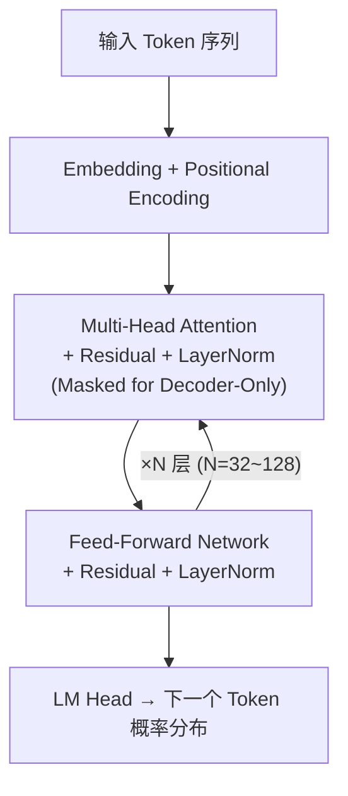

# 大语言模型基础 LLM Fundamentals

<span class="dig-tag dig-tag--category">AI 技术</span> <span class="dig-tag dig-tag--medium">⭐⭐ 中级</span> <span class="dig-tag dig-tag--hot">🔥🔥🔥 高频</span>

::: tip 💡 核心要点
大语言模型（Large Language Model, LLM）是基于 Transformer 架构、通过海量文本数据预训练而成的深度学习模型，具备强大的语言理解与生成能力。理解其核心机制——**自注意力（Self-Attention）**、**预训练与微调范式**、**解码策略**——是 AI 领域面试的基础考点。
:::

## 什么是大语言模型

大语言模型（LLM）是**参数量通常在数十亿以上**的神经网络模型，通过在大规模语料库上进行自监督学习（Self-Supervised Learning），学会对自然语言的统计规律建模。其核心能力包括：

- **文本生成**：根据上下文逐 Token 预测下一个词
- **语义理解**：对输入文本进行深层语义表征
- **上下文学习（In-Context Learning）**：通过 Prompt 中的示例即可完成新任务，无需额外训练

典型的 LLM 采用**仅解码器（Decoder-Only）**架构，如 GPT 系列、Claude、LLaMA 等。

---

## Transformer 架构

Transformer 由 Vaswani 等人于 2017 年在论文《Attention Is All You Need》中提出，是当前几乎所有 LLM 的基础架构。

### 自注意力机制 Self-Attention

自注意力机制使模型能够在处理每个 Token 时，关注输入序列中所有其他 Token 的信息，从而捕获长距离依赖关系。

给定输入序列的表示矩阵 $X$，通过三个线性变换得到查询（Query）、键（Key）、值（Value）矩阵：

$$
Q = XW_Q, \quad K = XW_K, \quad V = XW_V
$$

注意力得分的计算公式为：

$$
\text{Attention}(Q, K, V) = \text{softmax}\left(\frac{QK^T}{\sqrt{d_k}}\right)V
$$

其中 $d_k$ 是 Key 向量的维度，除以 $\sqrt{d_k}$ 的目的是**防止点积值过大导致 softmax 梯度消失**。

### 多头注意力 Multi-Head Attention

多头注意力将 Q、K、V 分别投影到 $h$ 个不同的子空间，并行计算注意力后拼接：

$$
\text{MultiHead}(Q, K, V) = \text{Concat}(\text{head}_1, \ldots, \text{head}_h)W_O
$$

$$
\text{head}_i = \text{Attention}(QW_Q^i, KW_K^i, VW_V^i)
$$

多头机制允许模型同时从**不同的表示子空间**中捕获信息（例如句法关系、语义关联等）。

### 位置编码 Positional Encoding

Transformer 本身不包含序列顺序信息（不像 RNN 天然具有时序性），因此需要显式注入位置信息。原始 Transformer 使用正弦/余弦位置编码：

$$
PE_{(pos, 2i)} = \sin\left(\frac{pos}{10000^{2i/d}}\right), \quad PE_{(pos, 2i+1)} = \cos\left(\frac{pos}{10000^{2i/d}}\right)
$$

现代 LLM 大多采用**旋转位置编码（RoPE, Rotary Position Embedding）**，它将位置信息编码为旋转矩阵，具有更好的外推能力。

#### RoPE 旋转位置编码

RoPE（Rotary Position Embedding）的核心思想是通过**旋转矩阵**将位置信息编码到向量中。对于位置 $m$ 处的向量 $x$，RoPE 将其每两个维度视为一个二维平面上的向量，按照与位置成正比的角度进行旋转：

$$
f(x, m) = \begin{pmatrix} x_1 \\ x_2 \end{pmatrix} \otimes \begin{pmatrix} \cos m\theta \\ \sin m\theta \end{pmatrix}
$$

**关键优势**：
- **相对位置感知**：两个 Token 的注意力得分只取决于它们的**相对距离**，而非绝对位置
- **长度外推**：通过调整 $\theta$ 的基数，可扩展到训练时未见过的序列长度
- **兼容线性注意力**：旋转操作不破坏点积结构

#### ALiBi（Attention with Linear Biases）

ALiBi 采用完全不同的思路——不修改 Embedding，而是在注意力得分上直接**减去一个与距离成正比的偏置**：

$$
\text{softmax}(q_i \cdot k_j - m \cdot |i - j|)
$$

其中 $m$ 是每个注意力头的固定斜率参数（无需训练）。距离越远，惩罚越大。

#### 位置编码方案对比

| 方案 | 原理 | 可训练参数 | 长度外推 | 代表模型 |
|------|------|-----------|----------|----------|
| **Sinusoidal** | 正弦/余弦函数 | 无 | 差 | 原始 Transformer |
| **RoPE** | 旋转矩阵 | 无 | 好（可调基数） | LLaMA, Qwen, GPT-NeoX |
| **ALiBi** | 线性注意力偏置 | 无 | 好 | BLOOM, MPT |
| **Learned** | 可学习向量 | 有 | 差 | GPT-2, BERT |

### 前馈网络 Feed-Forward Network

每个 Transformer 层中，注意力子层之后是一个逐位置的前馈网络（FFN）：

$$
\text{FFN}(x) = \text{ReLU}(xW_1 + b_1)W_2 + b_2
$$

现代模型通常使用 **SwiGLU** 激活函数替代 ReLU，以获得更好的训练效果。

### 整体结构示意



---

## 预训练与微调

### 预训练 Pre-training

预训练阶段使用**海量无标注文本**（通常数万亿 Token），通过**下一个词预测（Next Token Prediction）**任务训练模型：

$$
\mathcal{L}_{\text{pretrain}} = -\sum_{t=1}^{T} \log P(x_t \mid x_1, x_2, \ldots, x_{t-1}; \theta)
$$

这一阶段的目标是让模型学习语言的通用知识，包括语法、事实信息、推理能力等。

微调是在预训练模型基础上，使用特定任务数据进一步训练的过程，详见 [模型微调与训练](./model-training)。

---

## 分词 Tokenization

LLM 不直接处理原始文本，而是先将文本切分为**子词（Subword）**单元。

| 算法 | 特点 | 代表模型 |
|------|------|----------|
| **BPE（Byte-Pair Encoding）** | 从字符开始，反复合并最高频的相邻字符对 | GPT 系列 |
| **WordPiece** | 类似 BPE，但基于似然度选择合并 | BERT |
| **SentencePiece** | 语言无关，直接在原始文本上训练，支持 BPE/Unigram | LLaMA, Qwen |

**关键概念**：
- **Vocabulary Size**（词表大小）：通常 32K~150K
- **Token ≠ 单词**：一个英文单词可能被拆为多个 Token（如 `"uncomfortable"` → `["un", "comfort", "able"]`）
- 中文通常按字或常用词切分，每个汉字约消耗 1~2 个 Token

### BPE 算法详解

BPE（Byte-Pair Encoding）是最主流的分词算法，其训练过程如下：

1. **初始化**：将训练语料拆分为单个字节（或字符）作为初始词表
2. **统计**：计算所有相邻 Token 对的出现频率
3. **合并**：将频率最高的 Token 对合并为新 Token，加入词表
4. **重复**：回到第 2 步，直到词表达到目标大小

**示例**（词表大小目标为 6）：

```
初始词表: [a, b, c, d]
语料: "abab cdab abcd"

第 1 轮: "ab" 出现 3 次 → 合并 → 词表: [a, b, c, d, ab]
第 2 轮: "ab" 已合并，"cd" 出现 2 次 → 合并 → 词表: [a, b, c, d, ab, cd]
```

### Token 效率与多语言影响

不同语言在同一模型中的 Token 化效率差异很大，这直接影响 API 成本和上下文利用率：

| 文本 | GPT-4 Token 数 | Claude Token 数 | 说明 |
|------|---------------|-----------------|------|
| "Hello world" | 2 | 2 | 英文效率最高 |
| "你好世界" | 4 | 3~4 | 中文消耗约 2 倍 |
| "こんにちは" | 3~5 | 3~4 | 日文类似中文 |

**面试要点**：理解 Tokenization 对 LLM 的影响——它决定了模型的有效上下文长度、推理成本和多语言性能差异。

---

## 上下文窗口与长文本处理

标准 Transformer 的自注意力计算量为 $O(n^2)$，严重限制了上下文窗口长度。以下是主流的长文本处理技术：

### 滑动窗口注意力 Sliding Window Attention

每个 Token 只关注其前后固定窗口 $w$ 内的 Token，将复杂度降至 $O(n \cdot w)$。通过多层堆叠，信息仍可在层间传播到更远的位置。

> **全注意力**：每个 Token 关注所有位置（$O(n^2)$）。**滑动窗口**（如 $w=3$）：每个 Token 只关注前后 $w$ 个位置（$O(n \cdot w)$），通过多层堆叠传播远距离信息。

代表模型：Mistral 7B（窗口大小 4096）。

### 稀疏注意力 Sparse Attention

结合**局部窗口**和**全局 Token**，兼顾局部信息和长距离依赖：

- **Longformer**：滑动窗口 + 部分 Token 全局关注（如 [CLS]）
- **BigBird**：滑动窗口 + 全局 Token + 随机连接

### 长度外推技术

当推理时的序列长度超过训练长度时，需要位置编码外推：

| 技术 | 原理 | 效果 |
|------|------|------|
| **NTK-aware Scaling** | 修改 RoPE 的基数 $\theta$，扩展频率分辨率 | 2~4 倍外推，无需微调 |
| **YaRN** | 分频段处理 RoPE，高频保持、低频插值 | 更好的外推质量 |
| **Dynamic NTK** | 根据序列长度动态调整缩放因子 | 自适应不同长度 |

---

## 解码策略：Temperature, Top-K, Top-P

模型在生成文本时，需要从词表概率分布中**采样**下一个 Token。不同的采样策略对生成质量有显著影响。

### Temperature（温度）

Temperature 参数 $\tau$ 用于调节 softmax 输出的概率分布：

$$
P(x_i) = \frac{\exp(z_i / \tau)}{\sum_j \exp(z_j / \tau)}
$$

- $\tau \to 0$：分布趋向确定性，选择概率最高的 Token（贪心解码）
- $\tau = 1$：保持原始分布
- $\tau > 1$：分布更平坦，增加随机性和多样性

### Top-K 采样

只从概率最高的前 $K$ 个 Token 中采样，其余 Token 概率设为 0。

### Top-P 采样（Nucleus Sampling）

选择概率累积和刚好超过 $P$ 的最小 Token 集合，从中采样。相比 Top-K，Top-P 能自适应调整候选集大小。

### Python 实现示例

```python
import numpy as np

def sample_with_temperature(logits: np.ndarray, temperature: float = 1.0,
                            top_k: int = 0, top_p: float = 1.0) -> int:
    """
    从 logits 中按指定策略采样下一个 Token。

    Args:
        logits: 模型输出的原始分数 (vocab_size,)
        temperature: 温度参数，越低越确定
        top_k: 仅保留概率最高的 K 个 Token，0 表示不启用
        top_p: 核采样阈值，1.0 表示不启用
    Returns:
        采样得到的 Token ID
    """
    # 1. 应用温度缩放
    logits = logits / temperature

    # 2. Top-K 过滤
    if top_k > 0:
        top_k_indices = np.argsort(logits)[-top_k:]
        mask = np.full_like(logits, -np.inf)
        mask[top_k_indices] = logits[top_k_indices]
        logits = mask

    # 3. 计算 softmax 概率
    exp_logits = np.exp(logits - np.max(logits))
    probs = exp_logits / exp_logits.sum()

    # 4. Top-P (Nucleus) 过滤
    if top_p < 1.0:
        sorted_indices = np.argsort(probs)[::-1]
        sorted_probs = probs[sorted_indices]
        cumulative_probs = np.cumsum(sorted_probs)

        # 找到累积概率超过 top_p 的截断点
        cutoff_index = np.searchsorted(cumulative_probs, top_p) + 1
        keep_indices = sorted_indices[:cutoff_index]

        filtered_probs = np.zeros_like(probs)
        filtered_probs[keep_indices] = probs[keep_indices]
        probs = filtered_probs / filtered_probs.sum()

    # 5. 按概率采样
    return int(np.random.choice(len(probs), p=probs))
```

---

## RLHF 人类反馈强化学习

RLHF（Reinforcement Learning from Human Feedback）是使 LLM 输出与人类偏好对齐的关键技术。关于 RLHF 的三阶段流程、DPO 等替代方案的详细介绍，请参阅 [模型微调与训练](./model-training)。

---

## 主流模型家族

关于 GPT-4、Claude、LLaMA、Qwen、DeepSeek 等主流模型的详细对比，以及 MoE 架构和多模态 AI 的介绍，请参阅 [AI 概述与发展历程](./ai-overview)。

---

## 推理优化

KV Cache、量化（Quantization）、推测解码（Speculative Decoding）等推理优化技术的详细介绍，请参阅 [LLM 推理优化](./inference-optimization)。

---

## 幻觉 Hallucination

幻觉是指 LLM **生成看似合理但事实上错误或无依据的内容**，是面试中的高频考点。

### 幻觉的类型

| 类型 | 描述 | 示例 |
|------|------|------|
| **事实性幻觉** | 生成与客观事实不符的内容 | 编造不存在的论文引用 |
| **忠实性幻觉** | 生成与提供的上下文矛盾的内容 | 总结文档时添加原文没有的信息 |
| **指令幻觉** | 未遵循指令约束，如格式、范围限定 | 被要求只用中文回答却夹杂英文 |

### 产生原因

1. **训练数据噪声**：预训练语料中包含错误、过时或矛盾的信息
2. **曝光偏差（Exposure Bias）**：训练时使用真实数据，推理时使用自身生成的 Token，误差逐步累积
3. **知识边界模糊**：模型无法区分"知道"和"不知道"，倾向于生成流畅但不确定的内容
4. **频率捷径**：模型可能偏向生成训练数据中高频出现的模式，而非基于上下文推理

### 缓解策略

| 策略 | 原理 | 适用场景 |
|------|------|----------|
| **RAG** | 检索外部知识作为生成依据 | 需要最新/领域知识时 |
| **Self-Consistency** | 多次采样取多数一致的答案 | 推理类任务 |
| **Chain-of-Verification (CoVe)** | 生成后自问自答验证关键事实 | 事实性问答 |
| **置信度校准** | 让模型输出置信度并拒绝低置信度回答 | 高可靠性要求场景 |
| **Grounding** | 要求模型引用原文句子作为依据 | 文档摘要/分析 |

---

## 常见陷阱

::: warning ⚠️ 常见误区

1. **混淆 Encoder-Only / Decoder-Only / Encoder-Decoder 架构**：BERT 是 Encoder-Only（适合理解任务），GPT 是 Decoder-Only（适合生成任务），T5 是 Encoder-Decoder（适合 seq2seq 任务）。当前主流 LLM 几乎都是 Decoder-Only。

2. **认为 Temperature=0 是确定性输出**：严格来说 Temperature=0 是贪心解码（Greedy Decoding），每步选概率最高的 Token。但由于浮点精度问题，相同输入在不同硬件上仍可能产生细微差异。

3. **混淆微调与 Prompt Engineering**：微调修改模型参数，Prompt Engineering 不修改参数而是通过精心设计输入引导模型输出。二者适用场景不同，不可互相替代。

4. **忽视 Tokenization 对性能的影响**：不同语言的 Token 化效率不同，中文在英文为主的模型中通常消耗更多 Token，影响成本和上下文长度利用率。

:::

---

<div class="dig-questions">
  <div class="dig-questions__header">
    <span>📝 面试真题</span>
    <span style="font-size: 12px; opacity: 0.8;">4 道高频</span>
  </div>
  <div class="dig-questions__item">
    <span>1. 请解释 Transformer 的自注意力机制及其计算过程</span>
    <span class="dig-tag dig-tag--medium" style="margin: 0;">中等</span>
  </div>
  <div class="dig-questions__item">
    <span>2. Temperature、Top-K、Top-P 三种采样策略有何区别？如何选择？</span>
    <span class="dig-tag dig-tag--easy" style="margin: 0;">简单</span>
  </div>
  <div class="dig-questions__item">
    <span>3. RoPE 和 ALiBi 在处理位置信息上有什么区别？各自的优缺点？</span>
    <span class="dig-tag dig-tag--medium" style="margin: 0;">中等</span>
  </div>
  <div class="dig-questions__item">
    <span>4. LLM 幻觉的主要原因有哪些？如何缓解？</span>
    <span class="dig-tag dig-tag--medium" style="margin: 0;">中等</span>
  </div>
</div>

## 面试真题详解

### Q1：请解释 Transformer 的自注意力机制及其计算过程

**要点**：

自注意力机制是 Transformer 的核心组件，其目的是让序列中每个位置的 Token 都能"关注"到序列中所有其他位置的信息。

**计算过程**：

1. 将输入向量 $x$ 通过三个权重矩阵 $W_Q$、$W_K$、$W_V$ 分别映射为 Query、Key、Value 向量
2. 计算 Query 和所有 Key 的点积作为注意力得分：$\text{score} = QK^T$
3. 除以缩放因子 $\sqrt{d_k}$ 防止梯度消失：$\text{scaled\_score} = \frac{QK^T}{\sqrt{d_k}}$
4. 通过 softmax 将得分归一化为注意力权重
5. 用注意力权重对 Value 进行加权求和，得到输出

**多头注意力**在此基础上，将 Q、K、V 分成 $h$ 个头，分别计算后拼接，使模型能从不同子空间捕获不同类型的关系。

**为什么要缩放？** 当 $d_k$ 较大时，$QK^T$ 的值可能非常大，导致 softmax 的梯度趋近于零，缩放因子确保梯度稳定。

---

### Q2：Temperature、Top-K、Top-P 三种采样策略有何区别？如何选择？

**要点**：

| 策略 | 作用 | 效果 |
|------|------|------|
| **Temperature** | 缩放 logits 分布的平坦程度 | 低温确定性高、高温多样性大 |
| **Top-K** | 仅从概率前 K 个 Token 中采样 | 截断尾部低概率 Token |
| **Top-P** | 从累积概率达到阈值 P 的最小集合中采样 | 自适应候选集大小 |

**选择建议**：

- **代码生成 / 数学推理**：低 Temperature（0.0~0.3），追求准确性
- **创意写作 / 对话**：中等 Temperature（0.7~1.0），平衡质量和多样性
- **头脑风暴**：高 Temperature（1.0~1.5），追求多样性

Top-K 和 Top-P 通常与 Temperature 组合使用。Top-P 相比 Top-K 更灵活，因为它会根据分布形状自动调整候选 Token 数量——在模型非常确定时只保留少量候选，在不确定时保留更多候选。

---

### Q3：RoPE 和 ALiBi 在处理位置信息上有什么区别？各自的优缺点？

**要点**：

**RoPE（Rotary Position Embedding）**：
- 通过旋转矩阵将位置信息编码到 Q/K 向量中
- 注意力得分自然反映相对距离
- 优点：理论优雅、广泛验证、可通过调整基数实现长度外推（NTK-aware Scaling、YaRN）
- 缺点：外推时需要额外的技术适配

**ALiBi（Attention with Linear Biases）**：
- 不修改 Embedding，直接在注意力分数上减去与距离成正比的线性偏置
- 优点：实现简单、无需训练参数、天然支持长度外推
- 缺点：线性衰减假设可能丢失某些长距离模式

**选择建议**：RoPE 已成为主流方案（LLaMA、Qwen 等均采用），生态工具支持更好；ALiBi 在特定场景下仍有价值，如需极简实现或零成本外推。

---

### Q4：LLM 幻觉的主要原因有哪些？如何缓解？

**要点**：

**主要原因**：
1. **训练数据噪声**：语料中包含的错误和矛盾信息被模型学习
2. **曝光偏差**：训练时使用真实 Token，推理时使用自身生成的 Token，误差逐步放大
3. **知识边界模糊**：模型缺乏元认知能力，不能准确判断自身知识的可靠性
4. **概率采样机制**：生成过程本质是概率采样，有可能选中低概率但错误的路径

**缓解策略**：
- **RAG（检索增强生成）**：为生成提供外部知识依据，是最实用的方案
- **Self-Consistency**：多次采样取一致答案，适合推理任务
- **Chain-of-Verification（CoVe）**：生成后自动验证关键事实
- **Grounding**：要求模型引用原文依据
- **温度调低**：降低采样随机性，减少"创造性"错误

**面试加分点**：指出幻觉无法完全消除，但可通过架构设计（RAG）和后处理（验证）将影响控制在可接受范围内。

---

## 延伸阅读

- [Attention Is All You Need (Vaswani et al., 2017)](https://arxiv.org/abs/1706.03762)
- [Language Models are Few-Shot Learners (GPT-3 Paper)](https://arxiv.org/abs/2005.14165)
- [LoRA: Low-Rank Adaptation of Large Language Models](https://arxiv.org/abs/2106.09685)
- [Training language models to follow instructions with human feedback (InstructGPT)](https://arxiv.org/abs/2203.02155)
- [LLaMA: Open and Efficient Foundation Language Models](https://arxiv.org/abs/2302.13971)
- [RoFormer: Enhanced Transformer with Rotary Position Embedding](https://arxiv.org/abs/2104.09864)
- [Train Short, Test Long: Attention with Linear Biases (ALiBi)](https://arxiv.org/abs/2108.12409)
