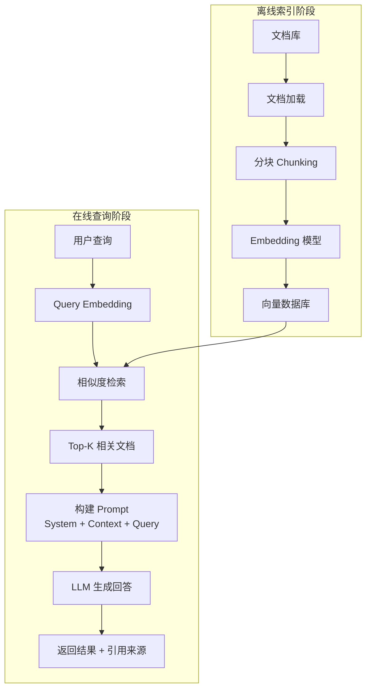
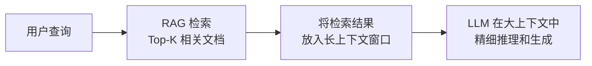
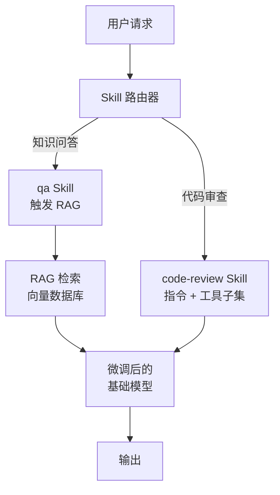
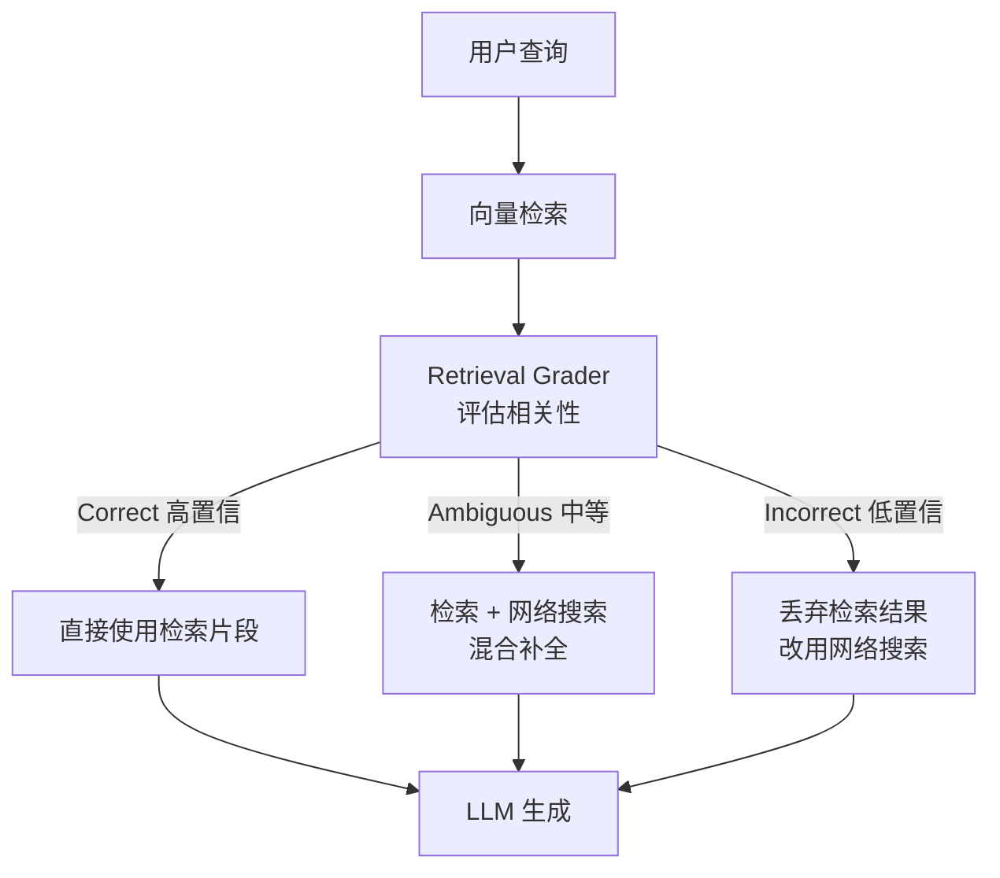

# RAG 检索增强生成

<span class="dig-tag dig-tag--category">AI 技术</span> <span class="dig-tag dig-tag--hard">⭐⭐⭐ 高级</span> <span class="dig-tag dig-tag--hot">🔥🔥 高频</span>

::: tip 💡 核心要点
RAG（Retrieval-Augmented Generation，检索增强生成）通过在生成前从外部知识库中检索相关信息，为大语言模型提供**实时、准确**的上下文，解决 LLM 的**幻觉问题（Hallucination）**和**知识截止（Knowledge Cutoff）**限制。随着大模型上下文窗口突破百万 Token（如 Gemini、Claude），长上下文方案正在改变 RAG 的应用格局，但 RAG 在**大规模知识库、动态数据、成本控制**等场景下仍然不可替代。
:::

## 为什么需要 RAG

大语言模型存在以下固有局限：

| 问题 | 说明 | RAG 如何解决 |
|------|------|-------------|
| **幻觉（Hallucination）** | 模型可能生成看似合理但事实错误的内容 | 提供检索到的真实文档作为生成依据 |
| **知识截止（Knowledge Cutoff）** | 训练数据有时间截止，无法获取最新信息 | 从实时更新的知识库中检索 |
| **领域知识不足** | 通用模型缺乏特定行业的专业知识 | 接入企业内部文档和专业数据库 |
| **数据隐私** | 不便将私有数据用于模型训练 | 数据留在本地，仅在推理时检索 |

与微调相比，RAG 的显著优势在于**无需重新训练模型**，且知识库可随时更新。

---

## RAG 核心架构

RAG 的工作流程分为三个核心阶段：**索引（Indexing）→ 检索（Retrieval）→ 生成（Generation）**。



---

## RAG vs 长上下文窗口

2024-2025 年，主流大模型的上下文窗口从 4K/8K 迅速扩展到 **100 万+ Token**（Gemini 1.5 Pro、Claude 等），这对 RAG 的定位产生了深远影响：直接将文档塞进上下文窗口成为一种可行方案。

### 对比分析

| 对比维度 | RAG | 长上下文窗口 | 混合方案 |
|----------|-----|-------------|----------|
| **架构复杂度** | 高 — 需要分块、Embedding、向量数据库、检索链路 | 低 — 直接将文档拼接到 Prompt | 中等 |
| **单次查询成本** | 低 — 只传入检索到的少量片段 | 高 — 每次查询都传入全量文档 | 中等 |
| **知识库规模** | 可扩展到**数百万文档** | 受限于上下文窗口（通常 < 1M Token） | 大规模知识库 + 精细推理 |
| **实时性** | 支持动态更新，索引后即可检索 | 需要每次查询时重新加载 | 灵活 |
| **准确性** | 依赖检索质量，可能漏召回 | 模型可"看到"全部内容，不会遗漏 | 最高 — 检索缩小范围 + 全量推理 |
| **延迟** | 较低（检索 + 生成） | 较高（处理大量 Token 耗时） | 中等 |

### 决策指南

::: tip 💡 如何选择

- **文档量 < 200K Token**（约一本书）→ 优先考虑**长上下文方案**，架构简单、无检索遗漏风险
- **文档量 > 1M Token 或数据持续更新** → 使用 **RAG**，成本可控且可扩展
- **对准确性要求极高**（如医疗、法律、金融）→ 采用**混合方案**：RAG 检索缩小候选范围，再将候选文档放入长上下文让模型精细推理

:::

### 混合架构（Hybrid RAG + Long Context）

混合方案正在成为 2025 年的行业共识。典型流程：



与传统 RAG 只传入少量片段不同，混合方案利用长上下文窗口传入**更多候选文档**（如 Top-50 甚至 Top-100），让模型在更大范围内进行交叉验证和推理，显著降低因检索遗漏或截断导致的信息损失。

---

## RAG vs Skill vs Fine-tuning

"如何让 LLM 掌握外部知识/能力"在 2025 年有了三条主流路线：**RAG**（注入知识）、**Skill**（注入流程，详见 [Agent Skills 编写指南](./ai-agent-skills)）、**Fine-tuning**（注入到权重）。这是 2025-2026 年 AI 面试中**高频追问**——很多候选人只会讲 RAG，不会区分这三者的边界。

### 三方核心区别

| 维度 | RAG | Skill | Fine-tuning |
|------|-----|-------|-------------|
| **解决什么问题** | 模型不知道**事实/知识** | 模型不知道**怎么做某类任务的流程** | 模型不具备**某种风格/能力/隐式知识** |
| **加载方式** | 运行时检索 → 注入 Prompt 上下文 | 路由触发 → 注入指令 + 工具子集到上下文 | 训练时写入模型权重 |
| **更新成本** | 重新索引（分钟级） | 改 Markdown / 配置（秒级） | 重新训练（小时-天级） |
| **可解释性** | 高（能给出引用） | 高（指令可读） | 低（权重不可读） |
| **是否消耗推理 Token** | 是（每次注入检索片段） | 是（每次注入 Skill 指令） | 否（能力已固化） |
| **典型载体** | 向量数据库 + Embedding | Markdown / YAML / Code | LoRA / 全量权重 |
| **失败模式** | 检索遗漏、片段截断 | 路由错配、Skill 指令冲突 | 灾难性遗忘、过拟合 |

### 一句话区分

> **RAG 是"教模型查资料"，Skill 是"教模型按 SOP 办事"，Fine-tuning 是"教模型形成肌肉记忆"。**

### 决策指南

::: tip 💡 如何选

- **回答需要**最新/海量/可追溯的事实** → RAG
- **任务有固定的多步流程**（代码审查、PR 总结、定制报告）→ Skill
- **需要改变模型说话风格 / 输出格式 / 领域语感** → Fine-tuning
- **三者并不互斥**：一个生产级 Agent 通常 = Fine-tuned 基模 + 多个 Skill + RAG 知识库

:::

### 组合架构（最常见的生产形态）



**面试加分点**：
- Skill 内部**可以调用** RAG（"先检索知识库再按 SOP 输出"），但 RAG 本身**不是** Skill
- Fine-tuning **不能替代** RAG——再大的模型也无法记住实时变化的事实
- Skill **不能替代** Fine-tuning——Prompt 难以稳定改变模型的输出风格和审美

---

## 文档处理与分块策略

文档分块（Chunking）的质量**直接影响检索效果**，是 RAG 系统中最关键的环节之一。

### 分块策略对比

| 策略 | 原理 | 优点 | 缺点 |
|------|------|------|------|
| **固定大小分块** | 按固定字符/Token 数切分 | 实现简单、速度快 | 可能在语义中间切断 |
| **递归分块** | 按层级分隔符（段落→句子→字符）递归切分 | 尽量保留语义完整性 | 实现相对复杂 |
| **语义分块** | 基于 Embedding 相似度检测语义边界 | 语义完整性最好 | 计算开销大 |
| **文档结构分块** | 按 Markdown 标题、HTML 标签等结构切分 | 保留文档层级关系 | 依赖文档格式 |

### 分块参数选择

- **Chunk Size（分块大小）**：通常 256~1024 Token。太小会丢失上下文，太大会引入噪声
- **Chunk Overlap（重叠）**：通常 10%~20%，防止关键信息被分隔符截断

### Python 分块示例

```python
from typing import List

def recursive_split(text: str, chunk_size: int = 512,
                    chunk_overlap: int = 64) -> List[str]:
    """
    递归分块：优先按段落 → 句子 → 字符分割。

    Args:
        text: 原始文本
        chunk_size: 每个分块的最大字符数
        chunk_overlap: 相邻分块重叠的字符数
    Returns:
        分块后的文本列表
    """
    separators = ["\n\n", "\n", "。", ".", " ", ""]
    chunks: List[str] = []

    def _split(text: str, sep_idx: int) -> List[str]:
        if len(text) <= chunk_size:
            return [text]

        sep = separators[sep_idx]
        if not sep:
            # 最后的回退：按字符硬切
            return [text[i:i + chunk_size]
                    for i in range(0, len(text), chunk_size - chunk_overlap)]

        parts = text.split(sep)
        current_chunk = ""
        result = []

        for part in parts:
            candidate = current_chunk + sep + part if current_chunk else part
            if len(candidate) <= chunk_size:
                current_chunk = candidate
            else:
                if current_chunk:
                    result.append(current_chunk)
                # 如果单个 part 超过 chunk_size，递归使用下一个分隔符
                if len(part) > chunk_size:
                    result.extend(_split(part, sep_idx + 1))
                    current_chunk = ""
                else:
                    current_chunk = part

        if current_chunk:
            result.append(current_chunk)
        return result

    raw_chunks = _split(text, 0)

    # 添加重叠
    for i, chunk in enumerate(raw_chunks):
        if i > 0 and chunk_overlap > 0:
            overlap_text = raw_chunks[i - 1][-chunk_overlap:]
            chunk = overlap_text + chunk
        chunks.append(chunk.strip())

    return chunks
```

---

## Embedding 与向量数据库

RAG 系统依赖 Embedding 模型将文本转换为向量，并通过向量数据库进行高效检索。关于 Embedding 模型的选择、相似度度量、向量数据库对比和 ANN 索引算法的详细介绍，请参阅 [Embedding 与向量数据库](./embedding-and-vector-db)。

---

## 检索策略

### 稠密检索 Dense Retrieval

基于 Embedding 向量的语义相似度搜索，使用余弦相似度或内积计算距离：

$$
\text{sim}(q, d) = \frac{q \cdot d}{\|q\| \cdot \|d\|}
$$

**优点**：捕获深层语义关系（如同义词、意译）。**缺点**：对精确关键词匹配可能不如稀疏检索。

### 稀疏检索 Sparse Retrieval (BM25)

基于词频统计的经典检索算法，BM25 的评分公式为：

$$
\text{BM25}(q, d) = \sum_{t \in q} \text{IDF}(t) \cdot \frac{f(t, d) \cdot (k_1 + 1)}{f(t, d) + k_1 \cdot \left(1 - b + b \cdot \frac{|d|}{\text{avgdl}}\right)}
$$

**优点**：精确关键词匹配能力强、可解释性好。**缺点**：无法处理语义相似但词汇不同的情况。

### 混合检索 Hybrid Retrieval

结合稠密检索和稀疏检索的优势，通过加权融合提升检索质量：

```python
def hybrid_search(query: str, top_k: int = 10,
                  alpha: float = 0.7) -> list:
    """
    混合检索：结合稠密检索和 BM25 稀疏检索。

    Args:
        query: 用户查询
        top_k: 返回的结果数
        alpha: 稠密检索权重（1-alpha 为稀疏检索权重）
    Returns:
        排序后的文档列表
    """
    # 稠密检索: 通过 Embedding 向量相似度搜索
    dense_results = vector_db.similarity_search(
        query_embedding=embed_model.encode(query),
        top_k=top_k * 2
    )

    # 稀疏检索: 通过 BM25 关键词匹配
    sparse_results = bm25_index.search(
        query=query,
        top_k=top_k * 2
    )

    # 使用 Reciprocal Rank Fusion (RRF) 融合排名
    scores = {}
    k = 60  # RRF 常数

    for rank, doc in enumerate(dense_results):
        scores[doc.id] = scores.get(doc.id, 0) + alpha / (k + rank + 1)

    for rank, doc in enumerate(sparse_results):
        scores[doc.id] = scores.get(doc.id, 0) + (1 - alpha) / (k + rank + 1)

    # 按融合分数排序返回 top_k
    sorted_docs = sorted(scores.items(), key=lambda x: x[1], reverse=True)
    return [doc_id for doc_id, _ in sorted_docs[:top_k]]
```

---

## 重排序 Reranking

初次检索（First-stage Retrieval）召回的结果可能包含噪声。**重排序（Reranking）**使用交叉编码器（Cross-Encoder）对 Query-Document 对进行精细打分，显著提升最终结果的相关性。


### 为什么需要两阶段

- **第一阶段**（Bi-Encoder）：Query 和 Document 独立编码，检索速度快但精度有限
- **第二阶段**（Cross-Encoder）：Query 和 Document 拼接后联合编码，精度高但计算开销大，只能用于少量候选

常用重排序模型包括 `bge-reranker-v2-m3`、`Cohere Rerank` 等。

---

## 高级 RAG 技术

### 查询改写 Query Transformation

原始用户查询可能模糊或不完整，通过 LLM 改写查询以提升检索效果：

```python
def query_rewrite(original_query: str, llm) -> list:
    """
    使用 LLM 将原始查询改写为多个检索友好的查询。
    """
    prompt = f"""请将以下用户问题改写为 3 个更适合检索的查询，
每个查询从不同角度描述同一个信息需求。

原始问题: {original_query}

改写查询:"""
    response = llm.generate(prompt)
    queries = response.strip().split("\n")
    return [original_query] + queries  # 包含原始查询
```

### HyDE（Hypothetical Document Embeddings）

先让 LLM 生成一个**假设性回答文档**，再用该文档的 Embedding 去检索，利用"文档-文档"相似度通常优于"查询-文档"相似度的特性。


### Self-RAG

让模型自己决定**是否需要检索**，以及**对检索结果进行自我评估**。模型生成特殊标记来控制流程：

- `[Retrieve]`：判断是否需要检索
- `[IsRel]`：判断检索结果是否与查询相关
- `[IsUse]`：判断检索结果是否对生成有用
- `[IsSup]`：判断生成内容是否被检索结果支持

### Corrective RAG（CRAG）

Corrective RAG 在 Self-RAG 的基础上引入**显式的纠错动作**：用一个轻量评估器（grader）对检索结果打分，根据置信度走三条不同路径。



**关键差异**：Self-RAG 是模型**自身**通过特殊 token 反思；CRAG 是**外挂一个评估器**做硬路由，工程上更易落地，对非微调模型也适用。

### Adaptive RAG

Adaptive RAG 在最前端加一个**查询复杂度分类器**，根据问题难度选择检索策略，避免"无脑全检索"。

| 查询类型 | 示例 | 处理路径 |
|---------|------|---------|
| **简单事实** | "马斯克的出生年份？" | 直接 LLM 回答，不检索 |
| **单跳问答** | "DeepSeek R1 用的是什么 RL 算法？" | 单次 RAG 检索 |
| **多跳推理** | "DeepSeek 的 RL 算法和 RLHF 的核心差异是什么？" | 多步检索 + Agent 规划 |

**收益**：在生产中可降低 30-50% 的检索成本，同时提升简单问题的响应速度。

### GraphRAG

GraphRAG 将传统 RAG 中的"扁平文档检索"升级为**基于知识图谱的结构化检索**：

> **传统 RAG**：查询 → 向量检索 → 独立文档片段 → LLM。**GraphRAG**：查询 → 图谱检索 → 实体 + 关系 + 社区 → LLM。

**核心流程**：
1. **构建知识图谱**：使用 LLM 从文档中提取 (实体, 关系, 实体) 三元组
2. **社区检测**：对知识图谱进行层次聚类，识别主题社区
3. **社区摘要**：为每个社区生成摘要，作为检索单元
4. **全局问答**：综合多个社区的信息回答全局性问题

**优势**：擅长回答需要跨文档推理的**全局性问题**（如"这个领域的主要趋势是什么？"），传统 RAG 由于只检索局部片段难以处理此类问题。

### Agentic RAG

将 RAG 与 [AI Agent](./ai-agents) 结合，由 Agent **自主决定检索策略**，是 Self-RAG / CRAG / Adaptive RAG 的进一步泛化——把"是否检索、检索几次、检索什么、用哪个数据源"全部交给 LLM 的规划循环。

| 能力 | 传统 RAG | Agentic RAG |
|------|---------|-------------|
| **是否检索** | 始终检索 | 由 Agent 判断 |
| **检索次数** | 一次 | 多轮迭代（基于上一轮结果决定下一轮）|
| **数据源** | 固定向量库 | 在向量检索 / SQL / 网络搜索 / API 间动态选择 |
| **查询分解** | 直接用原始查询 | 拆解为子查询并行/串行检索 |
| **失败恢复** | 无 | 检索结果不满足时换策略重试 |

**典型场景**：跨多个知识库的复杂分析、需要计算或最新数据的混合问答、企业内多源数据问答。

**与 CRAG/Self-RAG 的关系**：CRAG 和 Self-RAG 可视为 Agentic RAG 的**特定退化形式**——只有一个固定的"评估-纠错"循环；而 Agentic RAG 的工具集和循环结构是开放的。

### 高级 RAG 变体一览

| 变体 | 核心思想 | 适用场景 | 落地复杂度 |
|------|---------|---------|-----------|
| **HyDE** | 用假设性回答的 Embedding 检索 | 查询过短或与文档语义差距大 | 低 |
| **Self-RAG** | 模型自带反思 token | 需要细粒度自我评估，但需微调 | 高（需训练）|
| **CRAG** | 外挂评估器 + 三档路由 | 通用，对非微调模型友好 | 中 |
| **Adaptive RAG** | 按查询复杂度路由 | 流量大、查询分布差异大 | 中 |
| **GraphRAG** | 知识图谱 + 社区摘要 | 全局性问题、跨文档推理 | 高 |
| **Agentic RAG** | Agent 自主多轮规划 | 复杂、开放式、多源数据 | 高 |

### 多模态 RAG

将 RAG 扩展到**图文混合**场景：

| 策略 | 说明 | 适用场景 |
|------|------|----------|
| **图像描述索引** | 用多模态模型生成图像描述，按文本索引和检索 | 图表、截图类文档 |
| **多模态 Embedding** | 用 CLIP 等模型生成图文统一的 Embedding | 图文混合检索 |
| **文档解析** | 使用 OCR + 版面分析提取图表中的结构化信息 | PDF、扫描件 |

### 生产级 RAG 模式

| 模式 | 说明 |
|------|------|
| **语义缓存** | 对相似查询缓存结果，减少重复检索和 LLM 调用 |
| **检索监控** | 追踪检索的 recall、precision，发现退化趋势 |
| **渐进式索引** | 增量更新知识库，避免全量重建索引 |
| **A/B 测试** | 对比不同分块策略、检索算法、Prompt 模板的效果 |

### Prompt Caching 在 RAG 中的应用

RAG 场景下的 Prompt Caching 与 Agent 略有不同——RAG 的**检索片段每次都在变**，所以**不能像 Agent 一样缓存上下文中部**。正确的姿势：

::: tip 💡 RAG 的 Prompt 排版黄金顺序

```
1. System Prompt（不变 → 必缓存）
2. 检索指引 / 输出格式约束（不变 → 必缓存）
3. Few-shot 示例（不变 → 必缓存）
4. ──── 缓存断点（cache_control）────
5. 检索到的 Top-K 文档片段（每次变）
6. 用户问题（每次变）
```

把所有"不依赖检索结果"的内容**全部前置**，断点之后才放检索片段。在高 QPS 的 RAG 服务（如客服机器人）中，这一调整能让 System Prompt + Few-shot 部分（通常 2-5K Token）命中缓存，整体成本降低 30-50%。

详细缓存机制和定价对比见 [AI Agent — Prompt Caching](./ai-agents#prompt-caching-降低-agent-成本的关键手段)。

:::

---

## RAG 评估

RAG 系统的评估需要从**检索质量**和**生成质量**两个维度进行。

### 评估指标

| 指标 | 维度 | 衡量内容 |
|------|------|----------|
| **Context Precision** | 检索 | 检索到的文档中相关文档的比例 |
| **Context Recall** | 检索 | 所有相关文档被检索到的比例 |
| **Faithfulness** | 生成 | 生成的回答是否忠实于检索到的上下文 |
| **Answer Relevancy** | 生成 | 生成的回答与原始问题的相关性 |
| **Answer Correctness** | 端到端 | 最终回答的准确性（与标准答案对比） |

### 评估框架

常用的 RAG 评估框架包括：
- **RAGAS**：提供自动化的 RAG 评估流程，覆盖上述所有指标
- **LlamaIndex Evaluation**：内置多种评估器
- **TruLens**：支持可视化的评估仪表盘

```python
# 使用 RAGAS 进行评估（伪代码）
from ragas.metrics import faithfulness, answer_relevancy, context_precision

def evaluate_rag(questions: list, answers: list,
                 contexts: list, ground_truths: list) -> dict:
    """
    评估 RAG 系统的检索和生成质量。

    Args:
        questions: 测试问题列表
        answers: RAG 生成的回答列表
        contexts: 检索到的上下文列表
        ground_truths: 标准答案列表
    Returns:
        各项评估指标的得分
    """
    results = {
        "faithfulness": faithfulness.score(
            questions=questions,
            answers=answers,
            contexts=contexts
        ),
        "answer_relevancy": answer_relevancy.score(
            questions=questions,
            answers=answers
        ),
        "context_precision": context_precision.score(
            questions=questions,
            contexts=contexts,
            ground_truths=ground_truths
        ),
    }
    return results
```

---

## 完整 RAG Pipeline 示例

```python
class SimpleRAGPipeline:
    """
    简化的 RAG 流水线实现，展示核心流程。
    """

    def __init__(self, embed_model, vector_store, llm,
                 chunk_size=512, top_k=5):
        self.embed_model = embed_model
        self.vector_store = vector_store
        self.llm = llm
        self.chunk_size = chunk_size
        self.top_k = top_k

    def ingest(self, documents: list):
        """离线索引：分块 → 向量化 → 存储"""
        for doc in documents:
            chunks = recursive_split(doc.text, self.chunk_size)
            for chunk in chunks:
                embedding = self.embed_model.encode(chunk)
                self.vector_store.add(
                    text=chunk,
                    embedding=embedding,
                    metadata=doc.metadata
                )

    def query(self, question: str) -> str:
        """在线查询：检索 → 构建 Prompt → 生成"""
        # Step 1: 将查询向量化
        query_embedding = self.embed_model.encode(question)

        # Step 2: 检索最相关的文档片段
        results = self.vector_store.similarity_search(
            query_embedding=query_embedding,
            top_k=self.top_k
        )

        # Step 3: 拼接上下文
        context = "\n\n---\n\n".join([r.text for r in results])

        # Step 4: 构建 Prompt 并调用 LLM
        prompt = f"""根据以下参考资料回答用户的问题。
如果参考资料中没有相关信息，请明确告知用户。

参考资料:
{context}

用户问题: {question}

回答:"""

        return self.llm.generate(prompt)
```

---

## 常见陷阱

::: warning ⚠️ 常见误区

1. **分块策略不当**：分块太大导致检索结果包含大量无关信息，分块太小导致上下文不完整，丢失关键语义。应根据文档类型和查询模式选择合适的分块策略和大小。

2. **忽视 Embedding 模型与查询语言的匹配**：使用英文为主的 Embedding 模型处理中文文档，会导致语义捕获不准确。中文场景应优先选用 BGE、GTE 等针对中文优化的模型。

3. **只用稠密检索忽视稀疏检索**：稠密检索擅长语义匹配但可能漏掉精确关键词，BM25 等稀疏检索在精确匹配场景下更可靠。混合检索通常效果最佳。

4. **检索数量 Top-K 设置不合理**：K 太小可能漏掉关键信息，K 太大会引入噪声且增加 LLM 的上下文负担。建议先召回较多候选（如 Top-20），再通过 Reranking 精选（如 Top-5）。

5. **缺乏评估体系**：上线后不监控检索质量和生成质量，无法发现和修复系统退化。应建立包含 Faithfulness、Relevancy 等指标的持续评估机制。

:::

---

<div class="dig-questions">
  <div class="dig-questions__header">
    <span>📝 面试真题</span>
    <span style="font-size: 12px; opacity: 0.8;">3 道高频</span>
  </div>
  <div class="dig-questions__item">
    <span>1. 请描述 RAG 的核心架构和工作流程</span>
    <span class="dig-tag dig-tag--medium" style="margin: 0;">中等</span>
  </div>
  <div class="dig-questions__item">
    <span>2. 稠密检索和稀疏检索各有什么优缺点？如何结合使用？</span>
    <span class="dig-tag dig-tag--medium" style="margin: 0;">中等</span>
  </div>
  <div class="dig-questions__item">
    <span>3. 如何评估一个 RAG 系统的质量？有哪些关键指标？</span>
    <span class="dig-tag dig-tag--hard" style="margin: 0;">困难</span>
  </div>
</div>

## 面试真题详解

### Q1：请描述 RAG 的核心架构和工作流程

**要点**：

RAG 系统分为**离线索引**和**在线查询**两个阶段：

**离线索引阶段**：
1. **文档加载**：从各种数据源（PDF、数据库、网页等）获取原始文档
2. **文档分块**：将长文档按策略切分为语义完整的小块（通常 256~1024 Token）
3. **向量化**：使用 Embedding 模型将每个分块转换为稠密向量
4. **存储**：将向量和原始文本存入向量数据库，建立索引

**在线查询阶段**：
1. **查询向量化**：将用户问题通过同一个 Embedding 模型转换为向量
2. **向量检索**：在向量数据库中搜索与查询最相似的 Top-K 个文档片段
3. **（可选）重排序**：使用 Cross-Encoder 对候选结果精排
4. **Prompt 构建**：将检索到的文档片段拼接进 Prompt 的上下文部分
5. **LLM 生成**：大语言模型基于上下文生成最终回答

**核心设计要点**：查询和文档必须使用同一个 Embedding 模型，确保在相同的向量空间中计算相似度。

---

### Q2：稠密检索和稀疏检索各有什么优缺点？如何结合使用？

**要点**：

| 对比维度 | 稠密检索 | 稀疏检索 (BM25) |
|----------|----------|------------------|
| 原理 | 基于 Embedding 语义向量相似度 | 基于词频和逆文档频率的统计匹配 |
| 语义匹配 | 强 —— 能理解同义词、意译 | 弱 —— 只做字面匹配 |
| 精确匹配 | 弱 —— 可能漏掉精确关键词 | 强 —— 关键词完全匹配得分高 |
| 速度 | 需要 ANN 索引，较快 | 倒排索引，非常快 |
| 可解释性 | 低 —— 向量空间难以直观理解 | 高 —— 可以看到匹配的关键词 |

**结合方式（混合检索）**：

1. **并行检索**：同时执行稠密检索和稀疏检索
2. **分数融合**：使用 RRF（Reciprocal Rank Fusion）或加权求和合并排名
3. **（可选）重排序**：对融合后的结果使用 Cross-Encoder 精排

实践表明，混合检索相比单一检索方式通常能提升 5%~15% 的召回率。权重比例（稠密 vs 稀疏）需要根据具体场景调优，通常稠密检索权重略高（如 0.7:0.3）。

---

### Q3：如何评估一个 RAG 系统的质量？有哪些关键指标？

**要点**：

RAG 系统的评估需要覆盖检索和生成两个维度，核心指标包括：

**检索维度**：
- **Context Precision（上下文精确率）**：检索到的 Top-K 文档中，真正与问题相关的占比。高精确率意味着检索噪声少
- **Context Recall（上下文召回率）**：所有相关文档被成功检索到的比例。高召回率意味着不会遗漏关键信息

**生成维度**：
- **Faithfulness（忠实度）**：生成的回答是否完全基于检索到的上下文，不包含模型自行编造的信息。这是衡量幻觉问题的核心指标
- **Answer Relevancy（回答相关性）**：生成的回答与用户原始问题的相关程度

**端到端指标**：
- **Answer Correctness（回答正确性）**：最终回答与标准答案的匹配程度

**评估方法**：
1. 构建包含问题、标准答案、相关文档的评测集
2. 使用 RAGAS 等框架自动计算各项指标
3. 结合人工评估判断回答质量
4. 建立持续评估机制，监控系统在生产环境中的表现

---

## 延伸阅读

- [Retrieval-Augmented Generation for Knowledge-Intensive NLP Tasks (Lewis et al., 2020)](https://arxiv.org/abs/2005.11401)
- [Self-RAG: Learning to Retrieve, Generate, and Critique through Self-Reflection](https://arxiv.org/abs/2310.11511)
- [Precise Zero-Shot Dense Retrieval without Relevance Labels (HyDE)](https://arxiv.org/abs/2212.10496)
- [LangChain Documentation — RAG](https://python.langchain.com/docs/tutorials/rag/)
- [LlamaIndex Documentation](https://docs.llamaindex.ai/)
