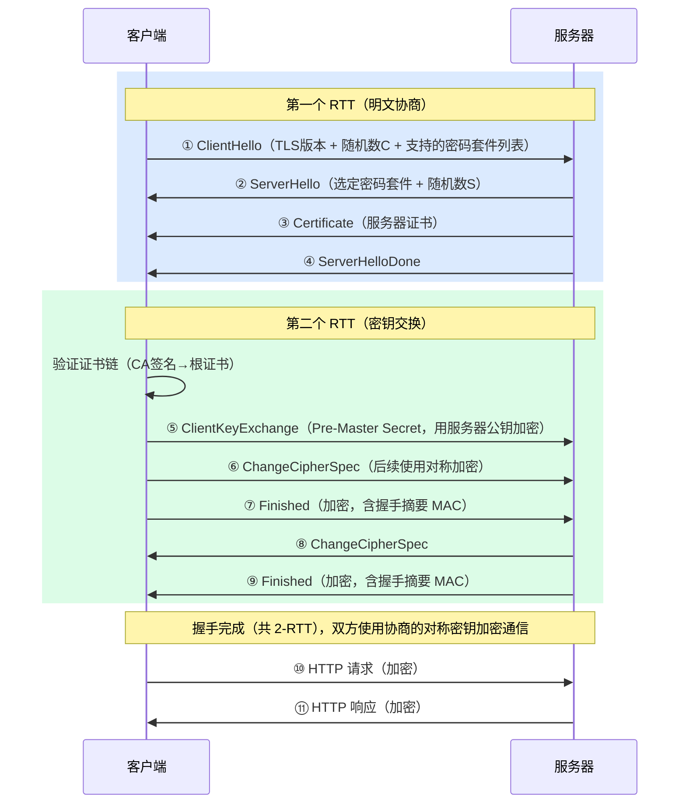
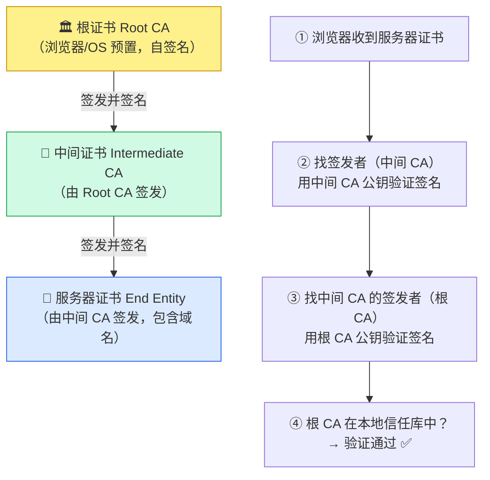
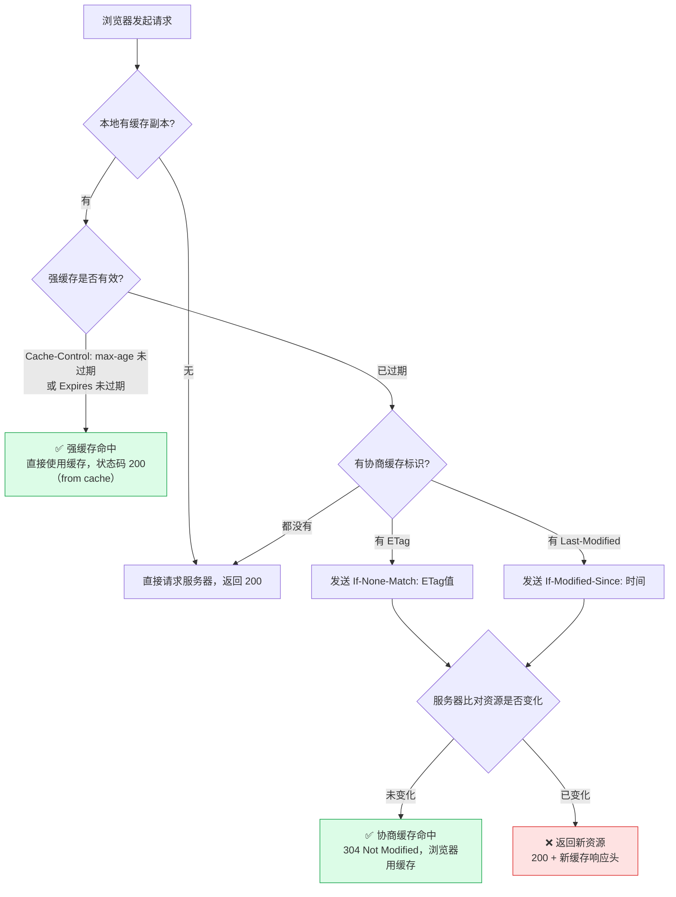
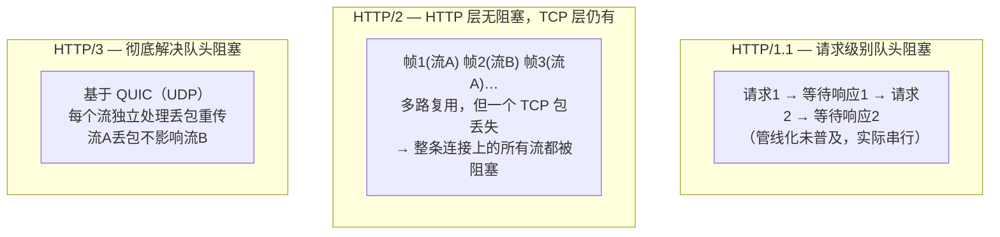

# HTTP 与 HTTPS

## 概念

HTTP（HyperText Transfer Protocol）是 Web 的核心应用层协议。HTTPS = HTTP + TLS，在传输层加密。面试中 HTTP 版本演进、TLS 握手、缓存机制是最高频考点。

## HTTP 版本演进

### HTTP/1.0 vs 1.1 vs 2 vs 3

| 特性 | HTTP/1.0 | HTTP/1.1 | HTTP/2 | HTTP/3 |
|------|----------|----------|--------|--------|
| 连接方式 | 每次请求新建连接 | ✅ 持久连接（Keep-Alive 默认开启） | ✅ 多路复用 | ✅ 多路复用 |
| 队头阻塞 | 有 | 有（管线化未普及） | ✅ TCP 层仍有 | ✅ 彻底解决 |
| 头部压缩 | 无 | 无 | ✅ HPACK | ✅ QPACK |
| 服务器推送 | 无 | 无 | ✅ Server Push | ✅ |
| 传输协议 | TCP | TCP | TCP | ✅ QUIC（基于 UDP） |
| 加密 | 可选 | 可选 | 事实上要求 TLS | ✅ 内建加密 |

### HTTP/1.1 的关键改进

- **持久连接（Keep-Alive）**：默认开启，一个 TCP 连接可发送多个请求，避免频繁建立/关闭连接
- **管线化（Pipelining）**：可以连续发送多个请求不等响应，但响应必须按序返回（实践中基本没用）
- **Host 头**：支持虚拟主机（同一 IP 多个域名）
- **分块传输（Chunked Transfer）**：不需要预知 Content-Length

### HTTP/2 的关键改进

- **多路复用**：同一 TCP 连接上并行交错发送多个请求/响应（二进制分帧），解决了 HTTP 层的队头阻塞
- **头部压缩（HPACK）**：用静态表 + 动态表 + 霍夫曼编码压缩 Header
- **服务器推送**：服务器主动推送资源（如 HTML 引用的 CSS/JS），减少往返
- **二进制协议**：不再是文本协议，解析更高效

**HTTP/2 仍有的问题：** TCP 层的队头阻塞 — 一个 TCP 包丢失，整个连接上的所有流都要等待重传。

### HTTP/3 的关键改进

- **QUIC 协议**：基于 UDP，每个流独立，一个流丢包不影响其他流 → 彻底解决队头阻塞
- **0-RTT 连接建立**：已知服务器时可以零往返恢复连接
- **连接迁移**：用 Connection ID 标识连接（非 IP+端口），Wi-Fi 切 4G 不断连
- **内建加密**：TLS 1.3 融入 QUIC，不可降级

## HTTPS 与 TLS 握手

### HTTPS = HTTP + TLS

```
HTTP:   应用层数据 → TCP → IP → 网络
HTTPS:  应用层数据 → TLS 加密 → TCP → IP → 网络
```

### TLS 1.2 握手流程

```
客户端                                    服务端
  |--- ClientHello (支持的加密套件、随机数A) --->|
  |<-- ServerHello (选定加密套件、随机数B) ------|
  |<-- 证书 (服务端公钥) ----------------------|
  |<-- ServerHelloDone ----------------------|
  |--- 客户端验证证书 ------------------------->|
  |--- ClientKeyExchange (用公钥加密预主密钥) -->|
  |--- ChangeCipherSpec ---------------------->|
  |--- Finished (加密验证) -------------------->|
  |<-- ChangeCipherSpec ----------------------|
  |<-- Finished (加密验证) --------------------|
  |========= 对称加密通信 =====================|
```

**耗时：** 2-RTT（两次往返）

### TLS 1.3 握手优化

- 减少到 **1-RTT**（握手和密钥交换合并）
- 支持 **0-RTT**（PSK 恢复连接时）
- 移除不安全的加密算法（RSA 密钥交换、CBC 模式等）
- 更安全更快

### 对称加密 vs 非对称加密

| 对比项 | 对称加密 | 非对称加密 |
|--------|----------|------------|
| 密钥 | 同一个密钥加密和解密 | 公钥加密、私钥解密 |
| 速度 | ✅ 快 | 慢（1000 倍+） |
| 用途 | 数据加密（AES） | 密钥交换、数字签名（RSA、ECDHE） |

**HTTPS 实际做法：** 用非对称加密交换对称密钥，然后用对称密钥加密通信数据（兼顾安全和性能）。

### 证书与 CA

- **CA（Certificate Authority）**：证书颁发机构，验证网站身份
- **证书内容**：域名、公钥、有效期、CA 签名
- **验证流程**：浏览器用 CA 的公钥验证证书签名 → 确认服务器身份 → 防止中间人攻击

**证书链：** 根 CA → 中间 CA → 服务器证书。浏览器内置根 CA 公钥。

## HTTP 缓存机制

### 强缓存 vs 协商缓存

| 类型 | 机制 | 是否请求服务器 | Header |
|------|------|--------------|--------|
| 强缓存 | 直接使用本地缓存 | ❌ 不请求 | Cache-Control、Expires |
| 协商缓存 | 问服务器是否有更新 | ✅ 请求（可能返回 304） | ETag/If-None-Match、Last-Modified/If-Modified-Since |

### 强缓存

```http
# 服务器响应
Cache-Control: max-age=3600    # 3600 秒内直接用缓存
Cache-Control: no-cache         # 每次都要协商（不是不缓存！）
Cache-Control: no-store         # 真正不缓存
```

`Cache-Control`（HTTP/1.1）优先于 `Expires`（HTTP/1.0）。

### 协商缓存

```
首次请求 → 服务器返回 ETag: "abc123" + Last-Modified: Mon, 01 Jan 2024
               ↓
再次请求 → 客户端携带 If-None-Match: "abc123" + If-Modified-Since: ...
               ↓
服务器对比 → 没变化 → 返回 304 Not Modified（无响应体，节省带宽）
           → 有变化 → 返回 200 + 新内容 + 新 ETag
```

**ETag vs Last-Modified：**
- Last-Modified 精度到秒，ETag 基于内容哈希更精确
- 文件被修改但内容没变时，Last-Modified 变了但 ETag 不变
- 优先使用 ETag

## HTTP 常见 Header

| Header | 类型 | 说明 |
|--------|------|------|
| Content-Type | 通用 | MIME 类型（application/json、text/html） |
| Content-Length | 通用 | 响应体长度 |
| Cache-Control | 通用 | 缓存策略 |
| Authorization | 请求 | 认证凭证（Bearer Token） |
| Cookie / Set-Cookie | 请求/响应 | Cookie 传递 |
| Accept | 请求 | 客户端接受的内容类型 |
| Accept-Encoding | 请求 | 支持的压缩方式（gzip、br） |
| Connection | 通用 | keep-alive / close |
| X-Forwarded-For | 请求 | 经过代理时的真实 IP |
| Access-Control-Allow-Origin | 响应 | CORS 允许的源 |

## Keep-Alive 与连接管理

```http
# HTTP/1.1 默认开启
Connection: keep-alive
Keep-Alive: timeout=5, max=100   # 空闲 5 秒关闭，最多复用 100 次
```

**为什么重要：** TCP 三次握手 + TLS 握手耗时显著。Keep-Alive 复用连接，避免重复握手。

**HTTP/2 不需要 Keep-Alive** — 多路复用本身就是一个连接处理所有请求。

## 面试常问 & 怎么答

### Q1: HTTP/1.1 和 HTTP/2 的区别？

HTTP/2 三大改进：1) 多路复用（一个 TCP 连接并行处理多个请求，解决 HTTP 层队头阻塞）；2) 头部压缩（HPACK）；3) 服务器推送。但 TCP 层的队头阻塞没解决，HTTP/3 用 QUIC（基于 UDP）彻底解决。

### Q2: HTTPS 的加密过程？

用非对称加密交换对称密钥，再用对称密钥加密通信。TLS 握手流程：客户端发送支持的加密套件 → 服务端选择套件并发送证书（公钥）→ 客户端验证证书 → 用公钥加密预主密钥发给服务端 → 双方生成对称密钥 → 后续用对称加密通信。TLS 1.2 需要 2-RTT，TLS 1.3 只需 1-RTT。

### Q3: HTTP 缓存机制？

两种：强缓存（Cache-Control: max-age，不请求服务器直接用本地缓存）和协商缓存（ETag/Last-Modified，请求服务器确认是否有更新，没变返回 304）。强缓存优先，强缓存过期后走协商缓存。

### Q4: GET 和 POST 的区别？

语义上：GET 获取资源（幂等、安全），POST 提交数据（非幂等）。技术上：GET 参数在 URL（有长度限制），POST 参数在请求体；GET 可缓存可收藏，POST 不行；GET 只支持 URL 编码，POST 支持多种编码。本质区别是语义而非技术限制。

### Q5: 什么是队头阻塞？HTTP 各版本怎么解决？

队头阻塞（Head-of-Line Blocking）是指前面的请求/包阻塞了后面的。HTTP/1.1 的请求必须排队；HTTP/2 用多路复用解决了 HTTP 层的队头阻塞，但 TCP 丢包仍会阻塞所有流；HTTP/3 用 QUIC（基于 UDP），每个流独立，彻底解决。

## 深度图解

### TLS 1.2 握手详细时序



> **TLS 1.3 优化为 1-RTT：** 将 KeyExchange（ECDHE）移至第一个 RTT，省去第二次往返，显著降低握手延迟。

---

### 证书链验证流程



**证书包含的关键字段：** 域名（Subject）、公钥、有效期、签发者（Issuer）、签名算法、CA 数字签名。

---

### HTTP 缓存决策树



| 缓存头 | 类型 | 优先级 | 说明 |
|--------|------|--------|------|
| `Cache-Control: max-age=N` | 强缓存 | 最高 | HTTP/1.1，相对时间（秒），推荐 |
| `Expires: <日期>` | 强缓存 | 次之 | HTTP/1.0，绝对时间，受客户端时钟影响 |
| `ETag: "hash"` | 协商缓存 | 高 | 基于内容哈希，精确，有计算开销 |
| `Last-Modified: <日期>` | 协商缓存 | 低 | 基于修改时间，精度只到秒级 |

---

### HTTP/1.1 vs 2 vs 3 队头阻塞对比



**根本原因：** TCP 保证字节有序到达，一个包丢失会阻塞该连接所有后续数据。HTTP/3 改用 QUIC，在 UDP 上实现可靠传输，但每个流的可靠性是独立的。

---

## 看到什么就先想到这类

- 出现 HTTP 版本对比、HTTP/2、HTTP/3。
- 出现 HTTPS、TLS 握手、证书。
- 出现缓存、Cache-Control、ETag、304。
- 出现 Keep-Alive、队头阻塞。
- 出现 GET vs POST。
