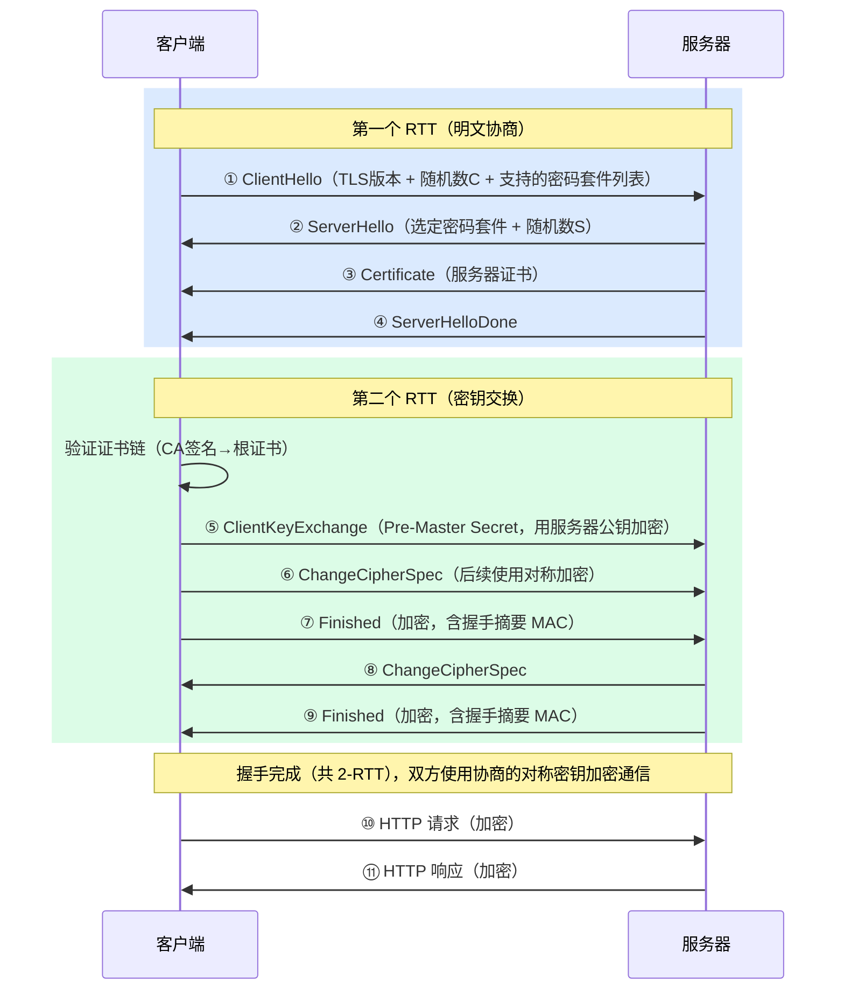
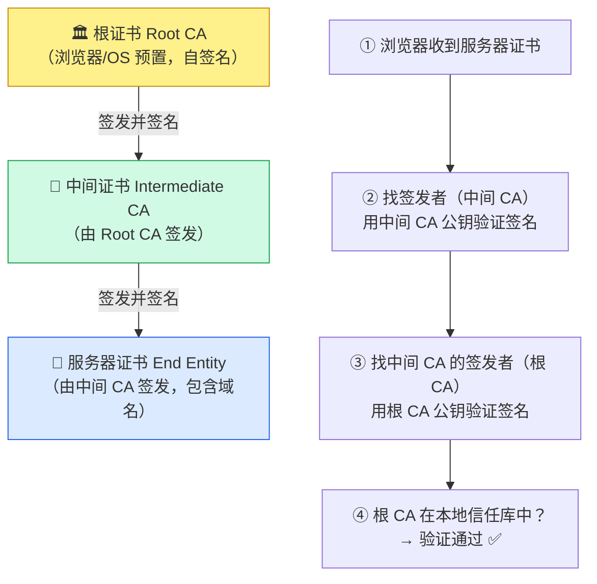
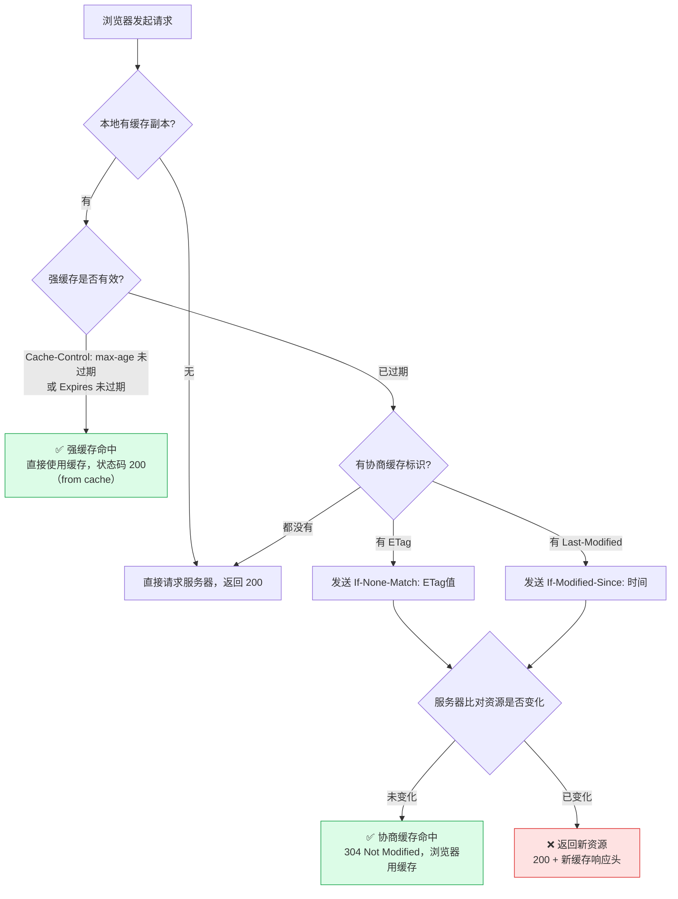
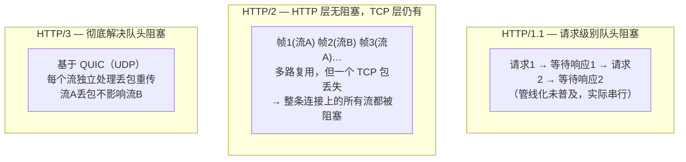

# HTTP 与 HTTPS

## 概念

HTTP（HyperText Transfer Protocol）是 Web 的核心应用层协议。HTTPS = HTTP + TLS，在传输层加密。面试中 HTTP 版本演进、TLS 握手、缓存机制是最高频考点。

## HTTP 版本演进

### HTTP/1.0 vs 1.1 vs 2 vs 3

| 特性 | HTTP/1.0 | HTTP/1.1 | HTTP/2 | HTTP/3 |
|------|----------|----------|--------|--------|
| 连接方式 | 每次请求新建连接 | ✅ 持久连接（Keep-Alive 默认开启） | ✅ 多路复用 | ✅ 多路复用 |
| 队头阻塞 | 有 | 有（管线化未普及） | ✅ TCP 层仍有 | ✅ 彻底解决 |
| 头部压缩 | 无 | 无 | ✅ HPACK | ✅ QPACK |
| 服务器推送 | 无 | 无 | ✅ Server Push | ✅ |
| 传输协议 | TCP | TCP | TCP | ✅ QUIC（基于 UDP） |
| 加密 | 可选 | 可选 | 事实上要求 TLS | ✅ 内建加密 |

### HTTP/1.1 的关键改进

- **持久连接（Keep-Alive）**：默认开启，一个 TCP 连接可发送多个请求，避免频繁建立/关闭连接
- **管线化（Pipelining）**：可以连续发送多个请求不等响应，但响应必须按序返回（实践中基本没用）
- **Host 头**：支持虚拟主机（同一 IP 多个域名）
- **分块传输（Chunked Transfer）**：不需要预知 Content-Length

### HTTP/2 的关键改进

- **多路复用**：同一 TCP 连接上并行交错发送多个请求/响应（二进制分帧），解决了 HTTP 层的队头阻塞
- **头部压缩（HPACK）**：用静态表 + 动态表 + 霍夫曼编码压缩 Header
- **服务器推送**：服务器主动推送资源（如 HTML 引用的 CSS/JS），减少往返
- **二进制协议**：不再是文本协议，解析更高效

**HTTP/2 仍有的问题：** TCP 层的队头阻塞 — 一个 TCP 包丢失，整个连接上的所有流都要等待重传。

### HTTP/3 的关键改进

- **QUIC 协议**：基于 UDP，每个流独立，一个流丢包不影响其他流 → 彻底解决队头阻塞
- **0-RTT 连接建立**：已知服务器时可以零往返恢复连接
- **连接迁移**：用 Connection ID 标识连接（非 IP+端口），Wi-Fi 切 4G 不断连
- **内建加密**：TLS 1.3 融入 QUIC，不可降级

#### 2026 高频追问：0-RTT 重放攻击防御

**0-RTT 最大优点也是最大隐患**：表面零延迟，但默认不抵抗**重放攻击**。

```text
攻击场景：
① 用户在公共 WiFi 上发送 "POST /transfer { amount: 1000, to: A }"
   ，这是 0-RTT 请求
② 攻击者抓包获得该加密报文
③ 几分钟后重发该报文 → 服务器看到合法 ticket，接受请求 → 转账重复执行
```

**防御 3 法**：
① **0-RTT 仅用于幂等接口**（GET / HEAD / 查询接口）——RFC 8446 明确要求；
② **服务器侧不接受 0-RTT 中的写请求**（POST/PUT/DELETE）；路由到 0-RTT 的写请求必须返 425 Too Early 让客户重试（会走 1-RTT）；
③ **anti-replay 窗口**：服务器维护近期接受的 0-RTT 东西 hash，重复拒绝。

```nginx
# nginx 配置示例
ssl_early_data on;          # 允许 0-RTT
proxy_set_header Early-Data $ssl_early_data;

# 后端看到 Early-Data: 1 且请求是 POST/PUT/DELETE → 返 425 Too Early
```

#### 连接迁移深入

**为什么 TCP 做不到连接迁移**：TCP 连接的身份 = `<src IP, src port, dst IP, dst port>` 四元组。手机从 WiFi 切 4G 后 src IP 变了 → 连接必断。

**QUIC 怎么做到**：用 **Connection ID**（8 字节随机）作为身份。IP 变了 Connection ID 不变 → 服务器能识别继续使用同一连接。

**实战价值**：手机 App / 车载 / IoT 设备场景，连接迁移可提高炭顶 30%+。B 站、Cloudflare、Google 都已启用。

## HTTPS 与 TLS 握手

### HTTPS = HTTP + TLS

```
HTTP:   应用层数据 → TCP → IP → 网络
HTTPS:  应用层数据 → TLS 加密 → TCP → IP → 网络
```

### TLS 1.2 握手流程

```
客户端                                    服务端
  |--- ClientHello (支持的加密套件、随机数A) --->|
  |<-- ServerHello (选定加密套件、随机数B) ------|
  |<-- 证书 (服务端公钥) ----------------------|
  |<-- ServerHelloDone ----------------------|
  |--- 客户端验证证书 ------------------------->|
  |--- ClientKeyExchange (用公钥加密预主密钥) -->|
  |--- ChangeCipherSpec ---------------------->|
  |--- Finished (加密验证) -------------------->|
  |<-- ChangeCipherSpec ----------------------|
  |<-- Finished (加密验证) --------------------|
  |========= 对称加密通信 =====================|
```

**耗时：** 2-RTT（两次往返）

### TLS 1.3 握手优化

- 减少到 **1-RTT**（握手和密钥交换合并）
- 支持 **0-RTT**（PSK 恢复连接时）
- 移除不安全的加密算法（RSA 密钥交换、CBC 模式等）
- 更安全更快

### 对称加密 vs 非对称加密

| 对比项 | 对称加密 | 非对称加密 |
|--------|----------|------------|
| 密钥 | 同一个密钥加密和解密 | 公钥加密、私钥解密 |
| 速度 | ✅ 快 | 慢（1000 倍+） |
| 用途 | 数据加密（AES） | 密钥交换、数字签名（RSA、ECDHE） |

**HTTPS 实际做法：** 用非对称加密交换对称密钥，然后用对称密钥加密通信数据（兼顾安全和性能）。

### 证书与 CA

- **CA（Certificate Authority）**：证书颁发机构，验证网站身份
- **证书内容**：域名、公钥、有效期、CA 签名
- **验证流程**：浏览器用 CA 的公钥验证证书签名 → 确认服务器身份 → 防止中间人攻击

**证书链：** 根 CA → 中间 CA → 服务器证书。浏览器内置根 CA 公钥。

### TLS 1.3 / 0-RTT 的安全权衡

**0-RTT（Zero Round-Trip Time）** 是 TLS 1.3 最激进的优化——**复用上次会话**时第一个包就能携带应用数据。但它**牺牲了前向安全性的一部分保证**。

```
普通 TLS 1.3:    1-RTT 握手 → 应用数据
0-RTT 复用:       Client Hello (含 0-RTT 数据) → Server 直接处理
                  ↑ 用上次会话的 PSK (Pre-Shared Key) 加密
```

::: warning ⚠️ 0-RTT 重放攻击风险

> 0-RTT 数据**没有挑战机制**——同一个包**可以被中间人反复重放**。如果服务端处理的是非幂等请求（如转账、下单），会被多次执行。

**规范禁止**：仅可用于 **GET 等幂等请求**，且服务端应有重放检测（如 Nonce 缓存）。

:::

## 同源策略与 CORS

**CORS（跨源资源共享）** 是浏览器端 Web 安全的核心机制，**2025-2026 年前后端面试 100% 问到**。能完整讲出"预检请求 + 五大响应头 + 凭证模式"立刻显出深度。

### 同源策略（Same-Origin Policy）

两个 URL 的 **协议、域名、端口** 三者完全相同才叫"同源"。浏览器**强制隔离不同源**的资源访问，防止恶意网站读取用户在其他网站的数据。

```
当前页面: https://example.com:443/index.html

✅ 同源: https://example.com/api/users
❌ 不同源 (协议): http://example.com
❌ 不同源 (域名): https://api.example.com
❌ 不同源 (端口): https://example.com:8080
```

### CORS：跨源访问的标准方案

CORS 用一组 HTTP Header 让服务器**主动声明**"我允许哪些源跨域访问我"。浏览器根据这些 Header 决定是否放行响应给 JS。

#### 简单请求 vs 预检请求

```
简单请求（同时满足）:
  ① 方法是 GET / HEAD / POST
  ② Content-Type 是 application/x-www-form-urlencoded / multipart/form-data / text/plain
  ③ 没有自定义 Header
  → 浏览器直接发，服务器响应带 Access-Control-* 即可

预检请求（CORS Preflight）:
  浏览器先发 OPTIONS 请求询问服务器:
    OPTIONS /api/users
    Origin: https://app.example.com
    Access-Control-Request-Method: PUT          ← 我想用 PUT
    Access-Control-Request-Headers: Content-Type, Authorization  ← 我要带这些头
  服务器返回:
    Access-Control-Allow-Origin: https://app.example.com
    Access-Control-Allow-Methods: GET, POST, PUT, DELETE
    Access-Control-Allow-Headers: Content-Type, Authorization
    Access-Control-Max-Age: 86400               ← 缓存预检结果 24h
  → 预检通过后，浏览器才发真实请求
```

::: tip 💡 触发预检的常见 case

- 用了 PUT / DELETE / PATCH
- Content-Type 是 `application/json`（**最常见**）
- 带了自定义 Header（如 `Authorization`、`X-Custom-Token`）
- 跨域 fetch 带 `credentials: 'include'`

很多人不知道 **`Content-Type: application/json` 会触发预检**——这就是为什么调通 GET 的 API 一改 POST + JSON 就报 CORS 错。

:::

### 五大 CORS 响应头

| Header | 作用 | 注意 |
|--------|------|------|
| **Access-Control-Allow-Origin** | 允许的源（具体域名或 `*`）| 带凭证时**不能用 `*`**，必须指定具体 origin |
| **Access-Control-Allow-Methods** | 允许的方法 | 仅预检响应中需要 |
| **Access-Control-Allow-Headers** | 允许的请求头 | 仅预检响应中需要 |
| **Access-Control-Allow-Credentials** | 是否允许携带 Cookie | 取值只能是 `true`，配合 `withCredentials` |
| **Access-Control-Max-Age** | 预检结果缓存时长（秒） | **必加**，减少不必要的预检 |
| **Access-Control-Expose-Headers** | 允许 JS 读取的响应头 | 默认 JS 只能读 6 个标准 Header |

### 凭证模式（Credentials）的严格规则

```javascript
// 前端
fetch('https://api.example.com/users', {
    credentials: 'include'    // 带上 Cookie
});

// 服务端必须满足全部:
// ① Access-Control-Allow-Origin: 必须是具体 origin（不能是 *）
// ② Access-Control-Allow-Credentials: true
// ③ Set-Cookie: ...; SameSite=None; Secure   ← Cookie 也必须配合
```

::: warning ⚠️ CORS 不是访问控制

> CORS **不是**在保护服务器——服务器仍然会处理请求并返回响应；CORS 只是浏览器决定要不要把响应交给 JS。**真正的鉴权必须在服务端做**（JWT / Session 验证）。

`curl` / Postman 这类非浏览器客户端**完全不受 CORS 约束**——CORS 只是浏览器的客户端机制。

:::

### Spring Boot 配置示例

```java
@Configuration
public class CorsConfig implements WebMvcConfigurer {
    @Override
    public void addCorsMappings(CorsRegistry registry) {
        registry.addMapping("/api/**")
            .allowedOrigins("https://app.example.com")    // 具体域名
            .allowedMethods("GET", "POST", "PUT", "DELETE")
            .allowedHeaders("*")
            .allowCredentials(true)
            .maxAge(86400);                                // 缓存预检 24h
    }
}
```

## HTTP 缓存机制

### 强缓存 vs 协商缓存

| 类型 | 机制 | 是否请求服务器 | Header |
|------|------|--------------|--------|
| 强缓存 | 直接使用本地缓存 | ❌ 不请求 | Cache-Control、Expires |
| 协商缓存 | 问服务器是否有更新 | ✅ 请求（可能返回 304） | ETag/If-None-Match、Last-Modified/If-Modified-Since |

### 强缓存

```http
# 服务器响应
Cache-Control: max-age=3600    # 3600 秒内直接用缓存
Cache-Control: no-cache         # 每次都要协商（不是不缓存！）
Cache-Control: no-store         # 真正不缓存
```

`Cache-Control`（HTTP/1.1）优先于 `Expires`（HTTP/1.0）。

### 协商缓存

```
首次请求 → 服务器返回 ETag: "abc123" + Last-Modified: Mon, 01 Jan 2024
               ↓
再次请求 → 客户端携带 If-None-Match: "abc123" + If-Modified-Since: ...
               ↓
服务器对比 → 没变化 → 返回 304 Not Modified（无响应体，节省带宽）
           → 有变化 → 返回 200 + 新内容 + 新 ETag
```

**ETag vs Last-Modified：**
- Last-Modified 精度到秒，ETag 基于内容哈希更精确
- 文件被修改但内容没变时，Last-Modified 变了但 ETag 不变
- 优先使用 ETag

## HTTP 状态码：7 大类深度解析

**面试常问"301 和 302 区别"** ——但能讲清 **5 个跳转状态码完整对比**（301 / 302 / 303 / 307 / 308）和**3 个"看似正常"的危险码**（202 / 204 / 206），立刻显出深度。

### 状态码全景

| 类别 | 含义 | 典型 |
|------|------|------|
| **1xx 信息** | 请求已收到，继续处理 | 100 Continue / 101 Switching Protocols（WebSocket）|
| **2xx 成功** | 请求成功 | 200 OK / 201 Created / 204 No Content / 206 Partial Content |
| **3xx 重定向** | 需进一步操作 | 301 / 302 / 304 / 307 / 308 |
| **4xx 客户端错误** | 请求语法错误或权限问题 | 400 / 401 / 403 / 404 / 409 / 422 / 429 |
| **5xx 服务端错误** | 服务端处理失败 | 500 / 502 / 503 / 504 |

### 5 个跳转状态码深度对比（必背）

**重定向题最大坑**：**307/308 是 308 → 这两个 RFC 7231 的新码很多人不知道**。

| 状态码 | 永久/临时 | 方法是否变 | 缓存 | 适用 |
|--------|---------|----------|------|------|
| **301 Moved Permanently** | **永久** | **可能变**（浏览器历史行为：POST 转 GET）| ✅ 强缓存 | 域名永久迁移、SEO |
| **302 Found** | **临时** | **可能变**（同 301）| ❌ | 老的临时跳转，**有歧义** |
| **303 See Other** | 临时 | **强制变 GET** | ❌ | POST 后跳转到结果页（PRG 模式）|
| **307 Temporary Redirect** | **临时** | **方法不变**（POST 仍是 POST）| ❌ | 临时跳转且要保留 method |
| **308 Permanent Redirect** | **永久** | **方法不变** | ✅ 强缓存 | **现代永久跳转**（替代 301）|

::: tip 💡 简单记忆法

> **301 vs 308**：都是永久；301 老规范允许浏览器把 POST 转 GET（破坏幂等），**308 严格保持原方法**。
>
> **302 vs 307**：都是临时；302 老规范允许变 GET，**307 严格保持原方法**。
>
> **新代码用 307/308**——语义明确、无歧义、所有现代浏览器支持。

:::

### 经典坑：301 永久缓存的灾难

```
错误场景:
  公司 example.com → 误配 301 → http://backup.example.com
  浏览器永久缓存这个跳转
  几天后撤回配置 → 用户的浏览器仍然跳转到 backup → 业务中断
  唯一解法: 让所有用户清浏览器缓存（不可能）

正确做法:
  确定永久迁移再用 301/308
  不确定时用 302/307（不缓存）
```

### 容易混淆的 2xx

| 状态码 | 含义 | 真实场景 |
|--------|------|--------|
| **200 OK** | 请求成功，有响应体 | 通用 |
| **201 Created** | 创建成功 | POST /users 返回新用户 |
| **202 Accepted** | **请求已接收但未处理** | 异步任务 |
| **204 No Content** | 成功但**无响应体** | DELETE 操作、健康检查 |
| **206 Partial Content** | **部分内容** | **断点续传 / 视频流**（Range 请求）|

::: warning ⚠️ 204 vs 200 with empty body

> ① **204** 表示"没东西可返回"——**浏览器不会刷新页面**；
> ② **200 + 空 body** 表示"我成功了但返回是空的"——**浏览器会更新页面为空白**。
>
> RESTful DELETE 返回 **204** 而非 200，是规范的做法。

:::

### 容易混淆的 4xx

| 状态码 | 真实含义 | 典型场景 |
|--------|--------|---------|
| **400 Bad Request** | 请求格式/参数错误 | JSON 解析失败、必填参数缺失 |
| **401 Unauthorized** | **未认证**（没登录）| 没带 token / token 过期 |
| **403 Forbidden** | **已认证但无权限** | 用户登录了但访问了管理员页面 |
| **404 Not Found** | 资源不存在 | URL 路径不对 |
| **409 Conflict** | 资源冲突 | 注册时用户名已存在 / 并发更新冲突 |
| **422 Unprocessable Entity** | 语义错误（不是语法）| JSON 解析成功但业务校验失败（如日期非法）|
| **429 Too Many Requests** | **触发限流** | API 限流时返回 |

::: tip 💡 401 vs 403 一句话

> **"401 = 你是谁我不知道；403 = 我知道你是谁但不让你进"** —— 这是面试官最爱让候选人区分的两个状态码。

:::

### 容易混淆的 5xx

| 状态码 | 含义 | 排查方向 |
|--------|------|--------|
| **500 Internal Server Error** | 服务端代码异常 | 看应用日志 |
| **502 Bad Gateway** | **网关/代理收到上游错误响应** | **后端服务挂了 / 网络不通**（Nginx 看到上游 502）|
| **503 Service Unavailable** | **服务暂时不可用** | 限流、维护中、过载保护 |
| **504 Gateway Timeout** | **网关等不到上游响应** | 后端超时（看 Nginx upstream timeout）|

::: warning ⚠️ 502 vs 504 排查方向完全不同

> **502 = 上游服务挂了或拒绝连接**（看后端服务是否启动、健康）；
> **504 = 上游服务在处理但太慢**（看后端慢查询、大锁、GC 卡顿）。
>
> 把这两个错搞混会让排查方向完全跑偏。

:::

## HTTP 常见 Header

| Header | 类型 | 说明 |
|--------|------|------|
| Content-Type | 通用 | MIME 类型（application/json、text/html） |
| Content-Length | 通用 | 响应体长度 |
| Cache-Control | 通用 | 缓存策略 |
| Authorization | 请求 | 认证凭证（Bearer Token） |
| Cookie / Set-Cookie | 请求/响应 | Cookie 传递 |
| Accept | 请求 | 客户端接受的内容类型 |
| Accept-Encoding | 请求 | 支持的压缩方式（gzip、br） |
| Connection | 通用 | keep-alive / close |
| X-Forwarded-For | 请求 | 经过代理时的真实 IP |
| Access-Control-Allow-Origin | 响应 | CORS 允许的源 |

## Keep-Alive 与连接管理

```http
# HTTP/1.1 默认开启
Connection: keep-alive
Keep-Alive: timeout=5, max=100   # 空闲 5 秒关闭，最多复用 100 次
```

**为什么重要：** TCP 三次握手 + TLS 握手耗时显著。Keep-Alive 复用连接，避免重复握手。

**HTTP/2 不需要 Keep-Alive** — 多路复用本身就是一个连接处理所有请求。

## gRPC：基于 HTTP/2 的高性能 RPC

gRPC 是 Google 2015 年开源、基于 **HTTP/2 + Protobuf** 的 RPC 框架，已成为云原生时代**微服务间通信的事实标准**（K8s、Istio、etcd 全部基于 gRPC）。2025-2026 年面试中"为什么用 gRPC 而不是 REST"是必问题。

### gRPC vs REST 核心区别

| 维度 | REST / JSON over HTTP/1.1 | gRPC |
|------|--------------------------|------|
| **传输协议** | HTTP/1.1 | **HTTP/2**（多路复用）|
| **序列化** | JSON（文本）| **Protobuf**（二进制，体积小 3-10×）|
| **接口定义** | OpenAPI / 文档 | **`.proto` 文件**，强类型 |
| **代码生成** | 部分（Swagger Codegen）| **全语言全栈自动生成** |
| **流式** | 不支持（要 SSE/WebSocket 兜底）| **原生支持双向流** |
| **浏览器直连** | ✅ 原生 | ❌（需 gRPC-Web 代理）|
| **可读性** | 高（curl 即可调试）| 低（需 grpcurl / BloomRPC）|
| **典型延迟** | 5-50ms | **1-10ms** |
| **典型场景** | 浏览器 API、第三方开放 | **内部微服务、移动端、强类型场景** |

### 四种 RPC 模式

gRPC 把 HTTP/2 的流能力发挥到极致，提供 4 种调用模式：

```protobuf
service ChatService {
  // 1. Unary：传统请求-响应（像 REST）
  rpc SendMessage(MessageRequest) returns (MessageResponse);

  // 2. Server Streaming：服务端流（订阅推送）
  rpc Subscribe(SubscribeRequest) returns (stream Message);

  // 3. Client Streaming：客户端流（批量上传）
  rpc UploadLogs(stream LogEntry) returns (UploadResult);

  // 4. Bidirectional Streaming：双向流（聊天 / 协作编辑）
  rpc Chat(stream Message) returns (stream Message);
}
```

| 模式 | 经典场景 |
|------|---------|
| **Unary** | 用户查询、订单创建（替代 REST）|
| **Server Streaming** | 实时报价订阅、AI Token 流式输出 |
| **Client Streaming** | 大文件分片上传、批量指标上报 |
| **Bidirectional** | 实时聊天、协作编辑、Computer Use Agent 控制 |

### 为什么 gRPC 快？三个底层原因

#### ① HTTP/2 多路复用

```
HTTP/1.1：每个连接一次处理一个请求 → 100 并发要 100 连接
HTTP/2：  一个连接多个并行流       → 100 并发只要 1 个连接
```

避免了反复 TCP/TLS 握手，减少 90%+ 连接建立开销。

#### ② Protobuf 二进制序列化

```
JSON:     {"userId": 1234567890, "name": "alice"}  → ~40 字节
Protobuf: <binary>                                 → ~12 字节（小 3×）
```

- 字段用 **tag number** 编码而非字符串
- 变长整数（varint）压缩小数字
- 无需 schema 推断 → 序列化/反序列化比 JSON 快 5-10×

#### ③ HTTP/2 头部压缩（HPACK）

请求头静态字典 + 动态字典 + 霍夫曼编码，重复请求的头部开销趋近于 0。

### 服务发现与负载均衡（gRPC 特有）

gRPC 默认是**长连接**，传统 4 层 LB（如 Nginx、ELB）会**只把所有流量打到一个后端**——这是面试高频陷阱。

| 方案 | 原理 | 适用 |
|------|------|------|
| **客户端 LB**（gRPC 原生）| 客户端订阅 service registry，自己挑后端 | 微服务内部 |
| **Proxy LB**（gRPC-aware）| Envoy / Istio 在 7 层解析 HTTP/2 流 | Service Mesh 场景 |
| **Headless Service**（K8s）| DNS 返回所有 Pod IP，客户端自选 | K8s 部署 |
| **xDS API**（gRPC + Envoy）| 控制面下发路由配置 | 大规模生产 |

::: warning ⚠️ 别用 4 层 LB 直接挂 gRPC

把 gRPC 服务放在 ELB / Nginx stream 模块后面 = 长连接 + 不均衡 = **单实例打爆**。必须用 Envoy / Istio / Spring Cloud LB 这类**理解 HTTP/2 的 7 层负载均衡**。

:::

### gRPC 的局限与权衡

| 局限 | 影响 | 缓解 |
|------|------|------|
| **浏览器不能直连** | 前端调不到 | gRPC-Web + Envoy 转换；或前端用 GraphQL/REST，后端微服务间用 gRPC |
| **调试不友好** | curl 调不通 | 用 grpcurl / Postman gRPC 模式 |
| **跨语言团队学习曲线** | 需要全员懂 .proto | 配合 buf.build 做 schema 治理 |
| **不利于公开 API** | 第三方接入门槛高 | 公开 API 用 REST，内部用 gRPC |

### 一句话面试总结

> **"gRPC = HTTP/2（多路复用 + 头部压缩）+ Protobuf（二进制紧凑）+ IDL（强类型代码生成）+ 双向流。它是内部微服务、移动端、AI 流式场景的最佳选择；浏览器开放 API 仍然用 REST。生产中最大的坑是用 4 层 LB 导致负载不均，必须用 Envoy 这类 7 层 gRPC-aware 代理。"**

---

## 面试常问 & 怎么答

### Q1: HTTP/1.1 和 HTTP/2 的区别？

HTTP/2 三大改进：1) 多路复用（一个 TCP 连接并行处理多个请求，解决 HTTP 层队头阻塞）；2) 头部压缩（HPACK）；3) 服务器推送。但 TCP 层的队头阻塞没解决，HTTP/3 用 QUIC（基于 UDP）彻底解决。

### Q2: HTTPS 的加密过程？

用非对称加密交换对称密钥，再用对称密钥加密通信。TLS 握手流程：客户端发送支持的加密套件 → 服务端选择套件并发送证书（公钥）→ 客户端验证证书 → 用公钥加密预主密钥发给服务端 → 双方生成对称密钥 → 后续用对称加密通信。TLS 1.2 需要 2-RTT，TLS 1.3 只需 1-RTT。

### Q3: HTTP 缓存机制？

两种：强缓存（Cache-Control: max-age，不请求服务器直接用本地缓存）和协商缓存（ETag/Last-Modified，请求服务器确认是否有更新，没变返回 304）。强缓存优先，强缓存过期后走协商缓存。

### Q4: GET 和 POST 的区别？

语义上：GET 获取资源（幂等、安全），POST 提交数据（非幂等）。技术上：GET 参数在 URL（有长度限制），POST 参数在请求体；GET 可缓存可收藏，POST 不行；GET 只支持 URL 编码，POST 支持多种编码。本质区别是语义而非技术限制。

### Q5: 什么是队头阻塞？HTTP 各版本怎么解决？

队头阻塞（Head-of-Line Blocking）是指前面的请求/包阻塞了后面的。HTTP/1.1 的请求必须排队；HTTP/2 用多路复用解决了 HTTP 层的队头阻塞，但 TCP 丢包仍会阻塞所有流；HTTP/3 用 QUIC（基于 UDP），每个流独立，彻底解决。

## 深度图解

### TLS 1.2 握手详细时序



> **TLS 1.3 优化为 1-RTT：** 将 KeyExchange（ECDHE）移至第一个 RTT，省去第二次往返，显著降低握手延迟。

---

### 证书链验证流程



**证书包含的关键字段：** 域名（Subject）、公钥、有效期、签发者（Issuer）、签名算法、CA 数字签名。

---

### HTTP 缓存决策树



| 缓存头 | 类型 | 优先级 | 说明 |
|--------|------|--------|------|
| `Cache-Control: max-age=N` | 强缓存 | 最高 | HTTP/1.1，相对时间（秒），推荐 |
| `Expires: <日期>` | 强缓存 | 次之 | HTTP/1.0，绝对时间，受客户端时钟影响 |
| `ETag: "hash"` | 协商缓存 | 高 | 基于内容哈希，精确，有计算开销 |
| `Last-Modified: <日期>` | 协商缓存 | 低 | 基于修改时间，精度只到秒级 |

---

### HTTP/1.1 vs 2 vs 3 队头阻塞对比



**根本原因：** TCP 保证字节有序到达，一个包丢失会阻塞该连接所有后续数据。HTTP/3 改用 QUIC，在 UDP 上实现可靠传输，但每个流的可靠性是独立的。

---

## 看到什么就先想到这类

- 出现 HTTP 版本对比、HTTP/2、HTTP/3。
- 出现 HTTPS、TLS 握手、证书。
- 出现缓存、Cache-Control、ETag、304。
- 出现 Keep-Alive、队头阻塞。
- 出现 GET vs POST。
