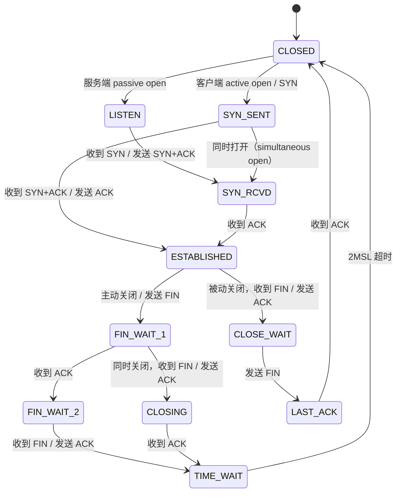
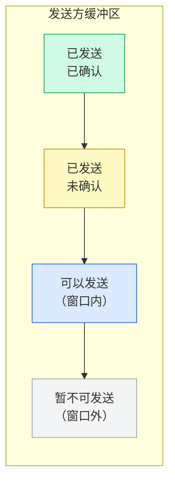
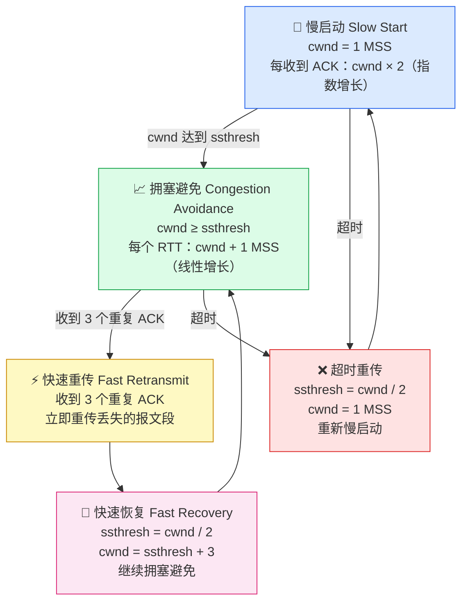

# TCP 与 UDP

<span class="dig-tag dig-tag--category">计算机网络</span>
<span class="dig-tag dig-tag--medium">⭐⭐ 中级</span>
<span class="dig-tag dig-tag--hot">🔥🔥🔥 高频</span>

::: tip 💡 核心要点
TCP 是面向连接的可靠传输协议，通过三次握手建立连接、四次挥手关闭连接，提供流量控制和拥塞控制；UDP 是无连接的不可靠协议，追求低延迟和高吞吐。面试核心在于理解握手/挥手流程、TIME_WAIT 状态和 TCP 可靠性保证机制。
:::

## TCP vs UDP 对比

| 特性 | TCP | UDP |
|------|-----|-----|
| **连接方式** | 面向连接（需握手） | 无连接 |
| **可靠性** | 可靠（确认、重传、有序） | 不可靠（无确认、可能丢包） |
| **速度** | 较慢（控制开销大） | 较快 |
| **头部大小** | 20-60 字节 | 8 字节 |
| **流量控制** | 有（滑动窗口） | 无 |
| **拥塞控制** | 有（慢启动、拥塞避免等） | 无 |
| **传输单位** | 字节流（无边界） | 数据报（有边界） |
| **典型应用** | HTTP、FTP、SMTP、SSH | DNS、视频直播、游戏、VoIP |

## TCP 三次握手

三次握手（Three-Way Handshake）确保双方都能发送和接收数据，建立可靠连接。

```
    Client                        Server
      │                              │
      │─── SYN (seq=x) ────────────►│  [客户端：SYN_SENT]
      │                              │  [服务端：SYN_RECEIVED]
      │◄── SYN+ACK (seq=y, ack=x+1)─│
      │                              │
      │─── ACK (ack=y+1) ──────────►│  [双方：ESTABLISHED]
      │                              │
      │      连接已建立，开始传输       │
```

### 每步的含义

**第一次握手 (SYN)：**
- Client 发送 SYN 报文，seq=x（随机初始序列号）
- 目的：Client 表明自己有发送能力，并告知服务器自己的初始序列号
- Client 状态变为 `SYN_SENT`

**第二次握手 (SYN+ACK)：**
- Server 回复 SYN+ACK，seq=y（服务端初始序列号），ack=x+1
- 目的：Server 确认收到 Client 请求，同时告知 Client 自己的初始序列号
- Server 状态变为 `SYN_RECEIVED`

**第三次握手 (ACK)：**
- Client 回复 ACK，ack=y+1
- 目的：Client 确认收到 Server 的序列号，服务端知道客户端接收正常
- 双方状态变为 `ESTABLISHED`

### 为什么是三次而不是两次？

两次握手不能保证服务端的发送能力被客户端确认，也无法防止**历史偷渡（旧连接请求）**问题：

如果网络延迟导致一个旧的 SYN 报文延迟到达服务器，服务器以为是新连接请求并建立连接，而客户端早已忘记这个请求。三次握手下客户端会发送 RST 终止这个历史连接。

## TCP 四次挥手

四次挥手（Four-Way Teardown）优雅地关闭全双工连接，双方各自关闭自己的发送通道。

```
    Client (主动关闭方)                  Server (被动关闭方)
          │                                    │
          │─── FIN (seq=u) ──────────────────►│  [Client: FIN_WAIT_1]
          │                                    │  [Server: CLOSE_WAIT]
          │◄── ACK (ack=u+1) ─────────────────│
          │                                    │
          │  [Client: FIN_WAIT_2]              │  (Server 继续发送剩余数据)
          │                                    │
          │◄── FIN (seq=v) ────────────────────│  [Server: LAST_ACK]
          │                                    │
          │─── ACK (ack=v+1) ──────────────────►│  [Server: CLOSED]
          │                                    │
          │  [Client: TIME_WAIT, 等待 2MSL]    │
          │                                    │
          │  [Client: CLOSED]                  │
```

### 为什么是四次而不是三次？

**因为 TCP 是全双工的。** 挥手时，双方需要各自关闭自己的发送通道：

- FIN + ACK：Server 收到 FIN 后，先 ACK（表示"我知道你不发了"），但 Server 可能还有数据要发
- FIN + ACK：Server 发送完剩余数据后，主动发 FIN（表示"我也不发了"），Client 回 ACK

如果 Server 没有剩余数据要发，第二步和第三步可以合并，变成三次挥手（实际中确实存在）。

## TIME_WAIT 状态

TIME_WAIT 是主动关闭方在发出最后一个 ACK 后进入的状态，持续 **2MSL（Maximum Segment Lifetime，报文最大存活时间，通常 60 秒，2MSL = 120 秒）**。

### 为什么需要 TIME_WAIT？

1. **确保最后一个 ACK 可靠送达：** 如果 Server 没收到最后的 ACK，会重发 FIN。Client 在 2MSL 内等待，可以重新发 ACK。

2. **等待旧连接的数据消散：** 防止旧连接的延迟报文被新建立的相同四元组连接误收。2MSL 内所有旧报文一定会过期消失。

### TIME_WAIT 过多的问题与解决

**问题：** 高并发服务器端口/连接快速消耗，导致无法建立新连接。

**解决方案：**
```bash
# 开启 TCP 连接重用（需要时间戳支持）
net.ipv4.tcp_tw_reuse = 1

# 缩短 FIN_WAIT2 超时时间
net.ipv4.tcp_fin_timeout = 30

# 增大端口范围
net.ipv4.ip_local_port_range = 1024 65535
```

## TCP 可靠传输机制

TCP 通过以下几个机制保证传输可靠性：

### 1. 序列号与确认号 (Seq / Ack)

每个字节都有序列号，接收方通过 ACK 确认已收到的字节，发送方只需重传未被确认的部分。

### 2. 超时重传 (Retransmission Timeout, RTO)

```
发送方                接收方
  │── data (seq=100)──►│
  │                    │ (ACK 丢失)
  │── [RTO 超时] ───────│
  │── 重传 seq=100 ───►│
  │◄── ACK(101) ────────│
```

RTO 动态计算：`RTO = SRTT + 4 * DevRTT`（基于历史 RTT 平滑值和偏差）。

### 3. 滑动窗口 (Sliding Window)

允许发送方在收到 ACK 前就发送多个报文，提高吞吐量：

```
发送方窗口 (rwnd=4)
┌────────────────────────────────────────┐
│ 已确认 │ 已发送待确认 │ 可发送 │ 不可发 │
└────────────────────────────────────────┘
                │◄── 窗口 ───►│
```

### 4. 流量控制 (Flow Control)

接收方通过 TCP 头部的 `Window Size` 字段告知发送方自己的接收缓冲区剩余大小，防止发送方发送过快导致接收方缓冲区溢出。

### 5. 拥塞控制 (Congestion Control)

| 阶段 | 机制 | 说明 |
|------|------|------|
| **慢启动** | cwnd 从 1 MSS 指数增长 | 连接初始阶段探测网络容量 |
| **拥塞避免** | cwnd 到达 ssthresh 后线性增长 | 避免增长过快 |
| **快速重传** | 收到 3 个重复 ACK 立即重传 | 无需等待 RTO 超时 |
| **快速恢复** | ssthresh = cwnd/2，cwnd = ssthresh | 从拥塞中快速恢复 |

## 常见误区

::: warning 易错点
1. **UDP 不一定比 TCP 快**，在同等网络条件下两者差异不大，UDP 的优势在于低延迟和灵活控制（应用层可自定义可靠机制，如 QUIC）
2. **四次挥手可能变三次**，当 Server 收到 FIN 时已没有数据要发，可以合并 ACK 和 FIN，变成三次挥手
3. **TIME_WAIT 是主动关闭方特有的**，被动关闭方经历 CLOSE_WAIT，而不是 TIME_WAIT
4. **SYN Flood 攻击**：攻击者大量发送 SYN 但不回 ACK，导致服务器 SYN 队列满。防御方式：SYN Cookie
:::

<div class="dig-questions">
  <div class="dig-questions__header">
    <span>📝 面试真题</span>
    <span style="font-size: 12px; opacity: 0.8;">3 道高频</span>
  </div>
  <div class="dig-questions__item">
    <span>1. TCP 三次握手的过程是什么？为什么不是两次或四次？</span>
    <span class="dig-tag dig-tag--medium" style="margin: 0;">中等</span>
  </div>
  <div class="dig-questions__item">
    <span>2. TCP 四次挥手为什么需要四次？TIME_WAIT 的作用是什么？</span>
    <span class="dig-tag dig-tag--medium" style="margin: 0;">中等</span>
  </div>
  <div class="dig-questions__item">
    <span>3. TCP 如何保证可靠传输？</span>
    <span class="dig-tag dig-tag--medium" style="margin: 0;">中等</span>
  </div>
</div>

### Q1: TCP 三次握手过程？

**一句话总结：** 双方各发一个 SYN，各收一个 ACK，共交换三个报文，确保全双工链路双向可达。

**答题框架：**
1. Client → Server: `SYN(seq=x)` — 我想建立连接，我的起始序列号是 x
2. Server → Client: `SYN+ACK(seq=y, ack=x+1)` — 好的，我的起始序列号是 y，我收到你的了
3. Client → Server: `ACK(ack=y+1)` — 我收到你的了，连接建立

**两次握手的缺陷：** 无法防止历史旧 SYN 报文导致的半开连接。假设一个延迟的旧 SYN 到达服务器，两次握手下服务器会以为是新连接而建立，浪费资源。三次握手下客户端会发送 RST 终止。

### Q2: TIME_WAIT 的作用？

两个作用：
1. **保证最后 ACK 可靠到达**：如果最后的 ACK 丢失，Server 会重发 FIN，Client 在 TIME_WAIT 期间可以重新发 ACK
2. **让旧连接的数据包消散**：等待 2MSL，确保网络中所有属于旧连接的延迟报文都已过期，避免被新连接误收

### Q3: TCP 可靠传输机制？

TCP 通过五个机制保证可靠性：
1. **序列号+确认应答**：每个字节有序号，可检测丢包和乱序
2. **超时重传**：未收到 ACK 则超时后重传（RTO 自适应调整）
3. **滑动窗口**：批量发送，提高效率，支持乱序重排
4. **流量控制**：接收方通过窗口大小限制发送速率，防止缓冲区溢出
5. **拥塞控制**：慢启动+拥塞避免+快速重传+快速恢复，避免网络整体拥塞

## 延伸阅读

- [RFC 793 - TCP 规范](https://www.rfc-editor.org/rfc/rfc793)
- [TCP 的那些事儿（上）- CoolShell](https://coolshell.cn/articles/11564.html)
- [Beej's Guide to Network Programming](https://beej.us/guide/bgnet/)

## 深度图解

### TCP 完整连接状态机



**TIME_WAIT 存在的两个原因：**
1. **保证最后一个 ACK 能达到对端：** 若最后的 ACK 丢失，对端会重发 FIN，此时 TIME_WAIT 状态的一方能够重新发送 ACK。
2. **让旧连接的报文在网络中消散：** 等待 2MSL（约 60 秒），确保该连接产生的所有报文段从网络中消失，防止被新连接误收。

---

### 滑动窗口原理



- **收到 ACK** → 窗口左沿右移，A2 部分转为 A1
- **接收方通告 rwnd** → 控制窗口右沿，实现**流量控制**
- **发送窗口 = min(cwnd, rwnd)**：cwnd 是拥塞窗口，rwnd 是接收窗口

---

### 拥塞控制四阶段



| 事件 | ssthresh 变化 | cwnd 变化 |
|------|-------------|---------|
| 初始 | 系统默认（如 64KB） | 1 MSS |
| cwnd < ssthresh | 不变 | 每收到 ACK ×2 |
| cwnd ≥ ssthresh | 不变 | 每 RTT +1 MSS |
| 收到 3 重复 ACK | cwnd / 2 | ssthresh + 3 |
| 超时 | cwnd / 2 | 1 MSS，重慢启动 |
