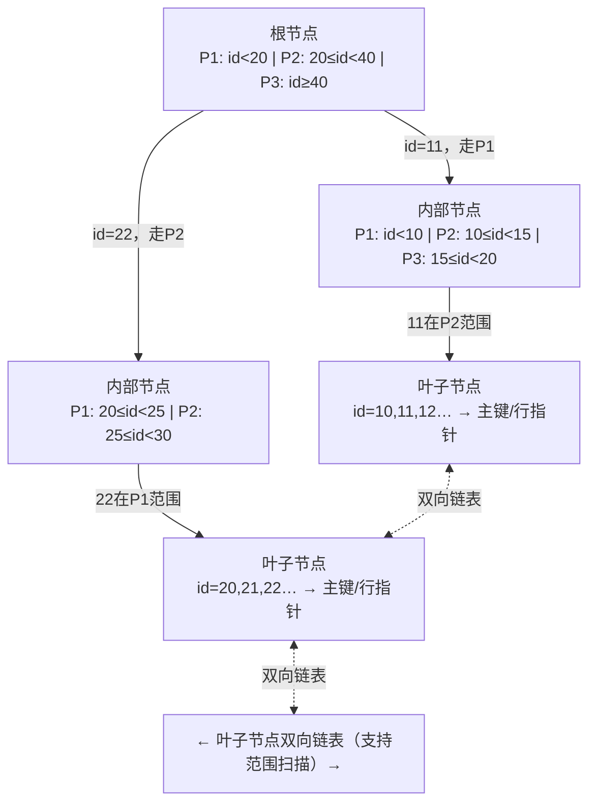
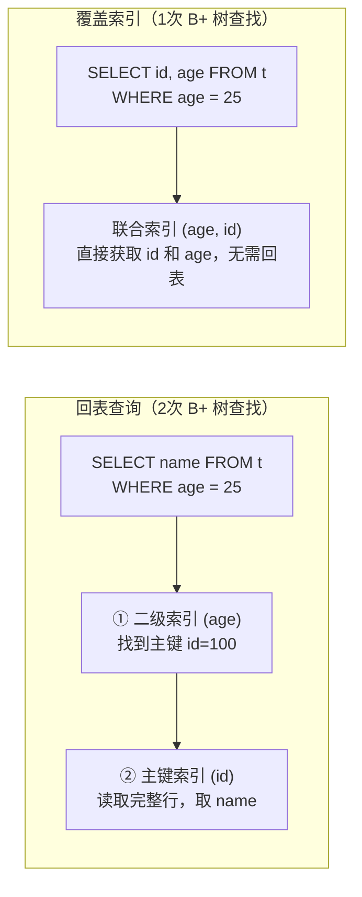

# 索引原理 Indexing

<span class="dig-tag dig-tag--category">数据库</span>
<span class="dig-tag dig-tag--hard">⭐⭐⭐ 高级</span>
<span class="dig-tag dig-tag--hot">🔥🔥🔥 高频</span>

::: tip 💡 核心要点
MySQL InnoDB 使用 B+ 树作为索引数据结构，磁盘 I/O 友好且支持范围查询。索引能极大加速查询，但也有维护成本和失效场景。覆盖索引（无需回表）是优化查询性能的重要手段。
:::

## 什么是索引？

索引是数据库中一种单独的、物理的数据结构，用于加速对表中数据的检索。没有索引的查询需要**全表扫描**（O(n)），有了索引可以优化到 **O(log n)**。

**类比：** 索引就像书的目录，能快速定位到指定页码，而不必从头翻到尾。

## 索引类型

### 按数据结构分类

| 类型 | 引擎支持 | 特点 |
|------|---------|------|
| **B+ 树索引** | InnoDB、MyISAM | 最常用，支持范围查询、排序 |
| **哈希索引** | Memory（InnoDB 自适应哈希） | 等值查询极快，不支持范围查询 |
| **全文索引** | InnoDB（5.6+）、MyISAM | 用于文本模糊搜索 |
| **空间索引** | MyISAM | 用于地理空间数据（R 树） |

### 按逻辑角色分类

| 类型 | 说明 |
|------|------|
| **主键索引** | 唯一标识每行数据，InnoDB 中也是聚簇索引 |
| **唯一索引** | 确保列值唯一，允许 NULL |
| **普通索引** | 最基本的索引，无唯一性限制 |
| **组合索引** | 多列组合，遵循最左前缀原则 |
| **覆盖索引** | 查询所需列都在索引中，无需回表 |

## B+ 树结构与特点

### 为什么 MySQL 选择 B+ 树？

**B 树 vs B+ 树的关键区别：**
- B 树的**内部节点**也存储数据；B+ 树只在**叶节点**存储数据
- B+ 树**叶节点**之间通过双向链表连接，支持顺序遍历和范围查询

```
B+ 树示意（3 阶）：

               [30 | 60]               ← 内部节点（只存键）
              /    |    \
        [10|20] [40|50] [70|80]        ← 内部节点
        /  |\ ...
[1|5|9]─►[10|15|20]─►[25|30|35]─► ... ← 叶节点（存键+数据，双向链表）
```

**选择 B+ 树的原因：**

1. **减少磁盘 I/O：** B+ 树内部节点不存数据，单个节点可存更多键，树更矮（通常 3-4 层），每次查询只需 3-4 次磁盘 I/O
2. **支持范围查询：** 叶节点链表使范围扫描（`BETWEEN`、`>`、`<`）非常高效
3. **查询稳定性：** 所有查询都要到叶节点，时间复杂度稳定为 O(log n)
4. **顺序访问优化：** 叶节点顺序排列，全表扫描时磁盘顺序读效率高

### 为什么不用红黑树或跳表？

- **红黑树：** 高度比 B+ 树高，百万数据时树高可能 20+，磁盘 I/O 次数多
- **跳表：** 适合内存结构（Redis 用跳表实现 Sorted Set），但磁盘随机访问效率低

## 聚簇索引与非聚簇索引

### 聚簇索引 (Clustered Index)

InnoDB 中，**数据本身按主键顺序存储在 B+ 树的叶节点**，每张表只有一个聚簇索引。

```
主键索引 B+ 树叶节点：
┌──────────────────────────────┐
│  id=1 | name="Alice" | age=25 │  ← 完整行数据
│  id=2 | name="Bob"   | age=30 │
│  id=3 | name="Carol" | age=28 │
└──────────────────────────────┘
```

### 非聚簇索引 (Non-Clustered / Secondary Index)

辅助索引的叶节点**只存储索引列的值和主键值**，通过主键再查完整行，这个过程叫**回表**。

```
name 列辅助索引：
┌─────────────────────┐
│  "Alice" → id=1     │  ← 只存 name + 主键
│  "Bob"   → id=2     │
│  "Carol" → id=3     │
└─────────────────────┘
         ↓ 回表
    聚簇索引查完整行
```

> **MyISAM 不区分聚簇/非聚簇：** MyISAM 索引和数据分开存储，所有索引都是非聚簇的，叶节点存的是数据文件的物理地址。

## 覆盖索引 (Covering Index)

当查询的所有列都包含在一个索引中时，数据库可以**直接从索引返回结果，无需回表**。

```sql
-- 假设有索引 idx_name_age (name, age)

-- 覆盖索引查询（无需回表）
SELECT name, age FROM users WHERE name = 'Alice';

-- 非覆盖索引查询（需要回表取 email）
SELECT name, age, email FROM users WHERE name = 'Alice';
```

**EXPLAIN 验证：** `Extra` 列出现 `Using index` 说明用了覆盖索引。

### 组合索引的最左前缀原则

组合索引 `(a, b, c)` 等效于建了三个前缀索引：`(a)`、`(a, b)`、`(a, b, c)`。

```sql
-- 可以用到索引
WHERE a = 1
WHERE a = 1 AND b = 2
WHERE a = 1 AND b = 2 AND c = 3
WHERE a = 1 AND b > 5       -- a 用索引，b 范围后的列不能用

-- 用不到索引
WHERE b = 2                  -- 没有 a
WHERE b = 2 AND c = 3        -- 没有 a
WHERE c = 3                  -- 没有 a, b
```

## 索引失效场景

面试必考！以下情况会导致索引无法被使用，退化成全表扫描：

| 场景 | 示例 | 原因 |
|------|------|------|
| **左模糊查询** | `LIKE '%keyword'` | B+ 树按前缀排序，无法匹配后缀 |
| **对索引列运算** | `WHERE age + 1 = 26` | 索引存储的是原值，运算后无法定位 |
| **对索引列使用函数** | `WHERE YEAR(create_time) = 2024` | 同上，应改为范围查询 |
| **类型隐式转换** | `WHERE phone = 13812345678`（phone 是 varchar） | 触发类型转换，相当于函数操作 |
| **OR 连接非索引列** | `WHERE id = 1 OR name = 'Alice'`（name 无索引） | 一个条件全表扫描，OR 合并后整体也全扫 |
| **NOT IN / !=** | `WHERE status != 1` | 范围不连续，优化器可能放弃索引 |
| **违反最左前缀** | 跳过组合索引首列 | 见上节 |

```sql
-- 函数失效的正确改法
-- 错误
WHERE YEAR(create_time) = 2024
-- 正确
WHERE create_time >= '2024-01-01' AND create_time < '2025-01-01'

-- 类型转换的正确改法
-- 错误（phone 是 VARCHAR）
WHERE phone = 13812345678
-- 正确
WHERE phone = '13812345678'
```

## 索引设计原则

1. **选择性高的列优先建索引**（唯一值多的列，如 user_id > status）
2. **频繁出现在 WHERE、JOIN ON、ORDER BY、GROUP BY 的列**
3. **不要对频繁更新的列建过多索引**（维护索引有写入开销）
4. **尽量使用覆盖索引**减少回表
5. **组合索引把选择性高的列放前面**，且考虑查询语句的最左前缀

## 常见误区

::: warning 易错点
1. **主键建议用自增整数**，UUID 或随机主键会导致 B+ 树频繁分裂（页分裂），降低写入性能
2. **NULL 值是可以走索引的**，MySQL 5.6+ 已优化，`IS NULL` 和 `IS NOT NULL` 在选择性合适时会走索引
3. **索引不是越多越好**，每个索引都会占用存储空间，并且在 INSERT/UPDATE/DELETE 时需要同步维护，增加写入开销
4. **EXPLAIN 的 type 列：** system > const > eq_ref > ref > range > index > ALL，`ref` 及以上才算高效利用索引
:::

<div class="dig-questions">
  <div class="dig-questions__header">
    <span>📝 面试真题</span>
    <span style="font-size: 12px; opacity: 0.8;">3 道高频</span>
  </div>
  <div class="dig-questions__item">
    <span>1. MySQL 为什么使用 B+ 树而不是 B 树或哈希索引？</span>
    <span class="dig-tag dig-tag--hard" style="margin: 0;">困难</span>
  </div>
  <div class="dig-questions__item">
    <span>2. 什么是覆盖索引？什么是回表？如何避免回表？</span>
    <span class="dig-tag dig-tag--medium" style="margin: 0;">中等</span>
  </div>
  <div class="dig-questions__item">
    <span>3. 哪些情况会导致索引失效？</span>
    <span class="dig-tag dig-tag--medium" style="margin: 0;">中等</span>
  </div>
</div>

### Q1: 为什么 MySQL 使用 B+ 树？

**从三个角度回答：**

1. **减少磁盘 I/O：** B+ 树内部节点只存键不存数据，一个节点可以存放更多键，使树更矮（通常 3-4 层）。每次查询对应 3-4 次磁盘 I/O，而红黑树对百万数据树高 20+。

2. **支持高效范围查询：** B+ 树叶节点通过双向链表连接，范围查询只需找到起始节点，然后顺序遍历链表，非常高效。B 树的内部节点也存数据，范围查询需要中序遍历整棵树。

3. **查询性能稳定：** B+ 树所有查询都必须到达叶节点，时间复杂度恒为 O(log n)。B 树可能在内部节点命中，查询时间不稳定。

**vs 哈希索引：** 哈希索引等值查询 O(1)，但不支持范围查询和排序，而且需要整个键参与哈希，无法支持最左前缀。

### Q2: 什么是覆盖索引和回表？

- **回表：** 通过辅助索引找到主键，再用主键在聚簇索引中查找完整行数据，需要两次 B+ 树查找
- **覆盖索引：** 查询所需的所有列都在某个索引中，查索引即可，无需回表

**如何避免回表：** 为常用查询建立包含所有 SELECT 列的组合索引（索引覆盖 SELECT 列），用 EXPLAIN 验证出现 `Using index`。

### Q3: 索引失效场景（背 6 个）

1. **左模糊** `LIKE '%xx'` — 无法利用 B+ 树前缀排序
2. **索引列做函数/运算** — `YEAR(date)`、`age+1` 等，应改为等值或范围
3. **类型隐式转换** — varchar 列用整数比较，MySQL 隐式调用 CAST，相当于函数操作
4. **OR 连接非索引列** — OR 的任一分支全表扫描会影响整体
5. **违反最左前缀** — 组合索引跳过首列
6. **数据选择性太低** — 如 status 只有 0/1 两个值，优化器认为全表扫描更快

## 延伸阅读

- [MySQL 官方文档 - Optimization and Indexes](https://dev.mysql.com/doc/refman/8.0/en/optimization-indexes.html)
- [Use The Index, Luke](https://use-the-index-luke.com/) — 数据库索引专项学习网站
- 《高性能 MySQL》第 5 章：索引优化

## 深度图解

### B+ 树索引查询路径



**查询 `WHERE id = 22` 的路径：** 根节点 → 内部节点（20≤id＜40 分支）→ 叶子节点 → 找到数据指针，共 3 次 I/O（树高决定）。

**为什么 B+ 树叶子节点用双向链表连接？** 支持范围查询（`WHERE id BETWEEN 10 AND 30`）：找到起始叶子后，直接沿链表向右扫描，无需回到根节点。

---

### 回表 vs 覆盖索引



> **优化技巧：** 将 SELECT 的列加入联合索引（如 `INDEX(age, name)`），即可避免回表，减少约 50% I/O。

---

### 索引失效 6 种典型场景

```sql
-- ❌ 1. 对索引列使用函数
SELECT * FROM t WHERE YEAR(create_time) = 2024;
-- ✅ 改写：WHERE create_time BETWEEN '2024-01-01' AND '2024-12-31'

-- ❌ 2. 隐式类型转换（phone 是 VARCHAR，传入整数）
SELECT * FROM t WHERE phone = 13812345678;
-- ✅ 改写：WHERE phone = '13812345678'

-- ❌ 3. LIKE 前缀通配（索引无法定位起始点）
SELECT * FROM t WHERE name LIKE '%张';
-- ✅ 改写：WHERE name LIKE '张%'（前缀匹配可走索引）

-- ❌ 4. 违反最左前缀（联合索引 INDEX(a, b, c)，跳过 a）
SELECT * FROM t WHERE b = 1 AND c = 2;
-- ✅ 改写：WHERE a = ? AND b = 1 AND c = 2

-- ❌ 5. 范围查询右侧列失效（INDEX(a, b, c)）
SELECT * FROM t WHERE a = 1 AND b > 5 AND c = 2;
-- c 上的索引失效；b 范围查询之后的列无法走索引

-- ❌ 6. OR 连接非索引列
SELECT * FROM t WHERE id = 1 OR name = '张三';
-- name 无索引时，整个查询走全表扫描
-- ✅ 改写：拆为两个查询 UNION ALL，或给 name 加索引
```
