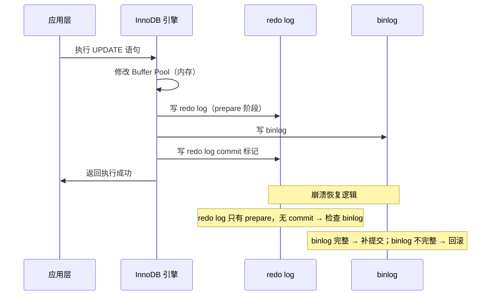

# MySQL 架构与存储引擎

## 概念

本节覆盖 MySQL 的**逻辑分层架构**、一条 SQL 语句从发出到返回结果的完整链路、InnoDB 与 MyISAM 的核心差异，以及 InnoDB 的 Buffer Pool 和存储结构。这些内容是理解锁、事务、索引等高频考点的基础。

---

## 核心原理

### 1. MySQL 逻辑架构分层

```
┌─────────────────────────────────────────────┐
│                 客户端 (Client)               │
└───────────────────┬─────────────────────────┘
                    │ TCP / Unix Socket
┌───────────────────▼─────────────────────────┐
│              连接器 (Connector)               │
│  · 身份验证 · 权限查询 · 连接池管理            │
└───────────────────┬─────────────────────────┘
                    │
┌───────────────────▼─────────────────────────┐
│   查询缓存 (Query Cache) — MySQL 8.0 已移除   │
│  · 命中则直接返回，否则继续                    │
└───────────────────┬─────────────────────────┘
                    │
┌───────────────────▼─────────────────────────┐
│              分析器 (Parser)                  │
│  · 词法分析 · 语法分析 · 生成解析树            │
└───────────────────┬─────────────────────────┘
                    │
┌───────────────────▼─────────────────────────┐
│              优化器 (Optimizer)               │
│  · 选择索引 · 决定 JOIN 顺序 · 生成执行计划    │
└───────────────────┬─────────────────────────┘
                    │
┌───────────────────▼─────────────────────────┐
│              执行器 (Executor)                │
│  · 权限校验 · 调用存储引擎接口 · 组装结果集    │
└───────────────────┬─────────────────────────┘
                    │
┌───────────────────▼─────────────────────────┐
│           存储引擎 (Storage Engine)           │
│     InnoDB  /  MyISAM  /  Memory  / …        │
│  · 数据读写 · 索引管理 · 事务 · 锁            │
└─────────────────────────────────────────────┘
```

> Server 层（连接器→执行器）与存储引擎层通过**存储引擎 API** 解耦，可插拔替换。

---

### 2. SELECT 语句完整执行流程

```
客户端发送 SQL
    │
    ▼
连接器：验证用户名密码，加载权限
    │
    ▼
查询缓存（8.0 已移除）：
    命中 ──▶ 直接返回结果
    未命中 ──▶ 继续
    │
    ▼
分析器：词法 + 语法解析，识别表名、列名
    │
    ▼
优化器：选最优索引，生成执行计划
    │
    ▼
执行器：调用存储引擎接口逐行读取
    │
    ▼
存储引擎：从 Buffer Pool 或磁盘读取数据页
    │
    ▼
返回结果集给客户端
```

---

### 3. UPDATE 语句完整执行流程（含 redo log / binlog）

```
执行 UPDATE t SET c=c+1 WHERE id=1
    │
    ▼
执行器找到 id=1 的行（先查 Buffer Pool，未命中则从磁盘读入）
    │
    ▼
执行器调用 InnoDB 写接口，修改内存中的数据页
    │
    ▼
InnoDB 写 redo log（prepare 状态）
    │   ← WAL（Write-Ahead Logging）保证崩溃恢复
    ▼
Server 层写 binlog（追加到 binlog 文件）
    │   ← 用于主从复制、数据恢复
    ▼
InnoDB 将 redo log 标记为 commit 状态
    │
    ▼
事务提交，返回执行成功
    │
    ▼
（后台）脏页异步刷回磁盘
```

**两阶段提交**（prepare → binlog → commit）确保 redo log 与 binlog 的一致性，防止主从数据不一致。

---

### 4. InnoDB vs MyISAM 核心对比

| 特性 | InnoDB | MyISAM |
|------|--------|--------|
| **事务支持** | ✅ 支持（ACID） | ❌ 不支持 |
| **锁粒度** | 行锁（+ 表锁） | 表锁 |
| **崩溃恢复** | ✅ redo log 自动恢复 | ❌ 需手动修复 |
| **外键** | ✅ 支持 | ❌ 不支持 |
| **MVCC** | ✅ 支持（快照读） | ❌ 不支持 |
| **索引类型** | 聚簇索引（主键即数据） | 非聚簇索引（索引与数据分离） |
| **全文索引** | ✅（5.6+） | ✅ |
| **Count(*) 性能** | 较慢（需扫描） | 很快（维护行数变量） |
| **适用场景** | OLTP，读写混合，需要事务 | 只读 / 读多写少，统计类 |

> **现代项目默认选 InnoDB**。MyISAM 仅在极少数只读+高频 `COUNT(*)` 场景有优势，且 MySQL 8.0 系统表也已全部迁移至 InnoDB。

---

### 5. Buffer Pool 工作原理

Buffer Pool 是 InnoDB 在内存中维护的**数据页缓存**，默认页大小 16KB。

```
磁盘 I/O（慢）                内存 Buffer Pool（快）
┌──────────┐    读入数据页    ┌────────────────────────┐
│  .ibd    │ ─────────────▶  │  LRU 链表               │
│  数据文件 │                 │  ┌────────┬──────────┐  │
└──────────┘                 │  │ New区  │  Old区   │  │
                             │  │ (5/8)  │  (3/8)   │  │
                             │  └────────┴──────────┘  │
                             │  · 新页先进 Old 头部      │
                             │  · 1s 后再次访问才升入 New │
                             │  · Old 尾部页面被淘汰      │
                             └────────────────────────┘
```

**改进 LRU（防止全表扫描污染缓存）：**
- 新读入的页先插入 **Old 区头部**，不直接进 New 区
- 只有在 Old 区停留超过 `innodb_old_blocks_time`（默认 1000ms）后再次被访问，才晋升到 New 区头部
- 避免一次大查询将热点数据全部替换出去

**脏页刷新时机：**
1. redo log 快写满时（强制刷脏）
2. Buffer Pool 内存不足，需要淘汰脏页时
3. MySQL 空闲时后台线程定期刷新
4. 正常关闭 MySQL 时

---

### 6. InnoDB 存储结构

```
表空间 (Tablespace / .ibd 文件)
└── 段 (Segment)
    ├── 叶子节点段（存储真实数据行）
    ├── 非叶子节点段（存储索引非叶层）
    └── 回滚段（undo log）
        └── 区 (Extent) — 连续 64 个页 = 1MB
            └── 页 (Page) — 16KB（I/O 最小单元）
                └── 行 (Row) — 实际数据记录
```

| 层级 | 大小 | 说明 |
|------|------|------|
| 页 (Page) | 16 KB | B+ 树节点，读写最小单位 |
| 区 (Extent) | 1 MB（64页） | 顺序分配，减少碎片 |
| 段 (Segment) | 若干区 | 区分叶子节点与非叶子节点 |
| 表空间 | 若干段 | 默认每张表一个 .ibd 文件（innodb_file_per_table） |

---

## 面试常问 & 怎么答

**Q1：一条 SQL 语句在 MySQL 中是怎么执行的？**

先说分层：MySQL 分为 Server 层和存储引擎层。Server 层包含连接器、分析器、优化器、执行器；存储引擎层负责实际的数据读写。

执行流程：
1. **连接器**验证身份、加载权限
2. **分析器**做词法+语法解析，确认表名列名是否存在
3. **优化器**选择索引、确定 JOIN 顺序，生成执行计划
4. **执行器**调用存储引擎接口，按执行计划逐行读取数据
5. **存储引擎**（InnoDB）先查 Buffer Pool，未命中则从磁盘读入

如果是 UPDATE，还涉及 redo log 的两阶段提交（prepare → 写 binlog → commit）来保证崩溃安全和主从一致。

---

**Q2：InnoDB 和 MyISAM 有什么区别？怎么选？**

核心差异：InnoDB 支持事务（ACID）、行锁、外键、MVCC、崩溃自动恢复；MyISAM 都不支持，但 `COUNT(*)` 更快，因为它维护了一个行数变量。

索引结构也不同：InnoDB 用聚簇索引，主键 B+ 树叶子节点直接存数据行；MyISAM 用非聚簇索引，叶子节点存的是数据文件的物理地址。

**怎么选**：现代项目几乎都选 InnoDB，因为需要事务、崩溃恢复和更细粒度的锁。只有非常老的只读报表系统或有大量 `COUNT(*)` 无过滤条件查询的场景才会考虑 MyISAM，MySQL 8.0 已经全面切到 InnoDB。

---

**Q3：Buffer Pool 是什么？为什么需要它？**

Buffer Pool 是 InnoDB 在内存中维护的数据页缓存，本质上是一块大内存区域，以 16KB 的页为单位管理。

为什么需要：磁盘 I/O 比内存慢几个数量级。把频繁访问的数据页缓存在内存里，读取时先查 Buffer Pool，写入时也先修改内存（WAL 机制），再异步刷盘，极大提升了读写性能。

内部用**改进版 LRU 链表**管理页的淘汰，分 New 区（热数据，5/8）和 Old 区（冷数据，3/8），新读入的页先进 Old 区，防止全表扫描把热点数据全部挤出缓存。

---

## 看到什么就先想到这类

| 触发信号 | 联想方向 |
|----------|----------|
| "SQL 执行慢" / "explain 怎么看" | 优化器选了什么索引？执行计划哪步最贵？ |
| "崩溃后数据会丢吗" | redo log 两阶段提交，Buffer Pool 脏页 |
| "主从数据不一致" | binlog 格式（statement/row/mixed），两阶段提交 |
| "为什么用 InnoDB" | 事务、行锁、MVCC、崩溃恢复 |
| "count(*) 慢" | InnoDB 无行数缓存，需全表或索引扫描；考虑用 Redis 计数 |
| "内存命中率低" | Buffer Pool 大小配置（`innodb_buffer_pool_size`），LRU 策略 |
| "表空间碎片" | InnoDB 区（Extent）连续分配，`OPTIMIZE TABLE` 可整理 |

---

## 深度图解

### redo log 与 binlog 两阶段提交

InnoDB 使用"两阶段提交"协议保证 redo log 和 binlog 的一致性，防止主从数据不一致：



**为什么需要两阶段提交？**
若不使用两阶段提交，binlog 和 redo log 可能不一致：主库用 redo log 崩溃恢复，从库用 binlog 重放，导致主从数据不一致。两阶段提交确保两者原子性地同步。

---

### Buffer Pool 改进版 LRU

InnoDB 将 LRU 链表分为**热区（63%）**和**冷区（37%）**，防止全表扫描等一次性操作污染热数据：


> **为什么要分冷热区？** `SHOW FULL TABLES` 等语句会触发大量页面读入，若直接插入 LRU 头部会将热数据全部挤出。冷区机制保证只有"真正多次访问的页"才晋升热区。

---

## 延伸思考

**Q: SELECT * 和指定列查询有什么区别？**

A: 性能上，`SELECT *` 无法利用覆盖索引（必须回表读完整行），而指定列查询可以通过覆盖索引避免回表，减少 I/O。维护上，`SELECT *` 会随表结构变化返回更多数据，增加网络传输开销，且可能导致应用层反序列化出错，生产环境应避免使用。

**Q: MySQL 8.0 为什么删除查询缓存？**

A: 查询缓存问题很多：① 只要对表有任何写操作，该表所有缓存立即全部失效，高并发写场景命中率极低；② 缓存 key 是完整 SQL 字符串（含空格大小写），稍有不同就无法命中；③ 维护缓存需要全局锁，多线程并发下反而成为瓶颈。整体收益不如维护成本，MySQL 8.0 彻底移除。

**Q: `innodb_flush_log_at_trx_commit` 三个值的区别？**

A: 控制 redo log 刷盘策略：`0` = 每秒刷一次（可能丢 1 秒数据，性能最好）；`1` = 每次提交都刷盘（默认，数据最安全）；`2` = 每次提交写 OS 缓冲区，每秒刷盘（OS 崩溃才丢数据，折中方案）。

**Q: change buffer 的作用是什么？**

A: change buffer 是 Buffer Pool 的一部分，缓存对**普通索引**（非唯一索引）的写操作。当目标数据页不在内存中时，不直接写磁盘，而是记入 change buffer，等下次该页被读入内存时再合并（merge）。这样将多次随机 I/O 合并为一次，提升写性能。唯一索引不能使用 change buffer，因为写入前必须读页验证唯一性。
