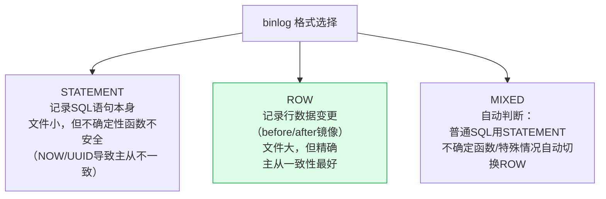
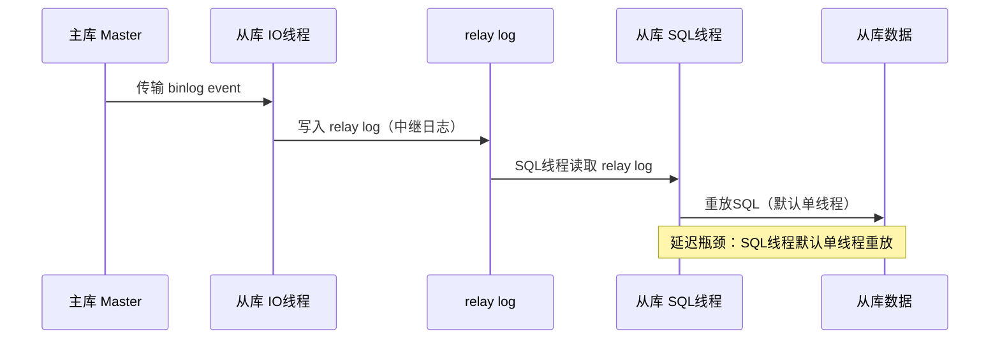

# MySQL 日志机制

## 概念

MySQL 的日志系统是保证数据库**持久性、一致性和高可用**的核心机制。理解三种关键日志——redo log、undo log、binlog——以及它们之间的协作关系，是 MySQL 面试的必考点。

| 日志 | 所属层 | 类型 | 核心作用 |
|------|--------|------|----------|
| redo log | InnoDB 引擎层 | 物理日志 | 崩溃恢复，保证持久性（Durability） |
| undo log | InnoDB 引擎层 | 逻辑日志 | 事务回滚，支持 MVCC |
| binlog | Server 层 | 逻辑日志 | 主从复制，数据归档与恢复 |

---

## 核心原理

### 1. redo log（重做日志）

#### WAL（Write-Ahead Logging）机制

InnoDB 使用 WAL 策略：**在数据页真正写入磁盘之前，先将修改记录写入日志**。这样即使系统崩溃，也可以通过重放 redo log 恢复数据，避免了每次修改都直接刷盘带来的随机 I/O 开销。

> 类比：收银员先在草稿纸上记账，再整理到账本。即使整理到一半停电，草稿纸还在，数据不会丢。

#### 物理日志，记录页的修改

redo log 是**物理日志**，记录的是"对某个数据页的某个偏移量做了什么修改"，例如：

```
对表空间 5，页号 3，偏移量 100，写入值 'abc'
```

与 binlog 的逻辑日志不同，redo log 记录的是底层物理变化，重放速度更快。

#### 循环写结构

redo log 以固定大小的文件组循环写入，默认包含两个文件：`ib_logfile0` 和 `ib_logfile1`。

```
+------------------+------------------+
|   ib_logfile0    |   ib_logfile1    |
+------------------+------------------+
     ^                        ^
  checkpoint               write pos
```

- **write pos**：当前写入位置，向后推进。
- **checkpoint**：已经持久化到磁盘的位置，向后推进。
- write pos 和 checkpoint 之间的空间是可写区域。
- 若 write pos 追上 checkpoint，说明日志写满，必须先推进 checkpoint（即将脏页刷盘）才能继续写。

#### 崩溃恢复原理

MySQL 重启后，InnoDB 会扫描 redo log，将 checkpoint 之后所有已提交但未落盘的操作重新执行一遍，保证数据不丢失。

#### innodb_flush_log_at_trx_commit

控制 redo log 的刷盘时机，是性能与可靠性的权衡：

| 值 | 行为 | 风险 |
|----|------|------|
| 0 | 每秒写一次 log buffer → OS cache → 磁盘 | 崩溃最多丢 1 秒数据 |
| 1（默认） | 每次事务提交都刷到磁盘 | 最安全，性能略低 |
| 2 | 每次事务提交写到 OS cache，每秒刷盘 | OS 崩溃可能丢数据 |

**生产环境推荐设置为 1**，以保证事务的持久性。

#### 组提交（Group Commit）：高并发写性能的关键

**组提交是 MySQL 5.6+ 突破写性能瓶颈的关键技术**。如果每个事务都独立 fsync，**高并发下磁盘 IO 是绝对瓶颈**——10k TPS 就需要 10k 次 fsync。

##### BLGC（Binary Log Group Commit）三阶段

```
传统 (每事务都 fsync):
  T1: prepare → write redo → fsync redo → write binlog → fsync binlog → commit redo
  T2: prepare → write redo → fsync redo → write binlog → fsync binlog → commit redo
  → 高并发下 fsync 排队，TPS 上不去

组提交 (Group Commit):
  ┌─── Flush 阶段 ───┐   把多个事务的 binlog 一起写到内核缓存
  ┌─── Sync 阶段 ────┐   一次 fsync 把多个事务的 binlog 一起刷盘
  ┌── Commit 阶段 ──┐   一次性 commit 所有事务
  → 一次 fsync 处理 N 个事务 → TPS 提升 5-10x
```

#### 双写缓冲（Double Write Buffer）

**MySQL 解决"部分写失效"（partial page write）问题的核心机制**。

**问题**：MySQL 页 16KB，OS 页 4KB。一次刷脏页 = 4 次 OS 写。如果中间崩溃 → **页损坏**（部分新、部分旧）→ redo log 也救不回来（redo 假设页是完整的）。

```
解法 — Double Write Buffer:
  1. 脏页先复制到内存的 Double Write Buffer (2MB)
  2. Double Write Buffer 顺序写入磁盘的 Double Write 区域（共享表空间）
  3. 再把脏页写入数据文件的实际位置
  4. 崩溃恢复时:
     ├─ 数据文件页损坏 → 从 Double Write 区域恢复
     └─ 再用 redo log 前滚到最新状态
```

::: warning ⚠️ Double Write 是必开的，不要关闭！

> 网上有"关闭 doublewrite 提升 5% 性能"的说法，**生产环境严禁关闭**——丢一次数据的代价 >> 5% 性能。配置：`innodb_doublewrite=ON`（默认）。

:::

#### binlog 三种格式深度

| 格式 | 记录内容 | 大小 | 主从一致性 | 适用 |
|------|---------|------|---------|------|
| **STATEMENT** | 原始 SQL 语句 | 小 | **可能不一致**（`NOW()` / 自增 ID / 触发器）| 已不推荐 |
| **ROW**（默认 5.7+）| **每行**修改前后的镜像 | 大（UPDATE 1000 行写 1000 条）| **强一致** | **生产首选** |
| **MIXED** | 自动选择：默认 STATEMENT，遇到不确定函数切换 ROW | 中 | 比 STATEMENT 好 | 兼容旧版 |

#### 为什么 ROW 比 STATEMENT 强

::: tip 💡 经典坑：STATEMENT 主从不一致

```sql
-- 主库
INSERT INTO orders (id, created_at) VALUES (NULL, NOW());

-- STATEMENT binlog 记录: INSERT ... VALUES (NULL, NOW())
-- 从库 5 分钟后回放 → NOW() 返回不同值！
--                  → 自增 ID 也可能不同（如果有并发）
-- ROW binlog 记录: INSERT INTO orders SET id=1234, created_at='2026-06-04 10:00:01'
-- 从库回放 → 完全一致
```

:::

#### ROW 格式的体积爆炸问题

ROW 格式下，**`UPDATE orders SET status=1 WHERE shop_id=999`** 如果影响 100 万行，binlog 会写入 100 万条行变更记录 → **binlog 文件爆炸 / 主从延迟**。

**缓解**：
- 大批量操作**手动分批**（每批 1000 行）
- 配置 `binlog_row_image=MINIMAL`（只记录主键 + 变更列，省 50% 体积）
- 大表更新走专门的归档/数据库任务，不走主从

---

### 2. undo log（回滚日志）

#### 逻辑日志，记录反操作

undo log 是**逻辑日志**，记录的是与实际操作相反的 SQL，例如：

- INSERT 对应 DELETE
- DELETE 对应 INSERT
- UPDATE 对应反向 UPDATE（记录旧值）

#### 事务回滚支持

当事务需要回滚时，InnoDB 读取 undo log，按逆序执行"反操作"，将数据恢复到事务开始前的状态。

#### MVCC 版本链支持

undo log 是实现 **MVCC（多版本并发控制）** 的基础。每行数据有两个隐藏字段：

- `trx_id`：最近一次修改该行的事务 ID
- `roll_pointer`：指向 undo log 中上一个版本的指针

多个版本通过 roll_pointer 连成**版本链**：

```
当前行 (trx_id=100)
    |
    v (roll_pointer)
历史版本 (trx_id=80)
    |
    v
历史版本 (trx_id=60)
    |
    v
  ...
```

读操作通过 **ReadView** 判断哪个版本对当前事务可见，从而实现非阻塞的一致性读。

#### purge 线程清理

当一个 undo log 版本不再被任何活跃事务引用时，后台 **purge 线程**会异步将其清理，释放存储空间。长事务会阻止 purge 推进，导致 undo log 膨胀，这是要避免长事务的重要原因之一。

---

### 3. binlog（归档日志）

#### Server 层日志 vs InnoDB 层日志

binlog 属于 **MySQL Server 层**，与存储引擎无关，所有引擎（InnoDB、MyISAM 等）的写操作都会产生 binlog。而 redo log 和 undo log 是 InnoDB 专有的。

#### 三种格式

| 格式 | 记录内容 | 优点 | 缺点 |
|------|----------|------|------|
| Statement | 原始 SQL 语句 | 日志量小 | 含不确定函数（如 `NOW()`）可能主从不一致 |
| Row | 每行数据的前后变化 | 精确，主从强一致 | 日志量大 |
| Mixed | 自动选择 Statement/Row | 折中 | 复杂度较高 |

**MySQL 5.7.7+ 默认使用 Row 格式**，主从复制更可靠。

#### 主从复制原理

```
主库 (Master)                     从库 (Slave)
+----------------+                +------------------+
|  写操作        |                |                  |
|  → binlog      | -- binlog --> | relay log        |
|                |   dump 线程   |  → SQL 线程回放  |
+----------------+                +------------------+
```

1. 主库将写操作记录到 binlog。
2. 从库的 **I/O 线程**连接主库，请求 binlog（通过 binlog dump 命令）。
3. 主库将 binlog 发送给从库，从库写入 **relay log（中继日志）**。
4. 从库的 **SQL 线程**读取 relay log，逐条回放，完成数据同步。

#### 数据恢复

使用 `mysqlbinlog` 工具可以将 binlog 解析为可执行的 SQL，用于**基于时间点的数据恢复（PITR）**：

```bash
# 恢复指定时间段的操作
mysqlbinlog --start-datetime="2024-01-01 10:00:00" \
            --stop-datetime="2024-01-01 11:00:00" \
            /var/lib/mysql/binlog.000001 | mysql -u root -p
```

---

### 4. 两阶段提交（2PC）

#### 为什么需要两阶段提交

redo log 和 binlog 是两个独立的日志系统，若提交不原子，会出现不一致：

- 若先写 redo log 再写 binlog，redo log 写成功后崩溃 → redo log 有记录，binlog 没有 → 主从数据不一致。
- 若先写 binlog 再写 redo log，binlog 写成功后崩溃 → binlog 有记录，redo log 没有 → 从库多执行了一次，主库数据丢失。

**两阶段提交通过 XID（事务ID）将 redo log 和 binlog 绑定**，保证两者同时生效或同时回滚。

#### 提交流程

```
事务执行 UPDATE
       |
       v
+------+-------+
|  redo log    |  <-- prepare 阶段：写入 redo log，标记为 prepare 状态
|  (prepare)   |
+------+-------+
       |
       v
+------+-------+
|   binlog     |  <-- 写入 binlog（含 XID）
+------+-------+
       |
       v
+------+-------+
|  redo log    |  <-- commit 阶段：将 redo log 标记为 commit 状态
|  (commit)    |
+------+-------+
       |
       v
    事务完成
```

#### 崩溃恢复时的判断逻辑

MySQL 重启时，会扫描 redo log 中处于 **prepare** 状态的记录，并检查对应的 XID 是否存在于 binlog 中：

| redo log 状态 | binlog 中有对应 XID？ | 恢复决策 |
|---------------|----------------------|----------|
| prepare | 有 | 提交事务（commit） |
| prepare | 没有 | 回滚事务（rollback） |
| commit | - | 直接提交 |

这个逻辑保证了 redo log 和 binlog 的最终一致性。

---

### 5. 三种日志对比

| 对比维度 | redo log | undo log | binlog |
|----------|----------|----------|--------|
| 所属层 | InnoDB 引擎层 | InnoDB 引擎层 | Server 层 |
| 日志类型 | 物理日志 | 逻辑日志 | 逻辑日志 |
| 核心作用 | 崩溃恢复（持久性） | 回滚 + MVCC | 复制 + 归档恢复 |
| 写入方式 | 循环覆盖写 | 事务期间追加写，purge 清理 | 追加写，不覆盖 |
| 大小限制 | 固定大小（循环写） | 随事务量增长 | 可配置，按文件切割 |
| 事务相关性 | 事务提交时刷盘 | 事务结束后异步清理 | 事务提交时写入 |

---

## 面试常问 & 怎么答

**Q1：redo log 和 binlog 有什么区别？**

从四个维度回答：

1. **所属层不同**：redo log 是 InnoDB 引擎层的日志；binlog 是 MySQL Server 层的日志，与引擎无关。
2. **类型不同**：redo log 是物理日志，记录数据页的具体修改；binlog 是逻辑日志，记录 SQL 语句或行变化。
3. **作用不同**：redo log 用于崩溃恢复，保证 InnoDB 的持久性；binlog 用于主从复制和基于时间点的数据恢复。
4. **写入方式不同**：redo log 循环写，空间固定；binlog 追加写，不会覆盖历史日志。

---

**Q2：为什么需要两阶段提交？**

因为 redo log 和 binlog 是两个独立的系统，若不做协调，在它们之间的任意时刻崩溃都会导致两者不一致——redo log 有记录但 binlog 没有，或反之。不一致会导致：主从数据不同，或用 binlog 做数据恢复时结果有误。

两阶段提交通过 prepare → 写 binlog → commit 的流程，并在崩溃恢复时以 binlog 中是否存在对应 XID 为准，确保 redo log 和 binlog 要么都生效、要么都不生效，从而保证一致性。

---

**Q3：一条 UPDATE 语句的日志写入流程是什么？**

以 `UPDATE t SET name='B' WHERE id=1` 为例，完整流程如下：

1. InnoDB 将 id=1 的数据页读入内存（Buffer Pool），若已在内存则直接使用。
2. 在内存中修改数据页，将 name 改为 'B'。
3. 写入 **undo log**，记录旧值（name='A'），支持回滚和 MVCC。
4. 写入 **redo log**，状态为 **prepare**，记录本次页修改。
5. 写入 **binlog**，记录本次 UPDATE 操作（含 XID）。
6. 将 redo log 状态改为 **commit**，事务完成。
7. 数据页为脏页，后台线程异步将其刷入磁盘（不阻塞事务）。

---

## 看到什么就先想到这类

| 触发词 | 联想方向 |
|--------|----------|
| "崩溃恢复" / "数据不丢" | redo log + WAL + innodb_flush_log_at_trx_commit=1 |
| "主从不一致" | binlog 格式（Row vs Statement）、两阶段提交 |
| "事务回滚" | undo log 逻辑反操作 |
| "MVCC" / "快照读" | undo log 版本链 + ReadView |
| "长事务" | undo log 膨胀、purge 线程受阻 |
| "数据恢复到某个时间点" | mysqlbinlog + 全量备份 |
| "为什么 InnoDB 比 MyISAM 可靠" | redo log + undo log（MyISAM 没有） |
| "写性能优化" | innodb_flush_log_at_trx_commit=2、组提交（group commit） |

---

## 深度图解与高频面试题

### binlog 三种格式对比



| 格式 | 文件大小 | 主从一致性 | 可读性 | 推荐 |
|------|---------|-----------|--------|------|
| STATEMENT | 小 | ❌（UUID/NOW()不安全） | 好 | 调试用 |
| ROW | 大 | ✅ 精确 | 差（需工具解析） | **生产推荐** |
| MIXED | 中 | 基本可靠 | 中 | 兼容旧系统 |

> MySQL 5.7.7+ 默认 ROW 格式。ROW 格式下每行变更都记录前后镜像，数据恢复和主从复制最可靠。

---

### redo log vs binlog 核心区别

| 维度 | redo log | binlog |
|------|---------|--------|
| 所属层次 | InnoDB 引擎层 | MySQL Server 层（所有引擎共享） |
| 内容 | 物理日志（数据页的变化） | 逻辑日志（SQL语句或行变化） |
| 写入方式 | 循环写（固定大小，会覆盖旧日志） | 追加写（不断生成新文件，不覆盖） |
| 主要用途 | **崩溃恢复**（crash recovery） | **主从同步**、数据恢复、审计 |
| 幂等性 | 幂等（重放同一条安全） | STATEMENT格式不一定幂等 |

---

### 主从复制延迟分析



**主从延迟原因与解决方案：**

| 原因 | 解决方案 |
|------|---------|
| SQL线程单线程重放 | 开启**并行复制**（`slave_parallel_workers > 0`，MySQL 5.7+） |
| 主库大事务（批量DELETE） | 拆分大事务为多个小事务 |
| 从库机器性能差 | 升级从库硬件，使用SSD |
| 网络延迟 | 就近部署，专线连接 |
| 从库承担大量读流量 | 增加从库数量，专库专用 |

---

### 高频面试Q&A

**Q: 什么是GTID？有什么优势？**

A: GTID（Global Transaction Identifier）是每个已提交事务的全局唯一标识，格式为 `source_id:transaction_id`。优势：① **简化主从切换**——新主库无需指定binlog文件名和位置（`CHANGE MASTER TO MASTER_AUTO_POSITION=1`），自动找到复制断点；② **自动跳过重复事务**——GTID已执行过的事务不会再次执行，避免数据重复；③ **便于追踪**——可精确追踪每个事务在哪个库上执行。

**Q: undo log 有什么作用？**

A: undo log（回滚日志）有两个核心作用：① **事务回滚**——记录数据修改前的值，事务失败时按 undo log 逆向还原数据；② **MVCC快照读**——为 ReadView 提供历史版本数据，实现非锁定一致性读（每行通过 `roll_pointer` 串联成版本链，读取时按 ReadView 规则找到对应历史版本）。undo log 存储在 ibdata 文件或独立的 undo tablespace（MySQL 5.6+）。

**Q: MySQL如何保证崩溃恢复后数据不丢失？**

A: 通过 redo log 的 WAL（Write-Ahead Logging）机制：事务提交前必须先将 redo log 刷到磁盘（`innodb_flush_log_at_trx_commit=1`），即使数据页还在 Buffer Pool 中。崩溃恢复步骤：① 读取 redo log，前滚重放未落盘的已提交事务；② 通过 undo log 回滚未提交的事务。配合两阶段提交（redo log prepare → 写binlog → redo log commit），确保 redo log 和 binlog 最终一致。
