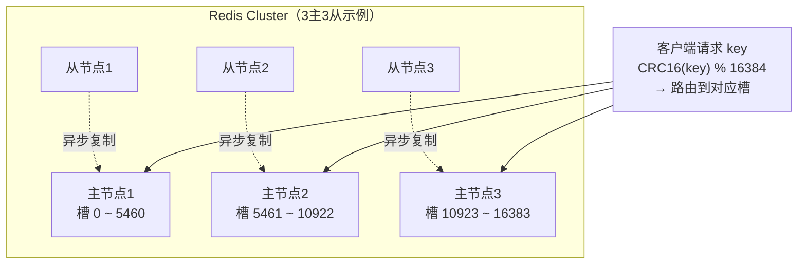
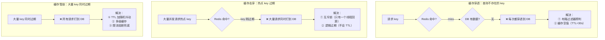
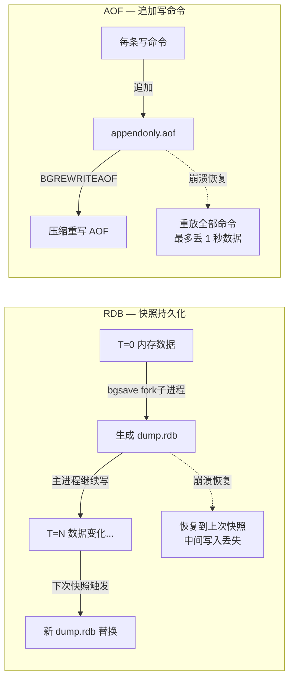

# Redis 核心

## 概念

Redis（Remote Dictionary Server）是一个开源的、基于内存的键值数据库，支持多种数据结构，常用于缓存、消息队列、分布式锁等场景。

**核心特点：**

- **纯内存操作**：数据存储在内存中，读写速度极快（读约 10 万 QPS，写约 8 万 QPS）
- **单线程命令执行**：避免竞态条件，无需加锁
- **丰富的数据结构**：String、List、Hash、Set、Sorted Set 等
- **持久化支持**：RDB 快照 + AOF 日志
- **高可用**：主从复制、哨兵、集群

---

## 核心原理

### 1. 五种基本数据类型与底层数据结构

| 类型 | 底层结构 | 适用场景 |
|------|----------|----------|
| String | SDS（简单动态字符串） | 缓存对象、计数器、分布式锁 |
| List | quicklist（ziplist + 双向链表） | 消息队列、最新列表、分页 |
| Hash | ziplist（小数据）/ hashtable（大数据） | 存储对象字段、用户信息 |
| Set | intset（纯整数）/ hashtable（其他） | 去重、交集并集差集、标签系统 |
| Sorted Set | ziplist（小数据）/ skiplist + hashtable（大数据） | 排行榜、带权重队列、范围查询 |

**各结构详解：**

**String — SDS（Simple Dynamic String）**

```
struct sdshdr {
    int len;    // 已使用长度
    int free;   // 剩余空间
    char buf[]; // 字节数组
};
```

- 相比 C 字符串，SDS 记录长度，`strlen` 复杂度为 O(1)
- 预分配空间，减少内存重分配次数
- 二进制安全，可存储任意二进制数据

**List — quicklist**

- Redis 3.2 之后，List 统一用 quicklist 实现
- quicklist = 多个 ziplist 组成的双向链表
- ziplist 节点数量由 `list-max-ziplist-size` 控制，平衡内存与性能

**Hash — ziplist / hashtable**

- 元素数量 ≤ `hash-max-ziplist-entries`（默认 128）且值长度 ≤ `hash-max-ziplist-value`（默认 64 字节）时使用 ziplist
- 超出阈值自动转为 hashtable

**Set — intset / hashtable**

- 全为整数且数量 ≤ `set-max-intset-entries`（默认 512）时使用 intset
- intset 有序存储，查找用二分，内存紧凑

**Sorted Set — ziplist / skiplist + hashtable**

- 元素数量 ≤ `zset-max-ziplist-entries`（默认 128）时使用 ziplist
- 超出阈值转为 skiplist（跳表）+ hashtable 的组合
  - skiplist 支持范围查询（`ZRANGE`、`ZRANGEBYSCORE`）
  - hashtable 支持 O(1) 单点查找（`ZSCORE`）

---

### 2. 持久化机制

#### RDB（Redis Database Snapshot）

RDB 是将某一时刻内存中的数据以二进制快照的形式写入磁盘。

**触发方式：**

- `save`：阻塞主进程，同步写入（生产环境不推荐）
- `bgsave`：fork 一个子进程异步写入，主进程继续处理请求
- 配置自动触发：`save 900 1`（900 秒内有 1 次写操作则触发）

**bgsave 流程：**

```
主进程 --fork--> 子进程
                  |
                  | 遍历内存数据，写入临时 RDB 文件
                  |
                  v
              替换旧 RDB 文件
```

- fork 使用 **Copy-On-Write（COW）** 机制，fork 时不复制内存，只有写操作时才复制对应页面
- 优点：文件紧凑，恢复速度快，适合灾难恢复和备份
- 缺点：两次快照之间的数据可能丢失

#### AOF（Append Only File）

AOF 将每条写命令以文本形式追加到日志文件，重启时重放命令恢复数据。

**三种 fsync 策略：**

| 策略 | 行为 | 性能 | 数据安全性 |
|------|------|------|------------|
| `always` | 每条命令写入后立即 fsync | 最慢 | 最高，最多丢失 1 条命令 |
| `everysec`（默认） | 每秒执行一次 fsync | 适中 | 较高，最多丢失 1 秒数据 |
| `no` | 由操作系统决定 fsync 时机 | 最快 | 最低，可能丢失较多数据 |

**AOF 重写（Rewrite）：**

- AOF 文件会随时间增大，通过 `bgrewriteaof` 命令压缩
- 子进程基于当前内存状态重写，期间新写命令同时追加到缓冲区
- 重写完成后将缓冲区内容追加到新 AOF 文件，然后替换旧文件

#### 混合持久化（Redis 4.0+）

```
[ RDB 格式的全量数据 ][ AOF 格式的增量命令 ]
        RDB 头                  AOF 尾
```

- 配置：`aof-use-rdb-preamble yes`
- 重启时先加载 RDB 部分（速度快），再重放 AOF 部分（数据完整）
- 兼顾恢复速度与数据安全性

#### RDB vs AOF 对比

| 对比维度 | RDB | AOF |
|----------|-----|-----|
| 文件大小 | 小（二进制压缩） | 大（文本命令） |
| 恢复速度 | 快 | 慢（需重放命令） |
| 数据完整性 | 低（可能丢失几分钟数据） | 高（最多丢失 1 秒） |
| 写性能影响 | 低（异步 fork） | 低～中（取决于 fsync 策略） |
| 适用场景 | 备份、容灾 | 数据安全要求高的场景 |

**如何选择：**

- 对数据安全要求高 → AOF（`everysec`）
- 对恢复速度要求高 → RDB
- 生产推荐 → **混合持久化**（两者兼顾）

#### 持久化生产配置黄金标准

::: tip 💡 三种业务场景的标准配置

| 业务类型 | 推荐配置 | 数据丢失上限 |
|---------|---------|------------|
| **纯缓存**（数据可重建）| 关闭 AOF，RDB 每小时 1 次 | 1 小时 |
| **半持久化**（业务可容忍秒级丢失）| 混合持久化 + AOF `everysec` | **1 秒** |
| **强持久化**（金融、订单）| 混合持久化 + AOF `always` + 主从 + Sentinel | 单条事务 |

**Redis 不是数据库**：即使配置 `always`，单机也可能丢——掉电瞬间的 fsync 还未返回。**真正零丢失需要 Redis + DB 双写**。

:::

### 4. Redis 分布式锁：从 SETNX 到 Redlock

**分布式锁是 Redis 面试 Top 3 高频题**，2025-2026 年要能讲清"为什么 SETNX 不够、Redlock 为什么有争议、生产到底怎么选"。

#### 演进路线

| 版本 | 方案 | 问题 |
|------|------|------|
| **v1** | `SETNX key 1`（无过期）| **持锁进程崩溃 → 死锁** |
| **v2** | `SETNX key 1` + `EXPIRE`（两步）| **两步不原子**，SETNX 后崩溃仍死锁 |
| **v3** | `SET key value NX EX`（原子）| **锁可能被别人误删**（A 超时但还在执行，B 拿到锁，A 完成后误删 B 的锁）|
| **v4** | `SET key uuid NX EX` + Lua 校验删除 | **锁过期后业务还没结束**仍然是问题 |
| **v5** | **Redisson 看门狗（watchdog）** | **主从切换可能丢锁** |
| **v6** | **Redlock 算法**（多 Master 5 节点）| **学术界质疑安全性** |

#### 正确实现（90% 业务足够用）

```java
// 加锁：SET 原子操作 + 唯一 token
String token = UUID.randomUUID().toString();
Boolean locked = redis.set("lock:order", token,
    SetParams.setParams().nx().ex(30));   // 30 秒过期防死锁

// 业务...

// 解锁：Lua 脚本保证"检查 + 删除"原子
String LUA = """
    if redis.call('get', KEYS[1]) == ARGV[1] then
      return redis.call('del', KEYS[1])
    else
      return 0
    end
    """;
redis.eval(LUA, List.of("lock:order"), List.of(token));
```

#### Redisson 看门狗（生产首选）

```java
RLock lock = redissonClient.getLock("lock:order");
lock.lock();                    // 默认 30 秒过期
try {
    // 业务... 看门狗每 10 秒自动续期
    // 不会出现"业务没做完锁就过期"的情况
} finally {
    lock.unlock();
}
```

**看门狗机制**：每 `leaseTime/3`（默认 10s）自动续期到 30s，**只要持锁线程还活着，锁就不会过期**。**进程崩溃时看门狗停止，锁 30 秒后自动释放**。

#### Redlock 算法（争议焦点）

Redis 作者 antirez 提出，需要 **N 个（通常 5 个）独立的 Redis Master**：

```
加锁流程:
  1. 当前时间 T1
  2. 用相同 key + token 依次向 N 个 Master 发 SET NX EX
  3. 等待响应；超过 N/2+1 个成功 → 加锁成功
  4. 实际持锁时间 = TTL - (T2 - T1)
  5. 若实际持锁时间 ≤ 0，认为加锁失败
解锁：
  向所有 N 个 Master 发解锁脚本（即使失败也要发）
```

#### Redlock 的著名争议（Martin Kleppmann vs antirez）

::: warning ⚠️ Redlock 为什么有争议

**Martin Kleppmann（《设计数据密集型应用》作者）质疑**：
1. **GC pause / 系统暂停** → 持锁进程"卡"30 秒，锁已过期但进程不知道，仍执行业务
2. **时钟漂移** → 不同节点时钟不一致，TTL 判断错误
3. **网络分区** → 5 个节点分布在 2 个机房，分区时可能"双主"

**antirez 反驳**：以上问题对**所有分布式锁**都存在（包括 ZooKeeper、etcd），Redlock 并不更差，且性能优势明显。

:::

#### 真实生产选型

| 场景 | 推荐 |
|------|------|
| **互斥即可，可容忍偶尔失败**（缓存击穿、防重提交）| **单 Redis + Redisson 看门狗** |
| **强一致性要求**（金融、订单兜底）| **不要用 Redis 锁** —— 用 ZooKeeper / etcd（Raft + 临时节点）|
| **特殊场景 + 性能优先** | Redlock，但要清楚它的边界 |

::: tip 💡 一句话面试黄金

> **"分布式锁的本质是分布式共识——Redis 的最大问题是没有强一致协议（主从异步复制），所以严格意义上不适合做严格互斥；Redisson 看门狗够用 90% 场景，真正需要强一致就上 ZooKeeper / etcd。Redlock 提供更高安全保证但增加复杂度，业界争议较大。"**

:::

#### ZooKeeper 分布式锁实现

**ZK 锁是金融级场景的事实标准**，原理是利用**临时顺序节点 + Watch 机制**：

```
1. 客户端在 /lock 下创建临时顺序节点
   → /lock/lock-0000000001 (Client A)
   → /lock/lock-0000000002 (Client B)
   → /lock/lock-0000000003 (Client C)

2. 检查自己是否是最小序号节点:
   ├─ 是 → 获得锁
   └─ 否 → 监听比自己小一个的节点（不是最小节点，避免"惊群")
          ↓
          被监听节点删除（持锁者释放/崩溃）→ 收到通知 → 再判断是否最小

3. 业务完成 → 删除自己创建的节点 = 释放锁
```

**关键安全保证**：
- **临时节点**：客户端会话断开（如崩溃）自动删除 → 永不死锁
- **顺序节点**：天然防"羊群效应"（thundering herd）
- **Watch 单向触发**：只监听前一个节点，避免万人挤一节点

#### etcd 分布式锁实现

**etcd 基于 Raft 强一致**，是 K8s 自带的注册中心 + 锁服务：

```
1. Client 创建租约（lease），如 10 秒 TTL
2. PUT /lock/my-resource value=client-id LEASE=租约ID + IF_NOT_EXIST
   ├─ 成功 → 加锁，启动 KeepAlive 心跳续约
   └─ 失败 → Watch /lock/my-resource，等删除事件
3. 业务完成 → 撤销租约 → 自动删除 key
```

**etcd 比 ZK 优势**：
- **HTTP/gRPC API**：客户端实现简单（ZK 客户端复杂）
- **轻量**：3 节点集群 200MB 内存够用
- **K8s 生态**：CRD 控制器、Operator 天然集成

#### Redis vs ZooKeeper vs etcd 终极对比

| 维度 | **Redis (Redisson)** | **ZooKeeper** | **etcd** |
|------|------------------|--------------|----------|
| **一致性协议** | 主从异步复制（弱）| **ZAB 强一致** | **Raft 强一致** |
| **加锁性能** | **最快**（~1ms）| 中（5-20ms）| 中（5-15ms）|
| **正确性** | "最大努力" | **金融级保证** | **金融级保证** |
| **客户端复杂度** | 简单（Redisson 封装好）| 复杂（Curator 必备）| **简单**（HTTP/gRPC）|
| **运维成本** | 低（Redis 团队都会）| **高**（ZK 自身难维护）| 中 |
| **生态** | 通用 | Hadoop / Dubbo / Kafka | **K8s / 云原生** |
| **典型应用** | 缓存击穿防护、防重 | 金融、Hadoop、Dubbo 配置中心 | **K8s、容器编排** |

::: tip 💡 现代选型推荐

> **2025 新项目** ① 缓存级互斥 → Redis + Redisson；② 业务强一致 → **etcd**（云原生生态更好）；③ 已有 Hadoop/Dubbo 栈 → ZooKeeper；④ **不要再自己造分布式锁轮子**，3 种都有成熟客户端。

:::

#### 实战：Curator 实现 ZK 分布式锁

```java
// 基于 Apache Curator (ZK 官方推荐客户端)
CuratorFramework client = CuratorFrameworkFactory.newClient(
    "zk1:2181,zk2:2181,zk3:2181",
    new ExponentialBackoffRetry(1000, 3)
);
client.start();

InterProcessMutex lock = new InterProcessMutex(client, "/locks/orders");
try {
    if (lock.acquire(10, TimeUnit.SECONDS)) {
        // 业务...
    } else {
        throw new RuntimeException("加锁超时");
    }
} finally {
    lock.release();
}
```

#### 实战：etcd 分布式锁（jetcd）

```java
Client etcd = Client.builder()
    .endpoints("http://etcd1:2379", "http://etcd2:2379", "http://etcd3:2379")
    .build();

Lock lockClient = etcd.getLockClient();
Lease leaseClient = etcd.getLeaseClient();

long leaseId = leaseClient.grant(10).get().getID();          // 10s 租约
ByteSequence key = ByteSequence.from("/locks/orders", UTF_8);

LockResponse resp = lockClient.lock(key, leaseId).get();      // 加锁
try {
    // 业务...
} finally {
    lockClient.unlock(resp.getKey()).get();
    leaseClient.revoke(leaseId);
}
```

---

### 5. 内存淘汰策略（8 种）

当内存达到 `maxmemory` 上限时，Redis 根据配置的策略淘汰键。

| 策略 | 淘汰范围 | 淘汰算法 | 说明 |
|------|----------|----------|------|
| `noeviction` | — | — | 不淘汰，写操作直接报错（默认） |
| `allkeys-lru` | 所有键 | LRU | 淘汰最近最少使用的键 |
| `volatile-lru` | 设有过期时间的键 | LRU | 对有 TTL 的键做 LRU 淘汰 |
| `allkeys-random` | 所有键 | 随机 | 随机淘汰任意键 |
| `volatile-random` | 设有过期时间的键 | 随机 | 随机淘汰有 TTL 的键 |
| `volatile-ttl` | 设有过期时间的键 | TTL | 优先淘汰剩余 TTL 最短的键 |
| `allkeys-lfu` | 所有键 | LFU | 淘汰使用频率最低的键（4.0+） |
| `volatile-lfu` | 设有过期时间的键 | LFU | 对有 TTL 的键做 LFU 淘汰（4.0+） |

**LRU vs LFU：**

| 维度 | LRU（最近最少使用） | LFU（最不常使用） |
|------|---------------------|-------------------|
| 核心思路 | 按最近访问时间排序 | 按访问频率排序 |
| 优点 | 实现简单，适合访问时间局部性强的场景 | 能识别"冷门但最近访问一次"的键 |
| 缺点 | 偶发访问的冷数据可能挤占热数据 | 新键初始频率低，可能被过早淘汰 |
| 适用场景 | 通用缓存 | 热点数据分布稳定的场景 |

> Redis 的 LRU/LFU 是**近似实现**，通过采样（默认 5 个键）选出最优淘汰对象，而非严格维护全局排序，以节省内存。

---

### 4. 缓存三大问题

#### 缓存穿透（Cache Penetration）

**问题：** 查询一个**数据库中也不存在**的数据，缓存永远没有，每次请求都打到数据库。

```
请求 id=-1
  → 缓存未命中
  → 查数据库 → 无结果
  → 不写缓存
  → 下次同样请求继续穿透
```

**恶意攻击场景**：大量不存在的 key 请求，导致数据库压力激增。

**解决方案：**

| 方案 | 原理 | 优点 | 缺点 |
|------|------|------|------|
| 缓存空值 | 查到空结果也写入缓存，设置短 TTL | 简单易实现 | 浪费缓存空间，不适合大量不同 key |
| 布隆过滤器 | 预先将合法 key 加入过滤器，请求先过滤 | 内存占用小，拦截效果好 | 有误判率，不支持删除（Counting BF 可以） |

#### 缓存击穿（Cache Breakdown）

**问题：** 某个**热点 key 恰好过期**的瞬间，大量并发请求同时穿透到数据库。

```
热点 key 过期
  → 大量并发请求同时缓存未命中
  → 同时查数据库 → 数据库压力激增
```

**解决方案：**

| 方案 | 原理 | 优点 | 缺点 |
|------|------|------|------|
| 互斥锁（分布式锁） | 只允许一个请求查数据库并回写缓存，其他请求等待 | 数据强一致 | 等待期间有延迟，锁超时处理复杂 |
| 逻辑过期 | key 永不设 TTL，在 value 中存逻辑过期时间，过期时异步更新 | 无等待，性能好 | 可能短暂返回旧数据（最终一致） |

#### 缓存雪崩（Cache Avalanche）

**问题：** **大量 key 在同一时刻过期**（或 Redis 服务宕机），请求全部打到数据库，导致数据库崩溃。

**解决方案：**

| 方案 | 说明 |
|------|------|
| 随机过期时间 | 在基础 TTL 上加随机偏移，避免集中过期 |
| 热点 key 永不过期 | 逻辑过期 + 后台异步刷新 |
| Redis 集群高可用 | 哨兵或 Cluster 模式，避免单点故障导致雪崩 |
| 服务降级 + 限流 | 数据库层面做熔断，保护数据库 |
| 多级缓存 | 本地缓存（Caffeine）+ Redis，Redis 宕机时本地缓存兜底 |

---

### 5. 单线程模型与 I/O 多路复用

#### 为什么单线程还快？

Redis 命令执行是单线程的，但性能极高，原因如下：

| 原因 | 说明 |
|------|------|
| 纯内存操作 | 内存访问速度远快于磁盘，无 I/O 等待 |
| 非阻塞 I/O | 使用 epoll/kqueue 等 I/O 多路复用，单线程处理大量连接 |
| 避免上下文切换 | 无多线程切换开销，无锁竞争 |
| 简单高效的数据结构 | 底层数据结构针对内存操作优化 |

**I/O 多路复用模型（以 epoll 为例）：**

```
多个客户端连接
      ↓
   epoll 监听
      ↓
  就绪事件队列
      ↓
  单线程依次处理
  （读取命令 → 执行 → 返回响应）
```

- 单线程处理命令，不存在竞态条件，无需加锁
- 瓶颈在网络 I/O，而非 CPU

#### Redis 6.0 多线程 I/O

| 版本 | 线程模型 |
|------|----------|
| Redis 6.0 之前 | 网络 I/O + 命令执行 均为单线程 |
| Redis 6.0+ | **网络 I/O（读写）多线程** + **命令执行仍为单线程** |

- 多线程只负责网络数据的读取和写回，提升网络吞吐量
- 命令的实际执行依然是单线程串行，保证原子性和线程安全
- 默认关闭，需手动开启：`io-threads 4`

---

### 6. 集群方案

#### 主从复制（Master-Replica Replication）

**全量同步（初次同步）：**

```
Replica 发送 PSYNC replicationid offset
Master 执行 bgsave 生成 RDB → 发送给 Replica
Replica 加载 RDB
Master 将 RDB 生成期间的写命令发送给 Replica（replication buffer）
```

**增量同步（断线重连）：**

- Replica 重连后，发送上次同步的 offset
- Master 从 repl_backlog_buffer 中找到缺失的命令发送
- 若 offset 已不在 backlog 中（缓冲区满），则触发全量同步

**特点：**

- 读写分离：Master 负责写，Replica 负责读
- 无自动故障转移，Master 宕机需手动切换

#### 哨兵模式（Sentinel）

哨兵是独立进程，监控 Redis 节点健康状态，实现自动故障转移。

```
Sentinel 集群（建议 3 个节点）
    ↓ 监控
Master + Replica(s)
```

**核心功能：**

| 功能 | 说明 |
|------|------|
| 监控（Monitoring） | 定期向 Master/Replica 发送 PING，检测是否存活 |
| 通知（Notification） | 故障时通知客户端或管理员 |
| 自动故障转移（Failover） | Master 宕机时，从 Replica 中选出新 Master |
| 配置中心 | 客户端通过 Sentinel 获取当前 Master 地址 |

**主观下线 vs 客观下线：**

- **主观下线（SDOWN）**：单个 Sentinel 认为节点不可达
- **客观下线（ODOWN）**：超过 `quorum` 数量的 Sentinel 都认为节点不可达，才触发故障转移

#### Redis Cluster（分片集群）

Redis Cluster 通过数据分片实现水平扩展，支持 PB 级数据。

**核心概念：**

| 概念 | 说明 |
|------|------|
| Slot（槽） | 共 **16384 个 slot**，每个 key 通过 `CRC16(key) % 16384` 映射到 slot |
| 节点分配 | 每个 Master 节点负责一部分 slot，各 Master 有对应 Replica |
| Gossip 协议 | 节点间通过 Gossip 协议交换状态信息，去中心化 |
| 重定向 | 客户端请求错误节点时收到 MOVED/ASK 响应，重定向到正确节点 |

**为什么是 16384 个 slot？**

- 16384 = 2^14，心跳包中用 bitmap 表示 slot 分配，16384 个 slot 只需 2KB
- 节点数通常不超过 1000，16384 个 slot 粒度足够，不需要更多

**三种集群方案对比：**

| 方案 | 高可用 | 水平扩展 | 自动故障转移 | 复杂度 |
|------|--------|----------|--------------|--------|
| 主从复制 | 中（手动切换） | 否 | 否 | 低 |
| 哨兵模式 | 高 | 否（单 Master 写） | 是 | 中 |
| Redis Cluster | 高 | 是 | 是 | 高 |

---

## Redis 7.x / 8.x 新特性

Redis 自 7.0 起进入"功能成熟期"，2024-2025 年面试中 **Streams、ACL、Functions、Sharded Pub/Sub** 已经从"加分项"变成"中级标配"。

### 关键版本时间线

| 版本 | 发布时间 | 主要变化 |
|------|---------|---------|
| **7.0** | 2022 | Functions、ACL v2、Sharded Pub/Sub、Multi-part AOF、Client-side Cache（RESP3）|
| **7.2** | 2023 | 命令权限收紧、Cluster 性能优化、PSYNC2 复制改进 |
| **7.4** | 2024 | Hash 字段级 TTL、向量集索引预览 |
| **8.0** | 2024 | 性能整体 +30%、Redis Stack 合并（含 JSON / Search / TimeSeries 模块）、向量检索原生化 |

### Streams：原生消息队列

Redis 5 引入、7 成熟。Streams 是 List/Pub-Sub 的**完整替代品**，支持消费者组、ACK、重放，类似 Kafka 简化版。

| 特性 | List + BLPOP | Pub/Sub | Streams |
|------|-------------|---------|---------|
| **消息持久化** | ✅ | ❌（fire-and-forget）| ✅ |
| **消费者组** | ❌ | ❌ | ✅ |
| **消息 ACK / 重投** | ❌ | ❌ | ✅（XACK + XPENDING）|
| **消息回溯** | ❌ | ❌ | ✅（按 ID 范围读）|
| **适用场景** | 简单队列 | 实时广播 | 轻量级 MQ、事件溯源 |

```bash
# 生产
XADD orders * user 1001 amount 99.5
# 消费组消费
XGROUP CREATE orders order_consumers $ MKSTREAM
XREADGROUP GROUP order_consumers worker-1 COUNT 10 STREAMS orders >
# 确认处理完
XACK orders order_consumers 1700000000000-0
```

**面试高频追问**：与 Kafka 区别？Streams **单节点性能高、运维简单**，但**没有分区**、依赖 Cluster 才能水平扩展；**百万级 TPS 以下选 Streams，更高量级选 Kafka**。

### Functions：可热加载的服务端脚本

Functions 是 7.0 引入的**Lua 脚本升级版**，相比 EVAL 的三大改进：

| 维度 | EVAL（旧脚本）| Functions（新）|
|------|--------------|--------------|
| **存储方式** | 客户端发送、Server 编译 | **服务端持久化**（FUNCTION LOAD）|
| **复制/AOF** | 重放整段脚本 | 复制 function 调用 |
| **版本管理** | 无 | 库（library）粒度，可热替换 |
| **语言** | Lua 5.1 | Lua（未来可扩展其他）|

```bash
# 加载（脚本会持久化、写入 AOF/RDB）
FUNCTION LOAD "#!lua name=mylib\nredis.register_function('myadd',
  function(keys, args) return tonumber(args[1]) + tonumber(args[2]) end)"
# 调用
FCALL myadd 0 1 2     # → 3
```

**生产用法**：把限流、去重、原子计数等逻辑写成 Functions，应用端只 FCALL，**升级逻辑无需改客户端代码**。

### ACL v2：细粒度权限

Redis 6 引入 ACL，7.0 扩展为支持**按 Key 模式 + 按命令类别 + 按 Pub/Sub Channel**三维授权：

```bash
# 只允许读取 cache:* 前缀的 Key，且只能执行 GET/MGET/EXISTS
ACL SETUSER reporter on >password \
  ~cache:* &* \
  +@read -@dangerous
```

**面试要点**：ACL 解决了 Redis "要么全权限，要么完全只读" 的旧痛点；生产中**应用账号、运维账号、备份账号** 必须用不同 ACL 隔离，是 2025 年安全审计的必查项。

### Sharded Pub/Sub：解决 Cluster 下的广播放大

旧版 Pub/Sub 在 Cluster 中**所有节点都要广播每条消息**，节点越多带宽越炸。Sharded Pub/Sub（7.0）让消息**按 channel 哈希到固定 slot**，只在该 slot 的节点间传播：

```bash
SPUBLISH news:tech "Redis 8 released"
SSUBSCRIBE news:tech
```

**何时切换**：Cluster 节点 ≥ 6 + Pub/Sub 流量大的场景，必换 Sharded 版本。

### Client-Side Cache（RESP3）

RESP3 协议（7.0 默认可选）支持服务端主动推送，让客户端能**安全做本地缓存**——key 在服务端变更时收到 INVALIDATE 通知：

```
应用层缓存（本地，纳秒级访问）
    ↓ 命中失败/失效
Redis（毫秒级）
    ↓ key 变更
INVALIDATE 推送 → 应用层失效本地缓存
```

**收益**：热点 Key 场景延迟从 0.5ms → 50ns，**降低 90%+ Redis 负载**，是 Java（Lettuce）/ Go（redigo）等客户端的高级特性。

### 8.0 向量检索原生化

Redis 8.0 把 Redis Stack 的 Search 模块合并进核心，**原生支持向量检索**：

```bash
# 创建向量索引（HNSW）
FT.CREATE docs ON HASH PREFIX 1 doc:
  SCHEMA embedding VECTOR HNSW 6 TYPE FLOAT32 DIM 768 DISTANCE_METRIC COSINE
# KNN 查询
FT.SEARCH docs "*=>[KNN 5 @embedding $vec]" PARAMS 2 vec "..." DIALECT 2
```

**对比专用向量库**：Redis 适合**Top-100 万级 + 低延迟在线查询**（< 5ms），数据量更大或召回要求更高时仍需 Milvus/Qdrant。详见 [Embedding 与向量数据库](../ai-technology/embedding-and-vector-db#向量数据库选型实战)。

---

## 面试常问 & 怎么答

### Q1: Redis 为什么这么快？

**答题思路：** 从存储、I/O 模型、线程模型三个维度展开。

**参考回答：**

Redis 快的原因主要有以下几点：

1. **纯内存操作**：所有数据存储在内存中，读写不涉及磁盘 I/O，内存访问延迟在纳秒级别
2. **高效的数据结构**：底层使用 SDS、skiplist、ziplist 等针对内存优化的数据结构，操作复杂度低
3. **I/O 多路复用**：通过 epoll 等机制，单线程可以同时监听大量连接，非阻塞处理网络事件
4. **单线程命令执行**：避免了多线程的上下文切换开销和锁竞争，逻辑简单，执行效率高
5. **Redis 6.0 网络 I/O 多线程**：网络读写阶段引入多线程，进一步提升网络吞吐量，命令执行仍为单线程保证原子性

> 补充：Redis 的性能瓶颈通常在网络带宽，而非 CPU 或内存。

---

### Q2: 缓存穿透、击穿、雪崩分别是什么？怎么解决？

**答题思路：** 三者都是缓存失效导致请求打到数据库，但原因和场景不同，解决方案也不同。

| 问题 | 触发场景 | 核心解决方案 |
|------|----------|-------------|
| 缓存穿透 | 查询数据库中不存在的数据 | 布隆过滤器拦截非法 key；或缓存空值 |
| 缓存击穿 | 单个热点 key 突然过期，大量并发打入 | 互斥锁（强一致）；逻辑过期（高性能） |
| 缓存雪崩 | 大量 key 同时过期，或 Redis 宕机 | TTL 加随机偏移；集群高可用；多级缓存兜底 |

**参考回答要点：**

- 穿透强调"数据压根不存在"，用布隆过滤器在请求入口拦截
- 击穿强调"一个热点 key 的过期瞬间"，用互斥锁保证只有一个请求重建缓存
- 雪崩强调"大批量 key 同时失效"，用随机 TTL 打散过期时间，用集群避免单点故障

---

### Q3: RDB 和 AOF 有什么区别？怎么选？

**答题思路：** 从文件格式、数据安全、恢复速度、性能影响四个维度对比，再给出选择建议。

**参考回答：**

| 维度 | RDB | AOF |
|------|-----|-----|
| 文件格式 | 二进制快照，文件小 | 文本命令日志，文件大 |
| 数据安全 | 低，两次快照间数据可能丢失 | 高，最多丢失 1 秒（everysec） |
| 恢复速度 | 快（直接加载快照） | 慢（需重放所有命令） |
| 写性能 | 低影响（fork 子进程异步） | 中等影响（everysec 策略） |

**选择建议：**

- 对数据安全要求高（金融、支付）→ AOF（`everysec`）
- 对启动恢复速度要求高，允许少量数据丢失 → RDB
- **生产环境推荐混合持久化**（`aof-use-rdb-preamble yes`），兼顾恢复速度和数据安全

---

### Q4: Redis 集群的三种方案分别是什么？

**答题思路：** 按演进顺序介绍，每种方案说清楚解决了什么问题、有什么局限。

**参考回答：**

1. **主从复制**：基础方案，Master 写、Replica 读，实现读写分离和数据备份。缺点是 Master 宕机需手动切换，不支持自动故障转移。

2. **哨兵模式（Sentinel）**：在主从基础上引入哨兵进程，实现**自动故障检测和故障转移**。多个哨兵通过投票（quorum）决策，防止误判。缺点是写操作仍集中在单个 Master，无法水平扩展写能力。

3. **Redis Cluster**：将数据分片到 16384 个 slot，分布在多个 Master 节点上，实现**水平扩展**。每个 Master 有对应 Replica，节点间用 Gossip 协议同步状态，支持自动故障转移。缺点是架构复杂，跨 slot 的多 key 操作受限。

**如何选择：**

- 数据量小、并发不高 → 主从复制
- 需要高可用但数据量可控 → 哨兵模式
- 数据量大、需要水平扩展写能力 → Redis Cluster

---

## 看到什么就先想到这类

| 关键词 / 场景 | 首先想到 |
|---------------|----------|
| 排行榜、积分榜 | Sorted Set（`ZADD` / `ZRANGE`）|
| 去重、共同好友 | Set（交集 `SINTER`、并集 `SUNION`）|
| 用户会话、Token 缓存 | String + TTL |
| 购物车、用户信息 | Hash |
| 消息队列、最新动态 | List（`LPUSH` / `RPOP`）|
| 分布式锁 | String + `SET key value NX EX`（或 Redisson）|
| 防止缓存穿透 | 布隆过滤器 |
| 热点 key 过期保护 | 逻辑过期 + 互斥锁 |
| 大量 key 同时过期 | TTL 随机偏移 + 多级缓存 |
| 数据安全要求高的持久化 | AOF everysec + 混合持久化 |
| Redis 自动故障切换 | 哨兵（Sentinel）|
| 海量数据 + 高并发写 | Redis Cluster |
| 计数器（点赞数、访问量） | String `INCR` / `INCRBY` |
| 限流 | String `INCR` + TTL，或 Sorted Set 滑动窗口 |

---

## 深度图解

### 三种高可用方案演进


| 方案 | 数据容量 | 高可用 | 自动切换 | 适用场景 |
|------|---------|--------|---------|---------|
| 单机 | < 内存上限 | ❌ | ❌ | 开发/测试 |
| 主从复制 | < 内存上限 | 部分 | ❌ | 读多写少 |
| Sentinel | < 内存上限 | ✅ | ✅ | 中等规模生产 |
| Cluster | TB 级别 | ✅ | ✅ | 大规模生产 |

**Cluster 槽位路由：**



---

### 缓存三大问题与解决方案



---

### RDB vs AOF 持久化对比



| 维度 | RDB | AOF（everysec） |
|------|-----|----------------|
| 文件大小 | 小（二进制压缩） | 大（文本命令） |
| 数据丢失 | 多（两次快照间隔） | 少（≤1秒） |
| 恢复速度 | 快 | 慢（重放命令） |
| 性能影响 | fork 时短暂阻塞 | 轻微后台 fsync |

**生产建议：** 同时开启 RDB + AOF，崩溃恢复优先用 AOF（数据更完整），RDB 保留作为定期备份。
