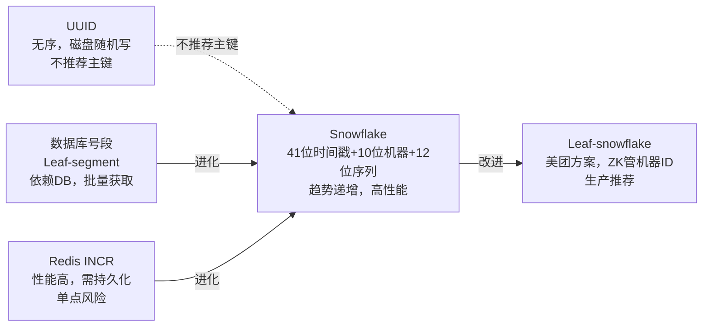

# 分库分表

## 概念

分库分表是应对大规模数据和高并发场景下，将单一数据库/表拆分为多个库/表的技术方案。

- **分库**：将数据分散到多个数据库实例，突破单机连接数和资源瓶颈
- **分表**：将单张大表拆分为多张小表，降低单表数据量，提升查询效率
- **核心目标**：突破单机存储上限、提升并发吞吐、降低锁竞争

## 核心原理

### 1. 为什么要分库分表

单库单表在数据量增长到一定程度后会遇到明显瓶颈：

- **单表数据量瓶颈**：经验值为单表超过 **500 万行**或数据量超过 **2GB**，B+ 树层高增加，索引查询变慢，DDL 操作（加索引、加列）耗时极长且会锁表
- **连接数瓶颈**：MySQL 默认最大连接数约 151，高并发下连接池耗尽，请求排队甚至超时
- **磁盘 IO 瓶颈**：单机磁盘吞吐有上限，大表全表扫描会拖垮整个实例
- **写入竞争**：大量并发写同一张表，行锁/表锁冲突加剧

---

### 2. 垂直拆分 vs 水平拆分

| 维度 | 垂直分库 | 垂直分表 | 水平分库 | 水平分表 |
|------|----------|----------|----------|----------|
| 拆分依据 | 按业务模块 | 按字段冷热 | 按数据行路由到不同库 | 按数据行路由到不同表 |
| 解决问题 | 耦合度高、连接数不足 | 单行数据过宽、冷热分离 | 单机容量/连接数瓶颈 | 单表数据量过大 |
| 数据量变化 | 不减少总量 | 不减少总量 | 每个库数据量减少 | 每个表数据量减少 |
| 实现复杂度 | 低 | 低 | 高 | 中 |

**垂直分库（按业务拆）**

将不同业务的表拆到独立数据库，例如：订单库、用户库、商品库。各业务团队独立维护，降低耦合，但跨业务的 JOIN 变为应用层关联。

**垂直分表（冷热分离）**

将同一张表中访问频繁的热字段和不常访问的冷字段分离。例如用户表拆分为 `user_base`（id、name、phone）和 `user_ext`（详细地址、备注、头像 URL）。减少单行宽度，提升热数据缓存命中率。

**水平分库**

同一张表的数据按照分片键路由到多个库，每个库的表结构完全相同。适合需要突破单机连接数和磁盘瓶颈的场景。

**水平分表**

同一个库内，将一张大表拆成多张小表（如 `order_0`、`order_1`、...`order_N`），降低单表数据量，减少索引维护开销。

---

### 3. 分片策略

#### Range 分片（按范围）

按时间或 ID 区间划分，如：
- `order_2024`、`order_2025`（按年）
- `user_0`（id 1~100万）、`user_1`（id 100万~200万）

**优点**：便于范围查询和时间维度的数据归档  
**缺点**：容易产生热点（最新数据集中写入最新分片），扩容时需要手动划分新区间

#### Hash 分片（取模）

对分片键做哈希后取模，如 `shard_index = hash(user_id) % N`。

**优点**：数据分布均匀，写入压力平摊  
**缺点**：范围查询需要扫描所有分片；扩容时取模基数变化，几乎所有数据都需要迁移

#### 一致性哈希

将哈希值空间构建为一个环（0 ~ 2³²），节点均匀分布在环上，数据路由到顺时针方向最近的节点。

```
        0
       / \
    节点A   节点D
     |         |
    节点B   节点C
       \ /
      2^32-1
```

**优点**：新增/删除节点时只有相邻节点受影响，迁移数据量为 `1/N`  
**缺点**：少量节点时数据分布不均，通常引入虚拟节点（Virtual Node）解决

#### 各策略对比

| 策略 | 数据均衡 | 范围查询 | 扩容成本 | 热点风险 |
|------|----------|----------|----------|----------|
| Range | 差（时间热点） | 优秀 | 低 | 高 |
| Hash 取模 | 好 | 差（全分片扫描） | 高（全量迁移） | 低 |
| 一致性哈希 | 较好（加虚拟节点） | 差 | 低（1/N 迁移） | 低 |

---

### 4. 分布式 ID 方案

分库分表后不能再依赖单库自增主键，需要全局唯一 ID。

#### UUID

格式：`550e8400-e29b-41d4-a716-446655440000`

- **优点**：本地生成，无需网络调用，绝对唯一
- **缺点**：128 位无序字符串，B+ 树插入时频繁触发**页分裂**，写性能差；占用空间大；不可读

#### 雪花算法（Snowflake）

Twitter 提出的 64 位有序 ID 生成方案，结构如下：

```
| 1位符号位 | 41位时间戳(ms) | 10位机器ID | 12位序列号 |
```

- **符号位**（1 bit）：固定为 0，保证正数
- **时间戳**（41 bit）：相对于起始时间的毫秒数，可用约 69 年
- **机器 ID**（10 bit）：5 位数据中心 + 5 位机器节点，最多 1024 个节点
- **序列号**（12 bit）：同一毫秒内最多生成 4096 个 ID

**优点**：趋势递增（对 B+ 树友好）、高性能（纯内存，每秒百万级）、含时间信息  
**缺点**：依赖机器时钟，时钟回拨会导致 ID 重复；机器 ID 需要统一分配

#### 号段模式（Leaf、美团方案）

从数据库预取一批 ID 号段缓存到内存，用完再取。例如 Leaf 每次从 `max_id` 读取并更新 `max_id += step`：

```sql
UPDATE id_alloc SET max_id = max_id + 1000, version = version + 1
WHERE biz_tag = 'order' AND version = #{old_version}
```

- **优点**：ID 趋势递增，DB 压力极低（每批次一次写），可用性高（双 buffer 预加载）
- **缺点**：重启后号段内未用 ID 丢失，ID 不连续；依赖 DB 高可用

---

### 5. 分库分表后的典型问题

#### 跨库 JOIN

单库时可以直接 JOIN，分库后不同数据可能在不同实例，数据库层无法直接关联。

**解法**：
- **应用层关联**：分两次查询，在代码中做内存 JOIN（适合数据量不大）
- **冗余字段**：在子表中冗余主表常用字段（如订单表冗余用户名），牺牲一致性换查询效率
- **全局广播表**：数据量小且几乎不变的字典表（如城市表）在每个库都保留一份完整副本

#### 跨库事务

单库事务 ACID 天然保证；跨库后需要分布式事务：

- **2PC（两阶段提交）**：Prepare 阶段加锁，Commit 阶段提交。实现简单，但协调者宕机会导致长时间阻塞，性能差
- **TCC（Try-Confirm-Cancel）**：业务层实现补偿逻辑，Try 预占资源，Confirm 确认，Cancel 回滚。性能好，但业务侵入性强
- **最终一致性**：通过本地消息表 + MQ 异步通知，允许短暂不一致，适合对实时性要求不高的场景

#### 全局排序和分页

`ORDER BY create_time LIMIT 10 OFFSET 100` 在多分片场景下需要：
1. 在每个分片上执行 `ORDER BY create_time LIMIT 110`
2. 在应用层/中间件做**归并排序**，取最终 Top 10

深翻页（大 OFFSET）代价极高，建议改为**游标分页**（记录上次最大 ID，下次从该 ID 之后查）。

#### 扩容困难

Hash 取模分片时，从 N 个分片扩容到 M 个分片，路由规则变化导致大量数据需要迁移。

**解法**：
- **一致性哈希**：如前述，只迁移 1/N 数据
- **翻倍扩容**：每次扩容为原来的 2 倍（如 4 → 8），每个旧分片的数据只需拆到 2 个新分片，迁移量可控，且路由规则只需取模基数翻倍
- **提前预分片**：初始就分 1024 个逻辑分片，映射到少量物理节点，扩容时只需重新映射，数据无需迁移

---

### 6. 常见中间件

| 中间件 | 厂商 | 接入方式 | 特点 |
|--------|------|----------|------|
| **ShardingSphere** | Apache | JDBC / Proxy 双模式 | 生态最完善，支持读写分离、分布式事务、数据脱敏 |
| **Vitess** | CNCF（YouTube 开源） | Proxy | 面向 Kubernetes，大规模 MySQL 集群管理，YouTube 生产验证 |
| **TDDL** | 阿里巴巴 | JDBC | 阿里内部演进多年，PolarDB-X 的前身，与淘宝业务深度绑定 |

---

## 面试常问 & 怎么答

**Q1：什么时候需要分库分表？垂直和水平怎么选？**

先看瓶颈在哪里：
- 如果是**业务耦合严重、连接数不足**，先考虑垂直分库，按业务域拆分
- 如果是**单表数据量过大**（超过 500 万行或 2GB）导致查询慢、DDL 卡顿，考虑水平分表
- 如果是**单机资源（CPU/内存/磁盘 IO）达到上限**，考虑水平分库
- 优先顺序：垂直分库 → 读写分离 → 缓存优化 → 水平分表/分库。不要过早分片，分库分表会引入大量复杂性

**Q2：分片键怎么选？选错了怎么办？**

分片键选择原则：
1. **高基数**：值的种类足够多，确保数据分布均匀（不能用性别这类低基数字段）
2. **高频出现在查询条件中**：分片键必须能覆盖大多数查询，否则每次查询都要扫全分片
3. **不可变**：分片键一旦确定不应更改，否则数据需要跨分片迁移
4. 优先选择**业务主键**（user_id、order_id），而非时间戳（有热点风险）

选错了怎么办：成本极高，没有低代价的方案。常见处理：
- **双写迁移**：新旧两套分片规则同时写，逐步将流量切到新规则，完成后清理旧数据
- **停机迁移**：业务低峰期停服，全量迁移，适合数据量可控的场景
- **在线平滑迁移**：配合 binlog 监听增量同步，先全量后增量，最终切流

**Q3：分库分表后跨库查询怎么处理？**

分三种情况：
1. **关联查询（JOIN）**：优先通过冗余字段消除 JOIN 需求；如果必须关联，改为应用层两次查询后内存合并；对于字典类小表，使用广播表（每个分片都保存全量数据）
2. **全局排序分页**：中间件层归并排序，代价随页数增加而增大；业务层改为游标分页替代 OFFSET 分页
3. **聚合统计（COUNT/SUM）**：每个分片并行计算局部结果，应用层汇总；对于近似统计可结合缓存或预聚合表

## 看到什么就先想到这类

- 题目出现「单表数据量大、查询变慢、DDL 超时」→ 水平分表
- 题目出现「多业务共用一个库、连接数打满」→ 垂直分库
- 题目出现「分布式唯一 ID、主键生成」→ 雪花算法 / 号段模式
- 题目出现「数据迁移、扩容」→ 一致性哈希 / 翻倍扩容
- 题目出现「跨库事务」→ TCC / 最终一致性 + MQ
- 题目出现「分页查询慢」→ 游标分页替代 OFFSET，禁止深翻页
- 题目出现「热点写入、某分片压力大」→ 分片策略问题，考虑 Hash 分片或加盐打散

---

## 深度图解与高频面试题

### 全局唯一ID方案对比

分库分表后不能再依赖数据库自增主键，常见全局ID方案：



| 方案 | 有序性 | 性能 | 依赖 | 推荐场景 |
|------|--------|------|------|---------|
| UUID | ❌ 随机 | 高 | 无 | 非主键场景 |
| DB号段 | ✅ 趋势 | 中 | MySQL | 中小规模 |
| Redis INCR | ✅ 趋势 | 高 | Redis | 对DB依赖敏感 |
| Snowflake | ✅ 趋势 | 极高 | 机器时钟 | **生产首选** |

**Snowflake结构（64位）：**
```
符号位(1) | 毫秒时间戳(41) | 数据中心ID(5) | 机器ID(5) | 序列号(12)
```
- 可用约69年，单机每毫秒最多4096个ID
- **时钟回拨问题**：NTP同步导致时间倒退，解决方案：等待时钟追上、使用备用号段、或引入逻辑时钟

---

### 深翻页优化

分库分表后 `LIMIT 100000, 20` 性能极差，需要优化：

```sql
-- ❌ 深翻页（扫描100020行后丢弃前100000行）
SELECT * FROM orders ORDER BY id LIMIT 100000, 20;

-- ✅ 方案1：游标法（记住上次最后一条记录的ID）
SELECT * FROM orders WHERE id > 100000 ORDER BY id LIMIT 20;

-- ✅ 方案2：覆盖索引子查询（先用索引定位，再回表）
SELECT * FROM orders o
JOIN (SELECT id FROM orders ORDER BY id LIMIT 100000, 20) t
ON o.id = t.id;
```

**面试回答思路：** 业务上禁止任意翻页（只允许前后翻），深翻页使用游标法，搜索场景引入 Elasticsearch。

---

### 高频面试Q&A

**Q: 分库分表后如何做跨库JOIN？**

A: 四种方案：① **字段冗余**——将关联表常用字段冗余到主表，避免JOIN（最常用）；② **字典表广播**——小维度表（城市、品类）在每个库中全量复制；③ **应用层聚合**——分别查询两个库的数据，在应用层拼接；④ **引入ES**——复杂关联查询交由 Elasticsearch 处理。选择依据：数据量大小、一致性要求、查询频率。

**Q: 分库分表后如何不停机扩容（从4库扩到8库）？**

A: 三阶段方案：① **双写阶段**——新旧两套库同时写，新库通过binlog追历史数据；② **数据校验**——比对新旧库数据一致性，通过后切读流量到新库；③ **切换阶段**——停写旧库，切写流量到新库，验证无误后下线旧库。关键：双写期间保证幂等写入，整个过程对业务透明。

**Q: 如何选择分片键？**

A: 三个核心原则：① **高基数**——分片键值域尽量大，避免数据倾斜（不要用性别、状态等低基数字段）；② **均匀分布**——哈希分片时，分片键哈希值要均匀分布；③ **业务相关性**——尽量与最常见查询条件一致（如按用户ID分片，同一用户的订单在同库），避免跨库查询。

**Q: 什么是热点问题？如何解决？**

A: 热点指某些分片数据量或请求量远超其他分片。常见原因：分片键选择不当（如时间戳导致新数据集中在某片）、某些用户或商品特别活跃。解决方案：① 对热点KEY加随机后缀（1~N）分散到多个分片，查询时合并结果；② 大V/爆款商品单独路由处理；③ 引入缓存层减少DB压力。
