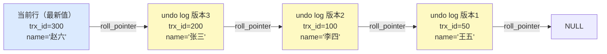
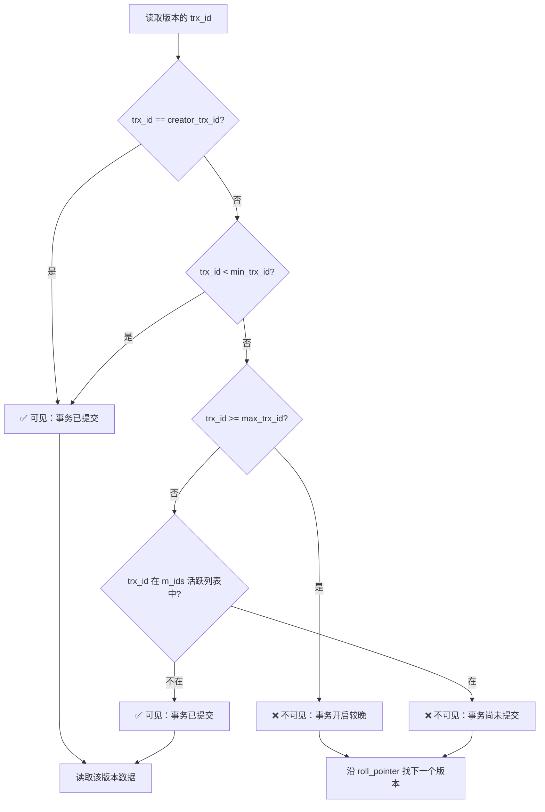
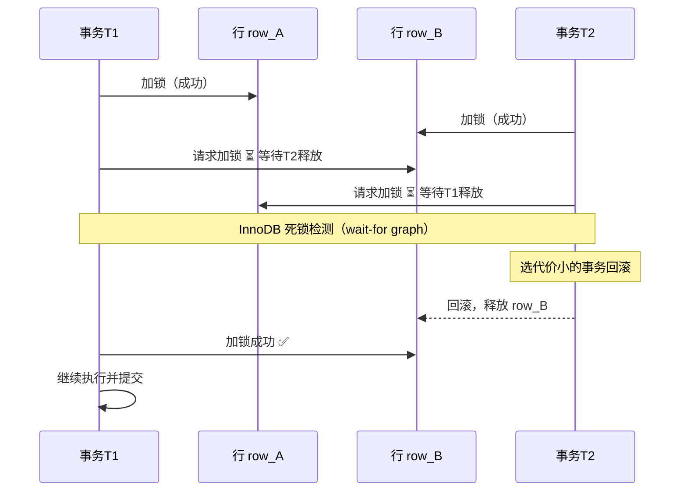

# 事务与锁

## 概念

**事务（Transaction）** 是数据库操作的最小逻辑单元，要么全部执行成功，要么全部回滚，保证数据的一致性和完整性。

**锁（Lock）** 是数据库并发控制的核心机制，用于协调多个事务对同一数据的并发访问，防止数据不一致。

MySQL 的 InnoDB 存储引擎同时支持事务和行级锁，是生产环境中最常用的引擎。

---

## 核心原理

### 1. ACID 特性

ACID 是事务的四大特性，是数据库事务可靠性的基础保障。

| 特性 | 含义 | MySQL InnoDB 实现方式 |
|------|------|----------------------|
| **A — 原子性（Atomicity）** | 事务中的所有操作要么全部成功，要么全部回滚 | `undo log`：记录操作的逆操作，回滚时按版本链还原 |
| **C — 一致性（Consistency）** | 事务执行前后，数据库从一个合法状态变为另一个合法状态 | 约束（主键、外键、唯一索引）+ 应用层业务逻辑共同保障 |
| **I — 隔离性（Isolation）** | 多个并发事务互不干扰，中间状态对其他事务不可见 | `MVCC`（多版本并发控制）+ 锁机制 |
| **D — 持久性（Durability）** | 事务提交后，数据永久保存，即使系统崩溃也不丢失 | `redo log`（WAL 预写日志）：提交前先写日志，崩溃恢复时重放 |

> AID 是手段，C 是目的。原子性、隔离性、持久性共同保障一致性。

---

### 2. 四种隔离级别

SQL 标准定义了四种隔离级别，隔离程度从低到高，并发性能从高到低。

| 隔离级别 | 脏读 | 不可重复读 | 幻读 | 说明 |
|---------|------|-----------|------|------|
| **读未提交（Read Uncommitted）** | 可能 | 可能 | 可能 | 可以读到其他事务未提交的数据 |
| **读已提交（Read Committed，RC）** | 不可能 | 可能 | 可能 | 只能读到已提交的数据，Oracle 默认级别 |
| **可重复读（Repeatable Read，RR）** | 不可能 | 不可能 | 基本解决 | 同一事务内多次读取结果一致，**InnoDB 默认级别** |
| **串行化（Serializable）** | 不可能 | 不可能 | 不可能 | 事务串行执行，完全隔离，性能最差 |

**三种并发问题定义：**

- **脏读**：读到其他事务尚未提交的数据，若该事务回滚则读到了"垃圾数据"
- **不可重复读**：同一事务内，两次读取同一行数据结果不同（其他事务 UPDATE/DELETE 并提交）
- **幻读**：同一事务内，两次查询返回的行数不同（其他事务 INSERT 并提交）

> InnoDB 在 RR 级别下通过 **MVCC + 间隙锁** 基本解决幻读问题，但快照读和当前读的幻读处理方式不同。

---

### 3. MVCC 原理

MVCC（Multi-Version Concurrency Control，多版本并发控制）让读写操作尽量不互相阻塞，提升并发性能。

#### 3.1 隐藏列

InnoDB 为每行数据额外维护三个隐藏列：

```
+------------------+------------------+------------------+-----+
| DB_ROW_ID        | DB_TRX_ID        | DB_ROLL_PTR      | ... |
| 隐式主键(无主键时) | 最近修改该行的事务ID | 指向 undo log 的指针 | 数据列 |
+------------------+------------------+------------------+-----+
```

| 隐藏列 | 说明 |
|--------|------|
| `DB_ROW_ID` | 若表没有显式主键，InnoDB 用此列生成聚簇索引 |
| `DB_TRX_ID` | 最后一次修改该行数据的事务 ID |
| `DB_ROLL_PTR` | 回滚指针，指向该行在 undo log 中的上一个版本 |

#### 3.2 undo log 版本链

每次对某行数据进行修改，旧版本数据会被写入 undo log，并通过 `DB_ROLL_PTR` 串联成版本链：

```
当前行（trx_id=100）
       |
       | DB_ROLL_PTR
       v
  undo log v2（trx_id=80）
       |
       | DB_ROLL_PTR
       v
  undo log v1（trx_id=50）
       |
       v
      NULL（最早版本）
```

#### 3.3 ReadView（读视图）

ReadView 是事务进行快照读时生成的"一致性视图"，决定该事务能看到哪个版本的数据。

**ReadView 的四个关键字段：**

| 字段 | 含义 |
|------|------|
| `creator_trx_id` | 创建该 ReadView 的事务 ID |
| `m_ids` | 创建 ReadView 时，所有**活跃（未提交）**事务的 ID 列表 |
| `min_trx_id` | `m_ids` 中最小的事务 ID |
| `max_trx_id` | 创建 ReadView 时，下一个将分配的事务 ID（即当前最大事务 ID + 1） |

**版本可见性判断规则（沿版本链依次比较 `DB_TRX_ID`）：**

```
对某行版本的 trx_id 判断：

1. trx_id == creator_trx_id          → 自己修改的，可见
2. trx_id < min_trx_id               → 已提交的旧事务，可见
3. trx_id >= max_trx_id              → ReadView 创建后才开启的事务，不可见
4. min_trx_id <= trx_id < max_trx_id → 检查是否在 m_ids 中
   - 在 m_ids 中   → 创建 ReadView 时还未提交，不可见
   - 不在 m_ids 中 → 已提交，可见
```

#### 3.4 RC 与 RR 的核心区别

| 隔离级别 | ReadView 生成时机 | 效果 |
|---------|-----------------|------|
| **RC（读已提交）** | 每次执行快照读时都生成新的 ReadView | 能读到其他事务最新提交的数据，可能不可重复读 |
| **RR（可重复读）** | 事务内**第一次**执行快照读时生成，后续复用 | 整个事务看到的数据版本一致，实现可重复读 |

---

### 4. 当前读 vs 快照读

| 读类型 | 触发语句 | 机制 | 特点 |
|--------|---------|------|------|
| **快照读（Snapshot Read）** | 普通 `SELECT` | MVCC，读历史版本 | 不加锁，高并发，可能读到旧数据 |
| **当前读（Current Read）** | `SELECT ... FOR UPDATE`、`SELECT ... LOCK IN SHARE MODE`、`INSERT`、`UPDATE`、`DELETE` | 加锁，读最新提交版本 | 加锁保证读到最新数据 |

> 快照读是 MVCC 的体现；当前读是锁机制的体现。RR 级别下，快照读不产生幻读（靠 MVCC），但当前读需要间隙锁来防止幻读。

---

### 5. InnoDB 锁类型

#### 5.1 行锁（Record Lock）

锁定索引记录本身，精度最细，并发性能最好。

```
索引：... | 10 | 20 | 30 | 40 | ...
行锁：          [20]          ← 只锁定值为 20 的这一行
```

> 注意：InnoDB 的行锁是加在**索引**上的，若查询条件不走索引，会退化为**表锁**。

#### 5.2 间隙锁（Gap Lock）

锁定索引记录之间的"间隙"，不锁定记录本身，用于防止幻读（阻止其他事务在间隙中插入新数据）。

```
索引：... | 10 | 20 | 30 | 40 | ...
间隙锁：       (10, 20)       ← 锁定 10 到 20 之间的间隙，不含端点
```

- 间隙锁只在 **RR 及以上**隔离级别下生效
- 间隙锁之间**不互斥**，多个事务可以同时持有同一间隙的间隙锁（但都会阻塞插入）

#### 5.3 临键锁（Next-Key Lock）

临键锁 = 行锁 + 间隙锁，是 InnoDB 默认的行锁算法，锁定一个**左开右闭**的区间。

```
索引：... | 10 | 20 | 30 | 40 | ...
临键锁：       (10, 20]      ← 锁定间隙 (10,20) 且包含记录 20
```

**InnoDB 加锁规则（RR 级别，简化版）：**

1. 默认加临键锁（Next-Key Lock）
2. 唯一索引等值查询，且记录存在 → 退化为行锁
3. 唯一索引等值查询，且记录不存在 → 退化为间隙锁
4. 索引范围查询 → 涉及范围内的临键锁

#### 5.4 意向锁（Intention Lock）

意向锁是**表级锁**，由 InnoDB 自动加，用于快速判断表中是否有行级锁，避免表锁与行锁冲突时逐行检查。

| 锁类型 | 说明 | 加锁时机 |
|--------|------|---------|
| **IS（意向共享锁）** | 表示事务意图在某些行上加共享锁 | 事务加行共享锁前，自动加 IS |
| **IX（意向排他锁）** | 表示事务意图在某些行上加排他锁 | 事务加行排他锁前，自动加 IX |

**锁兼容矩阵（表级）：**

|  | IS | IX | S（表共享锁） | X（表排他锁） |
|--|----|----|------------|------------|
| **IS** | 兼容 | 兼容 | 兼容 | 不兼容 |
| **IX** | 兼容 | 兼容 | 不兼容 | 不兼容 |
| **S** | 兼容 | 不兼容 | 兼容 | 不兼容 |
| **X** | 不兼容 | 不兼容 | 不兼容 | 不兼容 |

#### 5.5 表锁

锁定整张表，并发性最差，但开销最小。

- `LOCK TABLES t READ` — 加表共享锁
- `LOCK TABLES t WRITE` — 加表排他锁
- InnoDB 中，若 UPDATE/DELETE 的 WHERE 条件**不走索引**，会对全表加锁（退化为表锁）

---

### 6. 死锁

#### 6.1 死锁产生的四个必要条件

| 条件 | 说明 |
|------|------|
| **互斥** | 资源同一时刻只能被一个事务持有 |
| **占有并等待** | 事务持有资源的同时，等待其他资源 |
| **不可剥夺** | 已获得的资源不能被强制释放 |
| **循环等待** | 多个事务形成环形等待链 |

**经典死锁场景：**

```
事务 A：锁住行 1，等待行 2
事务 B：锁住行 2，等待行 1

A → 等待 B 释放行2
B → 等待 A 释放行1
          ↑
        死锁！
```

#### 6.2 InnoDB 死锁检测机制

InnoDB 使用 **wait-for graph（等待图）** 进行死锁检测：

```
节点 = 事务
有向边 = "事务A 等待 事务B 持有的锁"

检测到有向图中存在环 → 判定死锁
→ 选择代价最小的事务作为"牺牲品"，回滚该事务以打破死锁
```

- 检测是**实时**进行的（每次加锁等待时触发）
- 回滚代价：以 undo log 数量衡量，选择回滚量小的事务

#### 6.3 死锁预防与排查策略

**预防：**

1. **固定加锁顺序**：所有事务按相同顺序访问资源，消除循环等待
2. **缩短事务**：减少事务持有锁的时间，降低冲突概率
3. **一次性加锁**：尽量在事务开始时一次申请所有需要的锁
4. **使用低隔离级别**：在业务允许的情况下，用 RC 代替 RR（消除间隙锁）
5. **避免大事务**：拆分为小事务，减少锁竞争范围

**排查：**

```sql
-- 查看最近一次死锁信息
SHOW ENGINE INNODB STATUS\G

-- 查看当前锁等待情况（MySQL 8.0+）
SELECT * FROM performance_schema.data_lock_waits;

-- 查看当前持有的锁
SELECT * FROM performance_schema.data_locks;

-- 开启死锁日志记录（innodb_print_all_deadlocks）
SET GLOBAL innodb_print_all_deadlocks = ON;
```

#### 死锁日志解读模板（必背）

**面试经常给一段死锁日志让你解读**——能讲清"哪两个事务、各持什么锁、等什么锁、谁被回滚"立刻显出实战经验。

```
------------------------
LATEST DETECTED DEADLOCK
------------------------
2026-06-04 10:00:00
*** (1) TRANSACTION:                              ← 事务 1
TRANSACTION 12345, ACTIVE 5 sec starting index read
mysql tables in use 1, locked 1
LOCK WAIT 3 lock struct(s), heap size 1136
MySQL thread id 100, query id 1000 user1
UPDATE orders SET status=1 WHERE id=2

*** (1) HOLDS THE LOCK(S):                        ← 事务 1 持有的锁
RECORD LOCKS space id 30 page no 4 n bits 72 index PRIMARY
of table `db`.`orders` trx id 12345
Record lock, heap no 2 PHYSICAL RECORD ... id=1   ← 持有 id=1 的行锁

*** (1) WAITING FOR THIS LOCK TO BE GRANTED:      ← 事务 1 等待的锁
RECORD LOCKS space id 30 page no 4 n bits 72 index PRIMARY
of table `db`.`orders` trx id 12345
Record lock, heap no 3 PHYSICAL RECORD ... id=2   ← 想拿 id=2 的行锁

*** (2) TRANSACTION:                              ← 事务 2
TRANSACTION 12346, ACTIVE 5 sec
UPDATE orders SET status=1 WHERE id=1

*** (2) HOLDS THE LOCK(S):                        ← 持有 id=2
RECORD LOCKS ... id=2

*** (2) WAITING FOR THIS LOCK TO BE GRANTED:      ← 等待 id=1
RECORD LOCKS ... id=1

*** WE ROLL BACK TRANSACTION (2)                  ← MySQL 回滚事务 2
```

**解读 4 步流程**：
1. 看 **TRANSACTION (1) / (2)** 各执行的 SQL
2. 看 **HOLDS THE LOCK(S)** 各自持有什么锁（哪个表、哪行、什么锁）
3. 看 **WAITING FOR THIS LOCK** 各自在等什么锁
4. 看 **WE ROLL BACK TRANSACTION** 哪个被牺牲（**通常是 undo log 量较小的**）

#### 常见死锁场景速判

| 场景 | 原因 | 修复 |
|------|------|------|
| **更新顺序不一致** | A 先改 id=1 再 id=2，B 先改 id=2 再 id=1 | **业务统一按主键升序更新** |
| **范围更新 + 等值更新** | A 锁范围 [1, 10]，B 等值锁 id=5 | 减少范围更新、用主键定点更新 |
| **唯一索引冲突回滚** | 两个事务都 INSERT 相同唯一键 → 一个 INSERT 时持 next-key lock | 改为 `INSERT ... ON DUPLICATE KEY UPDATE` |
| **gap lock 不互斥** | RR 级别下两个事务都拿同一段 gap lock，再都想插入 → 死锁 | 改 RC 级别 / 业务前置去重 |

#### Gap 锁（间隙锁）实战陷阱

::: warning ⚠️ Gap 锁在 RR 下很容易"莫名其妙"出现

> **常见场景**：`UPDATE orders WHERE status='PENDING'` 在 status 列**没有索引**时：
> 
> RR 级别下 InnoDB **会把所有扫描过的行都加锁**（实际上锁整张表）。两个事务同时这么 UPDATE → 互相 Gap 锁等待 → 死锁。
> 
> **修复**：① 给 status 加索引；② 用主键 IN 列表更新；③ 改 RC 级别（去掉 Gap 锁）。

:::

---

## 面试常问 & 怎么答

### Q1：MySQL 默认隔离级别是什么？如何解决幻读？

**答：**

MySQL InnoDB 默认隔离级别是**可重复读（Repeatable Read，RR）**。

InnoDB 在 RR 级别下通过两种机制解决幻读：

1. **快照读（普通 SELECT）**：通过 MVCC 的 ReadView 机制，事务内第一次快照读生成 ReadView 后复用，后续查询始终读取同一版本的数据，其他事务插入的新行对当前事务不可见，避免幻读。

2. **当前读（SELECT FOR UPDATE 等）**：通过**间隙锁（Gap Lock）或临键锁（Next-Key Lock）**，锁定查询范围内的间隙，阻止其他事务插入新行，从而防止幻读。

> 注意：快照读 + 当前读混用时，仍可能出现幻读现象（先快照读无数据，再当前读有数据）。严格消除需用串行化级别。

---

### Q2：MVCC 的实现原理？RC 和 RR 下有什么区别？

**答：**

MVCC 通过以下三个核心组件实现：

1. **隐藏列**：每行数据有 `DB_TRX_ID`（最后修改的事务 ID）和 `DB_ROLL_PTR`（指向 undo log 的指针）。

2. **undo log 版本链**：每次修改都将旧版本写入 undo log，通过 `DB_ROLL_PTR` 串联成版本链，保存数据的历史快照。

3. **ReadView**：快照读时创建，记录当前活跃事务列表（`m_ids`）、最小活跃事务 ID（`min_trx_id`）、下一个事务 ID（`max_trx_id`）。读取时沿版本链查找，找到对当前 ReadView 可见的最新版本。

**RC 与 RR 的区别：**

- **RC**：每次快照读都重新生成 ReadView，因此能读到其他事务刚提交的数据，可能导致不可重复读。
- **RR**：整个事务内只在**第一次**快照读时生成 ReadView，后续复用，保证同一事务内读取结果一致，实现可重复读。

---

### Q3：行锁、间隙锁、临键锁分别是什么？什么时候加什么锁？

**答：**

| 锁类型 | 锁定范围 | 作用 |
|--------|---------|------|
| **行锁（Record Lock）** | 单个索引记录 | 防止其他事务修改该行 |
| **间隙锁（Gap Lock）** | 索引记录之间的间隙，不含端点 | 防止幻读，阻止在间隙中插入 |
| **临键锁（Next-Key Lock）** | 间隙 + 右端记录（左开右闭区间） | InnoDB 默认行锁算法，兼顾行锁和间隙锁 |

**加锁规则（RR 级别下）：**

- **唯一索引等值查询，记录存在** → 行锁（退化，无需间隙锁）
- **唯一索引等值查询，记录不存在** → 间隙锁（锁住对应间隙防止插入）
- **普通索引等值查询** → 临键锁（锁住匹配记录及其左侧间隙）
- **范围查询** → 涉及范围内的多个临键锁
- **查询不走索引** → 退化为表锁（全表扫描时对每行加临键锁，等效表锁）

---

### Q4：死锁是怎么产生的？怎么排查和预防？

**答：**

**产生原因：** 两个或多个事务互相持有对方需要的锁，形成**循环等待**，永远无法推进。

经典场景：事务 A 锁住行 1 等行 2，事务 B 锁住行 2 等行 1，形成环路。

**InnoDB 检测机制：** 使用 **wait-for graph（等待图）**，将事务为节点、等待关系为有向边，实时检测是否存在环。检测到死锁后，选择回滚代价最小（undo log 量少）的事务进行回滚以打破死锁。

**排查方法：**

```sql
SHOW ENGINE INNODB STATUS\G  -- 查看最近一次死锁详情
-- MySQL 8.0+ 还可查询 performance_schema.data_lock_waits
```

**预防策略：**

1. **统一加锁顺序**：所有业务代码按固定顺序访问多行/多表
2. **缩短事务粒度**：避免大事务，减少锁持有时间
3. **合理使用索引**：确保 UPDATE/DELETE 走索引，避免全表锁
4. **业务允许时降低隔离级别**：RC 级别无间隙锁，减少锁冲突

---

## 看到什么就先想到这类

| 关键词/场景 | 联想到 |
|------------|--------|
| "脏读 / 不可重复读 / 幻读" | 四种隔离级别对比表 |
| "InnoDB 默认隔离级别" | RR（可重复读）|
| "如何解决幻读" | MVCC（快照读）+ 间隙锁/临键锁（当前读）|
| "SELECT 为什么不加锁" | 快照读，基于 MVCC 读历史版本 |
| "SELECT FOR UPDATE" | 当前读，加行锁或临键锁 |
| "普通 SELECT 和 FOR UPDATE 结果不一致" | 快照读 vs 当前读，版本不同 |
| "undo log" | 原子性回滚 + MVCC 版本链 |
| "redo log" | 持久性，崩溃恢复 |
| "行锁退化为表锁" | WHERE 条件未命中索引 |
| "间隙锁 / Gap Lock" | 防止幻读，RR 级别，范围查询或不存在记录的等值查询 |
| "死锁" | 循环等待 + wait-for graph 检测 + 回滚代价小的事务 |
| "SHOW ENGINE INNODB STATUS" | 排查死锁、查看锁等待 |
| "DB_TRX_ID / DB_ROLL_PTR" | MVCC 隐藏列，版本链核心 |
| "ReadView / m_ids" | MVCC 快照读的可见性判断 |
| "RC 每次都生成 ReadView" | 不可重复读的根源 |
| "RR 只在第一次生成 ReadView" | 可重复读的实现原理 |

---

## 深度图解

### MVCC 版本链可视化

InnoDB 每行数据维护隐藏字段 `trx_id`（最后修改的事务ID）和 `roll_pointer`（指向 undo log 版本链）。



**ReadView 可见性判断规则（RR 隔离级别）：**



> 详见上方 3.4 节 MVCC 快照读部分。

---

### 死锁场景与检测



**避免死锁的策略：**
- **固定加锁顺序**：所有业务代码按相同顺序申请资源（A→B，不要A→B和B→A混用）
- **缩短事务**：减少事务持有锁的时间，降低锁冲突概率
- **超时设置**：`innodb_lock_wait_timeout`（默认50s）到期后自动回滚
- **死锁检测**：`innodb_deadlock_detect=ON`（默认开启），检测到后立即回滚代价最小的事务

---

### Next-Key Lock 区间示意

假设索引列有值 10, 20, 30，InnoDB 在 RR 级别会对查询范围加 Next-Key Lock：

```
(-∞, 10]  (10, 20]  (20, 30]  (30, +∞)
  GAP+REC   GAP+REC   GAP+REC   GAP only

查询 WHERE id = 20（唯一索引）：退化为 Record Lock，只锁记录本身
查询 WHERE id = 20（非唯一索引）：锁 (10, 20] + (20, 30)（防止重复值插入）
查询 WHERE id > 15 AND id < 25：锁 (10, 20] + (20, 30]
```

| 锁类型 | 含义 | 防止 |
|--------|------|------|
| Record Lock | 锁定索引记录本身 | 其他事务修改该行 |
| Gap Lock | 锁定索引记录之间的间隙 | 其他事务在间隙内 INSERT |
| Next-Key Lock | Gap Lock + Record Lock | 幻读 |

> InnoDB 在 RR 级别默认使用 Next-Key Lock。如果查询使用唯一索引等值查询，退化为 Record Lock（无 Gap）。
