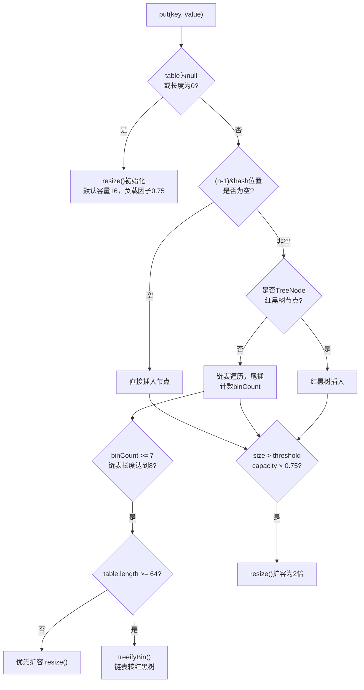
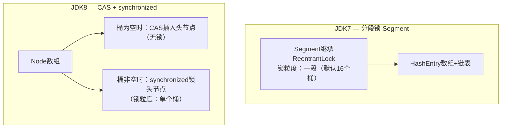

# Java 集合框架

<span class="dig-tag dig-tag--category">编程语言</span>
<span class="dig-tag dig-tag--hard">⭐⭐⭐ 高级</span>
<span class="dig-tag dig-tag--hot">🔥🔥🔥 高频</span>

::: tip 💡 核心要点
Java 集合框架分为 Collection 和 Map 两大体系。重点掌握：ArrayList vs LinkedList 的选择依据、ConcurrentHashMap 的分段锁（JDK 7）到 CAS+synchronized（JDK 8）的演进、以及 fail-fast 与 fail-safe 迭代器的区别。HashMap 基础原理见 [Java 基础原理](./java-fundamentals.md)。
:::

## 概念

Java 集合框架（Java Collections Framework）是一套标准化的数据结构库，提供了统一的接口和多种实现，涵盖列表、集合、队列和映射。

**两大顶级接口：**
- `Collection`：单值集合，子接口有 List、Set、Queue
- `Map`：键值对集合，Key 唯一

## 核心原理

### 1. 集合体系总览

```
java.lang.Iterable
    └── java.util.Collection
            ├── List
            │     ├── ArrayList
            │     ├── LinkedList
            │     └── Vector
            │           └── Stack
            ├── Set
            │     ├── HashSet
            │     │     └── LinkedHashSet
            │     └── SortedSet
            │           └── TreeSet
            └── Queue
                  ├── LinkedList
                  ├── PriorityQueue
                  └── Deque
                        └── ArrayDeque

java.util.Map
    ├── HashMap
    │     └── LinkedHashMap
    ├── TreeMap
    ├── Hashtable
    │     └── Properties
    └── ConcurrentHashMap
```

---

### 2. List 实现对比

#### ArrayList

底层是 **Object[] 数组**，支持随机访问（实现 `RandomAccess` 接口）。默认初始容量 **10**，每次扩容为原来的 **1.5 倍**（`newCapacity = oldCapacity + (oldCapacity >> 1)`）。扩容时调用 `Arrays.copyOf`，有内存复制开销。

```java
// 扩容核心逻辑（简化）
int newCapacity = oldCapacity + (oldCapacity >> 1); // 1.5x
elementData = Arrays.copyOf(elementData, newCapacity);
```

#### LinkedList

底层是**双向链表**（`Node<E>` 同时持有 prev 和 next 指针），实现了 `List` 和 `Deque` 接口，可作为栈、队列、双端队列使用。增删头尾节点 O(1)，但按索引访问需从头或尾遍历，O(n)。

#### Vector（已过时）

与 ArrayList 类似，但所有方法加了 `synchronized`，线程安全但性能差。JDK 1.0 遗留类，现代代码请使用 `Collections.synchronizedList()` 或 `CopyOnWriteArrayList`。

#### List 实现对比表

| 特性 | ArrayList | LinkedList | Vector |
|------|-----------|------------|--------|
| 底层结构 | 动态数组 | 双向链表 | 动态数组 |
| 随机访问 | O(1) | O(n) | O(1) |
| 头部插入/删除 | O(n) | O(1) | O(n) |
| 尾部插入/删除 | 均摊 O(1) | O(1) | 均摊 O(1) |
| 线程安全 | 否 | 否 | 是（synchronized） |
| 扩容倍数 | 1.5x | 不适用 | 2x |
| 额外内存 | 少 | 每个节点多两个指针 | 少 |

---

### 3. Set 实现

#### HashSet

内部持有一个 `HashMap<E, Object>`，元素作为 Map 的 Key，Value 统一是一个共享的占位常量：

```java
private static final Object PRESENT = new Object();

public boolean add(E e) {
    return map.put(e, PRESENT) == null;
}
```

因此 HashSet 的去重逻辑完全依赖 `hashCode()` + `equals()`，无序，允许一个 null 元素。

#### LinkedHashSet

继承 HashSet，内部使用 `LinkedHashMap`，通过双向链表维护**插入顺序**。迭代顺序与插入顺序一致。

#### TreeSet

基于 `TreeMap`（红黑树），元素按**自然顺序**（`Comparable`）或**自定义比较器**（`Comparator`）排序。增删查均为 O(log n)，不允许 null 元素。

---

### 4. Map 实现对比

> HashMap 底层结构、put 流程、容量为 2 的幂次方的原因、JDK 7 vs 8 的链表转红黑树等，详见 [Java 基础原理 → HashMap](./java-fundamentals.md)。

#### LinkedHashMap

继承 HashMap，额外维护一条**双向链表**，记录每个 Entry 的前驱和后继，从而保留插入顺序（默认）或**访问顺序**。

利用访问顺序可实现 **LRU 缓存**：

```java
// accessOrder=true：每次 get/put 会把该节点移到链表尾部
Map<Integer, Integer> lruCache = new LinkedHashMap<>(16, 0.75f, true) {
    @Override
    protected boolean removeEldestEntry(Map.Entry<Integer, Integer> eldest) {
        return size() > capacity; // 超容量时自动淘汰头部（最久未访问）
    }
};
```

#### TreeMap

基于**红黑树**实现，Key 按自然顺序或 Comparator 排序。支持 `firstKey()`、`lastKey()`、`subMap()` 等范围查询，增删查 O(log n)，不允许 null Key。

#### Hashtable vs HashMap vs ConcurrentHashMap

| 特性 | Hashtable | HashMap | ConcurrentHashMap |
|------|-----------|---------|-------------------|
| 线程安全 | 是（方法级锁） | 否 | 是（分段/节点级锁） |
| null Key/Value | 均不允许 | 允许一个 null Key | 均不允许 |
| 继承关系 | Dictionary | AbstractMap | AbstractMap |
| 性能 | 差（全表锁） | 最好（单线程） | 高并发首选 |
| 推荐度 | 已过时 | 单线程场景 | 并发场景 |

---

### 5. ConcurrentHashMap 深入

#### JDK 7：Segment 分段锁

将整个哈希表划分为 **16 个 Segment**，每个 Segment 继承 `ReentrantLock`，内部是一个小的 `HashEntry[]`。put 时只锁定对应 Segment，理论上最多支持 16 个线程并发写。

```
ConcurrentHashMap (JDK 7)
┌──────────────────────────────┐
│  Segment[0]  (ReentrantLock) │ → HashEntry[] → ...
│  Segment[1]  (ReentrantLock) │ → HashEntry[] → ...
│  ...                         │
│  Segment[15] (ReentrantLock) │ → HashEntry[] → ...
└──────────────────────────────┘
```

#### JDK 8：CAS + synchronized，锁粒度到 Node

JDK 8 废弃了 Segment，底层与 HashMap 相同（数组 + 链表 + 红黑树），锁粒度降低到**单个桶的首节点**。

**put 流程：**

1. **初始化**：table 为 null 时，通过 CAS 设置 `sizeCtl` 标志位，只有一个线程进行初始化
2. **计算 hash**：`spread(key.hashCode())` 高低位混合，减少碰撞
3. **空桶 → CAS**：目标桶为空时，直接用 `casTabAt` 无锁写入新 Node
4. **正在扩容 → 帮助迁移**：检测到 `MOVED` 标记，当前线程参与扩容（`helpTransfer`）
5. **非空桶 → synchronized**：锁住桶首节点，链表尾插或红黑树插入
6. **树化**：链表长度 ≥ 8 且数组容量 ≥ 64 时，转红黑树

```java
// JDK 8 put 核心伪代码
if (table == null) initTable();         // 1. 初始化
int hash = spread(key.hashCode());      // 2. hash
if (tabAt(tab, i) == null) {
    casTabAt(tab, i, null, newNode);    // 3. 空桶 CAS
} else if (fh == MOVED) {
    helpTransfer(tab, f);               // 4. 协助扩容
} else {
    synchronized (f) { ... }            // 5. 锁首节点
}
```

#### size() 怎么算

JDK 8 的 `size()` 基于 **baseCount + CounterCell[]** 两部分之和：

- 无竞争时，直接 CAS 累加 `baseCount`
- 有竞争时，线程随机选择一个 `CounterCell` 累加，分散热点
- `size()` 返回 `baseCount + sum(counterCells)`，是**弱一致性**的近似值

---

### 6. 迭代器与 fail-fast / fail-safe

#### fail-fast（快速失败）

ArrayList、HashMap 等非并发集合的迭代器在创建时记录集合的 `modCount`（结构修改次数）。每次调用 `next()` 时校验当前 `modCount` 是否与预期一致，不一致则立即抛出 `ConcurrentModificationException`。

```java
List<String> list = new ArrayList<>(List.of("a", "b", "c"));
for (String s : list) {
    if (s.equals("b")) {
        list.remove(s); // 抛出 ConcurrentModificationException！
    }
}
```

**正确做法：使用迭代器的 remove 方法**

```java
Iterator<String> it = list.iterator();
while (it.hasNext()) {
    if (it.next().equals("b")) {
        it.remove(); // 同步更新 modCount，安全
    }
}
// 或 Java 8+：
list.removeIf(s -> s.equals("b"));
```

#### fail-safe（安全失败）

`ConcurrentHashMap`、`CopyOnWriteArrayList` 等并发集合的迭代器基于**快照或弱一致性**：

- `CopyOnWriteArrayList`：迭代器持有创建时数组的引用（快照），写操作复制新数组，互不干扰
- `ConcurrentHashMap`：迭代器采用弱一致性，可能看到也可能看不到迭代期间的更新，但不会抛异常

| 特性 | fail-fast | fail-safe |
|------|-----------|-----------|
| 代表集合 | ArrayList、HashMap | ConcurrentHashMap、CopyOnWriteArrayList |
| 并发修改时 | 抛 ConcurrentModificationException | 不抛异常 |
| 数据一致性 | 强一致 | 弱一致（可能看不到最新修改） |
| 内存开销 | 低 | 高（快照/副本） |

---

## 面试常问 & 怎么答

**Q1：ArrayList 和 LinkedList 的区别？什么时候用哪个？**

ArrayList 底层是动态数组，随机访问 O(1)，但中间插入/删除需要移动元素，O(n)；LinkedList 底层是双向链表，中间插入/删除仅修改指针 O(1)，但按索引查找需遍历 O(n)，且每个节点有额外指针开销。

**选择依据：**
- **读多写少、需要随机访问** → ArrayList（CPU 缓存友好，内存连续）
- **频繁在头部插入/删除，或需要 Deque/Queue 语义** → LinkedList
- 实际上即使是频繁在中间修改，ArrayList 因为内存局部性，在数据量不大时往往也比 LinkedList 快，所以**默认选 ArrayList**，有明确的头部增删需求再考虑 LinkedList

---

**Q2：ConcurrentHashMap JDK 7 和 JDK 8 的实现有什么区别？**

JDK 7 使用 **Segment 分段锁**，将表分为 16 个 Segment，每个 Segment 是一个 ReentrantLock，并发度固定为 16。

JDK 8 完全重构：废弃 Segment，底层改为**数组 + 链表 + 红黑树**（与 HashMap 对齐），锁粒度降到**单个桶的首节点**（synchronized），并发度取决于桶数量（最高可达数组容量）。写入空桶时使用 **CAS 无锁操作**，进一步降低竞争。计数也从单一变量改为 **baseCount + CounterCell[]** 的分散计数方式，提升高并发下的计数性能。

---

**Q3：什么是 fail-fast？遍历时删除元素怎么办？**

fail-fast 是非并发集合迭代器的一种保护机制：迭代器记录集合创建时的 `modCount`，每次 `next()` 时检查，若集合在迭代期间被结构性修改（非通过迭代器自身），立即抛出 `ConcurrentModificationException`，以避免读到不一致的数据。

遍历时删除有三种安全做法：
1. 使用 `Iterator.remove()`（会同步 modCount）
2. Java 8+ 使用 `Collection.removeIf(predicate)`
3. 在并发场景下改用 `CopyOnWriteArrayList` 或 `ConcurrentHashMap`（fail-safe 迭代器，基于快照或弱一致性，不会抛异常）

---

## 看到什么就先想到这类

| 场景关键词 | 首选集合 |
|-----------|---------|
| 有序列表、随机访问 | ArrayList |
| 队列 / 双端队列 | ArrayDeque |
| 去重、无序 | HashSet |
| 去重、保留插入顺序 | LinkedHashSet |
| 去重、需要排序 | TreeSet |
| 键值映射、单线程 | HashMap |
| 键值映射、需要按 Key 排序 | TreeMap |
| 键值映射、需要 LRU | LinkedHashMap（accessOrder=true） |
| 键值映射、高并发 | ConcurrentHashMap |
| 并发安全列表、读多写少 | CopyOnWriteArrayList |
| 优先级队列 / Top-K | PriorityQueue |

---

## 深度图解与高频面试题

### HashMap 扩容与红黑树转换流程



**关键设计问题：**

| 问题 | 解答 |
|------|------|
| 为何链表长度8才转红黑树？ | 泊松分布下碰撞8次概率约0.00000006，正常情况极少转换；红黑树节点占用是链表2倍，轻易转换得不偿失 |
| 为何扩容是2倍？ | 容量始终为2的幂，使 `hash % n` 等价于 `hash & (n-1)` 位运算，效率更高；扩容时节点只需判断高位bit决定去留 |
| 为何JDK8改尾插法？ | JDK7头插法在并发扩容时会形成环形链表导致死循环；尾插法保持链表顺序，不形成环 |

---

### ConcurrentHashMap JDK7 vs JDK8



| 维度 | JDK7 分段锁 | JDK8 CAS+synchronized |
|------|-----------|----------------------|
| 锁粒度 | Segment（一组桶） | 单个桶Node |
| 最大并发度 | Segment数量（默认16） | 桶数量（更高） |
| 数据结构 | 数组+链表 | 数组+链表+红黑树 |
| 内存占用 | 多（Segment对象开销） | 少 |

---

### 高频面试Q&A

**Q: HashMap JDK8 相比 JDK7 有哪些重要改进？**

A: 三点：① **链表→红黑树**——链表长度>8且数组长度≥64时转为红黑树，查找从O(n)优化到O(log n)；② **尾插法代替头插法**——JDK7头插法并发扩容时会形成环形链表导致死循环，JDK8改尾插法解决此问题（但HashMap本身仍非线程安全）；③ **扩容优化**——不再重新计算hash，只判断高位bit决定节点去留，效率更高。

**Q: HashMap并发下的死循环是怎么回事？**

A: JDK7中多线程同时触发扩容，头插法会导致链表逆序。假设链表A→B：线程A执行到中途（已读取节点但未移动），线程B完成扩容将链表反转为B→A，线程A恢复后继续操作，会让A和B互相指向形成环形链表。之后任何 `get()` 遍历到该位置就会死循环。**JDK8改用尾插法**，扩容时保持链表原有顺序，彻底解决此问题。但HashMap本身仍不线程安全，并发put可能导致数据丢失，生产环境应使用ConcurrentHashMap。

**Q: LinkedHashMap能用来实现LRU缓存吗？**

A: 可以。LinkedHashMap在HashMap基础上额外维护一条双向链表，通过构造函数第三个参数 `accessOrder=true` 开启访问顺序模式（每次get/put都将该节点移到链表尾部，链表头部是最久未访问的节点）。重写 `removeEldestEntry()` 方法，当 `size > maxCapacity` 时返回true，自动删除链表头部（最久未访问）元素：
```java
new LinkedHashMap<>(capacity, 0.75f, true) {
    protected boolean removeEldestEntry(Map.Entry eldest) {
        return size() > maxCapacity;
    }
};
```
时间复杂度O(1)，是面试中实现LRU的标准方案。

**Q: HashMap和HashTable的区别？为什么不推荐用HashTable？**

A: 三点区别：① **线程安全**——HashTable所有方法加synchronized，HashMap非线程安全；② **null支持**——HashMap允许一个null key和多个null value，HashTable不允许null；③ **性能**——HashTable全局锁，并发性能差；HashMap不加锁，单线程快。不推荐HashTable的原因：其全局锁设计并发性能极差，现代代码应使用ConcurrentHashMap（分桶锁，并发性能远优于HashTable）。
