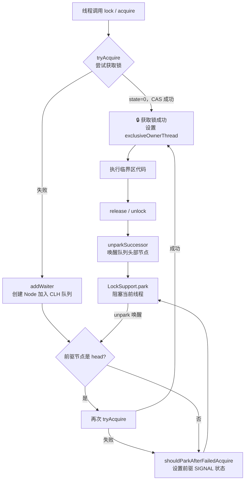
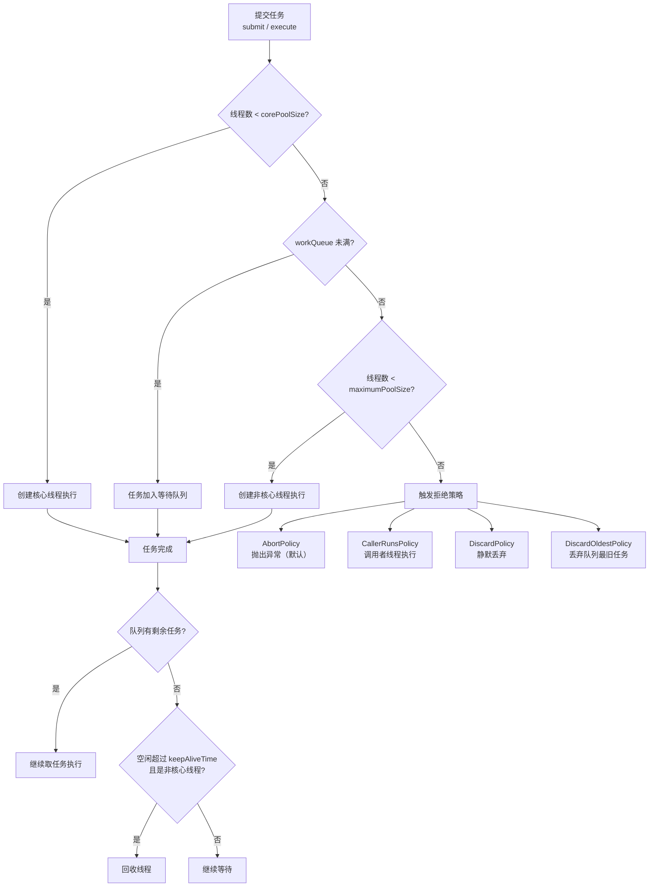
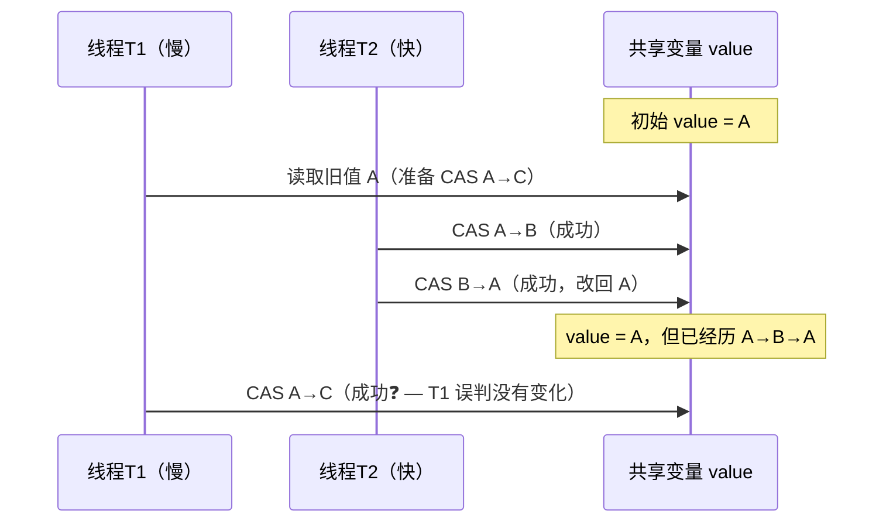
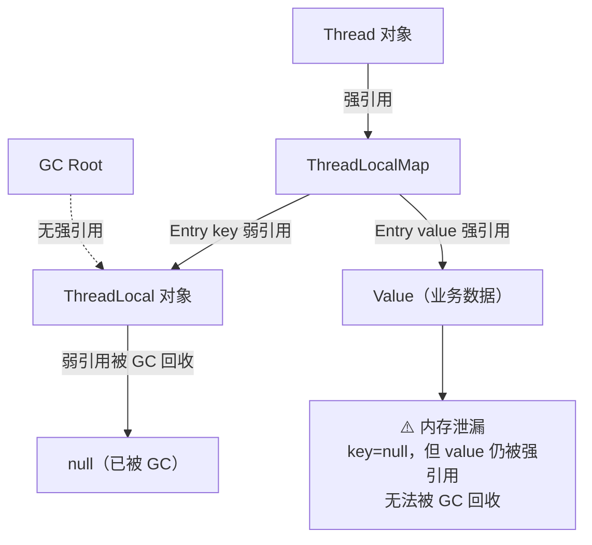

# Java 并发编程

<span class="dig-tag dig-tag--category">编程语言</span>
<span class="dig-tag dig-tag--hard">⭐⭐⭐ 高级</span>
<span class="dig-tag dig-tag--hot">🔥🔥🔥 高频</span>

::: tip 💡 核心要点
本页聚焦 synchronized/volatile 之外的并发进阶：线程池的七个参数与执行流程、AQS 的核心机制、CAS 与原子类、ThreadLocal 的内存泄漏风险，以及并发容器与 CompletableFuture 的使用场景。
:::

## 概念

**并发（Concurrency）vs 并行（Parallelism）：** 并发是多个任务在一段时间内交替执行（单核可实现），并行是多个任务在同一时刻同时执行（需要多核）。

**线程安全的三要素：**
- **原子性：** 操作不可被中断，要么全做，要么不做（`synchronized`、`AtomicInteger`）
- **可见性：** 一个线程的修改对其他线程立即可见（`volatile`、`synchronized`）
- **有序性：** 程序执行顺序与代码顺序一致（`volatile` 禁止指令重排）

**JMM（Java 内存模型）：** 规定所有变量存储在主内存，每个线程有自己的工作内存（缓存），线程只操作工作内存，写回主内存时才对其他线程可见。

**happens-before 原则：** JMM 保证以下操作具有可见性保证：程序顺序规则、监视器锁规则（解锁 happens-before 后续加锁）、volatile 变量规则、线程启动/终止规则。

## 核心原理

### 线程池（ThreadPoolExecutor）

#### 7 个核心参数

```java
new ThreadPoolExecutor(
    int corePoolSize,         // 1. 核心线程数，即使空闲也不销毁
    int maximumPoolSize,      // 2. 最大线程数（核心线程 + 非核心线程上限）
    long keepAliveTime,       // 3. 非核心线程空闲存活时间
    TimeUnit unit,            // 4. keepAliveTime 的时间单位
    BlockingQueue<Runnable> workQueue,    // 5. 任务等待队列
    ThreadFactory threadFactory,         // 6. 创建线程的工厂（可自定义线程名）
    RejectedExecutionHandler handler     // 7. 拒绝策略（队列满且线程数已达最大时触发）
);
```

#### 执行流程

```
提交任务
    │
    ▼
当前线程数 < corePoolSize？
    │ YES → 创建核心线程直接执行
    │ NO
    ▼
workQueue 未满？
    │ YES → 任务入队等待
    │ NO
    ▼
当前线程数 < maximumPoolSize？
    │ YES → 创建非核心线程执行
    │ NO
    ▼
执行拒绝策略（RejectedExecutionHandler）
```

#### 4 种拒绝策略

| 策略 | 行为 | 适用场景 |
|------|------|---------|
| `AbortPolicy`（默认） | 抛出 `RejectedExecutionException` | 需要感知拒绝的场景 |
| `CallerRunsPolicy` | 由提交任务的线程自己执行 | 减缓提交速度，不丢任务 |
| `DiscardPolicy` | 静默丢弃新任务 | 允许丢任务、不关心结果 |
| `DiscardOldestPolicy` | 丢弃队列中最老的任务，再尝试提交 | 希望优先保留新任务 |

#### 为什么不推荐 Executors 工厂方法？

```java
// 危险！workQueue 是无界的 LinkedBlockingQueue（容量 Integer.MAX_VALUE）
// 大量任务堆积 → OOM
ExecutorService pool1 = Executors.newFixedThreadPool(10);

// 危险！maximumPoolSize 是 Integer.MAX_VALUE
// 瞬间创建大量线程 → OOM
ExecutorService pool2 = Executors.newCachedThreadPool();

// 推荐：手动创建，明确每个参数
ExecutorService pool = new ThreadPoolExecutor(
    4, 8,
    60L, TimeUnit.SECONDS,
    new ArrayBlockingQueue<>(200),  // 有界队列
    new ThreadFactoryBuilder().setNameFormat("biz-pool-%d").build(),
    new ThreadPoolExecutor.CallerRunsPolicy()
);
```

---

### AQS（AbstractQueuedSynchronizer）

AQS 是 JDK 并发框架的底层基石，`ReentrantLock`、`Semaphore`、`CountDownLatch`、`ReadWriteLock` 均基于它实现。

#### 核心思想

```
AQS 内部维护两个核心结构：

1. int state（volatile）
   - ReentrantLock：0=未锁，>0=重入次数
   - Semaphore：剩余许可数
   - CountDownLatch：剩余计数

2. CLH 等待队列（双向链表）
   HEAD → Node(Thread-A) ↔ Node(Thread-B) ↔ Node(Thread-C) → TAIL
          （持有锁/已出队）     （等待）          （等待）
```

#### 独占模式 vs 共享模式

| 模式 | 代表实现 | 描述 |
|------|---------|------|
| **独占模式** | `ReentrantLock` | 同一时刻只允许一个线程持有 |
| **共享模式** | `Semaphore`、`CountDownLatch` | 允许多个线程同时持有 |

#### ReentrantLock 加锁流程（独占模式）

```java
// 简化示意：非公平锁 lock() 的核心逻辑
protected final boolean tryAcquire(int acquires) {
    final Thread current = Thread.currentThread();
    int c = getState();
    if (c == 0) {
        // CAS 尝试将 state 从 0 改为 1
        if (compareAndSetState(0, acquires)) {
            setExclusiveOwnerThread(current);
            return true;
        }
    } else if (current == getExclusiveOwnerThread()) {
        // 重入：state 累加
        setState(c + acquires);
        return true;
    }
    // 失败 → 进入 CLH 队列挂起等待
    return false;
}
```

---

### CAS（Compare-And-Swap）

#### 原理

CAS 是硬件级别的原子指令（x86 上是 `CMPXCHG`），JDK 通过 `Unsafe` 类暴露给 Java 层。

```java
// 语义等价于（但实际是一条不可分割的 CPU 指令）：
boolean compareAndSwap(Object obj, long offset, int expected, int update) {
    if (obj.field == expected) {  // 读当前值并比较
        obj.field = update;       // 相等则更新
        return true;
    }
    return false;                 // 不等则失败，调用方重试
}
```

#### ABA 问题

线程 1 读到 A，线程 2 将 A → B → A，线程 1 的 CAS 仍然成功，但中间发生了变化。

```java
// 解决方案：AtomicStampedReference（带版本号的引用）
AtomicStampedReference<Integer> ref = new AtomicStampedReference<>(100, 0);

// 获取当前值和版本号
int[] stampHolder = new int[1];
Integer value = ref.get(stampHolder);
int stamp = stampHolder[0];

// CAS 时同时比较值和版本号
ref.compareAndSet(value, 200, stamp, stamp + 1);
```

#### Atomic 类家族

| 类 | 说明 |
|----|------|
| `AtomicInteger` / `AtomicLong` | 单个整数的原子操作 |
| `AtomicReference<V>` | 任意对象的原子引用 |
| `AtomicStampedReference<V>` | 带版本号，解决 ABA |
| `LongAdder` | 高并发计数器，分段累加，最终汇总（比 AtomicLong 减少 CAS 竞争） |

```java
// LongAdder 在高并发下比 AtomicLong 性能更好
LongAdder counter = new LongAdder();
counter.increment();
long total = counter.sum(); // 汇总各分段
```

---

### ThreadLocal

#### 原理

每个 `Thread` 对象内部持有一个 `ThreadLocalMap`，以 `ThreadLocal` 实例为 key，存储线程私有的值。

```
Thread-A
  └── ThreadLocalMap
        ├── WeakRef(threadLocal1) → value1
        └── WeakRef(threadLocal2) → value2

Thread-B
  └── ThreadLocalMap
        └── WeakRef(threadLocal1) → value1（独立的副本）
```

```java
// 基本用法
ThreadLocal<String> userCtx = new ThreadLocal<>();

userCtx.set("user-123");        // 设置当前线程的值
String user = userCtx.get();    // 获取当前线程的值
userCtx.remove();               // 用完必须 remove！
```

#### 内存泄漏风险

`ThreadLocalMap` 的 key 是 `ThreadLocal` 的**弱引用**，value 是**强引用**：

```
ThreadLocalMap Entry:
  key   → WeakReference(ThreadLocal 实例)   ← 若外部无强引用，GC 会回收 key（变成 null）
  value → 强引用（用户数据）                 ← key 为 null 后，value 永远无法被访问，但不会被 GC
```

**泄漏场景：** 使用线程池时，线程复用不销毁，ThreadLocalMap 长期存在。若忘记调用 `remove()`，key 被 GC 后 value 会一直留在内存中。

**最佳实践：**

```java
// 每次使用后在 finally 中 remove
try {
    userCtx.set(currentUser);
    doWork();
} finally {
    userCtx.remove(); // 防止内存泄漏和线程复用时数据串用
}
```

**使用场景：** 数据库连接（每个线程持有独立 Connection）、用户登录上下文（Spring Security 的 SecurityContextHolder）、MDC 日志追踪 ID。

::: warning ⚠️ 虚拟线程时代的 ThreadLocal 新考点（JDK 21+）

> 虚拟线程够轻量，一个进程可能同时存在数百万个，每个线程都背负一个 `ThreadLocalMap` 会造成：
> ① **内存爆炸**：100 万虚拟线程 × 每线程 1KB ThreadLocal 数据 = 1GB 额外开销；
> ② **语义变化**：传统线程池时代 "一线程贯穿多请求" 的模型在虚拟线程下变成 "一虚拟线程一请求"，ThreadLocal 的 "跨调用联动" 用法意义不大。
>
> **JDK 21 引入的替代品：ScopedValue（JEP 446 Preview / JEP 481 Second Preview）**——不可变、生命周期严格限定在一个 Lambda 范围内，定位虚拟线程的轻量最佳选择：
>
> ```java
> private static final ScopedValue<User> USER = ScopedValue.newInstance();
>
> ScopedValue.where(USER, currentUser).run(() -> {
>     // 范围内的代码可用 USER.get() 读取；退出后自动清理。
>     doWork();
> });
> // 优点：① 不可变→线程安全 ② 无需手动 remove（隐含清理） ③ 嵌套作用域天然支持
> ```
>
> **面试高频追问**：虚拟线程 + ThreadLocal 有什么问题？→ 答 **内存、语义、生命周期**三点，并提 `ScopedValue` 作为 JDK 21+ 推荐替代。

:::

---

### 并发容器

#### ConcurrentHashMap（JDK 8）

JDK 7 用 Segment 分段锁（16 个段），JDK 8 改为 **CAS + synchronized**，锁粒度降到单个数组桶：

```java
// put 核心逻辑（简化）
if (桶为空) {
    CAS 方式插入节点；           // 无锁竞争时零开销
} else {
    synchronized (桶头节点) {    // 只锁单个桶，其他桶并发不受影响
        插入链表或红黑树；
    }
}
```

**与 HashMap 的区别：** 线程安全；不允许 null key/value；`size()` 返回近似值（并发下精确计数成本高）。

#### CopyOnWriteArrayList

写时复制：每次修改（add/remove/set）都复制整个底层数组，写完后替换引用。

```java
// 读操作无锁，并发性能极高
// 写操作加锁 + 数组复制，适合读多写少
CopyOnWriteArrayList<String> list = new CopyOnWriteArrayList<>();
```

**缺点：** 大数组写操作内存开销大；读操作不保证实时一致性（读的是旧快照）。

#### BlockingQueue 家族

| 实现 | 特点 | 典型场景 |
|------|------|---------|
| `ArrayBlockingQueue` | 有界、基于数组、公平可选 | 线程池 workQueue，限流 |
| `LinkedBlockingQueue` | 可选有界（默认 `Integer.MAX_VALUE`）、基于链表 | `FixedThreadPool` 的默认队列（注意 OOM！） |
| `SynchronousQueue` | 容量为 0，每次 put 必须等 take | `CachedThreadPool` 的队列，任务直接移交 |
| `PriorityBlockingQueue` | 按优先级排序的无界队列 | 带优先级的任务调度 |
| `DelayQueue` | 元素到期才可取出 | 延迟任务、缓存过期 |

---

### CompletableFuture

`CompletableFuture` 是 JDK 8 引入的异步编排工具，解决了 `Future.get()` 阻塞和多任务协同的问题。

#### 异步编排

```java
// thenApply：串行转换（有返回值）
CompletableFuture<String> future = CompletableFuture
    .supplyAsync(() -> fetchUserId())           // 异步获取用户 ID
    .thenApply(id -> fetchUserName(id))         // 用 ID 查名字（串行）
    .thenApply(name -> "Hello, " + name);       // 拼接字符串

// thenCompose：串行，下一步也是 CompletableFuture（防止嵌套）
CompletableFuture<String> future2 = CompletableFuture
    .supplyAsync(() -> fetchUserId())
    .thenCompose(id -> CompletableFuture.supplyAsync(() -> fetchUserName(id)));

// thenCombine：并行合并两个独立任务的结果
CompletableFuture<Integer> priceF = CompletableFuture.supplyAsync(() -> getPrice());
CompletableFuture<Integer> stockF = CompletableFuture.supplyAsync(() -> getStock());
CompletableFuture<String> result = priceF.thenCombine(stockF,
    (price, stock) -> "价格: " + price + ", 库存: " + stock);

// allOf：等待所有任务完成
CompletableFuture.allOf(priceF, stockF).join();
```

#### 异常处理

```java
CompletableFuture<String> future = CompletableFuture
    .supplyAsync(() -> {
        if (Math.random() > 0.5) throw new RuntimeException("失败");
        return "成功";
    })
    // exceptionally：发生异常时返回默认值（只处理异常）
    .exceptionally(ex -> "降级结果: " + ex.getMessage())
    // handle：无论成功失败都执行（类似 finally，可访问结果和异常）
    .handle((result, ex) -> {
        if (ex != null) return "处理异常: " + ex.getMessage();
        return result;
    });
```

**注意：** 默认使用 `ForkJoinPool.commonPool()`，生产环境建议传入自定义线程池，避免影响其他任务。

---

## 现代并发工具与高性能模式

JDK 8 之后引入了一系列**针对高并发场景的专用工具**，能在特定场景下把性能再压榨一个数量级。2025-2026 年大厂 Java 面试中**"AtomicLong 不够用怎么办"、"读多写少用什么锁"、"为什么 Disruptor 比 BlockingQueue 快"** 是高频追问。

### LongAdder 原理：分段累加的设计

`LongAdder`（JDK 8）是 `AtomicLong` 的高并发替代品。在 64 核机器上**计数性能可比 AtomicLong 高 5-10 倍**。

#### 为什么 AtomicLong 在高并发下会慢

```
所有线程都 CAS 同一个 long 变量
        ↓
高并发下大量 CAS 失败 → 重试自旋 → CPU 空转
        ↓
吞吐量 / 核数曲线变成"先上升后下降"
```

#### LongAdder 的解法：分段+按需扩容

```
AtomicLong（单点竞争）:
  Thread1 ↘
  Thread2 → [base]      ← 所有线程争一个变量
  Thread3 ↗

LongAdder（分段写入 + 求和读取）:
  Thread1 → [Cell 0]
  Thread2 → [Cell 1]    ← 不同线程落到不同 Cell（按哈希）
  Thread3 → [Cell 2]    ← 完全无竞争
  ...
  sum() = base + Σ Cell  ← 读取时再求和
```

#### 关键源码思想

```java
public void add(long x) {
    Cell[] as; long b, v; int m; Cell a;
    if ((as = cells) != null || !casBase(b = base, b + x)) {
        // base 上 CAS 失败 → 走 Cell 数组
        boolean uncontended = true;
        if (as == null
            || (m = as.length - 1) < 0
            || (a = as[getProbe() & m]) == null   // 按线程哈希定位 Cell
            || !(uncontended = a.cas(v = a.value, v + x))) {
            longAccumulate(x, null, uncontended); // 扩容 Cell 数组
        }
    }
}
```

#### 何时**不**用 LongAdder

| 场景 | 选什么 |
|------|------|
| 低并发计数 | `AtomicLong` 内存占用更小（1 个 long）|
| **需要"读后立即更新"原子操作** | `AtomicLong`（`incrementAndGet()` 返回新值）|
| 高并发只写、读少 | **LongAdder 首选** |

::: tip 💡 一句话辨析

> **"AtomicLong 是单点 CAS，所有线程争同一个变量；LongAdder 是分段写、汇总读，把竞争分散到多个 Cell。但 LongAdder 的 sum() 不是强一致的——读取瞬间可能不等于真实值，所以不能用于"读后立即决策"的场景。"**

:::

### StampedLock：读多写少的乐观读神器

`StampedLock`（JDK 8）是为**读极多、写极少**场景优化的锁。相比 `ReentrantReadWriteLock` 提供**乐观读模式**——读时不上锁，写完后再验证。

#### 三种模式

```java
StampedLock lock = new StampedLock();

// 1. 写锁（独占）
long stamp = lock.writeLock();
try { /* 写操作 */ }
finally { lock.unlockWrite(stamp); }

// 2. 悲观读锁（共享）
long stamp = lock.readLock();
try { /* 读操作 */ }
finally { lock.unlockRead(stamp); }

// 3. 乐观读（无锁！只标记一个 stamp）
long stamp = lock.tryOptimisticRead();
int currentX = x, currentY = y;          // 不上锁直接读
if (!lock.validate(stamp)) {              // 验证读期间是否有写
    stamp = lock.readLock();              // 失败回退到悲观读
    try { currentX = x; currentY = y; }
    finally { lock.unlockRead(stamp); }
}
```

#### 三种锁对比

| 维度 | `synchronized` | `ReentrantReadWriteLock` | **`StampedLock`** |
|------|---------------|------------------------|-----------------|
| **读读并发** | ❌ | ✅ | ✅ |
| **乐观读（无锁）** | ❌ | ❌ | **✅** |
| **可重入** | ✅ | ✅ | ❌（陷阱！）|
| **可中断** | ❌ | ✅ | ✅ |
| **条件变量** | ✅ | ✅ | ❌ |
| **适用** | 简单同步 | 读多写少 | **读极多 + 短写**（如配置/路由表）|

::: warning ⚠️ StampedLock 三大坑

1. **不可重入**——同一线程二次获取会死锁
2. **不支持 Condition** —— 不能做经典的"等待-通知"
3. **乐观读期间读到的字段可能被部分修改** —— 必须用 final / volatile 保护

:::

### 生产者-消费者模式（Producer-Consumer）

最经典的**并发解耦模式**：生产者只造数据、消费者只处理数据，中间通过**有界队列**隔开，两边速度不一致由队列吸收。Java 的线程池、Reactor 事件循环、Kafka 消费者，本质都是这个模式的不同形态。

#### 模型与三要素

```
┌──────────┐   put()    ┌─────────────┐   take()   ┌──────────┐
│ Producer │ ────────▶ │  Buffer     │ ────────▶ │ Consumer │
│  (N 个)  │  满则阻塞  │ (有界队列)  │  空则阻塞  │  (M 个)  │
└──────────┘            └─────────────┘            └──────────┘
```

| 角色 | 职责 | 阻塞条件 |
|------|------|---------|
| **生产者** | 生成任务放进队列 | 队列**满** → 阻塞 / 丢弃 / 降级 |
| **缓冲区** | 线程安全的有界容器 | — |
| **消费者** | 从队列取任务处理 | 队列**空** → 阻塞 |

**为什么必须有界？** 无界队列 = 没有背压，生产者一旦快于消费者就会堆积到 OOM（`Executors.newFixedThreadPool` 的著名陷阱）。

#### Java 三种实现

**① BlockingQueue（首选）**

```java
BlockingQueue<Task> queue = new ArrayBlockingQueue<>(1000);

// 生产者
Runnable producer = () -> {
    while (running) {
        Task t = produce();
        queue.put(t);                                // 满则阻塞
        // 或 queue.offer(t, 100, MILLISECONDS);     // 带超时
    }
};

// 消费者
Runnable consumer = () -> {
    while (running) {
        try {
            Task t = queue.take();                   // 空则阻塞
            consume(t);
        } catch (InterruptedException e) {
            Thread.currentThread().interrupt();
            break;
        }
    }
};
```

**② BlockingQueue 选型**

| 实现 | 特点 | 适用 |
|------|------|------|
| `ArrayBlockingQueue` | 数组、有界、单锁、可选公平 | **生产首选** |
| `LinkedBlockingQueue` | 链表、双锁（put/take 分离）、**默认无界** | 吞吐高，但**容量必须显式传** |
| `SynchronousQueue` | 容量 0，直接交接 | `newCachedThreadPool` 底层 |
| `LinkedTransferQueue` | `transfer()` 等消费者拿走才返回 | 极致低延迟 |
| `PriorityBlockingQueue` | 堆排序、**无界** | 任务有优先级 |
| `DelayQueue` | 元素到期才能取出 | 定时任务、缓存过期 |

**③ Lock + Condition（手写，面试题原型）**

```java
public class BoundedBuffer<T> {
    private final Object[] items;
    private int putIdx, takeIdx, count;
    private final ReentrantLock lock = new ReentrantLock();
    private final Condition notFull  = lock.newCondition();
    private final Condition notEmpty = lock.newCondition();

    public BoundedBuffer(int cap) { items = new Object[cap]; }

    public void put(T x) throws InterruptedException {
        lock.lock();
        try {
            while (count == items.length) notFull.await();   // while 防虚假唤醒
            items[putIdx] = x;
            putIdx = (putIdx + 1) % items.length;
            count++;
            notEmpty.signal();                                // 只唤醒消费者
        } finally { lock.unlock(); }
    }

    @SuppressWarnings("unchecked")
    public T take() throws InterruptedException {
        lock.lock();
        try {
            while (count == 0) notEmpty.await();
            T x = (T) items[takeIdx];
            items[takeIdx] = null;
            takeIdx = (takeIdx + 1) % items.length;
            count--;
            notFull.signal();
            return x;
        } finally { lock.unlock(); }
    }
}
```

::: warning 手写题 4 大易错点
1. `await()` 必须用 **`while` 而不是 `if`** —— 防虚假唤醒（spurious wakeup）
2. 用**两个独立 Condition**（notFull / notEmpty）—— 一个 Condition + `signalAll()` 会有惊群
3. **业务处理放在锁外** —— 临界区只保留入队/出队，缩短持锁时间
4. 释放锁必须放 `finally` —— 否则异常时永久占锁
:::

#### 工程化关键点

| 维度 | 方案 |
|------|------|
| **优雅关闭** | 毒丸（Poison Pill）/ `interrupt()` + 检查标志 / `ExecutorService.shutdown()` |
| **背压策略** | 4 种线程池拒绝策略：Abort / CallerRuns / Discard / DiscardOldest |
| **批量消费** | `queue.drainTo(buffer, 100)` 一次取多条，**减少锁竞争 10×+** |
| **监控指标** | 队列长度、入队/出队 TPS、阻塞次数、平均等待时间 |
| **持久化版本** | Kafka / RocketMQ —— 跨进程、跨机器的"分布式生产者-消费者" |

::: tip 一句话本质
**Java 线程池就是生产者-消费者**：`submit()` 是生产，Worker 线程是消费者，`workQueue` 是缓冲区，拒绝策略就是队列满的降级方案。
:::

### Disruptor：单机百万 TPS 的无锁队列

LMAX Disruptor 是 2010 年开源的**高性能内存队列**，性能比 `BlockingQueue` 高 10-100 倍。**Log4j 2、Apache Storm、Spring Cloud Stream** 都在底层使用它。

#### 为什么比 BlockingQueue 快

| 痛点（BlockingQueue）| Disruptor 怎么解 |
|-----------------|--------------|
| ReentrantLock 锁竞争 | **CAS + 内存屏障**，完全无锁 |
| 链表节点频繁分配/GC | **预分配环形数组（Ring Buffer）** |
| 多线程访问共享变量导致 **伪共享（False Sharing）** | **Cache Line Padding** 强制对齐 64 字节 |
| 生产者/消费者通过 head/tail 双指针 → 缓存乒乓 | **Sequence 单调递增**，独立缓存行 |

#### Ring Buffer 核心结构

```
       producer
          ↓
   ┌───┬───┬───┬───┬───┬───┬───┬───┐
   │ 0 │ 1 │ 2 │ 3 │ 4 │ 5 │ 6 │ 7 │  ← 预分配的固定大小数组（2^n）
   └───┴───┴───┴───┴───┴───┴───┴───┘
                ↑              ↑
            consumer 1     consumer 2
```

- **数组替代链表**：CPU 缓存友好（顺序访问）+ 零 GC 压力
- **2 的幂次取模**：`index = sequence & (size - 1)`，比 `%` 快 10×
- **多消费者依赖图**：Consumer B 可以等 Consumer A 处理完同一事件再处理

#### 最小示例

```java
// 1. 定义事件
public static class LongEvent { private long value; /* ... */ }

// 2. 创建 Disruptor
Disruptor<LongEvent> disruptor = new Disruptor<>(
    LongEvent::new, 1024,           // 工厂 + 环形大小
    DaemonThreadFactory.INSTANCE,
    ProducerType.SINGLE,            // 单/多生产者
    new BusySpinWaitStrategy()      // 等待策略
);

// 3. 注册消费者
disruptor.handleEventsWith((event, sequence, endOfBatch) -> {
    System.out.println("Received: " + event.getValue());
});

// 4. 启动 + 生产
disruptor.start();
RingBuffer<LongEvent> ringBuffer = disruptor.getRingBuffer();
long seq = ringBuffer.next();
try {
    ringBuffer.get(seq).setValue(123L);
} finally {
    ringBuffer.publish(seq);
}
```

#### 何时选 Disruptor

| 场景 | 推荐 |
|------|------|
| **单 JVM 内、极致低延迟** | Disruptor（金融交易、日志、游戏循环）|
| **跨进程 / 跨机器** | Kafka / RocketMQ（持久化 + 网络）|
| **简单线程间通信** | `BlockingQueue`（实现简单、足够好）|
| **响应式编程** | Reactor / RxJava |

### Caffeine：现代 JVM 缓存事实标准

Caffeine（JDK 8+，Spring Boot 2 起默认本地缓存）已经全面替代 Guava Cache。**核心改进是 W-TinyLFU 淘汰算法**，命中率比 LRU 高 10-30%。

#### W-TinyLFU 一句话原理

```
传统 LRU: 只看"最近用过"
  → 偶发的批量扫描会冲掉热点
  
W-TinyLFU: 看"最近 + 频率"
  ├── Window LRU（1%）：保护新进来的"未来可能成为热点"
  └── Main Cache（99%）：基于近似计数（Count-Min Sketch）的 LFU
  → 抗扫描污染、命中率高
```

#### 关键能力对比

| 维度 | Guava Cache | **Caffeine** |
|------|------------|------------|
| **淘汰算法** | LRU | **W-TinyLFU**（命中率高 10-30%）|
| **异步加载** | ❌ | ✅（`asyncLoadAll`）|
| **刷新策略** | refreshAfterWrite | **refreshAfterWrite + 后台 refresh** |
| **统计** | 简单 | 完整 + 低开销 |
| **基准 QPS** | 1× | **3-5×** |
| **生产推荐** | 已不推荐 | **首选** |

#### Spring Boot 一键接入

```java
@Configuration
@EnableCaching
public class CacheConfig {
    @Bean
    public CacheManager cacheManager() {
        CaffeineCacheManager mgr = new CaffeineCacheManager("users");
        mgr.setCaffeine(Caffeine.newBuilder()
            .maximumSize(10_000)
            .expireAfterWrite(Duration.ofMinutes(10))
            .refreshAfterWrite(Duration.ofMinutes(5))   // 5 分钟后后台刷新
            .recordStats());
        return mgr;
    }
}

@Service
public class UserService {
    @Cacheable(value = "users", key = "#id")
    public User findUser(Long id) {
        return userRepository.findById(id);
    }
}
```

#### Caffeine + Redis 二级缓存（生产黄金组合）

```
请求 → Caffeine（本地，纳秒级，10K QPS/节点）
        ↓ miss
       Redis（中心，毫秒级，跨节点共享）
        ↓ miss
       DB
```

详见 [缓存策略 — L1/L2 分层缓存](../system-design/caching-strategies)。

### ForkJoinPool：CPU 密集型并行计算

`ForkJoinPool` 是 JDK 7 引入的"分治并行"线程池，**`parallelStream()` 和 `CompletableFuture` 默认线程池**都是它（`commonPool`）。

#### 工作窃取（Work-Stealing）核心思想

```
线程 1 的任务队列: [T1, T2, T3, T4]    （从队尾 push/pop，LIFO）
线程 2 的任务队列: [T5, T6]             （处理完了）
                        ↓
线程 2 从线程 1 的队头偷一个: 偷走 T1
                        ↓
减少了线程闲置，比传统 ThreadPool 利用率高
```

#### vs ThreadPoolExecutor

| 维度 | `ThreadPoolExecutor` | `ForkJoinPool` |
|------|---------------------|---------------|
| **任务队列** | 一个全局队列 | **每个线程独立队列 + 工作窃取** |
| **适用任务** | I/O 密集、独立任务 | **CPU 密集、可分治的任务** |
| **任务粒度** | 中等 | 越细越好（递归分治）|
| **典型场景** | Web 请求处理 | 大数组计算、归并排序、AI 推理 |

#### parallelStream 的陷阱

```java
// ❌ 错误：用 commonPool 跑慢的 I/O，会拖累整个 JVM
list.parallelStream().forEach(this::callRemoteApi);

// ✅ 正确：传入独立 ForkJoinPool
ForkJoinPool customPool = new ForkJoinPool(20);
customPool.submit(() -> list.parallelStream().forEach(this::callRemoteApi)).get();
```

`commonPool` 是**全 JVM 共享**的，被你的慢任务占满后，其他依赖它的代码（包括 `CompletableFuture`、`parallelStream`）全部受影响。

### VarHandle / Atomic 家族对比（JDK 9+）

`VarHandle` 是 JDK 9 的"`sun.misc.Unsafe` 的官方替代"，提供**字段级别的原子操作 + 内存屏障控制**。

```java
// 替代 AtomicReferenceFieldUpdater + Unsafe 的现代方案
private static final VarHandle VALUE_HANDLE;
private volatile long value;
static {
    try {
        VALUE_HANDLE = MethodHandles.lookup()
            .findVarHandle(MyClass.class, "value", long.class);
    } catch (ReflectiveOperationException e) { throw new Error(e); }
}

// 多种内存语义
VALUE_HANDLE.compareAndSet(this, 0L, 1L);          // CAS
VALUE_HANDLE.getAndAdd(this, 5L);                  // 原子加
VALUE_HANDLE.setRelease(this, 10L);                // Release 语义
long v = (long) VALUE_HANDLE.getAcquire(this);     // Acquire 语义
```

**何时用 VarHandle**：库作者、需要细粒度内存语义控制。**应用层用 `AtomicXxx` / `LongAdder` 即可**。

### 限流器：从 Guava RateLimiter 到分布式令牌桶

限流是高并发系统的标配防线。Java 单机方案首选 Guava `RateLimiter`（令牌桶），多实例部署必须升级到 **Redis + Lua 的分布式令牌桶**才能跨节点共享状态。

#### 四大算法心智模型

| 算法 | 一句话 | 突发流量 | 平滑度 | 实现复杂度 |
|------|--------|---------|--------|-----------|
| **计数器（固定窗口）** | 每秒清零计数 | 容许 | ❌ 边界双倍流量 | ⭐ |
| **滑动窗口** | 用环形数组细分小窗口 | 部分 | ✅ | ⭐⭐ |
| **漏桶（Leaky Bucket）** | 出口恒定速率，水太多就溢出 | ❌ 严格匀速 | ✅✅ | ⭐⭐ |
| **令牌桶（Token Bucket）** | 桶里攒令牌，请求扣令牌 | ✅ 允许突发 | ✅ | ⭐⭐ |

**业务首选令牌桶** —— 既能限平均速率，又允许短时突发（攒着的令牌可一次性消费）。

#### 单机：Guava RateLimiter（令牌桶）

```java
// 每秒 100 个令牌，允许预热 1 秒（SmoothWarmingUp 慢启动防冷启动雪崩）
RateLimiter limiter = RateLimiter.create(100, 1, TimeUnit.SECONDS);

if (limiter.tryAcquire(1, 50, TimeUnit.MILLISECONDS)) {
    handleRequest();              // 50ms 内拿到令牌 → 放行
} else {
    rejectFastFail();             // 拿不到 → 立即拒绝
}
```

**两种模式**：
- `SmoothBursty`（默认）—— 允许突发，桶最多攒 `permitsPerSecond` 个令牌
- `SmoothWarmingUp` —— 慢启动，冷却后速率从低到高线性增长，**防数据库刚启动被打挂**

::: warning Guava RateLimiter 的硬伤
1. **仅单机**：8 个实例 × 100 QPS = 实际 800 QPS，与目标偏差 8 倍
2. **不能动态调整阈值**：改值要重启
3. **不支持分布式协同**：跨节点不感知
:::

#### 分布式：Redis + Lua 手写令牌桶（面试高频手写题）

**核心思路**：把"桶状态（剩余令牌数 + 上次补令牌时间）"放 Redis Hash，每次请求用 **Lua 脚本** 原子地完成"惰性补令牌 + 扣减 + 写回"。

```lua
-- KEYS[1] = bucket:userId
-- ARGV   = capacity, rate(每秒令牌), now_ms, requested
local capacity  = tonumber(ARGV[1])
local rate      = tonumber(ARGV[2])
local now       = tonumber(ARGV[3])
local requested = tonumber(ARGV[4])

local data = redis.call('HMGET', KEYS[1], 'tokens', 'ts')
local tokens = tonumber(data[1]) or capacity
local lastTs = tonumber(data[2]) or now

-- 惰性补令牌（不开后台线程）
local delta = math.max(0, now - lastTs) * rate / 1000
tokens = math.min(capacity, tokens + delta)

local allowed = 0
if tokens >= requested then
    tokens = tokens - requested
    allowed = 1
end

redis.call('HMSET', KEYS[1], 'tokens', tokens, 'ts', now)
redis.call('PEXPIRE', KEYS[1], 60000)
return allowed
```

**Java 调用端**：

```java
@Component
public class DistributedRateLimiter {
    private final StringRedisTemplate redis;
    private final DefaultRedisScript<Long> script;          // 加载上面的 Lua

    public boolean tryAcquire(String key, int capacity, int rate, int permits) {
        Long ok = redis.execute(script,
            List.of("bucket:" + key),
            String.valueOf(capacity),
            String.valueOf(rate),
            String.valueOf(System.currentTimeMillis()),
            String.valueOf(permits));
        return ok != null && ok == 1L;
    }
}
```

#### 关键设计点（面试加分）

| 维度 | 要点 |
|------|------|
| **原子性** | 必须 Lua —— `GET → 计算 → SET` 三步走会产生并发覆盖 |
| **时间源** | 用客户端 `now` 可能时钟漂移，用 Redis `TIME` 命令更稳但有 RTT |
| **惰性补令牌** | 不开后台定时任务 —— 用 `now - lastTs` 反推应补多少，省 CPU |
| **降级** | Redis 挂了 → 回退本地 Guava RateLimiter（双层防线） |
| **热 Key** | 同一 userId 打到同一槽 → **本地预扣 N 个 + 批量同步**（类 Sentinel cluster-flow） |
| **Cluster 模式** | Lua 涉及多 key 时必须 hash tag：`bucket:{userId}` |
| **生产替代** | **Redisson `RRateLimiter`** / **Sentinel 集群流控** / **Resilience4j RateLimiter** |

#### 生产框架对比

| 框架 | 算法 | 分布式 | 适用 |
|------|------|-------|------|
| **Guava RateLimiter** | 令牌桶 | ❌ | 单机限流、防自家爬虫 |
| **Bucket4j** | 令牌桶 | ✅（Hazelcast/Ignite/Redis） | 优雅 API、生产推荐 |
| **Redisson `RRateLimiter`** | 令牌桶 | ✅ | 已用 Redis 的项目 |
| **Sentinel** | 滑动窗口 + 令牌桶 + 漏桶 | ✅ 集群流控 | 阿里系、Spring Cloud Alibaba |
| **Resilience4j RateLimiter** | 信号量 + 时间窗口 | ❌（自己接 Redis） | 函数式风格、与 CircuitBreaker 同体系 |

::: tip 一句话答题
**"单机用 Guava，多实例必须 Redis+Lua 令牌桶；生产直接上 Sentinel / Bucket4j 别造轮子；时钟漂移和 Redis 宕机要有双层降级。"**
:::

### 选型速查（生产黄金一张表）

| 场景 | 选什么 |
|------|------|
| 高并发计数 | **LongAdder**（高并发） / AtomicLong（低并发）|
| 读极多 + 短写（配置/路由表） | **StampedLock** + 乐观读 |
| 读多写少（缓存等）| `ReentrantReadWriteLock` |
| 简单线程间通信 / 生产者-消费者 | **`ArrayBlockingQueue`**（有界、单锁、生产首选）|
| 极致单机消息队列 | **Disruptor** |
| 本地缓存 | **Caffeine**（替代 Guava）|
| CPU 密集分治计算 | **ForkJoinPool** + 自定义实例 |
| 库级原子字段 + 内存屏障 | **VarHandle**（替代 Unsafe）|
| 单机限流 | **Guava `RateLimiter`** / **Bucket4j** |
| 分布式限流 | **Redis + Lua 令牌桶** / **Sentinel** / **Redisson `RRateLimiter`** |
| 异步编排 | `CompletableFuture` / `StructuredTaskScope`（JDK 21+）|

---

## 面试常问 & 怎么答

<div class="dig-questions">
  <div class="dig-questions__header">
    <span>📝 面试真题</span>
    <span style="font-size: 12px; opacity: 0.8;">4 道高频</span>
  </div>
  <div class="dig-questions__item">
    <span>1. 线程池的核心参数有哪些？执行流程是什么？</span>
    <span class="dig-tag dig-tag--hard" style="margin: 0;">困难</span>
  </div>
  <div class="dig-questions__item">
    <span>2. AQS 是什么？ReentrantLock 怎么基于 AQS 实现的？</span>
    <span class="dig-tag dig-tag--hard" style="margin: 0;">困难</span>
  </div>
  <div class="dig-questions__item">
    <span>3. CAS 是什么？有什么问题？</span>
    <span class="dig-tag dig-tag--medium" style="margin: 0;">中等</span>
  </div>
  <div class="dig-questions__item">
    <span>4. ThreadLocal 原理？为什么会内存泄漏？</span>
    <span class="dig-tag dig-tag--medium" style="margin: 0;">中等</span>
  </div>
</div>

### Q1: 线程池的核心参数有哪些？执行流程是什么？

**7 个参数：** corePoolSize（核心线程数）、maximumPoolSize（最大线程数）、keepAliveTime + unit（非核心线程空闲存活时间）、workQueue（任务队列）、threadFactory（线程工厂）、handler（拒绝策略）。

**执行流程：**
1. 线程数 < corePoolSize → 创建核心线程直接执行
2. 队列未满 → 任务入队等待
3. 队列已满且线程数 < maximumPoolSize → 创建非核心线程执行
4. 全满 → 触发拒绝策略

**为什么不用 Executors？** `newFixedThreadPool` 用无界队列可能堆积任务导致 OOM；`newCachedThreadPool` 最大线程数无限制可能创建大量线程导致 OOM。

### Q2: AQS 是什么？ReentrantLock 怎么基于 AQS 实现的？

**AQS** 是 `AbstractQueuedSynchronizer`，并发工具类的底层框架，核心是：
- `volatile int state`：表示锁状态
- CLH 双向等待队列：存放等待线程

**ReentrantLock 的实现：**
- `lock()`：调用 `tryAcquire()`，用 CAS 将 state 从 0 改为 1；若 state > 0 且当前线程是持有者则重入（state 累加）；失败则进入 CLH 队列挂起
- `unlock()`：调用 `tryRelease()`，state 递减，减到 0 时唤醒队列头部线程

**公平锁 vs 非公平锁：** 公平锁 `tryAcquire()` 会先检查 CLH 队列是否有等待线程；非公平锁直接 CAS 抢锁，减少线程切换开销。

### Q3: CAS 是什么？有什么问题？

**CAS** 是 Compare-And-Swap，硬件级别的原子指令。读取当前值与期望值比较，相等才更新，失败则自旋重试。`AtomicInteger.incrementAndGet()` 底层就是 CAS 循环。

**三个问题：**
1. **ABA 问题：** 值从 A 改成 B 再改回 A，CAS 无法感知。解决：`AtomicStampedReference`（带版本号）
2. **自旋开销：** 竞争激烈时大量自旋 CPU 空转。解决：改用 `LongAdder`（分段累加，减少竞争）
3. **只能保证单个变量的原子性：** 多变量需要 `synchronized` 或 `AtomicReference` 封装对象

### Q4: ThreadLocal 原理？为什么会内存泄漏？

**原理：** 每个 `Thread` 对象持有一个 `ThreadLocalMap`，以 `ThreadLocal` 实例的弱引用为 key，以线程私有数据为 value。调用 `get()`/`set()` 都是在操作当前线程自己的 Map，线程间完全隔离。

**内存泄漏原因：**
- key 是弱引用，外部无强引用时 GC 会回收 ThreadLocal 对象，key 变为 null
- value 是强引用，key 为 null 后 value 永远无法被访问，也无法被 GC
- 线程池中线程长期存活，ThreadLocalMap 不销毁，泄漏持续积累

**解决方案：** 使用完毕后在 `finally` 块中调用 `threadLocal.remove()`，彻底清除 entry。

---

## 深度图解

### AQS 核心流程



**CLH 队列节点 waitStatus 含义：**

| 状态值 | 名称 | 含义 |
|--------|------|------|
| 0 | 初始 | 节点刚入队 |
| 1 | CANCELLED | 因超时或中断取消，需从队列移除 |
| -1 | SIGNAL | 后继节点需要被唤醒 |
| -2 | CONDITION | 节点在条件队列中等待 |
| -3 | PROPAGATE | 共享模式下需传播唤醒 |

---

### 线程池任务执行完整流程



---

### CAS 与 ABA 问题



**解决方案：AtomicStampedReference（版本戳）**

```java
AtomicStampedReference<String> ref = new AtomicStampedReference<>("A", 0);

// 线程T1读取值和版本
String oldVal = ref.getReference();  // "A"
int oldStamp = ref.getStamp();       // 0

// 线程T2执行 A→B→A，版本变为 2
// T1 再次 CAS，值相同但版本已变，失败
boolean ok = ref.compareAndSet("A", "C", 0, 1); // false，stamp 已是 2
```

---

### ThreadLocal 内存泄漏原理



**规避规则：** 使用完 ThreadLocal 后必须调用 `remove()`，尤其在线程池场景（线程复用，ThreadLocalMap 长期存活）。

---

## 看到什么就先想到这类

| 见到这个关键词 | 先想到 |
|-------------|------|
| 线程池、任务队列、拒绝、OOM | `ThreadPoolExecutor` 7 参数 + 有界队列 |
| 公平锁、可重入、条件变量 | `ReentrantLock` → AQS state + CLH 队列 |
| 并发计数、许可、倒计时 | `Semaphore`/`CountDownLatch` → AQS 共享模式 |
| 无锁、原子操作、自旋 | CAS → `AtomicXxx` / `LongAdder` |
| ABA、版本号 | `AtomicStampedReference` |
| 线程私有数据、用户上下文 | `ThreadLocal` → 记得 `remove()` |
| 高并发 Map | `ConcurrentHashMap`（CAS + 桶级 synchronized） |
| 读多写少、快照 | `CopyOnWriteArrayList` |
| 生产者-消费者 | `BlockingQueue`（`ArrayBlockingQueue` 有界） |
| 异步任务、回调、串并行编排 | `CompletableFuture` |
