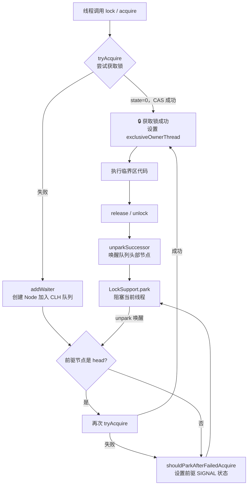
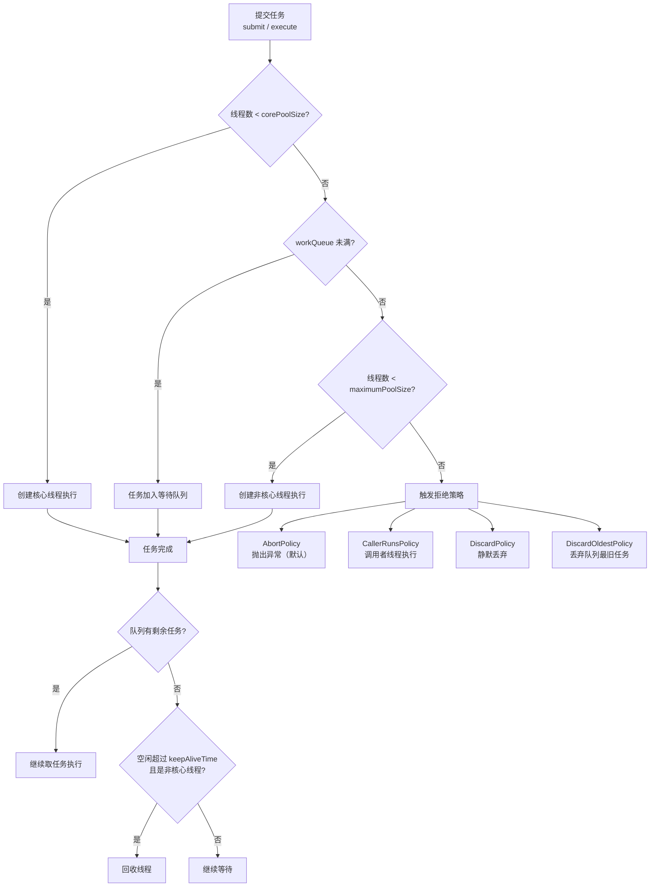
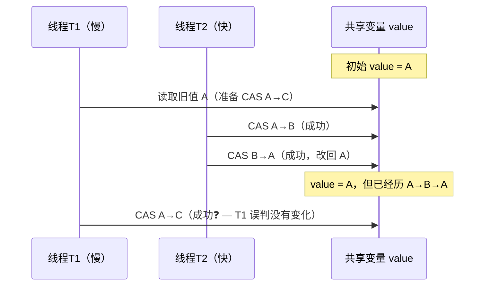
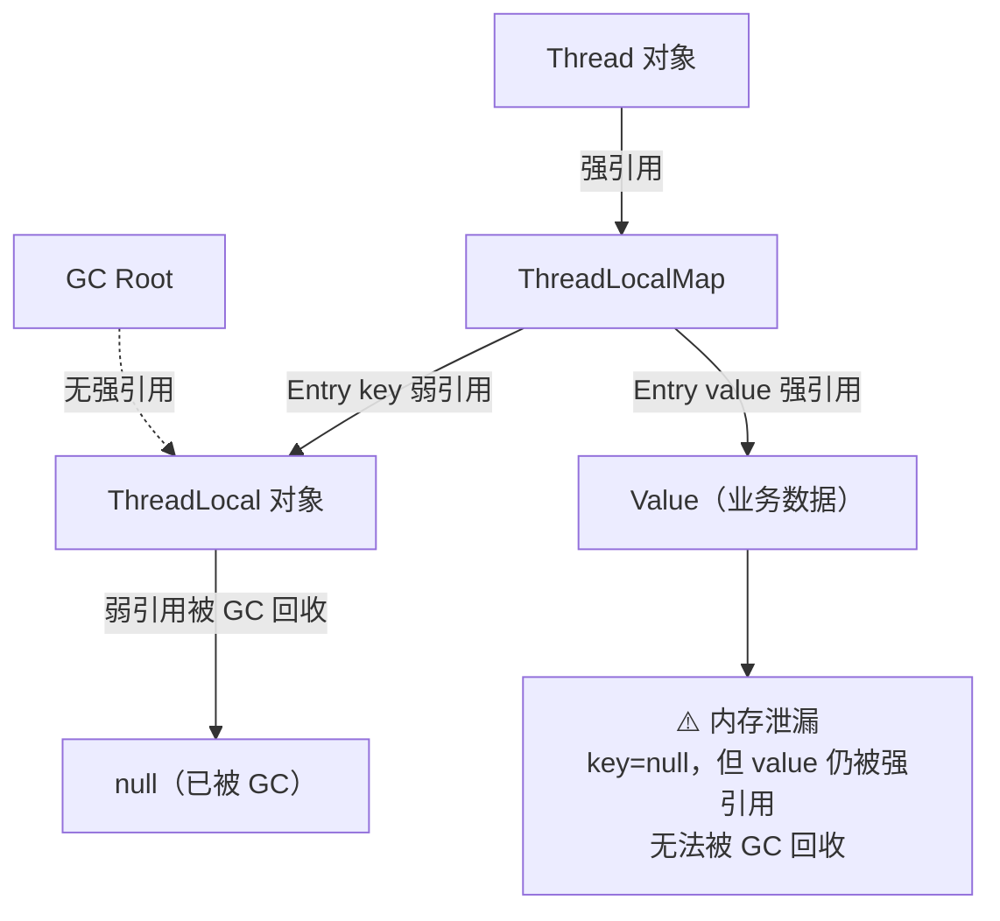

# Java 并发编程

<span class="dig-tag dig-tag--category">编程语言</span>
<span class="dig-tag dig-tag--hard">⭐⭐⭐ 高级</span>
<span class="dig-tag dig-tag--hot">🔥🔥🔥 高频</span>

::: tip 💡 核心要点
本页聚焦 synchronized/volatile 之外的并发进阶：线程池的七个参数与执行流程、AQS 的核心机制、CAS 与原子类、ThreadLocal 的内存泄漏风险，以及并发容器与 CompletableFuture 的使用场景。
:::

## 概念

**并发（Concurrency）vs 并行（Parallelism）：** 并发是多个任务在一段时间内交替执行（单核可实现），并行是多个任务在同一时刻同时执行（需要多核）。

**线程安全的三要素：**
- **原子性：** 操作不可被中断，要么全做，要么不做（`synchronized`、`AtomicInteger`）
- **可见性：** 一个线程的修改对其他线程立即可见（`volatile`、`synchronized`）
- **有序性：** 程序执行顺序与代码顺序一致（`volatile` 禁止指令重排）

**JMM（Java 内存模型）：** 规定所有变量存储在主内存，每个线程有自己的工作内存（缓存），线程只操作工作内存，写回主内存时才对其他线程可见。

**happens-before 原则：** JMM 保证以下操作具有可见性保证：程序顺序规则、监视器锁规则（解锁 happens-before 后续加锁）、volatile 变量规则、线程启动/终止规则。

## 核心原理

### 线程池（ThreadPoolExecutor）

#### 7 个核心参数

```java
new ThreadPoolExecutor(
    int corePoolSize,         // 1. 核心线程数，即使空闲也不销毁
    int maximumPoolSize,      // 2. 最大线程数（核心线程 + 非核心线程上限）
    long keepAliveTime,       // 3. 非核心线程空闲存活时间
    TimeUnit unit,            // 4. keepAliveTime 的时间单位
    BlockingQueue<Runnable> workQueue,    // 5. 任务等待队列
    ThreadFactory threadFactory,         // 6. 创建线程的工厂（可自定义线程名）
    RejectedExecutionHandler handler     // 7. 拒绝策略（队列满且线程数已达最大时触发）
);
```

#### 执行流程

```
提交任务
    │
    ▼
当前线程数 < corePoolSize？
    │ YES → 创建核心线程直接执行
    │ NO
    ▼
workQueue 未满？
    │ YES → 任务入队等待
    │ NO
    ▼
当前线程数 < maximumPoolSize？
    │ YES → 创建非核心线程执行
    │ NO
    ▼
执行拒绝策略（RejectedExecutionHandler）
```

#### 4 种拒绝策略

| 策略 | 行为 | 适用场景 |
|------|------|---------|
| `AbortPolicy`（默认） | 抛出 `RejectedExecutionException` | 需要感知拒绝的场景 |
| `CallerRunsPolicy` | 由提交任务的线程自己执行 | 减缓提交速度，不丢任务 |
| `DiscardPolicy` | 静默丢弃新任务 | 允许丢任务、不关心结果 |
| `DiscardOldestPolicy` | 丢弃队列中最老的任务，再尝试提交 | 希望优先保留新任务 |

#### 为什么不推荐 Executors 工厂方法？

```java
// 危险！workQueue 是无界的 LinkedBlockingQueue（容量 Integer.MAX_VALUE）
// 大量任务堆积 → OOM
ExecutorService pool1 = Executors.newFixedThreadPool(10);

// 危险！maximumPoolSize 是 Integer.MAX_VALUE
// 瞬间创建大量线程 → OOM
ExecutorService pool2 = Executors.newCachedThreadPool();

// 推荐：手动创建，明确每个参数
ExecutorService pool = new ThreadPoolExecutor(
    4, 8,
    60L, TimeUnit.SECONDS,
    new ArrayBlockingQueue<>(200),  // 有界队列
    new ThreadFactoryBuilder().setNameFormat("biz-pool-%d").build(),
    new ThreadPoolExecutor.CallerRunsPolicy()
);
```

---

### AQS（AbstractQueuedSynchronizer）

AQS 是 JDK 并发框架的底层基石，`ReentrantLock`、`Semaphore`、`CountDownLatch`、`ReadWriteLock` 均基于它实现。

#### 核心思想

```
AQS 内部维护两个核心结构：

1. int state（volatile）
   - ReentrantLock：0=未锁，>0=重入次数
   - Semaphore：剩余许可数
   - CountDownLatch：剩余计数

2. CLH 等待队列（双向链表）
   HEAD → Node(Thread-A) ↔ Node(Thread-B) ↔ Node(Thread-C) → TAIL
          （持有锁/已出队）     （等待）          （等待）
```

#### 独占模式 vs 共享模式

| 模式 | 代表实现 | 描述 |
|------|---------|------|
| **独占模式** | `ReentrantLock` | 同一时刻只允许一个线程持有 |
| **共享模式** | `Semaphore`、`CountDownLatch` | 允许多个线程同时持有 |

#### ReentrantLock 加锁流程（独占模式）

```java
// 简化示意：非公平锁 lock() 的核心逻辑
protected final boolean tryAcquire(int acquires) {
    final Thread current = Thread.currentThread();
    int c = getState();
    if (c == 0) {
        // CAS 尝试将 state 从 0 改为 1
        if (compareAndSetState(0, acquires)) {
            setExclusiveOwnerThread(current);
            return true;
        }
    } else if (current == getExclusiveOwnerThread()) {
        // 重入：state 累加
        setState(c + acquires);
        return true;
    }
    // 失败 → 进入 CLH 队列挂起等待
    return false;
}
```

---

### CAS（Compare-And-Swap）

#### 原理

CAS 是硬件级别的原子指令（x86 上是 `CMPXCHG`），JDK 通过 `Unsafe` 类暴露给 Java 层。

```java
// 语义等价于（但实际是一条不可分割的 CPU 指令）：
boolean compareAndSwap(Object obj, long offset, int expected, int update) {
    if (obj.field == expected) {  // 读当前值并比较
        obj.field = update;       // 相等则更新
        return true;
    }
    return false;                 // 不等则失败，调用方重试
}
```

#### ABA 问题

线程 1 读到 A，线程 2 将 A → B → A，线程 1 的 CAS 仍然成功，但中间发生了变化。

```java
// 解决方案：AtomicStampedReference（带版本号的引用）
AtomicStampedReference<Integer> ref = new AtomicStampedReference<>(100, 0);

// 获取当前值和版本号
int[] stampHolder = new int[1];
Integer value = ref.get(stampHolder);
int stamp = stampHolder[0];

// CAS 时同时比较值和版本号
ref.compareAndSet(value, 200, stamp, stamp + 1);
```

#### Atomic 类家族

| 类 | 说明 |
|----|------|
| `AtomicInteger` / `AtomicLong` | 单个整数的原子操作 |
| `AtomicReference<V>` | 任意对象的原子引用 |
| `AtomicStampedReference<V>` | 带版本号，解决 ABA |
| `LongAdder` | 高并发计数器，分段累加，最终汇总（比 AtomicLong 减少 CAS 竞争） |

```java
// LongAdder 在高并发下比 AtomicLong 性能更好
LongAdder counter = new LongAdder();
counter.increment();
long total = counter.sum(); // 汇总各分段
```

---

### ThreadLocal

#### 原理

每个 `Thread` 对象内部持有一个 `ThreadLocalMap`，以 `ThreadLocal` 实例为 key，存储线程私有的值。

```
Thread-A
  └── ThreadLocalMap
        ├── WeakRef(threadLocal1) → value1
        └── WeakRef(threadLocal2) → value2

Thread-B
  └── ThreadLocalMap
        └── WeakRef(threadLocal1) → value1（独立的副本）
```

```java
// 基本用法
ThreadLocal<String> userCtx = new ThreadLocal<>();

userCtx.set("user-123");        // 设置当前线程的值
String user = userCtx.get();    // 获取当前线程的值
userCtx.remove();               // 用完必须 remove！
```

#### 内存泄漏风险

`ThreadLocalMap` 的 key 是 `ThreadLocal` 的**弱引用**，value 是**强引用**：

```
ThreadLocalMap Entry:
  key   → WeakReference(ThreadLocal 实例)   ← 若外部无强引用，GC 会回收 key（变成 null）
  value → 强引用（用户数据）                 ← key 为 null 后，value 永远无法被访问，但不会被 GC
```

**泄漏场景：** 使用线程池时，线程复用不销毁，ThreadLocalMap 长期存在。若忘记调用 `remove()`，key 被 GC 后 value 会一直留在内存中。

**最佳实践：**

```java
// 每次使用后在 finally 中 remove
try {
    userCtx.set(currentUser);
    doWork();
} finally {
    userCtx.remove(); // 防止内存泄漏和线程复用时数据串用
}
```

**使用场景：** 数据库连接（每个线程持有独立 Connection）、用户登录上下文（Spring Security 的 SecurityContextHolder）、MDC 日志追踪 ID。

---

### 并发容器

#### ConcurrentHashMap（JDK 8）

JDK 7 用 Segment 分段锁（16 个段），JDK 8 改为 **CAS + synchronized**，锁粒度降到单个数组桶：

```java
// put 核心逻辑（简化）
if (桶为空) {
    CAS 方式插入节点；           // 无锁竞争时零开销
} else {
    synchronized (桶头节点) {    // 只锁单个桶，其他桶并发不受影响
        插入链表或红黑树；
    }
}
```

**与 HashMap 的区别：** 线程安全；不允许 null key/value；`size()` 返回近似值（并发下精确计数成本高）。

#### CopyOnWriteArrayList

写时复制：每次修改（add/remove/set）都复制整个底层数组，写完后替换引用。

```java
// 读操作无锁，并发性能极高
// 写操作加锁 + 数组复制，适合读多写少
CopyOnWriteArrayList<String> list = new CopyOnWriteArrayList<>();
```

**缺点：** 大数组写操作内存开销大；读操作不保证实时一致性（读的是旧快照）。

#### BlockingQueue 家族

| 实现 | 特点 | 典型场景 |
|------|------|---------|
| `ArrayBlockingQueue` | 有界、基于数组、公平可选 | 线程池 workQueue，限流 |
| `LinkedBlockingQueue` | 可选有界（默认 `Integer.MAX_VALUE`）、基于链表 | `FixedThreadPool` 的默认队列（注意 OOM！） |
| `SynchronousQueue` | 容量为 0，每次 put 必须等 take | `CachedThreadPool` 的队列，任务直接移交 |
| `PriorityBlockingQueue` | 按优先级排序的无界队列 | 带优先级的任务调度 |
| `DelayQueue` | 元素到期才可取出 | 延迟任务、缓存过期 |

---

### CompletableFuture

`CompletableFuture` 是 JDK 8 引入的异步编排工具，解决了 `Future.get()` 阻塞和多任务协同的问题。

#### 异步编排

```java
// thenApply：串行转换（有返回值）
CompletableFuture<String> future = CompletableFuture
    .supplyAsync(() -> fetchUserId())           // 异步获取用户 ID
    .thenApply(id -> fetchUserName(id))         // 用 ID 查名字（串行）
    .thenApply(name -> "Hello, " + name);       // 拼接字符串

// thenCompose：串行，下一步也是 CompletableFuture（防止嵌套）
CompletableFuture<String> future2 = CompletableFuture
    .supplyAsync(() -> fetchUserId())
    .thenCompose(id -> CompletableFuture.supplyAsync(() -> fetchUserName(id)));

// thenCombine：并行合并两个独立任务的结果
CompletableFuture<Integer> priceF = CompletableFuture.supplyAsync(() -> getPrice());
CompletableFuture<Integer> stockF = CompletableFuture.supplyAsync(() -> getStock());
CompletableFuture<String> result = priceF.thenCombine(stockF,
    (price, stock) -> "价格: " + price + ", 库存: " + stock);

// allOf：等待所有任务完成
CompletableFuture.allOf(priceF, stockF).join();
```

#### 异常处理

```java
CompletableFuture<String> future = CompletableFuture
    .supplyAsync(() -> {
        if (Math.random() > 0.5) throw new RuntimeException("失败");
        return "成功";
    })
    // exceptionally：发生异常时返回默认值（只处理异常）
    .exceptionally(ex -> "降级结果: " + ex.getMessage())
    // handle：无论成功失败都执行（类似 finally，可访问结果和异常）
    .handle((result, ex) -> {
        if (ex != null) return "处理异常: " + ex.getMessage();
        return result;
    });
```

**注意：** 默认使用 `ForkJoinPool.commonPool()`，生产环境建议传入自定义线程池，避免影响其他任务。

---

## 面试常问 & 怎么答

<div class="dig-questions">
  <div class="dig-questions__header">
    <span>📝 面试真题</span>
    <span style="font-size: 12px; opacity: 0.8;">4 道高频</span>
  </div>
  <div class="dig-questions__item">
    <span>1. 线程池的核心参数有哪些？执行流程是什么？</span>
    <span class="dig-tag dig-tag--hard" style="margin: 0;">困难</span>
  </div>
  <div class="dig-questions__item">
    <span>2. AQS 是什么？ReentrantLock 怎么基于 AQS 实现的？</span>
    <span class="dig-tag dig-tag--hard" style="margin: 0;">困难</span>
  </div>
  <div class="dig-questions__item">
    <span>3. CAS 是什么？有什么问题？</span>
    <span class="dig-tag dig-tag--medium" style="margin: 0;">中等</span>
  </div>
  <div class="dig-questions__item">
    <span>4. ThreadLocal 原理？为什么会内存泄漏？</span>
    <span class="dig-tag dig-tag--medium" style="margin: 0;">中等</span>
  </div>
</div>

### Q1: 线程池的核心参数有哪些？执行流程是什么？

**7 个参数：** corePoolSize（核心线程数）、maximumPoolSize（最大线程数）、keepAliveTime + unit（非核心线程空闲存活时间）、workQueue（任务队列）、threadFactory（线程工厂）、handler（拒绝策略）。

**执行流程：**
1. 线程数 < corePoolSize → 创建核心线程直接执行
2. 队列未满 → 任务入队等待
3. 队列已满且线程数 < maximumPoolSize → 创建非核心线程执行
4. 全满 → 触发拒绝策略

**为什么不用 Executors？** `newFixedThreadPool` 用无界队列可能堆积任务导致 OOM；`newCachedThreadPool` 最大线程数无限制可能创建大量线程导致 OOM。

### Q2: AQS 是什么？ReentrantLock 怎么基于 AQS 实现的？

**AQS** 是 `AbstractQueuedSynchronizer`，并发工具类的底层框架，核心是：
- `volatile int state`：表示锁状态
- CLH 双向等待队列：存放等待线程

**ReentrantLock 的实现：**
- `lock()`：调用 `tryAcquire()`，用 CAS 将 state 从 0 改为 1；若 state > 0 且当前线程是持有者则重入（state 累加）；失败则进入 CLH 队列挂起
- `unlock()`：调用 `tryRelease()`，state 递减，减到 0 时唤醒队列头部线程

**公平锁 vs 非公平锁：** 公平锁 `tryAcquire()` 会先检查 CLH 队列是否有等待线程；非公平锁直接 CAS 抢锁，减少线程切换开销。

### Q3: CAS 是什么？有什么问题？

**CAS** 是 Compare-And-Swap，硬件级别的原子指令。读取当前值与期望值比较，相等才更新，失败则自旋重试。`AtomicInteger.incrementAndGet()` 底层就是 CAS 循环。

**三个问题：**
1. **ABA 问题：** 值从 A 改成 B 再改回 A，CAS 无法感知。解决：`AtomicStampedReference`（带版本号）
2. **自旋开销：** 竞争激烈时大量自旋 CPU 空转。解决：改用 `LongAdder`（分段累加，减少竞争）
3. **只能保证单个变量的原子性：** 多变量需要 `synchronized` 或 `AtomicReference` 封装对象

### Q4: ThreadLocal 原理？为什么会内存泄漏？

**原理：** 每个 `Thread` 对象持有一个 `ThreadLocalMap`，以 `ThreadLocal` 实例的弱引用为 key，以线程私有数据为 value。调用 `get()`/`set()` 都是在操作当前线程自己的 Map，线程间完全隔离。

**内存泄漏原因：**
- key 是弱引用，外部无强引用时 GC 会回收 ThreadLocal 对象，key 变为 null
- value 是强引用，key 为 null 后 value 永远无法被访问，也无法被 GC
- 线程池中线程长期存活，ThreadLocalMap 不销毁，泄漏持续积累

**解决方案：** 使用完毕后在 `finally` 块中调用 `threadLocal.remove()`，彻底清除 entry。

---

## 深度图解

### AQS 核心流程



**CLH 队列节点 waitStatus 含义：**

| 状态值 | 名称 | 含义 |
|--------|------|------|
| 0 | 初始 | 节点刚入队 |
| 1 | CANCELLED | 因超时或中断取消，需从队列移除 |
| -1 | SIGNAL | 后继节点需要被唤醒 |
| -2 | CONDITION | 节点在条件队列中等待 |
| -3 | PROPAGATE | 共享模式下需传播唤醒 |

---

### 线程池任务执行完整流程



---

### CAS 与 ABA 问题



**解决方案：AtomicStampedReference（版本戳）**

```java
AtomicStampedReference<String> ref = new AtomicStampedReference<>("A", 0);

// 线程T1读取值和版本
String oldVal = ref.getReference();  // "A"
int oldStamp = ref.getStamp();       // 0

// 线程T2执行 A→B→A，版本变为 2
// T1 再次 CAS，值相同但版本已变，失败
boolean ok = ref.compareAndSet("A", "C", 0, 1); // false，stamp 已是 2
```

---

### ThreadLocal 内存泄漏原理



**规避规则：** 使用完 ThreadLocal 后必须调用 `remove()`，尤其在线程池场景（线程复用，ThreadLocalMap 长期存活）。

---

## 看到什么就先想到这类

| 见到这个关键词 | 先想到 |
|-------------|------|
| 线程池、任务队列、拒绝、OOM | `ThreadPoolExecutor` 7 参数 + 有界队列 |
| 公平锁、可重入、条件变量 | `ReentrantLock` → AQS state + CLH 队列 |
| 并发计数、许可、倒计时 | `Semaphore`/`CountDownLatch` → AQS 共享模式 |
| 无锁、原子操作、自旋 | CAS → `AtomicXxx` / `LongAdder` |
| ABA、版本号 | `AtomicStampedReference` |
| 线程私有数据、用户上下文 | `ThreadLocal` → 记得 `remove()` |
| 高并发 Map | `ConcurrentHashMap`（CAS + 桶级 synchronized） |
| 读多写少、快照 | `CopyOnWriteArrayList` |
| 生产者-消费者 | `BlockingQueue`（`ArrayBlockingQueue` 有界） |
| 异步任务、回调、串并行编排 | `CompletableFuture` |
