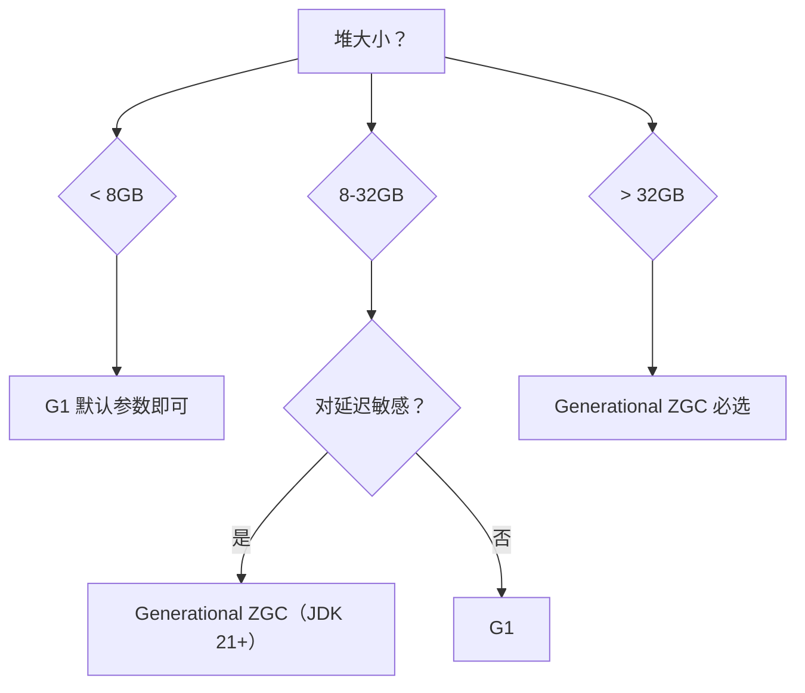

# Java 新特性

## 概念

Java 8 是现代 Java 的分水岭，引入了 Lambda、Stream、Optional 等函数式编程特性。Java 9–21 持续演进，带来了 Record、Sealed Class、虚拟线程、模式匹配等重要特性，使 Java 更简洁、更安全、更具表达力。

## 核心原理

### 1. Lambda 与函数式接口（Java 8）

**函数式接口**指只有一个抽象方法的接口，可用 `@FunctionalInterface` 注解标记（编译器会做校验）。Lambda 表达式是函数式接口的简洁实现。

```java
@FunctionalInterface
interface Greeting {
    String greet(String name);
}

// Lambda 实现
Greeting g = name -> "Hello, " + name;
System.out.println(g.greet("Java")); // Hello, Java
```

**常用内置函数式接口：**

| 接口 | 签名 | 用途 |
|------|------|------|
| `Function<T, R>` | `R apply(T t)` | 转换，有入参有返回值 |
| `Consumer<T>` | `void accept(T t)` | 消费，有入参无返回值 |
| `Supplier<T>` | `T get()` | 供给，无入参有返回值 |
| `Predicate<T>` | `boolean test(T t)` | 断言，有入参返回 boolean |

```java
Function<String, Integer> strLen = String::length;
Consumer<String> printer = System.out::println;
Supplier<List<String>> listFactory = ArrayList::new;
Predicate<String> isEmpty = String::isEmpty;
```

**方法引用（`::`）四种形式：**

```java
// 1. 静态方法引用：ClassName::staticMethod
Function<String, Integer> parseInt = Integer::parseInt;

// 2. 实例方法引用（任意实例）：ClassName::instanceMethod
Function<String, String> toUpper = String::toUpperCase;

// 3. 实例方法引用（特定实例）：instance::method
String prefix = "Hello";
Predicate<String> startsWith = prefix::equals;

// 4. 构造方法引用：ClassName::new
Supplier<ArrayList<String>> newList = ArrayList::new;
```

---

### 2. Stream API（Java 8）

Stream 是对集合进行声明式、可链式操作的抽象。Stream 本身不存储数据，操作分为**中间操作**（惰性，返回新 Stream）和**终端操作**（触发执行，返回结果）。

**创建流：**

```java
// 从集合
List<String> list = List.of("a", "b", "c");
Stream<String> s1 = list.stream();

// 从数组
Stream<String> s2 = Arrays.stream(new String[]{"x", "y"});

// 直接指定元素
Stream<Integer> s3 = Stream.of(1, 2, 3);

// 无限流
Stream<Integer> s4 = Stream.iterate(0, n -> n + 1);
```

**常用中间操作：**

```java
List<String> names = List.of("Alice", "Bob", "Charlie", "Anna");

List<String> result = names.stream()
    .filter(name -> name.startsWith("A"))       // 过滤
    .map(String::toUpperCase)                   // 转换
    .sorted()                                   // 排序
    .distinct()                                 // 去重
    .collect(Collectors.toList());

// flatMap：将每个元素映射为一个 Stream，然后展平
List<List<Integer>> nested = List.of(List.of(1, 2), List.of(3, 4));
List<Integer> flat = nested.stream()
    .flatMap(Collection::stream)
    .collect(Collectors.toList());
// [1, 2, 3, 4]
```

**常用终端操作：**

```java
// forEach
names.stream().forEach(System.out::println);

// reduce：聚合
int sum = Stream.of(1, 2, 3, 4).reduce(0, Integer::sum); // 10

// count / min / max
long count = names.stream().filter(n -> n.length() > 3).count();
Optional<String> shortest = names.stream().min(Comparator.comparingInt(String::length));
```

**Collectors 常用方法：**

```java
List<Person> people = List.of(
    new Person("Alice", 30, "Engineering"),
    new Person("Bob", 25, "Marketing"),
    new Person("Charlie", 35, "Engineering")
);

// toList
List<String> nameList = people.stream()
    .map(Person::name)
    .collect(Collectors.toList());

// toMap
Map<String, Integer> nameToAge = people.stream()
    .collect(Collectors.toMap(Person::name, Person::age));

// groupingBy：按部门分组
Map<String, List<Person>> byDept = people.stream()
    .collect(Collectors.groupingBy(Person::department));

// joining：拼接字符串
String joined = people.stream()
    .map(Person::name)
    .collect(Collectors.joining(", ", "[", "]"));
// [Alice, Bob, Charlie]

// 统计示例：各部门平均年龄
Map<String, Double> avgAgeByDept = people.stream()
    .collect(Collectors.groupingBy(
        Person::department,
        Collectors.averagingInt(Person::age)
    ));
```

**并行流（parallelStream）注意事项：**

```java
// 并行流利用 ForkJoinPool 并行处理，适合数据量大且操作无副作用的场景
long sum = LongStream.rangeClosed(1, 1_000_000)
    .parallel()
    .sum();

// 注意事项：
// 1. 操作必须是无状态、无副作用的（避免修改共享变量）
// 2. 数据量小时并行反而更慢（线程调度开销）
// 3. 避免在并行流中使用 forEach 向非线程安全集合添加元素
// 错误示例：
List<Integer> unsafe = new ArrayList<>();
Stream.of(1,2,3).parallel().forEach(unsafe::add); // 线程不安全！

// 正确做法：
List<Integer> safe = Stream.of(1, 2, 3)
    .parallel()
    .collect(Collectors.toList()); // collect 是线程安全的
```

#### Stream 性能陷阱（高频追问）

**面试 Top 1 性能题**："Stream 真的比 for 循环快吗？"——直答**慢 1.5-3 倍**，但能讲清何时该用、何时不该用，立刻显出工程经验。

##### Stream vs for 循环基准对比

| 场景 | for 循环 | Stream | 谁更快 |
|------|---------|--------|------|
| **简单遍历**（< 100 元素）| 1× | **1.5-3×** | for 完胜 |
| **复杂转换链** | 1× | 接近 1× | 持平 |
| **大数据 + 复杂运算 + parallelStream** | 1× | **0.3-0.5×**（更快）| Stream 完胜 |
| **基本类型流**（IntStream）| 1× | 接近 1×（避免装箱）| 持平 |

::: warning ⚠️ Stream 性能 3 大坑

> ① **小数据慢**：Stream 创建/lambda 调用本身有开销，元素 < 100 时 for 循环完胜；
> ② **基本类型装箱**：`list.stream().mapToInt(...).sum()` 比 `list.stream().map(...).reduce(0, Integer::sum)` 快 5-10×（避免 Integer 装箱）；
> ③ **parallelStream 共享 commonPool**：会被其他 CPU 密集任务拖累。

:::

```java
// ❌ 慢：每个元素都装箱拆箱
int sum = list.stream().map(p -> p.getPrice()).reduce(0, Integer::sum);

// ✅ 快 5-10×：用基本类型流
int sum = list.stream().mapToInt(Product::getPrice).sum();
```

##### parallelStream 何时用、何时不用

| 场景 | 推荐 |
|------|------|
| **数据量 < 1 万** | **❌ 串行 stream**（并行开销超过收益）|
| **数据量 > 10 万 + CPU 密集**（如加密计算）| ✅ parallel |
| **IO 密集**（如数据库 / HTTP）| **❌ 严格禁用**（并行 IO 不会更快，反而抢占 commonPool）|
| **顺序敏感**（findFirst / 累加非交换）| ❌ |
| **生产代码必须**用独立 ForkJoinPool | 永远不要无脑用 commonPool |

```java
// ❌ 错误：parallelStream 跑慢 IO，全 JVM 受影响
list.parallelStream().forEach(this::callRemoteApi);

// ✅ 正确：传入独立 ForkJoinPool
ForkJoinPool customPool = new ForkJoinPool(20);
customPool.submit(() -> list.parallelStream().forEach(this::callRemoteApi)).get();
```

详见 [Java 并发 — ForkJoinPool 陷阱](./java-concurrency#forkjoinpool-cpu-密集型并行计算)。

#### Collectors 高频实战（必背）

**Stream 面试 Top 2 题**："你常用的 Collectors 有哪些？"

```java
// 1. toList / toSet / toMap
List<String> names = users.stream().map(User::getName).collect(Collectors.toList());

// Java 16+: 直接 .toList()（不可变 List）
List<String> names = users.stream().map(User::getName).toList();

// 2. toMap (重复 key 必须显式处理，否则抛 IllegalStateException)
Map<Long, User> idMap = users.stream()
    .collect(Collectors.toMap(
        User::getId,
        Function.identity(),
        (existing, replacement) -> existing       // ★ 必须处理冲突
    ));

// 3. groupingBy (按字段分组)
Map<String, List<User>> byCity = users.stream()
    .collect(Collectors.groupingBy(User::getCity));

// 4. groupingBy + counting (分组计数)
Map<String, Long> countByCity = users.stream()
    .collect(Collectors.groupingBy(User::getCity, Collectors.counting()));

// 5. groupingBy + mapping (分组 + 取字段)
Map<String, List<String>> namesByCity = users.stream()
    .collect(Collectors.groupingBy(
        User::getCity,
        Collectors.mapping(User::getName, Collectors.toList())
    ));

// 6. partitioningBy (二分组：满足条件 / 不满足)
Map<Boolean, List<User>> partition = users.stream()
    .collect(Collectors.partitioningBy(u -> u.getAge() >= 18));

// 7. joining (字符串拼接)
String csv = users.stream()
    .map(User::getName)
    .collect(Collectors.joining(", ", "[", "]"));
```

::: warning ⚠️ toMap 必踩坑

> `Collectors.toMap(keyFn, valueFn)` 二参数版本**遇到重复 key 直接抛 IllegalStateException**——生产代码必须用三参数版本显式处理冲突。这是 toMap 最容易踩的坑。

:::

#### Stream 终端操作完整速查

| 操作 | 返回 | 用途 |
|------|------|------|
| `forEach` / `forEachOrdered` | void | 遍历 |
| `toList` (Java 16+) / `toArray` / `collect` | 集合 | 转回集合 |
| `count` | long | 计数 |
| `sum` / `max` / `min` / `average` | 数值 | 数值聚合（基本类型流）|
| `reduce` | Optional | 自定义聚合 |
| `findFirst` / `findAny` | Optional | 找第一个 |
| `anyMatch` / `allMatch` / `noneMatch` | boolean | 判断 |

---

### 3. Optional（Java 8）

`Optional<T>` 是一个容器，明确表示"值可能不存在"，目的是消灭随处可见的 `NullPointerException`。

**为什么引入：** 传统方法返回 `null` 时，调用方往往忘记判空，导致运行时异常。`Optional` 强迫调用方在编译时考虑空值情况。

**正确用法：**

```java
// 创建
Optional<String> present = Optional.of("hello");
Optional<String> empty = Optional.empty();
Optional<String> nullable = Optional.ofNullable(null); // 可以传 null

// 链式调用——推荐
String result = Optional.ofNullable(getUserName())
    .map(String::trim)
    .filter(s -> !s.isEmpty())
    .map(String::toUpperCase)
    .orElse("ANONYMOUS");

// orElseGet：惰性求值，适合创建默认值开销较大时
String name = Optional.ofNullable(getUserName())
    .orElseGet(() -> generateDefaultName());

// orElseThrow：值不存在时抛出异常
String required = Optional.ofNullable(getValue())
    .orElseThrow(() -> new IllegalStateException("值不能为空"));

// ifPresent：有值时执行操作
Optional.ofNullable(getUser()).ifPresent(user -> sendEmail(user));
```

**反模式（避免）：**

```java
// 反模式：用 isPresent() + get() 等同于判空，意义全无
Optional<String> opt = Optional.ofNullable(getName());
if (opt.isPresent()) {
    System.out.println(opt.get()); // 不如直接判 null
}

// 反模式：用 Optional 作为方法参数或字段类型
// Optional 设计目的是作为返回类型，不应作为参数或字段
public void process(Optional<String> name) { ... } // 不推荐
```

---

### 4. Record 类（Java 16）

Record 是一种不可变的数据载体类，编译器自动生成构造器、getter（方法名与字段同名）、`equals`、`hashCode`、`toString`。

```java
// 定义一个 Record
record Point(int x, int y) {}

// 使用
Point p = new Point(3, 4);
System.out.println(p.x());     // 3（getter 与字段同名）
System.out.println(p);         // Point[x=3, y=4]

// 可以添加自定义方法
record Person(String name, int age) {
    // 紧凑构造器（Compact Constructor）：用于参数校验
    Person {
        if (age < 0) throw new IllegalArgumentException("年龄不能为负");
    }

    String greeting() {
        return "Hi, I'm " + name;
    }
}
```

**适用场景：** DTO（数据传输对象）、值对象、函数返回多个值、配置数据。

**限制：**
- 不能继承其他类（隐式继承 `java.lang.Record`）
- 所有字段隐式为 `private final`，不可变
- 不能声明实例字段（只有 Record 组件）

---

### 5. Sealed Class（Java 17）

Sealed Class 限制哪些类可以继承或实现它，用 `permits` 关键字声明允许的子类，使类层次结构封闭可知。

```java
// 密封接口
sealed interface Shape permits Circle, Rectangle, Triangle {}

// 子类必须是 final、sealed 或 non-sealed 之一
record Circle(double radius) implements Shape {}
record Rectangle(double width, double height) implements Shape {}
final class Triangle implements Shape {
    // ...
}

// 与模式匹配配合，编译器能做穷举检查
double area(Shape shape) {
    return switch (shape) {
        case Circle c    -> Math.PI * c.radius() * c.radius();
        case Rectangle r -> r.width() * r.height();
        case Triangle t  -> 0; // 简化
        // 无需 default，编译器知道已穷举
    };
}
```

**价值：** 比枚举更灵活（子类可以有状态），比开放继承更安全（编译器能做穷举分析）。

---

### 6. 虚拟线程（Java 21 / Project Loom）

**平台线程 vs 虚拟线程：**

| 维度 | 平台线程（OS Thread） | 虚拟线程（Virtual Thread） |
|------|----------------------|--------------------------|
| 创建成本 | 重（~1MB 栈，系统调用） | 轻（几 KB，JVM 管理） |
| 数量上限 | 数千 | 数百万 |
| 阻塞行为 | 阻塞时占用 OS 线程 | 阻塞时释放 OS 线程 |
| 调度 | OS 调度 | JVM 调度（挂载到 carrier thread） |

```java
// 创建虚拟线程
Thread vt = Thread.ofVirtual().start(() -> {
    System.out.println("虚拟线程运行中：" + Thread.currentThread().isVirtual());
});

// 使用 ExecutorService（推荐方式）
try (var executor = Executors.newVirtualThreadPerTaskExecutor()) {
    for (int i = 0; i < 100_000; i++) {
        executor.submit(() -> {
            Thread.sleep(Duration.ofMillis(100)); // 阻塞时释放 carrier thread
            return "done";
        });
    }
}

// Spring Boot 3.2+ 一行开启
// application.properties:
// spring.threads.virtual.enabled=true
```

**适用场景：**
- I/O 密集型：HTTP 请求、数据库查询、文件读写（大量阻塞等待）
- 高并发服务端：每个请求一个虚拟线程，取代线程池调优

**不适用场景：**
- CPU 密集型计算（虚拟线程不能并行运行 CPU 任务，仍受 carrier thread 数量限制）
- 使用 `synchronized` 持有锁的代码（Java 21 中 synchronized 会 pin 住 carrier thread，建议换用 `ReentrantLock`）

---

### 7. 模式匹配（Java 16/21）

**instanceof 模式匹配（Java 16）：** 消除强制转型的冗余代码。

```java
// 旧写法
if (obj instanceof String) {
    String s = (String) obj;
    System.out.println(s.length());
}

// 新写法：模式变量 s 自动绑定
if (obj instanceof String s) {
    System.out.println(s.length());
}

// 还可以加条件
if (obj instanceof String s && s.length() > 5) {
    System.out.println("长字符串：" + s);
}
```

**switch 模式匹配（Java 21）：** switch 可以对类型进行匹配。

```java
sealed interface Expr permits Num, Add, Mul {}
record Num(int value) implements Expr {}
record Add(Expr left, Expr right) implements Expr {}
record Mul(Expr left, Expr right) implements Expr {}

int eval(Expr expr) {
    return switch (expr) {
        case Num(int v)          -> v;                          // Record 解构
        case Add(var l, var r)   -> eval(l) + eval(r);         // 嵌套解构
        case Mul(var l, var r)   -> eval(l) * eval(r);
    };
}

// 带 guard（when 子句）
String classify(Object obj) {
    return switch (obj) {
        case Integer i when i < 0  -> "负整数";
        case Integer i when i == 0 -> "零";
        case Integer i             -> "正整数";
        case String s              -> "字符串：" + s;
        default                    -> "其他";
    };
}
```

---

### 8. JDK 22 ~ 25 新进展（2024-2025）

JDK 21（2023）是 LTS，2025 年 9 月 JDK 25 也是 LTS。**JDK 22-25 的主要进展集中在三条线**：稳定 Loom 后续特性、推进 Project Panama（本地互操作）、收尾 Project Valhalla（值类型）。

#### 关键 JEP 速查

| JEP | 版本 | 主题 | 状态 | 面试影响 |
|-----|------|------|------|---------|
| **JEP 423: Region Pinning for G1** | 22 | G1 GC 区域钉住 | Final | JNI 调用期间不阻塞 GC |
| **JEP 454: Foreign Function & Memory API** | 22 | Panama 本地调用 | **Final** | 替代 JNI 的现代方案，零拷贝调本地库 |
| **JEP 459: String Templates (Preview)** | 22 | 字符串模板 | Preview | 类似 Kotlin 的 `"$name"` 语法 |
| **JEP 467: Markdown Documentation Comments** | 23 | Javadoc 支持 Markdown | Final | 文档体验大幅改善 |
| **JEP 469: Vector API (8th incubator)** | 23 | SIMD 向量计算 | 继续孵化 | AI/数据处理性能 5-10× |
| **JEP 471: Deprecate `Unsafe` Memory-Access** | 23 | 弃用 Unsafe 内存操作 | Deprecation | 鼓励迁移到 Panama / VarHandle |
| **JEP 480: Structured Concurrency** | 24 | 结构化并发 | 4th Preview | 虚拟线程时代的并发管理 |
| **JEP 481: Scoped Values** | 24 | 作用域值 | 3rd Preview | ThreadLocal 的现代替代 |
| **JEP 491: Synchronize Virtual Threads without Pinning** | 24 | 虚拟线程 `synchronized` 不再 Pin | Final | **重要**：解决虚拟线程最大坑 |
| **JEP 503: Remove 32-bit x86 Port** | 25 | 移除 32 位 x86 | Final | 64 位才是唯一选择 |

#### JEP 491：虚拟线程的"坑王"被修了

Java 21 推出虚拟线程时，**`synchronized` 块内不能挂起**（被称为 Pinning 问题）——会回退到平台线程，让性能优势消失。**JDK 24 彻底修复**：

```java
// JDK 21: synchronized 内 sleep 会 Pin
synchronized (lock) {
    Thread.sleep(1000);  // Pin 平台线程！
}

// JDK 24+: synchronized 内挂起不再 Pin
synchronized (lock) {
    Thread.sleep(1000);  // 虚拟线程正常挂起、释放载体线程
}
```

**面试要点**：能讲出"JDK 21 虚拟线程有 synchronized Pinning 坑，JDK 24 已彻底解决"——是了解最新动态的强信号。

#### Pinning 实战排查（JDK 21-23 生产必备）

**生产上了虚拟线程后有过一句话令人心慌**："吞吐量反而下降了"——原因 99% 是 **Pinning**。必须会用 JFR 排查。

```bash
# 开启 JFR 监听 VirtualThreadPinned 事件
java -XX:StartFlightRecording=filename=app.jfr,duration=60s \
     -XX:FlightRecorderOptions=stackdepth=64 \
     -Djdk.tracePinnedThreads=full \
     -jar app.jar

# 分析 JFR
jfr print --events jdk.VirtualThreadPinned app.jfr
```

**输出示例**：
```
jdk.VirtualThreadPinned {
  startTime = 14:32:01.234
  duration = 124 ms        ← 被 Pin 了 124ms！
  eventThread = "VirtualThread@123"
  stackTrace = [
    java.lang.Thread.sleep(...)
    com.app.Service.process(Service.java:42)   ← 在这里
    com.app.Lock.synchronized(...)              ← 被 synchronized 块钉住
  ]
}
```

#### synchronized vs ReentrantLock 选型表（JDK 21-23）

| 场景 | 推荐 | 原因 |
|------|------|------|
| **虚拟线程 + JDK 24+** | 任意 | JEP 491 修复后都不 Pin |
| **虚拟线程 + JDK 21-23** | **`ReentrantLock`** | synchronized 会 Pin 成性能灾难 |
| **平台线程** | `synchronized` 足够了 | 简单 + JIT 优化好 |
| **需超时获锁 / 中断响应** | `ReentrantLock` | 提供 `tryLock(timeout)` / `lockInterruptibly()` |

```java
// ⚠️ JDK 21-23 虚拟线程场景：避免 synchronized
private final ReentrantLock lock = new ReentrantLock();

void criticalSection() {
    lock.lock();
    try {
        // 哪怕里面有 I/O / sleep 也不 Pin 载体线程
        httpClient.send(request);
    } finally {
        lock.unlock();
    }
}
```

::: warning ⚠️ Pinning 位置隐藏在依赖里

> 你自己可能不写 synchronized，但 **JDK 标准库 + 第三方库** 到处都是：
> ① `java.io.BufferedReader` 内部 synchronized
> ② `System.out.println` 中的 `PrintStream`
> ③ `java.util.logging` 中的 `Handler`
> ④ 老版 MySQL JDBC / HttpClient
>
> 生产环境虚拟线程期限达到 JDK 24 前，**必须全面扫描依赖中的 synchronized**。

:::

#### Structured Concurrency 一图看懂

结构化并发让"父任务等所有子任务"变得**和 try-with-resources 一样自然**：

```java
// 传统：手动管理 Future + 异常处理 + 取消
try (var scope = new StructuredTaskScope.ShutdownOnFailure()) {
    Future<User>   user  = scope.fork(() -> fetchUser(id));
    Future<Order>  order = scope.fork(() -> fetchOrder(id));
    scope.join();             // 等所有子任务
    scope.throwIfFailed();    // 任一失败抛出
    return new Profile(user.resultNow(), order.resultNow());
}
// 离开 scope 自动取消未完成任务，避免泄漏
```

---

### 9. JVM GC 演进：ZGC vs G1 vs Generational ZGC

**2024-2025 年 GC 面试三件套**：G1（默认）、ZGC（低延迟新王）、Generational ZGC（JDK 21 新增分代版本）。

#### 三种 GC 详细对比

| 维度 | G1 GC（默认）| ZGC（JDK 15+）| Generational ZGC（JDK 21+）|
|------|------------|--------------|-------------------------|
| **设计目标** | 平衡吞吐 + 延迟 | **超低延迟**（< 10ms）| 低延迟 + 接近 G1 的吞吐 |
| **暂停时间** | 100-500ms | **< 10ms**（< 1ms 常见）| < 10ms |
| **堆大小支持** | < 32GB 友好 | **TB 级** | TB 级 |
| **是否分代** | ✅ | ❌（JDK 21 前）| **✅** |
| **吞吐损失** | 基准 | -10-15% | -5% |
| **使用阶段** | 通用首选、堆 < 16GB | 大堆 + 严苛延迟 | **2024 起新通用首选** |
| **关键技术** | Region + Remember Set + SATB | **Colored Pointers + Load Barrier** | + 分代回收 |

#### 关键选型决策



#### ZGC 为什么这么快？

ZGC 实现 < 10ms 暂停的**核心两招**：

1. **Colored Pointers（染色指针）**：把对象状态信息存在指针的高位 bit 中，标记和重定位**无需 stop-the-world**
2. **Load Barrier（加载屏障）**：每次读对象引用时 JVM 插入检查代码，自动处理"未完成搬移"的指针

```
对象访问流程:
  代码: Object o = a.field;
  ↓ JVM 自动插入
  Load Barrier 检查: 这个指针有没有过期/正在移动？
    ↓ 有 → 修正指针，让访问透明
    ↓ 没 → 直接访问
```

#### 生产推荐配置（2025）

```bash
# 现代后端服务（Spring Boot 应用，堆 16GB）
java -XX:+UseZGC -XX:+ZGenerational \
     -Xms16g -Xmx16g \
     -XX:+UnlockExperimentalVMOptions \
     -jar app.jar

# 大数据计算（堆 128GB+）
java -XX:+UseZGC -XX:+ZGenerational \
     -Xms128g -Xmx128g \
     -XX:SoftMaxHeapSize=100g \
     -jar app.jar
```

::: tip 💡 面试加分点

能说出 **"JDK 21 引入 Generational ZGC，把 ZGC 的低延迟和 G1 的分代效率结合，已成为新版本的通用首选；JDK 24 又解决了虚拟线程 synchronized Pinning 的问题"**，立刻显示是在持续跟进 Java 现代化的工程师。

:::

---

## 面试常问 & 怎么答

**Q1：Stream 的 `map` 和 `flatMap` 有什么区别？**

`map` 将每个元素一对一地转换为另一个元素，结果是 `Stream<R>`；`flatMap` 将每个元素映射为一个 `Stream<R>`，再把所有子 Stream **展平**合并成一个 Stream，用于处理"一对多"的转换场景。

```java
// map：String -> Integer（一对一）
Stream<Integer> lengths = Stream.of("a", "bb", "ccc")
    .map(String::length); // Stream<Integer>: [1, 2, 3]

// flatMap：String -> Stream<Character>（一对多，展平）
Stream<String> words = Stream.of("hello world", "foo bar");
List<String> tokens = words
    .flatMap(s -> Arrays.stream(s.split(" ")))
    .collect(Collectors.toList());
// ["hello", "world", "foo", "bar"]

// 如果用 map，结果是 Stream<String[]>，嵌套结构，通常不是想要的
```

记忆口诀：`map` 换元素，`flatMap` 换元素并压平一层嵌套。

---

**Q2：虚拟线程和平台线程有什么区别？什么时候用虚拟线程？**

平台线程与 OS 线程一一对应，创建成本高（约 1MB 栈），数量受限（通常几千）。虚拟线程由 JVM 管理，创建成本极低（几 KB），可以轻松创建数百万个。

核心差异在阻塞行为：平台线程阻塞时占用 OS 线程；虚拟线程阻塞（如等待 I/O）时会自动卸载，释放底层 carrier thread 去执行其他虚拟线程，从而大幅提升吞吐量。

**用虚拟线程的时机：** I/O 密集型高并发场景，例如每个 HTTP 请求分配一个虚拟线程，可以取代线程池调优，代码以同步方式编写却获得异步的吞吐。

**不适合：** CPU 密集型任务（仍受核心数限制，用虚拟线程无增益）；使用 `synchronized` 持有锁时虚拟线程会被 pin 住，应改用 `ReentrantLock`。

---

**Q3：Optional 的正确使用方式是什么？**

`Optional` 的设计意图是作为**方法返回类型**，明确表达"此方法可能没有结果"，而不是消灭所有 null。

正确做法是使用链式 API：`map` / `filter` 变换，`orElse` / `orElseGet` 提供默认值，`orElseThrow` 在值缺失时抛异常，`ifPresent` / `ifPresentOrElse` 执行副作用。

反模式要避免：
1. 用 `isPresent()` + `get()` 的判空写法，与直接判 `null` 无本质区别；
2. 将 `Optional` 用作方法参数或字段类型（序列化不友好、API 语义混乱）；
3. 对 `Optional` 调用 `get()` 而不先确保有值（会抛 `NoSuchElementException`）。

```java
// 推荐的链式写法
return Optional.ofNullable(repo.findByName(name))
    .map(User::getEmail)
    .orElseThrow(() -> new UserNotFoundException(name));
```

---

## 看到什么就先想到这类

| 看到的关键词 | 第一反应 |
|-------------|---------|
| Lambda / `->` | 函数式接口，检查是否有 `@FunctionalInterface` |
| `stream().filter().map().collect()` | Stream 流水线，注意中间操作惰性、终端操作触发执行 |
| `flatMap` | 一对多转换 + 展平，常见于处理嵌套集合或 `Optional` 链 |
| `Optional.ofNullable` | 链式消费，不要 `isPresent + get` |
| `record` 关键字 | 不可变值对象，自动生成标准方法，适合 DTO |
| `sealed` + `permits` | 封闭类层次，配合 switch 模式匹配做穷举 |
| `Thread.ofVirtual()` / `newVirtualThreadPerTaskExecutor` | 虚拟线程，I/O 密集型高并发 |
| `instanceof X x` | 模式匹配，无需强转 |
| `switch` 匹配类型 + `when` | Java 21 switch 模式匹配，注意配合 sealed class 无需 default |
| `parallelStream` | 并行流，确认操作无副作用，数据量要够大 |

## 思考题

**Q: Record 类在什么场景下使用？有什么限制？**

A: Record（JDK16+）是**不可变数据类**的语法糖，编译器自动生成构造函数、equals/hashCode/toString、accessor方法。适用场景：DTO传输对象、值对象（Value Object）、本地数据聚合。
```java
// 定义（编译器自动生成所有样板代码）
record Point(int x, int y) {}

// 等价于：final类，全参构造，x()和y()访问器，equals/hashCode/toString
Point p = new Point(1, 2);
System.out.println(p.x()); // 1（注意是方法调用，不是字段访问）
System.out.println(p);     // Point[x=1, y=2]
```
**限制：** ① 所有字段默认final，Record是不可变的；② 不能继承其他类（隐式extends Record）；③ 不能声明实例字段（只能有Record组件）。不适合需要可变状态或复杂继承的场景。

**Q: Sealed Class 解决了什么问题？什么时候用？**

A: Sealed Class（JDK17）**限制类的继承范围**，使类型体系封闭且可穷举，配合 Pattern Matching 的 `switch` 表达式实现安全的类型分发：
```java
// 只有这三个类可以继承 Shape
sealed interface Shape permits Circle, Rectangle, Triangle {}

// Pattern Matching switch：编译器知道所有子类，检查穷举性
double area = switch (shape) {
    case Circle c    -> Math.PI * c.radius() * c.radius();
    case Rectangle r -> r.width() * r.height();
    case Triangle t  -> t.base() * t.height() / 2;
    // 无需 default，编译器确认已穷举所有情况
};
```
与枚举的区别：Sealed Class的子类可以持有不同数量/类型的数据（Circle有radius，Rectangle有width+height），枚举实例共享同一类型。适合领域模型中有限但结构不同的变体（如支付结果：Success/Failure/Pending，每种持有不同字段）。

**Q: Virtual Threads（JDK21）和传统线程池有什么核心区别？**

A: 核心区别在**阻塞代价**：传统平台线程1:1对应OS线程，阻塞时占用OS线程（约1MB栈内存）；Virtual Thread（虚拟线程）由JVM调度，阻塞时**自动卸载（unmount）**平台线程，只保留极小的堆内存（KB级），平台线程可立即执行其他虚拟线程。
```java
// 传统线程池：受OS线程数限制（通常几百到几千）
ExecutorService pool = Executors.newFixedThreadPool(200);

// 虚拟线程：每任务一个虚拟线程，无需复用，可轻松创建百万级
ExecutorService vPool = Executors.newVirtualThreadPerTaskExecutor();
try (var executor = vPool) {
    for (int i = 0; i < 1_000_000; i++) {
        executor.submit(() -> someIoOperation());
    }
}
```
**适合**：IO密集型（数据库查询、HTTP调用、文件读写），阻塞等待时不占OS线程，吞吐极大提升。**不适合**：CPU密集型（虚拟线程不解决计算瓶颈，应用ForkJoinPool）；避免在虚拟线程中使用synchronized（会pin住平台线程），改用ReentrantLock。

**Q: Stream API 的 parallel() 什么时候有收益，什么时候反而变慢？**

A: `parallelStream()` 底层使用 ForkJoinPool（共享线程池），有收益的条件：① **数据量大**（建议10万+元素）；② **每个元素计算耗时**（CPU密集型）；③ **操作无共享状态**（无状态、线程安全）。反而变慢的场景：① **数据量小**——线程拆分和合并开销大于收益；② **含IO操作**——共享ForkJoinPool线程，IO阻塞导致线程饥饿；③ **有状态操作**——如collect到共享List需同步，消除并发收益；④ **含短路操作**（limit/findFirst）——并行化可能多做无用工。建议：不确定时先测 benchmark，不要盲目加 parallel()。
