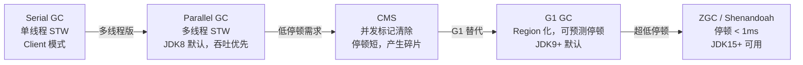
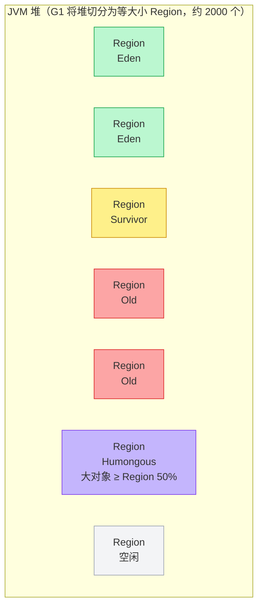
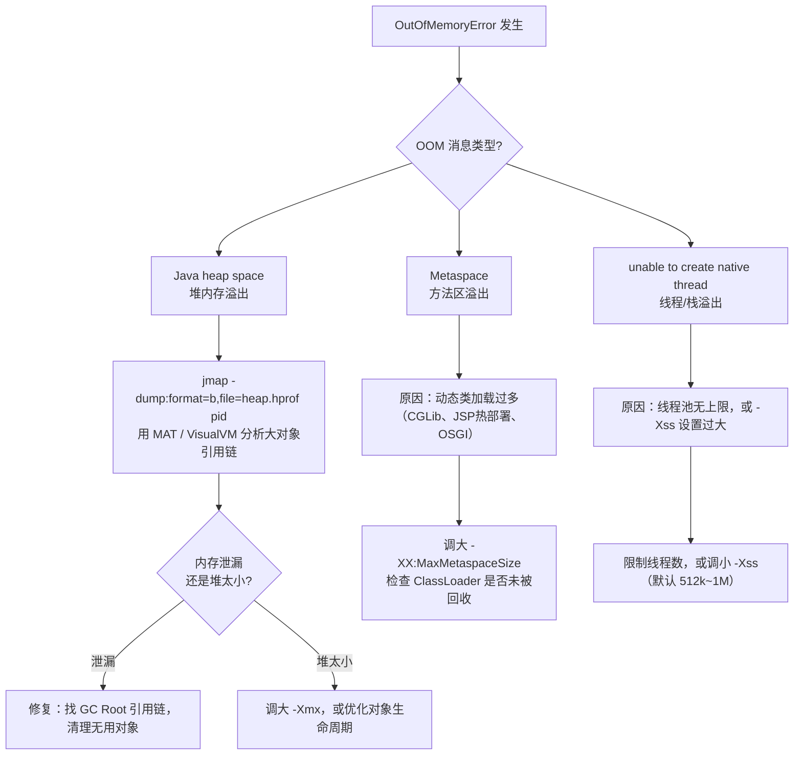

# JVM 深入

<span class="dig-tag dig-tag--category">编程语言</span>
<span class="dig-tag dig-tag--hard">⭐⭐⭐ 高级</span>
<span class="dig-tag dig-tag--hot">🔥🔥🔥 高频</span>

::: tip 💡 核心要点
本文聚焦 JVM 进阶原理：类加载机制与双亲委派、Java 内存模型（JMM）、JIT 编译优化、调优实战工具链、四种引用类型。JVM 内存结构与 GC 机制请参阅 [Java 基础原理](./java-fundamentals.md)。
:::

## 概念

| 术语 | 说明 |
|------|------|
| 类加载器 ClassLoader | 将 `.class` 字节码加载到 JVM 并生成 `Class` 对象的组件 |
| 双亲委派模型 | 子加载器先委托父加载器尝试加载，父无法加载时才由子自己处理 |
| JMM | Java Memory Model，定义线程如何通过主内存共享变量的抽象规范 |
| happens-before | JMM 中保证操作可见性与有序性的规则集合 |
| 内存屏障 | 禁止特定类型指令重排的 CPU 指令，JMM 的底层实现手段 |
| JIT | Just-In-Time 编译，将热点字节码编译为本地机器码 |
| 热点代码 | 被频繁执行的方法或循环体，触发 JIT 编译的条件 |
| 逃逸分析 | 判断对象是否会逃逸出方法/线程范围的编译期分析 |
| OOM | OutOfMemoryError，JVM 无法分配内存时抛出 |
| 软/弱/虚引用 | 不同强度的引用类型，决定对象在 GC 时是否被回收 |

## 核心原理

### 1. 类加载机制

#### 类加载过程

```
加载      验证      准备      解析      初始化
Loading → Verify → Prepare → Resolve → Initialize
  ↑                                        ↑
读取字节码                            执行 <clinit>，
生成 Class 对象                       赋静态变量初始值
```

各阶段职责：

| 阶段 | 工作内容 |
|------|----------|
| 加载 | 通过类的全限定名获取字节流，在堆中生成 `java.lang.Class` 对象 |
| 验证 | 校验字节码格式、语义、字节码指令合法性，防止危险代码 |
| 准备 | 为类的**静态变量**分配内存并赋**零值**（`int` → `0`，引用 → `null`） |
| 解析 | 将常量池中的符号引用替换为直接引用（内存地址） |
| 初始化 | 执行 `<clinit>()` 方法，按代码顺序为静态变量赋真实值、执行静态块 |

> 注意：准备阶段赋零值，初始化阶段才赋程序员写的初始值。

#### 三种类加载器

| 加载器 | 加载范围 | 实现 |
|--------|----------|------|
| Bootstrap ClassLoader | `JAVA_HOME/lib`（如 `rt.jar`） | C++ 实现，Java 中表示为 `null` |
| Extension/Platform ClassLoader | `JAVA_HOME/lib/ext`（JDK 9+ 改为 Platform） | Java 实现 |
| Application ClassLoader | classpath，用户自定义类 | Java 实现，默认类加载器 |

#### 双亲委派模型

```
Application ClassLoader（用户类）
        |  委托
        v
Extension/Platform ClassLoader（扩展类）
        |  委托
        v
Bootstrap ClassLoader（核心类库）
        |  加载失败时向下返回
        v
    由子加载器自己加载
```

**流程**：收到加载请求 → 先委托父加载器 → 父也委托其父 → 直到 Bootstrap → 若父无法加载再由自己尝试 → 都失败则抛 `ClassNotFoundException`。

**好处**：
- 防止核心类被覆盖（`java.lang.String` 永远由 Bootstrap 加载）
- 类唯一性保证（同一类只会被同一加载器加载一次）

#### 打破双亲委派的场景

| 场景 | 原因 | 手段 |
|------|------|------|
| SPI（JDBC, JNDI） | 接口在核心库，实现在用户 classpath，Bootstrap 无法加载实现类 | 线程上下文类加载器（`Thread.currentThread().getContextClassLoader()`） |
| Tomcat | 不同 Web 应用需隔离，相同类名加载不同版本 | 每个 WebApp 有独立的 `WebAppClassLoader`，优先自己加载 |
| OSGi | 模块化系统，Bundle 之间类空间隔离且可共享 | 网状委派，非树状结构 |
| 热部署/热替换 | 需要卸载旧类、加载新版本 | 丢弃旧 ClassLoader，创建新实例重新加载 |

---

### 2. Java 内存模型（JMM）

#### 主内存 vs 工作内存

```
  线程 A                          线程 B
┌──────────┐                   ┌──────────┐
│ 工作内存  │                   │ 工作内存  │
│  变量副本 │                   │  变量副本 │
└────┬─────┘                   └────┬─────┘
     │  read/load/use               │  read/load/use
     │  assign/store/write          │  assign/store/write
     v                              v
┌─────────────────────────────────────────┐
│               主内存 Main Memory         │
│           （共享变量的真实存储位置）       │
└─────────────────────────────────────────┘
```

- 线程对变量的操作必须在工作内存中进行，不能直接操作主内存。
- 线程间通信必须经过主内存（写回主内存 → 另一线程从主内存读取）。

#### happens-before 8 条规则

若操作 A happens-before 操作 B，则 A 的结果对 B 可见，且 A 在 B 之前执行。

| # | 规则名称 | 内容 |
|---|----------|------|
| 1 | 程序顺序规则 | 同一线程中，前面的操作 happens-before 后面的操作 |
| 2 | 监视器锁规则 | `unlock` happens-before 后续对同一锁的 `lock` |
| 3 | volatile 变量规则 | volatile 写 happens-before 后续对同一变量的读 |
| 4 | 线程启动规则 | `Thread.start()` happens-before 该线程的任何操作 |
| 5 | 线程终止规则 | 线程所有操作 happens-before `Thread.join()` 返回 |
| 6 | 线程中断规则 | `interrupt()` happens-before 被中断线程检测到中断 |
| 7 | 对象终结规则 | 构造函数结束 happens-before `finalize()` 开始 |
| 8 | 传递性规则 | A hb B 且 B hb C，则 A hb C |

#### 内存屏障

JMM 通过内存屏障（Memory Barrier）禁止 CPU 和编译器对指令重排：

| 屏障类型 | 禁止重排场景 | 说明 |
|----------|------------|------|
| LoadLoad  | Load1; **LoadLoad**; Load2  | 确保 Load1 的数据在 Load2 前加载完 |
| StoreStore | Store1; **StoreStore**; Store2 | 确保 Store1 刷新到主内存后再执行 Store2 |
| LoadStore | Load1; **LoadStore**; Store2 | 确保 Load1 的数据在 Store2 刷新前加载完 |
| StoreLoad | Store1; **StoreLoad**; Load2 | 全能屏障，确保 Store1 刷新后 Load2 才读取 |

> `volatile` 写前插入 StoreStore、写后插入 StoreLoad；读前插入 LoadLoad、读后插入 LoadStore。

---

### 3. JIT 编译

#### 解释执行 vs 编译执行

```
源代码 (.java)
     │ javac 编译
     v
字节码 (.class)
     │
     ├─→ 解释器逐行解释执行（启动快，运行慢）
     │
     └─→ JIT 编译为本地机器码（启动慢，运行快）
              ↑
        热点代码触发
```

JVM 默认混合模式（Mixed Mode）：启动时解释执行，热点代码触发 JIT 编译后执行本地机器码。

#### 热点探测

JVM 通过计数器判断是否为热点代码：

| 计数器 | 触发条件 | 编译动作 |
|--------|----------|----------|
| 方法调用计数器 | 方法调用次数超过阈值（默认 C1=1500, C2=10000） | 对整个方法编译 |
| 回边计数器 | 循环体执行次数超过阈值 | 栈上替换（OSR，On-Stack Replacement） |

计数器有**热度衰减**机制：一段时间内未达到阈值，计数减半，防止冷代码误判为热点。

#### C1 vs C2 编译器

| 编译器 | 别名 | 优化程度 | 适用场景 |
|--------|------|----------|----------|
| C1 | Client 编译器 | 低（简单优化） | 对启动时间敏感的应用，编译快 |
| C2 | Server 编译器 | 高（激进优化） | 长时间运行的服务端应用，峰值性能高 |

JDK 8+ 默认使用**分层编译**（Tiered Compilation）：先用 C1 快速编译，再用 C2 深度优化热点。

#### 逃逸分析与优化

**逃逸分析**：判断对象作用域是否超出当前方法或线程。

```java
// 不逃逸：obj 仅在方法内使用
void foo() {
    Object obj = new Object(); // 可优化
    use(obj);
}

// 逃逸：obj 被返回或赋给全局变量
Object bar() {
    return new Object(); // 无法优化
}
```

基于逃逸分析的三类优化：

| 优化 | 说明 | 效果 |
|------|------|------|
| 栈上分配 | 不逃逸对象直接在栈帧分配，随帧销毁 | 减少堆 GC 压力 |
| 标量替换 | 将对象拆解为若干基本类型局部变量 | 减少对象创建开销 |
| 锁消除 | 对不逃逸对象的同步操作去掉锁 | 减少无谓同步开销 |

---

### 4. JVM 调优实战

#### 常用 JVM 参数

| 参数 | 说明 | 示例 |
|------|------|------|
| `-Xms` | 堆初始大小 | `-Xms512m` |
| `-Xmx` | 堆最大大小 | `-Xmx4g` |
| `-Xss` | 每个线程栈大小 | `-Xss512k` |
| `-XX:MetaspaceSize` | 元空间初始大小（触发 Full GC 的阈值） | `-XX:MetaspaceSize=256m` |
| `-XX:MaxMetaspaceSize` | 元空间最大大小 | `-XX:MaxMetaspaceSize=512m` |
| `-XX:+PrintGCDetails` | 打印详细 GC 日志 | — |
| `-XX:+PrintGCDateStamps` | GC 日志加时间戳 | — |
| `-Xloggc:/path/gc.log` | GC 日志输出到文件 | — |
| `-XX:+HeapDumpOnOutOfMemoryError` | OOM 时自动 dump 堆 | — |
| `-XX:HeapDumpPath=/path/dump.hprof` | dump 文件路径 | — |

#### GC 日志分析要点

```
[GC (Allocation Failure) [PSYoungGen: 65536K->10752K(76288K)] 
  65536K->12416K(251392K), 0.0123456 secs]
                                         ↑
                                   GC 耗时，> 100ms 需关注

关注点：
1. GC 频率：Minor GC 过于频繁 → 新生代太小或对象分配速率太高
2. Full GC 频率：Full GC 频繁 → 老年代空间不足或内存泄漏
3. 每次 GC 后老年代是否持续增长 → 内存泄漏信号
4. GC 停顿时间（STW）是否影响业务 SLA
```

#### 常用诊断工具

| 工具 | 用途 | 常用命令示例 |
|------|------|-------------|
| `jps` | 列出 JVM 进程 | `jps -l` |
| `jstat` | 实时监控 GC、类加载、JIT 统计 | `jstat -gcutil <pid> 1000` |
| `jmap` | 生成堆 dump、查看堆对象统计 | `jmap -dump:format=b,file=heap.hprof <pid>` |
| `jstack` | 生成线程 dump，排查死锁、CPU 高 | `jstack <pid>` |
| `jconsole` | 图形化 JVM 监控 | GUI 工具 |
| VisualVM | 功能更全的图形化分析工具 | GUI 工具 |
| Arthas | 阿里开源，线上动态诊断神器 | `dashboard`, `thread`, `watch`, `trace` |

#### OOM 排查流程

```
线上 OOM 告警
     │
     v
1. 确认 OOM 类型
   ├─ java.lang.OutOfMemoryError: Java heap space      → 堆内存溢出
   ├─ java.lang.OutOfMemoryError: Metaspace            → 元空间溢出（类过多/类泄漏）
   ├─ java.lang.OutOfMemoryError: unable to create native thread → 线程数过多
   └─ java.lang.StackOverflowError                     → 栈溢出（递归过深）
     │
     v
2. 获取 heap dump
   ├─ 提前配置 -XX:+HeapDumpOnOutOfMemoryError（推荐）
   └─ 临时执行 jmap -dump:format=b,file=heap.hprof <pid>
     │
     v
3. 分析 dump
   ├─ MAT（Eclipse Memory Analyzer）：Leak Suspects 报告定位大对象
   └─ jmap -histo <pid>：查看对象数量和占用大小 TOP N
     │
     v
4. 定位根因
   ├─ 大量某类对象 → 该类未释放，检查缓存、集合是否无限增长
   ├─ 元空间溢出 → 动态代理/CGLib 生成大量类，检查是否重复创建 ClassLoader
   └─ 线程过多 → 线程池配置不当，检查是否无界队列 + 无限创建线程
     │
     v
5. 修复 & 验证：修改代码/配置 → 压测验证 → 上线观察
```

---

### 5. 四种引用类型

| 引用类型 | 类 | GC 行为 | 典型使用场景 |
|----------|-----|---------|-------------|
| 强引用 Strong | 普通赋值（`Object o = new Object()`） | 永不回收，宁可 OOM | 绝大多数正常对象 |
| 软引用 Soft | `SoftReference<T>` | 内存充足时保留，**内存不足时**回收 | 图片/文件缓存，内存敏感的缓存 |
| 弱引用 Weak | `WeakReference<T>` | **下次 GC 时必定回收**，无论内存是否充足 | `WeakHashMap`、ThreadLocal 的 Entry |
| 虚引用 Phantom | `PhantomReference<T>` | 等同无引用，**无法通过虚引用获取对象**；GC 前将引用加入 ReferenceQueue | 追踪对象被回收的时机，管理堆外内存（如 DirectByteBuffer） |

```java
// 软引用示例：缓存场景
SoftReference<byte[]> cache = new SoftReference<>(new byte[1024 * 1024]);
byte[] data = cache.get(); // 内存不足后 get() 返回 null

// 弱引用示例：WeakHashMap，key 无强引用后自动清除
Map<Object, String> map = new WeakHashMap<>();

// 虚引用示例：必须配合 ReferenceQueue 使用
ReferenceQueue<Object> queue = new ReferenceQueue<>();
PhantomReference<Object> ref = new PhantomReference<>(new Object(), queue);
// ref.get() 永远返回 null
```

**ThreadLocal 内存泄漏本质**：`ThreadLocalMap` 的 Entry 用弱引用指向 `ThreadLocal` key，key 被回收后 Entry 的 value（强引用）无法被 GC。解决方式：用完后调用 `ThreadLocal.remove()`。

---

### 6. 生产 5 大典型故障的诊断模式

理论懂了不代表能排错。**2025-2026 年 Java 后端面试**经常给你一个"线上 CPU 100%/内存暴涨/OOM/响应慢"的故障场景，让你**讲完整诊断流程**。下面是必背的 5 大模式。

#### 模式 1：CPU 100%（单核或多核打满）

```
诊断 5 步:
  1. top -Hp <pid>           找出占 CPU 最高的"线程"（不是进程）
  2. printf "%x" <tid>       把十进制线程 ID 转十六进制
  3. jstack <pid> | grep -A 30 <hex_tid>
                             定位到 Java 线程在执行什么代码
  4. 分析 stacktrace:
     ├─ 看到 GC 相关 → JVM GC 频繁 → 看 jstat -gcutil
     ├─ 看到死循环 / hot path → 业务代码 bug
     └─ 看到大量 RUNNABLE 的同一方法 → 锁竞争或正则回溯
  5. Arthas: thread -n 3      看 CPU 最高的 3 个线程实时栈
```

::: tip 💡 高频根因 Top 3

> ① **JSON 反序列化大对象**（Jackson/Fastjson）；② **正则灾难性回溯**（`(a+)+` 这类 pattern）；③ **死循环或频繁 GC**。

:::

#### 模式 2：内存持续上涨（疑似内存泄漏）

```
诊断 4 步:
  1. jstat -gcutil <pid> 1000
     → 看 O（老年代）使用率: 是否 Full GC 后仍然不下降？
     → 如果是 → 内存泄漏确认
  2. jmap -histo:live <pid> | head -30
     → 看哪个类的对象数最多、占内存最大
  3. jmap -dump:format=b,file=heap.hprof <pid>
     → 把堆 dump 下来（生产慎用，会 STW）
     → 推荐: 提前配 -XX:+HeapDumpOnOutOfMemoryError
  4. MAT 打开 dump → Leak Suspects 报告
     → 看 Dominator Tree 找最大对象 + GC Root 引用链
```

::: tip 💡 内存泄漏高频原因

> ① **静态集合无限增长**（`static Map cache = new HashMap()`）；② **ThreadLocal 没 remove**；③ **未关闭的资源**（Stream / Connection）；④ **监听器/回调未注销**。

:::

#### 模式 3：频繁 Full GC（响应突然变慢）

```
诊断步骤:
  1. jstat -gcutil <pid> 1000
     → Look at YGC / FGC 次数和耗时
     → 健康: FGC 几小时一次, 耗时 < 200ms
     → 异常: FGC 几分钟一次, 耗时 > 1s
  2. -Xlog:gc*:file=gc.log (JDK 9+) 或 -XX:+PrintGCDetails
     → 用 GCViewer / GCEasy 在线分析
  3. 看 GC 日志:
     ├─ "Allocation Failure" → 老年代空间不足，可能晋升过快
     ├─ "Metadata GC Threshold" → Metaspace 不足
     └─ "G1 Humongous Allocation" → 大对象触发 Mixed GC
  4. 调优:
     ├─ 老年代不足 → 增大 -Xmx 或 -XX:NewRatio
     ├─ 晋升过快 → 调 -XX:MaxTenuringThreshold
     └─ 大对象多 → 增大 G1HeapRegionSize
```

#### 模式 4：响应时间陡升（接口慢但 CPU/内存正常）

```
诊断顺序（从外到内）:
  1. 看监控面板: 慢请求集中在某个时间点？某个接口？某台机器？
  2. arthas: trace com.xx.Service xxMethod
     → 实时看方法各步骤耗时
  3. 高频根因:
     ├─ DB 慢查询: 看 slow log + EXPLAIN
     ├─ 锁等待: jstack 看 BLOCKED 线程
     ├─ 下游接口超时: 看 OpenFeign / RestTemplate 调用链
     ├─ GC pause: 同模式 3
     └─ 连接池耗尽: Druid / HikariCP 监控面板看 active 数
```

#### 模式 5：服务直接 Crash / kill -9（无 OOM 错误）

```
关键: JVM 自己挂了，连 OOM 日志都没留
  1. 看 hs_err_pid<pid>.log
     → JVM crash 报告，常见原因: JNI bug / GC bug / OS signal
  2. 看 dmesg | tail -100
     → 是否被 OOM Killer 杀掉？
     → "Out of memory: Kill process X (java)"
  3. OOM Killer 触发原因:
     ├─ 容器内存超限 (memory.limit_in_bytes)
     ├─ Java 进程实际 RSS > -Xmx (堆外内存:Metaspace/DirectBuffer/线程栈)
     └─ Native memory leak (Netty DirectBuffer / JNI)
  4. 排查堆外内存:
     ├─ jcmd <pid> VM.native_memory summary  (需启用 NMT)
     ├─ pmap -x <pid>  看进程内存映射
     └─ 看 /proc/<pid>/smaps
```

::: warning ⚠️ 容器化 JVM 必读

> 容器（Docker/K8s）中 JVM 默认看的是**宿主机**内存（除非用 JDK 10+ 或加 `-XX:+UseContainerSupport`）。**生产配置：`-XX:MaxRAMPercentage=75.0`** 让 JVM 自动按容器内存的 75% 计算堆大小。

:::

#### Arthas 高频命令速查（生产必用）

| 命令 | 用途 | 示例 |
|------|------|------|
| `dashboard` | 实时面板（CPU/内存/线程/GC）| 一眼看全貌 |
| `thread -n 3` | 最忙 3 个线程的栈 | CPU 高排查 |
| `thread -b` | **死锁检测** | 直接定位死锁 |
| `trace Class method` | **方法各步骤耗时** | 接口慢分析 |
| `watch Class method` | 观察方法入参/返回值 | 不停服 debug |
| `jad Class` | **反编译已加载的类** | 确认线上代码版本 |
| `redefine` | **热修复**（替换 class） | 紧急 bug 修复不停服 |
| `heapdump` | 生成堆 dump | 替代 jmap |

::: tip 💡 面试黄金答题框架

> **"线上故障排查就 5 个模式：CPU 高 → top -Hp + jstack；内存涨 → jstat + jmap + MAT；Full GC 频 → gc.log + GCEasy；响应慢 → arthas trace；进程死 → hs_err + dmesg。每种都有清晰的 4-5 步流程。生产首选 Arthas，比传统 jstack/jmap 更安全（不停服 + 不 STW）。"**

:::

---

## 面试常问 & 怎么答

### Q1：类加载过程是什么？什么是双亲委派？为什么要打破它？

**答题框架**：过程 → 模型 → 打破原因

**类加载过程（5 步）**：加载（读取字节码生成 Class 对象）→ 验证（合法性校验）→ 准备（静态变量赋零值）→ 解析（符号引用转直接引用）→ 初始化（执行 `<clinit>`，赋真实初值）。

**双亲委派**：加载类时优先委托父加载器，父无法加载再自己处理。三级体系：Bootstrap → Extension/Platform → Application。好处是防止核心类被篡改，保证类的唯一性。

**打破场景**：
- **SPI**（如 JDBC）：接口在 Bootstrap 加载的核心库，实现类在用户 classpath，Bootstrap 无法向下委托，用线程上下文类加载器解决。
- **Tomcat**：各 Web 应用需要加载相同类名的不同版本，每个 WebApp 有独立 ClassLoader，优先加载自己的类。
- **热部署**：需要卸载旧类，创建新 ClassLoader 重新加载新版本类。

---

### Q2：JMM 是什么？happens-before 规则有哪些？

**答题框架**：定义 → 主内存/工作内存 → happens-before → 内存屏障

**JMM**（Java Memory Model）是 Java 对多线程内存访问的抽象规范，定义线程如何通过主内存共享变量，屏蔽不同硬件/OS 的内存差异。

**主内存 vs 工作内存**：所有共享变量存储在主内存，每个线程有自己的工作内存（寄存器/CPU 缓存的抽象）。线程读写变量必须先拷贝到工作内存，写完再刷回主内存，线程间通信通过主内存中转。

**happens-before 8 条**（背重点 4 条）：
1. 程序顺序规则（同线程内前 hb 后）
2. 监视器锁规则（unlock hb 下一个 lock）
3. volatile 规则（volatile 写 hb 后续读）
4. 线程启动/终止/中断规则
5. 传递性

**内存屏障**是底层实现手段，JMM 通过在 volatile 读写前后插入 LoadLoad/StoreStore/StoreLoad/LoadStore 屏障禁止指令重排。

---

### Q3：线上 OOM 了怎么排查？

**答题框架**：确认类型 → 获取 dump → 分析定位 → 修复验证

**第一步，确认 OOM 类型**：看错误信息区分是堆溢出（`Java heap space`）、元空间溢出（`Metaspace`）、还是线程过多（`unable to create native thread`）。

**第二步，获取堆 dump**：如果提前配置了 `-XX:+HeapDumpOnOutOfMemoryError` 会自动生成；否则用 `jmap -dump:format=b,file=heap.hprof <pid>` 手动导出（注意导出过程会 STW，生产慎用）。

**第三步，分析 dump**：用 MAT 打开，看 Leak Suspects 报告，找出最大的对象或类实例集合；也可用 `jmap -histo <pid>` 快速看 TOP N 对象数量。

**第四步，定位根因**：
- 大量业务对象未释放 → 检查缓存、Map 是否无限增长；
- 元空间溢出 → 是否频繁动态代理/CGLib 且重复创建 ClassLoader；
- 线程过多 → 线程池配置问题或无界线程创建。

**第五步**，修复后压测验证，上线观察 GC 日志和内存曲线。

> 加分点：提到用 Arthas 的 `dashboard` 实时观察内存，`heapdump` 命令在线抓 dump，避免直接操作生产 jmap。

---

## 深度图解

### GC 算法演进与选型



| GC 算法 | 停顿时间 | 吞吐量 | 适用场景 | JDK 默认 |
|---------|---------|--------|---------|---------|
| Serial | 高（单线程 STW） | 低 | 单核 Client | — |
| Parallel | 中（多线程 STW） | 高 | 批处理，吞吐优先 | JDK 8 |
| CMS | 低（并发标记） | 中 | 响应时间优先 | 已废弃 |
| G1 | 可预测（默认 200ms） | 中 | 大堆（>4GB），通用 | JDK 9+ |
| ZGC | < 1ms | 中 | 超大堆，延迟敏感 | JDK 21 可选 |

---

### G1 Region 内存布局



**G1 的核心优势：** 每次 GC 优先回收垃圾最多的 Region（Garbage First），通过控制回收 Region 数量来满足停顿时间目标（`-XX:MaxGCPauseMillis=200`，默认 200ms）。

---

### OOM 三种类型诊断



| OOM 类型 | 常见原因 | 诊断工具 |
|----------|---------|---------|
| heap space | 内存泄漏 / 大对象 / 堆太小 | jmap + MAT |
| Metaspace | 动态类生成 / ClassLoader 泄漏 | jstat -gcmetacapacity |
| native thread | 线程数过多 / Xss 过大 | jstack + `ulimit -u` |
| Direct buffer | NIO DirectBuffer 未释放 | jcmd pid VM.native_memory |

---

### JIT 编译与逃逸分析

逃逸分析（Escape Analysis）判断对象是否会"逃出"方法或线程范围，若不逃逸则做以下优化：

```java
// ✅ 不逃逸 → 可栈上分配 / 标量替换
public int compute() {
    Point p = new Point(1, 2); // 只在方法内使用
    return p.x + p.y;
    // JIT: 直接把 p.x, p.y 用寄存器存储，不分配堆对象
}

// ❌ 逃逸 → 必须堆分配
public Point getPoint() {
    return new Point(1, 2); // 返回给调用者，对象逃逸出方法
}
```

| 优化类型 | 触发条件 | 效果 |
|---------|---------|------|
| 栈上分配 | 对象不逃逸出方法 | 减少堆分配，降低 GC 压力 |
| 标量替换 | 对象不逃逸 | 拆解为基本类型，直接放寄存器 |
| 同步消除 | 锁对象不逃逸出线程 | 消除无竞争的 synchronized 锁 |

**查看逃逸分析结果：** `-XX:+PrintEscapeAnalysis`（JDK 8 以上，需配合 `-XX:+UnlockDiagnosticVMOptions`）

---

## 看到什么就先想到这类

| 看到/听到 | 联想到 |
|-----------|--------|
| `ClassNotFoundException` / `NoClassDefFoundError` | 类加载过程、双亲委派、classpath 问题 |
| JDBC、SPI 接口 | 打破双亲委派 —— 线程上下文类加载器 |
| Tomcat 部署多应用 | 独立 WebAppClassLoader，隔离类空间 |
| 指令重排、可见性问题 | JMM、happens-before、内存屏障 |
| `static` 变量初始化顺序 | 类加载初始化阶段、`<clinit>` 顺序 |
| 服务刚启动慢，跑一会儿快 | JIT 热点编译、分层编译预热 |
| 不必要的对象分配/锁 | 逃逸分析、标量替换、锁消除 |
| OOM / 内存持续增长 | heap dump、MAT、`jmap`、Arthas |
| 线程死锁 / CPU 100% | `jstack` 线程 dump、Arthas `thread -b` |
| 图片缓存、大对象缓存 | 软引用 `SoftReference` |
| `WeakHashMap` / ThreadLocal 泄漏 | 弱引用生命周期、记得 `remove()` |
| 追踪堆外内存回收 | 虚引用 + `ReferenceQueue` |
