# 丰富数据库/Java/计算机网络三板块实现计划

> **For agentic workers:** REQUIRED SUB-SKILL: Use superpowers:subagent-driven-development (recommended) or superpowers:executing-plans to implement this plan task-by-task. Steps use checkbox (`- [ ]`) syntax for tracking.

**Goal:** 为数据库、Java编程语言、计算机网络三板块的8个核心文件新增约30个Mermaid图示，补充面试高频Q&A和代码示例，使内容深度与已完成的系统设计板块一致。

**Architecture:** 8个独立任务一一对应8个文件，每个任务在文件合适位置插入新增内容块。不改变现有内容结构，只在已有章节末尾或新增小节追加内容。

**Tech Stack:** VitePress + Mermaid（sequenceDiagram / stateDiagram-v2 / flowchart / graph LR）

---

## 文件映射

| 任务 | 文件 | 新增内容 |
|------|------|----------|
| Task 1 | `docs/databases/transaction-lock.md` | MVCC版本链图、死锁时序图、Next-Key Lock图 |
| Task 2 | `docs/databases/indexing.md` | B+树查询路径图、索引失效示例、覆盖索引对比 |
| Task 3 | `docs/databases/redis.md` | 部署演进图、缓存三大问题流程图、RDB/AOF对比 |
| Task 4 | `docs/databases/mysql-architecture.md` | 两阶段提交时序、Buffer Pool LRU图、补充Q&A |
| Task 5 | `docs/programming-languages/java-concurrency.md` | AQS状态机、线程池流程图、CAS/ABA时序 |
| Task 6 | `docs/programming-languages/jvm-internals.md` | GC算法对比表、G1 Region图、OOM诊断流程 |
| Task 7 | `docs/computer-networks/tcp-udp.md` | TCP完整状态机、滑动窗口图、拥塞控制四阶段 |
| Task 8 | `docs/computer-networks/http-https.md` | TLS握手时序、证书链图、HTTP缓存决策树 |

---

### Task 1: 丰富 transaction-lock.md

**Files:**
- Modify: `docs/databases/transaction-lock.md`

- [ ] **Step 1: 在文件末尾追加 MVCC 深度解析节**

在文件末尾的思考题 `## 思考题` 节之前（或文件末尾）追加以下内容：

````markdown
### MVCC 版本链可视化

InnoDB 每行数据维护隐藏字段 `trx_id`（最后修改的事务ID）和 `roll_pointer`（指向 undo log 版本链）。

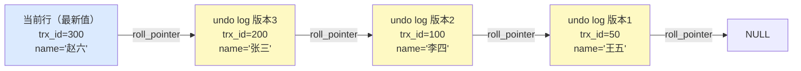

**ReadView 可见性判断规则（RR 隔离级别）：**

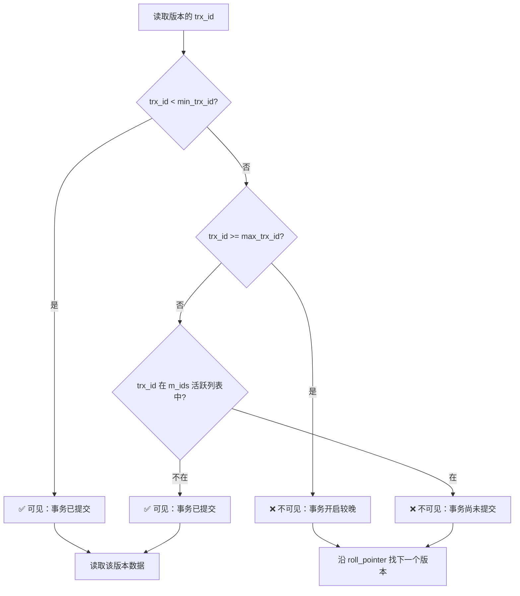

**RC vs RR 的 ReadView 创建时机差异：**

| 隔离级别 | ReadView 创建时机 | 效果 |
|---------|-----------------|------|
| RC（读已提交） | **每次 SELECT** 都创建新 ReadView | 可以读到其他事务最新提交的数据 |
| RR（可重复读） | **事务第一次 SELECT** 时创建，整个事务复用 | 整个事务看到一致的快照 |
````

- [ ] **Step 2: 追加死锁检测时序图**

````markdown
### 死锁场景与检测

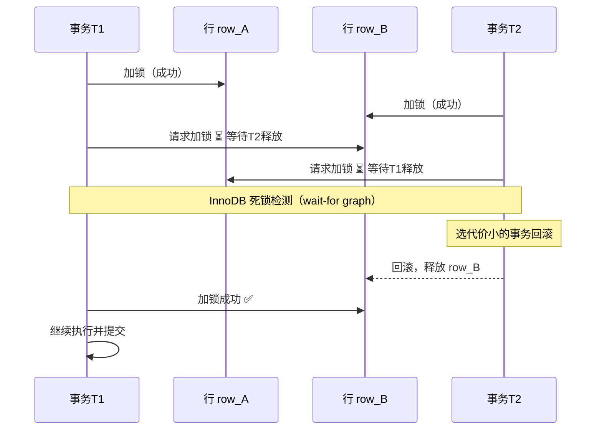

**避免死锁的策略：**
- **固定加锁顺序**：所有业务代码按相同顺序申请资源（A→B，不要A→B和B→A混用）
- **缩短事务**：减少事务持有锁的时间，降低锁冲突概率
- **超时设置**：`innodb_lock_wait_timeout`（默认50s）到期后自动回滚
- **死锁检测**：`innodb_deadlock_detect=ON`（默认开启），检测到后立即回滚代价最小的事务
````

- [ ] **Step 3: 追加 Next-Key Lock 范围图**

````markdown
### Next-Key Lock 区间示意

假设索引列有值 10, 20, 30，InnoDB 在 RR 级别会对查询范围加 Next-Key Lock：

```
(-∞, 10]  (10, 20]  (20, 30]  (30, +∞)
  GAP+REC   GAP+REC   GAP+REC   GAP only

查询 WHERE id = 20：锁 (10, 20]
查询 WHERE id > 15 AND id < 25：锁 (10, 20] + (20, 30]
```

| 锁类型 | 含义 | 防止 |
|--------|------|------|
| Record Lock | 锁定索引记录本身 | 其他事务修改该行 |
| Gap Lock | 锁定索引记录之间的间隙 | 其他事务在间隙内 INSERT |
| Next-Key Lock | Gap Lock + Record Lock | 幻读 |

> InnoDB 在 RR 级别默认使用 Next-Key Lock。如果查询使用唯一索引等值查询，退化为 Record Lock（无 Gap）。
````

- [ ] **Step 4: 验证文件语法**

```bash
cd c:/Users/liuku/project/ai-playground/dev-interview-guide
npx vitepress build docs 2>&1 | tail -5
```
预期：`build complete` 无 error

- [ ] **Step 5: 提交**

```bash
git add docs/databases/transaction-lock.md
git commit -m "docs: add MVCC version chain, deadlock sequence, next-key lock diagrams"
```

---

### Task 2: 丰富 indexing.md

**Files:**
- Modify: `docs/databases/indexing.md`

- [ ] **Step 1: 追加 B+ 树查询路径图和回表 vs 覆盖索引对比**

在文件末尾的思考题之前追加：

````markdown
### B+ 树索引查询路径

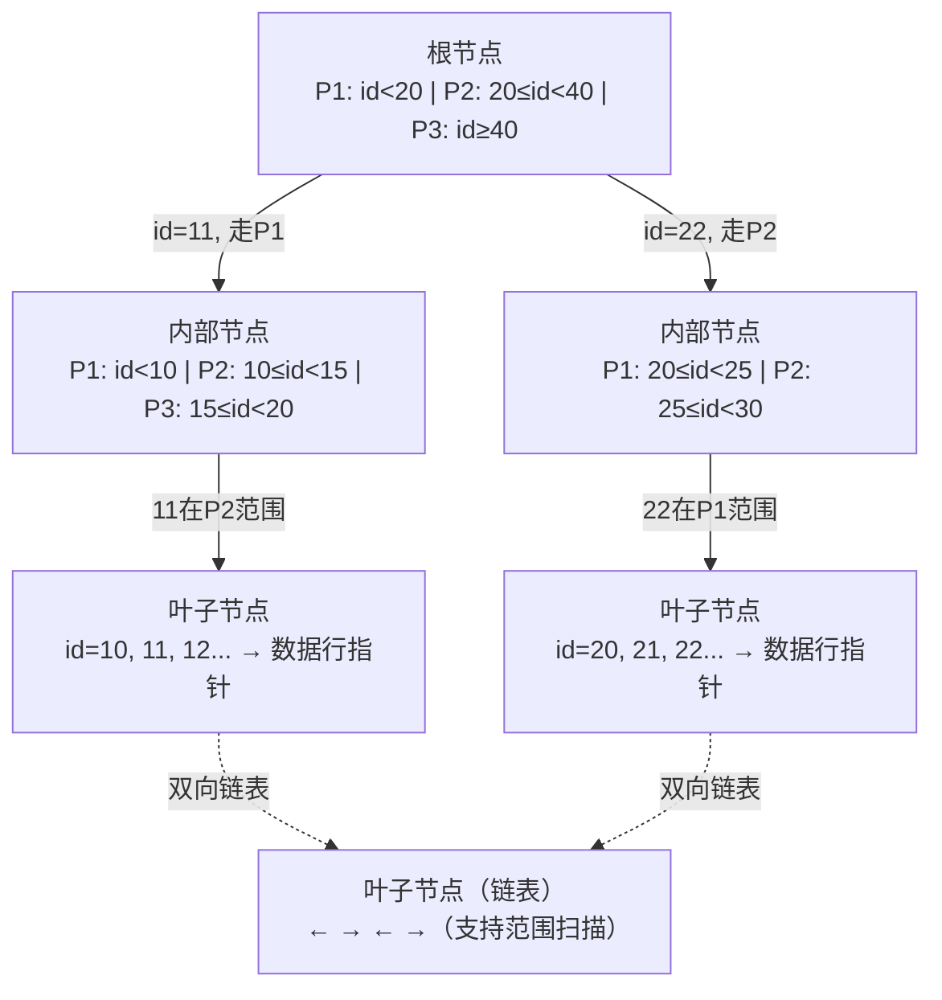

**查询 `WHERE id = 22` 的路径：** 根节点 → 内部节点（走20≤id<40分支）→ 叶子节点 → 找到数据指针 → 共 3 次 I/O（树高决定）
````

- [ ] **Step 2: 追加回表 vs 覆盖索引对比图**

````markdown
### 回表 vs 覆盖索引

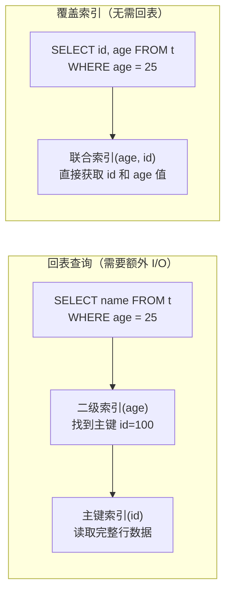

> **优化技巧：** 把 SELECT 列加入联合索引（如 `INDEX(age, name)`），即可避免回表。
````

- [ ] **Step 3: 追加索引失效 6 种场景示例**

````markdown
### 索引失效场景

```sql
-- ❌ 1. 对索引列使用函数
SELECT * FROM t WHERE YEAR(create_time) = 2024;
-- ✅ 改写：WHERE create_time BETWEEN '2024-01-01' AND '2024-12-31'

-- ❌ 2. 隐式类型转换（phone 是 VARCHAR，传入数字）
SELECT * FROM t WHERE phone = 13812345678;
-- ✅ 改写：WHERE phone = '13812345678'

-- ❌ 3. LIKE 前缀通配
SELECT * FROM t WHERE name LIKE '%张';
-- ✅ 改写：WHERE name LIKE '张%'（前缀可走索引）

-- ❌ 4. 违反最左前缀（联合索引 INDEX(a, b, c)）
SELECT * FROM t WHERE b = 1 AND c = 2;  -- 跳过了 a
-- ✅ 改写：WHERE a = 1 AND b = 1 AND c = 2

-- ❌ 5. 范围查询右侧列失效
SELECT * FROM t WHERE a = 1 AND b > 5 AND c = 2;
-- c 上的索引失效，因为 b 是范围查询

-- ❌ 6. OR 连接非索引列
SELECT * FROM t WHERE id = 1 OR name = '张三';
-- name 无索引时，整个查询走全表扫描
```
````

- [ ] **Step 4: 验证并提交**

```bash
git add docs/databases/indexing.md
git commit -m "docs: add B+ tree query path, covering index comparison, index failure examples"
```

---

### Task 3: 丰富 redis.md

**Files:**
- Modify: `docs/databases/redis.md`

- [ ] **Step 1: 追加 Redis 部署方案演进图**

在 `## 高可用` 或 `## 集群` 相关章节后追加：

````markdown
### 三种高可用方案演进


| 方案 | 数据量 | 高可用 | 自动切换 | 适用场景 |
|------|--------|--------|----------|---------|
| 单机 | < 内存上限 | ❌ | ❌ | 开发/测试 |
| 主从复制 | < 内存上限 | 部分（需手动切换） | ❌ | 读多写少 |
| Sentinel | < 内存上限 | ✅ | ✅ | 中等规模生产 |
| Cluster | TB 级别 | ✅ | ✅ | 大规模生产 |

**Cluster 槽位分配：**

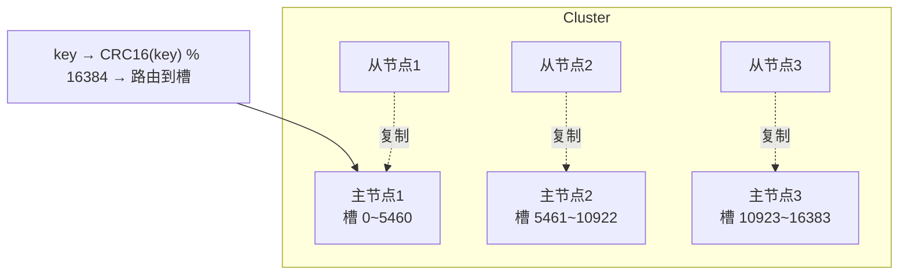
````

- [ ] **Step 2: 追加缓存三大问题流程图**

````markdown
### 缓存三大问题与解决方案

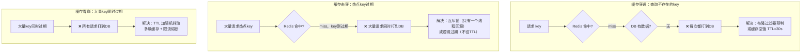
````

- [ ] **Step 3: 追加 RDB vs AOF 时间轴对比**

````markdown
### RDB vs AOF 持久化对比

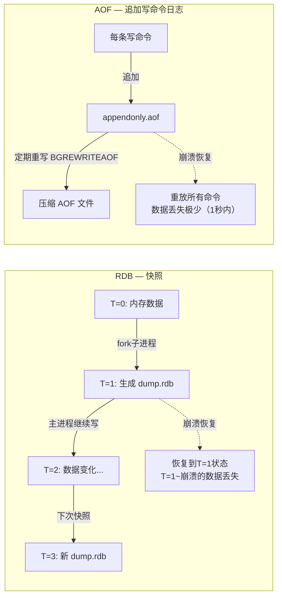

| 维度 | RDB | AOF |
|------|-----|-----|
| 文件大小 | 小（二进制压缩快照） | 大（文本命令日志） |
| 数据丢失 | 多（两次快照之间） | 少（最多1秒，取决于fsync策略） |
| 恢复速度 | 快 | 慢（需重放命令） |
| 性能影响 | fork时短暂阻塞 | 轻微（后台线程追加） |
| 推荐场景 | 对丢失容忍，重视恢复速度 | 金融等不能丢数据场景 |

**生产建议：** 同时开启 RDB + AOF，崩溃恢复优先使用 AOF（数据更完整），同时保留 RDB 作为备份。
````

- [ ] **Step 4: 验证并提交**

```bash
git add docs/databases/redis.md
git commit -m "docs: add Redis deployment evolution, cache problems flowchart, RDB/AOF comparison"
```

---

### Task 4: 丰富 mysql-architecture.md

**Files:**
- Modify: `docs/databases/mysql-architecture.md`

- [ ] **Step 1: 追加 redo log / binlog 两阶段提交时序图**

在现有内容末尾（思考题之前）追加：

````markdown
### redo log 与 binlog 两阶段提交

InnoDB 使用"两阶段提交"协议保证 redo log 和 binlog 的一致性：

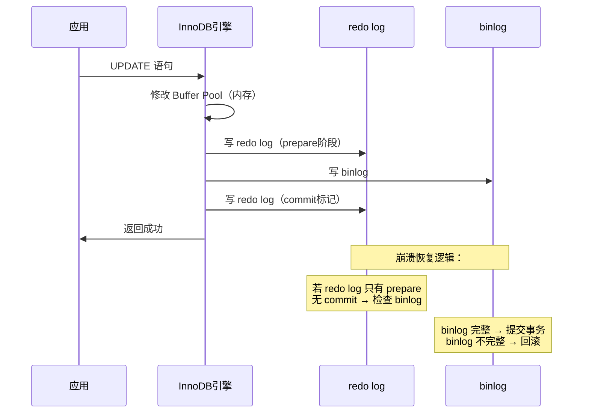

**为什么需要两阶段提交？**  
若不使用两阶段提交，binlog 和 redo log 可能不一致：主库用 redo log 崩溃恢复，从库用 binlog 重放，导致主从数据不一致。

### Buffer Pool 改进版 LRU

InnoDB 将 LRU 链表分为**冷区（37%）**和**热区（63%）**，避免全表扫描污染热数据：

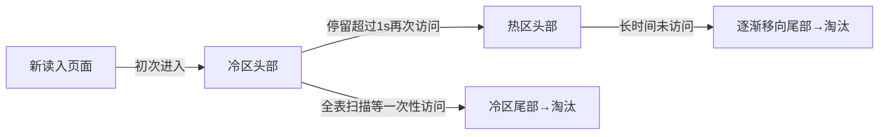
````

- [ ] **Step 2: 扩充 Q&A 到5题**

在现有 Q&A 节末尾追加：

````markdown
**Q: SELECT * 和 SELECT 指定列有什么区别？**

A: 性能角度：`SELECT *` 无法使用覆盖索引（除非索引包含所有列），总是需要回表读取完整行；`SELECT` 指定列可以利用覆盖索引避免回表，减少 I/O。维护角度：`SELECT *` 会随表结构变化返回更多数据，网络传输和内存消耗更大，生产环境应避免使用。

**Q: 为什么 MySQL 8.0 删除了查询缓存？**

A: 查询缓存看似能提升性能，实际上问题很多：① 只要表有任何写操作，该表相关的所有缓存都会失效，高并发写场景下命中率极低；② 缓存的 key 是完整 SQL 字符串（含空格大小写），稍有不同就无法命中；③ 维护缓存需要全局锁，在多线程高并发下反而成为瓶颈。因此 MySQL 8.0 彻底移除了查询缓存。

**Q: innodb_flush_log_at_trx_commit 三个值的区别？**

A: 控制 redo log 刷盘策略：`0`=每秒刷一次（可能丢1秒数据，性能最好）；`1`=每次提交都刷盘（默认，数据最安全，性能最低）；`2`=每次提交写OS缓冲区，每秒刷盘（OS崩溃才丢数据，折中方案）。

**Q: change buffer 的作用是什么？**

A: change buffer 是 Buffer Pool 的一部分，用于缓存对**普通索引**（非唯一索引）的写操作。当数据页不在内存中时，不直接写磁盘，而是记入 change buffer，等下次该页被读入内存时再合并（merge）。这样可以将多次 I/O 合并为一次，提升写性能。唯一索引不能使用 change buffer，因为写入前必须读页验证唯一性。
````

- [ ] **Step 3: 验证并提交**

```bash
git add docs/databases/mysql-architecture.md
git commit -m "docs: add redo/binlog two-phase commit sequence, Buffer Pool LRU diagram, expand Q&A"
```

---

### Task 5: 丰富 java-concurrency.md

**Files:**
- Modify: `docs/programming-languages/java-concurrency.md`

- [ ] **Step 1: 在 AQS 章节追加状态机图**

找到 `### AQS` 章节，在其现有内容后追加：

````markdown
#### AQS 核心流程图

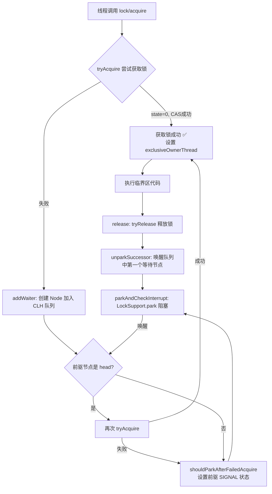

**CLH 队列节点状态（waitStatus）：**

| 状态值 | 含义 |
|--------|------|
| 0 | 初始状态 |
| CANCELLED(1) | 节点因超时或中断被取消，需从队列移除 |
| SIGNAL(-1) | 后继节点需要被唤醒（当前节点释放锁后唤醒它） |
| CONDITION(-2) | 节点在条件队列中等待 |
| PROPAGATE(-3) | 共享模式下，需要传播唤醒 |
````

- [ ] **Step 2: 追加线程池完整执行流程图（替换现有 ASCII 图）**

找到线程池执行流程的 ASCII 图，在其后追加 Mermaid 版本：

````markdown
#### 线程池执行流程（Mermaid 版）

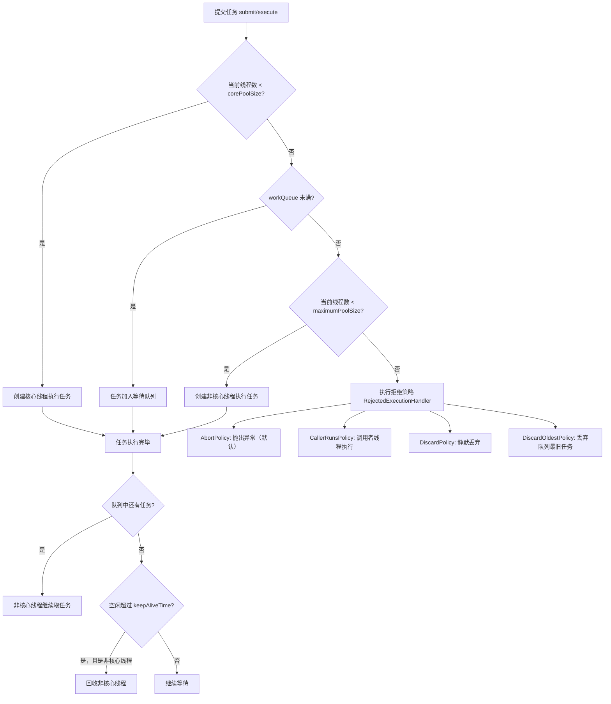
````

- [ ] **Step 3: 追加 CAS + ABA 时序图**

在 `### CAS` 或 `### 原子类` 章节后追加：

````markdown
#### CAS 与 ABA 问题

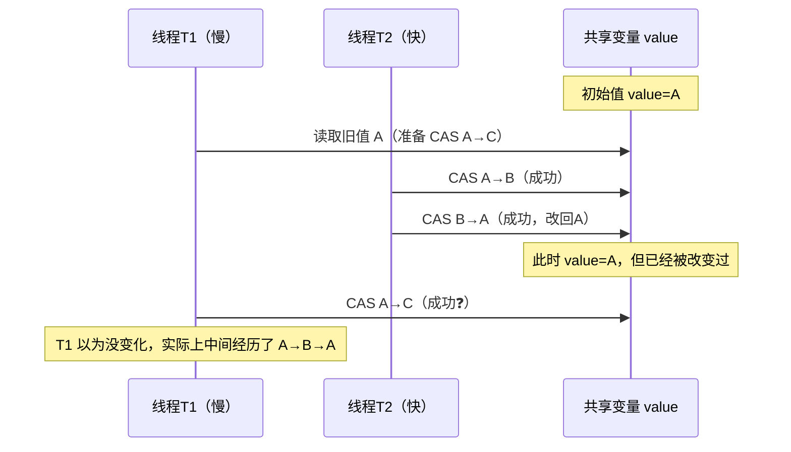

**解决方案 — 版本号（AtomicStampedReference）：**

```java
// 每次修改附带版本戳
AtomicStampedReference<String> ref = new AtomicStampedReference<>("A", 0);

// CAS 时同时检查值和版本
boolean success = ref.compareAndSet("A", "C", 0, 1);
// 即使值回到"A"，版本戳已变为1，不会误判
```
````

- [ ] **Step 4: 追加 ThreadLocal 内存泄漏图**

````markdown
#### ThreadLocal 内存泄漏原理

```mermaid
graph TD
    Thread["Thread 对象"] -->|强引用| TLM["ThreadLocalMap"]
    TLM -->|Entry[] key 弱引用| TL["ThreadLocal 对象"]
    TLM -->|Entry[] value 强引用| Val["Value 对象（业务数据）"]
    GCRoot["GC Root"] -->|无强引用| TL

    TL -.->|被GC回收| NULL["null"]
    NULL -.->|key=null，但value仍被强引用| Val
    Note["内存泄漏：key已null，<br/>value无法被回收"]
    Val --> Note
```

**规避：** 使用完后必须调用 `ThreadLocal.remove()`，尤其在线程池中（线程复用，ThreadLocalMap 长期存在）。
````

- [ ] **Step 5: 验证并提交**

```bash
git add docs/programming-languages/java-concurrency.md
git commit -m "docs: add AQS flowchart, thread pool execution flow, CAS/ABA sequence, ThreadLocal leak diagram"
```

---

### Task 6: 丰富 jvm-internals.md

**Files:**
- Modify: `docs/programming-languages/jvm-internals.md`

- [ ] **Step 1: 追加 GC 算法演进对比和 G1 Region 图**

在现有内容末尾追加：

````markdown
### GC 算法对比与选型

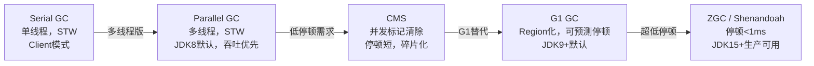

| GC 算法 | 停顿时间 | 吞吐量 | 适用场景 | JDK默认 |
|---------|---------|--------|---------|---------|
| Serial | 高 | 低 | 单核Client | - |
| Parallel | 中（多线程STW） | 高 | 吞吐优先，批处理 | JDK8 |
| CMS | 低 | 中 | 响应时间优先，旧代 | 已废弃 |
| G1 | 可预测（默认200ms内） | 中 | 大堆（>4G），通用 | JDK9+ |
| ZGC | <1ms | 中 | 超大堆，延迟敏感 | JDK21可选 |

#### G1 Region 内存布局

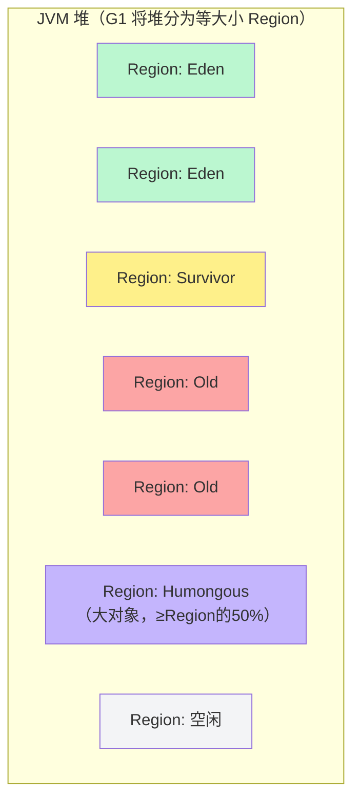

**G1 的优势：** 每次 GC 只回收部分 Region（优先回收垃圾最多的 Region），通过控制回收 Region 数量来满足停顿时间目标（`-XX:MaxGCPauseMillis=200`）。
````

- [ ] **Step 2: 追加 OOM 诊断流程图**

````markdown
### OOM 三种类型与诊断

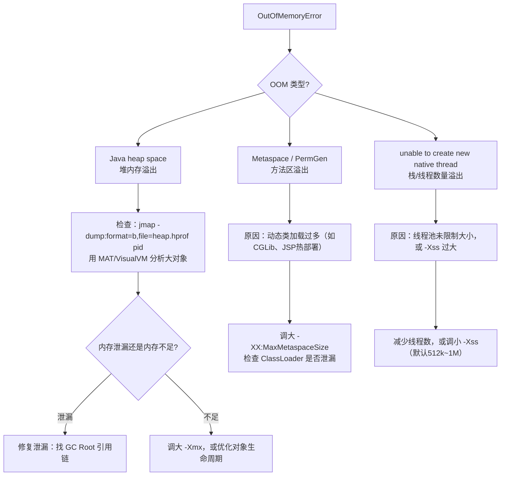

| OOM 类型 | 常见原因 | 诊断工具 |
|----------|---------|---------|
| heap space | 内存泄漏/大对象/堆太小 | jmap + MAT |
| Metaspace | 动态类生成、类加载器泄漏 | jstat -gcmetacapacity |
| native thread | 线程数过多、Xss过大 | `ulimit -u`，jstack |
| Direct buffer | NIO DirectBuffer未释放 | `jcmd pid VM.native_memory` |
````

- [ ] **Step 3: 追加 JIT 逃逸分析说明**

````markdown
### JIT 编译与逃逸分析

**逃逸分析：** JIT 判断对象是否会"逃逸"出方法/线程范围，若不逃逸则做优化：

```java
// 逃逸分析示例
public int compute() {
    // Point 只在方法内使用，不逃逸 → JIT 可以栈分配
    Point p = new Point(1, 2);
    return p.x + p.y;
}

// 以下情况 Point 会逃逸，无法优化：
public Point getPoint() {
    return new Point(1, 2); // 返回给调用者，逃逸到方法外
}
```

| 优化类型 | 条件 | 效果 |
|---------|------|------|
| 栈上分配 | 对象不逃逸出方法 | 避免堆分配，减少GC压力 |
| 标量替换 | 对象不逃逸 | 拆解对象字段为独立变量，直接用寄存器 |
| 同步消除 | 锁对象不逃逸出线程 | 消除 synchronized 锁（无竞争则无需加锁） |

**开启/查看：** `-XX:+DoEscapeAnalysis`（JDK7+默认开启），`-XX:+PrintEscapeAnalysis` 查看分析结果。
````

- [ ] **Step 4: 验证并提交**

```bash
git add docs/programming-languages/jvm-internals.md
git commit -m "docs: add GC algorithm comparison, G1 Region layout, OOM diagnosis flowchart, JIT escape analysis"
```

---

### Task 7: 丰富 tcp-udp.md

**Files:**
- Modify: `docs/computer-networks/tcp-udp.md`

- [ ] **Step 1: 追加 TCP 完整状态机图**

在现有握手/挥手内容后追加：

````markdown
### TCP 完整连接状态机

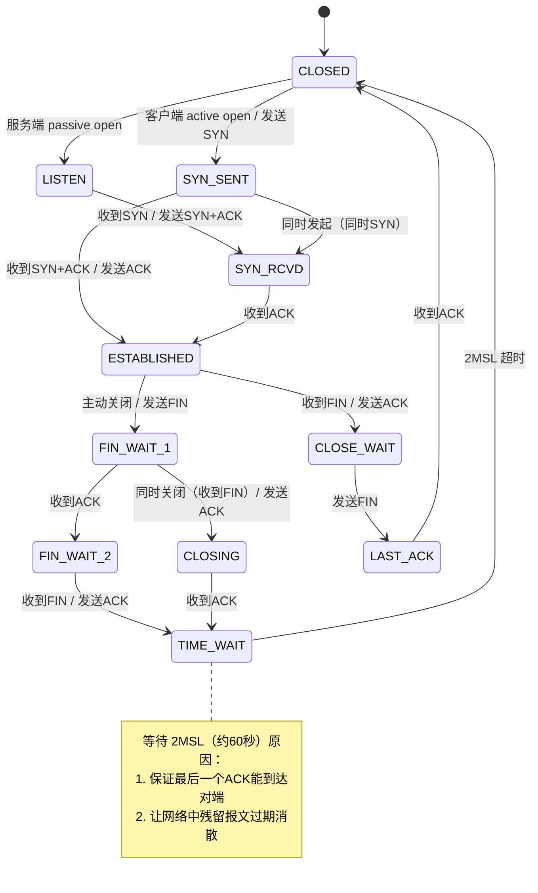
````

- [ ] **Step 2: 追加滑动窗口图**

````markdown
### 滑动窗口原理

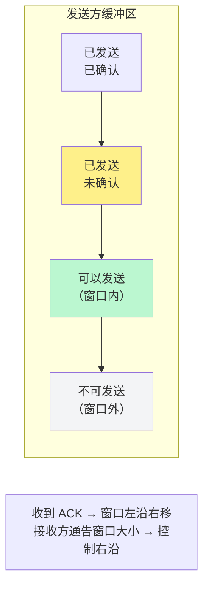

**发送窗口大小 = min(拥塞窗口 cwnd, 接收窗口 rwnd)**

- `rwnd`（接收窗口）：接收方能接受的字节数，防止发送方撑爆接收方缓冲区（**流量控制**）
- `cwnd`（拥塞窗口）：根据网络状况动态调整，防止撑爆网络（**拥塞控制**）
````

- [ ] **Step 3: 追加拥塞控制四阶段图**

````markdown
### 拥塞控制四阶段

```mermaid
graph TD
    A["慢启动 Slow Start<br/>cwnd = 1 MSS<br/>每收到ACK，cwnd×2（指数增长）"]
    B["拥塞避免 Congestion Avoidance<br/>cwnd ≥ ssthresh<br/>每个RTT，cwnd+1 MSS（线性增长）"]
    C["快速重传 Fast Retransmit<br/>收到3个重复ACK<br/>立即重传丢失包"]
    D["快速恢复 Fast Recovery<br/>ssthresh = cwnd/2<br/>cwnd = ssthresh + 3<br/>继续拥塞避免"]
    E["超时重传<br/>ssthresh = cwnd/2<br/>cwnd = 1 MSS<br/>重新慢启动"]

    A -->|cwnd 达到 ssthresh| B
    B -->|收到3个重复ACK| C
    C --> D
    D --> B
    B -->|超时| E
    A -->|超时| E
    E --> A

    style A fill:#dbeafe
    style B fill:#dcfce7
    style C fill:#fef9c3
    style D fill:#fce7f3
    style E fill:#fee2e2
```

| 事件 | ssthresh | cwnd |
|------|---------|------|
| 初始 | 系统默认（如64KB） | 1 MSS |
| cwnd < ssthresh | 不变 | 每ACK × 2 |
| cwnd ≥ ssthresh | 不变 | 每RTT + 1 |
| 3重复ACK | cwnd/2 | ssthresh + 3 |
| 超时 | cwnd/2 | 1 MSS |
````

- [ ] **Step 4: 验证并提交**

```bash
git add docs/computer-networks/tcp-udp.md
git commit -m "docs: add TCP full state machine, sliding window diagram, congestion control four-phase graph"
```

---

### Task 8: 丰富 http-https.md

**Files:**
- Modify: `docs/computer-networks/http-https.md`

- [ ] **Step 1: 追加 TLS 1.2 握手时序图**

在 TLS 握手章节后追加：

````markdown
### TLS 1.2 握手详细时序

```mermaid
sequenceDiagram
    participant C as 客户端
    participant S as 服务器

    rect rgb(219, 234, 254)
        Note over C,S: 第一个 RTT
        C->>S: ① ClientHello<br/>（TLS版本、随机数C、支持的密码套件列表）
        S->>C: ② ServerHello<br/>（选定密码套件、随机数S）
        S->>C: ③ Certificate<br/>（服务器证书）
        S->>C: ④ ServerHelloDone
    end

    rect rgb(220, 252, 231)
        Note over C,S: 第二个 RTT
        C->>C: 验证证书链（CA签名→根证书）
        C->>S: ⑤ ClientKeyExchange<br/>（Pre-Master Secret，用服务器公钥加密）
        C->>S: ⑥ ChangeCipherSpec（后续用对称加密）
        C->>S: ⑦ Finished（加密，含握手摘要）
        S->>C: ⑧ ChangeCipherSpec
        S->>C: ⑨ Finished（加密，含握手摘要）
    end

    Note over C,S: 握手完成，后续用对称密钥加密通信（2-RTT）

    C->>S: ⑩ HTTP 请求（加密）
    S->>C: ⑪ HTTP 响应（加密）
```

> **TLS 1.3 优化为 1-RTT**：将 KeyExchange 移到第一个 RTT（使用 ECDHE），大幅减少握手延迟。
````

- [ ] **Step 2: 追加证书链验证图**

````markdown
### 证书链验证流程

```mermaid
graph TD
    A["根证书 Root CA<br/>（浏览器/OS预置，自签名）"]
    B["中间证书 Intermediate CA<br/>（由Root CA签发）"]
    C["服务器证书 End Entity<br/>（由中间CA签发，含域名）"]

    A -->|签发并签名| B
    B -->|签发并签名| C

    V1["① 浏览器收到服务器证书"]
    V2["② 找到签发者：中间CA<br/>验证签名（用中间CA公钥）"]
    V3["③ 找到中间CA签发者：根CA<br/>验证签名（用根CA公钥）"]
    V4["④ 根CA在本地信任库中？<br/>→ 验证通过 ✅"]

    V1 --> V2 --> V3 --> V4

    style A fill:#fef08a
    style B fill:#d1fae5
    style C fill:#dbeafe
```

**证书包含的关键信息：** 域名（Subject）、公钥、有效期、签发者、签名算法、CA数字签名。
````

- [ ] **Step 3: 追加 HTTP 缓存决策树**

````markdown
### HTTP 缓存决策树

```mermaid
flowchart TD
    A[浏览器发起请求] --> B{本地有缓存?}
    B -->|无| Z[直接请求服务器]
    B -->|有| C{强缓存是否有效?}

    C -->|Cache-Control: max-age 未过期<br/>或 Expires 未过期| D[✅ 强缓存命中<br/>直接使用缓存，状态码 200]
    C -->|已过期| E{有协商缓存标识?}

    E -->|有 ETag| F["发送 If-None-Match: ETag值"]
    E -->|有 Last-Modified| G["发送 If-Modified-Since: 时间"]

    F --> H{服务器对比 ETag}
    G --> H

    H -->|资源未变化| I[✅ 协商缓存命中<br/>304 Not Modified，使用缓存]
    H -->|资源已变化| J[❌ 返回新资源<br/>200 + 新缓存头]

    style D fill:#dcfce7
    style I fill:#dcfce7
    style J fill:#fee2e2
```

| 缓存头 | 类型 | 优先级 | 说明 |
|--------|------|--------|------|
| `Cache-Control: max-age=3600` | 强缓存 | 最高 | HTTP/1.1，相对时间，推荐 |
| `Expires: Wed, 21 Oct 2024` | 强缓存 | 次之 | HTTP/1.0，绝对时间，受客户端时钟影响 |
| `ETag: "abc123"` | 协商缓存 | 高 | 基于内容哈希，精确但有计算开销 |
| `Last-Modified: Mon, 01 Jan` | 协商缓存 | 低 | 基于修改时间，精度只到秒级 |
````

- [ ] **Step 4: 追加 HTTP/1.1 vs 2 vs 3 队头阻塞对比图**

````markdown
### 队头阻塞（Head-of-Line Blocking）对比

```mermaid
graph TD
    subgraph HTTP11["HTTP/1.1 — 请求级别阻塞"]
        R1["请求1 → 响应1 → 请求2 → 响应2<br/>（串行，请求2必须等响应1返回）"]
    end

    subgraph HTTP2["HTTP/2 — 解决HTTP层阻塞，仍有TCP层阻塞"]
        R2["帧1 帧3 帧5（请求A）<br/>帧2 帧4 帧6（请求B）<br/>TCP层：一个包丢失，所有流都阻塞"]
    end

    subgraph HTTP3["HTTP/3 — 彻底解决"]
        R3["QUIC 流独立，流A丢包<br/>不影响流B的传输"]
    end
```

**根本原因：** HTTP/2 多路复用在应用层解决了队头阻塞，但共用一条 TCP 连接，TCP 可靠性保证导致一个包丢失会阻塞该连接上所有流。HTTP/3 改用 QUIC（UDP上实现的可靠传输），每个流独立处理丢包重传。
````

- [ ] **Step 5: 验证构建**

```bash
cd c:/Users/liuku/project/ai-playground/dev-interview-guide
npx vitepress build docs 2>&1 | tail -10
```
预期：`build complete`，无 error

- [ ] **Step 6: 提交**

```bash
git add docs/computer-networks/http-https.md
git commit -m "docs: add TLS 1.2 handshake sequence, certificate chain, HTTP caching decision tree, HOL blocking comparison"
```

---

## 执行顺序建议

Tasks 1-4（数据库板块）、Tasks 5-6（Java板块）、Tasks 7-8（网络板块）三组可并行执行，组内按序执行。

## 完成标准

- `npx vitepress build docs` 无报错
- 所有 Mermaid 图在本地预览中正常渲染
- 新增内容格式与现有文件风格一致
