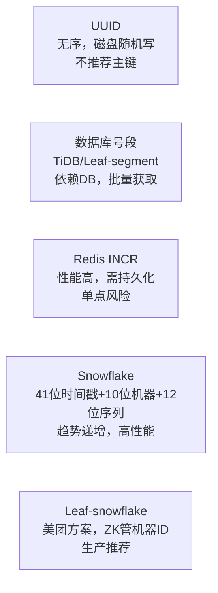
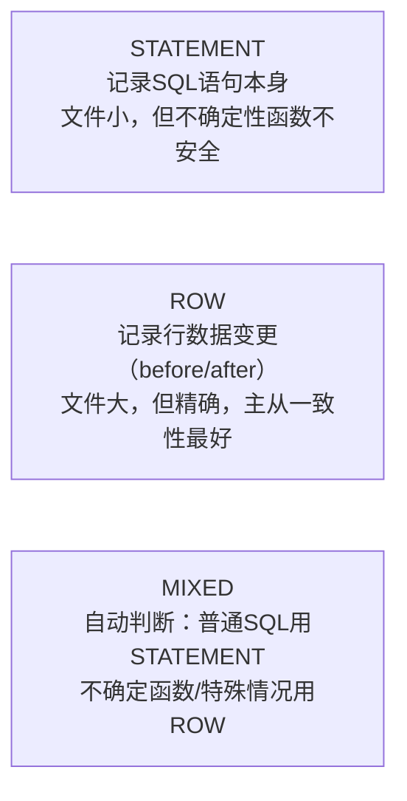
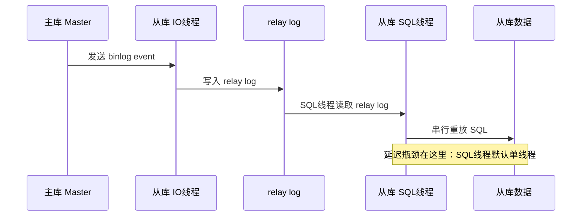
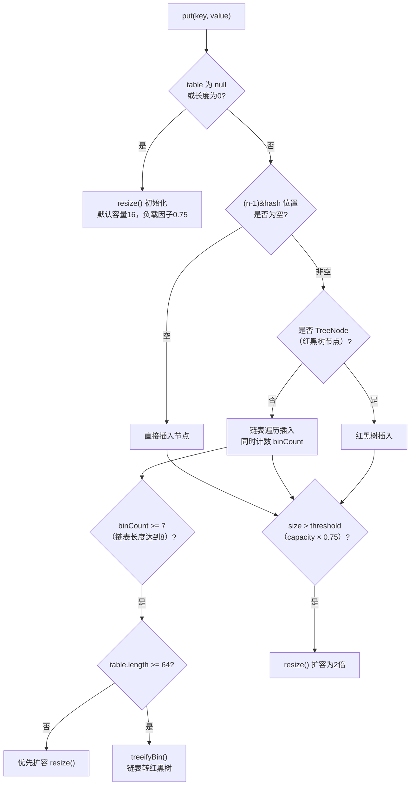
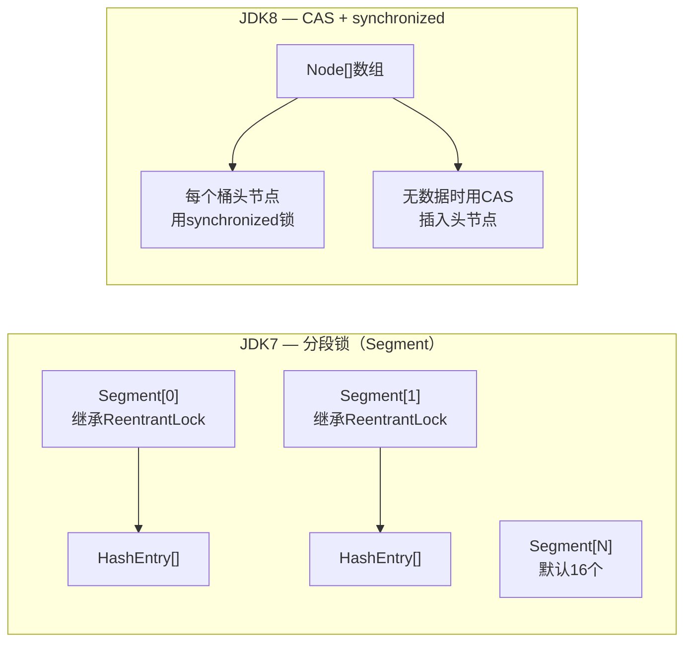
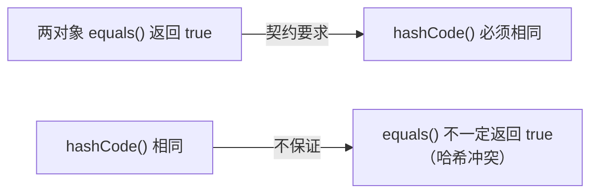
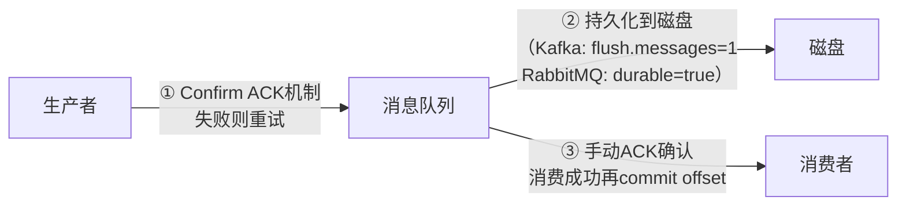
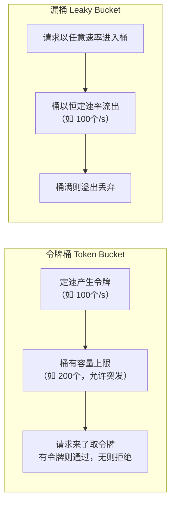

# 面试例题深度丰富实施计划

> **For agentic workers:** REQUIRED SUB-SKILL: Use superpowers:subagent-driven-development or superpowers:executing-plans to implement this plan task-by-task.

**Goal:** 为9个核心文件补充高频面试Q&A例题、EXPLAIN解读、代码示例、对比图表，从面试实战角度深化内容。

**Architecture:** 每个任务在已有文件末尾/思考题节内追加内容，不修改已有内容。

**Tech Stack:** VitePress Markdown + Mermaid + SQL/Java代码块

---

## 文件映射

| 任务 | 文件 | 新增内容 |
|------|------|---------|
| Task 1 | `docs/databases/sharding.md` | 全局ID方案对比、分页深翻页优化、在线扩容三阶段 |
| Task 2 | `docs/databases/mysql-logs.md` | binlog三格式对比、主从延迟图解、redo/binlog区别 |
| Task 3 | `docs/databases/sql-optimization.md` | EXPLAIN字段全解析、type级别排序、大表分页优化 |
| Task 4 | `docs/programming-languages/java-collections.md` | HashMap扩容/红黑树、ConcurrentHashMap JDK7→8演进、死循环原因 |
| Task 5 | `docs/programming-languages/java-fundamentals.md` | String不可变性、equals/hashCode契约、自动装箱陷阱 |
| Task 6 | `docs/engineering-practice/redis.md` | Redis限流Lua实现、Redis Stream消息队列、集群/Sentinel补充 |
| Task 7 | `docs/system-design/message-queue.md` | 消息不丢失三保证、顺序消息实现、事务消息RocketMQ半消息 |
| Task 8 | `docs/system-design/rate-limiting.md` | 令牌桶vs漏桶对比图、分布式限流Redis Lua、Sentinel vs Hystrix |
| Task 9 | `docs/programming-languages/java-modern-features.md` | 扩充Q&A：Records面试题、Sealed Class、Pattern Matching、Virtual Threads实战 |

---

### Task 1: 丰富 sharding.md

**Files:**
- Modify: `docs/databases/sharding.md`

- [ ] **Step 1: 读文件，找到插入位置**（`## 思考题` 前或文件末尾）

- [ ] **Step 2: 在插入位置追加以下内容**

````markdown
## 深度图解与高频面试题

### 全局唯一ID方案对比

分库分表后不能再依赖数据库自增主键，常见全局ID方案：



| 方案 | 有序性 | 性能 | 依赖 | 推荐场景 |
|------|--------|------|------|---------|
| UUID | ❌ 随机 | 高 | 无 | 非主键场景 |
| DB号段 | ✅ 趋势 | 中 | MySQL | 中小规模 |
| Redis INCR | ✅ 趋势 | 高 | Redis | 对DB依赖敏感 |
| Snowflake | ✅ 趋势 | 极高 | 机器时钟 | **生产首选** |

**Snowflake结构（64位）：**
```
0 | 41位毫秒时间戳 | 5位数据中心 | 5位机器ID | 12位序列号
```
- 可用69年，单机每毫秒4096个ID
- **注意：时钟回拨问题**——NTP时钟同步导致时间倒退，解决：等待、使用备用号段、或引入逻辑时钟

---

### 深翻页优化

分库分表后 `LIMIT 100000, 20` 性能极差：

```sql
-- ❌ 深翻页（扫描100020行后丢弃）
SELECT * FROM orders ORDER BY id LIMIT 100000, 20;

-- ✅ 方案1：游标法（记住上次最大ID）
SELECT * FROM orders WHERE id > 100000 ORDER BY id LIMIT 20;

-- ✅ 方案2：覆盖索引子查询（先用索引定位，再回表）
SELECT * FROM orders o
JOIN (SELECT id FROM orders ORDER BY id LIMIT 100000, 20) t
ON o.id = t.id;
```

**面试回答思路：** 业务上禁止任意翻页（只允许前后翻），深翻页使用游标，搜索场景引入 Elasticsearch。

---

### 高频面试Q&A

**Q: 分库分表后如何做跨库JOIN？**

A: 四种方案：① **字段冗余**——将关联表常用字段冗余到主表，避免JOIN（最常用）；② **字典表广播**——小维度表（城市、品类）在每个库中全量复制；③ **应用层聚合**——分别查询两个库的数据，在应用层拼接；④ **引入ES/搜索引擎**——复杂关联查询交由 ES 处理。选择依据：数据量大小、一致性要求、查询频率。

**Q: 分库分表后如何不停机扩容（从4库扩8库）？**

A: 三阶段方案：
1. **双写阶段**：新旧两套库同时写，新库追历史数据（通过binlog同步）
2. **数据校验**：比对新旧库数据一致性，通过后切读流量
3. **切换阶段**：停写旧库，切写流量到新库，验证无误后下线旧库

关键点：双写期间路由逻辑不能变，确保幂等写入；整个过程对业务透明。

**Q: 如何选择分片键？**

A: 三个核心原则：① **高基数**——分片键值域尽量大，避免数据倾斜（不要用性别、状态等低基数字段）；② **均匀分布**——使用哈希分片时，分片键哈希值要均匀；③ **业务相关性**——尽量与最常见的查询条件一致（如用户ID按用户维度分片，订单ID按用户ID分片），避免跨库查询。

**Q: 什么是热点问题？如何解决？**

A: 热点指某些分片数据量/请求量远超其他分片。原因：分片键选择不当（如时间戳导致新数据集中在某一片）、某些用户/商品特别活跃。解决方案：① 对热点KEY加随机后缀（1~N）分散到多个分片，查询时合并结果；② 大V/爆款商品单独处理（特殊路由）；③ 引入缓存层减少DB压力。
````

- [ ] **Step 3: 提交**

```bash
git add docs/databases/sharding.md
git commit -m "docs: add global ID comparison, deep pagination optimization, sharding interview Q&A"
```

---

### Task 2: 丰富 mysql-logs.md

**Files:**
- Modify: `docs/databases/mysql-logs.md`

- [ ] **Step 1: 读文件，找到插入位置**

- [ ] **Step 2: 追加以下内容**

````markdown
## 深度图解与高频面试题

### binlog 三种格式对比



| 格式 | 文件大小 | 主从一致性 | 可读性 | 推荐场景 |
|------|---------|-----------|--------|---------|
| STATEMENT | 小 | ❌（UUID/NOW()不安全） | 好 | 调试 |
| ROW | 大 | ✅ | 差（需工具解析） | **生产推荐** |
| MIXED | 中 | 基本可靠 | 中 | 兼容旧系统 |

> MySQL 5.7.7+ 默认 ROW 格式。ROW 格式下每行变更都记录前后镜像，数据恢复和主从复制最可靠。

---

### redo log vs binlog 核心区别

| 维度 | redo log | binlog |
|------|---------|--------|
| 所属层次 | InnoDB 引擎层 | MySQL Server 层（所有引擎共享） |
| 内容 | 物理日志（数据页的变化） | 逻辑日志（SQL或行变化） |
| 写入方式 | 循环写（固定大小文件，会覆盖） | 追加写（每次写新文件，不覆盖） |
| 主要用途 | **崩溃恢复**（crash recovery） | **主从同步**、数据恢复、审计 |
| 幂等性 | 幂等（重放同一条安全） | 不一定（STATEMENT格式不幂等） |

---

### 主从复制延迟分析



**主从延迟的原因与解决方案：**

| 原因 | 解决方案 |
|------|---------|
| SQL线程单线程重放 | 开启**并行复制**（`slave_parallel_workers > 0`，MySQL 5.7+） |
| 主库大事务（如批量DELETE） | 拆分大事务为小事务 |
| 从库机器性能差 | 升级从库硬件，SSD化 |
| 网络延迟 | 就近部署，专线连接 |
| 从库承担大量读流量 | 读写分离，增加从库数量 |

---

### 高频面试Q&A

**Q: 什么是GTID？有什么优势？**

A: GTID（Global Transaction Identifier）是每个已提交事务的全局唯一标识，格式为 `source_id:transaction_id`。优势：① **简化主从切换**——新主库不需要指定binlog文件名和位置（`CHANGE MASTER TO MASTER_AUTO_POSITION=1`）；② **自动跳过重复事务**——GTID已执行过的事务不会再次执行，避免数据重复；③ **便于追踪**——可以精确追踪每个事务在哪个库上执行。

**Q: undo log 有什么作用？**

A: undo log（回滚日志）有两个核心作用：① **事务回滚**——记录数据修改前的值，事务失败时按 undo log 逆向还原；② **MVCC快照读**——为 ReadView 提供历史版本数据，实现非锁定读（每行数据通过 `roll_pointer` 串联成版本链，读取时按 ReadView 规则找到对应历史版本）。undo log 存储在 ibdata 文件或独立的 undo tablespace（MySQL 5.6+）。

**Q: MySQL如何保证崩溃恢复后数据不丢失？**

A: 通过 redo log 的 WAL（Write-Ahead Logging）机制：事务提交前必须先将 redo log 刷到磁盘（`innodb_flush_log_at_trx_commit=1`），即使数据页还在 Buffer Pool 内存中。崩溃恢复时：① 读取 redo log，重放未落盘的已提交事务（前滚）；② 通过 undo log 回滚未提交的事务。结合两阶段提交（redo log prepare → binlog → redo log commit），保证 redo log 和 binlog 一致。
````

- [ ] **Step 3: 提交**

```bash
git add docs/databases/mysql-logs.md
git commit -m "docs: add binlog format comparison, replication lag diagram, undo/redo interview Q&A"
```

---

### Task 3: 丰富 sql-optimization.md

**Files:**
- Modify: `docs/databases/sql-optimization.md`

- [ ] **Step 1: 读文件，找到插入位置**

- [ ] **Step 2: 追加以下内容**

````markdown
## 深度图解与高频面试题

### EXPLAIN 输出字段全解析

```sql
EXPLAIN SELECT * FROM orders o
JOIN users u ON o.user_id = u.id
WHERE o.status = 1 AND u.city = '北京';
```

| 字段 | 含义 | 好 → 差 |
|------|------|---------|
| **type** | 访问类型 | system > const > eq_ref > **ref** > range > index > **ALL（全表扫描，需优化）** |
| **key** | 实际使用的索引 | 有值（命中索引） > NULL（未命中） |
| **rows** | 估算扫描行数 | 越小越好 |
| **Extra** | 额外信息 | `Using index`（覆盖索引✅） > `Using where` > `Using filesort`（❌需优化） > `Using temporary`（❌最差） |

**type 字段含义速查：**

| type值 | 含义 | 触发条件 |
|--------|------|---------|
| const | 主键或唯一索引等值查询，最多1行 | `WHERE id = 1` |
| eq_ref | 联表时主键/唯一索引匹配，每行最多1个 | JOIN ON 主键 |
| ref | 非唯一索引等值查询 | `WHERE status = 1`（有索引） |
| range | 索引范围扫描 | `WHERE id BETWEEN 1 AND 100` |
| index | 全索引扫描（比ALL少IO） | 覆盖索引但需扫全部 |
| ALL | 全表扫描 | 无可用索引 |

---

### 大表分页深翻页优化

```sql
-- ❌ 原始写法：扫描100020行后丢弃前100000行
SELECT id, title, created_at FROM articles
ORDER BY created_at DESC LIMIT 100000, 20;

-- ✅ 方案1：游标法（需要前端传递上次最后一条的ID）
SELECT id, title, created_at FROM articles
WHERE created_at < '2024-01-01 12:00:00'   -- 上次最后一条的时间
ORDER BY created_at DESC LIMIT 20;

-- ✅ 方案2：覆盖索引子查询（仅用索引定位ID，再回表）
SELECT a.* FROM articles a
INNER JOIN (
    SELECT id FROM articles
    ORDER BY created_at DESC LIMIT 100000, 20
) t ON a.id = t.id;
-- 子查询只走覆盖索引，避免大量回表
```

---

### 高频面试Q&A

**Q: count(\*)、count(1)、count(主键)、count(列名) 有什么区别？**

A: 性能上 `count(*)` ≈ `count(1)` > `count(主键)` > `count(列名)`。具体区别：
- `count(*)`：MySQL 8.0 已优化，不取具体列值，直接统计行数（InnoDB 走二级索引，比全表快）
- `count(1)`：与 `count(*)` 等价，性能相同
- `count(主键)`：取主键值判断不为NULL，略慢于 `count(*)`
- `count(列名)`：只统计该列不为NULL的行数，语义不同，且无法利用部分优化

**Q: 如何定位慢SQL？**

A: 三步走：① **开启慢查询日志**（`slow_query_log=ON, long_query_time=1`），记录超过阈值的SQL；② **用 EXPLAIN 分析执行计划**，重点看 type（是否全表扫描）、key（是否命中索引）、Extra（是否有 filesort/temporary）；③ **用 `SHOW PROFILE` 或 Performance Schema** 分析各阶段耗时（sending data、sorting result 等）。常见优化手段：加索引、重写SQL（避免函数操作）、分库分表。

**Q: 为什么不建议使用 `SELECT *`？**

A: 三个原因：① **无法使用覆盖索引**——`SELECT *` 总需要回表，而指定列可能命中覆盖索引；② **网络传输浪费**——返回不必要的列，增加网络带宽和序列化开销；③ **binlog膨胀**（ROW格式）——`SELECT *` 导致UPDATE的前后镜像包含所有字段，binlog文件更大；④ **维护风险**——表结构变更后多出字段，可能导致应用层反序列化异常。

**Q: 一条SQL执行很慢有哪些可能原因？**

A: 分两种情况：
- **偶发性慢**：① 遇到锁等待（`SHOW PROCESSLIST` 看 Waiting for lock）；② flush 操作（redo log 刷盘、buffer pool 脏页刷新）
- **持续性慢**：① 未命中索引（type=ALL）；② 索引失效（函数操作/隐式转换/like前缀通配）；③ 数据量本身太大（需分表）；④ 返回数据量太大（需分页）；⑤ join 顺序不当（大表驱动小表）
````

- [ ] **Step 3: 提交**

```bash
git add docs/databases/sql-optimization.md
git commit -m "docs: add EXPLAIN full field analysis, deep pagination optimization, slow SQL interview Q&A"
```

---

### Task 4: 丰富 java-collections.md

**Files:**
- Modify: `docs/programming-languages/java-collections.md`

- [ ] **Step 1: 读文件，找到插入位置**

- [ ] **Step 2: 追加以下内容**

````markdown
## 深度图解与高频面试题

### HashMap 扩容与红黑树转换



**为什么链表长度>=8才转红黑树？**
根据泊松分布，哈希碰撞8次的概率仅约0.00000006，正常情况几乎不会转换。红黑树节点占用空间是链表节点的2倍，只在碰撞严重时才值得转换。

**为什么扩容是2倍？**
容量始终为2的幂次，使得 `hash % n` 等价于 `hash & (n-1)` 位运算，性能更高；且扩容时节点要么在原位置，要么在原位置+oldCap，只需判断高位bit，无需重新计算hash。

---

### ConcurrentHashMap JDK7 vs JDK8



| 维度 | JDK7 分段锁 | JDK8 CAS+synchronized |
|------|-----------|----------------------|
| 锁粒度 | Segment（默认16个桶一组） | 单个桶（Node数组的一格） |
| 并发度 | 固定16（Segment数量） | 取决于桶数量，更高 |
| 结构 | 数组+链表 | 数组+链表+红黑树 |
| 内存 | 多（Segment对象开销） | 少 |

---

### 高频面试Q&A

**Q: HashMap JDK8 相比 JDK7 有哪些重要改进？**

A: 三点主要改进：① **链表→红黑树**——链表长度超过8且table长度≥64时转为红黑树，查找从O(n)优化到O(log n)；② **尾插法代替头插法**——JDK7头插法在并发扩容时会形成环形链表导致死循环，JDK8改为尾插法（但HashMap本身仍非线程安全）；③ **扩容优化**——不再重新计算hash，只判断高位bit决定节点去留，效率更高。

**Q: HashMap 并发下的死循环是怎么回事？**

A: JDK7中，多线程同时触发扩容时，头插法会导致链表逆序。两个线程同时操作同一条链表时，可能形成环形链表：线程A执行到中途被暂停，线程B完成了扩容并反转了链表，线程A恢复后继续操作，就会让两个节点互相指向，形成环。之后 `get()` 遍历到该位置就会死循环。**JDK8改用尾插法解决了这个问题**，但HashMap本身仍不是线程安全的（并发put可能导致数据丢失）。生产环境应使用ConcurrentHashMap。

**Q: 为什么HashMap的初始容量建议设为2的幂次？**

A: 两个原因：① **位运算替代取模**——槽位计算用 `hash & (capacity-1)` 代替 `hash % capacity`，位运算比取模快约3倍；② **扩容简化**——容量始终是2的幂，扩容时节点位置只需判断 `hash & oldCap` 是0还是1，等于0留原位，等于1移到 `原位置+oldCap`，无需重新计算所有节点的hash。

**Q: LinkedHashMap 和 HashMap 的区别？能用来实现LRU吗？**

A: LinkedHashMap 在 HashMap 基础上额外维护一条**双向链表**，记录插入顺序（默认）或访问顺序（`new LinkedHashMap(capacity, loadFactor, true)` 第三个参数为true时）。通过重写 `removeEldestEntry()` 方法可以实现 LRU 缓存：当 `size > maxCapacity` 时返回true，自动删除链表头部（最久未访问）的元素。时间复杂度 O(1)，是面试中实现LRU的标准答案。
````

- [ ] **Step 3: 提交**

```bash
git add docs/programming-languages/java-collections.md
git commit -m "docs: add HashMap expansion flowchart, ConcurrentHashMap evolution, collections interview Q&A"
```

---

### Task 5: 丰富 java-fundamentals.md

**Files:**
- Modify: `docs/programming-languages/java-fundamentals.md`

- [ ] **Step 1: 读文件，找到插入位置**

- [ ] **Step 2: 追加以下内容**

````markdown
## 深度图解与高频面试题

### String 不可变性与字符串池

```mermaid
flowchart TD
    A["String s1 = \"hello\""] --> B["检查字符串常量池\n是否存在 \"hello\"?"]
    B -->|存在| C["s1 直接指向常量池中的对象"]
    B -->|不存在| D["在常量池创建 \"hello\"\ns1 指向它"]

    E["String s2 = new String(\"hello\")"] --> F["堆中创建新对象\n内部 char[] 指向常量池"]

    G["s1 == s2"]
    G --> H["false\n引用不同（一个常量池，一个堆）"]
    G2["s1.equals(s2)"]
    G2 --> H2["true\n内容相同"]
```

**面试陷阱：**
```java
String s1 = "a" + "b";        // 编译期优化为 "ab"，在常量池
String s2 = new String("a") + new String("b"); // 运行期拼接，在堆上
System.out.println(s1 == s2); // false

s2.intern(); // 将s2对应值放入常量池（JDK7+：若常量池无"ab"，直接把堆对象引用放入池）
String s3 = "ab";
System.out.println(s2 == s3); // JDK7+: true（s3直接复用了s2的堆对象引用）
```

---

### equals 与 hashCode 契约

**为什么重写 equals 必须同时重写 hashCode？**



若只重写 `equals` 不重写 `hashCode`，相同内容的对象 hashCode 不同，放入 HashMap/HashSet 时会定位到不同桶，导致：
```java
Map<Student, String> map = new HashMap<>();
Student s1 = new Student("张三");
map.put(s1, "数学");

Student s2 = new Student("张三"); // 与s1 equals相等
map.get(s2); // 返回 null！因为hashCode不同，找到错误的桶
```

---

### 高频面试Q&A

**Q: String、StringBuilder、StringBuffer 如何选择？**

A：
- **String**：不可变，线程安全。字符串不变或拼接次数极少时使用。
- **StringBuilder**：可变，**非线程安全**，性能最高。单线程大量字符串拼接首选（Java编译器会自动将 `+` 拼接优化为StringBuilder）。
- **StringBuffer**：可变，**线程安全**（方法加了 `synchronized`），性能略低于StringBuilder。多线程共享同一字符串构建场景使用（实际较少见）。
- 性能对比：`StringBuilder` ≈ `StringBuffer` × 2（无锁开销），远快于String的 `+` 循环拼接（每次创建新对象）。

**Q: Integer 的 == 比较有什么陷阱？**

A: Integer 缓存了 **-128 到 127** 范围的对象（`Integer.IntegerCache`），该范围内的 `==` 比较返回true；超出范围会创建新对象，`==` 比较引用，返回false：
```java
Integer a = 127, b = 127;
System.out.println(a == b);  // true（缓存池同一对象）

Integer c = 128, d = 128;
System.out.println(c == d);  // false（超出缓存，不同对象）
System.out.println(c.equals(d)); // true（比较值）
```
**结论：** Integer比较一律用 `equals()` 或先拆箱为int。

**Q: final 关键字有哪些用途？**

A: 三种用途：① **final 类**——不能被继承（如String、Integer），保证不可变性；② **final 方法**——不能被子类重写，防止行为被篡改；③ **final 变量**——引用不可变（对象本身的字段仍可变），用于常量（`static final`）或匿名内部类中使用外部变量（必须是effectively final）。注意：`final` 修饰引用类型时，只保证引用地址不变，对象内部状态仍可修改（如 `final List<String> list` 可以 `list.add()`）。

**Q: 接口和抽象类的区别？JDK8后有什么变化？**

A: 传统区别：接口只能有抽象方法+常量，抽象类可以有实现方法+成员变量；类只能单继承，但可以实现多个接口。JDK8新增：① **default方法**——接口可以有带实现的默认方法，解决接口升级问题（不破坏现有实现类）；② **static方法**——接口可以有静态方法。JDK9新增：③ **private方法**——接口可以有私有方法，供default方法内部复用。
````

- [ ] **Step 3: 提交**

```bash
git add docs/programming-languages/java-fundamentals.md
git commit -m "docs: add String pool diagram, equals/hashCode contract, Java fundamentals interview Q&A"
```

---

### Task 6: 丰富 engineering-practice/redis.md

**Files:**
- Modify: `docs/engineering-practice/redis.md`

- [ ] **Step 1: 读文件，找到插入位置**

- [ ] **Step 2: 追加以下内容**

````markdown
## 深度补充

### Redis 限流实现

**滑动窗口限流（Lua脚本保证原子性）：**

```lua
-- key: 限流key（如 "rate:user:123"）
-- limit: 允许的最大请求数
-- window: 时间窗口（秒）
local key = KEYS[1]
local limit = tonumber(ARGV[1])
local window = tonumber(ARGV[2])
local now = tonumber(ARGV[3])

-- 移除窗口外的旧请求
redis.call('ZREMRANGEBYSCORE', key, 0, now - window * 1000)
-- 统计当前窗口内请求数
local count = redis.call('ZCARD', key)

if count < limit then
    -- 未超限：记录本次请求
    redis.call('ZADD', key, now, now)
    redis.call('PEXPIRE', key, window * 1000)
    return 1  -- 允许
else
    return 0  -- 拒绝
end
```

| 限流算法 | 实现 | 优点 | 缺点 |
|---------|------|------|------|
| 固定窗口 | Redis INCR + EXPIRE | 简单 | 窗口边界突刺 |
| 滑动窗口 | Redis ZSet | 精确，无突刺 | 内存略大 |
| 令牌桶 | Redis + Lua | 允许突发流量 | 实现复杂 |
| 漏桶 | Redis + 队列 | 恒定速率 | 无法处理突发 |

---

### Redis 消息队列方案对比

| 方案 | 实现 | 优点 | 缺点 | 推荐场景 |
|------|------|------|------|---------|
| List + BLPOP | `LPUSH` 生产，`BLPOP` 消费 | 简单，FIFO | 无ACK，消费失败丢消息 | 简单任务队列 |
| Pub/Sub | `PUBLISH`/`SUBSCRIBE` | 实时广播 | 消息不持久化，离线丢失 | 实时通知 |
| **Stream** | `XADD`/`XREADGROUP` | 持久化，消费组，ACK确认 | 内存占用大 | **生产推荐** |

**Stream核心命令：**
```bash
# 生产者：添加消息
XADD orders * user_id 123 amount 99.9

# 消费者组：创建组
XGROUP CREATE orders group1 0

# 消费：读取并ACK
XREADGROUP GROUP group1 consumer1 COUNT 1 STREAMS orders >
XACK orders group1 <message-id>
```

---

### 高频面试Q&A

**Q: 如何用Redis实现一个可靠的分布式锁？**

A: 基本实现用 `SET key value NX EX timeout`（原子操作，不存在才设置+设置超时）。释放时必须用Lua脚本保证原子性（判断value是否是自己的再DELETE，防止误删他人锁）：
```lua
if redis.call('get', KEYS[1]) == ARGV[1] then
    return redis.call('del', KEYS[1])
else return 0 end
```
**生产推荐使用Redisson**：自动实现锁续期（看门狗，默认每10s续30s），支持可重入、公平锁、读写锁。**RedLock（多主节点）** 的争议较大，Martin Kleppmann指出在时钟漂移场景下不安全，建议仅在对安全性要求极高时使用。

**Q: Redis的数据过期是如何实现的？**

A: 两种策略结合：① **惰性删除**——访问key时检查是否过期，过期则删除并返回nil。优点：CPU友好，只在访问时处理；缺点：已过期但未访问的key一直占内存。② **定期删除**——每100ms随机抽取部分设了过期时间的key，删除其中已过期的（默认每次扫描20个，若超过25%已过期则继续扫描）。两种策略结合，兼顾CPU和内存。配合内存淘汰策略（如allkeys-lru），在内存不足时主动淘汰。

**Q: Redis为什么单线程还这么快？**

A: 四个原因：① **纯内存操作**——内存访问时延~100ns，磁盘~10ms，快10万倍；② **单线程避免锁开销**——无需加锁和上下文切换，CPU利用率高；③ **I/O多路复用**——epoll模型，单线程处理大量并发连接，非阻塞；④ **简单的数据结构**——操作多是O(1)，如GET/SET/LPUSH。注意：Redis 6.0+ 引入多线程处理网络I/O（读写请求的解析和返回），但命令执行仍是单线程。
````

- [ ] **Step 3: 提交**

```bash
git add docs/engineering-practice/redis.md
git commit -m "docs: add Redis rate limiting Lua, Stream comparison, distributed lock and expiry interview Q&A"
```

---

### Task 7: 丰富 system-design/message-queue.md

**Files:**
- Modify: `docs/system-design/message-queue.md`

- [ ] **Step 1: 读文件，找到 `## 思考题` 节**

- [ ] **Step 2: 在思考题节内已有内容后追加以下Q&A**

````markdown
**Q: 如何保证消息不丢失（三端保证）？**

A: 消息全链路分三段，每段都要保证：



① **生产者**：开启 Confirm 机制（RabbitMQ）或等待 `acks=all`（Kafka），发送失败触发重试+幂等（Kafka enable.idempotence=true）；② **Broker**：开启持久化，Kafka设 `replication.factor>=3` + `min.insync.replicas=2`；③ **消费者**：手动提交 offset（Kafka）或手动 ACK（RabbitMQ），消费完成再确认，失败进死信队列（DLQ）重试。

**Q: 如何保证消息的顺序性？**

A: 两个层面：① **全局顺序**——同一Topic只用一个分区/队列（Kafka单Partition，RocketMQ单队列），牺牲并发，极少使用；② **局部顺序**（推荐）——同一业务key的消息路由到同一分区（Kafka按key hash，RocketMQ MessageQueueSelector），同一分区内单线程消费保证顺序。**注意**：消费端不能并发消费同一分区/队列，否则顺序仍然无法保证。

**Q: 如何保证消息幂等（消息不重复消费）？**

A: Broker无法保证不重复投递（网络重试可能导致重复），消费端必须自己保证幂等：
① **唯一消息ID + 幂等表**：消费时将message_id插入数据库唯一索引表，重复消息触发唯一键冲突被忽略；
② **Redis去重**：`SETNX message_id 1 EX 86400`，已处理过返回0直接丢弃；
③ **业务层幂等**：如更新操作加版本号（`UPDATE ... WHERE version = 1 AND status = 'PENDING'`），重复执行影响0行则幂等；
④ **数据库唯一索引兜底**：关键业务（如创建订单）依赖数据库唯一索引防重。

**Q: 什么是事务消息？RocketMQ如何实现？**

A: 事务消息解决"本地事务与消息发送的原子性"问题（如扣减库存成功但消息未发送，或消息发送成功但本地事务回滚）。

RocketMQ半消息机制：
1. **发送半消息**（half message）到Broker，对消费者不可见
2. **执行本地事务**（如扣库存）
3. 本地事务成功 → 发送Commit；失败 → 发送Rollback
4. Broker未收到确认时，**定时回查本地事务状态**（默认最多15次）
5. Commit后消息对消费者可见；Rollback则删除半消息

**Q: 消息积压如何处理？**

A: 紧急方案（临时处理积压）：① 新建Topic，扩大分区数，将积压消息迁移到新Topic，同时扩容消费者数量；② 跳过非关键消息，只消费最新的；③ 临时关闭耗时业务逻辑，让消费者快速消费（如暂停发短信）。根本方案（预防）：根据峰值流量设计分区数和消费者数，监控消费延迟（consumer lag），设置告警阈值自动扩容。
````

- [ ] **Step 3: 提交**

```bash
git add docs/system-design/message-queue.md
git commit -m "docs: add message queue reliability, ordering, idempotency, transaction message interview Q&A"
```

---

### Task 8: 丰富 system-design/rate-limiting.md

**Files:**
- Modify: `docs/system-design/rate-limiting.md`

- [ ] **Step 1: 读文件，找到 `## 思考题` 节**

- [ ] **Step 2: 在思考题节已有内容后追加以下内容**

````markdown
### 令牌桶 vs 漏桶对比图解



| 维度 | 令牌桶 | 漏桶 |
|------|--------|------|
| 突发流量 | ✅ 允许（桶内有令牌可用） | ❌ 不允许（恒定流出速率） |
| 速率控制 | 平均速率受控 | 严格恒定速率 |
| 适用场景 | API限流（允许短时突发） | 流量整形（保护下游恒定处理） |
| 实现 | Guava RateLimiter、Redis Lua | Nginx limit_req |

**Guava RateLimiter（令牌桶）使用：**
```java
RateLimiter limiter = RateLimiter.create(100.0); // 每秒100个令牌

// 阻塞等待获取令牌
limiter.acquire();  

// 非阻塞，超时未获取则返回false
boolean acquired = limiter.tryAcquire(50, TimeUnit.MILLISECONDS);
```

**Q: Sentinel 和 Hystrix 有什么区别？**

A: 两个维度对比：功能和性能。

| 维度 | Sentinel（阿里） | Hystrix（Netflix，已停更） |
|------|-----------------|--------------------------|
| 熔断策略 | 异常比例/RT/异常数 | 异常比例 |
| 限流 | ✅ 多种算法（QPS/并发线程数） | ❌ 仅并发线程数/信号量 |
| 流量整形 | ✅ 匀速排队、预热 | ❌ 不支持 |
| 实时监控 | ✅ Dashboard | ✅ Hystrix Dashboard |
| 规则持久化 | ✅ 支持Nacos/ZK | ❌ 不支持 |
| 性能 | 高（不用线程池隔离） | 中（线程池隔离有开销） |

**国内生产推荐 Sentinel**，功能更完善，与 Spring Cloud Alibaba 生态集成更好。

**Q: 分布式环境下如何实现全局限流？**

A: 三种方案：① **网关集中限流**（推荐）——在 Nginx/Kong/Zuul/Spring Cloud Gateway 统一限流，所有流量经过同一入口，天然全局；② **Redis分布式限流**——各实例通过Redis共享计数器（Lua脚本保证原子性），滑动窗口精确但有网络开销；③ **AP模式近似限流**——各实例本地限流（Sentinel），定期同步到协调节点，允许短暂超限但延迟低。选择：对精确性要求高选Redis方案，对性能要求高选网关+本地结合。

**Q: 如何设计一个高可用的限流系统？**

A: 四个关键点：① **降级策略**——限流组件自身故障时，系统应自动降级为不限流（fail open），避免误伤正常流量；② **规则动态推送**——限流规则通过配置中心（Nacos/ZK）实时下发，不需要重启服务；③ **多维度限流**——同时支持用户级、IP级、API级、全局级别限流，精细化控制；④ **监控告警**——实时监控拒绝率、通过率，超过阈值自动告警，并保留限流日志供审计。
````

- [ ] **Step 3: 提交**

```bash
git add docs/system-design/rate-limiting.md
git commit -m "docs: add token bucket vs leaky bucket comparison, Sentinel vs Hystrix, distributed rate limiting Q&A"
```

---

### Task 9: 丰富 java-modern-features.md

**Files:**
- Modify: `docs/programming-languages/java-modern-features.md`

- [ ] **Step 1: 读文件，找到 `## 思考题` 节**

- [ ] **Step 2: 在思考题节已有内容后追加以下Q&A**

````markdown
**Q: Record 类在什么场景下使用？有什么限制？**

A: Record（JDK16+）是**不可变数据类**的语法糖，编译器自动生成 constructor、equals/hashCode/toString、accessor方法。适用场景：DTO（数据传输对象）、值对象（Value Object）、本地数据聚合。
```java
// 定义
record Point(int x, int y) {}
// 等价于：final类，带全参构造，equals/hashCode/toString/x()/y()自动生成

// 使用
Point p = new Point(1, 2);
System.out.println(p.x()); // 1，注意是方法调用不是字段
```
**限制：** ① 字段默认final，不可变；② 不能继承其他类（隐式extends Record）；③ 不能声明实例字段（只能有record组件）。不适合需要可变性或复杂继承的场景。

**Q: Sealed Class 解决了什么问题？**

A: Sealed Class（JDK17）限制类的继承范围，使类型体系**封闭且可穷举**，配合 Pattern Matching 的 `switch` 表达式实现安全的类型分发：
```java
// 只有这三个类可以继承 Shape
sealed interface Shape permits Circle, Rectangle, Triangle {}

// Pattern Matching switch：编译器知道所有子类，可检查穷举性
double area = switch (shape) {
    case Circle c    -> Math.PI * c.radius() * c.radius();
    case Rectangle r -> r.width() * r.height();
    case Triangle t  -> t.base() * t.height() / 2;
    // 无需 default，编译器确认已穷举
};
```
对比枚举：Sealed Class 的子类可以持有不同数量的数据（Circle有radius，Rectangle有width+height），枚举实例共享同一类型。适合领域模型中有限但结构不同的变体（如支付结果：成功/失败/待处理）。

**Q: Virtual Threads（JDK21）和传统线程池有什么核心区别？适合什么场景？**

A: 核心区别在**阻塞代价**：传统平台线程1:1对应OS线程，阻塞时占用OS线程（默认1MB栈）；Virtual Thread（虚拟线程）由JVM调度，阻塞时**自动卸载**（unmount）平台线程，只保留很小的堆内存（KB级），平台线程可去执行其他虚拟线程。
```java
// 传统线程池（受OS线程数限制，约几千）
ExecutorService pool = Executors.newFixedThreadPool(200);

// 虚拟线程（可轻松创建百万级）
ExecutorService vPool = Executors.newVirtualThreadPerTaskExecutor();
// 每个任务一个虚拟线程，不需要复用
```
**适合场景**：IO密集型（数据库查询、HTTP调用、文件读写）——阻塞等待时不占OS线程，吞吐极大提升。**不适合**：CPU密集型任务（虚拟线程不解决计算瓶颈）、依赖ThreadLocal大量数据（虚拟线程数量多，内存仍可能成问题）。

**Q: Stream API 的 parallel() 什么时候有收益，什么时候反而变慢？**

A: `parallelStream()` 底层使用 ForkJoinPool，有收益的条件：① **数据量大**（建议10万+元素以上）；② **每个元素计算耗时**（CPU密集）；③ **操作可并行**（无状态、无共享资源）。反而变慢的情况：① 数据量小——线程切换和数据拆分的开销大于收益；② IO操作——共用ForkJoinPool线程，会互相阻塞；③ 有状态操作（如collect到一个共享list）——需要同步，抵消并发收益；④ 流水线中有 `limit()`/`findFirst()` 等短路操作——并行化反而可能多做无用工。
````

- [ ] **Step 3: 提交**

```bash
git add docs/programming-languages/java-modern-features.md
git commit -m "docs: add Records/Sealed Class/Virtual Threads/Stream parallel interview Q&A"
```

---

## 执行顺序建议

- Task 1-3（数据库）、Task 4-5（Java基础）、Task 6-9（工程/系统设计/新特性）可分三批并行执行
- 每批完成后验证构建

## 完成标准

- `npx vitepress build docs` 无报错
- 所有新增Q&A逻辑准确，代码可运行
- 格式与现有文件风格一致
