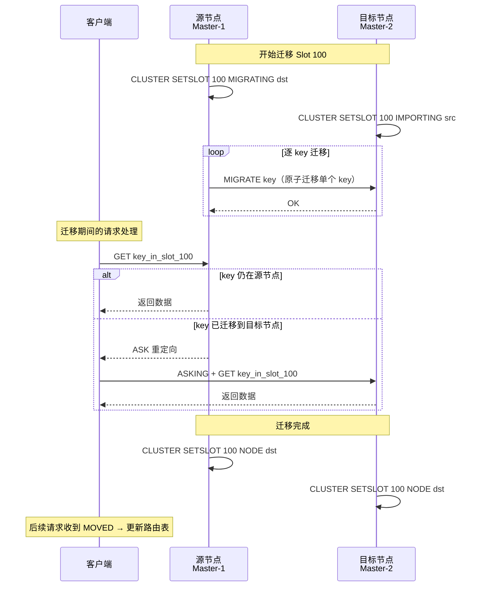

# 缓存策略 Caching Strategies

## 概念

缓存是提升系统性能的核心手段，通过将热点数据存储在内存中，大幅减少数据库查询压力。数据库磁盘 I/O 是系统的主要瓶颈，内存读写速度比磁盘快 **10 万倍以上**。

**缓存的适用场景：**
- 读多写少的热点数据（商品详情、用户资料）
- 计算开销大但变化不频繁的数据（排行榜、统计数据）
- Session 存储、Token 验证

引入缓存会带来三大经典问题（穿透、击穿、雪崩）以及缓存与数据库的一致性挑战，掌握其成因和解决方案是系统设计面试的必备知识。

---

## 核心原理

### 三大缓存问题

#### 缓存穿透 (Cache Penetration)

**问题：** 查询一个**数据库中也不存在**的 key，每次都穿透缓存直打数据库。恶意攻击者可以利用大量不存在的 ID 进行 DDoS 攻击。

```
请求 id=99999（不存在）
    │
    ▼
Redis 未命中（缓存中无此 key）
    │
    ▼
查询 MySQL（数据库中也没有）
    ├── 返回空
    ▼
不缓存，下次同样穿透
```

**解决方案：**

**方案一：缓存空值**
```java
public User getUser(Long id) {
    String cacheKey = "user:" + id;
    String cached = redis.get(cacheKey);

    if (cached != null) {
        if ("NULL".equals(cached)) return null; // 缓存的空值
        return JSON.parseObject(cached, User.class);
    }

    User user = userMapper.selectById(id);
    if (user == null) {
        // 缓存空值，TTL 设置短一些（防止正常数据迟迟不被缓存）
        redis.setex(cacheKey, 60, "NULL");
    } else {
        redis.setex(cacheKey, 3600, JSON.toJSONString(user));
    }
    return user;
}
```

**方案二：布隆过滤器 (Bloom Filter)**

系统启动时将所有合法 ID 加入布隆过滤器，请求前先过滤器判断：
```java
// 初始化：将所有合法 ID 加入布隆过滤器
BloomFilter<Long> bloomFilter = BloomFilter.create(Funnels.longFunnel(), 1_000_000, 0.001);
userIds.forEach(bloomFilter::put);

public User getUser(Long id) {
    if (!bloomFilter.mightContain(id)) {
        return null; // 必定不存在，直接返回
    }
    // 继续查缓存/数据库
}
```

> 布隆过滤器的误判率（false positive）可以调整，但没有漏判（false negative），即如果返回"不存在"则一定不存在。

**Bloom Filter 误判率与空间 Trade-off**

布隆过滤器的误判率 $p$ 与位数组大小 $m$、元素数量 $n$、哈希函数个数 $k$ 的关系：

$$p = \left(1 - e^{-kn/m}\right)^k$$

最优哈希函数个数：$k = \frac{m}{n} \ln 2$

| 元素数量 $n$ | 误判率 $p$ | 位数组大小 $m$ | 每元素占用 | 哈希函数数 $k$ |
|-------------|-----------|---------------|-----------|--------------|
| 100 万 | 1% | 9.6 MB | ~10 bits | 7 |
| 100 万 | 0.1% | 14.4 MB | ~15 bits | 10 |
| 100 万 | 0.01% | 19.2 MB | ~20 bits | 13 |
| 1 亿 | 1% | 960 MB | ~10 bits | 7 |

**选型建议**：缓存穿透防护场景，误判率设为 0.1%（即万分之一的请求仍会穿透到 DB），100 万 key 仅需约 14 MB 内存，性价比极高。误判率设得太低（如 0.001%）会显著增加内存占用和哈希计算开销，通常没有必要。

#### 缓存击穿 (Cache Breakdown / Hotspot Invalid)

**问题：** 一个**热点 key** 在高并发时突然过期，大量请求同时穿透缓存直打数据库，导致数据库瞬间压力剧增。

```
热点 key 过期
    │
    ├── 请求 1 ──► Redis miss ──► MySQL 查询中...
    ├── 请求 2 ──► Redis miss ──► MySQL 查询中...
    ├── 请求 3 ──► Redis miss ──► MySQL 查询中...  ← 数据库压力剧增
    └── ...
```

**解决方案：**

**方案一：互斥锁（串行化重建）**
```java
public User getUser(Long id) {
    String cacheKey = "user:" + id;
    User user = redis.get(cacheKey);

    if (user != null) return user;

    // 缓存未命中，尝试获取分布式锁
    String lockKey = "lock:user:" + id;
    if (redis.setnx(lockKey, "1", 10)) { // 10s 超时防止死锁
        try {
            // Double check：可能其他线程已经重建缓存
            user = redis.get(cacheKey);
            if (user == null) {
                user = userMapper.selectById(id);
                redis.setex(cacheKey, 3600, JSON.toJSONString(user));
            }
        } finally {
            redis.del(lockKey);
        }
    } else {
        // 没抢到锁，短暂等待后重试
        Thread.sleep(50);
        return getUser(id);
    }
    return user;
}
```

**方案二：逻辑过期（不设置 TTL）**

在缓存值中存入过期时间，后台异步刷新：
```java
public class CacheValue {
    private Object data;
    private LocalDateTime expireTime; // 逻辑过期时间
}

public User getUser(Long id) {
    CacheValue cacheValue = redis.get("user:" + id);

    if (cacheValue == null) return null; // 真实不存在

    if (cacheValue.getExpireTime().isAfter(LocalDateTime.now())) {
        return (User) cacheValue.getData(); // 未过期
    }

    // 逻辑过期，触发异步重建，但本次返回旧数据
    asyncRebuildCache(id);
    return (User) cacheValue.getData(); // 返回旧数据（可接受短暂旧值）
}
```

#### 缓存雪崩 (Cache Avalanche)

**问题：** 大量 key **同时过期**，或 Redis 服务**宕机**，导致大量请求全部打到数据库，引发数据库崩溃的雪崩效应。

```
00:00 大量 key 同时过期（例如系统启动时批量设置了相同 TTL）
    │
    ├── 所有请求 ──► Redis Miss ──► 全部打数据库
    │                                    │
    │                              数据库过载崩溃
    │                                    │
    └────────── 整个系统不可用 ─────────────┘
```

**解决方案：**

**方案一：TTL 随机化**
```java
// 基础过期时间 + 随机扰动，避免同时过期
int baseTTL = 3600;
int randomOffset = new Random().nextInt(600); // 0~600 秒随机扰动
redis.setex(cacheKey, baseTTL + randomOffset, value);
```

**方案二：多级缓存**（详见下节）

Redis 宕机时，L1 本地缓存仍能吸收大量流量。

**方案三：Redis 高可用**（详见 Redis 集群架构节）
- 哨兵模式（Sentinel）：主节点故障自动切换
- 集群模式（Cluster）：数据分片 + 副本，单节点故障不影响整体

**方案四：熔断 + 降级**
```java
// 启用熔断器（如 Resilience4j）
CircuitBreaker circuitBreaker = CircuitBreaker.ofDefaults("db");
// 数据库访问失败率超阈值时自动熔断，返回降级数据
```

---

### Redis 集群架构演进

#### 架构演进路径

```
单机（Standalone）
    │ 性能瓶颈 / 单点故障
    ▼
主从复制（Master-Slave）
    │ 主节点故障需手动切换
    ▼
哨兵模式（Sentinel）
    │ 仍为单主，存储容量有限
    ▼
集群模式（Cluster）
    │ 水平扩展，多主多从
    ▼
（按需）云托管 / Redis Enterprise
```

| 架构 | 高可用 | 水平扩展 | 适用场景 |
|------|--------|----------|---------|
| 单机 | 无 | 无 | 开发/测试环境 |
| 主从 | 手动切换 | 读扩展 | 读多写少，可接受手动运维 |
| Sentinel | 自动故障转移 | 读扩展 | 生产环境单主，中小规模 |
| Cluster | 自动故障转移 | 读写均可扩展 | 大数据量、高吞吐生产环境 |

#### Redis Cluster：Hash Slot 机制

Redis Cluster 将整个键空间划分为 **16384 个 Hash Slot**，每个主节点负责其中一段连续区间。

**Slot 计算：**
```
slot = CRC16(key) % 16384
```

**Slot 分配示例（3 主 3 从）：**

```
┌─────────────────────────────────────────────────────┐
│                   Redis Cluster                     │
│                                                     │
│  ┌──────────────┐  ┌──────────────┐  ┌───────────┐ │
│  │  Master-1    │  │  Master-2    │  │ Master-3  │ │
│  │ Slot 0-5460  │  │Slot 5461-10922│  │Slot 10923-│ │
│  │              │  │              │  │   16383   │ │
│  └──────┬───────┘  └──────┬───────┘  └─────┬─────┘ │
│         │                 │                │       │
│  ┌──────▼───────┐  ┌──────▼───────┐  ┌─────▼─────┐ │
│  │  Replica-1   │  │  Replica-2   │  │Replica-3  │ │
│  └──────────────┘  └──────────────┘  └───────────┘ │
└─────────────────────────────────────────────────────┘
```

**MOVED vs ASK 重定向：**

| 类型 | 触发条件 | 含义 | 客户端行为 |
|------|----------|------|-----------|
| `MOVED` | Slot 已永久迁移到新节点 | 请求发错了节点 | 更新路由表，重发请求 |
| `ASK` | Slot 正在迁移中 | 数据暂时在目标节点 | 仅本次重定向，不更新路由表 |

**Slot 迁移流程**



**迁移期间的关键保证：**
- 每个 key 的迁移是**原子操作**，不会出现同一 key 在两个节点同时存在
- 源节点先检查本地是否有该 key，有则直接响应，无则返回 `ASK` 让客户端去目标节点查
- 迁移完成后广播 `MOVED`，所有客户端更新路由表

---

### 多级缓存架构

#### 三层缓存结构

```
请求
  │
  ▼
L1: 本地缓存（Caffeine）── 命中 ──► 返回（微秒级）
  │ 未命中
  ▼
L2: 分布式缓存（Redis）── 命中 ──► 回填 L1 ──► 返回（毫秒级）
  │ 未命中
  ▼
L3: 数据库（MySQL）──────────────► 回填 L2 ──► 回填 L1 ──► 返回（百毫秒级）
```

| 层级 | 实现 | 访问延迟 | 容量限制 | 共享范围 |
|------|------|----------|----------|---------|
| L1 本地缓存 | Caffeine | 微秒级（进程内） | JVM 堆内存（通常几百 MB） | 单个实例 |
| L2 分布式缓存 | Redis | 毫秒级（网络 I/O） | 内存（可扩展至 TB 级） | 所有实例共享 |
| L3 数据库 | MySQL | 百毫秒级（磁盘 I/O） | 磁盘（近乎无限） | 所有实例共享 |

#### L1 缓存一致性：失效广播

多实例部署时，L1 本地缓存各自独立，写操作后需要通知所有实例失效对应 key。

```java
// 写操作后，发布失效消息
public void updateUser(User user) {
    userMapper.update(user);
    redis.del("user:" + user.getId());          // 删除 L2
    redis.publish("cache:invalidate", "user:" + user.getId()); // 广播 L1 失效
}

// 每个实例订阅失效消息
@PostConstruct
public void subscribeInvalidation() {
    redis.subscribe((channel, message) -> {
        localCache.invalidate(message);         // 删除本地 L1
    }, "cache:invalidate");
}
```

---

### 缓存更新策略

| 策略 | 操作顺序 | 一致性 | 性能 | 适用场景 |
|------|---------|--------|------|---------|
| **Cache Aside（旁路缓存）** | 读：先缓存后 DB；写：先更新 DB，再删缓存 | 较好 | 好 | 最常用，读多写少 |
| **Read Through** | 缓存层代理读取，缓存未命中自动从 DB 加载 | 好 | 好 | 统一缓存逻辑 |
| **Write Through** | 缓存层代理写入，同步更新 DB 和缓存 | 强一致 | 写入较慢 | 写入不频繁 |
| **Write Behind（Write Back）** | 先写缓存，异步批量刷新 DB | 弱一致 | 写入极快 | 允许短暂不一致 |

**Cache Aside 读写流程：**

```
读流程：
  请求 → 查 Redis → 命中则返回
                  → 未命中 → 查 DB → 写入 Redis → 返回

写流程：
  请求 → 更新 DB → 删除 Redis 缓存（而非更新）
```

**为什么写操作是删除缓存而不是更新缓存？**

更新缓存容易出现并发写冲突：
1. 线程 A 更新 DB（新值）
2. 线程 B 更新 DB（更新值）
3. 线程 B 更新缓存（B 的值）
4. 线程 A 更新缓存（A 的旧值写入）→ 缓存与 DB 不一致

删除缓存是幂等操作，不存在这个问题。

---

### 缓存与数据库一致性深度解析

#### 方案一：延迟双删（Delayed Double Deletion）

适合对一致性要求较高但不需要强一致的场景：

```java
public void updateUser(User user) {
    // 第一次删除缓存（防止读线程写入旧缓存）
    redis.del("user:" + user.getId());

    // 更新数据库
    userMapper.update(user);

    // 延迟 500ms 后再次删除缓存
    // 目的：覆盖掉在第一次删除与 DB 更新之间，
    //       其他线程从 DB 读取旧值并写入缓存的情况
    Thread.sleep(500);
    redis.del("user:" + user.getId());
}
```

**时序说明：**
```
T1: 线程 A 删除缓存
T2: 线程 B 读取缓存 miss，查 DB 得到旧值
T3: 线程 A 更新 DB 完成
T4: 线程 B 将旧值写入缓存 ← 产生脏数据
T5: 线程 A 延迟 500ms 后再次删除缓存 ← 清除 T4 写入的脏数据
```

#### 方案二：Canal Binlog 监听

适合对一致性要求高、希望与业务代码解耦的场景：

```
MySQL Binlog
    │ 变更事件（INSERT/UPDATE/DELETE）
    ▼
Canal Server（模拟 MySQL Slave 消费 Binlog）
    │ 解析变更记录
    ▼
消息队列（Kafka / RocketMQ）
    │
    ▼
缓存消费者（删除/更新 Redis 缓存）
```

```java
// Canal 消费者示例
@CanalEventListener
public void onUserChange(CanalEntry.Entry entry) {
    String tableName = entry.getHeader().getTableName();
    if ("user".equals(tableName)) {
        // 从 binlog 解析出变更的 user id
        Long userId = extractUserId(entry);
        redis.del("user:" + userId);
    }
}
```

#### 方案对比

| 方案 | 实现复杂度 | 一致性保证 | 延迟 | 适用场景 |
|------|-----------|-----------|------|---------|
| Cache Aside（仅删缓存） | 低 | 最终一致，窗口期短 | 无 | 大多数业务场景 |
| 延迟双删 | 低 | 最终一致，窗口期更短 | 500ms 写放大 | 并发写较多时 |
| Canal Binlog | 高（需独立组件） | 最终一致，异步解耦 | 秒级 | 对业务代码侵入性要求低 |
| Write Through | 中 | 强一致 | 写入变慢 | 读写比接近、强一致要求 |

---

### Redis 过期策略与内存淘汰

#### 过期 key 的删除机制

- **惰性删除（Lazy Expiration）：** 访问时才检查是否过期，节省 CPU 但内存可能积累
- **定期删除（Periodic Expiration）：** 每隔一段时间随机检查一批 key，过期则删除

两种机制结合使用，保证内存和性能的平衡。

#### 内存淘汰策略（maxmemory-policy）

| 策略 | 说明 |
|------|------|
| `noeviction` | 不淘汰，内存满时写操作报错（默认） |
| `allkeys-lru` | 对所有 key 按 LRU 淘汰 |
| `volatile-lru` | 只对设置了过期时间的 key 按 LRU 淘汰 |
| `allkeys-lfu` | 按访问频率淘汰（Redis 4.0+） |
| `volatile-ttl` | 优先淘汰剩余 TTL 最短的 key |
| `allkeys-random` | 随机淘汰 |

**推荐：** 缓存场景用 `allkeys-lru` 或 `allkeys-lfu`。

---

## 技术选型与对比

| 维度 | Caffeine（L1） | Redis（L2） | Memcached |
|------|---------------|------------|-----------|
| 部署方式 | 进程内（无网络开销） | 独立服务 | 独立服务 |
| 数据结构 | Java 对象 | String/Hash/List/Set/ZSet 等 | 仅 String |
| 持久化 | 无 | RDB / AOF | 无 |
| 集群支持 | 无（本地） | Sentinel / Cluster | 客户端分片 |
| 适用场景 | 超高频热点、降低 Redis 压力 | 分布式共享缓存 | 简单 KV，高并发读 |

---

## 面试常问 & 怎么答

### Q1: 什么是缓存穿透、缓存击穿、缓存雪崩？分别如何解决？

| 问题 | 成因 | 核心解决方案 |
|------|------|------------|
| **穿透** | 查询 DB 中不存在的 key | 缓存空值 / 布隆过滤器 |
| **击穿** | 单个热点 key 过期，大量并发直打 DB | 互斥锁重建 / 逻辑过期不设 TTL |
| **雪崩** | 大量 key 同时过期 / Redis 宕机 | TTL 随机化 / 多级缓存 / Redis 高可用 |

**回答要点：** 先分清三个问题的本质区别，再分别给出对应方案，最好结合场景说明选择依据（如逻辑过期适合热搜榜单等允许短暂旧值的场景）。

### Q2: 如何保证缓存与数据库的数据一致性？

**Cache Aside 模式（主流方案）：**
- 读：先查缓存，未命中则查 DB 并写入缓存
- 写：先更新 DB，**再删除（而非更新）缓存**

选择删除而非更新缓存，是因为更新操作在并发时会出现写写冲突（最后一个写入可能是旧值），而删除是幂等操作。

对一致性要求更高时：
- 使用**延迟双删**缩短不一致窗口期
- 使用 **Canal 监听 MySQL binlog** 实现异步缓存删除，与业务代码解耦

### Q3: Redis 的过期策略和内存淘汰策略是什么？

**过期删除：** 惰性删除（访问时检查）+ 定期随机扫描，两种结合。

**内存淘汰：** 当内存达到 `maxmemory` 限制时触发。推荐缓存场景使用 `allkeys-lru`（对所有 key 按最近最少使用原则淘汰），业务系统只淘汰有过期时间的 key 可用 `volatile-lru`。

### Q4: 如何保证缓存和数据库的最终一致性？

**回答框架：**

1. **基础：Cache Aside 模式** — 先更新 DB，再删缓存，利用惰性加载保证最终一致
2. **进阶：延迟双删** — 针对"删缓存→更新 DB"窗口期内的脏读，500ms 后二次删除
3. **最优：Canal Binlog** — 监听 MySQL binlog 变更事件，异步删除缓存，业务代码零侵入

**关键点：** 没有办法做到缓存和 DB 的完全强一致（除非引入分布式事务，代价极高），工程上的目标是**缩短不一致窗口期**，根据业务容忍度选方案。

### Q5: Redis Cluster 的 Hash Slot 机制是什么？

**要点：**
- Redis Cluster 将键空间分为 **16384 个 Hash Slot**
- 每个 key 按 `CRC16(key) % 16384` 映射到对应 Slot
- 每个主节点负责一段 Slot 区间（如 3 主：0–5460 / 5461–10922 / 10923–16383）
- 客户端请求打到错误节点时，节点返回 `MOVED` 或 `ASK` 重定向响应
  - `MOVED`：Slot 已永久迁移，客户端更新路由表后重发
  - `ASK`：Slot 迁移中，仅本次重定向，不更新路由表

**为什么是 16384 而不是更大？** 16384 = 2¹⁴，心跳包中携带 Slot 位图只需 2KB，网络开销可控；同时 Redis 官方建议集群节点不超过 1000 个，16384 个 Slot 已足够分配。

---

## 看到什么就先想到这类

| 关键词 / 场景 | 第一反应 |
|-------------|---------|
| 读多写少 / 热点数据 | Cache Aside + Redis，考虑本地缓存（Caffeine）作 L1 |
| 缓存不一致 / 脏数据 | 延迟双删 / Canal binlog 监听异步删缓存 |
| Redis 宕机 / 单点故障 | Sentinel（中小规模自动故障转移）/ Cluster（大规模分片） |
| 大量 key 同时过期 | TTL 随机化 + 多级缓存兜底（L1 本地缓存） |
| 大量无效 key 请求（攻击） | 布隆过滤器拦截 + 缓存空值 |
| 热点 key 过期（高并发） | 互斥锁串行重建 / 逻辑过期异步刷新 |
| 跨实例 L1 缓存失效 | Redis Pub/Sub 广播失效消息 |
| 数据库压力过大 | 多级缓存（L1 Caffeine → L2 Redis → DB）|

---

## 常见误区

::: warning 易错点
1. **分清三大问题：** 穿透=查不存在的数据；击穿=热点 key 过期；雪崩=大量 key 同时过期或服务宕机
2. **Cache Aside 不能保证强一致**，在更新 DB 后删缓存之前，仍有短窗口其他线程读到旧值。若需强一致，考虑 Write Through 或分布式锁
3. **布隆过滤器有误判（false positive）但无漏判（false negative）**，适合"一定不存在"的快速判断
4. **逻辑过期方案**：用户可能短暂看到旧数据（eventual consistency），适合对一致性要求不高的场景（如热搜榜单）
5. **延迟双删的 sleep 时间**需要大于"从 DB 读旧值写入缓存"的最大耗时，通常设 500ms~1s，具体需压测评估
:::

---

## 延伸阅读

- [Redis 官方文档 - Expiration](https://redis.io/docs/manual/keyspace-notifications/)
- [Redis Cluster 规范](https://redis.io/docs/reference/cluster-spec/)
- [Caching Strategies and How to Choose the Right One](https://codeahoy.com/2017/08/11/caching-strategies-and-how-to-choose-the-right-one/)
- 《Redis 设计与实现》第 9 章：数据库
