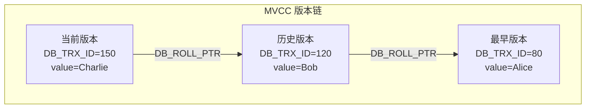
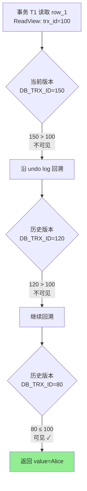
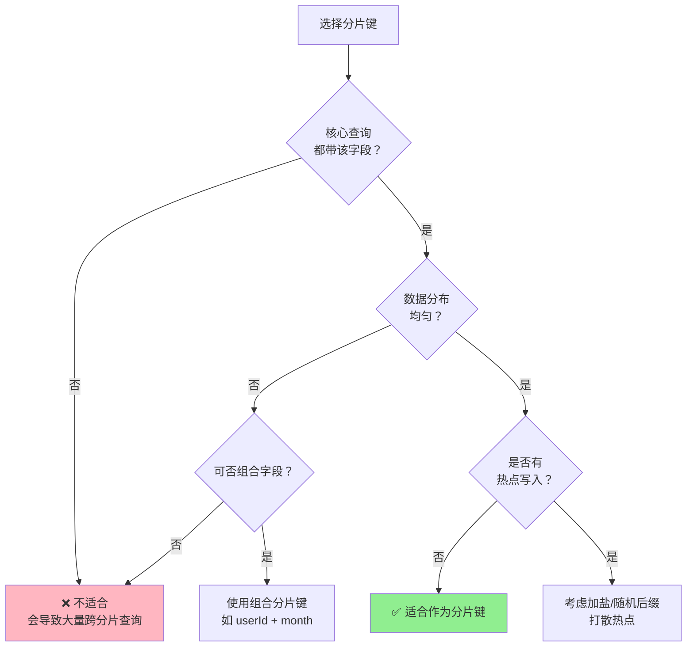
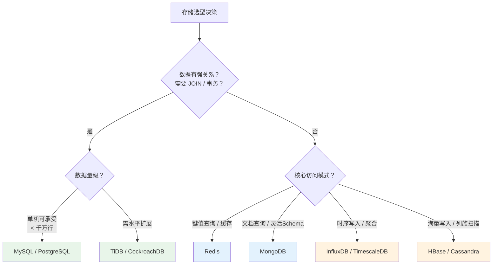

# 存储选型 Database Selection

## 概念

存储选型是系统设计中最关键的决策之一。选错数据库往往比选错算法代价更高——上线后迁移成本极大，且可能成为后续扩展的瓶颈。

**为什么选型如此重要：**
- 错误的数据模型导致查询低效，随数据量增长性能急剧下降
- 不匹配的一致性保证在高并发下引发数据问题
- 不适合的访问模式造成热点，触发读/写瓶颈
- 后期迁移往往需要双写+灰度，周期长风险高

**核心决策维度：**

| 维度 | 关键问题 |
|------|----------|
| 数据模型 | 是结构化关系型、文档型，还是键值/列族/时序？ |
| 一致性要求 | 是否需要强 ACID 事务？能接受最终一致性吗？ |
| 访问模式 | 读多写少？写多读少？点查为主还是范围扫描？ |
| 规模 | 当前量级、未来增速、单表能否承受？ |

---

## 核心原理

### 1. 关系型数据库（RDBMS）

#### MySQL InnoDB 架构

```
                ┌─────────────────────────────┐
                │         InnoDB Engine        │
  SQL 请求 ────►│                             │
                │  ┌─────────────────────┐    │
                │  │     Buffer Pool     │    │
                │  │  (缓存数据页/索引页) │    │
                │  └──────────┬──────────┘    │
                │             │               │
                │  ┌──────────▼──────────┐    │
                │  │   Redo Log (WAL)    │◄───┼── 崩溃恢复保证 (Durability)
                │  │  DoubleWrite Buffer │    │
                │  └──────────┬──────────┘    │
                │             │               │
                │  ┌──────────▼──────────┐    │
                │  │   Undo Log          │◄───┼── 回滚 + MVCC 快照
                │  └─────────────────────┘    │
                └─────────────────────────────┘
```

- **Buffer Pool**：内存中的数据页缓冲池，热点数据和索引常驻于此，减少磁盘 I/O
- **Redo Log（重做日志）**：WAL（Write-Ahead Log），先写日志再写数据页，保证崩溃后可重放恢复
- **Undo Log（回滚日志）**：记录数据修改前的版本，支持事务回滚和 MVCC 快照读
- **DoubleWrite Buffer**：防止页写入一半时崩溃导致的"部分页写入"问题

#### 索引原理

B+ 树是 InnoDB 索引的核心数据结构：

```
             [30 | 60]                ← 非叶节点（只存 key）
            /    |    \
     [10|20]  [40|50]  [70|80]       ← 非叶节点
       /           \
[1→data][10→data]  [60→data][70→data] ← 叶节点（存 key + 数据/行指针）
         ↔ 叶节点间双向链表，支持范围扫描
```

| 索引类型 | 说明 |
|----------|------|
| 聚簇索引（Clustered Index） | 主键索引，叶节点直接存储整行数据，每表只有一个 |
| 二级索引（Secondary Index） | 叶节点存储主键值，查询需回表（再走一次聚簇索引） |
| 覆盖索引（Covering Index） | 查询列全部在索引中，无需回表，性能最优 |

**面试要点**：`SELECT id, name FROM user WHERE age = 25` 若建了 `(age, name)` 联合索引，则 `id`（主键）天然在叶节点中，构成覆盖索引，不需回表。

#### 事务隔离级别

| 隔离级别 | 脏读 | 不可重复读 | 幻读 | 适用场景 |
|----------|------|-----------|------|----------|
| Read Uncommitted | ✅ 可能 | ✅ 可能 | ✅ 可能 | 几乎不用 |
| Read Committed | ❌ 解决 | ✅ 可能 | ✅ 可能 | Oracle 默认 |
| Repeatable Read | ❌ 解决 | ❌ 解决 | ⚠️ 部分解决 | MySQL 默认 |
| Serializable | ❌ 解决 | ❌ 解决 | ❌ 解决 | 高一致性场景 |

MySQL InnoDB 在 Repeatable Read 下通过 **Gap Lock + Next-Key Lock** 防止幻读。

#### MVCC（多版本并发控制）

MVCC 让读操作不加锁，通过读取历史版本实现并发：

```
事务 T1（快照时间戳 = 100）读取 row_1
    │
    ▼
row_1 当前版本（事务 T2 已修改，时间戳 = 150）── 时间戳 > 100，不可见
    │ undo log 链
    ▼
row_1 历史版本（事务 T1 开始前的版本，时间戳 = 80）── 时间戳 ≤ 100，可见 ✓
```

每行数据含隐藏列：`DB_TRX_ID`（最后修改的事务 ID）、`DB_ROLL_PTR`（指向 undo log 的指针）。读操作根据事务的 ReadView 判断版本可见性，实现无锁一致性读。





**ReadView 可见性判断规则（RR 级别）：**

| 条件 | 结果 | 说明 |
|------|------|------|
| `trx_id < min_trx_id` | 可见 | 该版本在 ReadView 创建前已提交 |
| `trx_id > max_trx_id` | 不可见 | 该版本在 ReadView 创建后才开始 |
| `trx_id in active_trx_list` | 不可见 | 该版本的事务在 ReadView 创建时还未提交 |
| `trx_id not in active_trx_list` | 可见 | 该版本的事务在 ReadView 创建前已提交 |

---

### 2. NoSQL

#### Redis：数据结构选型指南

Redis 的核心价值在于丰富的原生数据结构，每种结构对应不同场景：

| 数据结构 | 内部实现 | 典型场景 |
|----------|----------|----------|
| String | SDS（简单动态字符串）| 缓存对象 JSON、计数器（`INCR`）、分布式锁（`SET NX`）、限流 |
| Hash | ziplist / hashtable | 存储对象字段（用户信息），避免序列化，支持单字段更新 |
| ZSet（有序集合）| skiplist + hashtable | 排行榜、带权重的优先队列、延迟队列 |
| Set | intset / hashtable | 去重（UV 统计）、交并差集（共同关注）|
| List | quicklist | 消息队列（`LPUSH` + `BRPOP`）、最新动态列表 |
| Bitmap | String（位操作）| 签到打卡、布隆过滤器 |
| HyperLogLog | 概率算法 | 海量 UV 近似计数，误差约 0.81% |

#### MongoDB：文档模型

**适用场景：**
- Schema 灵活且频繁变更（产品初期快速迭代）
- 数据天然是嵌套文档（订单含商品列表、博客含评论）
- 内容管理系统（CMS）、用户行为日志、地理位置数据

**不适用场景：**
- 强事务（多文档 ACID 虽已支持但性能不如 RDBMS）
- 复杂多表 Join（MongoDB 不擅长）

#### HBase：列族存储

HBase 基于 LSM Tree（Log-Structured Merge Tree）实现高写入吞吐：

```
写入流程：
MemStore（内存）──满后刷盘──► HFile（磁盘，不可变）
                                    │
                              后台 Compaction 合并
```

**适用场景：** 海量时序数据（IoT 传感器）、日志存储、历史行为数据  
**特点：** 按行键范围分片（Region），列族内数据列式存储，高写入吞吐，点查需设计好 RowKey

---

### 3. NewSQL

| 产品 | 兼容协议 | 核心特点 |
|------|----------|----------|
| TiDB | MySQL 5.7 | Raft 多副本，TiKV（KV 存储层），HTAP（支持 OLAP） |
| CockroachDB | PostgreSQL | 分布式 SQL，Paxos 共识，地理分布感知 |

**什么时候考虑 NewSQL：**
- 单库 MySQL 已达上限，分库分表运维复杂度难以接受
- 业务需要强 ACID 事务 + 水平弹性扩展
- 需要跨分片的复杂 SQL 查询

---

### 4. 时序数据库

| 产品 | 特点 |
|------|------|
| InfluxDB | 原生时序，内置降采样、数据保留策略，Line Protocol 写入 |
| TimescaleDB | PostgreSQL 扩展，兼容 SQL，适合已有 PG 技术栈 |

**适用场景：** 监控指标（Prometheus + InfluxDB）、IoT 传感器数据、金融 tick 数据  
**核心能力：** 按时间分区存储，高效聚合（avg/max/min over time window），自动数据生命周期管理

---

### 5. 分库分表

#### 垂直拆分 vs 水平拆分

```
垂直拆分（按业务）：              水平拆分（按数据量）：

单库 ──► 用户库（user 表）        user 表 ──► shard_0（uid % 4 = 0）
     ──► 订单库（order 表）                ──► shard_1（uid % 4 = 1）
     ──► 商品库（product 表）              ──► shard_2（uid % 4 = 2）
                                          ──► shard_3（uid % 4 = 3）
```

#### ShardingSphere 中间件方案

```
应用层 ──► ShardingSphere-JDBC（嵌入式）或 ShardingSphere-Proxy（代理模式）
              │
              ├── 解析 SQL → 路由到对应分片
              ├── 执行计划 → 合并多分片结果
              └── 分布式事务支持（Seata 集成）
```

#### 分片键选择原则

1. **数据均匀分布**：避免数据倾斜，防止热点分片
2. **查询局部性**：核心查询尽量落在单分片（减少跨分片查询）
3. **业务关联性**：同一用户的数据路由到同一分片（按 `user_id` 分片而非按时间）

**常见踩坑：** 按时间分片导致新数据集中写入最新分片（热点写入）；按用户 ID 分片但不同用户数据量差异悬殊（头部用户数据倾斜）。



#### 扩容：翻倍策略（4 → 8 分片）

```
扩容前：4 分片，uid % 4 = 0,1,2,3
扩容后：8 分片，uid % 8 = 0,1,2,3,4,5,6,7

映射关系：
  旧 shard_0（uid % 4 = 0）── 数据迁移一半 ──► 新 shard_0（uid % 8 = 0）
                                             ──► 新 shard_4（uid % 8 = 4）
```

翻倍策略的优势：每个旧分片只需向一个新分片迁移数据，迁移量最小，且迁移期间两套路由规则可共存（双读验证）。

```mermaid
graph TB
    subgraph 翻倍扩容数据迁移
    direction TB
    
    subgraph 扩容前（4分片）
    S0[Shard 0<br/>uid%4=0<br/>uid: 0,4,8,12...]
    S1[Shard 1<br/>uid%4=1<br/>uid: 1,5,9,13...]
    S2[Shard 2<br/>uid%4=2<br/>uid: 2,6,10,14...]
    S3[Shard 3<br/>uid%4=3<br/>uid: 3,7,11,15...]
    end
    
    subgraph 扩容后（8分片）
    N0[Shard 0<br/>uid%8=0<br/>uid: 0,8...]
    N4[Shard 4<br/>uid%8=4<br/>uid: 4,12...]
    N1[Shard 1<br/>uid%8=1<br/>uid: 1,9...]
    N5[Shard 5<br/>uid%8=5<br/>uid: 5,13...]
    end
    
    S0 -->|保留 uid%8=0| N0
    S0 -->|迁移 uid%8=4| N4
    S1 -->|保留 uid%8=1| N1
    S1 -->|迁移 uid%8=5| N5
    end
```

**翻倍扩容步骤：**
1. 新建 4 个空分片（Shard 4-7）
2. 开启双写：新写入按 `uid % 8` 路由，同时写入新旧分片
3. 后台迁移：扫描旧分片数据，按新路由规则迁移到对应新分片
4. 数据校验：对比新旧分片数据一致性
5. 切换路由：读流量切换到新路由规则
6. 清理：删除旧分片中已迁出的数据

---

### 6. 读写分离

主从复制通过 binlog 异步传输，存在**主从延迟**（通常几毫秒到几秒）。

**延迟缓解策略：**

```
写操作 ──► 主库
读操作 ──► 从库（一般读）
         主库（强一致读：支付结果查询、刚写入后立即读取的场景）
```

| 策略 | 实现方式 |
|------|----------|
| 强制主库读 | 写操作后的读请求打标（如 Header 或 ThreadLocal），路由层识别后强制走主库 |
| 等待从库追上 | 写入后轮询从库 binlog 位点，确认追上后再返回（成本高，不常用）|
| 半同步复制 | 至少一个从库确认收到 binlog 后才返回，延迟增加但一致性更强 |

---

### 7. 数据迁移（不停机）

#### 双写方案

```
阶段 1：双写
  应用层 ──► 写旧库（主）+ 写新库（从）
         ──► 读旧库

阶段 2：数据追平后切换读
  应用层 ──► 写旧库 + 写新库
         ──► 读新库（灰度 → 全量）

阶段 3：下线旧库
  应用层 ──► 只写新库 ──► 只读新库
```

#### CDC 方案（Change Data Capture）

```
旧库 ──► Binlog ──► Canal / Debezium ──► 新库（实时同步）
                                     ──► Kafka（解耦缓冲）
```

**零停机迁移关键步骤：**
1. 全量快照同步旧库数据到新库
2. 开启 CDC 实时捕获增量变更
3. 数据追平后开启双写（以旧库为准）
4. 灰度将读流量切换到新库，对比数据一致性
5. 确认无误后切换写流量到新库，下线旧库

---

## 选型决策树

```
需要强事务（ACID）？
├── 是 ──► 数据量大，需水平扩展？
│          ├── 是 ──► TiDB / CockroachDB（NewSQL）
│          └── 否 ──► MySQL / PostgreSQL（RDBMS）
└── 否 ──► 数据是什么形态？
           ├── 键值/缓存/计数 ──► Redis
           ├── 嵌套文档/灵活 Schema ──► MongoDB
           ├── 海量写入/时序/日志 ──► HBase / InfluxDB
           └── 纯时序 + SQL 查询 ──► TimescaleDB
```

| 需求 | 推荐 |
|------|------|
| 强事务 + 关系模型 | MySQL / PostgreSQL |
| 灵活 Schema + 文档模型 | MongoDB |
| 高性能缓存 + 数据结构 | Redis |
| 海量写入 + 列式查询 | HBase |
| ACID + 水平扩展 | TiDB / CockroachDB |
| 时序数据 + 聚合查询 | InfluxDB / TimescaleDB |

**面试中的选型思考框架**

面试时被问到"用什么数据库"，可以用以下框架组织回答：



---

## 面试常问 & 怎么答

### Q1：MySQL 和 MongoDB 什么时候该用哪个？

**思路：从数据模型、一致性需求、查询模式三个维度对比。**

> "选 MySQL 还是 MongoDB，核心看三点：
> 第一，数据有没有强关系和 Join 需求——有的话 MySQL 更合适，MongoDB 的 $lookup 性能差；
> 第二，Schema 是否稳定——初期频繁变更字段选 MongoDB，避免频繁 ALTER TABLE；
> 第三，是否需要强事务——金融、库存等核心业务必须 MySQL，MongoDB 多文档事务性能损耗大。
> 实际项目里我们商品详情用 MongoDB（属性字段每个 SKU 不一样），订单和支付用 MySQL（必须强事务）。"

### Q2：分库分表后如何做跨分片查询？

**思路：先说问题本质，再列解决方案，最后说优先选哪种。**

> "跨分片查询的本质问题是数据分散在多个节点，无法单次查询获取完整结果。
> 常见解决方案：
> 1. **避免跨分片**：选好分片键，让业务核心查询尽量单分片命中
> 2. **应用层聚合**：查多个分片后在内存中合并、排序、分页（适合数据量不大的场景）
> 3. **引入 ElasticSearch**：将需要全局查询的字段同步到 ES，用 ES 做复杂搜索，MySQL 分片只做数据存储
> 4. **使用 TiDB**：如果跨分片查询是高频需求，考虑迁到 NewSQL，让数据库层面处理分布式查询
> 最优先的方案还是第一条——架构设计阶段选好分片键，从根源避免跨分片。"

### Q3：如何做不停机数据迁移？

**思路：按阶段描述，强调数据一致性验证。**

> "不停机迁移的标准流程分四个阶段：
> 1. **全量同步**：先把旧库存量数据全量导入新库（mysqldump 或直接写迁移脚本）
> 2. **增量追平**：用 Canal 监听旧库 binlog，实时将增量变更同步到新库，直到延迟 < 1s
> 3. **双写切换**：应用层开启双写，同时写旧库和新库，读流量灰度切到新库，对比一致性
> 4. **切量下线**：验证无差异后，写流量完全切到新库，旧库只读保留一段时间作为降级兜底
> 关键风险点是步骤 3 中的数据一致性校验——我们一般用工具对比主键级别的数据差异，差异率低于阈值才放量。"

---

## 看到什么就先想到这类

| 关键词 / 场景 | 第一反应 |
|--------------|----------|
| OLTP / 强事务 / 金融 / 库存 | MySQL / PostgreSQL |
| Schema 灵活 / 嵌套文档 / 快速迭代 | MongoDB |
| 排行榜 / 计数器 / 缓存 / 分布式锁 | Redis |
| 海量写入 / 日志 / 时序 | HBase / InfluxDB |
| 单库瓶颈 / 数据量太大 | 分库分表（ShardingSphere） |
| 读写比高（读>>写） | 读写分离（主从复制）|
| 需要 ACID + 弹性扩展 | TiDB / CockroachDB |
| 换数据库 / 零停机迁移 | CDC（Canal/Debezium）+ 双写 |
