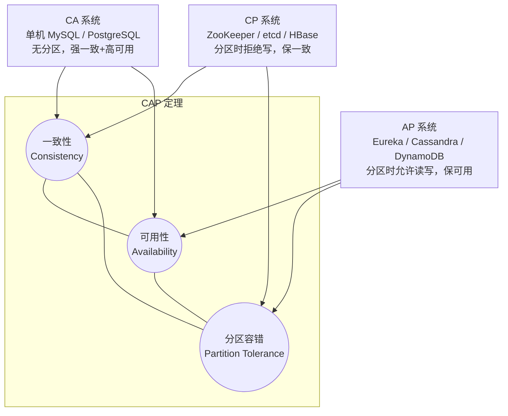
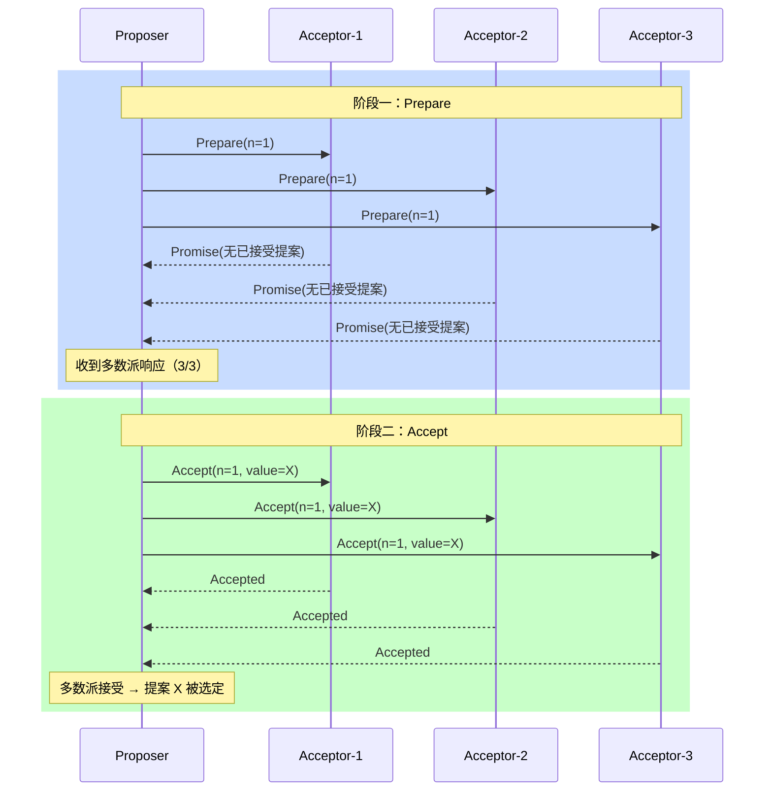
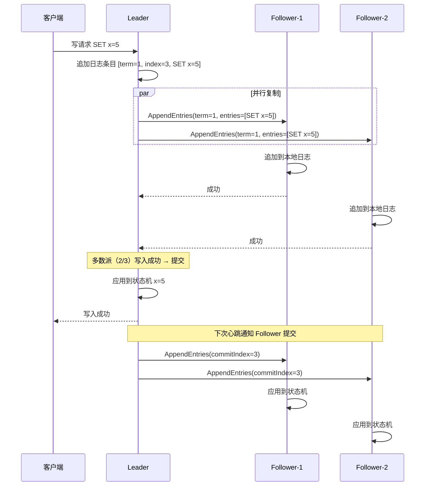
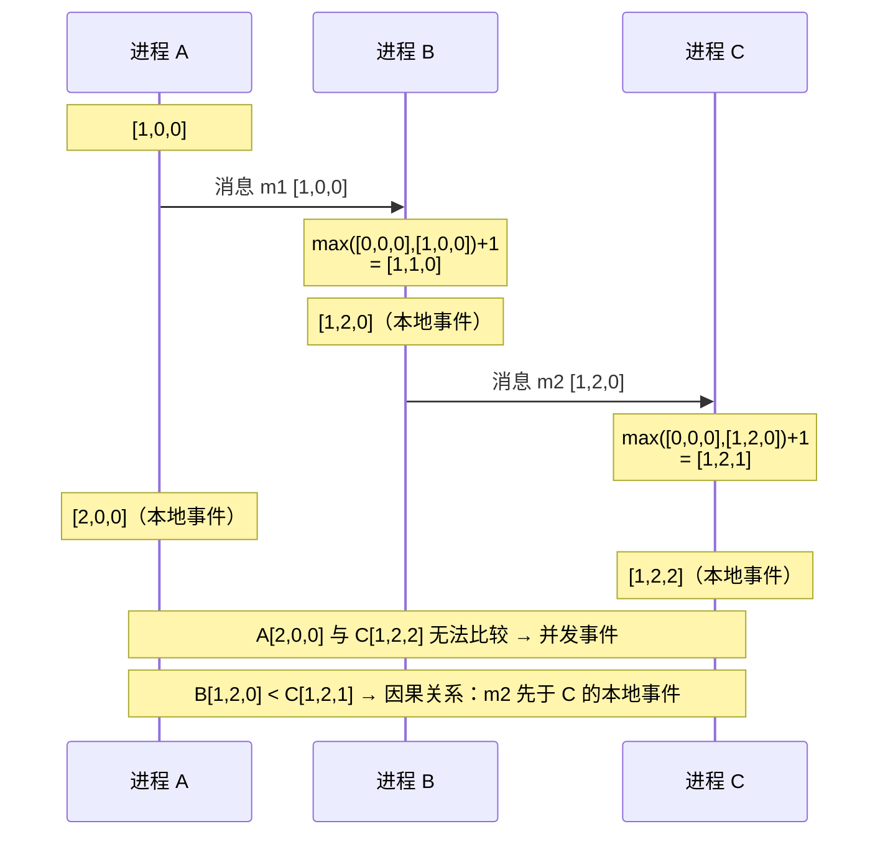

# 分布式理论

## 概念

分布式系统是指多台计算机通过网络协同工作，对外表现为一个整体的系统。核心挑战在于：网络不可靠、节点可能宕机、时钟无法完全同步。

**关键术语**

| 术语 | 含义 |
|------|------|
| 节点（Node） | 分布式系统中的一台独立机器或进程 |
| 分区（Partition） | 网络故障导致节点之间无法通信 |
| 副本（Replica） | 同一份数据的多个拷贝，用于容错和提升读性能 |
| 共识（Consensus） | 多个节点就某个值达成一致的过程 |
| 幂等性（Idempotency） | 同一操作执行多次与执行一次效果相同 |

## 核心原理

### 1. CAP 定理

CAP 由 Eric Brewer 于 2000 年提出，指出分布式系统无法同时满足以下三个特性，最多只能满足其中两个：

- **C（Consistency，一致性）**：所有节点在同一时刻看到的数据完全一致（强一致性）
- **A（Availability，可用性）**：每个请求都能收到响应（不保证数据是最新的）
- **P（Partition Tolerance，分区容错）**：网络发生分区时，系统仍能继续运行

**为什么 P 必须选？**

在真实的分布式环境中，网络分区是客观存在且无法完全避免的——网线故障、交换机宕机、跨机房延迟都可能造成分区。放弃 P 意味着系统在网络抖动时直接停止服务，这在生产环境中不可接受。因此 **P 是必选项**，真正的选择只在 **CP vs AP**。

**CP vs AP 系统举例**

| 类型 | 代表系统 | 行为 |
|------|----------|------|
| CP | ZooKeeper、etcd、HBase | 网络分区时拒绝写请求，保证数据一致 |
| AP | Eureka、Cassandra、CouchDB | 网络分区时仍接受读写，允许数据短暂不一致 |



> ZooKeeper 选择 CP：Leader 选举期间集群不可用，但数据强一致，适合配置中心、分布式锁。
>
> Eureka 选择 AP：节点故障时不下线其他节点的注册信息，优先保证服务发现可用，适合微服务注册中心。

---

### 2. BASE 理论

BASE 是对 CAP 中 AP 方向的工程实践总结，由 eBay 架构师 Dan Pritchett 提出：

- **Basically Available（基本可用）**：允许响应时间变长或部分功能降级，核心功能仍然可用
- **Soft State（软状态）**：系统中的数据可以存在中间状态，不要求时刻一致
- **Eventually Consistent（最终一致性）**：数据在一段时间后会最终达到一致状态

**BASE vs ACID 对比**

| 维度 | ACID | BASE |
|------|------|------|
| 适用场景 | 单机/强一致性关系数据库 | 分布式/高可用系统 |
| 一致性要求 | 强一致性 | 最终一致性 |
| 可用性 | 发生冲突时可能阻塞 | 优先保证可用性 |
| 代表系统 | MySQL、PostgreSQL | DynamoDB、Cassandra |
| 核心思想 | 事务要么全做要么全不做 | 接受短暂不一致，换取高可用 |

---

### 3. 一致性模型

从强到弱，常见的一致性模型如下：

| 模型 | 定义 | 代价 | 典型应用 |
|------|------|------|----------|
| **强一致性** | 写完之后所有节点立即可见最新数据 | 延迟高，可用性低 | ZooKeeper、etcd |
| **顺序一致性** | 所有节点看到的操作顺序相同，但不要求实时 | 中等 | 早期分布式数据库 |
| **因果一致性** | 有因果关系的操作按顺序可见，无关操作可乱序 | 较低 | MongoDB（因果会话）|
| **最终一致性** | 在没有新更新的前提下，数据最终会收敛一致 | 最低 | DNS、Cassandra、S3 |

---

### 4. Paxos 算法

Paxos 是经典的分布式共识算法，由 Leslie Lamport 提出。

**三种角色**

- **Proposer（提案者）**：发起提案，请求集群就某个值达成共识
- **Acceptor（接受者）**：投票接受或拒绝提案
- **Learner（学习者）**：学习最终被接受的值，不参与投票

**两阶段流程**

**阶段一：Prepare（准备阶段）**

1. Proposer 生成全局唯一编号 `n`，向多数派 Acceptor 发送 `Prepare(n)` 请求
2. Acceptor 收到后，若 `n` 大于已见过的最大编号，则承诺不再接受编号小于 `n` 的提案，并返回已接受的最大编号提案

**阶段二：Accept（接受阶段）**

1. Proposer 收到多数派响应后，选取编号最大的已接受值（若无则用自己的值），发送 `Accept(n, value)`
2. Acceptor 若未承诺更高编号，则接受该提案并通知 Learner



**Multi-Paxos**

Basic Paxos 每次共识都需要两轮 RPC，开销较大。Multi-Paxos 优化：选出一个稳定的 Leader，后续日志直接跳过 Prepare 阶段，只执行 Accept，大幅减少通信轮次。

---

### 5. Raft 算法

Raft 由 Diego Ongaro 和 John Ousterhout 于 2014 年提出，目标是比 Paxos **更易理解**，被 etcd、TiKV、CockroachDB 广泛采用。

**三种状态**

- **Follower（跟随者）**：被动接收 Leader 的日志和心跳
- **Candidate（候选者）**：发起选举时的临时状态
- **Leader（领导者）**：负责处理所有客户端请求，复制日志

**Leader 选举过程（ASCII 图）**

```
初始状态：所有节点均为 Follower

  Node A [Follower]    Node B [Follower]    Node C [Follower]
      |                    |                    |
      |  超时未收到心跳      |                    |
      |                    |                    |
      v                    |                    |
  Node A [Candidate]       |                    |
      |                    |                    |
      |--- RequestVote(term=1) -->              |
      |--- RequestVote(term=1) ----------------->
      |                    |                    |
      |<-- VoteGranted ----                     |
      |<-- VoteGranted ----------------------------
      |                    |                    |
      v  获得多数票         |                    |
  Node A [Leader]          |                    |
      |                    |                    |
      |--- Heartbeat ------>                    |
      |--- Heartbeat -------------------------------->
```

**日志复制流程**

1. 客户端向 Leader 发送写请求
2. Leader 将日志条目追加到本地日志，并并行发送 `AppendEntries` 给所有 Follower
3. 多数派（Quorum）写入成功后，Leader 提交该条目并应用到状态机
4. Leader 在下次心跳中通知 Follower 提交



**安全性保证**

- **选举限制**：只有拥有最新日志的节点才能成为 Leader（日志比较：term 更大，或 term 相同但 index 更大）
- **任期（Term）**：全局单调递增的逻辑时钟，用于检测过时信息

**实际应用**

| 系统 | 用途 |
|------|------|
| etcd | Kubernetes 集群元数据存储 |
| TiKV | TiDB 的分布式存储层 |
| CockroachDB | 分布式 SQL 数据库 |
| Consul | 服务发现与配置中心 |

---

### 6. ZAB 协议

ZAB（ZooKeeper Atomic Broadcast）是 ZooKeeper 专用的一致性协议，与 Raft 思路相近但有所不同。

**核心流程**

- **崩溃恢复（Leader Election）**：Leader 宕机后，选出拥有最新 zxid（事务 ID）的节点作为新 Leader
- **消息广播（Broadcast）**：类似两阶段提交，Leader 向所有 Follower 广播 Proposal，收到多数 ACK 后提交

**ZAB vs Raft 对比**

| 维度 | ZAB | Raft |
|------|-----|------|
| 设计目标 | ZooKeeper 专用 | 通用共识算法 |
| 日志提交 | Follower 可不存完整历史 | 必须有完整日志才能成为 Leader |
| 顺序保证 | 严格有序（FIFO） | 严格有序 |
| 易理解性 | 较复杂 | 更清晰，有完整论文 |

---

### 7. 一致性哈希

一致性哈希（Consistent Hashing）解决了传统取模哈希在节点增删时导致大量数据迁移的问题。

**哈希环**

将哈希空间组织成一个首尾相接的环（$0$ 到 $2^{32}-1$），节点和数据都映射到环上：

```
              0
           /     \
      300       60
   [NodeC]       [NodeA]
      |               |
     240           120
          [NodeB]
             180
```

数据按顺时针方向找到第一个节点进行存储。新增或删除节点时，只影响该节点相邻的数据，其余数据不受影响。

**虚拟节点解决数据倾斜**

真实部署中，节点数量少时哈希环分布不均，导致**数据倾斜**（某些节点负载远高于其他节点）。

解决方案：为每个物理节点创建多个**虚拟节点**（Virtual Node），分散映射到环上：

```
物理节点 NodeA → 虚拟节点 NodeA#1, NodeA#2, NodeA#3 ... 均匀分布在环上
```

虚拟节点数量越多，数据分布越均匀，通常每个物理节点配置 100~200 个虚拟节点。

**实际应用**

| 系统 | 用途 |
|------|------|
| Cassandra | 数据分片与副本放置 |
| Amazon DynamoDB | 分区键路由 |
| Nginx（一致性哈希模块）| 负载均衡 |
| Memcached 客户端 | 缓存节点路由 |

---

### 8. 分布式时钟

在分布式系统中，物理时钟无法做到完全同步（网络延迟、晶振漂移等原因），因此无法仅靠物理时间判断事件的先后顺序。逻辑时钟和混合时钟的目标是在不依赖绝对物理时间的前提下，准确追踪事件的因果关系。

**Lamport Clock（兰伯特时钟）**

- 标量逻辑时钟，每个进程维护一个单调递增的计数器
- 规则：本地事件发生时计数器加一；发送消息时附带当前计数器值；接收消息时取 `max(本地计数器, 消息计数器) + 1`
- 局限：可以判断"先发生（happened-before）"关系，但无法区分并发事件——如果 `a → b` 则 `C(a) < C(b)`，但 `C(a) < C(b)` 不能推出 `a → b`

**Vector Clock（向量时钟）**

- 每个进程维护一个长度为 N（进程数）的计数器向量
- 既能判断因果关系，又能检测并发事件（两个事件互相不能比较大小即为并发）
- DynamoDB、Riak 使用向量时钟进行冲突检测
- 缺点：空间复杂度 $O(N)$，进程数增加时开销显著



**HLC（Hybrid Logical Clock，混合逻辑时钟）**

- 结合物理时间戳与逻辑计数器：物理时间提供粗粒度排序，逻辑计数器提供细粒度因果追踪
- 与物理时间的偏差有上界，表示紧凑（$O(1)$）
- CockroachDB、YugabyteDB 采用 HLC
- 优势：在保持因果追踪能力的同时，与真实时间的偏差可被控制在毫秒级

**三种时钟对比**

| 时钟类型 | 能否判断因果 | 能否检测并发 | 空间复杂度 | 典型应用 |
|---------|------------|------------|-----------|---------|
| Lamport Clock | 是 | 否 | O(1) | 简单排序场景 |
| Vector Clock | 是 | 是 | O(N) | DynamoDB、Riak |
| HLC | 是 | 部分 | O(1) | CockroachDB |

---

### 9. FLP 不可能定理

**结论**：在异步系统中，即使只有一个进程可能发生故障，也不存在确定性的共识算法能保证在有限时间内终止。

**工程含义**：所有实际的共识算法（Paxos、Raft）都依赖超时机制和随机化来取得进展。FLP 定理告诉我们异步共识的理论极限，但实践中纯异步系统极为罕见，超时机制让算法在大多数情况下能正常工作。

**FLP 的实际意义**

理解 FLP 不可能定理有助于在面试中展示对分布式系统理论边界的认知：

- **为什么 Raft/Paxos 需要超时？** FLP 证明了在纯异步模型下共识不可解。引入超时（即部分同步假设）是工程上绕过 FLP 限制的标准做法。
- **为什么选举有时会失败？** 多个 Candidate 同时发起选举可能导致投票分裂（split vote），没有节点获得多数票。Raft 通过随机化选举超时来降低冲突概率，但理论上无法保证有限步内一定选出 Leader——这正是 FLP 定理的体现。
- **工程妥协**：实际系统通过引入**故障检测器（Failure Detector）** 和**随机化**来获得高概率的活性保证，虽然不是理论上的确定性终止，但在实践中足够可靠。

---

### 10. ZooKeeper vs etcd 选型对比

ZooKeeper 和 etcd 都是分布式协调服务，提供强一致性的配置存储、服务发现和分布式锁能力，但在协议、数据模型和生态上存在明显差异。

**架构对比**

| 维度 | ZooKeeper | etcd |
|------|-----------|------|
| 语言 | Java | Go |
| 一致性协议 | ZAB | Raft |
| 数据模型 | 树形（类文件系统，ZNode） | 扁平 KV（键值对） |
| 临时节点 | 支持（Ephemeral Node） | 通过 Lease 实现 |
| Watch 机制 | 一次性触发，需重新注册 | 持续 Watch，基于 Revision |
| 事务支持 | Multi 操作 | Mini 事务（If-Then-Else） |
| 性能 | 读多写少场景优秀 | 读写均衡 |
| 运维复杂度 | JVM 调优，相对复杂 | 单二进制，运维简单 |
| 生态 | Hadoop/Kafka/HBase 生态 | Kubernetes/Cloud Native 生态 |

**选型建议**

- 已有 Hadoop/Kafka 生态 → ZooKeeper
- Kubernetes / 云原生项目 → etcd
- 需要临时节点语义（如分布式锁）→ ZooKeeper 更自然
- 追求运维简单 → etcd

**ZooKeeper 分布式锁实现示例**

```
1. 客户端在 /locks/resource 下创建临时顺序节点 /locks/resource/lock-000001
2. 获取 /locks/resource 下所有子节点，排序
3. 如果自己是最小节点 → 获得锁
4. 否则 → Watch 前一个节点（如 lock-000000）
5. 前一个节点删除（释放锁或会话超时）→ 收到通知，重新检查
6. 客户端断开连接 → 临时节点自动删除 → 锁自动释放
```

---

## 脑裂（Split-Brain）防御 — 必背追问点

**面试一旦聊到主从、Sentinel、ZK、etcd，必追"脑裂怎么办？"**——这道题问的是**网络分区下两个 Leader 同时存活**的解决方案。

### 脑裂是什么

> **脑裂 = 集群网络分区后，多个分区各自选出 Leader，同时对外写入，导致数据不一致。**

**典型场景**：5 节点集群被网络分成 [3] + [2] 两边，老 Leader 在少数派 [2] 里没察觉自己被孤立，继续接受写请求；多数派 [3] 重新选了新 Leader 也接受写请求 → 两个 Leader 同时存在 → 网络恢复后数据冲突无法合并。

### 防御 4 大武器

#### 武器 1：Quorum（多数派）— 最核心

**公式（Dynamo / Cassandra）**：

$$
W + R > N
$$

| 含义 | 解释 |
|------|------|
| **N** | 副本总数 |
| **W** | 写入成功最少节点数 |
| **R** | 读取最少节点数 |

**为什么 W + R > N 能防脑裂**：任意一次"读"必定与任意一次"写"有**至少 1 个节点重叠**，所以一定能读到最新写入。

::: tip 💡 N=5 时怎么设置

> ① **强一致**：W=3, R=3（任意一次读写都过半数）；
> ② **读多写少**：W=4, R=2（读快，但写慢）；
> ③ **写多读少**：W=2, R=4（写快，但读慢）。
> Raft / ZK 默认 **W = ⌈N/2⌉ + 1**（即过半数），即使被脑裂分割也只有多数派那边能写入。

:::

#### 武器 2：奇数节点 + 过半选举

**为什么集群节点数必须奇数**：

| 节点数 | 能容忍宕机 | 脑裂分区最坏情况 |
|--------|---------|----------------|
| 3 | 1 | [2]+[1] → 多数派 [2] 能选主 ✅ |
| 4 | **1**（和 3 一样！）| [2]+[2] → **没有多数派，无法选主** ❌ |
| 5 | 2 | [3]+[2] → 多数派 [3] 能选主 ✅ |

> **结论**：4 节点不仅没有比 3 节点容灾更好，反而可能脑裂卡死。**生产部署一律奇数：3、5、7**。

#### 武器 3：Witness（仲裁节点）— 跨机房必备

**问题**：跨机房部署 2 个机房，每个机房 2 节点（共 4），任意一边断网都会脑裂卡死。

**解决方案**：在**第三个机房**部署 **1 个 Witness 节点**（不存数据，只投票），变成 5 节点过半数选举：

```
机房 A: 2 节点 + 机房 B: 2 节点 + 机房 C: 1 Witness  (共 5 节点)

   网络分区时:
   - A 断网 → B(2) + C(1) = 3 ≥ 3 → ✅ 能选主
   - B 断网 → A(2) + C(1) = 3 ≥ 3 → ✅ 能选主
   - C 断网 → A(2) + B(2) = 4 ≥ 3 → ✅ 能选主
```

| 中间件 | Witness 名称 |
|--------|-------------|
| **MongoDB** | Arbiter（仲裁节点）|
| **RabbitMQ Quorum Queue** | Tie-breaker |
| **SQL Server AlwaysOn** | File Share Witness / Cloud Witness |
| **Galera Cluster** | Garbd（galera arbitrator daemon）|

#### 武器 4：Fencing Token（栅栏令牌）— Martin Kleppmann 提出

**问题**：即使有 Quorum，老 Leader 在被废除后**因 GC 暂停**或网络延迟，依然可能向存储系统提交写请求 → 旧数据覆盖新数据。

**解决方案**：每次选主时，全局递增 token，存储层只接受 token ≥ 当前最大 token 的写请求：

```
时刻 T1: Leader-A 拿到 token=5，开始写
时刻 T2: Leader-A GC 暂停 30 秒
时刻 T3: 集群超时，选出 Leader-B，token=6
时刻 T4: Leader-B 写入 (token=6) → 存储接受
时刻 T5: Leader-A 苏醒，写入 (token=5) → 存储拒绝（5 < 6）
```

**实战中谁支持**：

| 系统 | Fencing 实现 |
|------|-------------|
| **ZooKeeper** | `cversion` / `mzxid` 单调递增 |
| **etcd** | `revision` 单调递增（lease 续约带 revision）|
| **Redis Redlock** | Martin 批评其**没有 fencing token**，所以不建议用 Redlock 做关键锁 |
| **HBase** | RegionServer 心跳 + ZK 临时节点 |

### 主流中间件防脑裂手段一览（必背）

| 中间件 | 防脑裂手段 | 推荐部署 |
|--------|---------|---------|
| **ZooKeeper** | ZAB 协议 + 过半数选举 + zxid 递增 | 3/5/7 节点奇数 |
| **etcd** | Raft + 过半数 + revision fencing | 3/5/7 节点奇数 |
| **Redis Sentinel** | quorum 配置 + min-replicas-to-write | **至少 3 个 Sentinel**，且分散在 3 机房 |
| **Redis Cluster** | gossip + 16384 slot + 故障转移过半数 | **至少 3 主**（最好 + 3 从）|
| **Kafka** | Controller 选举走 ZK/KRaft，acks=all + min.insync.replicas | min.insync.replicas ≥ 2 |
| **MongoDB ReplicaSet** | 过半数选主，Arbiter 凑奇数 | 3 节点 PSS 或 PSA |
| **MySQL MHA / MGR** | MGR 走 Paxos；MHA 靠 VIP + STONITH | MGR 至少 3 节点 |
| **Elasticsearch** | `discovery.zen.minimum_master_nodes`（旧） / 7.x+ 自动 quorum | **master 节点至少 3 个** |

::: warning ⚠️ Redis Sentinel 经典脑裂场景

> **场景**：1 主 2 从 + 3 Sentinel。主节点和**所有客户端**在机房 A，2 从 + 3 Sentinel 在机房 B。机房间网络断开 →
> ① B 中 Sentinel 过半数 → 提升从节点为新主；
> ② A 中老主仍然接受客户端写入（客户端没切换）；
> ③ 网络恢复 → 老主成了从，**A 期间的所有写入被丢弃**。
>
> **防御**：配置 `min-replicas-to-write 1` + `min-replicas-max-lag 10`——如果**主节点没有至少 1 个从节点在 10 秒内确认**，**主节点拒绝写入**，从源头切断脑裂期间的写入。

:::

### 黄金答题模板（必背）

> **面试官：怎么防脑裂？**
>
> **答**：4 大武器组合拳：
> ① **Quorum**：W + R > N，写入必须过半数节点确认，少数派分区无法写入；
> ② **奇数节点**：3/5/7 节点部署，避免 4 节点脑裂卡死；
> ③ **跨机房用 Witness**：第三机房放仲裁节点，避免两机房对等分区；
> ④ **Fencing Token**：选主时全局单调递增 token，存储层只接受最新 token 的写请求，防止老 Leader 苏醒后写入旧数据；
> 实战中 ZK/etcd 都是 Quorum + 单调 revision 的标准方案；Redis Sentinel 必须配 `min-replicas-to-write` 才安全；Redlock 因为没有 fencing token，**不建议做关键锁**。

---

## 面试常问 & 怎么答

### Q1: CAP 定理是什么？为什么不能同时满足？举例说明 CP 和 AP 系统

**答题思路（1 分钟版本）**

> CAP 定理指出，分布式系统无法同时保证一致性（C）、可用性（A）、分区容错（P）三者，最多满足其二。
>
> 为什么不能三者兼得？假设节点 A 和 B 之间发生网络分区，此时向 A 写入数据，B 无法同步。如果要保证 C，就必须拒绝 B 的读请求，牺牲 A；如果要保证 A，B 继续提供服务，但数据可能过期，牺牲 C。两者无法同时满足。
>
> 由于网络分区在生产中不可避免，P 必须保留，真正的取舍只在 CP vs AP：
> - **CP 系统**：ZooKeeper——选举期间拒绝写入，保证强一致，适合配置中心、分布式锁。
> - **AP 系统**：Eureka——节点故障时保留旧注册信息，优先可用，适合服务发现。

---

### Q2: Raft 算法的核心流程？Leader 选举怎么做？

**答题思路（1 分钟版本）**

> Raft 将一致性问题分解为三个子问题：Leader 选举、日志复制、安全性。
>
> **Leader 选举**：节点初始为 Follower，超过选举超时未收到 Leader 心跳后，自增 term 转为 Candidate，向其他节点发 RequestVote 请求。获得多数票后成为 Leader，并立即发心跳阻止新选举。
>
> 选举安全性：投票时节点只给"日志不比自己旧"的 Candidate 投票，确保 Leader 一定拥有所有已提交的日志。
>
> **日志复制**：客户端写请求发给 Leader，Leader 追加日志后并行发给 Follower，多数派写成功后提交，回复客户端。

---

### Q3: 一致性哈希是什么？虚拟节点解决什么问题？

**答题思路（1 分钟版本）**

> 一致性哈希将哈希空间构成一个环，节点和数据都映射到环上，数据顺时针找最近节点存储。好处是新增或删除节点时，只有相邻的少量数据需要迁移，其余不受影响——传统取模哈希在节点数变化时几乎所有数据都要重新分配。
>
> 虚拟节点解决**数据倾斜**问题：节点少时环上分布不均，负载集中在少数节点。为每个物理节点创建多个虚拟节点均匀散布在环上，使数据分布更均匀，负载更平衡。Cassandra 和 DynamoDB 都使用了这一机制。

---

### Q4: 分布式时钟有哪些？解决什么问题？

**答题思路（1 分钟版本）**

> 分布式系统中物理时钟无法完全同步，需要逻辑时钟来确定事件的先后顺序。
>
> 三种主要方案：Lamport Clock 是最简单的标量时钟，能判断因果关系但无法检测并发事件；Vector Clock 为每个进程维护一个计数器向量，既能判断因果又能检测并发，DynamoDB 和 Riak 使用它来做冲突检测，但空间复杂度 O(N)；HLC 混合逻辑时钟结合物理时间和逻辑计数器，CockroachDB 使用它，兼顾了紧凑表示和因果追踪。
>
> 实际选型：大多数分布式数据库使用 HLC，分布式存储系统使用 Vector Clock，简单场景用 Lamport Clock 足够。

---

### Q5: ZooKeeper 和 etcd 怎么选？

**答题思路（1 分钟版本）**

> 两者都是分布式协调服务，核心区别在协议、数据模型和生态。
>
> ZooKeeper 使用 ZAB 协议，树形数据模型，原生支持临时节点和一次性 Watch，是 Hadoop/Kafka 生态的标配。etcd 使用 Raft 协议，扁平 KV 模型，持续 Watch 基于 Revision，是 Kubernetes 的核心组件。
>
> 选型建议：大数据生态（Kafka、HBase）选 ZooKeeper；云原生/K8s 生态选 etcd；需要分布式锁且已有 ZK 则继续用 ZK；新项目追求运维简单选 etcd（Go 单二进制，无需 JVM 调优）。

---

## 看到什么就先想到这类

| 关键词 / 场景 | 优先想到 |
|--------------|---------|
| 分布式系统设计取舍 | CAP 定理，先判断 CP 还是 AP |
| 高可用 vs 强一致 | BASE 理论，最终一致性 |
| 配置中心 / 分布式锁 | ZooKeeper（CP）、etcd（Raft） |
| 服务注册发现 | Eureka（AP）、Consul（CP） |
| 多节点如何达成共识 | Raft（工程常用）、Paxos（理论基础） |
| etcd / TiKV 内部原理 | Raft 算法 |
| ZooKeeper 内部原理 | ZAB 协议 |
| 缓存 / 存储分片路由 | 一致性哈希 + 虚拟节点 |
| 节点增删数据迁移代价 | 一致性哈希（vs 取模哈希） |
| 数据倾斜 / 热点 | 虚拟节点，增加哈希环分布均匀度 |
| 数据库事务 vs 分布式存储 | ACID vs BASE 对比 |
| 事件排序 / 因果关系 / 并发检测 | 分布式时钟（Lamport/Vector/HLC） |
| K8s 元数据 / 云原生服务发现 | etcd（Raft） |
| 临时节点 / 一次性 Watch | ZooKeeper（ZAB） |
| 异步系统共识的理论极限 | FLP 不可能定理 |
