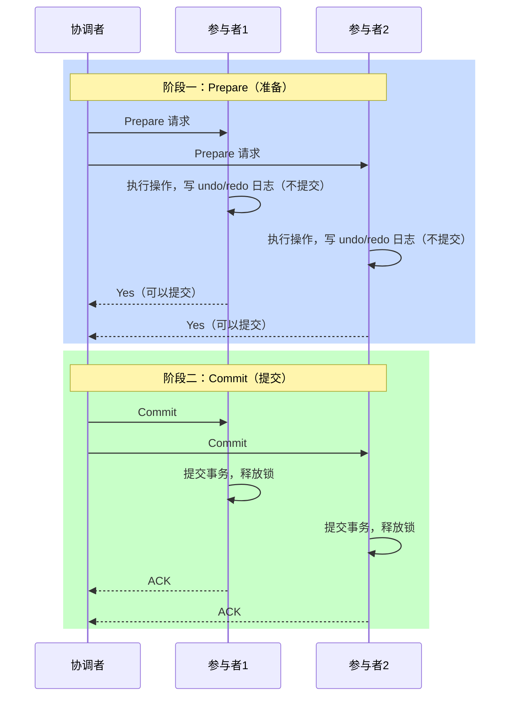
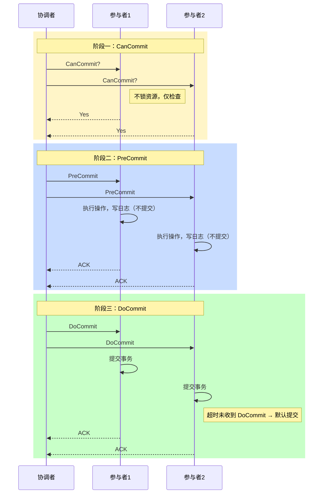
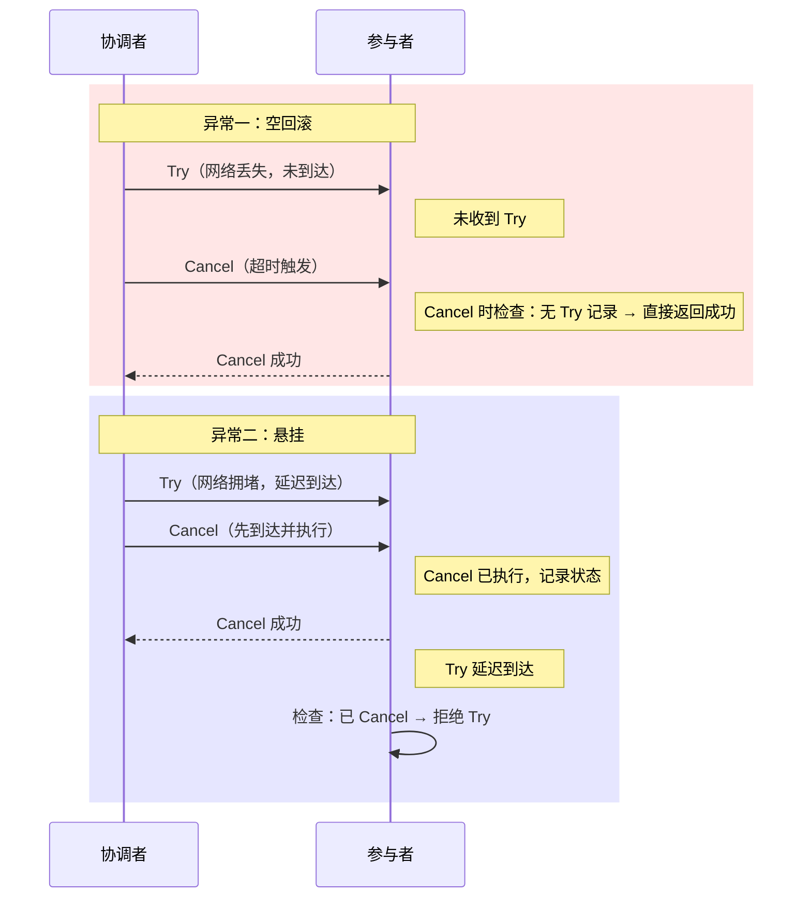
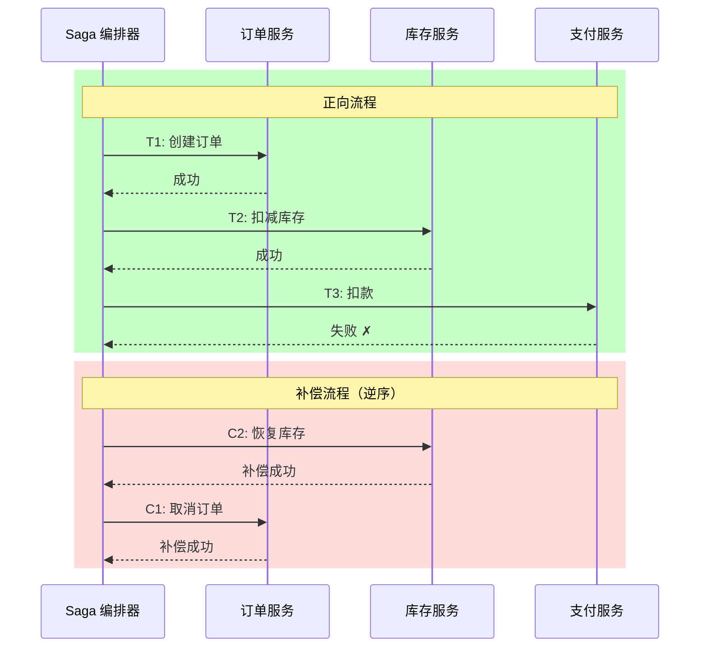
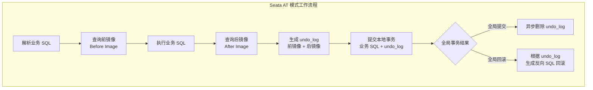

# 分布式事务

## 概念

**事务**是一组操作的集合，要么全部成功，要么全部失败，满足 ACID 特性（原子性、一致性、隔离性、持久性）。

**分布式事务**是指在分布式系统中，跨越多个服务、多个数据库或多个资源的事务操作。由于操作分散在不同节点上，单机事务的提交/回滚机制不再适用，需要额外的协调机制来保证数据一致性。

**CAP 定理背景**：分布式系统中，一致性（Consistency）、可用性（Availability）、分区容错性（Partition Tolerance）三者不可兼得。分布式事务的各种方案本质上都是在 C 与 A 之间寻找平衡。

---

## 核心原理

### 1. 为什么需要分布式事务

微服务架构下，一个业务操作往往涉及多个服务和多个数据库：

- **跨库操作**：订单服务写订单库，库存服务写库存库，支付服务写账户库，三个操作必须同时成功或同时失败。
- **跨服务调用**：服务 A 调用服务 B，A 成功但 B 失败，或网络超时导致状态不明，都会产生数据不一致。
- **单机事务失效**：分布式环境下无法使用本地数据库的 `BEGIN/COMMIT/ROLLBACK` 跨节点协调。

核心矛盾：**如何在网络不可靠、节点可能故障的前提下，保证多个节点的操作要么全部生效，要么全部不生效。**

---

### 2. 2PC（两阶段提交，Two-Phase Commit）

**角色**：
- **协调者（Coordinator）**：发起事务，负责协调各参与者。
- **参与者（Participant）**：执行实际操作的各节点。

**流程**：

```
阶段一：Prepare（准备阶段）
  协调者 → 所有参与者：发送 Prepare 请求
  参与者：执行操作，写 undo/redo 日志，但不提交，回复 Yes/No

阶段二：Commit / Rollback（提交阶段）
  若所有参与者回复 Yes → 协调者发送 Commit
  若任意参与者回复 No  → 协调者发送 Rollback
```



**问题**：

| 问题 | 说明 |
|------|------|
| 同步阻塞 | Prepare 阶段参与者持有锁等待协调者指令，期间资源被占用 |
| 单点故障 | 协调者宕机后参与者无限等待，事务无法推进 |
| 数据不一致 | 协调者发送 Commit 后宕机，部分参与者收到 Commit，部分未收到 |
| 脑裂 | 网络分区时，不同参与者收到不同指令 |

**适用场景**：对一致性要求极高、参与节点数量少、网络稳定的场景（如数据库内部、XA 协议）。

---

### 3. 3PC（三阶段提交，Three-Phase Commit）

针对 2PC 的单点故障和同步阻塞问题，3PC 引入超时机制和第三阶段。

**流程**：

```
阶段一：CanCommit
  协调者询问参与者是否可以执行事务，参与者仅回复 Yes/No，不锁资源

阶段二：PreCommit
  若所有参与者回复 Yes → 协调者发送 PreCommit
  参与者执行操作，写 undo/redo 日志，回复 Ack
  若有参与者回复 No   → 协调者发送 Abort

阶段三：DoCommit
  协调者发送 DoCommit，参与者提交事务
  参与者超时未收到 DoCommit → 默认提交（降低阻塞）
```



**改进**：
- 协调者和参与者都引入**超时机制**，避免无限等待。
- CanCommit 阶段不锁资源，减少阻塞时间。

**仍存在的问题**：
- 网络分区下，参与者超时默认提交，但其他参与者已收到 Abort，仍然导致**数据不一致**。
- 实现复杂，实际工程中 3PC 使用较少。

---

### 4. TCC（Try-Confirm-Cancel）

TCC 是一种**业务层面的补偿机制**，不依赖数据库的事务支持，由业务代码实现三个阶段。

**三个阶段**：

| 阶段 | 说明 | 示例（转账） |
|------|------|------------|
| Try | 预留资源，检查业务可行性，冻结资源但不实际扣减 | 冻结转出账户金额 |
| Confirm | Try 全部成功后执行实际业务操作，释放预留资源 | 实际扣减转出、增加转入 |
| Cancel | Try 失败或异常时释放预留资源，回滚业务操作 | 解冻转出账户金额 |

**三大异常问题**：

**空回滚**：Try 请求因网络问题未到达参与者，协调者超时触发 Cancel，参与者收到 Cancel 但从未执行 Try。
- 解决：Cancel 时检查是否执行过 Try，若没有则直接返回成功。

**幂等**：Try/Confirm/Cancel 因网络重试可能被调用多次，必须保证多次调用结果一致。
- 解决：每个操作生成全局唯一事务 ID，通过唯一键防止重复执行。

**悬挂**：Try 因网络拥堵延迟，Cancel 先于 Try 到达并执行完毕，之后 Try 才到达，导致资源被错误预留。
- 解决：Cancel 执行后记录状态，Try 执行前检查是否已被 Cancel，若是则拒绝执行。



**特点**：
- 一致性较强（最终一致）
- 侵入业务代码，开发成本高
- 适合对一致性要求较高、有明确资源预留语义的场景（金融、库存扣减）

---

### 5. Saga 模式

Saga 将长事务拆分为一系列**本地事务**，每个本地事务有对应的**补偿事务**。

**两种实现方式**：

**编排式（Orchestration）**：
- 有一个中央协调者（Saga Orchestrator）负责按顺序调用各本地事务。
- 某步失败时，协调者逆序调用已成功步骤的补偿事务。
- 优点：逻辑集中，便于监控和调试。
- 缺点：协调者成为单点，业务逻辑耦合在协调者中。

**协同式（Choreography）**：
- 各服务通过事件驱动，监听事件后执行本地事务并发布下一个事件。
- 某步失败时，发布补偿事件，各服务自行补偿。
- 优点：去中心化，服务解耦。
- 缺点：业务流程分散，难以追踪整体状态。

**补偿事务**：每个正向操作 $T_i$ 都有对应的补偿操作 $C_i$，满足 $T_i$ 后执行 $C_i$ 等同于未执行 $T_i$（语义上的撤销，非严格回滚）。

**特点**：
- 无全局锁，性能好，适合**长事务**场景
- 最终一致性，中间状态可见
- 补偿操作需要业务上可行（不是所有操作都能补偿）
- 适用于订单流程、物流、跨境支付等长业务流程



```mermaid
graph LR
    subgraph 协同式 Saga（事件驱动）
    A[订单服务<br/>创建订单] -->|OrderCreated| B[库存服务<br/>扣减库存]
    B -->|InventoryDeducted| C[支付服务<br/>扣款]
    C -->|PaymentFailed| B
    B -->|InventoryRestored| A
    A -->|OrderCancelled| D((结束))
    end
```

---

### 6. 本地消息表

通过将消息持久化到本地数据库，利用本地事务保证消息写入与业务操作的原子性，再通过轮询异步投递消息。

**流程**：

```
1. 业务操作与写消息表在同一个本地事务中执行
   BEGIN TRANSACTION
     执行业务操作（如：扣减库存）
     向本地消息表插入一条消息记录（状态：待发送）
   COMMIT

2. 定时任务轮询消息表，将"待发送"消息投递到消息队列

3. 消费方收到消息，执行对应业务操作，成功后通知生产方

4. 生产方将消息表中该记录状态更新为"已完成"
```

**关键设计**：
- 消息表与业务表在同一数据库，保证原子性。
- 定时任务轮询 + 重试，保证消息至少投递一次（At-Least-Once）。
- 消费方必须实现**幂等**，防止重复消费。

**特点**：
- 实现简单，依赖本地数据库即可
- 定时任务轮询有延迟，实时性不高
- 消息表随时间增长需要定期清理
- 适合对实时性要求不高、技术栈简单的场景

---

### 7. 事务消息（RocketMQ）

RocketMQ 提供原生的事务消息支持，避免本地消息表的轮询开销。

**核心概念**：
- **Half Message（半消息）**：消息发送到 Broker 但对消费者不可见，等待二次确认。
- **回查机制**：若生产者在超时内未发送 Commit/Rollback，Broker 主动向生产者回查本地事务状态。

**流程**：

```
1. 生产者发送 Half Message 到 Broker（消费者不可见）

2. Broker 存储 Half Message，返回 ACK

3. 生产者执行本地事务
   - 成功 → 发送 Commit，Broker 将消息设为可见
   - 失败 → 发送 Rollback，Broker 删除消息

4. 若生产者宕机或超时未响应：
   Broker 主动回查生产者，查询本地事务执行结果
   生产者返回 COMMIT / ROLLBACK / UNKNOWN
```

**与本地消息表对比**：
- 无需维护消息表，无需定时轮询
- 依赖 RocketMQ，基础设施要求更高
- 回查机制更优雅，延迟更低

**特点**：
- 最终一致性
- 高性能，适合高并发场景
- 消费方同样需要实现幂等

---

### 8. 方案对比表

| 方案 | 一致性强度 | 性能 | 实现复杂度 | 适用场景 |
|------|-----------|------|-----------|---------|
| 2PC | 强一致 | 低（同步阻塞） | 中 | 数据库 XA、节点少、网络稳定 |
| 3PC | 强一致（仍有缺陷） | 低 | 高 | 理论研究，实际较少使用 |
| TCC | 最终一致（接近强） | 中 | 高（侵入业务） | 金融转账、库存扣减 |
| Saga | 最终一致 | 高 | 中-高 | 长事务、订单流程、跨服务编排 |
| 本地消息表 | 最终一致 | 中 | 低 | 技术栈简单、实时性要求不高 |
| 事务消息（RocketMQ） | 最终一致 | 高 | 中 | 高并发、已有 MQ 基础设施 |

**选型建议**：
- 强一致需求 + 节点少 → 2PC / XA
- 金融核心业务、需要精确回滚 → TCC
- 长业务流程、松耦合 → Saga
- 已有 RocketMQ → 事务消息
- 快速落地、无 MQ → 本地消息表

---

### 9. Seata 框架

Seata 是阿里巴巴开源的分布式事务框架，提供 AT、TCC、Saga、XA 四种事务模式，覆盖从简单 CRUD 到复杂业务流程的各类场景。

**四种模式对比表：**

| 模式 | 原理 | 业务侵入性 | 一致性 | 性能 | 适用场景 |
|------|------|-----------|--------|------|---------|
| AT | 自动生成 undo log，框架自动回滚 | 低（无需改业务代码） | 最终一致 | 中 | 一般 CRUD 操作 |
| TCC | 业务层 Try/Confirm/Cancel | 高（需实现三个接口） | 最终一致（接近强一致） | 高 | 金融转账、库存扣减 |
| Saga | 状态机编排，正向+补偿事务 | 中（需实现补偿操作） | 最终一致 | 高 | 长事务、跨服务编排 |
| XA | 标准 XA 协议，数据库层面 | 低 | 强一致 | 低（同步阻塞） | 遗留系统、强一致需求 |

**AT 模式工作原理：**

```
1. 解析 SQL，生成前镜像（Before Image）
2. 执行业务 SQL
3. 生成后镜像（After Image）
4. 将前后镜像写入 undo_log 表
5. 提交本地事务（包含业务 SQL + undo_log）
6. 全局提交 → 异步删除 undo_log
   全局回滚 → 根据 undo_log 生成反向 SQL 执行回滚
```



**选型建议：**
- 普通业务 CRUD → AT 模式（开箱即用，侵入性低）
- 金融核心业务 → TCC 模式（精确控制回滚逻辑）
- 长流程业务 → Saga 模式（状态机编排）
- 对接遗留数据库 → XA 模式（标准协议兼容）

---

### 实战案例：电商下单跨服务事务

**场景**：用户下单涉及三个服务——订单服务（创建订单）、库存服务（扣减库存）、账户服务（扣减余额），三个操作必须全部成功或全部回滚。

**TCC 方案实现：**

```
Try 阶段：
  订单服务：创建订单（状态 = CREATING）
  库存服务：冻结库存（available -= 1, frozen += 1）
  账户服务：冻结余额（available -= 100, frozen += 100）

Confirm 阶段（全部 Try 成功）：
  订单服务：更新订单（状态 = CREATED）
  库存服务：扣减冻结库存（frozen -= 1）
  账户服务：扣减冻结余额（frozen -= 100）

Cancel 阶段（任一 Try 失败）：
  订单服务：删除订单
  库存服务：解冻库存（available += 1, frozen -= 1）
  账户服务：解冻余额（available += 100, frozen -= 100）
```

**Saga 方案实现：**

```
正向流程：
  T1: 创建订单 → T2: 扣减库存 → T3: 扣减余额 → 成功

补偿流程（假设 T3 失败）：
  C2: 恢复库存 → C1: 取消订单

注意：Saga 没有 Try 阶段的资源冻结，T1 创建订单后订单立即可见（中间状态），
如果 T3 失败需要补偿回滚，期间用户可能看到"已创建但最终取消"的订单。
```

**TCC vs Saga 对比（电商下单场景）：**

| 维度 | TCC | Saga |
|------|-----|------|
| 资源隔离 | Try 阶段冻结资源，其他请求不受影响 | 无冻结，可能出现超卖 |
| 中间状态 | 不可见（冻结态） | 可见（已扣减但可能回滚） |
| 一致性 | 接近强一致 | 最终一致，中间状态可见 |
| 开发成本 | 高（每个服务 3 个接口） | 中（每个服务 1 正向 + 1 补偿） |
| 适用判断 | 金额敏感、不能超卖 → TCC | 流程长、容忍中间状态 → Saga |

---

## 面试常问 & 怎么答

### Q1：分布式事务有哪些方案？怎么选？

**答题思路**：先说方案，再说选型维度。

**方案**：主流方案有六类——2PC、3PC、TCC、Saga、本地消息表、事务消息（如 RocketMQ）。

**怎么选**，取决于以下维度：

1. **一致性要求**：强一致用 2PC/TCC，最终一致用 Saga/消息方案。
2. **性能要求**：2PC 同步阻塞性能最差；消息方案、Saga 性能好。
3. **业务特点**：有明确资源预留语义选 TCC；长流程、多步骤选 Saga；简单异步解耦选消息方案。
4. **基础设施**：有 RocketMQ 优先用事务消息；无 MQ 可用本地消息表兜底。
5. **开发成本**：TCC 侵入性强，需要写三套接口；本地消息表最容易落地。

**实际项目中**通常是混合使用：核心资金操作用 TCC，订单流程用 Saga，异步通知用消息方案。

---

### Q2：TCC 的三个阶段各做什么？有什么问题？

**三个阶段**：

- **Try**：预检查 + 预留资源。检查业务可行性，冻结/预占资源，但不做实际业务变更。
- **Confirm**：正式提交。所有参与者 Try 成功后执行，做实际业务变更，释放预留资源。
- **Cancel**：回滚补偿。Try 失败或异常时调用，释放 Try 阶段预留的资源。

**三大问题**：

1. **空回滚**：Try 未执行（网络丢包）但 Cancel 被触发。解决方案：Cancel 时查询是否有 Try 记录，没有则直接返回成功。
2. **幂等**：网络重试导致接口被多次调用。解决方案：用全局事务 ID 做唯一键，重复请求直接返回上次结果。
3. **悬挂**：Cancel 先于 Try 到达并执行，之后 Try 才到，导致资源被错误预留。解决方案：Try 执行前检查该事务是否已被 Cancel，若已 Cancel 则拒绝 Try。

这三个问题通常通过一张**事务记录表**统一解决，记录每个全局事务各阶段的执行状态。

---

### Q3：如何用消息队列实现最终一致性？

**核心思路**：通过消息队列将同步调用转为异步，利用消息的持久化和重试机制保证最终一致性。

**方案一：本地消息表**

将"写消息"和"业务操作"放在同一本地事务中，保证原子性。定时任务轮询消息表，将未发送的消息投递到 MQ，消费方幂等消费后确认。

**方案二：RocketMQ 事务消息**

先发 Half Message，再执行本地事务，成功则 Commit 消息，失败则 Rollback。若生产者宕机，Broker 通过回查机制主动查询本地事务状态，决定消息是否投递。

**两个关键保证**：
1. **生产侧**：本地事务与消息投递的原子性（通过本地消息表或 Half Message 实现）。
2. **消费侧**：消费者必须实现幂等，因为消息可能被重复投递。

**适用场景**：跨服务异步操作，如：订单创建后异步通知库存服务、支付成功后异步发放优惠券。不适用于需要强一致、实时反馈结果的场景。

---

### Q4: TCC 和 Saga 的核心区别是什么？电商下单用哪个？

答题思路：

> TCC 和 Saga 最核心的区别在于**资源隔离**。
>
> TCC 的 Try 阶段会冻结资源（如冻结库存、冻结余额），在 Confirm 之前其他请求看不到这部分资源的变化，类似于"预扣"。这保证了较强的隔离性，但代价是每个服务需要实现 Try/Confirm/Cancel 三个接口，开发成本高。
>
> Saga 没有 Try 阶段，直接执行本地事务。如果后续步骤失败，通过补偿事务回滚。问题是中间状态可见——比如库存已经扣了但余额扣款失败，在补偿执行前用户可能看到一个"已创建但即将取消"的订单。
>
> 电商下单场景的选择：如果涉及资金操作（支付、余额扣减），建议用 TCC，因为不能容忍超卖或资金不一致；如果是长流程的订单编排（如物流、通知等非资金敏感操作），可以用 Saga 降低开发复杂度。实际项目中通常**混合使用**：核心的资金和库存操作用 TCC，后续的通知、积分等用 Saga 或消息方案。

---

## 看到什么就先想到这类

| 关键词 | 优先想到的方案 |
|--------|--------------|
| 微服务 + 跨库 + 数据一致性 | 分布式事务整体选型 |
| 转账 / 扣款 / 库存扣减 / 余额 | TCC（资源预留语义明确） |
| 订单流程 / 多步骤业务 / 补偿 | Saga 模式 |
| 消息队列 + 一致性 | 本地消息表 / RocketMQ 事务消息 |
| 异步解耦 + 最终一致 | 消息方案（本地消息表或事务消息） |
| XA / 数据库跨库事务 | 2PC |
| 空回滚 / 幂等 / 悬挂 | TCC 三大异常 |
| Half Message / 回查 | RocketMQ 事务消息 |
| 编排式 / 协同式 | Saga 两种实现方式 |
| 强一致 vs 最终一致 | 方案选型：强一致→TCC/2PC，最终一致→Saga/消息 |
