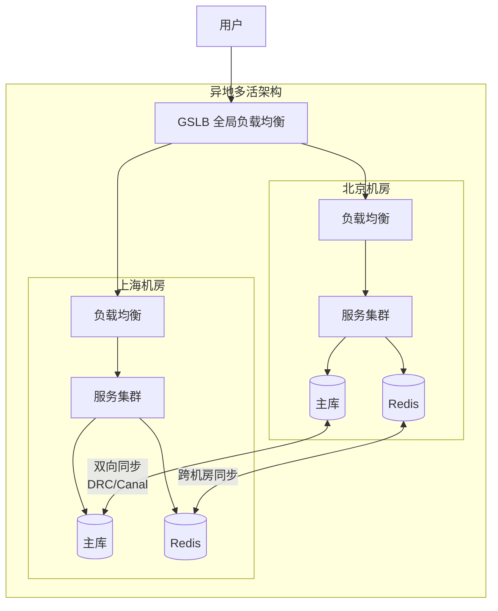
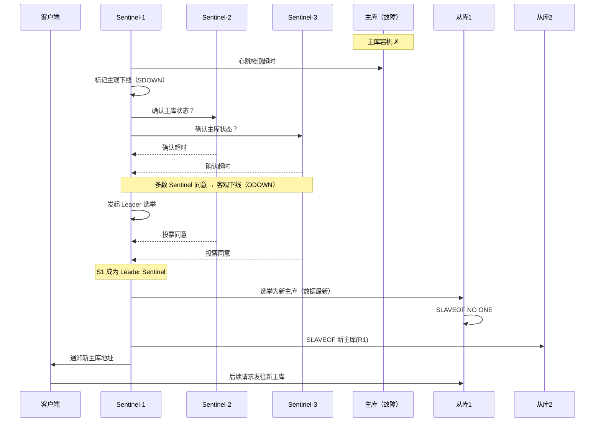
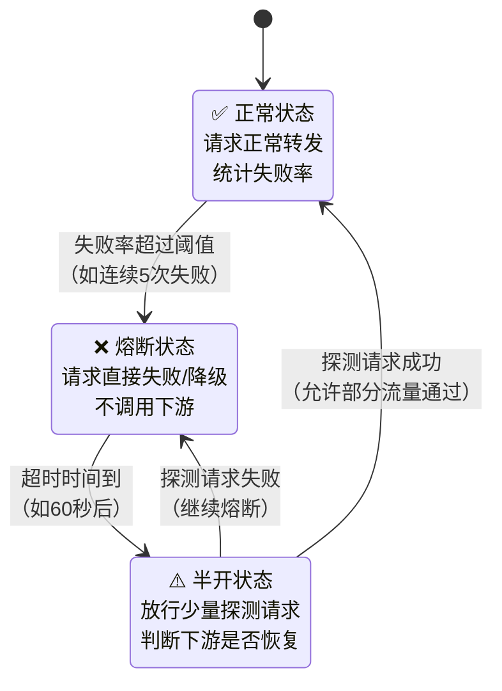
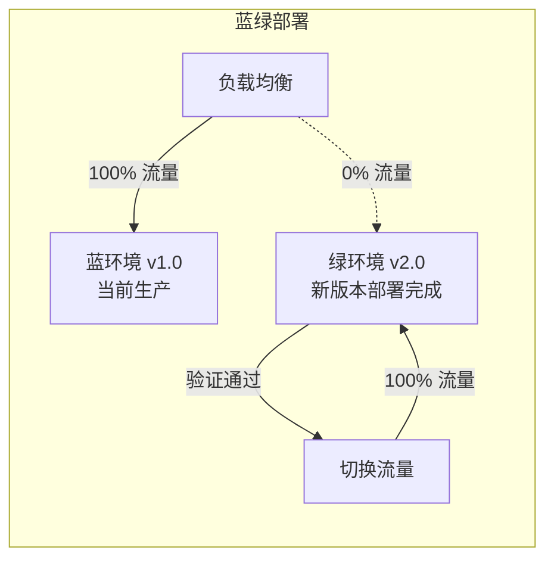
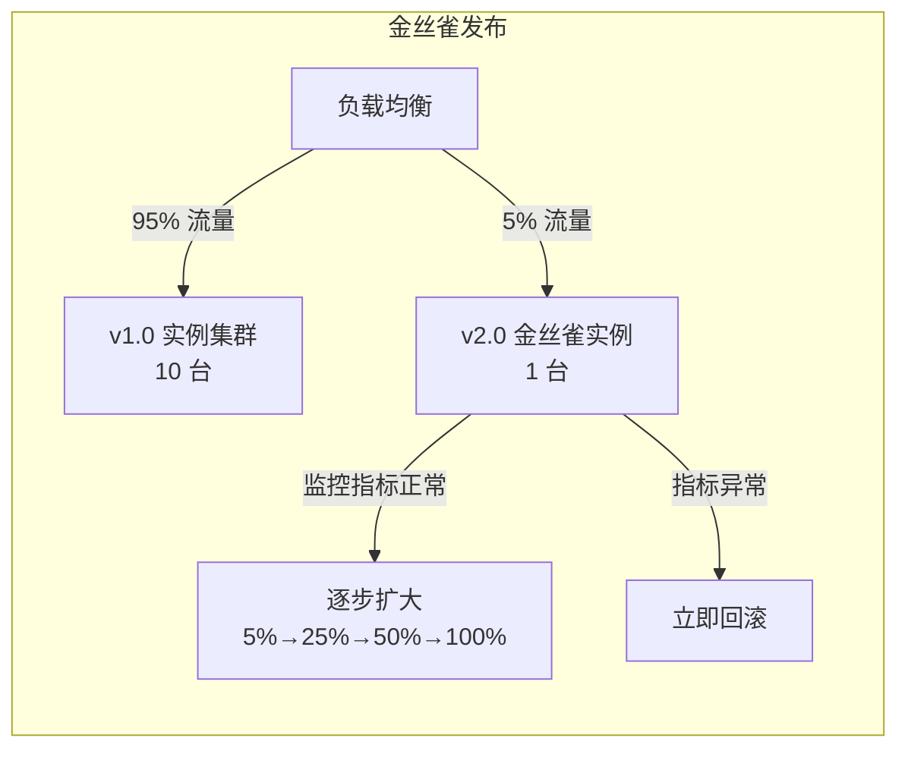

# 高可用架构

## 概念

**高可用（High Availability，HA）** 是指系统在规定时间内持续对外提供服务的能力，通常以可用性百分比衡量。高可用架构的核心目标是：**消除单点故障、缩短故障恢复时间、最大化系统正常运行时间**。

与之相关的两个关键指标：

- **RPO（Recovery Point Objective，恢复点目标）**：故障发生后，最多允许丢失多少数据（时间跨度）。
- **RTO（Recovery Time Objective，恢复时间目标）**：故障发生后，系统最多允许多长时间恢复服务。

RPO 越小，数据备份频率越高；RTO 越小，系统切换越快。两者都趋近于零是理想状态，但成本极高。

## 核心原理

### 1. 可用性度量 — SLA

SLA（Service Level Agreement，服务等级协议）是服务提供方对可用性的承诺。常见等级如下：

| SLA 等级 | 可用性 | 年最大停机时间 | 月最大停机时间 |
|---------|--------|-------------|-------------|
| 两个九  | 99%    | 约 87.6 小时  | 约 7.3 小时  |
| 三个九  | 99.9%  | 约 8.76 小时  | 约 43.8 分钟 |
| 四个九  | 99.99% | 约 52.6 分钟  | 约 4.4 分钟  |
| 五个九  | 99.999%| 约 5.26 分钟  | 约 26 秒    |

互联网核心业务通常要求三个九到四个九，金融、电信等关键系统要求五个九。

> 注意：SLA 是整个调用链的乘积。若服务 A 依赖 B 和 C，可用性分别为 99.9%，则整体可用性约为 99.9% × 99.9% × 99.9% ≈ 99.7%。依赖越多，可用性越难保证。

### 2. 冗余设计

冗余是高可用的基础，核心思路是**消除单点**，用多份副本来容忍部分节点失败。

**主从复制**

- **MySQL 主从**：主库负责写，从库异步/半同步复制，读请求可路由到从库。主库宕机后，从库提升为主库（需人工或自动化工具介入）。
- **Redis 主从**：同样支持主从复制，结合 Redis Sentinel 或 Cluster 可实现自动故障转移。

**多副本**

- **Kafka**：每个分区（Partition）有多个副本（Replica），其中一个为 Leader，其余为 Follower。Leader 宕机后，从 ISR（In-Sync Replicas）列表中选举新 Leader，保证消息不丢失。

**多活架构**

- **同城双活**：两个数据中心在同一城市，通过专线互联，延迟极低（通常 < 1 ms），可做实时数据同步和流量互切。
- **异地多活**：数据中心分布在不同城市甚至不同地区，延迟较高（几十到几百毫秒），需要解决数据一致性难题。通常采用分区隔离策略（如按用户 ID 哈希），让同一用户始终路由到同一机房，避免跨机房写冲突。
- **两地三中心**：同城双活 + 异地灾备，灾备中心通常不承载生产流量，仅做数据备份和应急切换。



**异地多活的核心挑战：**

**数据同步**：跨地域复制延迟（通常 30-100ms），在此期间两个机房可能读到不同版本的数据。

**路由策略**：
- **用户 ID 哈希**：按 userId % 机房数 路由，同一用户始终访问同一机房，避免跨机房写冲突
- **GeoDNS**：根据用户地理位置就近路由，降低延迟
- **流量调度**：通过 GSLB（全局负载均衡）实现机房级别的流量切换

**数据冲突解决**：
- **Last-Write-Wins（LWW）**：以最后写入的时间戳为准，简单但可能丢数据
- **业务层合并**：根据业务语义决定冲突策略（如购物车取并集）
- **单元化架构**：将数据按用户维度划分到不同单元（机房），同一用户的数据只在一个单元写入，从根本上避免写冲突

**实战案例：支付系统异地多活**
```
核心策略：金融数据单点写入 + 非核心数据多点写入

1. 资金类数据（余额、交易记录）：只在主机房写入，异地机房只读
   → 保证资金数据强一致性，不允许双写冲突
2. 非资金数据（用户信息、商品信息）：多机房写入，异步同步
   → 接受短暂不一致，换取低延迟
3. 路由规则：按用户 ID 分片，同一用户的交易始终路由到固定机房
4. 故障切换：主机房故障时，将该分片的写流量切到备机房
   → 切换期间有短暂的服务中断（秒级），但不会丢失数据
```

### 3. 故障检测

系统必须能快速、准确地发现节点故障，才能触发后续的故障转移流程。

- **心跳检测**：节点定期向注册中心或其他节点发送心跳包（如每 1～5 秒一次）。超过阈值时间未收到心跳，则判定节点疑似宕机。
- **健康检查**：主动探测目标节点的 HTTP `/health` 接口或 TCP 端口，验证其是否可正常响应。负载均衡器（Nginx、LVS）和服务注册中心（Consul、Nacos）均依赖此机制。
- **超时判定**：调用方发出请求后，在规定时间内未收到响应，则判定超时。超时是故障检测的第一道信号，但单次超时可能是网络抖动，通常结合多次失败才触发故障转移。

### 4. 故障转移

检测到故障后，需要快速将流量切换到健康节点。

**自动 failover**

- **Redis Sentinel**：由多个 Sentinel 节点共同监控主库。当多数 Sentinel 判定主库宕机（主观下线 → 客观下线），则从从库中选举新主库，并通知客户端更新连接地址。
- **MySQL MHA（Master High Availability）**：自动检测主库故障，将拥有最新数据的从库提升为新主库，其他从库重新指向新主库，整个切换过程通常在 30 秒内完成。

**手动切换**

适用于计划性维护、机房演练等场景。手动切换前需确保数据已完全同步，避免数据丢失。

**脑裂问题（Split-Brain）**

脑裂是指网络分区导致集群中出现多个节点同时认为自己是主节点的情况，可能引发数据冲突和写入不一致。

防护手段：
- **Quorum 机制**：只有获得多数节点（> N/2）投票的节点才能成为主节点。例如 Redis Sentinel 要求多数 Sentinel 同意才能触发选举。
- **Fencing（隔离）**：主动向旧主发送 STONITH（Shoot The Other Node In The Head）命令，强制关闭旧主或撤销其写权限，防止双写。
- **Epoch/Term 机制**：每轮选举递增 epoch 编号，旧主收到更高 epoch 的消息后自动降级为从节点（Raft、ZooKeeper ZAB 均采用此策略）。



### 5. 容错机制

在下游服务不稳定时，通过多种手段保护整个调用链的稳定性。

> 限流和熔断的详细原理（令牌桶算法、漏桶算法、Hystrix 状态机等）在 `rate-limiting.md` 中有完整讲解，本节做概览串联。

**限流（Rate Limiting）**

控制进入系统的请求速率，防止流量洪峰打垮下游。

- **令牌桶**：以固定速率生成令牌，请求消耗令牌，允许一定程度突发流量。
- **漏桶**：请求以固定速率流出，削峰填谷，不允许突发，输出绝对平滑。

**熔断（Circuit Breaker）**

当下游服务失败率超过阈值，自动"断路"，后续请求直接失败或走降级逻辑，避免级联故障。

- Hystrix / Resilience4j 采用**状态机**：`Closed`（正常）→ `Open`（熔断）→ `Half-Open`（探测恢复）→ `Closed`。
- 关键参数：失败率阈值、滑动窗口大小、half-open 期间允许的探测请求数。



**降级（Fallback / Degradation）**

在系统压力过大或依赖不可用时，主动放弃非核心功能，保障核心链路可用。

- 例：商品详情页无法获取推荐列表时，返回空列表而非报错；评论服务不可用时，隐藏评论模块。
- 降级分为**自动降级**（熔断触发）和**手动降级**（运营开关）。

**降级分级策略：**

| 级别 | 类型 | 策略 | 示例 |
|------|------|------|------|
| L1 | 功能降级 | 关闭非核心功能 | 关闭推荐、评论、个性化 |
| L2 | 数据降级 | 返回缓存/兜底数据 | 商品价格取缓存、列表取静态化数据 |
| L3 | 体验降级 | 简化交互和展示 | 关闭动画、降低图片质量、简化页面 |
| L4 | 服务降级 | 限制部分用户访问 | 非会员限流、只允许核心操作 |

**降级决策依据：**
- 系统负载超过 80% → 触发 L1（关闭非核心功能）
- 依赖服务不可用 → 触发 L2（返回缓存数据）
- 多个依赖同时不可用 → 触发 L3（简化页面）
- 系统即将过载 → 触发 L4（限制用户访问）

**重试（Retry）**

对瞬时故障（网络抖动、短暂超时）进行重试，提升成功率。

- **指数退避（Exponential Backoff）**：每次重试间隔时间翻倍，避免重试风暴。公式：$\text{wait} = \min(\text{cap},\ \text{base} \times 2^{n})$，其中 $n$ 为重试次数。
- **加随机抖动（Jitter）**：在退避时间基础上加随机值，防止大量客户端同时重试造成惊群效应。
- 注意：重试只适用于**幂等接口**，非幂等操作（如支付、下单）重试前必须确保幂等性保障。

**超时控制（Timeout）**

为所有外部调用设置合理超时，防止慢调用耗尽线程池资源。

- 建议：超时时间 = 下游 P99 响应时间 × 1.5～2 倍。
- 需要在整个调用链（HTTP 客户端、数据库连接池、消息队列消费者）统一设置超时。

### 6. 负载均衡

负载均衡将流量分发到多个后端节点，既提升吞吐量，也消除单点。

**四层 vs 七层**

| 维度 | 四层（传输层） | 七层（应用层） |
|-----|-------------|-------------|
| 典型实现 | LVS、F5、AWS NLB | Nginx、HAProxy、AWS ALB |
| 工作层次 | TCP/UDP | HTTP/HTTPS |
| 性能 | 极高，内核态转发 | 较高，用户态解析 |
| 功能 | 简单端口转发 | URL 路由、SSL 卸载、Header 改写 |
| 适用场景 | 高并发接入层 | 微服务网关、API 路由 |

**负载均衡算法**

- **轮询（Round Robin）**：依次将请求分配给每个节点，适合节点性能相近的场景。
- **加权轮询（Weighted Round Robin）**：按节点权重分配流量，适合异构集群。
- **最少连接（Least Connections）**：将请求路由到当前活跃连接数最少的节点，适合长连接场景。
- **一致性哈希（Consistent Hashing）**：根据请求特征（如用户 ID、IP）哈希到固定节点，保证同一用户始终命中同一节点（有利于缓存命中），节点增减时只影响少量映射。

### 7. 容灾与恢复

**RPO vs RTO 权衡**

| 策略 | RPO | RTO | 成本 |
|-----|-----|-----|------|
| 冷备（定期备份） | 小时级 | 小时级 | 低 |
| 温备（从库 + 手动切换） | 分钟级 | 分钟级 | 中 |
| 热备（自动 failover） | 秒级 | 秒级 | 高 |
| 同城双活 | 近零 | 秒级 | 很高 |
| 异地多活 | 近零 | 近零 | 极高 |

**备份策略**

- **全量备份**：定期（每天/每周）对数据做完整快照，恢复简单但耗时、存储占用大。
- **增量备份**：仅备份自上次备份以来变更的数据（如 MySQL binlog），恢复时需要先恢复全量再回放增量。
- **3-2-1 原则**：至少 3 份副本，存储在 2 种不同介质上，其中 1 份异地存储。

**灰度发布与回滚**

- **灰度发布（金丝雀发布）**：先将新版本发布到小比例实例（如 1%～5%），观察错误率、延迟等指标，确认无异常后逐步扩大流量比例，最终全量切换。
- **蓝绿部署**：维护两套生产环境（蓝/绿），新版本部署到绿环境，测试通过后将流量整体切换，旧版本保留一段时间方便快速回滚。
- **回滚策略**：部署系统应支持一键回滚，回滚时间纳入 RTO 计算范围。数据库变更（Schema migration）需提前准备反向脚本。





### 8. 故障演练与混沌工程

**混沌工程（Chaos Engineering）** 是通过主动向系统注入故障来验证系统韧性的实践，由 Netflix 在 2010 年首创。

**核心原则：**
- **定义稳态假设**：明确系统正常状态的指标（如 P99 延迟 < 200ms、错误率 < 0.1%）
- **引入真实世界事件**：模拟节点宕机、网络延迟、磁盘满、依赖服务不可用等
- **在生产环境运行**：测试环境无法复现真实的复杂交互，生产环境的故障演练才有价值
- **最小化爆炸半径**：从小范围开始（单个实例），逐步扩大影响范围

**主流工具：**

| 工具 | 来源 | 特点 |
|------|------|------|
| Chaos Monkey | Netflix | 随机终止生产实例，验证服务冗余 |
| ChaosBlade | 阿里巴巴 | 支持 JVM/容器/网络/磁盘多维度故障注入 |
| LitmusChaos | CNCF | Kubernetes 原生，声明式故障实验 |
| Gremlin | 商业 | SaaS 平台，企业级故障注入 |

**演练流程：**
```
1. 定义稳态指标（P99 延迟、错误率、QPS）
2. 设计实验（如：随机杀死一个 Redis 从节点）
3. 限定爆炸半径（仅影响 5% 流量）
4. 执行实验，持续监控指标
5. 分析结果：指标是否偏离稳态？
6. 修复发现的弱点，完善告警和自动恢复机制
```

## 面试常问 & 怎么答

**Q1：如何设计一个高可用系统？从哪些方面考虑？**

答题思路：分层回答，覆盖从接入层到数据层的完整链路。

> 设计高可用系统我会从以下几个维度切入：
>
> **一、消除单点故障**：所有关键组件（网关、服务、数据库、缓存、消息队列）都做冗余部署，通过负载均衡分发流量。
>
> **二、故障检测与自动转移**：配置健康检查和心跳机制，结合 Redis Sentinel、MySQL MHA 等工具实现自动 failover，降低 RTO。
>
> **三、容错保护**：在服务调用链中加入限流、熔断、降级和超时控制，防止局部故障扩散为全局雪崩。
>
> **四、数据冗余与备份**：数据库主从复制 + 定期备份，明确 RPO 和 RTO 目标，决定是否需要多活架构。
>
> **五、灰度发布与可观测性**：通过灰度发布降低变更风险，结合监控告警（指标、日志、链路追踪）快速定位和恢复故障。
>
> 最后，高可用是有成本的，需要根据业务的 SLA 目标（三个九还是四个九）来决定投入程度，而不是一味追求五个九。

---

**Q2：什么是脑裂？怎么防止？**

答题思路：先解释现象，再说危害，最后给出防护方案。

> **脑裂**是分布式系统中，因网络分区导致集群被切割成多个互不通信的子集，每个子集都认为自己是合法的主节点，进而同时接受写请求，导致数据不一致的问题。
>
> 常见于主从架构：主节点与 Sentinel/ZooKeeper 网络断开，Sentinel 误认为主库宕机并选出新主，而旧主仍在接受客户端写入，此时两个主库同时写入，数据产生冲突。
>
> **防护手段**：
> 1. **Quorum 机制**：选举新主必须获得多数节点投票（> N/2），网络分区后少数派无法选出新主，只有多数派侧继续服务。
> 2. **Fencing**：通过 STONITH 或撤销旧主写权限，强制旧主下线，确保任意时刻只有一个可写主节点。
> 3. **Epoch/Term**：每次选举递增任期编号，旧主收到更高任期消息后自动降级，拒绝后续写入。
>
> Redis Sentinel 使用 Quorum；Raft 协议通过 Term + 多数派写入共同防止脑裂。

---

**Q3：限流、熔断、降级分别是什么？什么时候用哪个？**

答题思路：先分别定义，再对比使用场景，最后说明三者协同关系。

> 三者都是保护系统稳定性的手段，但作用对象和触发时机不同：
>
> - **限流**：控制**入口流量**，防止超出系统处理能力的请求进入。属于**事前防御**，不管下游是否正常，只要流量超阈值就拒绝或排队。典型场景：秒杀活动、API 网关接入层。
>
> - **熔断**：监控**对下游的调用失败率**，当失败率超阈值时自动断路，后续请求不再真正发往下游，直接走 fallback。属于**异常保护**，下游故障时保护调用方不被拖垮。典型场景：微服务间调用、依赖第三方接口。
>
> - **降级**：在系统压力大或依赖不可用时，主动**放弃非核心功能**，返回兜底数据，保障核心链路。可以由熔断自动触发，也可以通过配置开关手动触发。典型场景：大促期间关闭推荐、评论等非核心服务。
>
> **协同关系**：限流在最前端控制流量总量；熔断在调用层感知下游故障并断路；降级是熔断或限流触发后的兜底策略。三者配合形成完整的容错防线。

---

**Q4：如何设计一个 99.99% 可用的系统？**

答题思路：分层回答，从架构到运维全覆盖。

> 99.99% 意味着每月最多 4.4 分钟停机，这要求从多个层面综合保障：
>
> **架构层面**：所有关键组件消除单点——应用层无状态 + 负载均衡；数据层主从复制 + 自动 failover（Redis Sentinel、MySQL MHA）；使用多可用区部署，至少跨两个 AZ。
>
> **容错层面**：服务间调用配置熔断（Resilience4j）、限流（Redis + Lua）和超时控制；所有外部调用设合理超时（下游 P99 × 2）；核心链路做降级兜底（缓存 → 静态数据 → 友好错误页）。
>
> **变更层面**：灰度发布（先 1% → 5% → 50% → 100%），每一步都观察错误率和延迟指标；数据库变更提前准备回滚脚本；所有变更可一键回滚。
>
> **监控层面**：全链路监控（Prometheus + Grafana + 分布式追踪）；关键指标设多级告警（P1 立即响应、P2 15 分钟内响应）；定期做故障演练（Chaos Engineering），验证告警和自动恢复机制是否生效。
>
> 最后强调：99.99% 的成本远高于 99.9%。需要评估业务是否真的需要四个九，大多数互联网业务三个九已经足够。

---

**Q5：异地多活最大的挑战是什么？**

答题思路：围绕数据一致性展开。

> 异地多活最大的挑战是**数据一致性**。
>
> 跨地域的网络延迟通常在 30-100ms，在这段时间内两个机房可能读到不同版本的数据。如果两个机房同时对同一条数据做写操作，就会产生写冲突。
>
> **解决思路有三种**：
> 1. **单元化架构**（推荐）：按用户 ID 将数据划分到不同单元，同一用户的所有写操作只在一个机房执行，从根本上避免写冲突。这是蚂蚁金服、美团等大厂的主流方案。
> 2. **单点写入 + 多点读**：写操作只在主机房执行，其他机房做只读副本。简单可靠，但主机房故障时需要切换写入点，有短暂不可用。
> 3. **多点写入 + 冲突解决**：允许多个机房同时写入，通过 Last-Write-Wins 或业务层合并解决冲突。实现复杂，适合对一致性要求不高的数据（如用户偏好设置）。
>
> 除数据一致性外，还有路由策略（如何将用户精确路由到正确机房）、故障检测和切换速度、基础设施成本（双倍资源+专线）等挑战。

## 看到什么就先想到这类

遇到以下关键词或场景，优先联想高可用相关知识点：

- **"系统宕机/故障恢复"** → 故障检测 + 自动 failover + RTO/RPO
- **"单点故障"** → 冗余设计、主从/多副本、多活架构
- **"服务雪崩/级联故障"** → 限流 + 熔断 + 降级 + 超时控制
- **"两个主库/数据不一致"** → 脑裂 + Quorum + Fencing
- **"99.9%/四个九/SLA"** → 可用性度量、年停机时间换算
- **"大促/流量洪峰"** → 限流 + 降级 + 扩容 + 灰度发布
- **"数据备份/灾备"** → RPO/RTO + 全量/增量备份 + 3-2-1 原则
- **"蓝绿部署/金丝雀"** → 灰度发布、回滚策略、变更管控
- **"Nginx/LVS/HAProxy"** → 四层 vs 七层负载均衡、调度算法
- **"Redis Sentinel/MySQL MHA/Raft/ZooKeeper"** → 自动 failover、选举机制、脑裂防护
- **"混沌工程 / 故障注入 / 故障演练"** → Chaos Engineering → 定义稳态 → 注入故障 → 分析
- **"异地多活 / 跨机房"** → 单元化架构、数据分片路由
- **"降级策略 / 功能开关"** → 四级降级：功能→数据→体验→服务
