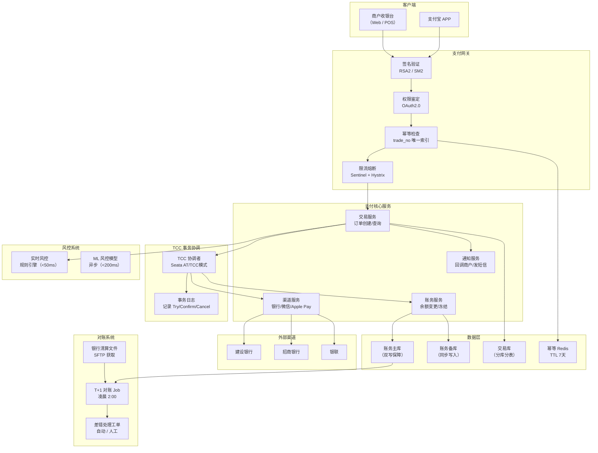
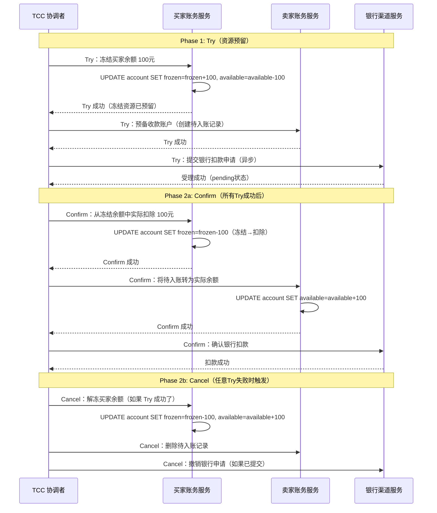
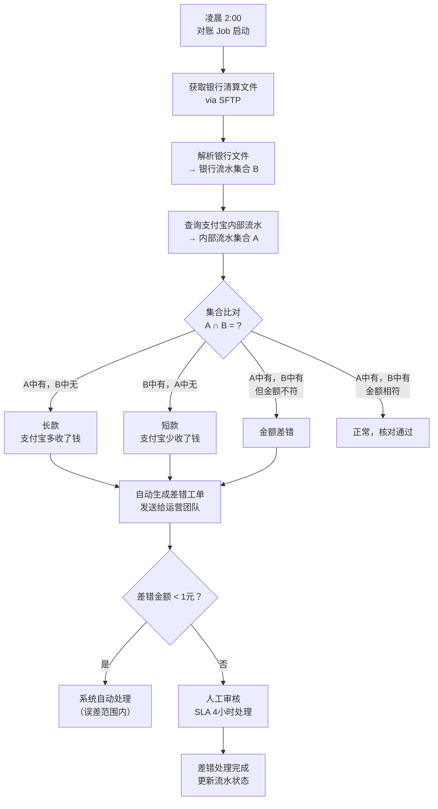
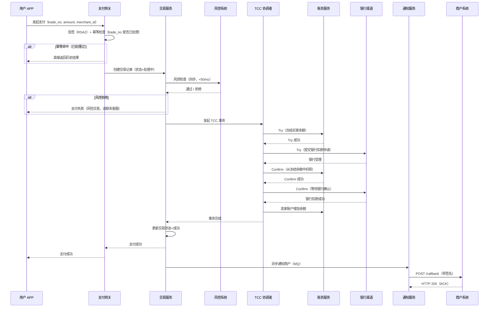

# 支付宝支付系统设计

> **面试场景：** 蚂蚁集团 / 腾讯支付 高级后端工程师 / 金融系统架构师 系统设计面试  
> **高频指数：** ⭐⭐⭐⭐⭐

## 题目背景

**面试官原话：**
> "请设计一个支付系统，类似支付宝。需要支持用户之间转账、用户给商户付款。重点考虑高并发下的数据一致性，以及资金安全。"

**业务背景：**  
2023 年双十一，支付宝峰值处理 **583,000 笔/秒**（58.3 万 TPS），日均交易额万亿级人民币。支付系统的核心特征是**零容错**——任何一笔账务错误（多扣/少扣/重复扣）都可能面临法律风险和用户信任危机。

**与普通业务系统的本质区别：**
- **强一致性优先**：宁可响应慢，也不能出现账务不平
- **幂等性是一等公民**：网络抖动导致的重试不能导致重复扣款
- **对账是最后防线**：所有实时系统都可能出 Bug，对账发现并修复差错
- **合规审计**：每一笔资金流动都必须有完整的流水记录，可追溯

---

## 关键指标估算

| 指标 | 估算过程 | 结果 |
|------|----------|------|
| 峰值 TPS | 2023双十一历史峰值 | **583,000 TPS** |
| 日均交易笔数 | 全年约 3000 亿笔 ÷ 365 | **~8.2 亿笔/天** |
| 日均交易额 | 淘宝+支付宝整体 GMV | **~万亿级/天（大促）** |
| 账务流水存储 | 8.2亿笔/天 × 500B/笔 | **~400GB/天**，需要分库分表+冷热分层 |
| P99 延迟要求 | 用户侧感知：支付确认 < 3s | 核心链路 P99 < **1000ms** |
| 对账文件大小 | 8.2亿笔 × 100B（精简字段） | **~82GB/天**，银行清算文件对比 |
| 数据库连接数 | 58.3万TPS ÷ 每连接1000TPS | 需 **580+ 数据库连接**，分库分表后分散 |
| 幂等存储 | 8.2亿笔/天幂等key，TTL 7天 | Redis 存储约 **100GB**（压缩后） |

---

## 高层架构



---

## 核心设计决策

### 决策一：分布式事务——TCC 模式

**问题：** 一笔付款涉及多个操作：扣买家账户 → 加卖家账户 → 通知商户 → 更新订单状态。任何一步失败都必须回滚，但这些操作分布在不同服务、不同数据库。

**方案对比：**

| 方案 | 优点 | 缺点 | 适用 |
|------|------|------|------|
| **XA 2PC（强一致）** | 实现简单，DB原生支持 | 全局锁，性能差10x；协调者宕机可能永久阻塞 | 低并发金融系统 |
| **SAGA（补偿事务）** | 无全局锁，高性能 | 中间状态可见，补偿逻辑复杂 | 长流程业务（订单状态流转） |
| **TCC（Try-Confirm-Cancel）** | 无全局锁，业务侵入可控，一致性强 | 需要业务实现3个接口 | **支付核心链路首选** |
| **本地消息表** | 最终一致，简单 | 不保证实时，有延迟 | 通知、积分等非核心 |

**TCC 详细实现：**



**空回滚与幂等防护：**
```java
// TCC Cancel 接口必须处理"未执行 Try 就收到 Cancel"的场景（网络分区）
@Override
public boolean cancel(BusinessActionContext ctx) {
    String tradeNo = ctx.getActionContext("trade_no").toString();
    
    // 查询 Try 阶段是否执行过（通过事务记录表判断）
    TccRecord record = tccRecordRepo.findByTradeNo(tradeNo);
    if (record == null) {
        // 空回滚：Try 从未执行（或事务记录未写入），直接返回成功
        // 同时插入一条"已Cancel"记录，防止后续 Try 执行（防悬挂）
        tccRecordRepo.insert(TccRecord.canceledRecord(tradeNo));
        return true;
    }
    
    if (TccStatus.CANCELED.equals(record.getStatus())) {
        // 幂等：已经 Cancel 过，直接返回成功
        return true;
    }
    
    // 真正的 Cancel 逻辑
    accountService.unfreeze(ctx.getActionContext("user_id"), 
                           ctx.getActionContext("amount"));
    tccRecordRepo.updateStatus(tradeNo, TccStatus.CANCELED);
    return true;
}
```

---

### 决策二：幂等设计

**问题：** 网络超时导致客户端重试，或 MQ 消息重复投递，都可能触发重复扣款。

**三层幂等防护：**

```
Layer 1: API 层 —— trade_no 唯一索引（数据库级别）
    └─ 同一 trade_no 重复请求，直接返回首次结果

Layer 2: Redis 层 —— 分布式锁（防并发重复提交）
    └─ SET NX + EX，同一 trade_no 只允许一个线程处理

Layer 3: 业务层 —— 状态机检查（双重保险）
    └─ 已支付/已取消的订单拒绝重复处理
```

**核心幂等表设计：**
```sql
CREATE TABLE idempotency_record (
    trade_no    VARCHAR(64) PRIMARY KEY,    -- 全局唯一交易号（雪花算法）
    status      TINYINT NOT NULL,           -- 0处理中 1成功 2失败
    result      TEXT,                       -- 序列化的响应结果（成功时缓存）
    created_at  DATETIME NOT NULL,
    expired_at  DATETIME NOT NULL           -- 7天后过期（定时清理）
) ENGINE=InnoDB;
```

**trade_no 生成规则（雪花算法扩展版）：**
```
trade_no = 时间戳(41bit) + 机房ID(5bit) + 机器ID(10bit) + 序列号(8bit)
         = 64bit 整数，转 10进制约 20位数字
示例：2311110000012345678（23=年，1111=日期，后面是唯一序列）
```

---

### 决策三：对账系统设计

**对账是所有实时系统的最后防线。** 不管幂等做得多好，总有极端 Case（机器宕机恰好在写 DB 之前）导致数据不一致，对账负责发现并修复。

**T+1 对账流程：**



**三种差错类型及处理方式：**

| 差错类型 | 定义 | 常见原因 | 处理方式 |
|----------|------|----------|----------|
| **长款（支付宝多了钱）** | 支付宝记录了收款，但银行未付款 | 银行接口超时后重试，银行已扣款但回调未到达 | 主动联系银行核查；如确认多收，退款给用户 |
| **短款（支付宝少了钱）** | 银行付款了，但支付宝未收到 | 银行回调丢失；支付宝系统异常导致未记账 | 触发补偿记账；向银行请求对账确认 |
| **未达账** | 两边都有记录但状态不匹配 | 跨日交易（23:59提交，00:01完成）导致日期归属不同 | 按银行实际到账日期更新支付宝流水状态 |

---

### 决策四：数据库分库分表

**问题：** 8.2亿笔/天流水，单表很快超过千万行，查询性能下降。

**分表策略：**

```
交易库（trade_db）：按 user_id % 1024 分表
    ├─ trade_0000（user_id % 1024 == 0 的用户）
    ├─ trade_0001
    ├─ ...
    └─ trade_1023

路由索引库（route_db）：trade_no → user_id 的映射
    ├─ trade_route_0（trade_no % 256 == 0）
    └─ ...

账务库（account_db）：按 user_id % 256 分表（账户数 << 交易数）
```

**两种查询模式：**

```java
// 查询 1：根据 user_id 查自己的交易记录（直接路由）
public List<Trade> findByUserId(Long userId, PageParam page) {
    int tableIndex = userId.intValue() % 1024;
    String tableName = "trade_" + String.format("%04d", tableIndex);
    return jdbcTemplate.query(
        "SELECT * FROM " + tableName + " WHERE user_id=? ORDER BY created_at DESC LIMIT ? OFFSET ?",
        userId, page.getSize(), page.getOffset()
    );
}

// 查询 2：根据 trade_no 查交易（需要先查路由表）
public Trade findByTradeNo(String tradeNo) {
    // 第一步：查路由表，获取 user_id
    int routeIndex = tradeNo.hashCode() & 255;
    Long userId = routeDb.queryForObject(
        "SELECT user_id FROM trade_route_" + routeIndex + " WHERE trade_no=?",
        Long.class, tradeNo
    );
    // 第二步：根据 user_id 路由到正确分表
    return findByUserIdAndTradeNo(userId, tradeNo);
}
```

---

### 决策五：资金安全——双写机制

**问题：** 账务数据是最核心的资产，不能有任何丢失。

**双写方案：**
```
写请求 → 主库（account_db_master）写入
        → 备库（account_db_backup）同步写入
        ← 两者都返回成功，才向上层返回成功
```

**与普通主从复制的区别：**
- 普通主从：主库写入后异步同步到从库（可能丢数据）
- 双写：同步写两个库，任何一个失败都回滚，强一致性

**双写实现：**
```java
@Transactional
public void updateBalance(Long userId, BigDecimal delta, String tradeNo) {
    try {
        // 写入主库
        masterDataSource.execute(
            "UPDATE account SET balance=balance+?, version=version+1 WHERE user_id=? AND version=?",
            delta, userId, currentVersion
        );
        
        // 同步写入备库（网络调用，超时设置 500ms）
        backupDataSource.executeWithTimeout(
            "UPDATE account SET balance=balance+?, version=version+1 WHERE user_id=? AND version=?",
            delta, userId, currentVersion, 500
        );
        
        // 记录流水（主库）
        masterDataSource.execute(
            "INSERT INTO account_journal(trade_no, user_id, delta, balance_after, created_at) VALUES(?,?,?,?,NOW())",
            tradeNo, userId, delta, newBalance
        );
        
    } catch (BackupWriteException e) {
        // 备库写失败：触发告警，人工介入，不能静默忽略
        alertService.critical("备库写入失败！trade_no=" + tradeNo + ", 需立即检查数据一致性");
        throw e; // 整体回滚
    }
}
```

---

### 决策六：银行渠道限流熔断

**问题：** 银行接口是外部系统，SLA 仅 99.9%，且在大促期间响应变慢（500ms → 5000ms）。

**Hystrix 熔断配置：**
```java
@HystrixCommand(
    commandProperties = {
        @HystrixProperty(name="execution.isolation.thread.timeoutInMilliseconds", value="500"),
        @HystrixProperty(name="circuitBreaker.requestVolumeThreshold", value="20"),
        @HystrixProperty(name="circuitBreaker.errorThresholdPercentage", value="50"),
        @HystrixProperty(name="circuitBreaker.sleepWindowInMilliseconds", value="30000")
    },
    fallbackMethod = "bankPaymentFallback"
)
public BankResponse callBankApi(BankRequest request) {
    return bankHttpClient.deduct(request);
}

// 熔断后的降级处理：不是直接失败，而是转入"处理中"状态
public BankResponse bankPaymentFallback(BankRequest request) {
    // 将交易标记为"银行处理中"，异步轮询银行结果
    tradeService.markAsBankPending(request.getTradeNo());
    // 返回给用户："支付请求已提交，请稍等"
    return BankResponse.pending("支付请求已提交，预计1-5分钟内完成");
}
```

---

## 详细设计

### 完整支付流程



### 数据模型

**账户表：**
```sql
CREATE TABLE account (
    user_id     BIGINT PRIMARY KEY,
    balance     DECIMAL(20,2) NOT NULL DEFAULT 0.00,    -- 可用余额
    frozen      DECIMAL(20,2) NOT NULL DEFAULT 0.00,    -- 冻结余额
    version     BIGINT NOT NULL DEFAULT 0,              -- 乐观锁版本
    created_at  DATETIME NOT NULL,
    updated_at  DATETIME NOT NULL,
    CHECK (balance >= 0),
    CHECK (frozen >= 0)
) ENGINE=InnoDB;
```

**流水表（账务明细）：**
```sql
CREATE TABLE account_journal_0001 (  -- 按 user_id 分表
    id          BIGINT PRIMARY KEY,
    trade_no    VARCHAR(64) NOT NULL,
    user_id     BIGINT NOT NULL,
    direction   TINYINT NOT NULL,      -- 1收入 -1支出
    amount      DECIMAL(20,2) NOT NULL,
    balance_before DECIMAL(20,2) NOT NULL,
    balance_after  DECIMAL(20,2) NOT NULL,
    biz_type    TINYINT NOT NULL,      -- 1支付 2退款 3转账 4充值
    memo        VARCHAR(256),
    created_at  DATETIME NOT NULL,
    UNIQUE KEY uk_trade_no (trade_no),   -- 幂等防重
    KEY idx_user_created (user_id, created_at)
) ENGINE=InnoDB;
```

**幂等记录表：**
```sql
CREATE TABLE idempotency_record (
    trade_no    VARCHAR(64) PRIMARY KEY,
    biz_status  TINYINT NOT NULL,      -- 0处理中 1成功 2失败
    response    TEXT,                   -- JSON序列化的响应（复用返回）
    created_at  DATETIME NOT NULL,
    expired_at  DATETIME NOT NULL,
    KEY idx_expired (expired_at)        -- 定时清理用
) ENGINE=InnoDB;
```

**对账差错工单表：**
```sql
CREATE TABLE reconcile_diff (
    id              BIGINT PRIMARY KEY,
    reconcile_date  DATE NOT NULL,
    trade_no        VARCHAR(64),
    diff_type       TINYINT NOT NULL,  -- 1长款 2短款 3金额差错 4未达账
    alipay_amount   DECIMAL(20,2),
    bank_amount     DECIMAL(20,2),
    bank_code       VARCHAR(20),       -- 银行编码
    status          TINYINT NOT NULL,  -- 0待处理 1处理中 2已处理
    handler         VARCHAR(64),       -- 处理人
    resolved_at     DATETIME,
    KEY idx_date_status (reconcile_date, status)
) ENGINE=InnoDB;
```

---

## 踩过的坑 / 生产经验

### 坑一：TCC Cancel 超时——资金被"永久冻结"

**事故经过：**  
TCC Try 阶段冻结了买家余额，在执行 Confirm 时，由于 GC Stop-the-World 暂停（超过 TCC 超时阈值），协调者认为事务超时，触发 Cancel。但 Cancel 请求又恰好遇到账务服务滚动重启（1分钟内），Cancel 执行失败。结果：买家余额被冻结，但订单未完成。用户的钱"消失了"。

**解决方案：**
1. TCC 协调者实现重试机制：Cancel 失败后，间隔 [1s, 5s, 30s, 5min, 30min, 2h] 指数退避重试，最多重试 24 小时
2. 超过 24 小时仍失败，转入人工处理工单，运营手动解冻
3. 监控面板实时展示"冻结超过 1 小时"的资金，自动告警

### 坑二：对账发现"长款"——银行已扣款但支付宝未记录

**事故经过：**  
某日对账发现约 1200 笔银行已扣款但支付宝账务未更新。根因：银行回调使用 HTTP 短连接，支付宝回调接收服务在 23:58 做了一次滚动重启，窗口期内约 1200 个回调请求连接被 RST，支付宝未处理这些回调。

**解决方案：**
1. 支付结果不只依赖银行回调，增加**主动查询机制**：下单后 30s 未收到回调，主动调用银行查询接口轮询（最多查 10 次，间隔 1 min）
2. 回调服务重启时，Nginx 先摘除节点（让存量连接处理完），再重启（优雅关闭，`worker_shutdown_timeout 30s`）
3. 对账触发补偿：对账发现短款后，自动触发补偿记账，同时通知用户"支付结果已到账"

### 坑三：分库分表后跨分片查询性能灾难

**事故经过：**  
运营需求：查询某商户昨天所有订单（按 merchant_id 查询）。但分表是按 user_id 分的，按 merchant_id 查需要扫描全部 1024 张表，单次查询耗时 30s+，把 DB 打垮。

**解决方案：**
- 建立"商户维度索引表"：`merchant_trade_index`，存储 `(merchant_id, trade_no, user_id, created_at)` 的映射
- 商户维度查询先查索引表（单表），得到 trade_no 列表后按 user_id 分组路由查各分表
- ES 作为查询加速层：将交易记录同步写入 Elasticsearch，支持按 merchant_id、时间范围、金额等多维度查询（最终一致，延迟 < 1s）

### 坑四：重试导致重复扣款——幂等设计漏洞

**事故经过：**  
极端场景：第一次请求在数据库写入成功但返回 TCP ACK 之前，网络断了。客户端未收到成功响应，重试第二次。此时 Redis 幂等 key 已过期（TTL 用了较短的 1 小时），数据库 trade_no 唯一索引触发重复插入报错，系统将其当作"新请求失败"而非"重复请求"，导致用户付款两次。

**解决方案：**
- Redis TTL 从 1 小时调整为 **7天**（覆盖用户正常退款周期）
- 数据库唯一索引约束失败时，捕获 `DuplicateKeyException`，查询已有记录并返回，而不是向上抛异常
- 增加客户端 trade_no 与 IP/设备指纹绑定，异常来源的相同 trade_no 触发安全审计

---

## 扩展考点

### 追问方向

1. **如何处理汇率转换（跨境支付）？**  
   答：汇率快照写入交易记录（避免事后补偿时汇率变化）；汇率来源多个第三方取中位数；汇率更新频率 5 分钟，大波动时降到 1 分钟。

2. **如何防范资金被盗刷（安全问题）？**  
   答：实时风控规则引擎（同一设备 1 分钟内 > 5 笔，触发人脸识别）；ML 模型异步判断（异常则发短信确认）；大额转账 T+1 到账（给用户反应时间）。

3. **如何做灰度发布（账务系统最怕升级）？**  
   答：按 user_id 末位数灰度（先放 1% 用户到新版本）；双写模式（新旧版本同时写，对比结果）；Feature Flag 控制，发现问题 10 秒内回滚。

### 边界 Case

- **余额为 0.01 元，扣款 0.01 元：** 浮点数精度问题，金额字段必须用 `DECIMAL(20,2)` 或整数（单位：分）
- **同一用户两笔同时支付（并发）：** 账户表乐观锁（version 字段），CAS 更新，失败重试
- **支付成功但商户系统宕机收不到回调：** 回调重试 25 次（间隔从 15s 逐步增到 1 天），商户可主动查询结果

### 演进路径

```
Phase 1：单机 MySQL + 本地事务
    ↓ 万笔/天
Phase 2：引入 Redis 幂等 + 流水记录
    ↓ 百万笔/天
Phase 3：分库分表（按 user_id）+ 路由索引
    ↓ 千万笔/天
Phase 4：TCC 分布式事务 + 双写账务保障
    ↓ 亿笔/天
Phase 5：T+1 自动对账 + 差错处理工单系统
    ↓ 百亿笔/天（支付宝现状）
Phase 6：异地多活 + 单元化 + 实时对账（秒级）
```

### 监控与告警指标

| 指标 | 类型 | 告警阈值 | 说明 |
|------|------|---------|------|
| `payment_success_rate` | Counter | < 99.9% 触发告警 | 支付成功率，低于阈值立即排查 TCC 状态 |
| `tcc_confirm_latency_ms` | Histogram | P99 > 1000ms 触发告警 | TCC Confirm 阶段耗时，超时影响资金到账 |
| `bank_api_circuit_breaker_open` | Gauge | 开路触发告警 | 熔断器状态，开路说明银行接口不可用 |
| `reconciliation_diff_count` | Gauge | > 0 立即告警 | 对账差异笔数，任何差异都需人工介入 |
| `idempotency_duplicate_rate` | Counter | > 0.1% 触发告警 | 重复请求比例，高于阈值说明上游重试过于激进 |
| `frozen_amount_unreleased_count` | Gauge | > 1000笔 触发告警 | TCC Try 后 Confirm/Cancel 超时未执行的冻结金额笔数 |

### Redis 不可用时的降级方案

支付系统的幂等 Redis 挂掉时，**不能简单降级为「允许通过」**（会导致资金重复扣款）：

- **主从切换期间（10-30s）**：新请求排队等待，超过 30s 返回「支付处理中」，让用户查询订单状态
- **Redis 完全不可用**：降级为数据库幂等（在 DB 层用 `trade_no` 唯一索引防重复插入），性能下降约 10x，但资金安全
- **双写保障**：幂等 key 同时写 Redis 和 DB，Redis 仅作加速层；Redis miss 时降级查 DB

核心原则：**宁可拒绝服务，不可重复扣款**。

---

## 面试评分维度

| 维度 | 基础分（60分） | 加分项（80+分） | 满分项（100分） |
|------|----------------|-----------------|-----------------|
| **一致性设计** | 知道分布式事务问题存在 | 说出 TCC 三阶段，对比 2PC/SAGA | 完整讲清 TCC 空回滚、幂等、防悬挂三个坑 |
| **幂等设计** | 知道要做幂等，用唯一 ID | 说出 Redis + DB 双重幂等 | 讲出重试场景下 DuplicateKeyException 的正确处理 |
| **对账系统** | 知道对账是必要的 | 说出 T+1 对账流程，三种差错类型 | 给出长款/短款的具体处理 SLA 和补偿流程 |
| **分库分表** | 知道按 user_id 分表 | 说出路由索引表解决 trade_no 查询 | 设计跨维度查询方案（ES + 商户索引表） |
| **资金安全** | 知道要备份 | 说出双写保障（主备同步写） | 讲清双写 vs 主从复制的本质区别，失败处理策略 |
| **生产经验** | 能回答追问 | 提到 TCC Cancel 超时导致资金冻结 | 详细讲银行回调丢失的根因分析 + 主动查询补偿方案 |
