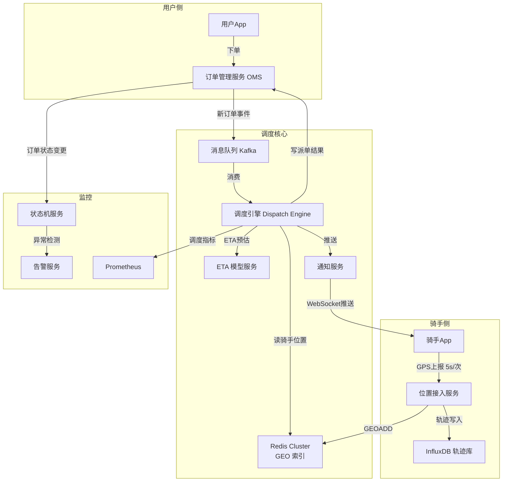
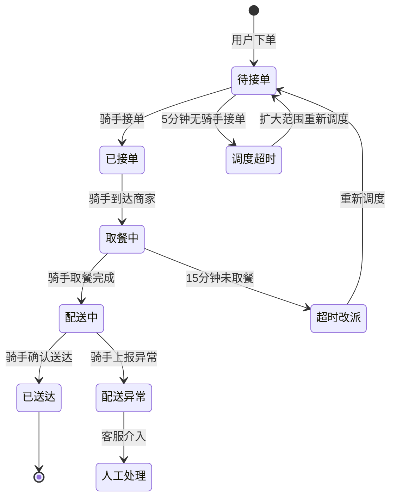
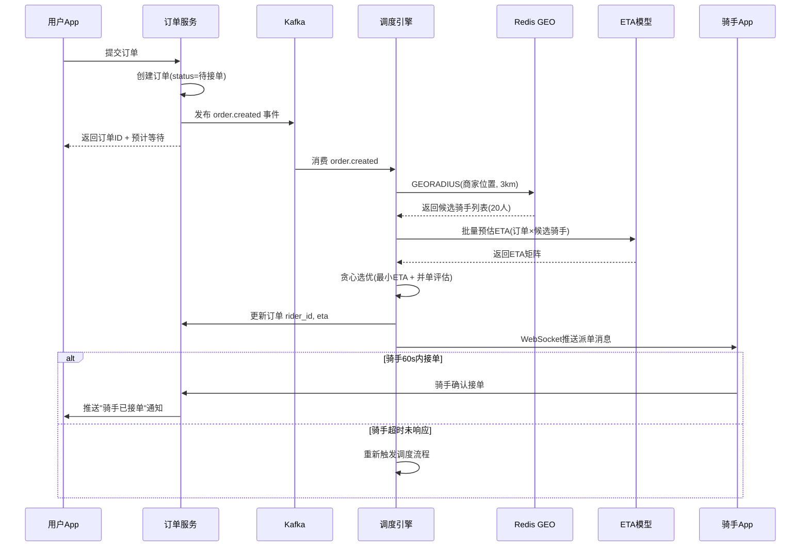

# 美团外卖调度系统设计

> **面试场景：** 美团 / 饿了么 后端高级工程师 / 系统设计面试  
> **高频指数：** ⭐⭐⭐⭐⭐

## 题目背景

**面试官常见提问方式：**

> "请设计一个外卖骑手调度系统。系统需要在用户下单后，快速为订单分配合适的骑手，并保证配送时效。你如何设计这个系统？"

**业务背景：**

外卖调度是美团核心竞争力之一。与打车调度不同，外卖调度需要同时处理"多对多"问题——一个骑手可以同时携带多笔订单（并单），且每笔订单有取餐+送餐两个节点，路径规划远比出行复杂。配送时效直接决定用户体验和复购率，30分钟送达是基本 SLA。

**规模量级（2024年数据）：**

- 日订单量：9,000,000+ 单/天
- 注册骑手：700,000+（实时在线约 400,000）
- 高峰期（午餐 11:30-13:00）：并发订单约 500,000 单/小时
- 配送 SLA：P90 ≤ 30 分钟，P99 ≤ 45 分钟
- GPS 上报：骑手每 5 秒上报一次位置，高峰期约 80,000 次/秒写入
- 调度决策延迟要求：单次调度决策 < 500ms

## 关键指标估算

| 指标 | 估算过程 | 结果 |
|------|----------|------|
| 峰值订单到达速率 | 500,000 单/小时 ÷ 3600s | ~139 单/秒 |
| 骑手 GPS 写入 QPS | 400,000 骑手 × (1次/5s) | 80,000 次/秒 |
| 骑手位置数据量 | 400,000 × (lat, lng, ts, status) × 24B | ~10 MB（全量内存） |
| 调度决策次数 | 每单至少1次调度 + 超时改派 | ~160 次/秒（峰值） |
| 配送轨迹存储 | 9M 单 × 100 轨迹点 × 50B | ~45 GB/天（InfluxDB） |
| ETA 模型推理 QPS | 每单分配 + 实时更新 | ~500 次/秒 |

> **调度服务 Redis QPS 推导**：578 订单/s × 50 候选骑手/订单 = **28,900 次 GEORADIUS/s**；骑手位置更新（5s 一次，700K 骑手）= 700,000 ÷ 5 = **14 万 GEOADD/s**。合计 Redis 地理位置服务 QPS 约 **17 万/s**，需 Redis Cluster 3-4 个主节点（每节点上限 5 万 QPS）。

## 高层架构



**核心组件说明：**

- **OMS（订单管理服务）**：负责订单生命周期管理，维护订单状态机
- **调度引擎（Dispatch Engine）**：核心服务，负责骑手-订单匹配算法
- **Redis Cluster GEO**：实时存储骑手位置，支持地理范围查询
- **ETA 模型服务**：独立部署的 ML 推理服务，预估配送时间
- **InfluxDB**：时序数据库，存储骑手配送轨迹

## 核心设计决策

### 决策1：骑手实时位置存储方案

**方案对比：**

| 方案 | 优点 | 缺点 |
|------|------|------|
| Redis GEO（GEOADD） | 原生支持地理查询，O(log N)范围搜索 | 单节点容量有限，需分片 |
| MySQL 空间索引 | 持久化，支持复杂查询 | 写入延迟高，不适合高频更新 |
| PostGIS | 地理功能最完整 | 运维复杂，写入吞吐不足 |
| 自建 GeoHash 索引 | 灵活 | 开发成本高，维护复杂 |

**美团实际选择：Redis GEO + 分片**

```
# 骑手位置上报
GEOADD riders:city:beijing 116.397128 39.916527 "rider_12345"

# 查询指定坐标3km内的骑手
GEORADIUS riders:city:beijing 116.404 39.915 3 km 
    WITHCOORD WITHDIST COUNT 50 ASC
```

**关键优化：高峰期批量写降低频次**

骑手正常行驶时 5 秒上报一次；当骑手处于等待状态（速度 < 2km/h），降为 15 秒上报一次。GPS 接入服务做本地聚合，将同一城市的上报批量合并为 Pipeline 写入 Redis，减少 RTT 开销。

**按城市分片：** `riders:city:{city_code}` 作为 Redis Key，北京/上海等大城市进一步按区域分片（`riders:city:beijing:district:chaoyang`）。

### 决策2：订单分配算法

**理论最优 vs 工程实现：**

理论上，骑手-订单匹配是一个经典的**最小权二部图匹配**问题（匈牙利算法可以求全局最优），但匈牙利算法时间复杂度为 O(V³)，在 400,000 骑手 × 139 单/秒的规模下完全不可行（全局匹配一次需要数秒）。

**美团实际策略——贪心近似 + 周期性重优化：**

```
Phase 1（实时贪心，<100ms）：
  for each new_order in order_queue:
    candidates = GEORADIUS(order.location, 3km, max=20)
    candidates = filter(candidates, status=IDLE or carrying<3)
    best_rider = argmin(ETA(rider, order) for rider in candidates)
    assign(best_rider, new_order)

Phase 2（周期重优化，每30秒）：
  in_transit_orders = get_orders(status=IN_DELIVERY)
  batch_optimize(in_transit_orders)  # 局部最优化，考虑路径重组
```

**贪心分配算法伪代码：**

```python
def dispatch_cycle(unassigned_orders: List[Order], available_riders: List[Rider]):
    """
    每 30 秒执行一次分配循环
    复杂度：O(orders × riders_per_area)
    """
    # 按订单创建时间排序（先来先服务，避免饿死）
    unassigned_orders.sort(key=lambda o: o.created_at)
    
    assignments = {}
    for order in unassigned_orders:
        # 查询 2km 内的可用骑手（Redis GEORADIUS，O(N) N=候选骑手数）
        candidates = redis.georadius(
            "riders:online",
            order.restaurant_lng, order.restaurant_lat,
            radius=2000,  # 2km
            unit="m",
            withcoord=True
        )
        if not candidates:
            continue
        
        # 选择预计取餐时间最短的骑手
        best_rider = min(
            candidates,
            key=lambda r: estimate_pickup_time(r, order)
        )
        assignments[order.order_id] = best_rider.rider_id
        # 从候选池移除已分配骑手（防止一个骑手被分配多个订单）
        available_riders.remove(best_rider)
    
    return assignments
```

**复杂度与规模分析：**

| 参数 | 数值 | 说明 |
|------|------|------|
| 峰值 TPS | ~578 订单/s | 9M 订单/天 ÷ 86400s × 5（午高峰系数） |
| 30s 调度窗口内积累订单数 | 578 × 30 = **17,340 个** | 每次调度循环处理量 |
| 每订单候选骑手数 | ~50 个 | 2km 内平均骑手数 |
| 总距离计算次数 | 17,340 × 50 = **867,000 次** | 单次调度循环 |
| 每次 GEORADIUS 耗时 | ~1ms | Redis 空间索引 |
| 调度循环总耗时 | ~20s（并行化后） | 17,340 个并发 GEORADIUS |

实际生产中按地理区域（城市 × 商圈）并行化，每个区域独立调度线程，互不阻塞。

**并单（多订单合并）算法：**

同一骑手最多携带 3 单。并单决策在取餐前做：

1. 计算骑手当前携带订单的取餐点和送餐点集合
2. 候选新订单加入后，计算 TSP 近似路径（最近邻启发式）
3. 若加入新订单后，所有订单的预估最晚送达时间仍满足 SLA → 接受并单
4. 时间窗约束：取餐时间差 < 10 分钟的订单优先合并

### 决策3：ETA 预估

**特征工程：**

| 特征类别 | 具体特征 |
|----------|----------|
| 空间特征 | 取餐点到送餐点直线距离、实际路径距离（地图API）、路线复杂度 |
| 时间特征 | 当前时段（早/中/晚峰）、星期几、节假日标志 |
| 实时交通 | 路段拥堵指数（接高德/百度地图实时数据） |
| 骑手特征 | 历史平均速度、近7天超时率、当前携带订单数 |
| 商家特征 | 商家历史出餐时间（P50/P90）、当前订单队列长度 |
| 天气特征 | 是否下雨、气温（影响骑手速度） |

**模型架构：** XGBoost 离线训练，预测出餐时间和配送时间分别建模，最终 ETA = 出餐时间预估 + 配送时间预估 + 缓冲时间。

**目标：P90 ETA 误差 < 5 分钟**（P90 指 90% 的订单实际到达时间与预估时间差 < 5 分钟）。

### 决策4：通知推送机制

骑手 App 与服务端保持 **WebSocket 长连接**（通过 Nginx + 自建 WebSocket 集群）。派单消息通过 WebSocket 推送，骑手须在 60 秒内响应（接单/拒单）。

**为什么不用轮询？** 骑手平均每天接 20-30 单，如果用轮询（5 秒一次），无效请求占 99%+，浪费带宽；WebSocket 实现服务端主动推送，延迟 < 1s。

### 决策5：异常处理与系统降级

| 异常场景 | 处理策略 |
|----------|----------|
| 骑手超时未取餐（15min） | 自动改派给其他骑手，原骑手记录超时事件 |
| 骑手拒单超3次 | 降低接单优先级，限制24小时内优先派单资格 |
| 骑手异常下线（App崩溃） | 心跳超时（90s）后标记为离线，在途订单触发改派流程 |
| 算法服务超时（>500ms） | 降级到最近距离规则（纯 Redis GEO 距离排序），不做 ETA 计算 |
| Redis GEO 节点故障 | 降级读备节点（最终一致性），允许位置数据有30s延迟 |
| 全城骑手不足（极端天气） | 扩大搜索半径（3km→5km→8km），提前告知用户延迟 |

## 详细设计

### 订单状态机



### 数据模型

**订单表（order）**

```sql
CREATE TABLE `order` (
  `order_id`        BIGINT      NOT NULL COMMENT '订单ID，雪花算法',
  `user_id`         BIGINT      NOT NULL,
  `merchant_id`     BIGINT      NOT NULL,
  `rider_id`        BIGINT      DEFAULT NULL COMMENT '分配的骑手ID',
  `status`          TINYINT     NOT NULL COMMENT '0:待接单 1:已接单 2:取餐中 3:配送中 4:已送达 5:异常',
  `pickup_lat`      DECIMAL(10,7) NOT NULL COMMENT '取餐点纬度',
  `pickup_lng`      DECIMAL(10,7) NOT NULL COMMENT '取餐点经度',
  `delivery_lat`    DECIMAL(10,7) NOT NULL COMMENT '送餐点纬度',
  `delivery_lng`    DECIMAL(10,7) NOT NULL COMMENT '送餐点经度',
  `eta_seconds`     INT         DEFAULT NULL COMMENT 'ETA预估秒数',
  `placed_at`       DATETIME(3) NOT NULL,
  `assigned_at`     DATETIME(3) DEFAULT NULL,
  `delivered_at`    DATETIME(3) DEFAULT NULL,
  `deadline_at`     DATETIME(3) NOT NULL COMMENT 'SLA截止时间',
  PRIMARY KEY (`order_id`),
  INDEX `idx_rider_status` (`rider_id`, `status`),
  INDEX `idx_merchant_status` (`merchant_id`, `status`),
  INDEX `idx_deadline` (`deadline_at`, `status`)
) ENGINE=InnoDB;
```

**骑手状态表（rider_state）**

```sql
-- 高频更新，考虑用Redis Hash而非MySQL
-- Redis Key: rider:{rider_id}:state
-- Fields: status, lat, lng, order_count, last_update_ts, city_code

-- MySQL作为持久化备份（低频同步）
CREATE TABLE `rider_state` (
  `rider_id`      BIGINT      NOT NULL,
  `status`        TINYINT     NOT NULL COMMENT '0:离线 1:空闲 2:配送中 3:休息',
  `lat`           DECIMAL(10,7),
  `lng`           DECIMAL(10,7),
  `order_count`   TINYINT     DEFAULT 0 COMMENT '当前携带订单数(0-3)',
  `city_code`     VARCHAR(20) NOT NULL,
  `updated_at`    DATETIME(3) NOT NULL,
  PRIMARY KEY (`rider_id`)
) ENGINE=InnoDB;
```

**配送轨迹表（InfluxDB）**

```
measurement: delivery_track
tags: rider_id, order_id, city_code
fields: lat(float), lng(float), speed(float), heading(float)
timestamp: 纳秒精度

# 查询骑手今日轨迹
SELECT lat, lng FROM delivery_track 
WHERE rider_id='12345' 
  AND time > now() - 24h
ORDER BY time ASC
```

### 派单时序图



### 接口设计

**骑手位置上报接口**

```
POST /api/v1/rider/location
Authorization: Bearer {rider_token}

Request:
{
  "rider_id": 12345,
  "lat": 39.916527,
  "lng": 116.397128,
  "speed": 15.3,       // km/h
  "heading": 270,      // 度数
  "ts": 1716800000000  // 毫秒时间戳
}

Response: 200 OK (无需业务返回，只确认收到)
```

**调度结果查询接口（订单服务）**

```
GET /api/v1/order/{order_id}/dispatch-status

Response:
{
  "order_id": "202406011234567",
  "status": "assigned",
  "rider": {
    "rider_id": 98765,
    "name": "张师傅",
    "phone": "138****5678",
    "lat": 39.918,
    "lng": 116.401,
    "eta_seconds": 1080    // 预计18分钟送达
  }
}
```

## 踩过的坑 / 生产经验

### 坑1：高峰期算法计算超时导致订单积压

**现象：** 午餐高峰期（12:00-12:30），调度引擎 ETA 模型推理延迟从平时 80ms 飙升到 1200ms，导致调度队列堆积，大量订单"待接单"状态超过 5 分钟。

**根因：** ETA 模型服务是 Python Flask 服务，GIL 限制并发；高峰期请求量是平时 5 倍，模型推理成为瓶颈。

**解决方案：**

1. **异步化调度**：调度引擎收到订单后立即返回（不等 ETA 结果），用优先队列（按订单创建时间）异步处理
2. **ETA 模型服务扩容 + 模型蒸馏**：将重量级 XGBoost 模型蒸馏为轻量级线性模型用于实时推理，精度损失 < 3%
3. **降级策略**：ETA 服务 P99 延迟 > 300ms 时自动切换为距离近似估算（distance / avg_speed）

### 坑2：GPS 漂移导致错误距离计算

**现象：** 骑手在地下车库/高楼密集区域时，GPS 信号不稳定，上报坐标出现 200-500 米的随机漂移。调度系统认为该骑手"在2km外"，实际骑手就在商家楼下，导致派单给了更远的骑手。

**解决方案：卡尔曼滤波平滑**

```python
class GPSKalmanFilter:
    def __init__(self):
        self.R = 50   # 观测噪声（GPS误差，单位：米²）
        self.Q = 1    # 过程噪声（运动不确定性）
        self.P = 100  # 初始估计误差
        self.x = None # 状态估计（位置）

    def update(self, measurement):
        if self.x is None:
            self.x = measurement
            return measurement
        
        # 预测步骤
        self.P = self.P + self.Q
        
        # 更新步骤
        K = self.P / (self.P + self.R)  # 卡尔曼增益
        self.x = self.x + K * (measurement - self.x)
        self.P = (1 - K) * self.P
        
        return self.x
```

额外规则：相邻两次上报位移 > 500 米（5 秒内不可能移动 500 米），直接丢弃该点。

### 坑3：骑手"幽灵在线"问题

**现象：** 部分骑手 App 在后台被系统杀死，但 Redis 中状态仍为"在线空闲"，接到派单后骑手根本没看到通知。

**解决方案：**

- 心跳检测：骑手 App 每 30 秒发送一次心跳（同 GPS 上报合并），服务端超过 90 秒未收到心跳 → 标记为"疑似离线"
- 派单前二次确认：对"疑似离线"骑手发送静默推送（APNS/FCM），3 秒无响应则跳过

### 坑4：并单算法中的"插单"顺序错误

**现象：** 骑手 A 已有订单（取餐点 P1，送餐点 D1），新插入订单（P2，D2）。系统按距离优化建议路径为 P1→P2→D1→D2，但 D1 的用户已等了 20 分钟，再绕去 P2 会严重超时。

**修复：** 并单插入时，已有订单的送达 deadline 作为硬约束，不允许任何路径规划导致已有订单超时。

## 扩展考点

### 追问方向

**Q：如何处理恶劣天气下骑手不足的场景？**

动态调整策略：
1. 提前预警（天气API接入）→ 提前30分钟扩大骑手搜索范围
2. 用户端显示真实预计时间（不隐瞒延迟）
3. 激励机制：恶劣天气期间骑手配送费加成，吸引更多骑手接单
4. 最后兜底：超时订单主动联系用户询问是否继续等待

**Q：如何设计骑手评分和优先级系统？**

骑手综合评分 = 完成率（40%）× 准时率（40%）× 用户评分（20%）。评分影响接单优先级，评分低的骑手在同等距离下排在后面。

**Q：如何设计配送时间的 SLA 监控？**

- 实时监控每笔在途订单的剩余时间
- 距离 deadline 5 分钟时触发预警
- 超时率按城市/商家/骑手维度统计，超过阈值触发人工介入

### 边界 Case

- **订单取消**：骑手已取餐后用户取消订单 → 骑手保留取餐补偿费，订单标记为"已取消（骑手已取餐）"
- **商家延迟出餐**：骑手等餐超 15 分钟 → 系统记录商家出餐超时，不计入骑手超时
- **送餐地址变更**：用户在骑手配送途中修改地址 → 若新地址与原地址距离 < 500m 允许；否则提示用户新增费用

### 演进路径

```
v1.0：基础调度（最近距离）
  ↓
v2.0：ETA 模型（机器学习预估）
  ↓
v3.0：全局优化（批量周期性重调度）
  ↓
v4.0：强化学习调度（以完成率/超时率为 reward，端到端优化）
```

### 监控与告警指标

| 指标 | 类型 | 告警阈值 | 说明 |
|------|------|---------|------|
| `order_assignment_latency_ms` | Histogram | P99 > 5000ms 触发告警 | 订单从创建到分配骑手的延迟 |
| `unassigned_order_count` | Gauge | > 500 触发告警 | 当前待分配订单积压量，说明骑手不足或调度算法超时 |
| `rider_gps_update_lag_ms` | Histogram | P99 > 8000ms 触发告警 | 骑手位置更新延迟，超过两个心跳周期（5s×2）说明上报异常 |
| `eta_accuracy_rate` | Counter | < 85% 触发告警 | ETA 误差在 ±5min 内的比例，低于阈值需重新校准模型 |
| `dispatch_algorithm_timeout_rate` | Counter | > 1% 触发告警 | 调度算法超时触发降级（贪心算法）的比例 |
| `rider_reject_rate` | Counter | > 5% 触发告警 | 骑手拒单率，高于阈值触发运营介入或激励调整 |

### Redis 不可用时的降级方案

骑手位置 Redis GEO 不可用时：
- **Sentinel 切换期间（< 30s）**：新订单暂缓分配，已在途订单不受影响（骑手 App 有本地缓存）
- **Redis 完全不可用**：降级为基于上次已知位置的静态分配，超过 60s 无更新的骑手标记为「位置未知」，暂停接单
- **监控**：`redis_geo_operation_success_rate` < 99% 立即触发降级流程

## 面试评分维度

| 维度 | 基础分（60分） | 加分项（80+分） | 满分项（100分） |
|------|---------------|----------------|----------------|
| **需求澄清** | 说清楚骑手分配和ETA是核心 | 主动问并单、异常处理 | 提出SLA定义和监控需求 |
| **规模估算** | 算出峰值QPS数量级 | 估算GPS写入、存储量 | 完整的容量规划 |
| **架构设计** | 画出基本的服务拆分 | 说清楚Redis GEO的作用 | 完整的数据流+降级策略 |
| **算法设计** | 知道距离排序最近分配 | 说出贪心近似+周期优化思路 | 分析匈牙利算法为何不可用，并提出并单TSP近似 |
| **异常处理** | 提到骑手超时改派 | 多种异常场景的处理 | 完整的状态机+告警体系 |
| **生产经验** | 了解GPS信号问题 | 提到卡尔曼滤波或漂移处理 | 结合实际故障场景（超时降级、心跳检测） |
