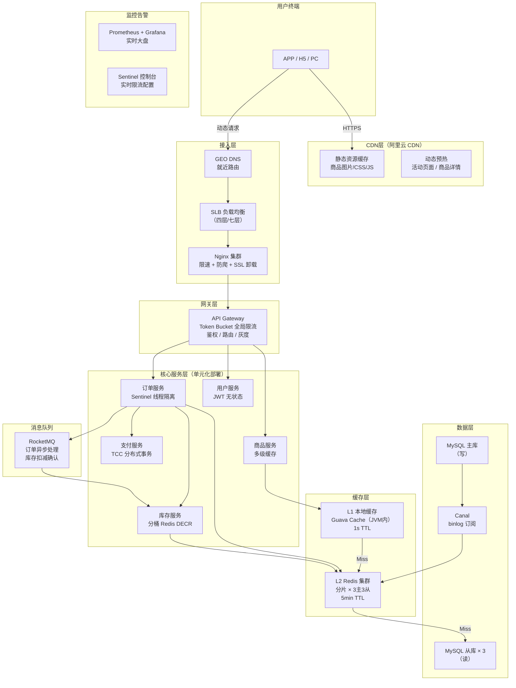
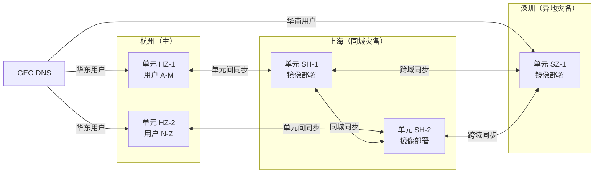
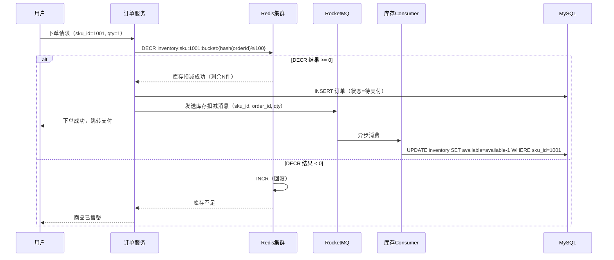
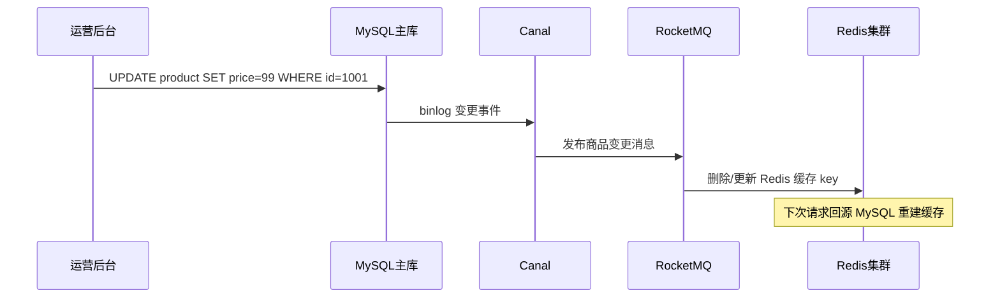
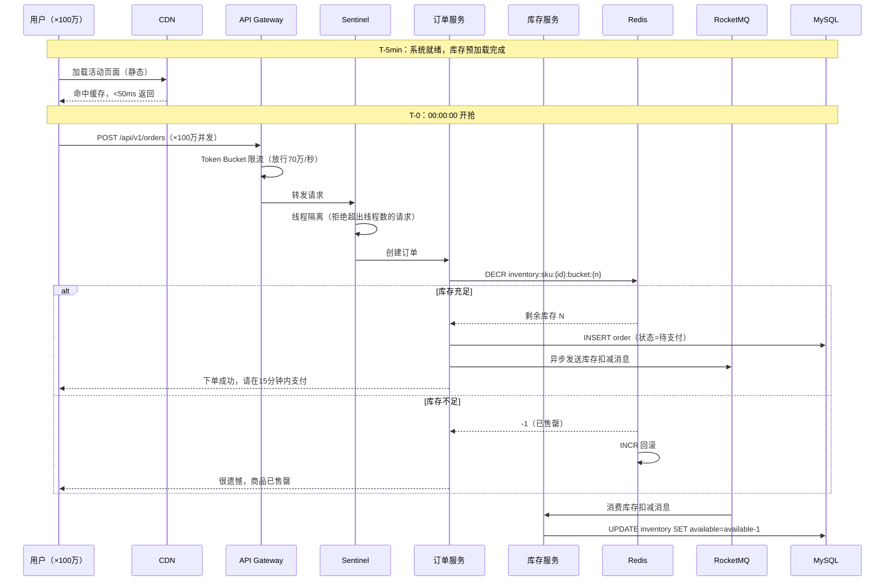

# 阿里双十一大促系统设计

> **面试场景：** 阿里巴巴 / 字节跳动 高级后端工程师 / 系统架构师 系统设计面试  
> **高频指数：** ⭐⭐⭐⭐⭐

## 题目背景

**面试官原话：**
> "双十一是全球最大的电商促销活动。请设计一套能支撑双十一大促的系统架构，重点解决零点峰值流量问题。你有 30 分钟，先从你认为最关键的问题开始。"

**业务背景：**  
2023 年双十一，天猫平台在零点前 30 秒迎来全天最高峰，峰值订单量达到 **583,000 笔/秒**（58.3 万 TPS）。相比平日约 1.2 万 TPS，峰值流量约为平时的 **50 倍**。与此同时，用户对响应时间极度敏感——如果页面 3 秒内未响应，转化率下降超过 40%。

**挑战清单：**
- 零点准时开抢，流量在 1 秒内从 0 上升到峰值（冷启动问题）
- 热门商品库存只有几千件，百万用户同时抢购（防超卖问题）
- 全链路任何一个环节故障都会影响千亿 GMV（高可用问题）
- 商品价格、库存实时变化，缓存与 DB 数据一致性（一致性问题）

---

## 关键指标估算

| 指标 | 估算过程 | 结果 |
|------|----------|------|
| 峰值 TPS | 历史数据：2023年峰值 58.3 万笔/秒 | **583,000 TPS** |
| 平时 TPS | 全年均摊日均约 10 亿笔，峰值 ÷ 50 | **~12,000 TPS** |
| 商品详情页 QPS | 每笔订单前约 50 次浏览，峰值 TPS × 50 | **~2,900 万 QPS** |
| 购物车操作 QPS | 每笔订单约 5 次购物车操作 | **~290 万 QPS** |
| 搜索 QPS | 参考淘宝搜索：峰值 50 万 QPS | **500,000 QPS** |
| 单机 Nginx 处理能力 | 10 万 QPS（典型值） | 需要 **290+ 台** 接入机 |
| 数据库连接数 | 单 MySQL 实例最大 2000 连接 | 需连接池 + 分库分表 |
| Redis 内存 | 1 亿商品 × 1KB 均值 = 100GB | **Redis 集群 200GB+**（留 buffer） |
| 带宽需求 | 2900 万 QPS × 2KB 平均响应 = 58TB/s | CDN 承载静态，动态请求需专线 |

---

## 高层架构



**三地五中心部署：**



---

## 核心设计决策

### 决策一：流量预热（Warm-up）策略

**问题：** 零点准时开抢，JVM 刚启动时 JIT 编译未完成，缓存全部冷数据，第一波请求响应时间是平时的 5-10 倍，极易把服务打垮。

**方案对比：**

| 方案 | 优点 | 缺点 | 适用场景 |
|------|------|------|----------|
| **直接全量上线** | 简单 | 冷启动必崩 | 不适用 |
| **提前扩容** | 可行 | 浪费资源 | 成本可接受时 |
| **Sentinel 预热模式（WarmUp）** | 自动匀速放量，JIT 和缓存自然预热 | 需要精调 warmUpPeriodSec | **大促首选** |
| **流量录制回放** | 精准预热真实业务逻辑 | 实现复杂 | 超高 SLA 场景 |

**阿里实际做法：**
1. **T-1 小时（23:00）**：启动 JVM 预热，通过内部脚本向服务发送低频真实流量（约 10% 流量），触发 JIT 编译热点路径
2. **T-30 分钟（23:30）**：缓存预热，批量将大促商品库存、价格、基本信息写入 Redis
3. **T-5 分钟（23:55）**：Sentinel 配置 `warmUpPeriodSec=300`，限流从 10% 逐步爬升到 100%
4. **T-0（00:00）**：GEO DNS 切流，流量全量进入

```java
// Sentinel 预热限流规则配置示例
FlowRule rule = new FlowRule();
rule.setResource("placeOrder");
rule.setGrade(RuleConstant.FLOW_GRADE_QPS);
rule.setCount(100000);  // 最大 QPS = 10万
rule.setControlBehavior(RuleConstant.CONTROL_BEHAVIOR_WARM_UP);
rule.setWarmUpPeriodSec(300);  // 300秒内从冷状态爬升到峰值
FlowRuleManager.loadRules(Collections.singletonList(rule));
```

---

### 决策二：分层限流架构

**核心原则：** 流量越往后，越昂贵，越要保护。每一层都要做限流，层层收口。

```
用户请求 100%
    │
    ▼
接入层 Nginx（限速：连接数+IP频率）→ 拒绝 5%（爬虫/CC攻击）
    │ 95%
    ▼
网关层 API Gateway（Token Bucket 全局限流）→ 排队/拒绝 20%
    │ 75%
    ▼
服务层 Sentinel（线程隔离+熔断）→ 熔断降级 15%
    │ 60%
    ▼
缓存层 Redis（本地缓存兜底）→ 缓存命中 55%，回源 5%
    │ 5%
    ▼
数据层 MySQL（连接池限制）→ 最终落库 5%
```

**Nginx 层配置：**
```nginx
# 限制单 IP 每秒请求数
limit_req_zone $binary_remote_addr zone=api_limit:100m rate=100r/s;

# 限制并发连接数
limit_conn_zone $binary_remote_addr zone=conn_limit:100m;

server {
    location /api/order {
        limit_req zone=api_limit burst=200 nodelay;
        limit_conn conn_limit 10;
        # 超限返回 503 而非排队（大促期间快速失败）
        limit_req_status 503;
    }
}
```

**Token Bucket 全局限流（网关层）：**
- 全局 Token Bucket 存储在 Redis，用 Lua 脚本保证原子性
- 全局最大 TPS = 58 万，预留 20% buffer，设置 Token Bucket 容量 = 70 万/秒
- 限流被拒绝时返回 `HTTP 429 + Retry-After` 头，客户端排队重试

---

### 决策三：库存预占设计（核心防超卖）

**问题：** MySQL 的 UPDATE + SELECT FOR UPDATE 在 50 万 TPS 下会导致行锁等待队列堆积，响应时间从 5ms 膨胀到 5000ms，最终引发连接池耗尽。

**方案演进：**

| 版本 | 方案 | 问题 |
|------|------|------|
| V1 | MySQL SELECT FOR UPDATE | 行锁排队，50万TPS直接崩 |
| V2 | Redis DECR | 单点 Redis，热点 Key 问题 |
| V3 | 分桶 Redis DECR + 异步写 DB | **当前方案** |

**V3 详细设计：**



**Redis 库存预加载（活动开始前 5 分钟执行）：**
```java
// 将 DB 库存分桶写入 Redis
public void preloadInventory(Long skuId, int totalStock, int bucketCount) {
    int stockPerBucket = totalStock / bucketCount;
    int remainder = totalStock % bucketCount;
    
    try (Pipeline pipeline = jedis.pipelined()) {
        for (int i = 0; i < bucketCount; i++) {
            String key = "inventory:sku:" + skuId + ":bucket:" + i;
            int bucketStock = stockPerBucket + (i == 0 ? remainder : 0);
            pipeline.set(key, String.valueOf(bucketStock));
            pipeline.expire(key, 7200); // 2小时过期
        }
        pipeline.sync();
    }
}
```

**库存预加载时间估算：**

| 参数 | 数值 |
|------|------|
| 热门 SKU 数量 | 100 万 |
| 分桶数 N | 100 |
| 总 Redis Key 数 | 100万 × 100 = **1 亿个 key** |
| 单 Redis 节点 Pipeline 写入速度 | ~50 万 SET/s |
| 最少预加载时间 | 1亿 ÷ 50万 = **200 秒** |
| 预加载窗口（T-5min = 300s） | 300s > 200s，**刚好满足** |
| 实际部署 | 多节点并行预加载（10 节点）→ 20s 完成 |

预加载在活动开始前 5 分钟由定时任务触发，逐批 Pipeline 写入，写入完成后设置 `preload_done` flag，流量切换脚本检查此 flag 后才开放零点入口。

---

### 决策四：多级缓存架构

**商品详情页缓存策略（读多写少，大促期间几乎只读）：**

```
请求 → L1 本地缓存（Guava，每 JVM 实例，1s TTL）
         ↓ Miss
       L2 Redis 集群（分片，TTL 5min）
         ↓ Miss（仅 1% 请求会到达这里）
       MySQL 从库（读）
```

**大促期间特殊处理：**
- 大促期间商品价格、库存每分钟可能变化，但用 **stale-while-revalidate** 策略：允许读到 10s 内的旧数据，后台异步更新
- L1 TTL 从平时的 10s 调整为 1s（减少脏读时间）
- 库存"0件"的售罄状态，写入 Redis 并设置本地缓存标记，后续请求直接在 JVM 层拦截

**缓存一致性保障（Canal + MQ）：**


---

### 决策五：降级策略（Circuit Breaker 分级）

**降级分 5 个等级，从轻到重依次触发：**

| 等级 | 触发条件 | 降级内容 | 影响 |
|------|----------|----------|------|
| L1 | CPU > 70% | 关闭实时推荐，返回静态热门榜单 | 推荐精准度下降 |
| L2 | 错误率 > 1% | 关闭评论写入，只读不写 | 用户无法发表评论 |
| L3 | 错误率 > 5% | 关闭部分支付方式（花呗/信用卡），只保留余额/银行卡 | 支付选项减少 |
| L4 | 错误率 > 10% | 商品图片降级为缩略图（100KB → 5KB） | 图片质量下降 |
| L5 | 核心链路崩溃 | 展示静态降级页面（"系统繁忙，请稍后重试"） | 完全不可用 |

**Sentinel 降级规则配置示例：**
```java
// 基于响应时间的熔断降级
DegradeRule rule = new DegradeRule("placeOrder")
    .setGrade(CircuitBreakerStrategy.SLOW_REQUEST_RATIO.getType())
    .setCount(500)       // RT > 500ms 触发
    .setSlowRatioThreshold(0.5)  // 50% 慢请求触发熔断
    .setStatIntervalMs(10000)    // 统计 10 秒窗口
    .setMinRequestAmount(100)    // 至少 100 次请求才统计
    .setTimeWindow(30);          // 熔断 30 秒
```

---

## 详细设计

### 订单服务接口设计

```
POST /api/v1/orders
Request:
{
  "sku_id": 1001,
  "quantity": 1,
  "address_id": 8888,
  "coupon_id": "COUPON_001",
  "idempotency_key": "user_123_sku_1001_timestamp_1699372800"
}

Response (成功):
{
  "order_id": "2023111100001234567",
  "status": "PENDING_PAYMENT",
  "amount": 9900,
  "pay_expire_at": "2023-11-11T00:15:00Z"
}

Response (售罄):
{
  "code": "INVENTORY_SOLD_OUT",
  "message": "手慢了，该商品已售罄"
}

Response (限流):
HTTP 429
{
  "code": "RATE_LIMIT_EXCEEDED",
  "retry_after": 2
}
```

### 数据模型

**订单表（分库分表，按 user_id % 1024）：**
```sql
CREATE TABLE orders_0001 (
    id          BIGINT PRIMARY KEY,           -- 雪花算法ID
    order_no    VARCHAR(32) NOT NULL UNIQUE,  -- 业务订单号
    user_id     BIGINT NOT NULL,
    sku_id      BIGINT NOT NULL,
    quantity    INT NOT NULL,
    amount      BIGINT NOT NULL,             -- 单位：分
    status      TINYINT NOT NULL,            -- 0待支付 1已支付 2已取消
    created_at  DATETIME NOT NULL,
    paid_at     DATETIME,
    KEY idx_user_id (user_id),
    KEY idx_created_at (created_at)
) ENGINE=InnoDB;
```

**库存表：**
```sql
CREATE TABLE inventory (
    sku_id      BIGINT PRIMARY KEY,
    total       INT NOT NULL,               -- 总库存
    available   INT NOT NULL,               -- 可用库存
    frozen      INT NOT NULL DEFAULT 0,     -- 预占库存
    version     INT NOT NULL DEFAULT 0,     -- 乐观锁版本号
    updated_at  DATETIME NOT NULL
) ENGINE=InnoDB;
```

### 零点大促时序图



---

## 踩过的坑 / 生产经验

### 坑一：2012年双十一宕机——MySQL 连接池耗尽

**事故经过：**  
2012 年双十一，订单服务在零点峰值时全部不可用，页面报 500 错误约 3 分钟。根因：MySQL 连接池上限 200 个连接，峰值 TPS 远超预期，连接等待队列堆积，最终全部超时，服务雪崩。

**改进措施：**
1. 连接池监控：将连接池等待队列长度接入 Prometheus，超过阈值触发告警
2. 自动扩容：连接池接近上限时，触发 K8s HPA，快速扩容实例（30s 内完成）
3. 连接池配置优化：`connectionTimeout=3000ms`，避免长时间等待；`maxPoolSize` 根据 DB 规格动态计算

### 坑二：2016年 CDN 缓存击穿

**事故经过：**  
活动页面提前 1 小时上线，CDN 大量缓存活动价格信息。零点时，运营修改了几款商品价格，主动 Purge CDN 缓存。导致数百台 CDN 节点同时回源，DB 被打垮（Cache Stampede）。

**改进措施：**
- 使用 `stale-while-revalidate`：即使缓存过期，仍返回旧值，同时后台异步刷新
- 大促期间，商品数据变更不实时清缓存，而是等 TTL 自然过期（接受 5 分钟最终一致）
- 采用 Cache-Aside + 随机 TTL（`base_ttl + random(0, 60s)`），错开大量 key 同时过期

### 坑三：Redis 分桶不均匀导致热点桶

**事故经过：**  
某款超热商品（iPhone 15 Pro 备货 10 万件），分 100 个桶，每桶 1000 件。但用户下单的 `order_id` hash 到桶 0 的概率偏高（hash 函数不均匀），桶 0 的 Redis 节点 CPU 打到 100%，该桶早早售罄，但总库存还剩 9 万件，出现"虚假售罄"。

**改进措施：**
- 换用 `CRC32(orderId) % bucketCount` 替代简单取模，分布更均匀
- 桶库存动态均衡：监控各桶剩余库存，当某桶剩余 < 10% 时，从库存充裕的桶迁移一部分过来
- 增加"全局兜底桶"：预留 5% 库存在全局 key，分桶均售罄后，从全局桶兜底

### 坑四：超时导致重复扣库存

**事故经过：**  
用户下单，订单服务调用库存服务 DECR Redis，网络超时（Redis 返回了但 ACK 丢失），订单服务以为失败，重试调用，导致同一用户两次扣减库存。

**解决方案：**
```lua
-- Redis Lua 脚本：幂等扣减（同一 orderId 只扣一次）
local key = KEYS[1]            -- inventory key
local idempotency_key = KEYS[2] -- "deducted:orderId:xxx"
local qty = tonumber(ARGV[1])

-- 检查是否已扣减过
if redis.call("EXISTS", idempotency_key) == 1 then
    return redis.call("GET", key)  -- 返回当前库存，幂等成功
end

local current = tonumber(redis.call("GET", key))
if current < qty then
    return -1  -- 库存不足
end

redis.call("DECRBY", key, qty)
redis.call("SET", idempotency_key, "1")
redis.call("EXPIRE", idempotency_key, 3600)
return redis.call("GET", key)
```

---

## 扩展考点

### 追问方向

1. **如果 Redis 集群在零点崩了怎么办？**  
   答：Redis 哨兵/Cluster 自动故障转移（30s 内切换）；降级方案：直接走 MySQL，但限流到 1/10 流量，接受部分用户排队等待。

2. **如何保证零点精准开卖，而不是 00:00:01 才开始？**  
   答：所有服务器 NTP 时间同步精度 < 10ms；开卖时间写入 Redis，服务端判断（不信任客户端时间）；Sentinel Dashboard 在 23:59:58 手动提前解除预热限流限制。

3. **大促结束后如何快速缩容？**  
   答：K8s HPA 根据 CPU/QPS 指标自动缩容，配置 `scaleDown.stabilizationWindowSeconds=300`（5 分钟稳定期，避免抖动）。

4. **如果某个 SKU 超卖了 1 件怎么办？**  
   答：订单进入待审核状态，由客服系统自动处理（发消息通知用户，提供优惠券补偿）；建立超卖监控，触发告警后人工介入。

**优惠券并发扣减（高频追问）**：双十一优惠券与库存面临相同的并发抢占问题。解决方案与分桶库存一致：Redis DECR 预扣（原子操作）+ 异步 MySQL 确认 + 幂等防重。不同点是优惠券有「每人限用一次」约束，需额外用 Redis Set（`coupon:used:{coupon_id}`，SADD 返回 0 表示已用）做幂等校验，同样封装进 Lua 脚本保证原子性。

### 高频追问：Kafka 消费堆积时系统会超卖吗？

这是双十一洪峰系统设计中**最难的 Gotcha 题**，必须准备好答案：

**问题场景：**
1. Kafka 消费堆积，MySQL `available` 列比 Redis 落后 5 分钟
2. 商品详情页从 MySQL **读副本**读取 `available=1`，展示"还剩 1 件"
3. 实际 Redis 库存已为 0（商品已售完）
4. 用户看到有货，点击下单 → Redis DECR 返回 -1 → 拒绝下单
5. 用户体验差：看到有货却买不到

**根本原因：** 商品详情页读 MySQL（有延迟），实际库存状态在 Redis（实时）

**解决方案：商品详情页库存状态读 Redis，不读 MySQL**

```python
def get_product_inventory_status(sku_id: str) -> dict:
    # 优先读 Redis 的售罄标记（O(1)，实时）
    soldout_flag = redis.get(f"soldout:{sku_id}")
    if soldout_flag:
        return {"available": 0, "status": "SOLDOUT"}
    
    # 聚合各桶剩余库存（粗略展示，不保证精确）
    total = sum(
        max(0, int(redis.get(f"inv:{sku_id}:{i}") or 0))
        for i in range(BUCKET_COUNT)
    )
    return {"available": total, "status": "ON_SALE" if total > 0 else "SOLDOUT"}
```

MySQL 的 `available` 列仅用于离线对账和补货决策，**不作为实时库存展示的数据源**。

### 预售系统设计（双峰流量）

现代双十一已演变为「两段式流量」：

```
时间轴：
10月31日 20:00  →  11月1日 00:00  →  11月11日 00:00
    ↓                    ↓                   ↓
[定金支付峰值]      [定金支付结束]         [尾款支付峰值]
  约 30% 峰值            锁定库存             100% 峰值
```

**定金阶段的设计变化：**
1. **库存预锁**：用户支付定金后，该 SKU 库存从「可售库存」转移到「预售锁定库存」，尾款支付时直接从锁定库存扣，不参与零点抢购
2. **两段式账务**：定金支付 → 冻结定金金额；尾款支付 → Confirm 冻结金额 + 扣除尾款；用户不支付尾款 → 定金不退（业务规则，技术上 Cancel 定金冻结）
3. **分流效果**：预售将约 40% 的热门 SKU 需求提前锁定，大幅降低零点峰值强度（2023年估算从纯秒杀模式下降约 35% 的实际零点峰值）

**追问：「定金支付后 SKU 断货怎么办？」**
→ 预售阶段超量发放定金名额（超卖 5%），依赖取消率（约 3-5% 用户不支付尾款）自然消化；若最终断货，平台赔付双倍定金（业务兜底）。

### 边界 Case

- **库存补货场景：** 大促中途追加库存，需同步更新 Redis 所有分桶（批量 INCRBY）
- **取消订单库存回滚：** 支付超时取消订单，需 INCR Redis + UPDATE MySQL，两者需在同一个分布式事务（TCC Cancel）中处理
- **跨境商品时区问题：** 东南亚用户零点 ≠ 北京零点，需按用户所在时区设置开售时间

### 演进路径

```
Phase 1（初期）：单 MySQL + 应用层乐观锁
    ↓ 流量增长
Phase 2：Redis 缓存层 + MySQL 异步写
    ↓ 单 Redis 热点
Phase 3：Redis 分桶 + 分库分表
    ↓ 单机房风险
Phase 4：异地多活 + 单元化部署
    ↓ 运维复杂度
Phase 5：全链路压测平台 + 混沌工程常态化
```

### Redis 不可用时的降级方案

| Redis 角色 | 宕机影响 | 降级策略 |
|-----------|---------|---------|
| 库存 Redis 主节点 | 无法扣减库存，下单失败 | Sentinel 切换（10-30s），期间返回「系统繁忙」；同时开启 MySQL 直扣兜底（QPS 限制在 5000） |
| 商品详情缓存 Redis | 大量回源 MySQL | L1 本地缓存（Guava，TTL 5min）撑住大部分流量；MySQL 读副本承接剩余 |
| 限流 Redis | 限流失效，流量直打后端 | Nginx 层 `limit_req` 兜底；各服务线程池隔离防止雪崩 |

大促前强制演练 Redis 主从切换（混沌工程），确保 Sentinel 选举时间 < 30s。

### 监控与告警指标

| 指标 | 类型 | 告警阈值 | 说明 |
|------|------|---------|------|
| `sentinel_reject_qps` | Counter | > 10万/s 触发告警 | Sentinel 限流拒绝量，说明流量超过预期 |
| `redis_inventory_memory_usage` | Gauge | > 80% 触发扩容 | 库存 Redis 内存，接近上限触发分桶扩容 |
| `kafka_inventory_consumer_lag` | Gauge | > 10万 触发告警 | 库存扣减消费堆积 |
| `order_create_success_rate` | Counter | < 95% 触发告警 | 下单成功率（含库存不足的正常拒绝应排除） |
| `mysql_slow_query_rate` | Counter | > 1% 触发告警 | 慢查询（>100ms）比例，大促期间指标基线升高 |
| `l1_cache_hit_rate` | Counter | < 90% 触发告警 | JVM 本地缓存命中率，低于阈值说明缓存未预热 |

---

## 面试评分维度

| 维度 | 基础分（60分） | 加分项（80+分） | 满分项（100分） |
|------|----------------|-----------------|-----------------|
| **问题识别** | 能说出"防超卖"和"高可用"两个核心问题 | 主动量化规模（50x 峰值、58万TPS） | 按时间维度拆分问题（预热→峰值→退潮） |
| **架构设计** | 画出分层架构（接入/服务/缓存/DB） | 说出多级缓存策略（L1/L2）和降级分级 | 设计单元化异地多活，说明数据同步方案 |
| **库存方案** | 知道 Redis DECR 防超卖 | 说出分桶策略和原因（避免热点 Key） | 设计完整的 Redis + MQ + MySQL 三层方案，包含幂等 Lua 脚本 |
| **限流设计** | 知道 Token Bucket 限流 | 说出分层限流（Nginx→Gateway→Sentinel） | 给出各层具体参数，说明 warm-up 预热策略 |
| **降级策略** | 知道熔断降级概念 | 列举具体降级项（推荐/评论/支付方式） | 定义 5 级降级方案，说明触发条件和恢复条件 |
| **生产经验** | 能回答追问 | 主动提出 CDN 缓存击穿、连接池等坑 | 结合具体数据（2012/2016 事故）讲清楚 Root Cause + 改进 |
