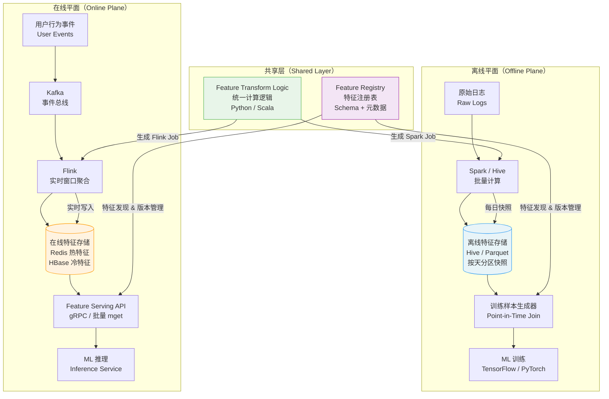

# 实时特征平台设计（Feature Store）

> **面试场景：** 字节跳动 / 阿里巴巴 / 美团 推荐系统、ML 平台岗位系统设计面试
> **高频指数：** ⭐ 高频题（ML 平台岗）

---

## 题目背景

### 面试官问法

> "你们公司有推荐系统、风控系统、搜索排序等多个 ML 应用，每个团队都在重复开发「用户最近 7 天点击次数」「商品曝光率」等特征。请设计一个统一的特征平台，让多个团队共享特征，支持在线（低延迟）和离线（训练）两种访问模式，特征数量 10 万+，日处理量 1000 亿条事件。"

### 问题的核心难点

这道题的核心不是"设计一个 KV 存储"，而是要解决以下三个相互交叉的工程难题：

1. **训练/推理一致性（Training-Serving Skew）**：训练用批计算，推理用实时计算，若两套计算逻辑不一致，模型在离线评估中表现很好，上线后效果急剧下降。
2. **时序正确性（Point-in-Time Correctness）**：生成训练样本时，必须使用样本发生时刻之前的特征值，绝不能用"未来数据"，否则造成标签泄漏（label leakage），模型 AUC 虚高。
3. **超大规模低延迟服务**：10 万并发请求 × 每次查 200 个特征，P99 需控制在 10ms 以内，同时特征总量达到 10 万亿个特征值的存储规模。

---

## 关键指标估算

### 在线服务规模

| 指标 | 数值 | 推算过程 |
|------|------|---------|
| 并发推理请求 | 10 万 QPS | 峰值推荐请求量 |
| 每次请求特征数 | 200 个 | 用户特征 100 个 + 商品特征 100 个 |
| 特征读取 QPS | **2000 万 QPS** | 10万 × 200 特征 = 2亿次特征读/秒，批量 mget 折算 |
| 延迟要求 | P99 < 10ms | 推理总延迟预算 50ms，特征占 10ms |
| Redis 节点数 | ~200 个 | 单节点 100K QPS，预留 2× 冗余 |

### 离线训练规模

| 指标 | 数值 | 说明 |
|------|------|------|
| 每日训练样本 | 10 亿条 | 全量曝光/点击事件 |
| 每条样本特征数 | 500 个 | 含用户、商品、上下文特征 |
| 日训练数据量 | **500 亿个特征值** | 500GB ~ 5TB（float32/压缩后） |
| Point-in-time join 耗时 | ~2 小时 | 100 节点 Spark 集群 |

### 实时事件流规模

| 指标 | 数值 | 推算过程 |
|------|------|------|
| 日事件量 | 1000 亿条 | 用户行为：点击、曝光、购买、搜索 |
| 峰值 TPS | **115 万 events/s** | 1000亿 ÷ 86400s ≈ 115万，峰值 × 3 |
| Kafka 分区数 | ~1000 个 | 单分区 10MB/s，按事件大小 1KB 估算 |
| Flink 并行度 | ~500 个 Task | 保证处理吞吐，考虑窗口状态大小 |

### 特征存储规模

```
总特征值数 = 特征数 × 实体数
           = 100,000 特征 × 1亿 实体
           = 10 万亿个特征值

若每个特征值 4 字节（float32）：
  原始大小 = 10万亿 × 4B = 40TB

实际分层存储：
  热特征（Redis，内存）：~1万特征 × 1亿实体 × 4B × 2副本 ≈ 8TB 内存
  冷特征（HBase，磁盘）：~9万特征 × 1亿实体 × 4B × 3副本 ≈ 432TB 磁盘
```

---

## 高层架构



### 架构分层说明

| 层次 | 组件 | 职责 |
|------|------|------|
| 事件采集层 | Kafka | 收集用户行为事件，保证高吞吐、持久化 |
| 实时计算层 | Flink | 滑动窗口聚合、会话特征、实时写 Redis |
| 批量计算层 | Spark / Hive | 每日离线特征快照、复杂特征工程 |
| 在线存储层 | Redis + HBase | 热/冷分层，支持毫秒级特征读取 |
| 离线存储层 | Hive / Parquet | 历史特征快照，支持 point-in-time join |
| 服务层 | Feature Serving API | 统一 gRPC 接口，批量查询 |
| 治理层 | Feature Registry | 元数据管理、特征发现、版本控制 |

---

## 核心设计决策

### 决策1：如何解决 Training-Serving Skew（训练/推理偏差）

**问题根源：**

在没有统一特征平台的情况下，工程师用两套代码分别实现同一个特征：

```python
# 离线训练 —— Spark 代码（PySpark）
df.groupBy("user_id") \
  .agg(F.count("click").over(Window.rangeBetween(-7*86400, 0)).alias("click_7d"))

# 在线推理 —— Java/Go 代码（手写）
long clickCnt = redisClient.get("user:" + userId + ":click_7d");
// 问题：Redis 中的值由另一套 Flink 脚本写入，逻辑可能不一致
```

逻辑细微差异（时区处理、null 值填充方式、浮点精度）累积导致训练特征分布和线上特征分布出现偏差，模型离线 AUC 0.85，上线后实际效果只有 0.79。

**解决方案：统一 Feature Transform Logic**

```
              ┌─────────────────────────────────┐
              │  Feature Transform Definition   │
              │  (Python DSL / Feast FeatureView)│
              └──────────┬──────────────────────┘
                         │  同一份定义
              ┌──────────┴───────────┐
              ▼                      ▼
     Spark Batch Job           Flink Streaming Job
     (离线计算，写 Hive)       (实时计算，写 Redis)
```

以 Feast 框架为例，特征定义：

```python
# 一份定义，生成离线 + 在线两套存储
user_click_feature = FeatureView(
    name="user_click_stats",
    entities=["user_id"],
    schema=[
        Field(name="click_cnt_1h",  dtype=Float32),
        Field(name="click_cnt_7d",  dtype=Float32),
        Field(name="click_cnt_30d", dtype=Float32),
    ],
    online=True,   # 写入 Redis
    offline=True,  # 写入 Hive/Parquet
    source=user_events_stream,  # Kafka source
    ttl=timedelta(days=30),
)
```

**实际挑战：**

即使使用统一定义，仍需注意以下陷阱：
- **时区问题**：Spark 默认 UTC，Flink UDF 可能用了本地时区，导致"7天点击"窗口边界差 8 小时
- **Null 处理**：Spark 对 null 做 sum 返回 null，而 Flink 的 AggregateFunction 可能返回 0
- **浮点精度**：Spark 中间结果用 float64，写入 Redis 时序列化为 float16 → 精度损失 → 线上模型效果比离线评估低 2~3%（真实踩坑案例）

**验证手段：**

引入 **Feature Distribution Monitor**，每小时对比离线特征均值/方差 vs 在线特征均值/方差，差异超过 5% 触发告警（`training_serving_feature_drift` 指标）。

---

### 决策2：Point-in-Time Correct 训练数据生成

**问题：什么是时间旅行（Temporal Leakage）**

```
时间轴：
  T=0  用户点击商品 A（训练样本的 event_time）
  T=6h 用户购买商品 A（这是 label，T+1 才知道）
  T=24h 日终批量特征计算完成

❌ 错误做法：用 T=24h 的特征训练 T=0 发生的样本
   → 特征中已经包含了 T=0~24h 之间的行为信息
   → 模型"看到了未来"，AUC 虚高

✅ 正确做法：用 T <= event_time 的最新特征值训练
   → Point-in-Time Correct Join
```

**实现方案：Hive 按天分区快照 + 样本时间路由**

```sql
-- 离线特征表结构（Hive）
CREATE TABLE feature_snapshot (
    user_id     BIGINT,
    click_cnt_7d FLOAT,
    purchase_cnt_30d FLOAT,
    -- ... 500 个特征
    snapshot_dt DATE  -- 每天凌晨生成当天快照
)
PARTITIONED BY (dt STRING)  -- dt = '20240101'
STORED AS PARQUET;

-- Point-in-time join：每条样本用 event_time 对应日期的特征
SELECT
    s.user_id,
    s.item_id,
    s.label,
    f.click_cnt_7d,
    f.purchase_cnt_30d
FROM training_samples s
LEFT JOIN feature_snapshot f
  ON  s.user_id = f.user_id
  AND f.dt = DATE_FORMAT(s.event_time, 'yyyyMMdd')
  -- 用样本发生当天（或前一天）的特征快照
  -- 若需要更精确的时间粒度，可用小时级快照
```

**更精细的 Point-in-Time Join（小时级快照）：**

对于实时性要求高的场景，Hive 按小时分区存储特征快照，训练样本 join 到最近一个小时分区的快照，误差控制在 1 小时以内：

```
样本 event_time = 2024-01-01 14:37:22
→ 使用 dt='20240101', hour='14' 的特征快照（14点整生成的）
→ 特征值误差 ≤ 1 小时，可接受
```

**错误示范（面试中常见错误）：**

```sql
-- ❌ 错误：用今天最新特征，训练昨天的样本
SELECT s.*, f.*
FROM training_samples s
JOIN (SELECT * FROM feature_snapshot WHERE dt = '20240102') f  -- 今日最新
  ON s.user_id = f.user_id
-- 问题：样本 event_time 可能是昨天，特征包含了昨天之后的行为 → 泄漏
```

---

### 决策3：在线特征存储选型（热冷分层）

**方案对比：**

| 存储 | 读延迟 | 写延迟 | 成本 | 适用场景 |
|------|--------|--------|------|---------|
| Redis（内存） | P99 < 1ms | P99 < 2ms | 高（内存） | 热特征，访问频率 >100/s |
| HBase（SSD） | P99 < 5ms | P99 < 10ms | 中 | 温特征，访问频率 1~100/s |
| Cassandra（HDD） | P99 < 10ms | P99 < 20ms | 低 | 冷特征，访问频率 <1/s |

**分层策略：**

```
特征分层判断逻辑：

  用户实时行为特征（最近1h点击、session行为序列）
  → 更新频率高、读取频率高 → Redis 热存储

  用户历史统计特征（7天/30天点击次数、购买偏好）
  → 每日更新、读取频率中等 → HBase 温存储

  用户静态画像（年龄、性别、注册城市）
  → 月级更新、读取频率低 → Cassandra 冷存储
```

**Redis 存储格式设计：**

```
Key 格式：feat:{feature_group}:{entity_id}
Value 格式：Hash（field = feature_name, value = 序列化特征值）

示例：
  HSET feat:user_realtime:123456
       click_cnt_1h  "42"
       click_cnt_6h  "187"
       click_cnt_24h "863"
       last_click_ts "1704067200"

批量读取（mget 合并多个 group）：
  PIPELINE:
    HGETALL feat:user_realtime:123456
    HGETALL feat:user_history:123456
    HGETALL feat:item_stats:789012
```

**避免 Redis 大 Key 问题：**

```
❌ 错误设计：
  Key = feat:item_exposure:item_id_popular_001
  Field 数量 = 1亿个用户 ID（存储该商品对所有用户的行为）
  → 单 Key 1亿个 field，读写串行化，成为热点

✅ 正确设计：按 user_id 分桶，把"用户对商品的行为"归到用户维度
  Key = feat:user_item_cross:{user_id}
  → 散列到不同 Redis 节点，无热点
```

---

### 决策4：实时特征计算（Flink 架构）

**滑动窗口聚合：**

```java
// Flink DataStream API - 用户点击次数窗口聚合
DataStream<UserEvent> events = kafkaSource
    .keyBy(e -> e.getUserId())
    .window(SlidingEventTimeWindows.of(
        Time.hours(1),    // 窗口大小
        Time.minutes(5)   // 滑动步长（每5分钟更新一次）
    ))
    .aggregate(new ClickCountAggregator())
    .map(result -> {
        // 写入 Redis
        redisClient.hset(
            "feat:user_realtime:" + result.userId,
            "click_cnt_1h",
            String.valueOf(result.clickCount)
        );
        return result;
    });
```

**会话特征（Session Feature）：**

```
会话切割规则：连续 30 分钟无操作 → 视为新 Session

用户行为序列：
  14:00 搜索"运动鞋"
  14:02 点击商品 A
  14:03 点击商品 B
  14:10 加购商品 B
  ← 30分钟无操作 →
  15:15 点击商品 C  ← 新 Session

Session 特征：
  session_item_cnt: 本次 Session 点击商品数 = 3
  session_query_cnt: 本次 Session 搜索次数 = 1
  session_cart_cnt: 本次 Session 加购次数 = 1
  session_duration_sec: Session 持续时长 = 600s
```

```java
// Flink Session Window
events.keyBy(e -> e.getUserId())
      .window(EventTimeSessionWindows.withGap(Time.minutes(30)))
      .process(new SessionFeatureExtractor());
```

**Exactly-Once 语义保证：**

```
问题：Flink 失败重启后，部分事件可能被处理两次
     → 特征值计数错误（点击次数被重复累加）

解决方案：
  1. Flink Checkpoint（2PC 协议）：Kafka offset + Flink state 一致性保证
  2. Redis 幂等写入：每个事件携带全局唯一 event_id
     → 写 Redis 前先检查 event_id 是否已处理（Redis SET NX）
     → 已处理则跳过，避免重复计数

实现：
  SET processed_event:{event_id} 1 EX 86400  # 24小时 TTL
  IF result == nil:  # 未处理过
      HINCRBY feat:user_realtime:{user_id} click_cnt_1h 1
```

**特征更新延迟分析：**

```
用户点击
  ↓ ~50ms  （客户端上报 → Kafka 写入）
Kafka
  ↓ ~100ms （Flink 消费 + 窗口触发，5分钟滑动步长）
Flink 处理
  ↓ ~50ms  （Redis 写入）
Redis 更新完成

总延迟 ≈ 200ms ~ 500ms（正常情况）
         5分钟（滑动窗口最大延迟，窗口步长决定）

影响：用户刚点击完，立刻发起新的推荐请求
     → 此次请求可能还用的是旧的 click_cnt
     → 实时性误差 ≤ 5分钟，业务可接受
```

---

### 决策5：特征共享与治理（Feature Registry）

**Feature Registry 数据模型：**

```json
{
  "feature_id": "user_click_cnt_7d",
  "display_name": "用户7天点击次数",
  "description": "用户最近7天对所有商品的点击总次数",
  "entity_type": "user",
  "value_type": "INT64",
  "owner_team": "推荐算法组",
  "created_at": "2024-01-15",
  "tags": ["user_behavior", "click", "7d"],
  "sla": {
    "online_p99_ms": 5,
    "offline_freshness_hours": 24
  },
  "compute_logic": {
    "offline_job": "spark_jobs/user_click_stats.py",
    "online_job": "flink_jobs/user_click_realtime.py"
  },
  "downstream_models": ["ctr_model_v3", "rank_model_v2"],
  "data_quality": {
    "null_rate": 0.002,
    "last_check_time": "2024-01-20T08:00:00Z"
  }
}
```

**特征发现流程：**

```
算法工程师需要"用户7天点击次数"特征

Step 1: 搜索 Feature Registry
  → 输入关键词"用户 7天 点击"
  → 命中特征 user_click_cnt_7d（owner: 推荐算法组）

Step 2: 查看特征详情
  → 类型、SLA、计算逻辑、下游使用情况

Step 3: 直接复用，无需重新开发
  feature_view.get_online_features(
      features=["user_click_stats:user_click_cnt_7d"],
      entity_rows=[{"user_id": 123456}]
  )
```

**特征版本管理：**

```
特征计算逻辑变更流程：

v1: click_cnt_7d = 过去7天所有点击（含曝光不足3秒的）
v2: click_cnt_7d = 过去7天有效点击（停留 >3 秒的点击）

变更步骤：
  1. 发布 v2 版本，新 feature_id = user_click_cnt_7d_v2
  2. 灰度验证：线上 AB 测试，v2 特征的模型效果
  3. 下游模型逐步迁移到 v2
  4. 全部迁移完成后，v1 进入 deprecated 状态
  5. 兼容期（2周）后，下线 v1 的计算 job

原则：
  - 绝不做破坏性变更（直接修改 v1 逻辑）
  - 旧版本保留至少 2 周兼容期
  - 未迁移的下游模型收到 breaking change 告警
```

---

### 决策6：特征降级（Fallback）策略

线上推理时，特征存储可能出现超时、不可用、特征缺失等异常，必须有完善的降级策略。

**降级策略层级：**

```
                      ┌─────────────────┐
                      │  在线特征存储    │  ← 正常路径
                      │  (Redis/HBase)  │
                      └────────┬────────┘
                        超时/不可用
                               ↓
                      ┌─────────────────┐
                      │  特征均值缓存    │  ← 降级1：返回历史均值
                      │  (本地内存缓存)  │    每小时更新一次
                      └────────┬────────┘
                        均值也不可用
                               ↓
                      ┌─────────────────┐
                      │  硬编码默认值    │  ← 降级2：业务兜底值
                      │  (如 click=0)   │    不返回 null
                      └─────────────────┘
```

**为什么不能返回 null？**

```python
# ❌ 危险：null 特征进入模型
embedding = model.lookup(feature_value=None)
# → 触发 NullPointerException，或者被填充为 0 导致模型预测异常
# → 某些模型对 0 和 null 语义不同（0表示用户确实没点击，null 表示数据缺失）

# ✅ 正确：返回业务均值（如全站用户平均点击次数）
feature_value = redis.get(key) or feature_registry.get_default(feature_name)
# default = 15.3（历史均值），比 null 对模型影响小得多
```

**关键特征的专项监控：**

某些特征对模型效果影响极大（如用户购买力分层、商品类目），这类"高权重特征"需要专项监控：

```yaml
critical_features:
  - name: user_purchase_power
    alert_on_null_rate: 0.001  # 超过 0.1% 就告警（普通特征阈值是 1%）
    fallback: "median"         # 用中位数而非均值（防止极端值影响）

  - name: item_category_id
    alert_on_null_rate: 0.0001
    fallback: "default_category_0"  # 商品类目缺失时用默认类目
```

---

## 详细设计

### Feature Serving API 接口设计

```protobuf
// gRPC 接口定义
service FeatureStore {
    // 批量查询特征（核心接口）
    rpc GetFeatures(GetFeaturesRequest) returns (GetFeaturesResponse);

    // 异步预加载（推理前预热，减少首次延迟）
    rpc PrefetchFeatures(PrefetchFeaturesRequest) returns (PrefetchFeaturesResponse);
}

message GetFeaturesRequest {
    // 实体列表（支持批量，如一次性查多个用户+商品）
    repeated EntityRow entity_rows = 1;

    // 要查询的特征名列表
    repeated string feature_refs = 2;
    // 格式："{feature_view_name}:{feature_name}"
    // 例：["user_click_stats:click_cnt_1h", "item_stats:exposure_cnt_7d"]
}

message EntityRow {
    string entity_type = 1;     // "user" or "item"
    string entity_id   = 2;     // "123456"
}

message GetFeaturesResponse {
    repeated FeatureVector feature_vectors = 1;
    map<string, string> metadata = 2;  // 调试信息、版本号
}
```

**服务内部处理流程：**

```
GetFeatures 请求（200个特征，10个实体）
  ↓
1. 解析 feature_refs，按 feature_group 分组
   user_realtime_features: [click_cnt_1h, click_cnt_6h, ...]
   item_stats_features:    [exposure_cnt_7d, ctr_7d, ...]

2. 按存储层分发
   热特征（Redis）: Pipeline HGETALL × N个 entity
   冷特征（HBase）: BatchGet × N个 entity

3. 并发读取（Redis + HBase 并行）
   Redis P99 ≈ 1ms
   HBase P99 ≈ 5ms
   总 P99 = max(Redis, HBase) + 少量处理开销 ≈ 8ms

4. 特征反序列化 + 类型转换

5. 缺失特征降级填充（均值/默认值）

6. 返回 FeatureVector
```

### 离线特征快照流水线

```
每日凌晨 02:00 启动 Spark 作业：

1. 数据读取
   → 读取 T-1 日的用户行为日志（HDFS）
   → 读取 T-1 日的商品信息（MySQL dump）

2. 特征计算
   → 用户最近 7/14/30 天行为统计
   → 商品最近 7 天曝光/点击/购买率
   → 用户-商品交叉特征

3. 快照写入
   → 写入 Hive 分区表：dt=20240101
   → 同时更新 Redis 热特征（全量刷新）
   → 写入耗时约 1~2 小时

4. 数据质量校验
   → 行数对比（与昨日相比波动 <10%）
   → 关键特征 null rate 检查
   → 校验通过后发送"快照就绪"信号给训练平台

时间线：
  02:00 开始计算
  04:00 Hive 快照就绪
  05:00 Redis 全量刷新完成
  06:00 训练任务可以启动（Point-in-time join 数据就绪）
```

### 训练样本生成（Point-in-Time Join 详细实现）

```sql
-- 完整的训练样本生成 SQL（生产简化版）
WITH
-- 原始训练样本（来自点击/购买日志）
raw_samples AS (
    SELECT
        user_id,
        item_id,
        event_time,
        CASE WHEN action='purchase' THEN 1 ELSE 0 END AS label,
        DATE_FORMAT(event_time, 'yyyyMMdd') AS sample_dt
    FROM user_action_log
    WHERE dt = '20240101'  -- 今日样本
),

-- 用户特征快照（取样本发生当天的快照）
user_features AS (
    SELECT user_id, click_cnt_7d, purchase_cnt_30d, active_days_30d
    FROM feature_snapshot
    WHERE entity_type = 'user'
      AND dt IN (SELECT DISTINCT sample_dt FROM raw_samples)
),

-- 商品特征快照
item_features AS (
    SELECT item_id, exposure_cnt_7d, ctr_7d, avg_price
    FROM feature_snapshot
    WHERE entity_type = 'item'
      AND dt IN (SELECT DISTINCT sample_dt FROM raw_samples)
)

-- Point-in-time join
SELECT
    s.user_id, s.item_id, s.label,
    u.click_cnt_7d, u.purchase_cnt_30d,
    i.exposure_cnt_7d, i.ctr_7d, i.avg_price
FROM raw_samples s
LEFT JOIN user_features u
  ON s.user_id = u.user_id AND s.sample_dt = u.dt
LEFT JOIN item_features i
  ON s.item_id = i.item_id AND s.sample_dt = i.dt;

-- 1亿样本 × 500特征 → 约 2小时（100节点 Spark 集群）
-- 结果写入：HDFS Parquet，供训练框架读取
```

---

## 踩过的坑 / 生产经验

### 坑1：浮点精度不一致导致 Training-Serving Skew

**现象：** 模型离线 AUC 0.856，上线后实际 CTR 提升只有 0.8%，而离线评估预期 2.1%。

**排查过程（耗时 2 周）：**

```
Week 1: 怀疑是样本分布问题 → 数据采样无异常
Week 1: 怀疑是模型部署问题 → 模型权重一致
Week 2: 对比训练特征 vs 线上特征的统计分布
  → 发现 purchase_cnt_30d 特征：
     训练均值 = 3.24，线上均值 = 3.18
     差异 1.8%，超过告警阈值 5%？没有，漏报！

根本原因：
  Spark 计算：float64 中间结果 → 写 Hive Parquet（float32）
  Flink 计算：float64 中间结果 → 写 Redis（float16，用于节省内存）
  float16 精度：最大相对误差 0.1%，累积到模型输出差异放大
```

**解决：** Redis 统一使用 float32 存储（内存增加 2×，可接受）；引入自动化对比工具，每小时输出特征分布 diff 报告。

---

### 坑2：Label Leakage 导致 AUC 虚高

**现象：** 新版购买预测模型离线 AUC 0.91（历史最高），上线后购买转化率没有提升反而下降。

**根本原因：**

```python
# 数据工程师写训练数据生成脚本时，join 条件写错了
sample_dt = event_time.date()
feature_dt = sample_dt + timedelta(days=1)  # ← BUG！用了次日特征

# 结果：
# 样本 event_time = 2024-01-01 14:00（用户浏览商品）
# 特征 snapshot_dt = 2024-01-02  ← 包含了 1月1日 14:00 之后的行为
# label = 1（用户最终购买了）
# 模型学到：purchase_cnt 很高的用户会购买 → 这是废话，因为特征里已经包含了购买行为！
```

**修复：** 严格使用 `feature_dt = sample_dt`（同一天的快照，即样本发生之前最近的特征快照）；在 Feature Registry 中增加 temporal validation 规则，自动检测 feature_dt > event_time 的情况。

---

### 坑3：Redis 大 Key 热点

**现象：** 某热门商品（双十一大促主推款）的相关特征导致对应 Redis 节点 CPU 100%，延迟飙升到 50ms。

**根本原因：**

```
原始设计：
  Key = feat:item_user_cross:{item_id}
  Field = {user_id}: {interaction_score}  # 该商品与所有用户的交叉特征
  
热门商品 → 1亿用户与其有交互 → Hash 有 1亿个 field
→ HGETALL 返回 1GB 数据（根本没人要这么用，但 HLEN 就很慢）
→ 写入时每秒数万次 HSET，串行化到单个 Key
```

**解决：**

```
方案：特征视角反转 + 分桶

❌ feat:item_user_cross:{item_id} → 所有用户的交叉值
✅ feat:user_item_cross:{user_id} → 该用户与交互过的商品

或者：将 item 侧热特征拆分，不存交叉特征
      用户与商品的相似度在推理时实时计算（向量点积）
```

---

### 坑4：Flink Checkpoint 过大导致故障恢复极慢

**现象：** Flink 集群故障重启后，需要 45 分钟才能恢复到正常服务，期间特征不更新（降级到历史均值），推荐效果明显变差。

**根本原因：**

```
状态规模：
  用户滑动窗口状态：1亿用户 × 10个窗口特征 × 8B = 8GB
  Flink checkpoint：全量 state 序列化到 HDFS
  checkpoint 耗时：~30min
  恢复时：下载 8GB checkpoint + 重放 30min 内的 Kafka 消息
  总恢复时间：45min
```

**解决：**

```yaml
# Flink 配置调整
state.backend: rocksdb           # 从 heap 改为 RocksDB，状态存磁盘
state.checkpoints.incremental: true  # 增量 checkpoint！只写变更量
                                     # 增量 checkpoint 大小：~100MB（vs 全量 8GB）
                                     # checkpoint 耗时：2min → 30s

# 结果：
# checkpoint 耗时：30min → 30s（60倍提升）
# 故障恢复时间：45min → 5min
```

---

## 扩展考点

### 监控与告警指标

| 指标名 | 类型 | 告警阈值 | 说明 |
|--------|------|---------|------|
| `feature_serving_p99_latency_ms` | Histogram | P99 > 10ms 触发告警 | 特征服务读取延迟，核心 SLA 指标 |
| `feature_missing_rate` | Counter | > 1% 触发告警 | 特征缺失率，高于阈值说明数据 pipeline 异常 |
| `flink_consumer_lag` | Gauge | > 100,000 触发告警 | Flink 处理实时事件的积压量，积压过大说明处理能力不足 |
| `training_serving_feature_drift` | Gauge | KS > 0.05 触发告警 | 训练特征分布 vs 线上特征分布的差异（KS 统计量） |
| `redis_cache_hit_rate` | Counter | < 95% 触发告警 | 在线特征 Redis 命中率，命中率低说明冷启动或 key 过期问题 |
| `offline_snapshot_delay_hours` | Gauge | > 4h 触发告警 | 离线特征快照延迟，超过阈值影响当日训练任务 |
| `flink_checkpoint_duration_seconds` | Gauge | > 120s 触发告警 | Flink checkpoint 耗时，过长导致恢复慢 |
| `feature_null_rate_critical` | Counter | > 0.1% 触发告警 | 关键特征（高权重）的 null 率，比普通特征阈值更严格 |
| `redis_memory_usage_ratio` | Gauge | > 80% 触发告警 | Redis 内存使用率，超过阈值需要扩容或清理 |
| `feature_registry_stale_features` | Gauge | > 0 触发告警 | 已过期但未下线的特征数量，需要及时清理 |

### 数据质量自动化检测

```python
# 特征质量检测（每小时运行）
class FeatureQualityChecker:
    def check_distribution_drift(self, feature_name: str):
        # 获取过去 24h 的在线特征分布
        online_samples = redis_sampler.sample(feature_name, n=10000)
        # 获取昨日离线特征分布（训练时的分布）
        offline_samples = hive_reader.get_samples(feature_name, dt=yesterday)

        # KS 检验（Kolmogorov-Smirnov Test）
        ks_stat, p_value = stats.ks_2samp(online_samples, offline_samples)
        if ks_stat > 0.05:
            alerting.fire(
                metric="training_serving_feature_drift",
                feature=feature_name,
                value=ks_stat,
                message=f"特征分布漂移检测：KS={ks_stat:.3f}，P={p_value:.4f}"
            )
```

### 特征平台进阶话题

**1. 流批一体（Unified Processing）**

Apache Flink 1.12+ 支持流批一体 API，理论上可以用一套代码同时处理离线和实时特征，彻底消除 training-serving skew。实际落地难点在于大规模批处理的资源调度和实时流处理的资源隔离。

**2. 特征血缘追踪（Feature Lineage）**

```
原始事件（Kafka）
  → Flink 计算（click_cnt_1h）
  → Redis 存储
  → 在线特征（model_input:click_cnt_1h）
  → CTR 模型预测
  → 最终推荐结果

血缘追踪作用：
  - 定位问题：click_cnt_1h 异常 → 追查 Flink job 还是 Kafka 数据源
  - 影响分析：Kafka topic 停写 → 受影响的下游特征和模型
  - 合规审计：哪些模型用了"用户年龄"这个敏感特征
```

**3. 向量特征存储（Embedding Store）**

随着深度学习的普及，特征不再只是标量，而是高维向量（如用户 128 维兴趣 Embedding）：

```
挑战：
  传统 KV 存储（Redis）存 128 维 float32 向量 = 512B/key
  10亿用户 × 512B = 512GB，内存可接受

  但推理时需要 Top-K 相似向量查询（ANN）
  → 需要专用向量数据库：Milvus / FAISS / Pinecone

特征平台演进：
  v1: 标量特征 KV 存储（Redis/HBase）
  v2: 标量特征 + Embedding 分开存储（Redis + Milvus）
  v3: 统一特征平台，屏蔽底层存储差异（Feature Serving API 统一路由）
```

**4. 在线学习（Online Learning）**

对于时效性要求极高的场景（如广告竞价、反欺诈），特征更新延迟 5 分钟仍然不够：

```
在线学习架构：
  用户行为事件 → Flink → 同时触发：
    1. 特征更新（写 Redis，<500ms）
    2. 模型梯度更新（在线增量训练，<1s）
    
挑战：
  - 在线模型更新可能引入噪声，需要稳定性保护
  - 与离线训练的模型版本管理更复杂
  - 实现成本高，仅适合广告等高价值场景
```

---

## 面试评分维度

| 维度 | 基础分（60分） | 加分项（80+分） | 满分项（100分） |
|------|-------------|--------------|--------------|
| **在线/离线架构** | 说出 Redis 在线存储 + Hive 离线存储的双层架构，知道特征分离 | 解释 training-serving skew 的成因（两套计算逻辑不一致）和解决方向 | 说明统一 Transform Logic 的实现方式（Feast FeatureView 或 DSL），以及 schema 版本管理流程 |
| **实时特征** | 知道 Flink 做实时窗口聚合，说出 Kafka → Flink → Redis 的链路 | 解释 exactly-once 语义和 Flink Checkpoint 机制，说明更新延迟（200~500ms）的影响 | 说明 Session 特征的定义和切割逻辑（30min gap），RocksDB 增量 Checkpoint 的优化方案 |
| **Point-in-Time Correctness** | 知道训练数据不能用未来信息，避免时间泄漏 | 解释 temporal leakage 的具体场景（feature_dt > event_time）和危害（AUC 虚高）| 说明 point-in-time join 的实现方式（Hive 按天分区快照 + 样本时间路由），以及小时级精度的实现 |
| **特征治理** | 知道 Feature Registry 的概念，说出特征注册和发现的价值 | 说明特征缺失的降级策略（均值 fallback，不返回 null），以及版本管理的兼容期设计 | 说明特征质量监控（KS 分布漂移检测），给出 `training_serving_feature_drift` 等具体监控指标 |
| **存储选型** | 知道 Redis 做在线存储，能说出 P99 < 1ms 的性能特点 | 说出热冷分层策略（Redis + HBase），以及批量 mget 减少 RTT | 说明 Redis 大 Key 问题的成因和解决方案（按 user 维度存储，避免 item 侧大 Key） |
| **规模估算** | 能估算特征总量的数量级（10万亿特征值），说出内存/磁盘成本 | 能推算在线 QPS（10万并发 × 200 特征 = 2亿次特征读/s），给出 Redis 节点数 | 能估算离线数据规模（1亿样本 × 500特征 × 4B ≈ 200GB），Spark 集群规模和耗时 |

### 高频追问及参考回答

**Q: 如果 Redis 挂了，Feature Serving 如何保证可用性？**

> 降级策略分三层：①本地进程内存缓存（TTL 5分钟，接受轻微数据陈旧）；②特征均值缓存服务（独立服务，存各特征历史均值）；③硬编码业务默认值（兜底，宁可效果差也不 crash）。绝不返回 null，因为 null 进入模型会引发 NPE 或导致模型预测完全错误。

**Q: 怎么检测 training-serving skew？**

> 实时采样在线特征分布（每小时抽取 1 万条特征值），与昨日离线特征快照的分布做 KS 检验。KS 统计量 > 0.05 触发告警，工程师查看具体是哪批特征出现漂移，定位是计算逻辑差异还是数据源问题。

**Q: Flink 状态太大（100GB），怎么处理？**

> ①改用 RocksDB 状态后端（状态存磁盘，不受 JVM heap 限制）；②开启增量 Checkpoint（只序列化变更量，而非全量 state）；③对不同 TTL 的特征配置不同的 state TTL，过期数据自动清理（如 1h 窗口的状态，TTL 设置为 2h）。

**Q: 怎么保证特征计算的 exactly-once？**

> Flink 提供端到端 exactly-once：Kafka source offset + Flink state + Redis sink 三者通过 2PC checkpoint 对齐。但 Redis 不支持原生 2PC，实践中用幂等写入替代：每个事件携带唯一 event_id，写 Redis 前先 `SET NX event_id 1 EX 86400`，若 key 已存在说明已处理，跳过。这实现了 at-least-once + 幂等 = effectively exactly-once。
