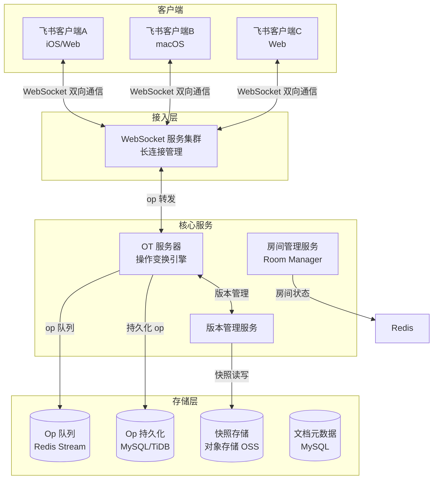
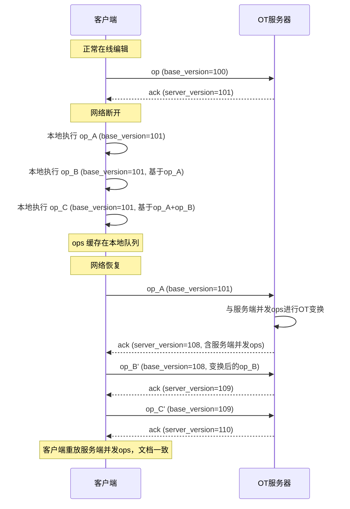
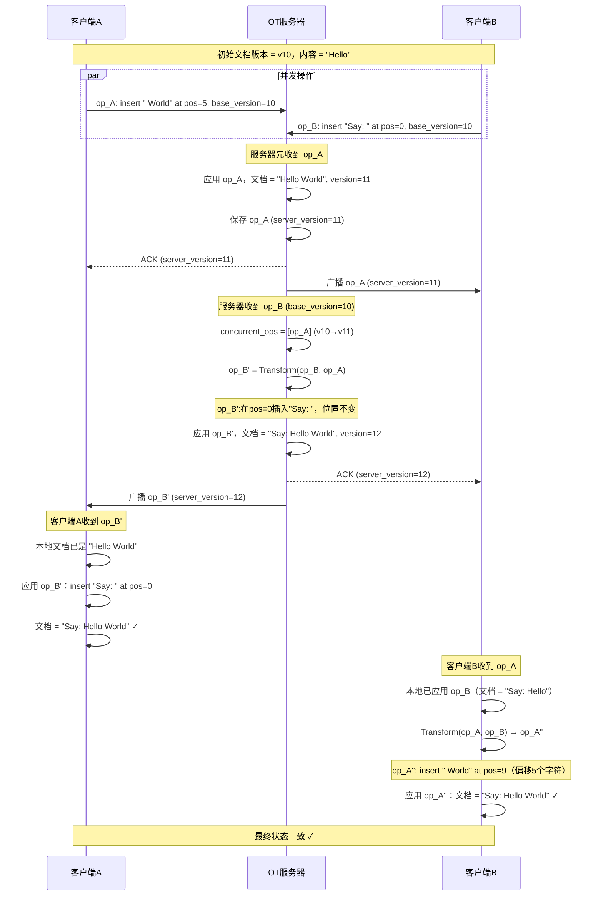
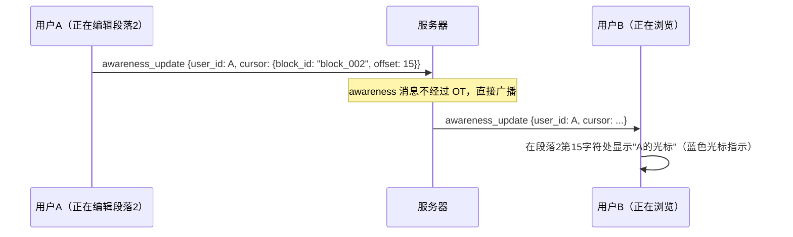

# 飞书协同编辑系统设计

> **面试场景：** 字节跳动飞书 / 腾讯文档 / 钉钉 后端高级工程师 / 系统设计面试  
> **高频指数：** ⭐⭐⭐⭐

## 题目背景

**面试官常见提问方式：**

> "请设计一个协同编辑系统，类似飞书文档或 Google Docs。多个用户可以同时编辑同一份文档，修改需要实时同步给所有协作者，且不能出现内容丢失或冲突。P99 同步延迟要求 < 500ms，如何设计？"

**业务背景：**

协同编辑是所有现代协作工具的核心功能，技术难度极高——在分布式环境下，多个用户同时对同一份文档进行修改，如何保证所有客户端最终看到一致的内容？这是经典的分布式一致性问题，但要在毫秒级延迟下解决，且对象是结构复杂的富文本文档（不是简单的 key-value）。

**飞书文档的特殊性：**
- 块级编辑模型（Block-based）：文档由段落/表格/图片等 Block 组成，每个 Block 是独立编辑单元
- 支持富文本：粗体/斜体/链接/代码块/嵌套列表
- 支持离线编辑：断网后本地编辑，重连后同步
- 支持历史版本：任意时刻的文档快照

**规模量级：**

- MAU：100,000,000+
- 日活文档：10,000,000+（每天有编辑操作的文档）
- 同时编辑人数最多的文档：1,000+ 人并发编辑（公司全员文档）
- 操作频率：活跃用户约 5 个 op/s（打字速度）
- 峰值 op 写入：10M文档 × 平均 2 人编辑 × 5 op/s = **100M ops/s**（量级估算）
- P99 同步延迟 < 500ms（从用户A提交op，到用户B看到变化）

## 关键指标估算

| 指标 | 估算过程 | 结果 |
|------|----------|------|
| 峰值 op QPS（单文档） | 1000人并发 × 5 op/s | 5,000 ops/s（单文档） |
| 全局 op QPS | 10M日活文档 × 2人 × 5 op/s ÷ 3600s（峰值2小时） | ~28,000 ops/s |
| WebSocket 连接数 | 100M DAU × 平均20%在线（白天工作时间） | 20M 长连接 |
| 文档 Snapshot 大小 | 平均文档 1,000 Block × 每Block 200B | ~200 KB/文档 |
| Op 存储量 | 10M文档 × 平均1000 ops/文档 × 平均 50B/op | ~500 GB op历史 |
| Snapshot 存储量 | 10M文档 × 每N次op一个快照 × 200KB | ~2 TB（100M快照） |

## 高层架构



## 核心设计决策

### 决策1：OT vs CRDT——选择 OT + 中央服务器

这是协同编辑系统最核心的架构决策。

**两种主流技术路线对比：**

| 特性 | OT（操作变换）| CRDT（无冲突复制数据类型）|
|------|-------------|----------------------|
| **核心思想** | 通过变换函数解决并发冲突，需要中央服务器定序 | 数据结构本身保证收敛，无需中央协调 |
| **中央服务器** | **必须有**（负责 op 定序和变换） | 不需要（P2P 可行） |
| **实现复杂度** | 中等（变换函数需要精确实现） | 高（富文本 CRDT 极其复杂） |
| **内存开销** | 低（只存当前文档状态） | 高（墓碑标记永不删除） |
| **富文本支持** | 成熟（Google Docs、飞书都用 OT） | 复杂（Yjs 等库在探索，但问题多） |
| **离线支持** | 可以（重连后提交本地 op，服务端 OT 处理）| 原生支持（本地CRDT状态直接合并） |
| **代表产品** | **飞书、Google Docs、腾讯文档** | Notion（部分功能）、Linear |

**飞书选择 OT + 中央服务器的理由：**

1. 飞书有自己的服务器，不需要 P2P 场景
2. OT 在服务端处理冲突，客户端实现相对简单
3. 富文本 CRDT 的实现（如 Yjs、Automerge）对复杂格式操作仍有大量边界问题
4. 中央服务器便于权限控制（服务端可以拒绝无权限的写操作）

**为什么飞书选择 OT 而不是 CRDT？**

| 维度 | OT（飞书实际选择） | CRDT |
|------|-------------------|------|
| 架构要求 | 需要中央服务器建立操作全序 | 支持真正 P2P，无需中心节点 |
| 实现复杂度 | transform 函数实现复杂，但已有成熟框架（ShareDB/ShareJS） | 每种数据类型需独立实现 merge 语义（富文本 CRDT 极复杂） |
| 富文本支持 | 成熟，Google Docs 2006年即用 OT 处理富文本 | 富文本 CRDT（如 Yjs/Peritext）2020年后才成熟 |
| 离线编辑 | 需要将离线 op 与服务端 op 做多步 transform，冲突概率高 | 天然支持离线后合并，convergence 保证更强 |
| 内存开销 | 低（只需记录操作，不需全量状态） | 高（CRDT 需要记录全量 tombstone） |
| **飞书选择 OT 的核心原因** | 飞书是企业 SaaS 产品，有稳定的中央服务器；2018年飞书启动时，富文本 CRDT 方案尚不成熟；OT 配合 Block-based 文档模型可以将冲突范围限制在 Block 级别，降低 transform 实现难度 | |

> **补充**：Google Wave 曾尝试 OT，后来 Google Docs 内部有过迁移到 CRDT 的讨论（Project Realtimecollab）。Notion 和新一代协同编辑产品（如 Linear）倾向 CRDT。飞书面试中被问到这个问题时，回答"OT 在有中央服务器的场景下足够，且当时富文本 CRDT 方案未成熟"是标准答案。

### 决策2：OT 核心原理与实现

**Operation（操作）的数据结构：**

```typescript
interface Operation {
  type: "insert" | "delete" | "retain" | "format";
  position: number;       // 操作位置（字符级别）
  content?: string;       // 插入内容
  length?: number;        // 删除或保留长度
  attributes?: Record<string, any>;  // 格式化属性 {bold: true}
  
  // OT 控制元数据
  doc_id: string;         // 文档 ID
  client_id: string;      // 客户端 ID
  base_version: number;   // 该操作基于的文档版本号
  op_id: string;          // 操作唯一 ID（UUID）
}
```

**OT 变换（Transform）原理：**

假设文档初始状态为 `"Hello"`：

- 客户端 A 在位置 5 插入 `" World"`（op_A：insert at 5）
- 客户端 B 在位置 0 插入 `"Say: "`（op_B：insert at 0）

两个操作基于同一版本并发提交，服务器先收到 op_A，op_B 后到。服务器需要将 op_B 变换为 op_B'（考虑 op_A 已经执行后的新位置）：

```
服务器执行顺序：
1. 执行 op_A：文档 = "Hello World"
2. op_B（原始）：在位置 0 插入 "Say: "
   但 op_B 是在 "Hello" 基础上写的，现在文档已经是 "Hello World"
   Transform(op_B, op_A) = op_B'
   op_B'：仍然在位置 0 插入 "Say: "（因为在头部插入，位置不受 op_A 影响）
3. 执行 op_B'：文档 = "Say: Hello World"

客户端 A 需要执行 Transform(op_B, op_A)（将 op_B 变换到 op_A 已执行的基础上）
客户端 A 执行变换后的 op_B：最终结果 = "Say: Hello World" ✓
```

**OT 变换函数实现（简化版）：**

```python
def transform(op1, op2):
    """
    将 op2 变换为 op2'，使得 apply(apply(doc, op1), op2') = apply(apply(doc, op2), op1')
    即：两种顺序执行后，文档结果相同
    """
    if op1.type == "insert" and op2.type == "insert":
        if op2.position <= op1.position:
            # op2 在 op1 前面插入，不受 op1 影响
            return op2
        else:
            # op2 在 op1 后面插入，位置需要偏移 op1 插入的长度
            return Operation(
                type="insert",
                position=op2.position + len(op1.content),
                content=op2.content
            )
    
    elif op1.type == "insert" and op2.type == "delete":
        if op2.position >= op1.position:
            # 删除位置在插入位置后面，删除位置偏移
            return Operation(
                type="delete",
                position=op2.position + len(op1.content),
                length=op2.length
            )
        elif op2.position + op2.length <= op1.position:
            # 删除范围完全在插入位置前面，不受影响
            return op2
        else:
            # 删除范围跨越插入位置，需要拆分（复杂情况）
            return split_and_transform(op1, op2)
    
    # ... 其他情况（delete + insert, delete + delete 等）
```

**服务端 OT 处理流程：**

```python
class OTServer:
    def __init__(self):
        self.doc_locks = {}  # 文档级别锁
    
    def process_op(self, incoming_op):
        doc_id = incoming_op.doc_id
        
        with self.doc_locks[doc_id]:
            # 1. 获取服务端当前文档版本
            server_version = self.get_current_version(doc_id)
            client_base_version = incoming_op.base_version
            
            # 2. 获取从 client_base_version 到 server_version 之间的所有 op
            concurrent_ops = self.get_ops_since(doc_id, client_base_version)
            
            # 3. 将 incoming_op 与所有并发 op 进行变换
            transformed_op = incoming_op
            for server_op in concurrent_ops:
                transformed_op = transform(transformed_op, server_op)
            
            # 4. 应用变换后的 op 到文档
            new_version = server_version + 1
            self.apply_op(doc_id, transformed_op, new_version)
            
            # 5. 持久化 op（带最终版本号）
            transformed_op.server_version = new_version
            self.save_op(transformed_op)
            
            # 6. 广播给该文档的所有其他协作者
            self.broadcast(doc_id, transformed_op, exclude=incoming_op.client_id)
            
            # 7. 返回确认给提交者（含最终版本号）
            return {"status": "ok", "server_version": new_version}
```

### 决策3：文档数据模型（Block-based）

飞书文档采用**块级数据模型**（Block-based Model），而非字符级模型（Operational Transformation 的传统实现方式）。

```typescript
// 飞书文档的逻辑树结构
interface Document {
  doc_id: string;
  root_block_id: string;  // 根 Block
  version: number;
}

interface Block {
  block_id: string;       // 全局唯一 ID（UUID）
  doc_id: string;
  parent_id: string | null;  // 父 Block（文档结构树）
  block_type: "paragraph" | "heading" | "table" | "image" | "code" | "list_item";
  content: BlockContent;  // 根据类型不同，内容结构不同
  children: string[];     // 子 Block ID 列表（有序）
  created_at: Date;
  updated_at: Date;
  version: number;        // Block 级别版本号
}

interface ParagraphContent {
  type: "paragraph";
  text: RichTextSpan[];   // 富文本段落
}

interface RichTextSpan {
  text: string;
  attributes: {
    bold?: boolean;
    italic?: boolean;
    underline?: boolean;
    color?: string;
    link?: string;
  };
}
```

**Block 级操作（Op 粒度为 Block 级别）：**

```typescript
// Block 级操作类型
type BlockOp = 
  | { type: "insert_block"; parent_id: string; index: number; block: Block }
  | { type: "delete_block"; block_id: string }
  | { type: "update_block"; block_id: string; content: BlockContent }  // 富文本内容变更
  | { type: "move_block"; block_id: string; new_parent: string; new_index: number }
```

**Block 级模型的优势：**

1. **冲突范围缩小**：两个用户编辑不同 Block 时完全不冲突，只有编辑同一 Block 时才需要 OT 处理
2. **协作体验更好**：可以精确显示"谁正在编辑哪个 Block"（实时光标）
3. **历史版本效率高**：只需记录变化的 Block，不需要保存完整文档

### 决策4：离线编辑

**客户端离线编辑流程：**



**客户端本地 OT 处理：**

```python
class ClientOTEngine:
    def __init__(self):
        self.inflight_ops = []   # 已发送给服务器、等待确认的 ops
        self.pending_ops = []    # 本地执行但未发送的 ops（离线队列）
        self.local_doc = Document()
    
    def apply_local_op(self, op):
        # 立即在本地执行
        self.local_doc.apply(op)
        
        if network.is_connected():
            if not self.inflight_ops:
                # 没有在途 op，直接发送
                self.inflight_ops.append(op)
                network.send(op)
            else:
                # 有在途 op，加入待发送队列
                self.pending_ops.append(op)
        else:
            # 离线，加入本地队列
            self.pending_ops.append(op)
    
    def on_server_ack(self, server_version, server_op_id):
        # 服务器确认了 inflight_ops[0]
        confirmed_op = self.inflight_ops.pop(0)
        
        # 发送下一个待发送 op（如果有）
        if self.pending_ops:
            next_op = self.pending_ops.pop(0)
            self.inflight_ops.append(next_op)
            network.send(next_op)
    
    def on_server_broadcast(self, remote_op):
        # 收到其他用户的操作广播
        # 1. 将 remote_op 变换到跳过所有在途 + 待发送 op
        transformed = remote_op
        for local_op in self.inflight_ops + self.pending_ops:
            transformed, _ = transform_pair(transformed, local_op)
        
        # 2. 应用变换后的远程 op 到本地文档
        self.local_doc.apply(transformed)
```

### 决策5：历史版本与 Snapshot

**快照策略：**

不能无限保存所有 op（会导致恢复文档时需要回放数千个 op，极慢）。采用定期快照 + 增量 op 回放。

```python
class VersionManager:
    SNAPSHOT_INTERVAL = 50  # 每 50 个 op 创建一次快照
    
    def should_create_snapshot(self, doc_id, current_version):
        return current_version % self.SNAPSHOT_INTERVAL == 0
    
    def create_snapshot(self, doc_id, version, doc_state):
        """将当前完整文档状态序列化并存到 OSS"""
        snapshot_data = doc_state.serialize()  # JSON/Protobuf 序列化
        key = f"snapshots/{doc_id}/v{version}.snapshot"
        oss.put(key, snapshot_data)
        
        # 记录快照元数据
        db.insert_snapshot_record(doc_id, version, key, len(snapshot_data))
    
    def restore_to_version(self, doc_id, target_version):
        """恢复文档到任意历史版本"""
        # 1. 找到最近的快照（不超过 target_version）
        snapshot = db.get_latest_snapshot_before(doc_id, target_version)
        
        # 2. 从 OSS 加载快照
        doc = Document.deserialize(oss.get(snapshot.storage_key))
        
        # 3. 回放快照版本到目标版本之间的 ops（最多 50 个 op）
        ops_to_replay = db.get_ops(doc_id, snapshot.version, target_version)
        for op in ops_to_replay:
            doc.apply(op)
        
        return doc  # 最多只需回放 50 个 op，速度快
```

**Snapshot 间隔选择（N=50）的数学依据：**

| 参数 | 数值 | 说明 |
|------|------|------|
| 平均 op 大小 | ~100 bytes | 插入/删除/格式化操作 |
| op 回放速度 | ~10,000 ops/s | 单线程内存操作 |
| N=50 时回放耗时 | 50 ÷ 10,000 = **5 ms** | 用户打开文档的额外等待 |
| N=500 时回放耗时 | 500 ÷ 10,000 = **50 ms** | 勉强可接受 |
| N=50 时 Snapshot 存储成本 | 每 50 ops 一次快照，文档有 10,000 ops → 200 次快照 × 平均文档大小 500KB = **100 MB/文档** | 偏高 |
| 实际策略 | **动态间隔**：小文档 N=100，大文档（>100页）N=500，后台低峰期强制 snapshot | 平衡存储与恢复速度 |

**存储层设计：**

```sql
-- Op 历史表（按 doc_id + version 排序）
CREATE TABLE `doc_op` (
  `op_id`         VARCHAR(36) NOT NULL COMMENT 'UUID',
  `doc_id`        VARCHAR(36) NOT NULL,
  `server_version` INT        NOT NULL COMMENT '服务端全局版本号',
  `client_id`     VARCHAR(36) NOT NULL COMMENT '提交者客户端ID',
  `user_id`       BIGINT      NOT NULL,
  `op_type`       VARCHAR(20) NOT NULL COMMENT 'insert_block/delete_block等',
  `op_data`       JSON        NOT NULL COMMENT '操作内容（序列化后的Op对象）',
  `created_at`    DATETIME(3) NOT NULL,
  PRIMARY KEY (`op_id`),
  UNIQUE KEY `uk_doc_version` (`doc_id`, `server_version`),
  INDEX `idx_doc_created` (`doc_id`, `created_at`)
) ENGINE=InnoDB;

-- 快照元数据表
CREATE TABLE `doc_snapshot` (
  `snapshot_id`   BIGINT      NOT NULL AUTO_INCREMENT,
  `doc_id`        VARCHAR(36) NOT NULL,
  `version`       INT         NOT NULL COMMENT '快照对应的文档版本号',
  `storage_key`   VARCHAR(200) NOT NULL COMMENT 'OSS存储路径',
  `size_bytes`    INT,
  `created_at`    DATETIME    NOT NULL,
  PRIMARY KEY (`snapshot_id`),
  INDEX `idx_doc_version` (`doc_id`, `version` DESC)
) ENGINE=InnoDB;
```

### 决策6：权限控制

```python
class PermissionService:
    def check_write_permission(self, user_id, doc_id, op):
        # 1. 文档级权限
        perm = db.get_permission(user_id, doc_id)
        
        if perm == "view_only":
            raise PermissionError("只读用户不能编辑文档")
        
        if perm == "comment_only":
            # 只能添加评论，不能修改正文
            if op.type not in ["insert_comment", "delete_comment"]:
                raise PermissionError("当前权限只能添加评论")
        
        # 2. Block 级权限（锁定区域）
        if op.block_id:
            block_lock = redis.get(f"block_lock:{op.block_id}")
            if block_lock and block_lock != user_id:
                # 该区域被其他用户锁定（但飞书不实现"排他锁"，只显示光标）
                pass  # 飞书选择不锁定，显示光标提示即可

    def show_realtime_cursors(self, doc_id):
        """实时光标：显示其他用户当前编辑位置"""
        # 所有编辑者的光标位置通过 WebSocket 广播
        # 不是 op，不需要 OT，直接转发最新位置即可
        pass
```

## 详细设计

### OT 冲突解决时序图



### 实时协作感知（Awareness）



**光标位置的 OT 变换（CursorOp）：**

当用户 A 在位置 10 插入 5 个字符，而用户 B 的光标也在位置 10 时，B 的光标位置必须同步更新：

```python
def transform_cursor(cursor_pos: int, op: Operation) -> int:
    """将光标位置相对于已应用的 op 进行变换"""
    if op.type == "INSERT":
        if op.position <= cursor_pos:
            return cursor_pos + len(op.content)  # 插入点在光标前，光标后移
        return cursor_pos  # 插入点在光标后，光标不变
    elif op.type == "DELETE":
        if op.position + op.length <= cursor_pos:
            return cursor_pos - op.length  # 删除在光标前，光标前移
        elif op.position <= cursor_pos:
            return op.position  # 光标在删除范围内，移到删除起点
        return cursor_pos
```

飞书中每个用户的光标是独立的 `CursorState`，广播给同文档其他用户时，接收方需对本地未 ack 的 op 序列依次调用 `transform_cursor`，确保显示位置正确。

### 接口设计

**文档编辑 WebSocket 协议**

```typescript
// 客户端 → 服务端
interface ClientMessage {
  type: "submit_op" | "awareness_update" | "request_sync";
  op?: Operation;
  awareness?: AwarenessState;
  base_version?: number;
}

// 服务端 → 客户端
interface ServerMessage {
  type: "ack" | "op_broadcast" | "awareness_broadcast" | "sync_response" | "error";
  
  // ack
  server_version?: number;
  
  // op_broadcast（其他用户的操作广播）
  op?: Operation;
  
  // sync_response（重连后的全量同步）
  snapshot?: DocumentSnapshot;
  pending_ops?: Operation[];
}
```

**文档历史版本 HTTP API**

```
GET /api/v1/docs/{doc_id}/history?page=1&size=20
Response:
{
  "versions": [
    {"version": 125, "user_id": 1001, "user_name": "张三", "changed_at": "2024-06-01T12:00:00Z", "summary": "修改了第3段"},
    {"version": 100, "user_id": 1002, "user_name": "李四", "changed_at": "2024-06-01T10:00:00Z", "summary": "添加了表格"}
  ]
}

GET /api/v1/docs/{doc_id}/restore?version=100
Response: 恢复到指定版本的文档内容
```

## 踩过的坑 / 生产经验

### 坑1：OT Transform 函数实现错误导致"丢失更新"

**现象：** 两个用户同时在同一段落末尾打字，偶尔出现一方的字消失的情况（"丢失更新"）。

**根因：** Transform 函数实现中，处理"两个 insert 在相同位置"时选择了错误的策略：

```python
# 错误实现：两个 insert 在同一位置，后者直接覆盖
def transform_insert_insert_WRONG(op1, op2):
    if op2.position == op1.position:
        return op2  # ← 错误！应该有确定性的规则决定谁在前
```

```python
# 正确实现：使用 client_id 的字典序做确定性排序
def transform_insert_insert_CORRECT(op1, op2):
    if op2.position < op1.position:
        return op2
    elif op2.position > op1.position:
        return Operation(position=op2.position + len(op1.content), ...)
    else:  # 相同位置
        # 确定性规则：client_id 较小的排在前面
        if op2.client_id < op1.client_id:
            return op2  # op2 保持在原位置（在 op1 之前）
        else:
            return Operation(position=op2.position + len(op1.content), ...)  # op2 排在 op1 之后
```

**怎么发现的？** 用 **Property-Based Testing（基于属性的测试）** 随机生成大量并发 op 序列，验证 OT 收敛性（交换律）：

```python
from hypothesis import given, strategies as st

@given(
    doc=st.text(min_size=5, max_size=100),
    ops_ab=st.lists(random_op_strategy, min_size=2, max_size=5)
)
def test_ot_convergence(doc, ops_ab):
    """
    OT 收敛性测试：
    apply(apply(doc, op_A), transform(op_B, op_A)) 
    == apply(apply(doc, op_B), transform(op_A, op_B))
    """
    op_a, op_b = ops_ab[0], ops_ab[1]
    
    # Path 1: 先应用 A，再应用 transform(B, A)
    doc_1 = apply(apply(doc, op_a), transform(op_b, op_a))
    
    # Path 2: 先应用 B，再应用 transform(A, B)
    doc_2 = apply(apply(doc, op_b), transform(op_a, op_b))
    
    assert doc_1 == doc_2, f"OT convergence violation! op_a={op_a}, op_b={op_b}"
```

Hypothesis 跑了 10,000 个随机测试用例后发现了该 bug。

### 坑2：大文档历史 Op 回放极慢

**现象：** 某个大文档（会议纪要积累了 1 年，约 5 万个 op），用户查看 1 个月前的历史版本时，需要等待 30 秒以上。

**根因：** 快照间隔太长（每 500 个 op 一个快照），回放最多需要回放 500 个 op；而 5 万个 op 的文档有很长的"初始化"阶段没有快照。

**解决方案：**

1. **强制定期快照**：对于 op 数量 > 1000 的文档，快照间隔从每 500 个 op 降低到每 50 个 op
2. **后台补建快照**：对现有大文档，后台任务异步补建快照（不影响线上服务）
3. **快照压缩**：大文档快照用 gzip 压缩后存 OSS，节省存储并加快加载

```python
def backfill_snapshots(doc_id):
    """为大文档补建快照"""
    ops = db.get_all_ops(doc_id)
    doc = Document()
    
    for i, op in enumerate(ops):
        doc.apply(op)
        if i % 50 == 49:  # 每50个op创建一个快照
            snapshot_data = doc.serialize()
            compressed = gzip.compress(snapshot_data)
            key = f"snapshots/{doc_id}/v{op.server_version}.snapshot.gz"
            oss.put(key, compressed)
            db.insert_snapshot_record(doc_id, op.server_version, key)
```

### 坑3：重连时文档状态不一致（脏读）

**现象：** 用户网络波动后重连，本地文档和服务器文档不一致，用户看到"乱码"或"文档内容倒退"。

**根因：** 重连时客户端发送了本地缓存的 op（base_version 是断线前的），但在重连过程中，服务器已经处理了其他用户的大量 op，导致 OT 变换需要处理大量并发 op，某些边界情况处理不正确。

**解决方案：**

```python
def handle_reconnect(doc_id, client_base_version):
    server_version = get_current_version(doc_id)
    
    if server_version - client_base_version > MAX_OPS_FOR_INCREMENTAL_SYNC:
        # 差距太大（>200个op），发送完整快照（全量同步）
        snapshot = get_latest_snapshot(doc_id)
        ops_after_snapshot = get_ops(doc_id, snapshot.version, server_version)
        return {
            "type": "full_sync",
            "snapshot": snapshot,
            "ops": ops_after_snapshot,
            "server_version": server_version
        }
    else:
        # 差距小，发送增量 op
        missing_ops = get_ops(doc_id, client_base_version, server_version)
        return {
            "type": "incremental_sync",
            "ops": missing_ops,
            "server_version": server_version
        }
```

## 扩展考点

### 追问方向

**Q：如何实现评论/批注功能（Comments）？**

评论与正文内容解耦：
- 评论锚定到文档的特定 Block 范围（通过 block_id + 起止 offset 标记）
- 评论本身存储在独立的 comment 表，不走 OT（评论是独立的实体，不需要冲突解决）
- 当被注释的文本被删除时，评论标注为"已失效"

**Q：如何处理文档被大量用户同时编辑时的服务端压力？**

- 文档维度水平分片：通过 doc_id 路由，同一文档的所有操作路由到同一个 OT 服务实例（避免分布式 OT）
- 文档实例化：每个活跃文档在某个 OT 服务节点上有一个"文档实例"（内存中持有当前版本），无需每次查 DB
- 内存快照 + 定时持久化：文档实例定时将状态持久化到 DB，重启时从 DB 恢复

**Q：飞书多端同步（手机+电脑+Web）如何保证最终一致？**

所有客户端都通过同一个 OT 服务器同步，服务器是唯一的权威版本。多端切换时，新客户端连接后先请求服务端当前版本（全量 Sync 或增量 Sync），然后进入正常 OT 流程。

### 边界 Case

- **文档被删除时仍有人在编辑**：文档删除后，OT 服务器拒绝后续 op 提交（返回错误），客户端收到后提示用户"文档已被删除或无权访问"
- **超大文档（100MB）**：分页加载 Block，只加载可视区域附近的 Block；不可见区域的 Block 不参与实时 OT（延迟加载）
- **恶意大量 op 攻击**：限制单用户 op 提交频率（每秒最多 50 个 op），超出部分丢弃并告警

### 演进路径

```
v1.0：单用户编辑 + 自动保存（每 30s 保存）
  ↓
v2.0：锁定编辑（同一时刻只有一人能编辑）
  ↓
v3.0：OT 协同编辑（字符级别）
  ↓
v4.0：Block 级别 OT + 富文本支持
  ↓
v5.0：离线编辑 + 移动端优化
  ↓
v6.0：AI 协同（AI 建议实时插入，基于 OT 机制）
```

### 监控与告警指标

| 指标 | 类型 | 告警阈值 | 说明 |
|------|------|---------|------|
| `ot_transform_latency_ms` | Histogram | P99 > 200ms 触发告警 | OT 操作变换耗时，超时导致编辑延迟 |
| `op_queue_length_per_doc` | Gauge | > 100 触发告警 | 单文档待处理操作队列长度，积压说明处理能力不足 |
| `sync_conflict_rate` | Counter | > 0.1% 触发告警 | OT 冲突解决触发率，高于阈值检查 transform 函数正确性 |
| `websocket_reconnect_rate` | Counter | > 5% 触发告警 | WebSocket 重连率，高于阈值检查网络质量或服务稳定性 |
| `snapshot_creation_latency_ms` | Histogram | P99 > 5000ms 触发告警 | 文档快照创建耗时，影响历史版本和增量恢复速度 |
| `offline_op_merge_failure_rate` | Counter | > 0.01% 触发告警 | 离线编辑重连合并失败率，失败导致用户编辑内容丢失 |

## 面试评分维度

| 维度 | 基础分（60分） | 加分项（80+分） | 满分项（100分） |
|------|---------------|----------------|----------------|
| **核心算法选择** | 知道协同编辑需要解决冲突 | 说出 OT vs CRDT 的区别 | 分析飞书选择 OT 的原因（有中央服务器、富文本成熟度） |
| **OT 实现** | 知道需要变换函数 | 说出 Transform 的基本逻辑（位置偏移） | 说出客户端 OT（inflight + pending 队列）+ 服务端定序流程 |
| **数据模型** | 提到 Block 结构 | 说出 Block 级 Op 减少冲突范围 | 完整的 Op 数据结构 + 版本号管理 |
| **历史版本** | 提到要保存历史 | 说出快照 + 增量 op 回放策略 | 快照间隔与回放性能的权衡分析 |
| **离线支持** | 提到客户端缓存 | 说出重连后的批量 op 提交 | 客户端 inflight/pending 队列设计，重连全量/增量同步 |
| **生产经验** | 了解 OT 实现难度高 | 提到 Property-Based Testing 验证 OT 正确性 | 结合"丢失更新" bug 案例 + 大文档快照补建方案 |
