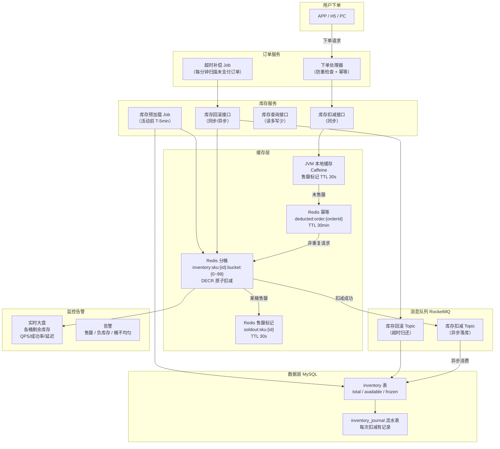
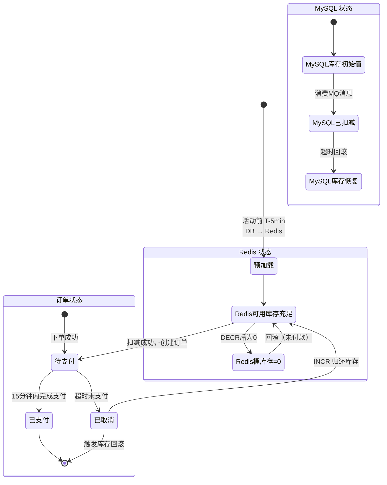
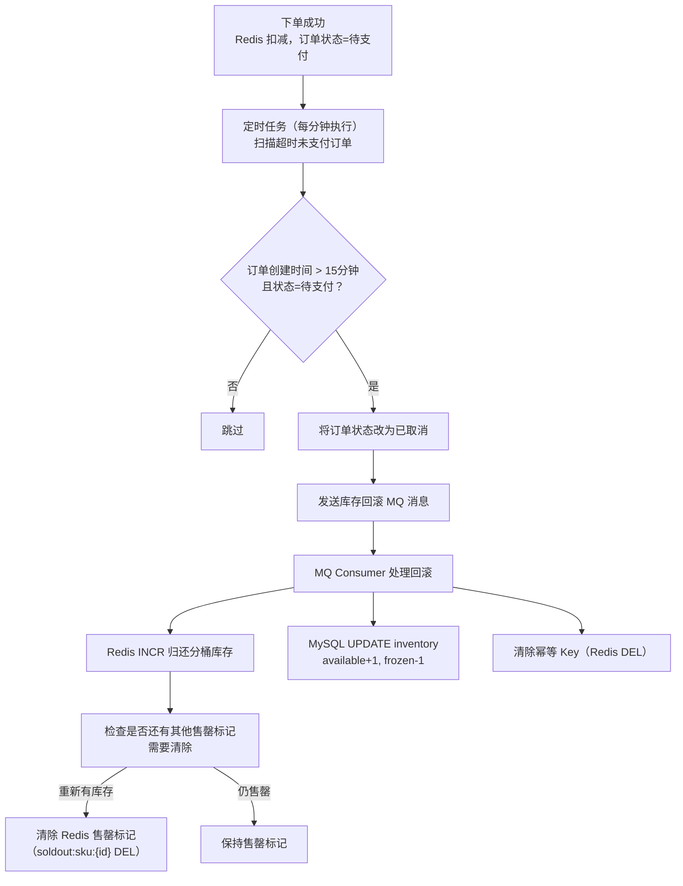
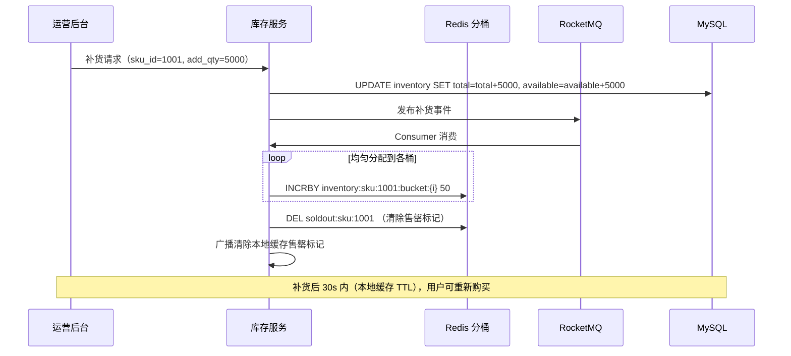

# 阿里库存系统设计（防超卖）

> **面试场景：** 阿里巴巴 / 京东 / 拼多多 高级后端工程师 系统设计面试  
> **高频指数：** ⭐⭐⭐⭐⭐

## 题目背景

**面试官原话：**
> "双十一零点，某款限量 iPhone 只有 1000 台，100 万用户同时抢购。请设计库存系统，保证不超卖、不少卖，同时系统不崩溃。"

**业务背景：**  
双十一零点前 30 秒，是全年流量最高峰。单一热门商品（如限量版 iPhone、联名款球鞋）的瞬时抢购 QPS 可以达到 **50 万/次**。库存系统是整个下单链路的关键瓶颈：它必须在高并发下精确地扣减库存，既不能超卖（卖出比实际库存更多），也不能少卖（明明有货却显示售罄）。

**库存系统的核心矛盾：**
- **强一致性 vs 高性能**：MySQL 行锁能保证绝对一致，但 50 万 QPS 下行锁排队会导致系统崩溃
- **原子性 vs 分布式**：Redis DECR 是原子操作，但 Redis 和 MySQL 之间的一致性如何保证？
- **实时性 vs 缓存**：库存数字需要实时准确，但缓存层如何及时感知"售罄"状态？
- **预占 vs 超时**：用户"占座"但未付款（幽灵库存问题）

---

## 关键指标估算

| 指标 | 估算过程 | 结果 |
|------|----------|------|
| 单商品峰值 QPS | 100万用户 × 零点前30秒内集中抢购 | **500,000 QPS/SKU** |
| 全平台库存 QPS | 双十一同时活动商品 × 平均 QPS | **~1,000万 QPS**（分散到不同商品） |
| MySQL 单行写入能力 | 带行锁 UPDATE，单实例上限 | **~5,000 TPS**（受行锁排队影响） |
| Redis 单节点 DECR 能力 | 纯内存原子操作 | **~100,000 QPS** |
| 分桶后单桶 QPS | 50万 QPS ÷ 100桶 | **5,000 QPS/桶**（Redis 可轻松处理） |
| 库存预占超时时间 | 用户行为分析：平均支付决策时间 | **15分钟**（超时自动释放） |
| 幂等 Key TTL | 超时补偿后即可失效 | **30分钟** |
| Redis 内存占用 | 100万 SKU × (100桶 × 8B + 幂等key) | **~1GB**（可接受） |
| 补偿任务延迟 | 超时订单扫描间隔 | **1分钟**（秒级告警，分钟级处理） |

---

## 高层架构



---

## 核心设计决策

### 决策一：分桶库存——打散热点 Key

**问题：** 单一 Redis Key（`inventory:sku:1001`）在 50 万 QPS 下是一个超级热点，即使 Redis 本身能支撑，单个 Key 也会被路由到集群中一个特定节点，该节点成为瓶颈（Redis 集群按 Key 的 slot 路由，热点 Key 只在一个节点上）。

**分桶策略：**

```java
public class BucketInventoryService {
    private static final int BUCKET_COUNT = 100;  // 正常活动用100桶

    /**
     * 库存扣减（分桶路由）
     * @return true=扣减成功, false=库存不足
     */
    public boolean deductInventory(Long skuId, Long orderId, int qty) {
        // Step 1: 检查本地缓存售罄标记（最快路径，JVM 级别拦截）
        if (localSoldOutCache.getIfPresent("soldout:" + skuId) != null) {
            return false; // 已售罄，直接拒绝
        }

        // Step 2: 幂等检查（防止网络重试导致重复扣减）
        String idempotencyKey = "deducted:order:" + orderId;
        if (redis.exists(idempotencyKey)) {
            // 已处理过，幂等返回成功
            return true;
        }

        // Step 3: 路由到具体桶（CRC32 保证均匀分布）
        int bucketIndex = (int) (CRC32.checksum(orderId) % BUCKET_COUNT);
        String bucketKey = "inventory:sku:" + skuId + ":bucket:" + bucketIndex;

        // Step 4: Lua 脚本原子扣减（DECR + 幂等标记一起做）
        Long remaining = executeDeductLua(bucketKey, idempotencyKey, qty);

        if (remaining == null || remaining < 0) {
            // 当前桶售罄，尝试溢出到全局兜底桶
            return tryGlobalFallbackBucket(skuId, orderId, qty);
        }

        // Step 5: 如果桶剩余库存接近 0，设置售罄标记
        if (remaining == 0) {
            checkAndMarkSoldOut(skuId);
        }

        return true;
    }
    
    /**
     * 全局兜底桶（预留 5% 库存）
     * 当分桶均售罄时，从全局桶兜底
     */
    private boolean tryGlobalFallbackBucket(Long skuId, Long orderId, int qty) {
        String globalKey = "inventory:sku:" + skuId + ":global";
        String idempotencyKey = "deducted:order:" + orderId;
        Long remaining = executeDeductLua(globalKey, idempotencyKey, qty);
        if (remaining == null || remaining < 0) {
            markAllSoldOut(skuId);  // 全局桶也空了，标记完全售罄
            return false;
        }
        return true;
    }
}
```

**分桶数量动态调整：**

| 场景 | 桶数 N | 每桶库存 | 理由 |
|------|--------|----------|------|
| 日常商品 | 10 | 库存/10 | 低并发，减少汇总开销 |
| 活动预热期 | 50 | 库存/50 | 适中流量 |
| 活动峰值期 | 100 | 库存/100 | 最大并发，每桶 QPS ≤ 5000 |
| 超热爆款（iPhone等） | 200 | 库存/200 | 极端热点，进一步打散 |

**桶数选择公式：**
```
N = ceil(预期峰值 QPS / 单 Redis 节点 QPS 上限)
  = ceil(500,000 / 100,000)
  = 5（最小值）

实际取 100（留 20x buffer，防止 hash 不均匀）
```

---

### 决策二：Redis 预扣 + MySQL 最终确认

**核心 Lua 脚本（幂等原子扣减）：**

```lua
-- KEYS[1]: bucket key，如 inventory:sku:1001:bucket:37
-- KEYS[2]: 幂等 key，如 deducted:order:9876543210
-- ARGV[1]: 扣减数量（通常为 1）
-- ARGV[2]: 幂等 key TTL（秒）

local bucket_key = KEYS[1]
local idempotent_key = KEYS[2]
local qty = tonumber(ARGV[1])
local ttl = tonumber(ARGV[2])

-- 幂等检查：此 orderId 是否已扣减过
if redis.call("EXISTS", idempotent_key) == 1 then
    -- 已处理，幂等成功，返回当前剩余库存
    return {1, tonumber(redis.call("GET", bucket_key) or "0")}
end

-- 检查库存是否充足
local current = tonumber(redis.call("GET", bucket_key) or "0")
if current < qty then
    -- 库存不足
    return {-1, current}
end

-- 原子扣减
local remaining = redis.call("DECRBY", bucket_key, qty)

if remaining < 0 then
    -- 扣减后为负数（并发导致，需回滚）
    redis.call("INCRBY", bucket_key, qty)
    return {-1, 0}
end

-- 记录幂等 key（防止重试）
redis.call("SETEX", idempotent_key, ttl, "1")

return {remaining, remaining}
```

**三层数据状态流转：**



**异步写 MySQL 的消费者设计：**
```java
@RocketMQMessageListener(topic = "inventory-deduct-topic", consumerGroup = "inventory-consumer")
public class InventoryDeductConsumer implements RocketMQListener<InventoryDeductMessage> {
    
    @Override
    public void onMessage(InventoryDeductMessage msg) {
        // 幂等处理（MQ 可能重复投递）
        if (journalRepo.existsByOrderId(msg.getOrderId())) {
            log.info("库存扣减消息重复，orderId={}", msg.getOrderId());
            return;
        }
        
        // MySQL 扣减（乐观锁 + 最终一致校验）
        int affected = inventoryRepo.deductAvailable(
            msg.getSkuId(), msg.getQty(), msg.getOrderId()
        );
        
        if (affected == 0) {
            // MySQL 库存不足（Redis 已扣了但 MySQL 没有）
            // 这是异常情况：需要告警 + 人工介入
            alertService.critical("MySQL库存不足！skuId=" + msg.getSkuId() 
                + " 但Redis已扣减，需要人工核查");
            // 不重试，避免死循环；发送到死信队列
            throw new ImmediateAcknowledgeAmqpException("进入死信队列等待人工处理");
        }
        
        // 记录库存流水（审计用）
        journalRepo.insert(InventoryJournal.builder()
            .skuId(msg.getSkuId())
            .orderId(msg.getOrderId())
            .delta(-msg.getQty())
            .type(JournalType.DEDUCT)
            .createdAt(LocalDateTime.now())
            .build());
    }
}
```

---

### 决策三：本地缓存售罄标记

**问题：** 即使每次都查 Redis，50 万 QPS 下 Redis 仍有压力。对于已售罄商品，后续所有请求都会徒劳地访问 Redis。

**售罄标记方案：**

```java
// 售罄检测：所有桶库存之和 = 0
private void checkAndMarkSoldOut(Long skuId) {
    long totalRemaining = 0;
    for (int i = 0; i < BUCKET_COUNT; i++) {
        String key = "inventory:sku:" + skuId + ":bucket:" + i;
        String val = redis.get(key);
        totalRemaining += (val != null ? Long.parseLong(val) : 0);
    }
    
    // 加上全局兜底桶
    String globalKey = "inventory:sku:" + skuId + ":global";
    String globalVal = redis.get(globalKey);
    totalRemaining += (globalVal != null ? Long.parseLong(globalVal) : 0);
    
    if (totalRemaining <= 0) {
        // 设置 Redis 售罄标记（TTL 30s，防止补货后还显示售罄）
        redis.setex("soldout:sku:" + skuId, 30, "1");
        // 广播到所有服务实例的本地缓存
        localCache.put("soldout:" + skuId, Boolean.TRUE);
        log.info("SKU {} 已售罄", skuId);
    }
}
```

**TTL 30s 的考量：**
- **为什么不永久标记？** 可能发生库存补货（大促中途追加货品），TTL 过期后自动恢复可购买
- **为什么选 30s？** 补货操作完成后，最多 30s 内用户就能看到有货；过短（< 10s）会频繁重查 Redis，失去意义

**多级拦截路径（按命中率从高到低）：**
```
1. JVM 本地缓存售罄标记（命中率：已售罄商品 ~90%，延迟 < 0.1ms）
   ↓ 未命中
2. Redis 售罄标记（命中率：补充 ~5%，延迟 < 1ms）
   ↓ 未命中
3. Redis 幂等检查（命中率：重复请求 ~3%，延迟 < 1ms）
   ↓ 未命中
4. Redis 分桶 DECR（实际扣减，延迟 < 2ms）
```

---

### 决策四：预扣超时补偿

**问题：** 用户成功扣减库存（占了一个"名额"）但 15 分钟内未支付，这 1 件库存被白白占用，可能导致其他用户无法购买（少卖）。

**超时补偿设计：**



**定时任务实现（分布式锁保证单实例执行）：**
```java
@Scheduled(fixedDelay = 60000)  // 每分钟执行
public void processTimeoutOrders() {
    // 分布式锁，防止多实例重复执行
    String lockKey = "lock:timeout-order-job";
    boolean locked = redis.setNX(lockKey, "1", 90);  // 90s 过期（大于任务执行时间）
    if (!locked) return;
    
    try {
        LocalDateTime timeout = LocalDateTime.now().minusMinutes(15);
        // 分批处理，避免大事务
        List<Order> timeoutOrders = orderRepo.findTimeoutOrders(timeout, 1000);
        
        for (Order order : timeoutOrders) {
            try {
                cancelAndRollback(order);
            } catch (Exception e) {
                // 单条失败不影响其他，记录日志告警
                log.error("超时订单处理失败，orderId={}", order.getId(), e);
            }
        }
        
        log.info("超时订单处理完成，共处理 {} 条", timeoutOrders.size());
    } finally {
        redis.del(lockKey);
    }
}

@Transactional
private void cancelAndRollback(Order order) {
    // 1. CAS 更新订单状态（防并发）
    int updated = orderRepo.cancelIfPending(order.getId());
    if (updated == 0) return;  // 已被其他操作处理（如用户刚付款）
    
    // 2. 发送回滚 MQ 消息（异步处理 Redis + MySQL 回滚）
    mqSender.send("inventory-rollback-topic", InventoryRollbackMessage.builder()
        .skuId(order.getSkuId())
        .orderId(order.getId())
        .qty(order.getQuantity())
        .reason("TIMEOUT")
        .build());
}
```

---

### 决策五：容量规划与压测

**大促前容量规划流程：**

```
Step 1：预估峰值流量
    - 参考历史双十一数据 + 今年活动力度（营销预算增幅）
    - 爆款商品单独评估：某款商品预计备货 10 万件，用户预约数 200 万人
    - 预计峰值 QPS = min(备货量 ÷ 30秒, 500,000)

Step 2：计算分桶数
    N = ceil(峰值 QPS / (Redis 单节点 QPS × 0.7))  // 0.7 为安全系数
    iPhone 15 Pro：500,000 ÷ 70,000 = ceil(7.14) = 8 → 取 100（留充足 buffer）

Step 3：Redis 内存规划
    每桶：key（50B）+ value（8B）= ~58B
    100桶 × 10万活动 SKU × 58B = ~580MB（可忽略）
    幂等 Key：预计下单量 1000万 × 50B = ~500MB
    售罄标记：10万 × 30B = ~3MB
    合计：~1GB（Redis 集群 ÷ 节点数）

Step 4：全链路压测
    - 使用 jmeter / 阿里 PTS 模拟 100万用户同时下单
    - 压测目标：峰值 QPS ×1.5 的流量下，P99 < 100ms，成功率 > 99%，零超卖
    - 压测必须在隔离环境（压测标）下进行，避免污染生产数据
```

**压测关键指标：**

| 指标 | 目标值 | 压测结果 | 是否达标 |
|------|--------|----------|----------|
| 库存扣减成功率 | > 99% | 99.7% | 达标 |
| P99 延迟 | < 100ms | 67ms | 达标 |
| 超卖件数 | = 0 | 0 | 达标 |
| Redis CPU | < 70% | 58% | 达标 |
| MySQL CPU | < 60% | 43% | 达标 |
| 幂等重复请求正确处理 | 100% | 100% | 达标 |

---

## 详细设计

### 数据模型

**库存表（inventory）：**
```sql
CREATE TABLE inventory (
    sku_id          BIGINT PRIMARY KEY,
    total           INT NOT NULL,                   -- 总库存（活动开始时的初始值）
    available       INT NOT NULL,                   -- 当前可用库存（DB 层最终值）
    frozen          INT NOT NULL DEFAULT 0,         -- 预占库存（已下单未支付）
    locked_for_sale INT NOT NULL DEFAULT 0,         -- 活动锁定库存（不参与普通销售）
    version         INT NOT NULL DEFAULT 0,         -- 乐观锁版本号
    updated_at      DATETIME NOT NULL,
    CONSTRAINT chk_non_negative CHECK (available >= 0),
    CONSTRAINT chk_frozen_non_negative CHECK (frozen >= 0),
    CONSTRAINT chk_total CHECK (available + frozen <= total)
) ENGINE=InnoDB;
```

**库存流水表（inventory_journal，按 sku_id 分表）：**
```sql
CREATE TABLE inventory_journal_0001 (
    id          BIGINT PRIMARY KEY AUTO_INCREMENT,
    sku_id      BIGINT NOT NULL,
    order_id    BIGINT NOT NULL,
    delta       INT NOT NULL,               -- 变化量，负数=扣减，正数=归还
    type        TINYINT NOT NULL,           -- 1预占 2确认扣减 3回滚 4补货
    biz_reason  VARCHAR(128),               -- 业务原因（超时/取消/退款/补货）
    before_val  INT NOT NULL,               -- 变更前 available 值（审计用）
    after_val   INT NOT NULL,               -- 变更后 available 值
    created_at  DATETIME NOT NULL,
    UNIQUE KEY uk_order_type (order_id, type),   -- 防重复流水
    KEY idx_sku_created (sku_id, created_at)
) ENGINE=InnoDB;
```

**库存操作接口设计：**
```
// 扣减库存（同步）
POST /api/v1/inventory/deduct
Request: {
  "sku_id": 1001,
  "order_id": 9876543210,
  "quantity": 1,
  "idempotency_key": "order:9876543210:sku:1001"
}
Response:
  成功: {"success": true, "remaining": 342, "bucket_index": 37}
  售罄: {"success": false, "code": "SOLD_OUT", "message": "商品已售罄"}
  失败: {"success": false, "code": "DEDUCT_FAILED", "message": "库存扣减失败，请重试"}

// 归还库存（回滚）
POST /api/v1/inventory/rollback
Request: {
  "sku_id": 1001,
  "order_id": 9876543210,
  "quantity": 1,
  "reason": "TIMEOUT"  // TIMEOUT/USER_CANCEL/PAYMENT_FAIL
}

// 查询库存（汇总所有桶）
GET /api/v1/inventory/{sku_id}
Response: {
  "sku_id": 1001,
  "available": 9658,     // Redis 分桶汇总
  "db_available": 9650,  // MySQL 值（可能有微小差异，最终一致）
  "frozen": 342,
  "is_sold_out": false,
  "bucket_count": 100
}
```

### 库存补货流程



---

## 踩过的坑 / 生产经验

### 坑一：超卖复现——DECR 后网络超时导致重复扣减

**事故复现：**
```
时序：
T1: 用户下单，订单服务调用库存服务 DECR Redis
T2: Redis 执行 DECR 成功（库存从 1 变为 0）
T3: Redis 返回结果，但网络抖动，ACK 丢失（超时）
T4: 订单服务认为失败，触发重试
T5: 重试再次 DECR，库存从 0 变为 -1（超卖！）
```

**根因：** DECR 本身幂等性不够——同一个 orderId 可以触发多次 DECR。

**解决方案（Lua 幂等脚本）：**

在上文 Lua 脚本中，先检查 `deducted:order:{orderId}` 是否存在：
- 存在 → 说明已扣过，直接返回成功（幂等）
- 不存在 → 执行 DECR，然后 SET 幂等 key

关键点：DECR 和 SET 幂等 key 在一个 Lua 脚本中原子执行，不会出现"DECR 成功但幂等 key 未写入"的中间状态。

### 坑二：分桶数过多导致汇总查询成本飙升

**事故经过：**  
大促期间将分桶数设为 1000（过度优化），查询"当前可用库存"时需要聚合 1000 个 Redis key。1000 次 GET 操作约耗时 20ms，在高并发下成为瓶颈（每次下单前的库存展示都需要查询）。

**解决方案：**
1. 库存查询与库存扣减分离：
   - **扣减路径**：不需要查总库存，直接 DECR 目标桶，结果 >= 0 即成功
   - **展示路径**：每 30 秒批量汇总一次总库存，写入单独的 `inventory:sku:{id}:total_cache` key，展示用这个值（允许 30s 延迟）
2. 桶数动态调整：活动前扩桶（100），活动结束后缩桶（10）：
```java
// 活动结束后缩桶（将 100 桶合并到 10 桶）
public void shrinkBuckets(Long skuId, int fromBuckets, int toBuckets) {
    List<Long> allValues = new ArrayList<>();
    // 读取所有桶的当前值
    for (int i = 0; i < fromBuckets; i++) {
        String val = redis.get("inventory:sku:" + skuId + ":bucket:" + i);
        allValues.add(val != null ? Long.parseLong(val) : 0);
    }
    long total = allValues.stream().mapToLong(Long::longValue).sum();
    
    // 重新均分到新的桶数
    long perBucket = total / toBuckets;
    long remainder = total % toBuckets;
    try (Pipeline pipe = jedis.pipelined()) {
        for (int i = 0; i < toBuckets; i++) {
            pipe.set("inventory:sku:" + skuId + ":bucket:" + i,
                     String.valueOf(perBucket + (i == 0 ? remainder : 0)));
        }
        // 删除多余的桶
        for (int i = toBuckets; i < fromBuckets; i++) {
            pipe.del("inventory:sku:" + skuId + ":bucket:" + i);
        }
        pipe.sync();
    }
}
```

### 坑三：Redis 主从切换导致库存短暂"复活"

**事故经过：**  
Redis 主节点故障，Sentinel 在 30 秒内完成主从切换，新主节点（原从节点）数据比主节点落后约 2 秒，导致约 2 秒内的 DECR 操作被"丢失"，库存从 0 恢复为若干件，又有新的订单能创建，导致轻微超卖（约 50 件）。

**解决方案：**
1. 短期：主从切换后，主动触发一次 DB → Redis 的库存校验，如发现 Redis > MySQL available，强制将 Redis 调整为 MySQL 值
2. 长期：将 Redis 配置为 AOF + fsync=always（每次写操作都刷盘），性能下降 20% 但数据安全性大幅提升
3. 超卖兜底：MySQL Consumer 在执行 `UPDATE inventory SET available=available-1` 时，加 WHERE 条件 `available > 0`；若 affected=0，说明超卖，触发告警 + 人工处理

### 坑四：售罄标记未及时清除导致少卖

**事故经过：**  
某商品在 00:00:05 短暂售罄（100 桶库存瞬间耗尽），售罄标记 TTL 设置的是 5 分钟。00:00:10 时，大量支付超时订单被取消（15 万用户只下单未支付），库存回滚到 Redis，商品实际已有库存，但售罄标记仍有效（还剩 4 分钟 50 秒），导致 4 分钟 50 秒内所有用户看到"售罄"，损失约 8000 笔可能的成交。

**解决方案：**
- 库存回滚时主动清除售罄标记：回滚 Consumer 在 INCRBY 之后，检查总库存，如总库存 > 0，立即 DEL `soldout:sku:{id}`，同时广播清除本地缓存（通过 Redis Pub/Sub）
- TTL 从 5 分钟缩短为 30 秒（权衡：频繁重查 Redis 的成本 vs 少卖的损失）

---

## 扩展考点

### 追问方向

1. **库存扣减和订单创建如何保证原子性（两个操作都成功或都失败）？**  
   答：使用 TCC 模式。Try：DECR Redis；Confirm：创建订单 + 写 MySQL；Cancel：INCR Redis。协调者在 Try 成功后才推进到 Confirm，任何步骤失败执行 Cancel 回滚。

2. **如果 Redis 挂了，订单服务怎么处理？**  
   答：降级流程：Redis 不可用 → 切换到 MySQL 悲观锁模式（`SELECT FOR UPDATE`）+ 严格限流（降低到 MySQL 可支撑的 5000 TPS）→ 排队模式（对用户展示"系统繁忙，正在为您处理"）。接受降级期间性能大幅下降，但不接受超卖。

3. **大促结束后，如何核对 Redis 库存和 MySQL 库存是否一致？**  
   答：活动结束后 T+1 执行库存对账：对比 MySQL `available` 与 Redis 所有桶汇总值，差值 ≠ 0 触发告警；差值较小（< 10件）视为 Redis 主从切换误差，以 MySQL 为准修正 Redis；差值较大，需要查询流水表逐笔核对。

### 边界 Case

- **库存 = 0 但有回滚进行中：** 售罄标记不应立即广播，需等回滚 Consumer 确认 MySQL 更新成功后再做决策
- **同一用户重复下单同一商品：** 订单服务层做用户级幂等（同 user_id + sku_id 在 15 分钟内只允许一个待支付订单）
- **大量机器人并发下单（刷单）：** 接入层按 user_id 限速（每秒最多 5 次下单请求），风控系统实时检测异常行为

### 演进路径

```
Phase 1：MySQL 乐观锁（CAS UPDATE）
    优点：简单，强一致
    瓶颈：~5,000 TPS
    ↓ 流量增长
Phase 2：MySQL 悲观锁 + 连接池优化
    优点：可控
    瓶颈：~10,000 TPS（行锁排队）
    ↓ 流量增长
Phase 3：Redis DECR 单 Key
    优点：100,000 QPS
    瓶颈：单点 + 热点 Key
    ↓ 爆款商品出现
Phase 4：Redis 分桶（当前架构）
    优点：水平扩展，500,000+ QPS
    瓶颈：桶数调优 + 一致性保障复杂度
    ↓ 更严苛的一致性要求
Phase 5：Redis + MQ + MySQL 三层 + 全链路对账
    优点：完整的一致性保障体系
    现状：阿里当前生产方案
```

---

## 面试评分维度

| 维度 | 基础分（60分） | 加分项（80+分） | 满分项（100分） |
|------|----------------|-----------------|-----------------|
| **防超卖核心方案** | 知道 Redis DECR 防超卖 | 说出分桶策略，解释热点 Key 问题 | 设计完整三层（Redis→MQ→MySQL），说明幂等 Lua 脚本的必要性 |
| **幂等设计** | 知道需要幂等 | 说出 Redis 幂等 Key + 唯一索引 | 复现超时重试超卖场景，讲 Lua 原子脚本如何解决 |
| **超时补偿** | 知道需要释放未支付库存 | 说出定时任务扫描超时订单 | 讲分布式锁防重复执行，讲少卖坑（售罄标记未清除）及解决方案 |
| **容量规划** | 知道要压测 | 说出分桶数公式（峰值QPS ÷ Redis单节点上限） | 给出完整压测方案，说明桶数动态调整（活动前扩桶，结束后缩桶） |
| **Redis 故障处理** | 知道 Redis 可能挂 | 说出主从切换可能丢 2s 数据 | 给出降级到 MySQL 悲观锁的完整方案，以及事后对账修正 Redis 的流程 |
| **生产经验** | 能回答追问 | 提到售罄标记未清除导致少卖的坑 | 详细讲三个坑（超卖复现、汇总成本、主从切换丢数据）及各自的解决方案 |
