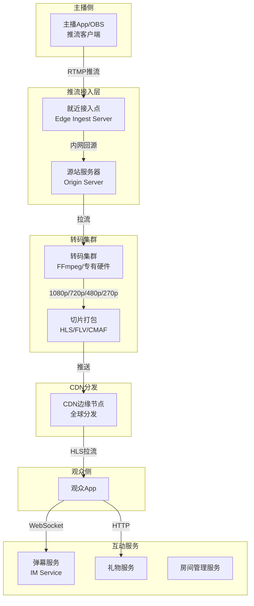
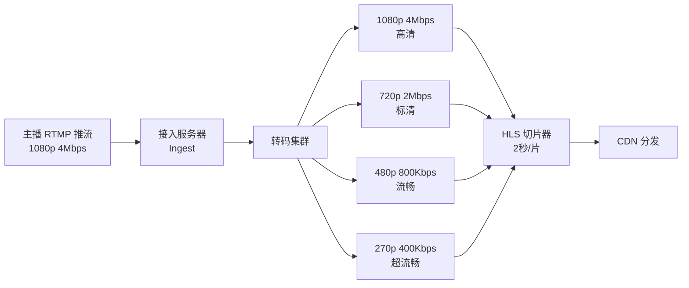
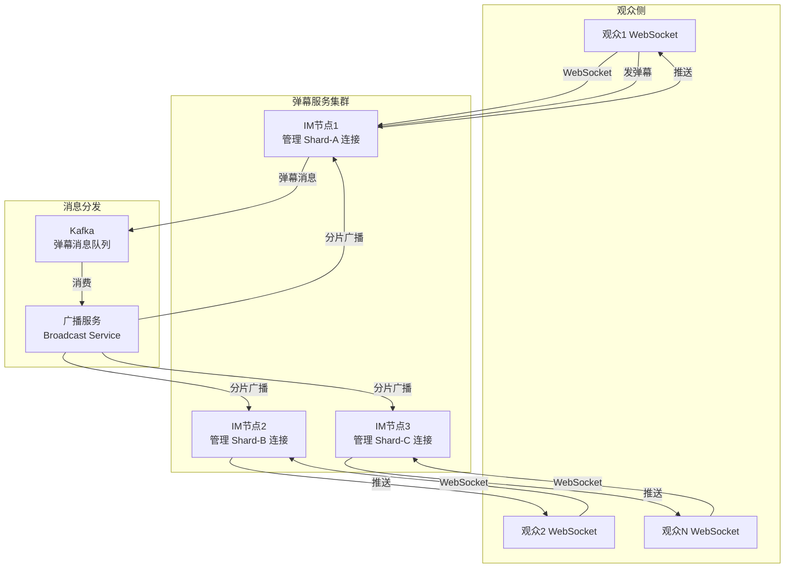
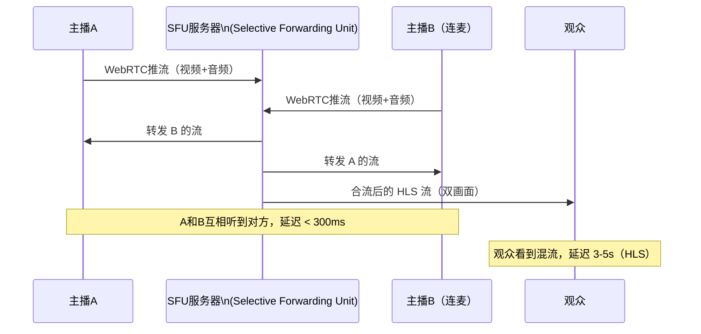
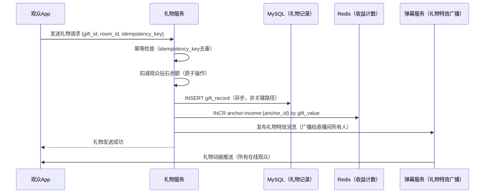
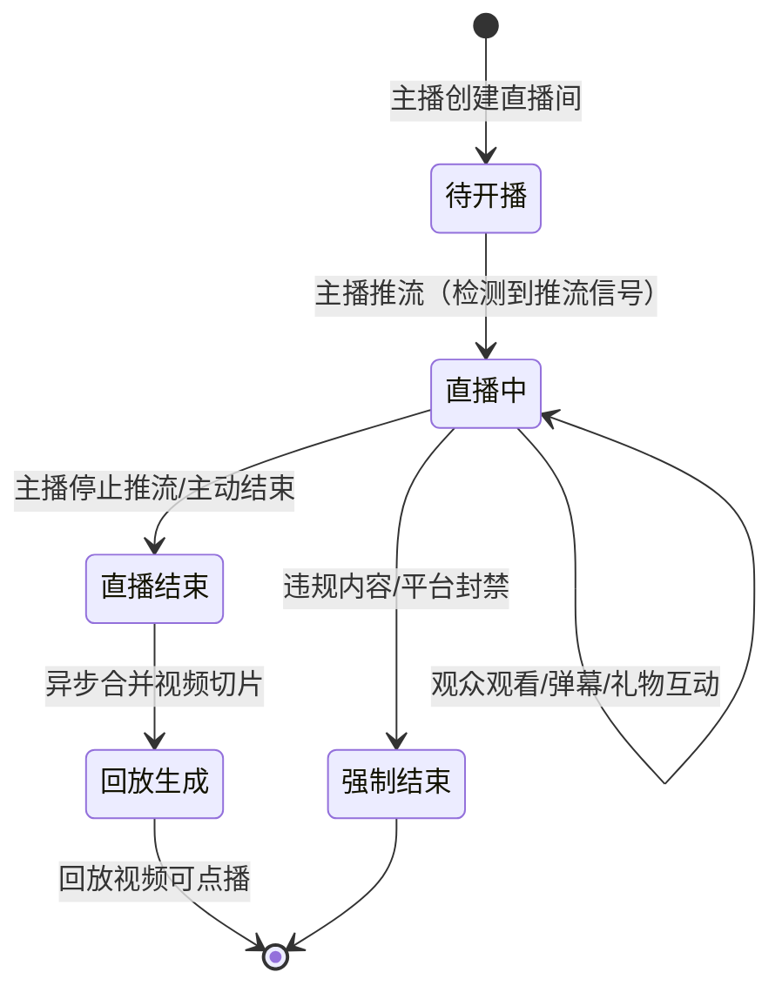

# 抖音直播系统设计

> **面试场景：** 字节跳动 / 快手 / B站 后端高级工程师 / 系统设计面试  
> **高频指数：** ⭐⭐⭐⭐⭐

## 题目背景

**面试官常见提问方式：**

> "请设计一个直播系统。主播可以通过 App 进行直播，观众可以实时观看并发送弹幕、礼物。系统需要支持峰值 5000 万并发观看，某个热门直播间可能有 100 万人同时在线，如何设计？"

**业务背景：**

直播已成为电商、娱乐、教育的核心场景。与点播（VOD）相比，直播面临更极端的技术挑战：
- **超低延迟**：主播说话，观众要在几秒内听到
- **弹幕互动**：百万用户同时发弹幕，如何广播
- **突发流量**：某个事件（世界杯决赛）可能导致瞬间百倍流量增长
- **多码率自适应**：弱网用户不能卡顿，强网用户要高清

**规模量级（2024年数据）：**

- 月直播用户：300,000,000+
- 同时在线主播：100,000+（峰值）
- 峰值并发观看：50,000,000
- 单直播间最大并发：10,000,000（超热门明星直播）
- 主播推流码率：1-6 Mbps（720p/1080p）
- 弹幕并发：热门直播间 10,000 条/秒
- 延迟要求：标准模式 8-15s，互动模式 < 3s，连麦/PK < 500ms

## 关键指标估算

| 指标 | 估算过程 | 结果 |
|------|----------|------|
| 推流带宽 | 100,000 主播 × 3 Mbps | 300 Gbps（上行总带宽） |
| 下行带宽（CDN总出口）| 50M并发观众 × 1.5 Mbps（平均码率） | 75 Tbps（CDN带宽） |
| HLS 切片存储 | 2s 切片，直播延迟窗口保留 60s | 每路流仅缓存 30 个切片 |
| 弹幕消息峰值 | 1M并发观众 × 0.1条/s | 100,000 条/秒（单房间） |
| WebSocket 连接数 | 50M并发观众 | 50M 长连接 |
| 每连接内存占用 | 1 WebSocket ≈ 10KB | 50M × 10KB = 500 GB（需集群化） |

## 高层架构



## 核心设计决策

### 决策1：推流协议选择（RTMP vs SRT）

| 协议 | 延迟 | 弱网表现 | 生态成熟度 | 适用场景 |
|------|------|---------|-----------|---------|
| **RTMP** | 1-3s | 一般，基于TCP重传 | 最成熟，OBS/手机SDK全支持 | 现阶段主流 |
| **SRT** | 0.5-1s | 优秀，有FEC前向纠错 | 逐渐普及 | 抖音2023年起迁移 |
| **WebRTC** | < 200ms | 优秀，QUIC/UDP | 浏览器原生支持 | 连麦、PK |
| **QUIC/HTTP3** | 1-2s | 很好，0-RTT握手 | 探索阶段 | 下一代 |

**美团当前策略（2024年）：**

- 普通直播推流：RTMP（主流SDK支持），逐步迁移到 SRT
- 弱网场景（手机直播）：SRT，配合自研弱网优化（包括 FEC 前向纠错）
- 连麦/PK/互动直播：WebRTC（超低延迟 < 200ms）

**SRT 的弱网优化原理：**

```
RTMP（TCP）弱网下：
  丢包 → TCP重传等待 → 延迟累积 → 视频卡顿

SRT（UDP + ARQ）：
  丢包 → SRT ARQ重传（异步，不阻塞） → 可设置最大延迟预算（latency=500ms）
  超过延迟预算的包直接丢弃（保障实时性，牺牲完整性）
  + FEC（前向纠错）：额外发送冗余包，轻微丢包可本地恢复
```

### 决策2：视频转码与 CDN 分发

**转码架构：**



**HLS 切片策略：**

```
# HLS playlist (m3u8) 示例
#EXTM3U
#EXT-X-VERSION:3
#EXT-X-TARGETDURATION:2
#EXT-X-MEDIA-SEQUENCE:1583

#EXTINF:2.000,
https://cdn.tiktok.com/live/room_123/720p/seg_1583.ts
#EXTINF:2.000,
https://cdn.tiktok.com/live/room_123/720p/seg_1584.ts
#EXTINF:1.500,
https://cdn.tiktok.com/live/room_123/720p/seg_1585.ts
```

- 切片大小：2 秒（在延迟和稳定性之间平衡）
- M3U8 刷新频率：每 1 秒刷新一次 playlist（观众端轮询）
- 延迟来源：编码延迟(~0.5s) + 切片等待(~2s) + M3U8轮询(~1s) + CDN传输(~0.5s) + 播放器缓冲(~4s) ≈ 8-15s

**CDN 分发策略：**

```python
def get_stream_url(room_id, viewer_count, viewer_location):
    if viewer_count < 100:
        # 冷门直播：直接回源拉流（CDN不缓存，节省成本）
        return f"https://origin.tiktok.com/live/{room_id}/playlist.m3u8"
    
    elif viewer_count < 10000:
        # 普通直播：一级 CDN 缓存
        edge_node = cdn.get_nearest_edge(viewer_location)
        return f"https://{edge_node}/live/{room_id}/playlist.m3u8"
    
    else:
        # 热门直播（>1万人）：CDN 多级缓存 + 主动预推切片
        # 通知 CDN 将切片主动推送到全国边缘节点（Push 模式）
        cdn.push_to_all_edges(room_id, latest_segments=5)
        edge_node = cdn.get_nearest_edge(viewer_location)
        return f"https://{edge_node}/live/{room_id}/playlist.m3u8"
```

### 决策3：弹幕系统（百万并发广播）

**核心挑战：** 1 个直播间 100 万用户，每秒 10 万条弹幕，如何广播？

**架构设计：**



**分片广播实现（解决广播爆炸）：**

```python
# 房间分片：将100万观众按连接的IM节点分成N个分片
# 每个IM节点只管理约10万连接（内存可承受，10万×10KB=1GB）

class BroadcastService:
    def broadcast_danmu(self, room_id, message):
        # 获取该房间所有在线分片（IM节点列表）
        shards = redis.smembers(f"room:{room_id}:shards")
        
        # 并行向每个分片广播（分片内的所有连接推送）
        with ThreadPoolExecutor() as executor:
            futures = [
                executor.submit(self.push_to_shard, shard_id, message)
                for shard_id in shards
            ]
        
        # 等待所有分片推送完成（超时100ms后忽略慢节点）
        done, _ = wait(futures, timeout=0.1)
    
    def push_to_shard(self, shard_id, message):
        # 向该分片下所有WebSocket连接推送
        im_node = shard_to_node[shard_id]
        im_node.broadcast_all(message)

# 弹幕采样（高峰期保护）：100万用户，弹幕量过大时降低展示频率
def sample_danmu(danmu_list, max_per_second=30):
    """用户端最多显示30条/秒，超出部分随机采样"""
    if len(danmu_list) <= max_per_second:
        return danmu_list
    return random.sample(danmu_list, max_per_second)
```

**弹幕乱序问题：** 分布式环境下，弹幕消息可能乱序到达客户端。使用序列号 + 客户端缓冲（100ms）做排序，容忍小范围乱序。

### 决策4：延迟策略（标准模式 vs 互动模式）

| 模式 | 延迟目标 | 协议 | 适用场景 |
|------|---------|------|---------|
| 标准直播 | 8-15s | HLS（2s切片）| 普通娱乐直播，带宽友好 |
| 低延迟直播 | 3-5s | CMAF/LL-HLS（0.5s切片）| 互动较多的直播 |
| 超低延迟 | < 3s | WebRTC / QUIC | 电商直播、讲解类直播 |
| 连麦/PK | < 500ms | WebRTC P2P | 双主播互动 |

**各协议端到端延迟对比（主播画面 → 观众屏幕）：**

| 协议 | 视角延迟 | 原理 | 适用场景 |
|------|---------|------|---------|
| **HLS**（2s 切片，3 切片缓冲） | **6-15 秒** | 切片上传 → CDN 分发 → 播放器缓冲 | 普通直播（画质优先） |
| **LL-HLS**（200ms partial segment） | **1-3 秒** | 部分切片推送，减少缓冲窗口 | 互动直播（平衡延迟/画质） |
| **RTMP 直接拉流**（无切片） | **1-3 秒** | PC 端直接 RTMP 拉流，无 HLS 切片延迟 | PC 端直播（Flash 时代遗留） |
| **WebRTC**（P2P / SFU） | **< 500 毫秒** | UDP 传输，无缓冲，容忍丢包 | PK 连麦、互动答题 |
| **SRT**（Secure Reliable Transport） | **< 1 秒** | UDP + ARQ 重传，弱网友好 | 跨国推流、弱网场景 |

> **面试技巧**：被问"如何降低直播延迟"时，按场景回答：普通观看用 LL-HLS（1-3s，画质好）；PK/连麦用 WebRTC（< 500ms，允许画质下降）；跨国推流用 SRT（弱网稳定性优先）。

**抖音实际方案**：普通直播用 LL-HLS（约 2-4s），连麦/PK 用 WebRTC（< 500ms），弱网推流改用 SRT（比 RTMP 丢包恢复快 3-5 倍）。

**低延迟直播（LL-HLS）实现：**

```
标准 HLS：切片2秒 → M3U8轮询间隔1秒 → 缓冲4秒 = 约8秒延迟

LL-HLS（Low Latency HLS）：
- 切片缩短到 0.5s（Partial Segment）
- 使用 HTTP/2 Server Push 推送最新切片（避免轮询）
- 播放器缓冲降低到 1-2 秒
- 总延迟 ≈ 2-4 秒
```

**WebRTC 互动直播架构（连麦）：**



### 决策5：礼物系统

**礼物流程设计：**



**幂等保证（防重复扣费）：**

```python
def send_gift(user_id, gift_id, room_id, idempotency_key):
    # 幂等检查：同一 key 只处理一次
    lock_key = f"gift:idem:{idempotency_key}"
    
    # SET NX EX：原子操作，获取锁
    if not redis.set(lock_key, "processing", nx=True, ex=60):
        # 已处理过，返回之前的结果
        return redis.get(f"gift:result:{idempotency_key}")
    
    try:
        # 扣减余额（Lua 脚本保证原子性）
        lua_script = """
        local balance = tonumber(redis.call('GET', KEYS[1]))
        local cost = tonumber(ARGV[1])
        if balance >= cost then
            redis.call('DECRBY', KEYS[1], cost)
            return 1
        else
            return 0
        end
        """
        success = redis.eval(lua_script, 1, f"user:balance:{user_id}", gift_cost)
        
        if success:
            # 记录礼物
            db.insert_gift_record(user_id, gift_id, room_id)
            redis.incr(f"anchor:income:{anchor_id}", gift_value)
            redis.set(f"gift:result:{idempotency_key}", "success", ex=3600)
            return "success"
        else:
            redis.set(f"gift:result:{idempotency_key}", "insufficient_balance", ex=3600)
            return "insufficient_balance"
    finally:
        # 不删除锁，等自然过期（避免重入）
        pass

**礼物发送幂等设计（防重复扣费）：**

```python
# 客户端带唯一幂等 key（UUID，本地生成）
def send_gift(user_id: str, room_id: str, gift_id: str, idempotency_key: str):
    # 原子检查 + 标记（Lua 脚本）
    lua_script = """
    local key = KEYS[1]
    if redis.call('EXISTS', key) == 1 then
        return redis.call('GET', key)  -- 返回原始结果，幂等
    end
    redis.call('SETEX', key, 86400, ARGV[1])  -- 标记已处理，TTL 24h
    return nil  -- 需要处理
    """
    result = redis.eval(lua_script, 1, f"gift_idem:{idempotency_key}", "processed")
    if result is not None:
        return json.loads(result)  # 幂等：返回已有结果
    
    # 执行礼物扣费和特效播放
    deduct_coins(user_id, gift_cost(gift_id))
    broadcast_gift_effect(room_id, gift_id)
    return {"status": "success"}
```

**场景**：用户点击发送礼物后，App 因网络超时未收到响应 → 自动重试 → 服务端用 `idempotency_key` 检测到重复请求 → 返回第一次的结果，不重复扣费。
```

### 决策6：高峰场景——10万人同时进入直播间

**场景：** 某明星突然在直播间发布重大公告，10 万人在 5 秒内涌入。

**挑战：**
1. 弹幕服务：10 万新连接瞬间建立
2. 弹幕广播：10 万人 × 10 条/秒 = 100 万条/秒广播量爆炸
3. 礼物：大量用户同时发礼物（并发扣费）

**解决方案：**

```python
# 问题1：连接峰值 → WebSocket 连接预建立 + 连接限速
def on_viewer_join(room_id, user_id):
    # 新观众接入时，分配到负载最低的 IM 节点（不允许单节点超过10万连接）
    im_node = load_balancer.get_least_loaded_im_node()
    
    # 连接速率限制：直播间每秒最多接受 5000 个新连接
    rate_limiter.check(f"room:{room_id}:join_rate", limit=5000, window=1)
    
    websocket.connect(im_node)

# 问题2：弹幕广播爆炸 → 弹幕采样 + 虚拟弹幕
def handle_danmu_flood(room_id, danmu_list):
    # 真实弹幕采样：展示 1/100（100条里随机抽1条显示）
    sampled_real = random.sample(danmu_list, max(1, len(danmu_list) // 100))
    
    # 虚拟弹幕填充：用预生成的高质量弹幕填满屏幕（让用户感觉热闹）
    virtual_danmu = danmu_generator.generate(
        room_context=room_id,
        count=30 - len(sampled_real)
    )
    
    return sampled_real + virtual_danmu

# 问题3：礼物并发 → Redis Lua 脚本原子扣减（见上方幂等实现）
```

## 详细设计

### 数据模型

**直播间表（live_room）**

```sql
CREATE TABLE `live_room` (
  `room_id`       BIGINT      NOT NULL,
  `anchor_id`     BIGINT      NOT NULL COMMENT '主播用户ID',
  `title`         VARCHAR(200),
  `status`        TINYINT     NOT NULL COMMENT '0:未开播 1:直播中 2:已结束',
  `stream_key`    VARCHAR(64) NOT NULL COMMENT '推流密钥（唯一）',
  `push_url`      VARCHAR(200) COMMENT '推流地址',
  `pull_url_hls`  VARCHAR(200) COMMENT 'HLS拉流地址',
  `viewer_count`  INT         DEFAULT 0 COMMENT '当前在线观看人数',
  `peak_viewer`   INT         DEFAULT 0 COMMENT '历史峰值在线人数',
  `started_at`    DATETIME,
  `ended_at`      DATETIME,
  `created_at`    DATETIME    NOT NULL,
  PRIMARY KEY (`room_id`),
  UNIQUE KEY `uk_stream_key` (`stream_key`),
  INDEX `idx_anchor` (`anchor_id`, `status`)
) ENGINE=InnoDB;
```

**弹幕消息（存储在 Kafka + 冷存储 HBase）**

```json
{
  "msg_id": "danmu_1234567890",
  "room_id": "room_001",
  "user_id": "user_abc",
  "user_nickname": "抖音用户999",
  "content": "主播好帅！",
  "type": "text",
  "color": "#FFFFFF",
  "timestamp": 1716800000000,
  "seq": 158392       // 房间内消息序列号，用于排序
}
```

**礼物记录表**

```sql
CREATE TABLE `gift_record` (
  `gift_record_id`  BIGINT      NOT NULL,
  `room_id`         BIGINT      NOT NULL,
  `sender_id`       BIGINT      NOT NULL COMMENT '送礼用户',
  `anchor_id`       BIGINT      NOT NULL COMMENT '主播',
  `gift_id`         INT         NOT NULL COMMENT '礼物类型',
  `gift_count`      INT         DEFAULT 1 COMMENT '连刷数量',
  `diamond_cost`    INT         NOT NULL COMMENT '消耗钻石数',
  `idempotency_key` VARCHAR(64) NOT NULL COMMENT '幂等key',
  `created_at`      DATETIME(3) NOT NULL,
  PRIMARY KEY (`gift_record_id`),
  UNIQUE KEY `uk_idempotency` (`idempotency_key`),
  INDEX `idx_anchor_time` (`anchor_id`, `created_at`)
) ENGINE=InnoDB;
```

### 直播间生命周期



### 主播推流鉴权

```python
# 生成推流地址（含防盗链Token）
def generate_push_url(room_id, anchor_id):
    stream_key = uuid.uuid4().hex
    
    # 推流地址防盗链：token = HMAC(stream_key + expire_time + secret)
    expire_time = int(time.time()) + 86400  # 24小时有效
    token_str = f"{stream_key}:{expire_time}"
    token = hmac.new(SECRET_KEY, token_str.encode(), sha256).hexdigest()
    
    push_url = f"rtmp://push.tiktok.com/live/{stream_key}?token={token}&expire={expire_time}"
    pull_url_hls = f"https://pull.cdn.tiktok.com/live/{stream_key}/playlist.m3u8"
    
    # 存储 stream_key → room_id 映射（接入服务器验证用）
    redis.setex(f"stream:{stream_key}:room", 86400, room_id)
    
    return push_url, pull_url_hls
```

## 踩过的坑 / 生产经验

### 坑1：热门直播间弹幕广播 OOM

**现象：** 某明星开播，直播间在 10 分钟内聚集 200 万观众，单个弹幕服务节点需要向 20 万 WebSocket 连接广播，每秒 5 万条弹幕。节点内存不足（每个 goroutine/connection 占内存），弹幕服务节点 OOM 崩溃，整个直播间弹幕停止。

**解决方案：**

1. **限制单节点连接上限**：每个 IM 节点最多管理 10 万 WebSocket 连接，超出后拒绝新连接（新连接分配到其他节点）
2. **异步广播 + 发送队列**：每个连接有独立的发送 Channel（Go channel），主广播 goroutine 往 channel 塞消息，单独的 goroutine 从 channel 读并发送；channel 满了直接丢弃（弹幕丢几条可接受）
3. **弹幕限流**：直播间弹幕 > 5000条/s 时开始采样（每 10 条发 1 条），防止广播量过大

### 坑2：直播延迟随时间增长

**现象：** 直播开始时延迟 8 秒，1 小时后延迟增长到 25 秒。

**根因：** 播放器的缓冲区持续累积。HLS 播放器为了流畅播放，会维护一个缓冲区（默认 10-30 秒）。当网络抖动时，播放器暂停拉取但继续播放缓冲内容，网络恢复后缓冲区追不上最新切片，导致延迟越来越大。

**解决方案：**

1. **客户端自适应延迟控制**：播放器每分钟检查当前播放位置与 M3U8 最新切片的距离（延迟），若 > 20 秒则自动跳到最新切片（可能有少量画面跳跃，但用户可接受）
2. **M3U8 中加入时间戳提示**：服务端在 M3U8 中插入 `EXT-X-PROGRAM-DATE-TIME`，播放器可以准确知道当前播放时刻与实时的差距

### 坑3：推流断流后的"僵尸直播间"

**现象：** 主播网络断开，推流中断。但直播间状态仍显示"直播中"，观众仍在等待，CDN 上最后几个切片被反复请求。用户抱怨"直播卡了很久"。

**解决方案：**

1. **接入服务器心跳检测**：推流超过 30 秒无数据包 → 判定断流，立即通知房间管理服务更新状态
2. **M3U8 加入 `EXT-X-ENDLIST`**：断流后立即在 M3U8 末尾写入结束标记，播放器收到后停止轮询并提示用户"直播已中断"
3. **主播重连机制**：断流后 5 分钟内，主播重新推流可以自动续播（不需要重新创建直播间），观众可以继续观看（播放器轮询新切片）

### 坑4：连麦延迟过高（PK 体验差）

**现象：** 两个主播 PK 时，主播 A 说一句话，主播 B 3 秒后才听到，PK 节奏完全乱了。

**根因：** 连麦使用 RTMP 中转（走转码服务器），延迟叠加（推流 1s + 转码 0.5s + 分发 1s = 2.5s+）。

**解决方案：改为 WebRTC P2P（经 TURN/SFU 中转）**

```
连麦架构（改进后）：
  主播A →(WebRTC)→ SFU服务器 →(WebRTC)→ 主播B
  
  SFU（Selective Forwarding Unit）：
  - 不做转码，直接转发RTP包（延迟极低）
  - 主播 A 和 B 之间通过 SFU 互通，延迟 < 200ms
  - 观众看到的是 SFU 混流后的 HLS 流（延迟 3-5s，可接受）
```

## 扩展考点

### 追问方向

**Q：如何设计直播回放（VOD）功能？**

直播结束后，将 HLS 切片拼接为完整视频文件：

```python
def generate_vod(room_id):
    # 从 CDN/对象存储 拉取所有 .ts 切片（按序列号排序）
    segments = storage.list_segments(room_id, sorted=True)
    
    # 用 FFmpeg 拼接切片为 MP4（使用 concat demuxer）
    ffmpeg_cmd = f"ffmpeg -f concat -safe 0 -i segments.txt -c copy output.mp4"
    
    # 生成多码率 MP4 + 上传到对象存储 + 更新 VOD 记录
    vod_url = upload_to_oss(output_mp4)
    db.update_room(room_id, vod_url=vod_url)
```

**Q：如何做直播内容的实时违规检测？**

1. **视频帧抽样审核**：每秒抽取 1 帧，发送到 CV 模型检测违规内容（涉黄/暴力/政治）
2. **语音转文字**：实时 ASR（自动语音识别），对转录文本做关键词过滤
3. **检测到违规**：自动封断推流 + 封禁直播间（< 3 秒响应），通知人工复查

**Q：如何应对 DDoS 攻击（大量虚假观众连接耗尽 WebSocket 服务器资源）？**

1. **连接鉴权**：建立 WebSocket 连接时必须携带有效 Token（JWT），无效连接直接拒绝
2. **IP 限速**：同一 IP 最多建立 100 个 WebSocket 连接（正常用户不会有多个连接）
3. **CDN 防护**：在 CDN 层做 DDoS 清洗，过滤异常流量

### 边界 Case

- **主播同时开播两个平台（多路推流）**：合法行为，每次开播都有独立的 stream_key，互不影响
- **观众跨时区**：HLS 是无状态协议，观众拉流时 CDN 返回最新切片，跨时区只影响 CDN 选节点
- **直播中突然断网（观众侧）**：客户端有播放缓冲（10-30s），短暂断网可继续播放；重连后自动拉取最新 M3U8

### 演进路径

```
v1.0：RTMP推流 + HLS分发（简单可靠）
  ↓
v2.0：多码率转码 + 自适应码率（ABR）
  ↓
v3.0：WebSocket弹幕 + 礼物互动
  ↓
v4.0：WebRTC连麦/PK（超低延迟互动）
  ↓
v5.0：SRT推流 + LL-HLS（全链路低延迟优化）
  ↓
v6.0：AI实时审核 + 弹幕智能过滤 + 实时翻译弹幕
```

### 监控与告警指标

| 指标 | 类型 | 告警阈值 | 说明 |
|------|------|---------|------|
| `stream_ingest_failure_rate` | Counter | > 0.1% 触发告警 | 推流接入失败率，影响主播开播 |
| `cdn_cache_hit_rate` | Counter | < 90% 触发告警 | CDN 切片缓存命中率，低于阈值回源压力增大 |
| `viewer_buffering_ratio` | Counter | > 2% 触发告警 | 观众卡顿率（缓冲时间 / 总播放时间），直接影响用户体验 |
| `danmu_broadcast_latency_ms` | Histogram | P99 > 500ms 触发告警 | 弹幕广播延迟，大直播间分片广播延迟监控 |
| `gift_processing_latency_ms` | Histogram | P99 > 200ms 触发告警 | 礼物到账延迟，影响主播收益体验 |
| `concurrent_viewers_per_room` | Gauge | > 100万 触发弹幕分片扩容 | 单直播间并发观看数，超阈值触发弹幕分片增加 |

### 弹幕服务不可用时的降级方案

- **单节点故障**：客户端 WebSocket 重连到其他节点，新节点不同步历史弹幕（仅展示重连后的新弹幕）
- **弹幕服务全量不可用**：直播流正常播放（与弹幕解耦），前端展示「弹幕暂时不可用」提示
- **百万并发直播间弹幕洪峰**：服务端采样（只转发 1/50 弹幕），客户端本地生成虚拟飘过的弹幕填充视觉效果

## 面试评分维度

| 维度 | 基础分（60分） | 加分项（80+分） | 满分项（100分） |
|------|---------------|----------------|----------------|
| **推流链路** | 知道 RTMP 推流和 HLS 分发 | 说出多码率转码和 ABR | 分析 RTMP vs SRT vs WebRTC 的延迟和弱网差异 |
| **CDN 分发** | 知道用 CDN | 说出热门直播主动预推切片 | 分析冷门/热门直播的不同 CDN 策略，分析带宽成本 |
| **弹幕系统** | 知道用 WebSocket | 说出分片广播解决单节点瓶颈 | 弹幕采样+虚拟弹幕+百万并发下的完整方案 |
| **互动设计** | 提到礼物需要幂等 | Lua 脚本原子扣减设计 | 完整的礼物流程（鉴权+扣费+广播+收益统计） |
| **延迟策略** | 知道 HLS 有延迟 | 说出不同场景的延迟要求 | LL-HLS / WebRTC SFU 连麦架构 |
| **生产经验** | 了解弹幕高并发挑战 | 提到连接数限制和采样 | 结合 OOM 故障/延迟累积/僵尸直播间等实际案例 |
