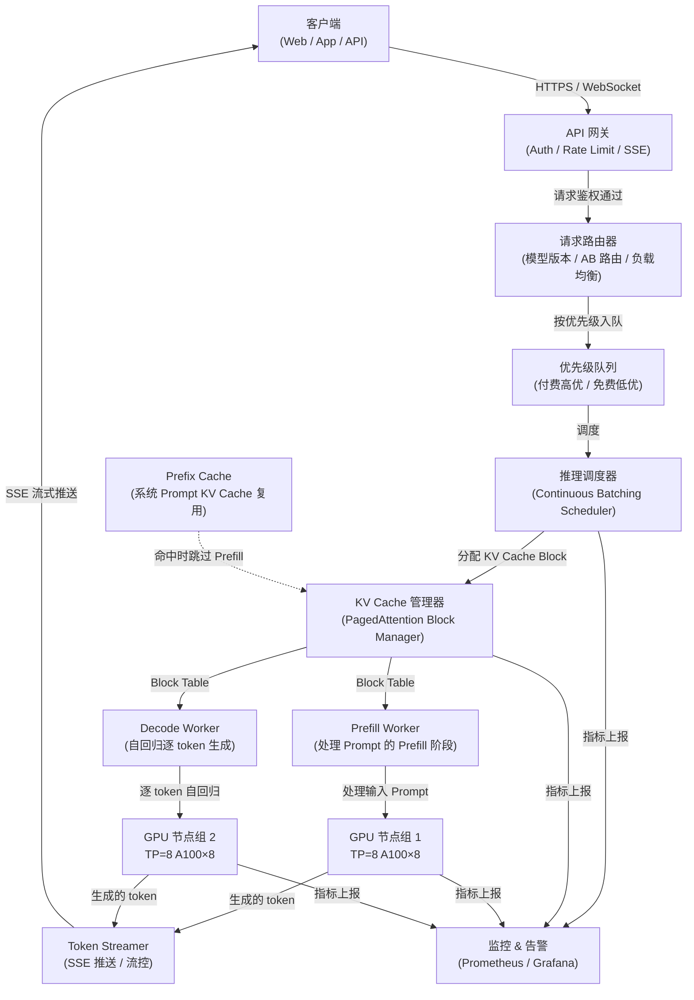

# 大模型推理服务设计

> **面试场景：** 字节跳动（豆包）/ 阿里云（千问）/ 百度（文心）/ 腾讯（混元）AI 基础设施岗位系统设计面试  
> **高频指数：** 🔥 必考题（AI 基础设施 / MLSys 岗）

## 题目背景

**面试官提问方式：**

> "请设计一个能支持 1 亿 DAU 的大模型对话服务，类似 ChatGPT / 豆包，要求 P99 首 Token 延迟 < 2s，P99 完整响应 < 30s，支持流式输出（SSE）。"

**业务背景：**

大模型推理服务是当前 AI 公司核心基础设施，与传统 Web 服务有本质区别：计算高度集中在 GPU、单次请求延迟以秒计、显存是比 CPU 内存稀缺得多的资源、请求的计算量随输出长度动态增长。本题考察候选人是否真正理解 LLM 推理系统的瓶颈所在，以及如何在延迟、吞吐量和成本之间做出合理的工程权衡。

**规模量级：**

- 日活跃用户（DAU）：1 亿
- 峰值并发对话：50 万（DAU × 5% 活跃比例）
- 单次对话平均规模：1000 input tokens + 500 output tokens
- 目标模型：70B 参数（如 Qwen-72B、LLaMA-3-70B）
- P99 首 Token 延迟（TTFT）：< 2s
- P99 完整响应延迟（E2E）：< 30s
- 吞吐目标：峰值 5 亿 tokens/分钟

---

## 关键指标估算

### 并发与吞吐

```
并发对话数 = DAU × 活跃比例
           = 1 亿 × 5% = 50 万并发

每次对话输出速率（出 token 速率）≈ 200 tokens/s（对用户体验友好的速率）
总 token 输出需求 = 50 万 × 200 = 1000 亿 tokens/s
```

> 注：这里的 1000 亿 tokens/s 是峰值理论上界，实际每个请求的出 token 速率受 batch size 影响，单 GPU 并不是每个请求都在同时生成。

### 显存估算（以 A100 80GB 为例）

| 组成部分 | 计算方式 | 占用 |
|---------|---------|------|
| 模型权重（BF16） | 70B × 2 bytes | ~140 GB |
| KV Cache（单请求，2048 context） | 约 0.5 MB/token × 2048 | ~1 GB/请求 |
| Activation / 临时张量 | 约 10-15 GB | ~15 GB |

**结论：**
- 单张 A100 80GB 装不下 70B 权重（需要至少 2 张）
- 生产实践：**TP=8（单节点 8 卡）** 并行，每卡存 140/8 = 17.5 GB 权重，剩余 ~62 GB 用于 KV Cache
- 若使用 INT4 量化：权重压缩至 ~35 GB，单节点 8 张 A100 可存权重 + 大量 KV Cache

### GPU 规模估算

```
单 A100（TP=8，BF16）对 70B 模型吞吐 ≈ 500 tokens/s（decode 阶段）
峰值需求 ≈ 50 万并发 × 30 tokens/s（平均出 token 速率）
        = 1.5 × 10^10 tokens/s
所需 A100 节点数（8 卡/节点）≈ 1.5×10^10 / 500 / 8 ≈ 3750 节点

保守估算（含冗余 + prefill 负载 + 量化优化）：约需 2000~4000 张 A100
```

**A100 单卡 Decode 吞吐推导（内存带宽瓶颈分析）：**

Decode 阶段是**内存带宽瓶颈**（Memory-Bandwidth Bound），而非算力瓶颈，原因是每个 token 生成步骤需要将全部模型权重从 HBM 加载到 SRAM 一次。

| 参数 | 数值 |
|------|------|
| A100 HBM2e 带宽 | 2 TB/s |
| 70B 模型 BF16 权重大小 | 70B × 2 bytes = **140 GB** |
| TP=8 时每卡持有权重 | 140 GB ÷ 8 = **17.5 GB** |
| 每卡单步加载权重耗时 | 17.5 GB ÷ 2 TB/s ≈ **8.75 ms** |
| 单步单卡吞吐（batch=1） | 1 token ÷ 8.75 ms ≈ **114 tokens/s** |
| batch=16（均摊加载开销） | 114 × 16 ÷ 1 ≈ **1,824 tokens/s（8卡节点）** |
| batch=64（实际常见配置） | 约 **4,000-5,000 tokens/s（8卡节点）** |

> **面试技巧**：当面试官问"为什么 GPU 推理是内存带宽瓶颈"时，关键答案是：**推理时矩阵乘法的 arithmetic intensity（FLOP/Byte）远低于 A100 的 ridge point（约 208 FLOP/Byte）**，因此性能由 HBM 带宽决定，而非 TFLOPS。这也是为什么 Continuous Batching 可以提升吞吐——它提高了 arithmetic intensity，让 GPU 更接近算力瓶颈。

---

## 高层架构



**关键路径说明：**

1. **Prefill 阶段**：处理整个 prompt，一次前向传播，输出第一个 token（计算密集，延迟决定 TTFT）
2. **Decode 阶段**：每步生成一个 token，需要访问所有历史 KV Cache（内存带宽密集，决定出 token 速率）
3. **Prefill/Decode 分离**：两个阶段计算特征截然不同，可以部署到不同硬件，分别优化

---

## 核心设计决策

### 决策 1：KV Cache 内存管理 — PagedAttention

**问题根源：**

传统推理框架为每个请求预分配连续的最大 context 长度显存（如 2048 tokens），但实际请求长度参差不齐，导致严重的内存碎片和浪费：

```
传统静态分配示意：
[请求A: 200 tokens 实际 | 1848 tokens 空洞] = 2048 block
[请求B: 500 tokens 实际 | 1548 tokens 空洞] = 2048 block
GPU 内存利用率：仅 30~40%
```

**PagedAttention 解决方案（vLLM 核心创新）：**

将 KV Cache 切成固定大小的 **block**（默认每 block = 16 tokens），用 block_table 做逻辑 → 物理 block 的动态映射，类比操作系统的虚拟内存分页机制：

```python
# block_table 结构示意（每行是一个请求的映射）
# 逻辑 block 索引 → 物理 block 编号
block_table = {
    "req_001": [block_42, block_17, block_89],   # 3 个逻辑 block → 3 个物理 block
    "req_002": [block_3,  block_55],              # 2 个逻辑 block → 2 个物理 block
    "req_003": [block_42, block_61, block_7, block_23],  # block_42 与 req_001 共享（Prefix Cache）
}

# 物理 block 池（统一管理，按需分配）
free_blocks = [block_0, block_1, ..., block_N]

def allocate_block(req_id: str) -> int:
    """从空闲池分配一个物理 block 给请求"""
    if not free_blocks:
        # 触发 preemption：将低优先级请求的 block swap 到 CPU
        _preempt_low_priority_request()
    phys_block = free_blocks.pop()
    block_table[req_id].append(phys_block)
    return phys_block
```

**效果对比：**

| 指标 | 传统静态分配 | PagedAttention |
|------|------------|----------------|
| GPU 显存利用率 | 30~40% | 85~92% |
| 同等显存并发量 | 基准 | 提升 2.5~3x |
| 内存碎片率 | 高（每请求最多浪费 1 block） | < 4%（仅最后 1 block 有碎片） |
| 实现复杂度 | 低 | 中（需自定义 CUDA Kernel） |

---

### 决策 2：Continuous Batching（连续批处理）

**传统静态 Batching 的问题 — Convoy Effect（车队效应）：**

```
静态批处理：等一批请求全部完成才处理下一批
时间轴：
  Batch1: [req_A(200 tokens), req_B(2000 tokens), req_C(150 tokens)]
          │←── req_C 完成，但必须等 req_B 跑完 ──→│ 下一批才开始
  Batch2:                                                [req_D, req_E, req_F]
  req_D 等待时间 = req_B 的生成时间（可能长达 20s）
```

**Continuous Batching 的核心思想：**

在每个 decode step（每生成 1 个 token）后，检查哪些序列已输出 EOS（结束符）或达到最大长度，立即将新请求插入 batch 填补空位：

```
连续批处理：
Step 1: [req_A, req_B, req_C]   ← 初始 batch，大小=3
Step 2: [req_A, req_B, req_C]   ← req_C 生成结束，释放 slot
Step 3: [req_A, req_B, req_D]   ← req_D 立即进入（iteration-level scheduling）
Step 4: [req_A, req_B, req_D]
...
GPU 始终在满负荷运行，没有空泡
```

**三种 Batching 策略对比：**

| 策略 | 延迟 | 吞吐量 | GPU 利用率 | 实现难度 |
|------|------|--------|-----------|---------|
| 静态 Batching | 高（受最长请求拖累） | 低 | 30~50% | 低 |
| 动态 Batching（按超时聚合） | 中（有等待窗口） | 中 | 50~70% | 中 |
| Continuous Batching | 低（无等待） | 高（2~4x 提升） | 80~95% | 高 |

---

### 决策 3：模型并行策略 — TP vs PP

70B 模型无法放入单张 GPU，必须使用模型并行。两种主要策略各有权衡：

**张量并行（Tensor Parallelism，TP）：**

将单个矩阵乘法（如 Attention 的 Q/K/V 投影，FFN 的权重矩阵）按列/行拆分到多卡，每步计算后通过 All-Reduce 聚合结果：

```
输入 X → [GPU0: W_col_0 | GPU1: W_col_1 | ... | GPU7: W_col_7]
         每卡计算局部结果 Y_i = X × W_col_i
         All-Reduce(Y_0, Y_1, ..., Y_7) → 完整输出 Y
```

- 优点：**延迟低**，每层同步一次，适合 latency-sensitive 场景
- 缺点：每层都有 All-Reduce 通信开销，TP=8 时 All-Reduce 可占推理延迟 20~30%；必须在高带宽互联（NVLink）节点内使用

**流水线并行（Pipeline Parallelism，PP）：**

将模型按层（layer）切割，不同节点处理不同层，前一节点的输出是后一节点的输入：

```
节点0：Layer 0~19   节点1：Layer 20~39   节点2：Layer 40~59   节点3：Layer 60~79
       ↓                   ↓                    ↓                    ↓
      (发送激活值) ──→    (发送激活值) ──→    (发送激活值) ──→    输出 token
```

- 优点：节点间通信量少（只传 activation），适合跨节点（InfiniBand）
- 缺点：**气泡问题（bubble）**，decode 阶段 batch_size=1 时流水线利用率极低

**并行策略对比：**

| 策略 | 推理延迟 | 吞吐量 | 通信依赖 | 适用场景 |
|------|---------|--------|---------|---------|
| TP（张量并行） | 低 | 中 | NVLink 高带宽 | 单节点内，latency-first |
| PP（流水线并行） | 中（有 bubble） | 高 | InfiniBand 跨节点 | 跨节点，throughput-first |
| TP + PP 混合 | 低~中 | 高 | NVLink + IB | 生产主流（字节/阿里方案） |
| DP（数据并行） | 不影响单请求 | 线性扩展 | 权重同步 | 模型复制，处理不同请求 |

**生产实践（字节/阿里主流方案）：**

- 单节点内 TP=8（8 张 A100，NVLink 高带宽互联，带宽 ~600 GB/s）
- 跨节点 PP=N（多节点流水线，InfiniBand 400 Gbps 互联）
- 多个 TP+PP 实例做数据并行（DP），横向扩展吞吐

---

### 决策 4：量化（Quantization）

降低模型显存占用，使更大 batch size 成为可能，同时提升推理速度（降低显存带宽需求）。

**各精度对比：**

| 精度 | 显存（70B） | 精度损失（vs FP16 基准） | 推理速度提升 | 典型方案 |
|------|-----------|----------------------|------------|---------|
| BF16（基准） | ~140 GB | 0%（基准） | 1x | 原始权重 |
| INT8 | ~70 GB | < 1% | 1.2~1.5x | LLM.int8()，bitsandbytes |
| INT4 | ~35 GB | 2~3% | 1.5~2x | GPTQ、AWQ、ExllamaV2 |
| FP8 | ~70 GB | < 0.5% | 1.5~1.8x | H100 原生支持，精度更好 |

**生产策略：**

- **INT4（AWQ/GPTQ）**：70B 模型压缩至 ~35 GB，单节点 8 张 A100 总显存 640 GB，权重仅占 35 GB，留出大量空间给 KV Cache，可支持更大并发
- AWQ（Activation-Aware Weight Quantization）优于 GPTQ，在相同 bit 数下精度更高
- 关键 layer（如 Attention 的 Q/K 投影）可保留 INT8，其余 FFN 用 INT4，混合精度平衡精度与速度

---

### 决策 5：推测解码（Speculative Decoding）

**核心思想：**

LLM decode 阶段每步只能生成 1 个 token，GPU 利用率很低（大量时间在等内存 IO）。推测解码通过引入一个轻量级 draft model（如 7B）预测多个候选 token，再由大模型（70B target model）并行验证，一次前向传播验证多个 token：

```
Step 1: Draft model（7B）预测 4 个候选 token: [token_a, token_b, token_c, token_d]
Step 2: Target model（70B）并行验证 4 个 token（一次前向传播）
Step 3: 从左到右接受符合条件的 token，遇到第一个不符合的截断
        若 [token_a ✓, token_b ✓, token_c ✗]
        → 接受 token_a, token_b，target model 重新采样 token_c'
Step 4: 本轮净输出：2~3 个 token（而非传统 1 个）
```

**效果与适用场景：**

| 场景 | Draft Model 接受率 | 速度提升 |
|------|-----------------|---------|
| 代码补全（高重复性） | 75~85% | 3~4x |
| 文档摘要 | 60~70% | 2~3x |
| 创意写作（高随机性） | 40~50% | 1.2~1.5x |
| 指令跟随（通用对话） | 60~75% | 2~3x |

**代价与注意事项：**

- 需要额外显存存放 draft model（7B × 2 bytes ≈ 14 GB）
- draft model 与 target model 必须绑定版本发布（见踩坑经验）
- 当接受率 < 50% 时，推测解码可能带来负收益（额外计算 > 收益）

---

### 决策 6：多租户与 SLO 调度

**优先级队列设计：**

```
付费用户（VIP）  →  高优先级队列  →  SLO: TTFT < 500ms
免费用户（标准）  →  低优先级队列  →  SLO: TTFT < 3s
内部/测试流量    →  最低优先级    →  尽力而为
```

**抢占机制（Priority Preemption）：**

当高优先级请求到来而显存不足时，可以：
1. 将低优先级请求的 KV Cache Block 换出到 CPU 内存（swap out）
2. 暂停低优先级请求的 decode，等显存释放后恢复（recompute）
3. 直接终止最低优先级请求（极端情况）

**调度算法：**

```python
# 修复：抢占低优先级后必须重新调用 can_allocate，避免在显存仍不足时将请求加入 batch 导致 OOM
class PriorityScheduler:
    def schedule_next_batch(self) -> List[Request]:
        batch = []
        while not self.high_priority_queue.empty():
            req = self.high_priority_queue.peek()
            if self.kv_manager.can_allocate(req):
                self.high_priority_queue.pop()
                batch.append(req)
            else:
                # 尝试抢占低优先级请求的 KV Cache
                freed = self._preempt_low_priority(req.estimated_kv_blocks)
                if freed and self.kv_manager.can_allocate(req):  # 修复：抢占后重新检查
                    self.high_priority_queue.pop()
                    batch.append(req)
                else:
                    break  # 即使抢占后仍不足，停止调度（避免死锁）
        # 用剩余空间调度低优先级请求
        while not self.low_priority_queue.empty():
            req = self.low_priority_queue.peek()
            if self.kv_manager.can_allocate(req):
                self.low_priority_queue.pop()
                batch.append(req)
            else:
                break
        return batch
```

---

## 详细设计

### 流式输出（SSE — Server-Sent Events）

大模型每生成 1 个 token 立即推送到客户端，实现"逐字打印"效果：

```
HTTP 响应头：
Content-Type: text/event-stream
Cache-Control: no-cache
X-Accel-Buffering: no   ← 关闭 Nginx 缓冲，否则 token 会被攒批再发

每个 token 的 SSE 事件格式：
data: {"token": "你", "index": 0, "finish_reason": null}\n\n
data: {"token": "好", "index": 1, "finish_reason": null}\n\n
data: {"token": "！", "index": 2, "finish_reason": "stop"}\n\n
data: [DONE]\n\n
```

**注意事项：**
- API Gateway（Nginx/Envoy）必须关闭响应缓冲（proxy_buffering off）
- 客户端断线检测：服务端监听连接状态，断线后立即停止 GPU 推理，避免算力浪费
- 心跳机制：每 15s 发送一次 `: keepalive\n\n` 防止连接被中间件超时关闭

### KV Cache 共享 — Prefix Caching（Radix Attention）

当多个请求共享相同的系统 prompt（System Prompt）时，对应的 KV Cache 只需计算一次，后续请求直接复用：

```
系统 prompt（1000 tokens）：
"你是一个专业的编程助手，请用中文回答..." （所有用户共享）

请求 A：[系统 Prompt KV Cache ← 复用] + [用户问题 A] → 只需 Prefill 用户问题部分
请求 B：[系统 Prompt KV Cache ← 复用] + [用户问题 B] → 只需 Prefill 用户问题部分

节省：1000 tokens × N 并发 次 Prefill 计算
```

实现方式：使用 **Radix Tree** 存储 KV Cache，以 token 序列的前缀为 key，找到最长公共前缀，直接复用对应的物理 KV Cache Block。

效果：系统 prompt 命中率高时，TTFT 可降低 50~80%（避免重复 Prefill 长系统 prompt）。

### 请求路由设计

```
路由维度 1 — 模型版本路由：
  /v1/chat (默认)   →  Qwen-72B-v2.1（最新稳定版）
  /v1/chat?model=preview →  Qwen-72B-v2.2-preview（灰度版）

路由维度 2 — 能力路由（按模型大小）：
  简单问答 / 短文本  →  7B 模型  （成本低 10x，延迟低 5x）
  中等复杂度        →  13B 模型
  推理 / 代码 / 长文 →  70B 模型

路由维度 3 — A/B 测试流量分割：
  90% 流量  →  Control Group（当前版本）
  10% 流量  →  Treatment Group（新版本）
  按 user_id hash 分流，同一用户体验一致
```

### 显存 OOM 降级处理

当显存不足时，按以下优先级顺序降级，而非直接报错：

```
Level 1（首选）：Swap KV Cache 到 CPU 内存
  - 低优先级请求的 KV Cache Block 换出到 pinned CPU memory
  - 速度降低（需要从 CPU 重新载入），但请求不失败
  - CPU 内存容量约为 GPU 显存的 8~16x，可以容纳大量 swapped block

Level 2：降低 Batch Size
  - 暂停接受新请求，等现有请求完成
  - 队列中等待的请求延迟增加，但不失败

Level 3（兜底）：返回 503 Service Unavailable + 重试指引
  - 仅在 CPU 内存也不足时触发
  - 必须在 SLO 超时前返回，避免客户端无限等待
```

### Prefill / Decode 分离部署

Prefill 和 Decode 两个阶段的计算特征截然不同：

| 阶段 | 计算特征 | 瓶颈 | 最优批策略 |
|------|---------|------|----------|
| Prefill | 处理整个 prompt，一次大矩阵乘法 | 计算密集（Compute-bound） | 大 batch，充分利用 FLOPS |
| Decode | 每步生成 1 token，频繁访问 KV Cache | 内存带宽密集（Memory-bound） | 中等 batch，降低 KV Cache 访问开销 |

**分离部署方案（Disaggregated Prefill/Decode）：**

```
Prefill 集群（A100 HBM3，高 FLOPS）：
  专门处理 prompt 输入，生成第一个 token 和 KV Cache
  处理完成后将 KV Cache 通过高速网络传输给 Decode 集群

Decode 集群（A100 / 更便宜的 GPU，高内存带宽）：
  接收 KV Cache，专注逐 token 自回归生成
  对内存带宽要求高，对 FLOPS 要求相对低

优点：
  - 两阶段可独立扩容（prefill 请求突增时只扩 prefill 集群）
  - Prefill 集群可用更高 FLOPS 的 GPU（H100），Decode 可用更便宜的 GPU
  - 消除 prefill 和 decode 互相干扰导致的 TTFT 抖动
```

---

## 踩过的坑 / 生产经验

### 坑 1：KV Cache 内存碎片导致 OOM

**现象：** 线上服务显存使用率看起来只有 60%，但频繁触发 OOM，推理进程崩溃重启。

**根因：** 长对话请求（2000 tokens）和短请求（100 tokens）混跑，采用传统连续分配方式。长请求预占的连续大块显存无法被短请求填充，产生严重碎片。实测有效利用率仅 30%，剩余 30% 是碎片。

**解决：** 引入 PagedAttention，将显存利用率稳定在 85% 以上，OOM 率从 2%/小时降至 0.01%/小时。

### 坑 2：Continuous Batching 的 Position Embedding 错位 Bug

**现象：** 灰度上线 Continuous Batching 后，约 0.3% 的请求输出出现乱码或逻辑错误，且难以复现（概率性出现）。

**根因：** 某个请求完成后，新请求插入 batch 时，token position index 未正确重置为 0，沿用了前一个请求的 position offset，导致 Rotary Position Embedding（RoPE）计算错误，输出内容出现位置混乱。

**解决：** 在每次 Continuous Batching 插入新请求时，强制重置 slot 的所有状态（position、KV Cache pointer、attention mask），并添加单测覆盖「请求切换时 position 连续性」场景，回归测试 10 万次无复现后上线。

### 坑 3：TP All-Reduce 通信瓶颈

**现象：** TP=8 时，Profile 显示每个 Transformer Layer 的 All-Reduce 占推理总延迟的 28~35%，远超预期。

**根因：** 70B 模型有 80 层，每层 2 次 All-Reduce（Attention 和 FFN 各一次），共 160 次 All-Reduce/次推理。网卡带宽成为瓶颈，PCIe 4.0 的 All-Reduce 带宽（约 32 GB/s）远低于 NVLink（约 600 GB/s）。

**解决：** 
1. 将节点内互联从 PCIe 换为 NVLink，All-Reduce 延迟降低 10x
2. 使用 **async All-Reduce**：在 All-Reduce 通信期间并行执行下一层的非依赖计算（通信与计算 overlap）
3. 最终 All-Reduce 开销从 35% 降至 8%，整体推理延迟降低 25%

### 坑 4：推测解码 Draft Model 版本不同步

**现象：** 70B target model 更新后（修复了输出分布偏差），推测解码接受率从 72% 骤降至 38%，推理速度反而比不开推测解码还慢（draft model 预测的 token 和 target model 验证不匹配，大量拒绝+重采样）。

**根因：** 发布流程中 target model 版本更新，但 7B draft model 版本未同步更新，两者输出分布产生偏移，接受率崩溃。

**解决：** 建立 **draft model 与 target model 的强版本绑定发布机制**，两者必须在同一发布单元（deployment unit）中原子更新，任何一方更新都触发另一方的兼容性验证（接受率回归测试阈值 > 65% 才允许上线）。

### 坑 5：SSE 连接泄漏导致 GPU 算力浪费

**现象：** 监控发现有 ~5% 的推理任务在生成完成后，GPU 进程仍在运行，持续消耗算力约 10~20 秒后才停止。

**根因：** 移动端网络切换（4G → WiFi）或 App 切到后台时，TCP 连接断开，但服务端 SSE handler 未感知到客户端断线（操作系统没有立即通知应用层），继续驱动 GPU 生成 token 并尝试写入已断开的 socket。

**解决：**
1. 每推送 1 个 token 后检查写入是否返回 EPIPE/BrokenPipe 错误，捕获后立即终止对应推理任务
2. 增加客户端 → 服务端的心跳（每 5s 客户端发送一个 keepalive 包），服务端 15s 未收到则主动关闭推理并释放 KV Cache
3. 推理任务上下文绑定 connection_id，连接关闭事件统一广播到推理调度器，立即释放 KV Cache Block

---

## 扩展考点

### 追问方向与参考答案

**Q：如何降低首 Token 延迟（TTFT）？**

> 1. **减小 Prefill Batch Size**：Prefill 阶段大 batch 会导致每个请求的 TTFT 增加（需要等 batch 内所有 prompt 都处理完），减小 batch size 可降低 TTFT，但会降低 Prefill 吞吐，需要权衡
> 2. **Prefill/Decode 分离部署**：Prefill 集群专用高 FLOPS GPU（H100），专注快速处理 prompt，首 token 生成后立即交给 Decode 集群，互不干扰
> 3. **Prefix Caching**：系统 prompt 命中缓存，跳过 Prefill，TTFT 直接降至 < 100ms
> 4. **FlashAttention**：优化 Prefill 阶段的 Attention 计算，从 O(n²) 显存降至 O(n)，支持更长 prompt 的高效计算

**Q：模型更新如何做到零停机？**

> 1. **蓝绿部署（Blue-Green Deployment）**：同时运行新旧两版本，流量切换通过 Router 层原子完成（更改路由权重），回滚只需切回旧版
> 2. **滚动更新（Rolling Update）**：逐节点替换，每次替换前将该节点从负载均衡摘除，等待所有进行中请求完成（drain），再停止旧版本，启动新版本，加回负载均衡
> 3. **灰度切流**：先切 1% → 5% → 20% → 100% 流量，每步验证 P99 延迟、错误率、输出质量指标通过后再继续

**Q：如何处理超长 Context（128K tokens）？**

> 1. **FlashAttention / FlashAttention-2**：将 Attention 计算分块（tiling），显存从 O(n²) 降至 O(n)，128K tokens 的 Attention 从 ~64GB 降至 ~2GB，使超长 context 成为可能
> 2. **Chunked Prefill**：超长 prompt 分块处理，每次 Prefill 一段，避免一次性占用过多显存
> 3. **KV Cache Quantization**：将 KV Cache 从 FP16 量化到 INT8/INT4，128K context 的 KV Cache 显存减少 50~75%

**Q：如何做推理成本优化？**

> 1. **模型路由（Model Routing）**：按请求复杂度路由到不同大小的模型（7B / 13B / 70B），简单问候类问题走 7B 模型（成本降低 10x），复杂推理走 70B。可用一个分类模型（< 1B）判断请求复杂度
> 2. **请求预测与资源弹性伸缩**：基于历史流量模式（工作日 vs 周末，白天 vs 凌晨），提前扩缩容 GPU 节点，避免资源浪费
> 3. **Spot 实例 + 优雅降级**：对延迟不敏感的批量推理任务（如离线摘要生成）使用 Spot GPU 实例，成本降低 60~70%，被中断时优雅地将任务迁移或重新排队

### 监控与告警指标

| 指标名 | 类型 | 告警阈值 | 说明 |
|--------|------|---------|------|
| `inference_first_token_latency_ms` | Histogram | P99 > 2000ms 触发告警 | 首 Token 延迟（TTFT），直接影响用户体验，是最核心的延迟指标 |
| `inference_e2e_latency_ms` | Histogram | P99 > 30000ms 触发告警 | 端到端完整响应延迟 |
| `gpu_memory_utilization` | Gauge | < 70% 告警（利用率低）/ > 95% 触发 OOM 预警 | 显存利用率，过低说明 PagedAttention 或 batching 有问题 |
| `kv_cache_hit_rate` | Counter | < 30% 触发告警 | Prefix Cache 命中率，低则说明系统 prompt 差异大或缓存策略有问题 |
| `batch_size_avg` | Gauge | < 10 触发告警 | 平均批大小，过小说明 Continuous Batching 效率低或请求量不足 |
| `request_queue_length` | Gauge | > 1000 触发扩容告警 | 请求队列积压长度，持续增长说明服务算力不足 |
| `speculative_decoding_acceptance_rate` | Counter | < 50% 触发告警 | 推测解码接受率，低则 draft model 与 target model 不匹配 |
| `token_generation_throughput` | Counter | 跌幅 > 20%（环比）触发告警 | 每秒生成 token 数，整体吞吐指标 |
| `request_preemption_count` | Counter | > 100/min 触发告警 | 请求因显存不足被抢占/换出的次数，过高说明资源紧张 |
| `model_load_balance_skew` | Gauge | 节点间负载差 > 30% 触发告警 | 各推理节点负载均衡状况，偏斜大说明路由策略有问题 |

---

## 面试评分维度

| 维度 | 基础分（60分） | 加分项（80+ 分） | 满分项（100 分） |
|------|-------------|----------------|----------------|
| **架构完整性** | 画出 API Gateway + 推理集群 + GPU Worker 基本架构，说明 SSE 流式输出 | 说明 KV Cache Manager 和 Token Streamer 独立组件，解释请求路由策略 | 描述 Prefill/Decode 分离部署架构，说明两阶段的计算特征差异（Compute-bound vs Memory-bound），说明为何分离能同时优化 TTFT 和吞吐 |
| **KV Cache 设计** | 知道 KV Cache 是什么，说明 context window 越长显存需求越大 | 解释 PagedAttention 分页机制（block table，逻辑 → 物理映射），说明内存利用率从 35% 提升至 90% 的原理 | 说明 Prefix Caching（Radix Attention）共享系统 prompt 的 KV Cache，以及 KV Cache Swap 到 CPU 内存的降级策略；说明 KV Cache Quantization |
| **并行策略** | 知道张量并行（TP）和流水线并行（PP）的概念 | 解释 TP vs PP 的延迟/吞吐 tradeoff，说明 TP 适合延迟敏感场景、PP 适合跨节点吞吐场景，说明 bubble 问题 | 说明 TP+PP+DP 混合并行的生产方案，NVLink vs InfiniBand 通信带宽的影响，以及 async All-Reduce（通信与计算 overlap）的优化手段 |
| **推理优化技术** | 知道量化（INT8/INT4）可以减少显存，知道 Continuous Batching 提升 GPU 利用率 | 说明 Speculative Decoding 原理（draft + target model 并行验证），说明适用场景（高接受率：代码补全 > 创意写作） | 说明 FlashAttention 的分块计算原理（Tiling），将 Attention 显存从 O(n²) 降至 O(n)；说明 Prefill/Decode 分离的架构动机和实现要点 |
| **多租户与 SLO** | 知道需要区分付费用户和免费用户，使用优先级队列 | 说明 SLO 具体数字（TTFT < 500ms vs < 3s），说明优先级抢占机制（高优先级抢占低优先级的 KV Cache Block）| 说明完整的调度系统：iteration-level scheduling + priority preemption + KV Cache swap，以及如何在不丢弃请求的前提下保障高优先级 SLO |
| **生产经验** | 能说出 1~2 个潜在问题（如 OOM、连接泄漏） | 能结合实际给出根因分析（如碎片 → PagedAttention，连接泄漏 → EPIPE 检测）| 能说出具体指标数字（利用率 35% → 90%，All-Reduce 占 35% → 8%），以及系统性的解决方案和验证方法 |
