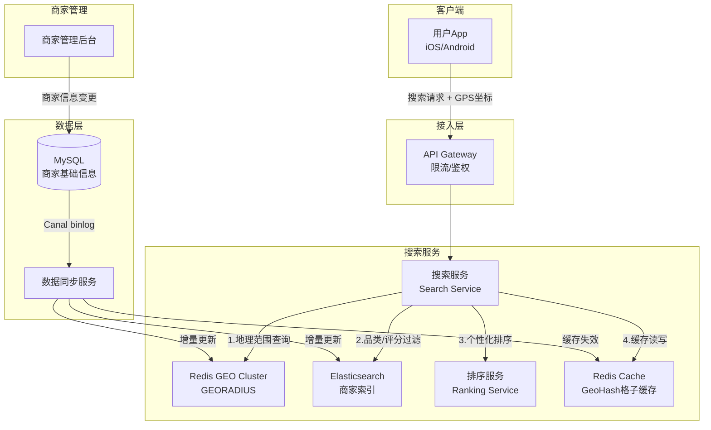
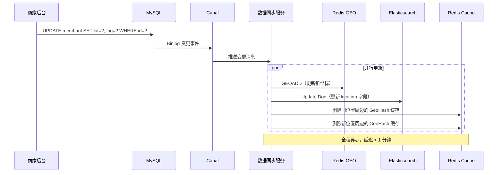

# 美团附近商家搜索系统设计

> **面试场景：** 美团 / 大众点评 后端高级工程师 / 系统设计面试  
> **高频指数：** ⭐⭐⭐⭐⭐

## 题目背景

**面试官常见提问方式：**

> "请设计一个'附近商家搜索'功能。用户打开美团App后，需要快速看到当前位置附近的餐厅列表，支持按距离、评分、品类筛选，要求 P99 延迟 < 100ms，你会怎么设计？"

**业务背景：**

"附近商家"是美团/大众点评的核心入口，用户打开 App 第一眼看到的就是附近商家列表。搜索质量直接影响转化率——搜索延迟每增加 100ms，转化率下降约 1%。与普通全文搜索不同，地理位置搜索有其独特挑战：经纬度是二维数据，传统数据库索引无法高效处理范围查询；商家密度因地区差异巨大（北京三里屯和内蒙古农村的商家密度相差 1000 倍）。

**规模量级：**

- 全国商家数量：9,000,000+（含暂停营业）
- 日搜索请求：100,000,000+（约 1200 次/秒，峰值 5000 次/秒）
- 延迟要求：P50 < 30ms，P99 < 100ms
- 商家数据更新频率：每天约 50,000 次商家信息变更（营业时间/位置/下线等）
- 搜索半径：默认 3km，支持 500m/1km/3km/5km/不限

## 关键指标估算

| 指标 | 估算过程 | 结果 |
|------|----------|------|
| 峰值搜索 QPS | 100M/天，午餐高峰占 20%，集中 2 小时 | ~2,800 次/秒 |
| 商家位置数据内存 | 9M 商家 × (GeoHash字符串12B + 商家ID 8B + 状态 1B) | ~190 MB（可全量放Redis） |
| Redis GEO 单节点容量 | Redis GEO 本质是 Sorted Set，9M 成员约 700MB | 单节点可承载，建议分城市分片 |
| 搜索结果缓存命中率 | 同一 GeoHash 格子（~1.2km²）内请求共享缓存，热门商圈命中率 > 80% | ~80% Cache Hit |
| Elasticsearch 写入 QPS | 50,000 变更/天 ÷ 86400s | ~0.6 次/秒（完全可接受） |
| CDN/缓存节省的 ES 请求 | 100M × 80% cache hit | 仅 20M 请求到达 ES |

## 高层架构



**请求处理流水线（漏斗模型）：**

```
用户GPS坐标 (116.4, 39.9)
    ↓ GeoHash编码
GeoHash = "wx4g0" (精度6位, ~1.2km²)
    ↓ 查询当前格子 + 8个相邻格子
Redis GEO: ~5000 个候选商家
    ↓ 营业状态过滤 (Redis Set)
营业中商家: ~2000 个
    ↓ 品类/评分/关键词过滤 (Elasticsearch)
过滤后: ~200 个
    ↓ 个性化排序 (CTR模型 + 距离加权)
最终结果: 前 20 条返回
```

## 核心设计决策

### 决策1：地理索引方案选择

#### GeoHash 原理

GeoHash 将地球表面划分为网格，每个格子用 base32 字符串编码。精度越高，格子越小：

| GeoHash 精度 | 格子尺寸 | 适用场景 |
|-------------|---------|---------|
| 4位 | 39km × 20km | 城市级搜索 |
| 5位 | 4.9km × 4.9km | 区域级搜索 |
| **6位** | **1.2km × 0.6km** | **美团默认精度** |
| 7位 | 153m × 153m | 精确定位 |

**GeoHash 的边界问题：** 两个地理位置相邻，但 GeoHash 字符串可能差异很大（比如 `wx4g0` 和 `wx4fn`），简单的字符串前缀匹配无法覆盖边界商家。

**解决方案：查询当前格子 + 8个相邻格子**

```python
def get_nearby_geohashes(lat, lng, precision=6):
    center = geohash.encode(lat, lng, precision)
    neighbors = geohash.neighbors(center)  # 返回8个相邻格子
    return [center] + neighbors  # 共9个格子

# 查询这9个格子内的所有商家
def search_nearby_merchants(lat, lng, radius_km=3):
    geohashes = get_nearby_geohashes(lat, lng)
    candidate_ids = redis.georadius(
        f"merchants:city:beijing",
        lng, lat,
        radius_km, "km",
        count=500,
        sort="ASC",
        withcoord=True,
        withdist=True
    )
    return candidate_ids
```

#### 四叉树 vs GeoHash 对比

| 特性 | GeoHash | 四叉树 |
|------|---------|--------|
| 实现复杂度 | 简单，有成熟库 | 复杂，需自研或用 PostGIS |
| 查询性能 | O(N + log M) | O(log N) |
| 密度不均处理 | 固定格子大小，密集区格子内数据多 | 自适应分裂，密集区更细粒度 |
| 边界问题 | 存在，需查询相邻格子 | 天然无边界问题 |
| 美团选择 | **GeoHash + 相邻扩展** | — |

**美团选择 GeoHash 的理由：** 实现简单、Redis 原生支持（GEORADIUS 命令底层即 GeoHash），且相邻格子查询可以解决边界问题，工程成本低。

### 决策2：Redis GEO 存储与查询

**数据存储：**

```bash
# 导入商家位置（批量）
GEOADD merchants:city:beijing \
  116.397128 39.916527 "merchant:1001" \
  116.401234 39.918765 "merchant:1002" \
  ...

# 商家状态用单独的 Redis Set 存储（快速过滤营业中）
SADD merchants:open:20240601_1200 merchant:1001 merchant:1002 ...
# 每分钟更新营业状态集合（商家营业时间预计算）
```

**范围查询：**

```bash
# 查询用户位置3km内的商家，返回距离，按距离升序，最多500个
GEORADIUS merchants:city:beijing 116.404 39.915 3 km 
  WITHCOORD WITHDIST COUNT 500 ASC

# Redis 7.0+ 推荐使用 GEOSEARCH（更灵活）
GEOSEARCH merchants:city:beijing 
  FROMMEMBER "user_location" 
  BYRADIUS 3 km ASC 
  COUNT 500 
  WITHCOORD WITHDIST
```

**分片策略：**

| 分片方式 | Key 格式 | 说明 |
|---------|---------|------|
| 按城市 | `merchants:city:{city_code}` | 适合中等城市（<100万商家） |
| 按城市+区域 | `merchants:city:bj:dist:chaoyang` | 超大城市（北京/上海）进一步拆分 |
| 全量单Key | `merchants:all` | 不推荐，单Key过大 |

### 决策3：多级筛选流水线

**第一级：地理范围（Redis GEO）**

快速召回候选集，从 900 万商家缩减到 ~500 个。

**第二级：营业状态（Redis Set）**

```python
def filter_open_merchants(merchant_ids, current_time):
    # 预计算营业时间，商家上下线时更新
    open_key = f"merchants:open:{current_time.strftime('%H%M')}"
    # SINTERSTORE = 候选集 ∩ 营业中集合
    open_merchant_ids = redis.sinter(
        set(merchant_ids), 
        redis.smembers(open_key)
    )
    return open_merchant_ids
```

**第三级：品类/评分/关键词（Elasticsearch）**

```json
{
  "query": {
    "bool": {
      "filter": [
        {"terms": {"merchant_id": ["1001", "1002", "..."]}},
        {"term": {"category": "火锅"}},
        {"range": {"score": {"gte": 4.0}}}
      ]
    }
  },
  "_source": ["merchant_id", "name", "score", "price_per_person", "tags"],
  "size": 200
}
```

**第四级：个性化排序**

```python
def rank_merchants(merchants, user_id, user_lat, user_lng):
    features = []
    for m in merchants:
        dist = haversine(user_lat, user_lng, m.lat, m.lng)
        features.append({
            "merchant_id": m.id,
            "distance": dist,
            "score": m.score,
            "ctr": get_user_ctr(user_id, m.id),      # 用户对该商家的点击率
            "is_promoted": m.is_promoted,              # 是否付费推广
            "delivery_time": m.avg_delivery_time,
            "sales_volume": m.monthly_sales
        })
    
    # LightGBM 模型预测点击概率
    scores = ranking_model.predict(features)
    return sorted(zip(merchants, scores), key=lambda x: -x[1])
```

### 决策4：缓存策略

**按 GeoHash 格子缓存结果：**

相同 GeoHash 格子（精度 6 位，约 1.2km²）内的用户看到相同的商家候选列表，可以共享缓存。

```python
def get_cached_merchants(lat, lng, filters):
    geohash_key = geohash.encode(lat, lng, precision=6)
    cache_key = f"search:{geohash_key}:{filters.category}:{filters.sort}"
    
    cached = redis.get(cache_key)
    if cached:
        return json.loads(cached)
    
    # Cache Miss：走完整搜索流程
    result = full_search(lat, lng, filters)
    
    # 缓存 ID 列表（不缓存详情，控制 value 大小）
    redis.setex(
        cache_key, 
        30,                          # TTL 30秒
        json.dumps([m.id for m in result])
    )
    return result

def get_merchant_details(merchant_ids):
    # 详情从另一个 Redis Hash 缓存中获取
    pipe = redis.pipeline()
    for mid in merchant_ids:
        pipe.hgetall(f"merchant:detail:{mid}")
    return pipe.execute()
```

**缓存失效策略：**

商家上下线/信息变更通过 Canal 监听 MySQL Binlog，触发精确缓存失效：

```python
# Canal 消费者
def on_merchant_update(event):
    merchant_id = event.after["merchant_id"]
    lat = event.after["lat"]
    lng = event.after["lng"]
    
    # 1. 更新 Redis GEO
    redis.geoadd(f"merchants:city:{city_code}", lng, lat, f"merchant:{merchant_id}")
    
    # 2. 更新 ES
    es.update(index="merchants", id=merchant_id, doc=event.after)
    
    # 3. 失效受影响的 GeoHash 缓存（周边9个格子）
    geohashes = get_nearby_geohashes(lat, lng)
    for gh in geohashes:
        redis.delete(f"search:{gh}:*")  # 模糊删除（实际用 SCAN 实现）
```

### 决策5：动态半径扩展

```python
def adaptive_radius_search(lat, lng, filters, min_results=10):
    radii = [0.5, 1.0, 3.0, 5.0, 10.0]  # km
    
    for radius in radii:
        results = search_nearby(lat, lng, radius, filters)
        if len(results) >= min_results:
            return results, radius
    
    # 兜底：返回最近的 N 个结果（不限距离）
    return fallback_search(lat, lng, filters, limit=min_results), None
```

前端显示：当扩展半径时，告知用户"附近 Xkm 内结果较少，为您展示更远的商家"。

## 详细设计

### 数据模型

**MySQL 商家基础信息表**

```sql
CREATE TABLE `merchant` (
  `merchant_id`     BIGINT      NOT NULL,
  `name`            VARCHAR(100) NOT NULL,
  `category_id`     INT         NOT NULL COMMENT '品类ID',
  `lat`             DECIMAL(10,7) NOT NULL,
  `lng`             DECIMAL(10,7) NOT NULL,
  `city_code`       VARCHAR(20)  NOT NULL,
  `district_code`   VARCHAR(20)  NOT NULL,
  `address`         VARCHAR(200),
  `avg_score`       DECIMAL(3,1) DEFAULT 0.0 COMMENT '贝叶斯平均评分',
  `price_per_person` INT         COMMENT '人均消费(元)',
  `status`          TINYINT     NOT NULL COMMENT '0:下线 1:营业 2:休息',
  `open_time`       JSON        COMMENT '营业时间JSON: [{"day":1,"start":"10:00","end":"22:00"}]',
  `monthly_sales`   INT         DEFAULT 0 COMMENT '月销量',
  `created_at`      DATETIME    NOT NULL,
  `updated_at`      DATETIME    NOT NULL,
  PRIMARY KEY (`merchant_id`),
  INDEX `idx_city_category` (`city_code`, `category_id`, `status`)
) ENGINE=InnoDB;
```

**Elasticsearch 商家索引 Mapping**

```json
{
  "mappings": {
    "properties": {
      "merchant_id": {"type": "long"},
      "name": {"type": "text", "analyzer": "ik_max_word"},
      "category_id": {"type": "integer"},
      "location": {"type": "geo_point"},
      "avg_score": {"type": "float"},
      "price_per_person": {"type": "integer"},
      "status": {"type": "byte"},
      "tags": {"type": "keyword"},
      "monthly_sales": {"type": "integer"}
    }
  }
}
```

### 商家迁址更新流程



### 接口设计

**附近商家搜索接口**

```
GET /api/v1/merchants/nearby
Authorization: Bearer {user_token}

Query Parameters:
  lat         float   required  用户纬度
  lng         float   required  用户经度
  radius      float   optional  搜索半径(km), default=3
  category    string  optional  品类ID，多个逗号分隔
  min_score   float   optional  最低评分，default=0
  sort        string  optional  排序方式: recommended/distance/score/sales
  page        int     optional  页码，default=1
  page_size   int     optional  每页数量，default=20

Response:
{
  "total": 156,
  "actual_radius": 3.0,
  "merchants": [
    {
      "merchant_id": 10086,
      "name": "海底捞火锅（三里屯店）",
      "category": "火锅",
      "distance": 0.85,         // km
      "score": 4.8,
      "price_per_person": 120,
      "delivery_time": 35,      // 分钟
      "thumbnail": "https://cdn.meituan.com/...",
      "tags": ["招牌必点", "免费美甲"]
    }
  ],
  "trace_id": "abc123"           // 用于Debug和问题排查
}
```

## 踩过的坑 / 生产经验

### 坑1：热门商圈 GeoHash 格子内商家过多导致缓存 Value 过大

**现象：** 北京三里屯、上海外滩等热门商圈，一个 GeoHash 格子（精度 6 位）内有 3000+ 商家。如果缓存完整商家信息，单个 Cache Value 达到 5-10 MB，导致：

- Redis 内存使用飙升（一个热门格子就占 10MB）
- 网络传输慢，反而比不缓存更慢
- Redis 大 Value 导致 AOF/RDB 持久化阻塞

**解决方案：格子缓存只存 ID 列表，详情单独缓存**

```
Cache Key:   search:{geohash}:{filters_hash}
Cache Value: ["1001","1002","1003",...]   // 仅ID列表，约 10KB

Cache Key:   merchant:detail:{merchant_id}
Cache Value: {name, score, price, ...}   // 单商家详情，约 500B

查询时：先取ID列表 → 再批量 HMGET 取详情（Pipeline）
```

### 坑2：GeoHash 边界问题导致附近商家"漏搜"

**现象：** 用户在北京国贸附近，GeoHash 格子恰好位于边界，隔壁格子有大量商家，但查询当前格子时没有返回。用户反映"明明有餐厅就在旁边，搜不到"。

**解决方案：** 始终查询当前格子 + 8 个相邻格子，用 `geohash.neighbors()` 获取相邻格子，总计 9 个格子。这能保证边界附近的商家不会漏掉。

```python
# 确认：9格子搜索覆盖的实际范围
# 精度6位，每格 1.2km×0.6km
# 3×3 矩阵 = 3.6km × 1.8km，足以覆盖 3km 搜索半径
```

### 坑3：商家营业状态更新延迟导致"已打烊"商家仍然显示

**现象：** 商家晚上 22:00 打烊，但用户 22:15 仍能搜索到该商家（因为缓存 TTL 30 秒，加上营业状态批量更新有延迟）。

**解决方案：**

1. 营业时间变更触发立即失效缓存（Canal 实时监听）
2. 客户端展示时二次校验：商家详情页实时查询当前营业状态
3. 批量营业时间到期任务：每分钟跑一次，把到期打烊的商家从"营业集合"中移除，并失效对应缓存

### 坑4：Elasticsearch 查询慢导致整体延迟超标

**现象：** 高峰期 ES 查询 P99 延迟达到 300ms，整体搜索 P99 超过 200ms，不满足 < 100ms 要求。

**根因：** ES 按 `merchant_id` 过滤时（`terms` 查询传入 500 个 ID），需要大量随机 IO 读取倒排索引。

**解决方案：**

1. **减少传入 ES 的候选数量**：Redis GEO 初步过滤后，只传前 200 个最近的商家 ID 给 ES（而非全部 500 个）
2. **ES 索引优化**：`merchant_id` 字段加入路由键，使同城市商家数据聚集在少数 shard 上，减少跨 shard 查询
3. **缓存热门格子结果**：对请求量最多的前 1000 个 GeoHash 格子，预热缓存，缓存命中直接跳过 ES

## 扩展考点

### 追问方向

**Q：如何处理商家数量极少的地区（农村/郊区）？**

分层降级策略：
1. 默认半径 3km 无结果 → 自动扩大到 5km/10km/不限
2. 同时展示"稍远"分组（超出默认半径但在扩大半径内）
3. 对于确实没有商家的地区，展示"当前位置暂无商家，为您推荐附近城市商家"

**Q：如何支持"在某个商圈内搜索"（非圆形范围，而是多边形范围）？**

- Elasticsearch 支持 `geo_polygon` 查询，可以传入多边形顶点坐标
- 商圈边界数据预存为 GeoJSON，查询时用 `geo_shape` 过滤
- Redis GEO 不支持多边形，需要先用 GeoHash 大范围召回，再用多边形做精确过滤

**Q：如何设计商家索引的实时更新（不影响线上查询）？**

- ES 支持热更新（`_update` API），不需要重建整个索引
- 对于大规模 Schema 变更（增加新字段），使用 ES Alias 实现零停机迁移：新索引建好后，Alias 原子切换

### 边界 Case

- **用户在海外**：中国大陆商家数据不出境，海外用户应路由到对应海外数据中心
- **搜索点在海洋/山区**：GeoHash 格子内无商家，走动态半径扩展，直到有结果
- **并发商家信息变更**：同一商家短时间内多次变更（Canal 事件乱序），使用版本号控制，以最新版本为准
- **恶意爬虫**：单 IP 高频搜索不同坐标，用滑动窗口限流 + IP 封禁

### 演进路径

```
v1.0：MySQL 空间索引（简单实现）
  ↓ 性能瓶颈
v2.0：Redis GEO + 简单距离排序
  ↓ 个性化需求
v3.0：Redis GEO + Elasticsearch 多维度过滤
  ↓ 转化率优化
v4.0：个性化排序（CTR 模型）+ 实时特征
  ↓ 大规模扩展
v5.0：分布式 GeoHash + 多级缓存 + 预计算
```

## 面试评分维度

| 维度 | 基础分（60分） | 加分项（80+分） | 满分项（100分） |
|------|---------------|----------------|----------------|
| **需求澄清** | 说清楚地理范围查询是核心 | 主动问 SLA、数据量级 | 提出过滤+排序+缓存三层设计 |
| **地理索引** | 知道 GeoHash 或 Redis GEO | 说清楚 GeoHash 精度与格子大小关系 | 分析边界问题并给出 8 邻格解决方案；对比四叉树 |
| **缓存设计** | 提到缓存加速 | 说出按 GeoHash 格子缓存，TTL 策略 | 说出只缓存 ID 列表、大 Value 问题及 Canal 增量失效 |
| **多级筛选** | 知道用 ES 做品类过滤 | 说出 Redis GEO → ES → 排序 的漏斗 | 解释每层的作用和性能特征，分析 ES 慢查询优化 |
| **数据一致性** | 提到商家信息需要同步 | 说出 Canal Binlog 方案 | 分析更新延迟影响和缓存失效策略 |
| **生产经验** | 了解 GeoHash 边界问题 | 提到热门商圈缓存大 Value 问题 | 结合实际告知解决方案（ID列表缓存 + 批量 HMGET） |
