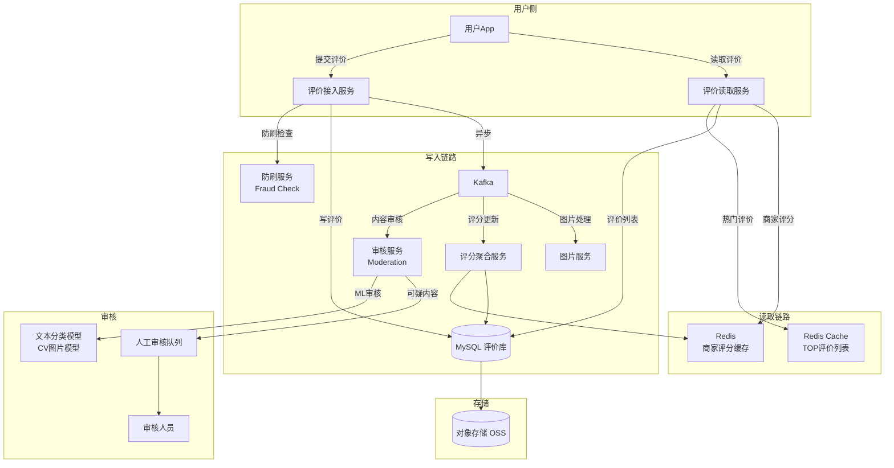
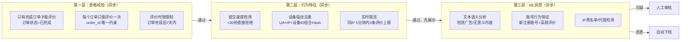
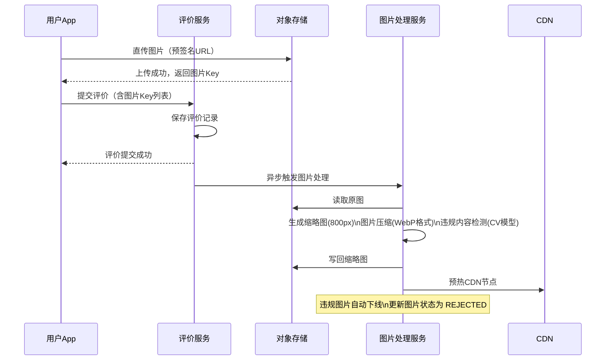
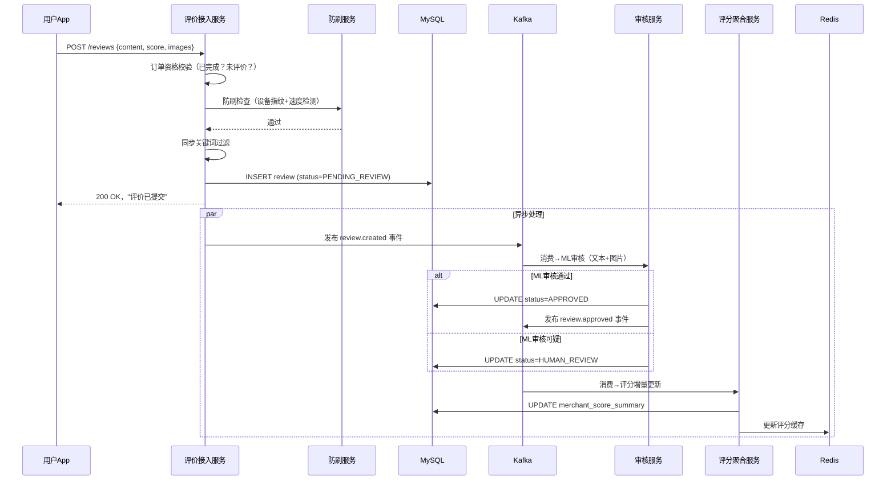

# 美团评价系统设计

> **面试场景：** 美团 / 大众点评 后端高级工程师 / 系统设计面试  
> **高频指数：** ⭐⭐⭐⭐

## 题目背景

**面试官常见提问方式：**

> "请设计美团的评价系统。用户完成订单后可以对商家进行评价，包括文字、图片和评分。商家评分需要实时更新并展示。如何保证评价真实可靠，防止刷评和虚假差评？"

**业务背景：**

评价系统是 UGC（用户生成内容）系统的典型代表，也是商家信用体系的核心数据来源。评价的质量直接影响用户决策（80% 的用户下单前会看评价）和商家排名。评价系统面临两大核心挑战：

1. **真实性保障**：防止商家自刷好评、竞争对手刷差评
2. **实时性**：用户提交评价后，应立即看到自己的评价（宽松一致性），商家评分需要准确反映真实口碑

**规模量级：**

- 历史评价总量：200,000,000+
- 日新增评价：5,000,000+（约 58 条/秒，峰值 300 条/秒）
- 评价图片：平均每条评价 1.5 张，日新增约 750 万张图片
- 评价读取 QPS：商家主页评价列表约 50,000 次/秒（读多写少，读:写 ≈ 100:1）
- 内容审核：提交后 30 秒内完成 ML 审核，1 小时内完成人工复查

## 关键指标估算

| 指标 | 估算过程 | 结果 |
|------|----------|------|
| 评价写入 QPS（峰值） | 5M/天 × 6 倍峰值因子 ÷ 3600s | ~300 条/秒 |
| 评价读取 QPS | 商家主页 PV 约 5B/天 × 每次展示评价 | ~50,000 次/秒 |
| 评价图片存储 | 750万图片/天 × 365天 × 平均0.3MB（压缩后） | ~820 TB/年 |
| 商家评分缓存 | 9M 商家 × (merchant_id + score + count) × 20B | ~180 MB（Redis全量） |
| 评价内容存储（MySQL）| 200M条 × 平均500B | ~100 GB |
| 审核队列延迟目标 | 正常评价 30s 内审核通过 | ML审核 < 5s，人工复查 < 1h |

## 高层架构



## 核心设计决策

### 决策1：评分聚合算法——贝叶斯平均

**为什么不用简单算术平均？**

算术平均的问题：新商家只有 2 条评价，全是 5 星，算术平均 = 5.0。但这 2 条评价的可信度远低于有 10,000 条评价的老商家。简单平均会给新商家"虚高"的评分，影响用户决策。

**贝叶斯平均（Bayesian Average）公式：**

```
贝叶斯评分 = (C × m + Σr) / (C + n)

其中：
  C = 全站平均评价数量（先验置信度，例如 = 50）
  m = 全站平均分（先验均值，例如 = 4.2）
  Σr = 该商家所有评价分数之和
  n = 该商家实际评价数量
```

**示例计算：**

```
全站参数：C=50, m=4.2

新商家（2条评价，均为5星）：
  贝叶斯评分 = (50 × 4.2 + 10) / (50 + 2) = (210 + 10) / 52 ≈ 4.23
  （向全站均值回归，不会显示虚高的5.0）

老商家（1000条评价，均分4.8）：
  贝叶斯评分 = (50 × 4.2 + 4800) / (50 + 1000) = 5010 / 1050 ≈ 4.77
  （评价数量足够多，接近真实均值）
```

**参数校准方法论：**

贝叶斯平均公式 `(C × m + Σr) / (C + n)` 中，`m` 参数的设定直接影响新商家的评分稳定性：

| 参数 | 计算方法 | 美团实际值（估算） |
|------|---------|-----------------|
| `C`（全站平均分） | 所有商家评分均值 | ~4.2 分（5分制） |
| `m`（置信权重） | 全站商家评论数**第10百分位数** | ~5 条评论 |

`m=5` 表示：**评论数 < 5 的新商家，评分向全站均值 4.2 拉近**。一个只有 1 条 5 分好评的新商家，贝叶斯评分 = (5×4.2 + 1×5) / (5+1) = 4.33，而非原始 5.0。这防止了极少量评论对排名的干扰。

每月重新计算 `m` 值（随商家数量增长而变化），`C` 每周更新。

**分维度评分：** 口味、环境、服务三个维度分别独立计算贝叶斯评分，存储时用 3 个字段分别保存。

**评分更新策略：**

不在每次评价提交时实时重算贝叶斯评分（避免频繁写库），而是：
1. 每条评价写入时，通过 Kafka 事件触发异步评分更新
2. 评分聚合服务用增量更新公式（无需读取历史评价）：
   ```python
   def update_bayesian_score(current_sum, current_count, new_score, C, m):
       new_sum = current_sum + new_score
       new_count = current_count + 1
       new_bayesian = (C * m + new_sum) / (C + new_count)
       return new_sum, new_count, new_bayesian
   ```
3. 结果写回 MySQL 商家评分摘要表，同时更新 Redis 缓存

### 决策2：防刷评论体系

**多层防御架构：**



**设备指纹实现：**

```python
def generate_device_fingerprint(request):
    components = [
        request.headers.get("User-Agent", ""),
        request.remote_addr,
        request.headers.get("X-Device-ID", ""),     # App上报设备ID
        request.headers.get("X-Screen-Res", ""),    # 屏幕分辨率
        request.headers.get("Accept-Language", "")
    ]
    fingerprint = hashlib.sha256("|".join(components).encode()).hexdigest()
    
    # 检查该指纹今日评价数量
    count_key = f"review:fp:{fingerprint}:{today}"
    count = redis.incr(count_key)
    redis.expire(count_key, 86400)
    
    if count > 10:  # 同一设备一天内最多10条评价
        raise RateLimitException("设备评价频率超限")
    
    return fingerprint
```

**恶意差评识别（竞对刷差评）：**

```python
def detect_malicious_negative_review(review, merchant_id):
    signals = []
    
    # 信号1：账号注册时间 < 7天
    if user.register_days < 7:
        signals.append(("new_account", 0.4))
    
    # 信号2：该用户首次评价该商家（无消费记录）
    if not has_previous_order(review.user_id, merchant_id):
        signals.append(("no_order_history", 0.8))
    
    # 信号3：短时间内该商家收到大量差评（异常波动）
    recent_negative = get_recent_negative_count(merchant_id, minutes=30)
    if recent_negative > THRESHOLD:
        signals.append(("negative_spike", 0.6))
    
    # 信号4：评价内容与订单商品不相关
    if not is_content_relevant(review.content, merchant_id):
        signals.append(("irrelevant_content", 0.5))
    
    # 综合评分
    risk_score = 1 - reduce(lambda acc, s: acc * (1 - s[1]), signals, 1)
    return risk_score > 0.7  # 风险分 > 0.7 进入人工审核
```

**风险评分 → 处置流程：**

```python
def process_review_risk(review: Review, fingerprint_score: float):
    if fingerprint_score > 0.9:
        # 高风险：直接拒绝，不进入审核队列
        return ReviewStatus.REJECTED, "high_risk_device"
    
    elif fingerprint_score > 0.7:
        # 中风险：进入影子队列，额外检查
        velocity = count_reviews_last_hour(review.device_id)
        similarity = max_similarity_with_spam_templates(review.content)
        
        if velocity > 5 or similarity > 0.9:
            return ReviewStatus.REJECTED, "spam_pattern"
        else:
            return ReviewStatus.PENDING_AUDIT, "manual_review"
    
    else:
        # 低风险：走正常 ML 审核流程
        return ReviewStatus.PENDING_ML_AUDIT, "normal"
```

**二次检查指标：**
- `velocity`：同一设备指纹过去 1 小时内提交的评论数，> 5 次判定为机器刷评
- `similarity`：与已知垃圾模板库（Top 1000 垃圾评论）的余弦相似度，> 0.9 判定为模板复制

### 决策3：内容审核管道

**审核流程设计（异步 + 分级）：**

```
用户提交评价
    ↓
[同步] 实时拦截：命中关键词黑名单（敏感词库）→ 直接拒绝
    ↓ 通过
保存评价（status = PENDING_REVIEW）
立即返回用户："评价已提交，正在审核中"
    ↓
[异步] Kafka → 审核队列
    ↓
ML审核（<5s）：
  - 文本分类：涉黄/涉政/广告/正常（BERT 微调模型）
  - 图片审核：OCR + CV 违规检测
    ↓
  正常 → status = APPROVED，立即展示
  可疑 → status = HUMAN_REVIEW，进入人工审核队列
  违规 → status = REJECTED，通知用户
    ↓
[人工审核] 审核人员复查可疑评价（<1h）
```

**为什么选择先展示再审核？**

部分系统（如微博）采用"先审核再展示"，但这会导致用户体验差——用户发完评价看不到自己的内容，会反复提交。美团采用"提交即展示（仅对自己可见）→ 审核通过后全量可见"策略：

```python
def get_review_list(merchant_id, viewer_user_id):
    # 普通用户：只看审核通过的评价
    reviews = db.query("""
        SELECT * FROM review 
        WHERE merchant_id = ? AND status = 'APPROVED'
        ORDER BY created_at DESC
        LIMIT 20
    """, merchant_id)
    
    # 追加：当前用户自己的待审核评价（只有自己能看到）
    my_pending = db.query("""
        SELECT * FROM review 
        WHERE merchant_id = ? AND user_id = ? AND status = 'PENDING_REVIEW'
    """, merchant_id, viewer_user_id)
    
    return my_pending + reviews  # 自己的待审核评价显示在最前面
```

### 决策4：热门评价排序

**热门评价排序公式：**

```python
def calculate_hot_score(review):
    """
    热度分 = 点赞数的对数 × 时间衰减因子
    时间衰减：以提交时间为基准，每7天热度减半
    """
    import math
    import time
    
    age_days = (time.time() - review.created_at) / 86400
    time_decay = 0.5 ** (age_days / 7)  # 7天半衰期
    
    like_score = math.log(1 + review.like_count)  # 对数避免头部效应
    
    # 奖励有图片的评价
    image_bonus = 1.2 if review.image_count > 0 else 1.0
    
    # 奖励长评价（有质量的文字评价）
    length_bonus = 1.1 if len(review.content) > 100 else 1.0
    
    return like_score * time_decay * image_bonus * length_bonus

# 每小时更新 TOP 评价列表并缓存到 Redis
def update_top_reviews(merchant_id):
    reviews = db.query("""
        SELECT * FROM review 
        WHERE merchant_id = ? AND status = 'APPROVED'
        AND created_at > DATE_SUB(NOW(), INTERVAL 90 DAY)
    """, merchant_id)
    
    scored = [(r, calculate_hot_score(r)) for r in reviews]
    top10 = sorted(scored, key=lambda x: -x[1])[:10]
    
    redis.setex(
        f"review:top:{merchant_id}",
        3600,  # 1小时TTL
        json.dumps([r.to_dict() for r, _ in top10])
    )
```

### 决策5：评价图片处理

**图片处理流程：**



**存储优化：**
- 原图：用户上传的原始图片，保留 30 天后删除（节省存储）
- 缩略图：800px × 800px，WebP 格式（比 JPEG 小 30%），永久保存
- 缩略图 URL 格式：`https://cdn.meituan.com/review/{review_id}/{idx}_thumb.webp`

### 决策6：分页策略

**为什么用游标分页而非 OFFSET 分页？**

OFFSET 分页（`LIMIT 20 OFFSET 100`）需要数据库扫描并丢弃前 N 行，当 OFFSET 很大时性能极差（`LIMIT 20 OFFSET 100000` 需要扫描 10 万行）。

**游标分页实现：**

```sql
-- 首页（无游标）
SELECT review_id, user_id, content, score, created_at 
FROM review 
WHERE merchant_id = 10086 AND status = 'APPROVED'
ORDER BY created_at DESC, review_id DESC
LIMIT 20;

-- 翻页（使用游标：上一页最后一条的 created_at + review_id）
SELECT review_id, user_id, content, score, created_at 
FROM review 
WHERE merchant_id = 10086 AND status = 'APPROVED'
  AND (created_at < '2024-06-01 12:00:00' 
       OR (created_at = '2024-06-01 12:00:00' AND review_id < 99999))
ORDER BY created_at DESC, review_id DESC
LIMIT 20;
```

游标编码为 Base64 字符串返回给客户端：`cursor = base64(created_at + ":" + review_id)`

**深翻保护：** 评价页数 > 100 页时（约 2000 条后），直接返回空列表，提示用户"更多历史评价请通过关键词搜索"。

## 详细设计

### 数据模型

**评价主表（review）**

```sql
CREATE TABLE `review` (
  `review_id`     BIGINT      NOT NULL COMMENT '雪花ID',
  `order_id`      BIGINT      NOT NULL COMMENT '关联订单ID（确保消费真实性）',
  `user_id`       BIGINT      NOT NULL,
  `merchant_id`   BIGINT      NOT NULL,
  `score`         TINYINT     NOT NULL COMMENT '综合评分 1-5',
  `score_taste`   TINYINT     COMMENT '口味评分',
  `score_env`     TINYINT     COMMENT '环境评分',
  `score_service` TINYINT     COMMENT '服务评分',
  `content`       VARCHAR(500) NOT NULL,
  `status`        ENUM('PENDING_REVIEW','APPROVED','REJECTED','HUMAN_REVIEW') NOT NULL,
  `like_count`    INT         DEFAULT 0,
  `hot_score`     DECIMAL(10,4) DEFAULT 0 COMMENT '热度分，每小时更新',
  `device_fp`     VARCHAR(64) COMMENT '设备指纹',
  `created_at`    DATETIME(3) NOT NULL,
  `updated_at`    DATETIME(3) NOT NULL,
  PRIMARY KEY (`review_id`),
  UNIQUE KEY `uk_order` (`order_id`),           -- 一单一评价
  INDEX `idx_merchant_status_time` (`merchant_id`, `status`, `created_at` DESC),
  INDEX `idx_merchant_hot` (`merchant_id`, `status`, `hot_score` DESC),
  INDEX `idx_user` (`user_id`, `created_at` DESC)
) ENGINE=InnoDB;
```

**评价图片表（review_image）**

```sql
CREATE TABLE `review_image` (
  `image_id`    BIGINT      NOT NULL,
  `review_id`   BIGINT      NOT NULL,
  `url_thumb`   VARCHAR(200) NOT NULL COMMENT '缩略图URL（CDN）',
  `url_original` VARCHAR(200) COMMENT '原图URL（30天有效）',
  `width`       SMALLINT,
  `height`      SMALLINT,
  `status`      TINYINT     NOT NULL DEFAULT 1 COMMENT '1:正常 0:违规下线',
  `sort_order`  TINYINT     DEFAULT 0,
  PRIMARY KEY (`image_id`),
  INDEX `idx_review` (`review_id`)
) ENGINE=InnoDB;
```

**商家评分摘要表（merchant_score_summary）**

```sql
CREATE TABLE `merchant_score_summary` (
  `merchant_id`       BIGINT      NOT NULL,
  `review_count`      INT         DEFAULT 0 COMMENT '有效评价总数',
  `score_sum`         BIGINT      DEFAULT 0 COMMENT '评分总和（避免浮点误差）',
  `bayesian_score`    DECIMAL(3,1) DEFAULT 0.0 COMMENT '贝叶斯平均分',
  `score_taste`       DECIMAL(3,1) DEFAULT 0.0 COMMENT '口味分',
  `score_env`         DECIMAL(3,1) DEFAULT 0.0 COMMENT '环境分',
  `score_service`     DECIMAL(3,1) DEFAULT 0.0 COMMENT '服务分',
  `score_5_count`     INT         DEFAULT 0 COMMENT '5星评价数（用于展示分布图）',
  `score_4_count`     INT         DEFAULT 0,
  `score_3_count`     INT         DEFAULT 0,
  `score_2_count`     INT         DEFAULT 0,
  `score_1_count`     INT         DEFAULT 0,
  `last_updated_at`   DATETIME(3) NOT NULL,
  PRIMARY KEY (`merchant_id`)
) ENGINE=InnoDB;
```

### 评价提交时序图



### 核心 API 接口

**提交评价：**
```http
POST /api/v1/merchants/{merchant_id}/reviews
Authorization: Bearer {user_token}
Content-Type: application/json

{
  "order_id": "order_123",          // 必填，验证消费记录
  "overall_rating": 4,              // 1-5 整数
  "taste_rating": 5,                // 口味评分（餐饮类）
  "packaging_rating": 4,            // 包装评分
  "content": "味道很好，送餐也快",
  "images": ["img_url_1", "img_url_2"],
  "is_anonymous": false
}

// 响应
{
  "review_id": "rv_abc123",
  "status": "PENDING_AUDIT",        // PENDING_AUDIT | PUBLISHED | REJECTED
  "message": "评价已提交，审核后将公开展示"
}
```

**获取商家评价列表（游标分页）：**
```http
GET /api/v1/merchants/{merchant_id}/reviews
  ?cursor=rv_xyz&limit=20&sort=helpful&min_rating=3

// 响应
{
  "reviews": [
    {
      "review_id": "rv_abc123",
      "user_nickname": "用户***456",
      "overall_rating": 4,
      "content": "...",
      "images": [],
      "helpful_count": 23,
      "created_at": "2024-01-01T12:00:00Z",
      "merchant_reply": null
    }
  ],
  "next_cursor": "rv_def456",       // null 表示最后一页
  "total_count": 1234               // 总评价数（非精确值，每小时更新）
}
```

## 踩过的坑 / 生产经验

### 坑1：恶意差评攻击（竞对刷差评）

**现象：** 某知名餐厅在大众点评上出现"差评轰炸"——短时间内涌入大量1星差评，内容疑似由模板生成，用户账号均为新注册。商家向平台申诉。

**解决方案：**

1. **异常流量检测**：设置阈值——若某商家在 30 分钟内差评数超过过去 30 天日均差评数的 3 倍，触发告警并临时降低这批评价的展示权重
2. **人工审核队列**：触发异常后，相关评价自动进入人工审核队列，标注为"疑似恶意差评"
3. **商家申诉流程**：商家可以对单条评价提出申诉，提供证据（外卖订单截图、消费记录），审核人员复查
4. **评价来源分层展示**：区分"配送订单评价"（真实消费）和"到店评价"，前者权重更高

### 坑2：评分聚合任务在高峰期延迟

**现象：** 午餐高峰期，Kafka 评价事件积压，评分聚合服务消费滞后。用户提交评价 30 分钟后，商家评分仍未更新。

**解决方案：**

1. **增量更新而非全量重算**：评分聚合服务使用增量公式（不需要读取历史评价），每条新评价触发一次轻量级更新（单次 < 10ms）
2. **Redis 先行更新**：评价提交时立即更新 Redis 中的评分计数器（`INCR` + `HINCRBYFLOAT`），MySQL 批量同步（每 5 分钟一次）
3. **Kafka 分区优化**：将同一商家的评价路由到同一 Kafka 分区（Key = merchant_id），避免并发写 merchant_score_summary 时的锁竞争

### 坑3：点赞功能被刷（虚假点赞抬高差评热度）

**现象：** 竞对账号对某商家的差评进行大量点赞，使差评出现在"热门评价"列表最前面，放大负面影响。

**解决方案：**

1. **点赞去重**：每个用户对每条评价只能点赞一次（`user_id + review_id` 唯一约束，Redis Set 去重）
2. **点赞账号可信度加权**：新账号点赞权重 = 0.1，老账号（注册 > 90 天且有真实消费记录）权重 = 1.0
3. **热度分公式加权**：同等点赞数下，来自真实消费用户的点赞权重更高

### 坑4：大商家评价数据库热点

**现象：** 海底捞、麦当劳等全国连锁品牌，每个门店评价读取 QPS 极高。MySQL 单表查询成为瓶颈。

**解决方案：**

1. **Redis 缓存 TOP 评价**：每个商家的热门评价列表缓存 1 小时，高峰期直接走缓存
2. **评价表按 merchant_id 分库分表**：`review_shard_{merchant_id % 64}` 分 64 张表，减少单表热点
3. **只读副本**：评价列表读取走 MySQL 从库（主从延迟 < 1s 对评价场景可接受）

## 扩展考点

### 追问方向

**Q：如何设计评价的"有用性"投票（点赞/踩）？**

- 点赞/踩分别记录，防止通过"点踩"压制负面评价
- 每用户每评价只能操作一次（Redis Set 去重，持久化到 MySQL）
- "踩"不影响热度分，避免恶意打压

**Q：评价系统如何做数据分析？（运营需求）**

- 评价数据实时同步到数据湖（Hive/Spark），支持：
  - 商家评价关键词 TF-IDF 分析（"好吃"、"性价比高"标签提取）
  - 评价情感分析（正面/负面/中性）
  - 商家评分趋势（按周/月聚合）
  - 差评预警（评分下滑超过阈值触发商家运营介入）

**Q：如何处理评价内容涉及个人隐私（用户手误写了个人信息）？**

- 用户可以在发布后 24 小时内自行编辑/删除
- 审核模型加入隐私信息检测（手机号/身份证号的正则匹配）
- 用户举报机制：其他用户举报评价包含隐私信息，人工处理

### 边界 Case

- **订单退款后评价**：退款后用户仍可评价（已真实消费），但订单状态标记为"已退款"
- **同一用户多次消费同一商家**：每次订单都可以评价，但每条评价独立展示，不覆盖历史评价
- **评价内容超长**：截断到 500 字符，客户端做前端校验

### 演进路径

```
v1.0：基础评价（写入 + 简单算术平均）
  ↓
v2.0：贝叶斯评分 + 图片支持
  ↓
v3.0：ML 内容审核（代替纯关键词过滤）
  ↓
v4.0：防刷体系（设备指纹 + 异常检测）
  ↓
v5.0：个性化评价排序（根据用户偏好展示更相关的评价）
```

### 监控与告警指标

| 指标 | 类型 | 告警阈值 | 说明 |
|------|------|---------|------|
| `review_audit_queue_lag` | Gauge | > 1万 触发告警 | 待审核评价积压量，说明 ML 审核服务处理能力不足 |
| `spam_detection_rate` | Counter | 突增 5x 触发告警 | 刷评检测触发率，异常激增说明新型刷评攻击 |
| `score_aggregation_delay_ms` | Histogram | P99 > 3600000ms 触发告警 | 评分聚合延迟（允许 1 小时批次），超时说明批处理任务失败 |
| `review_publish_latency_ms` | Histogram | P99 > 5000ms 触发告警 | 评价提交到可见的延迟（同步内容审核路径） |
| `image_moderation_failure_rate` | Counter | > 1% 触发告警 | 图片审核失败率（含超时），超时图片默认隐藏等待重试 |
| `appeal_pending_count` | Gauge | > 500 触发告警 | 商家申诉积压量，影响商家体验 |

## 面试评分维度

| 维度 | 基础分（60分） | 加分项（80+分） | 满分项（100分） |
|------|---------------|----------------|----------------|
| **评分机制** | 知道算术平均有问题 | 说出贝叶斯平均原理 | 给出公式和增量更新实现 |
| **防刷设计** | 提到订单关联（消费才能评价） | 说出设备指纹+速度检测 | 多层防御体系+异常波动检测 |
| **内容审核** | 知道需要 ML 审核 | 说出异步审核管道设计 | 先展示后审核的用户体验权衡，分级处理 |
| **读写设计** | 读多写少要用缓存 | 游标分页 vs OFFSET 分页 | TOP 评价热度计算公式 + 缓存更新策略 |
| **图片处理** | 提到对象存储+CDN | 说出压缩和缩略图策略 | 直传（预签名URL）+ 违规图片审核流程 |
| **生产经验** | 了解刷评问题 | 提到商家申诉流程 | 结合实际故障（差评轰炸、评分延迟）给出解决方案 |
