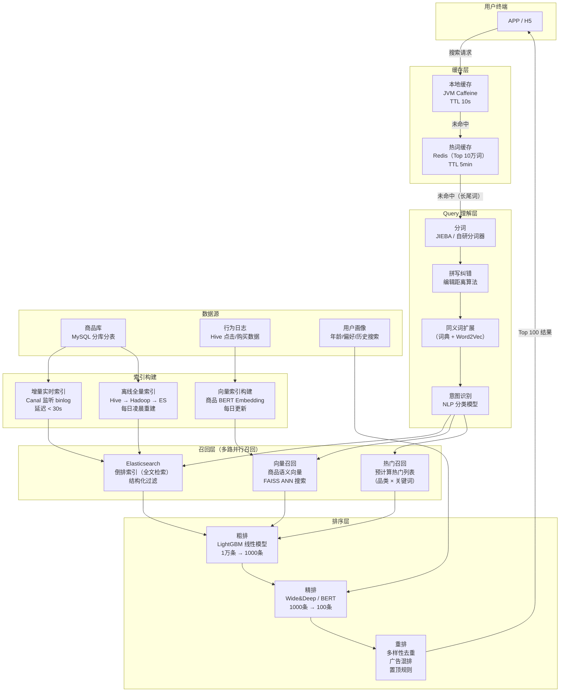
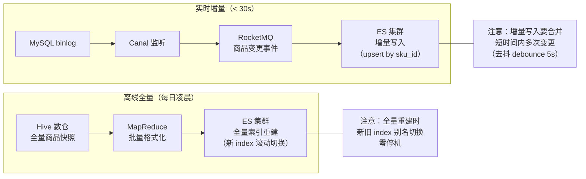
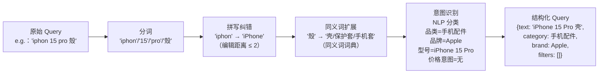
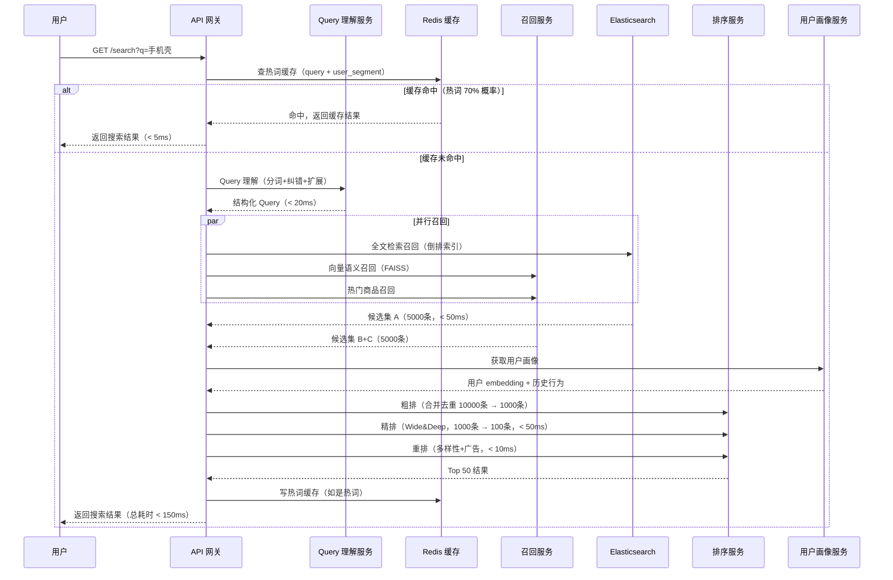
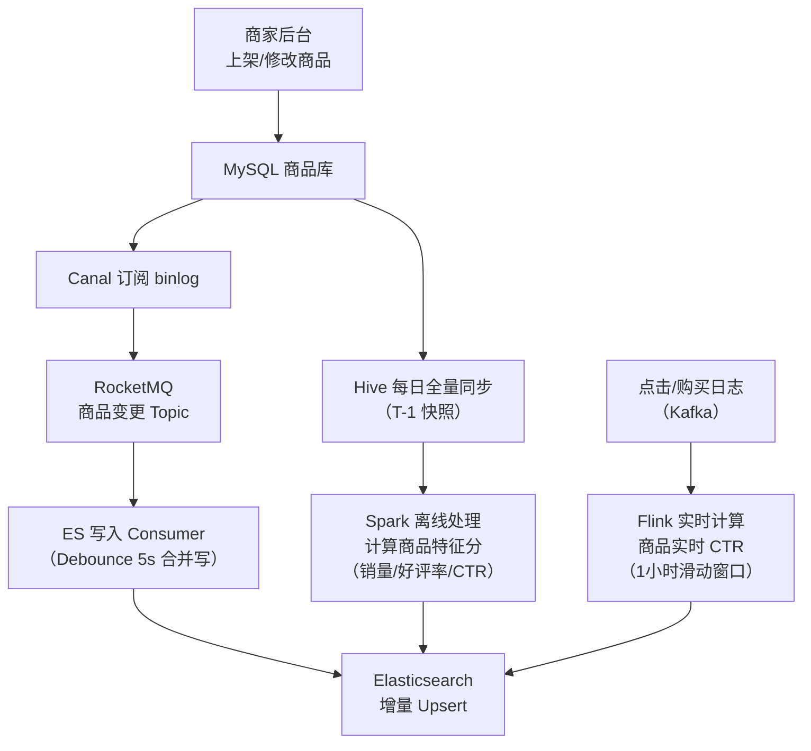

# 淘宝商品搜索系统设计

> **面试场景：** 阿里巴巴 / 京东 / 拼多多 搜索引擎工程师 / 高级后端工程师 系统设计面试  
> **高频指数：** ⭐⭐⭐⭐⭐

## 题目背景

**面试官原话：**
> "请设计淘宝的商品搜索系统。系统需要支持用户输入关键词搜索商品，按相关性和销量排序。请重点考虑高并发下的延迟保障，以及搜索结果的个性化。"

**业务背景：**  
淘宝商品搜索是用户购物的起点，约 70% 的成交来自搜索入口。2023 年双十一峰值搜索 QPS 超过 **50 万次/秒**，索引规模超过 **10 亿 SKU**，每个 SKU 包含标题、品类、属性、图片等数十个字段。搜索结果需要在 **P99 < 200ms** 内返回，同时兼顾个性化（同一个关键词，给不同用户看到的排序不同）。

**搜索系统的独特挑战：**
- **规模巨大**：10亿+ 商品索引，远超普通搜索场景
- **实时性要求**：商品上架/下架、价格变化需在分钟级反映到搜索结果
- **个性化排序**：召回 10000 个结果，精排只选前 100 个，需要 ML 模型参与
- **查询多样性**：用户输入千奇百怪（拼写错误、缩写、俗称），需要 Query 理解
- **深翻防护**：防止恶意用户 offset=999999 翻页导致 ES 扫描全量数据

---

## 关键指标估算

| 指标 | 估算过程 | 结果 |
|------|----------|------|
| 峰值搜索 QPS | 双十一历史数据 | **500,000 QPS** |
| 日均搜索量 | 均值约 1亿次/天（DAU 8亿 × 搜索率 12.5%） | **~1亿次/天** |
| 索引规模 | 淘宝+天猫 SKU 总数 | **10亿+ SKU** |
| 单 SKU 索引大小 | 标题 200B + 属性 1KB + 向量 768维×4B≈3KB | **~3KB/SKU** |
| ES 索引总大小 | 10亿 × 3KB × 1.5（副本 + 元数据开销） | **~4.5TB** |
| ES 集群规模 | 4.5TB ÷ 单节点 500GB | **~9个数据节点**（实际冗余 × 3 = 27节点） |
| 搜索延迟目标 | P50 < 50ms，P99 < 200ms | 整个搜索链路（含排序）< **200ms** |
| 索引更新延迟 | 商品上架到可搜索 | < **60秒**（增量索引） |
| 缓存命中率 | 热词 Top 10万约覆盖 70% 搜索量 | 目标 **70% 缓存命中** |
| 个性化模型 | Wide&Deep CTR 模型每日重训 | 模型大小 **~5GB**，推理 < **10ms** |

---

## 高层架构



---

## 核心设计决策

### 决策一：索引架构——ES 倒排索引 + 增量更新

**问题：** 10亿 SKU 的全量索引，每次全量重建需要数小时，商品上架后必须快速可搜（SLA < 60s）。

**方案：双轨制索引更新**



**ES Index 别名切换（零停机重建）：**
```bash
# 1. 离线构建新索引 product_v20231111
# 2. 验证数据正确性（搜索测试）
# 3. 原子切换别名（对外暴露的始终是 product_alias）
curl -X POST "es:9200/_aliases" -d '{
  "actions": [
    {"remove": {"index": "product_v20231110", "alias": "product_alias"}},
    {"add":    {"index": "product_v20231111", "alias": "product_alias"}}
  ]
}'
# 4. 删除旧索引（释放空间）
```

**ES Mapping 关键设计：**
```json
{
  "mappings": {
    "properties": {
      "sku_id":       {"type": "long"},
      "title":        {"type": "text", "analyzer": "ik_max_word", "search_analyzer": "ik_smart"},
      "brand":        {"type": "keyword"},
      "category_id":  {"type": "long"},
      "price":        {"type": "scaled_float", "scaling_factor": 100},
      "sales_30d":    {"type": "integer"},
      "ctr_score":    {"type": "float"},       
      "is_available": {"type": "boolean"},
      "attrs":        {"type": "nested"},       
      "shop_id":      {"type": "long"},
      "shop_score":   {"type": "float"},
      "tags":         {"type": "keyword"}
    }
  },
  "settings": {
    "number_of_shards": 20,          
    "number_of_replicas": 1,
    "refresh_interval": "5s",        
    "merge.scheduler.max_thread_count": 1   
  }
}
```

---

### 决策二：个性化排序——Wide&Deep 模型

**问题：** 相同关键词"手机壳"，给数码爱好者和时尚用户应该返回不同的结果。纯规则排序无法做到个性化。

**排序层三段式架构：**

```
召回结果（~10,000条）
    │
    ▼
粗排（Coarse Ranking）：LightGBM，10ms内处理10,000条
    特征：商品销量 × 点击率历史均值 × 文本相关性分
    目标：快速剪枝到 1000 条
    │
    ▼
精排（Fine Ranking）：Wide&Deep，50ms内处理1000条
    Wide部分（记忆）：商品ID × 用户历史购买类目（稀疏特征）
    Deep部分（泛化）：用户画像embedding + 商品embedding（稠密特征）
    目标：预测用户对每个商品的 CTR（点击率）和 CVR（购买率）
    │
    ▼
重排（Re-Ranking）：10ms
    多样性：同一品牌不超过3个
    广告插入：每5条自然结果插1条广告
    置顶规则：活动商品强制置顶
    结果截断：返回前50条
```

**Wide&Deep 特征设计：**

| 特征类别 | 具体特征 | 维度 |
|----------|----------|------|
| 用户特征 | 用户ID、年龄段、性别、城市级别 | 稀疏 |
| 用户历史 | 过去7天点击品类、购买品牌、搜索词 | 稠密（embedding） |
| 商品特征 | 商品ID、品类、品牌、价格区间、销量分位 | 稀疏+稠密 |
| 交叉特征 | 用户历史购买品类 × 商品品类（Wide部分核心） | 稀疏（one-hot） |
| Query 特征 | 搜索词 embedding（BERT 32维压缩版） | 稠密 |

**模型更新策略：**
- 每日凌晨用前7天点击日志全量训练（防遗忘）
- 每小时增量训练（捕捉当日新趋势，如突发热点）
- 双模型 A/B 测试：50% 流量走新模型，50% 走旧模型，对比 CTR 提升率

---

### 决策三：Query 理解——让搜索"读懂"用户

**Query 处理流水线（全程 < 20ms）：**



**四种 Query 改写策略：**

| 改写类型 | 示例 | 技术方案 |
|----------|------|----------|
| **拼写纠错** | "苹果耳机" → 搜索词 "苹果耳机"（正确）<br/>"苹过耳机" → 纠正为 "苹果耳机" | 基于编辑距离的词典匹配，结合词频过滤（低频纠错目标不可信） |
| **同义词扩展** | "手机壳" → OR "手机保护套" OR "手机套" | 人工维护+Word2Vec自动发现的同义词词典，每周更新 |
| **缩写展开** | "tb" → "淘宝" （品牌缩写）<br/>"女鞋 37" → 过滤 size=37 | 专有名词词典（品牌缩写、商品规格） |
| **意图扩充** | "便宜手机" → 价格排序 + price < 1000 过滤 | BERT 分类模型，识别价格意图/颜色意图/尺寸意图 |

**同义词词典构建（自动化流程）：**
```python
# 基于 Word2Vec 自动发现同义词候选
model = Word2Vec.load("product_title_w2v_100d.bin")
similar_words = model.wv.most_similar("手机壳", topn=20)
# 输出：[("手机套", 0.95), ("保护壳", 0.93), ("防摔壳", 0.88), ...]

# 人工审核 + 置信度阈值过滤（> 0.85 自动入库）
# 每日运行，发现新流行词
```

---

### 决策四：缓存策略

**热词缓存（覆盖 70% 搜索量）：**

```java
// 热词判断：Top 10万搜索词（每日统计）
public SearchResult search(String query, SearchContext ctx) {
    // L1：JVM 本地缓存（Caffeine），TTL 10s，每个实例独立
    String cacheKey = buildCacheKey(query, ctx.getUserSegment());
    SearchResult cached = localCache.getIfPresent(cacheKey);
    if (cached != null) {
        return cached;
    }
    
    // L2：Redis 热词缓存，TTL 5min
    // 注意：缓存 key 包含用户分组（粗粒度个性化），而非精确用户ID
    // 否则 10万 × 1亿用户 = 无法缓存
    String redisKey = "search:hot:" + normalizeQuery(query) + ":" + ctx.getUserSegment();
    SearchResult redisResult = redis.get(redisKey);
    if (redisResult != null) {
        localCache.put(cacheKey, redisResult);
        return redisResult;
    }
    
    // L3：实时计算（ES 检索 + 排序）
    SearchResult result = doSearch(query, ctx);
    
    // 热词才写入 Redis 缓存（长尾词不缓存）
    if (hotQuerySet.contains(normalizeQuery(query))) {
        redis.setex(redisKey, 300, result);
    }
    localCache.put(cacheKey, result);
    return result;
}
```

**个性化与缓存的矛盾：**
- 理想：每个用户看到完全个性化的结果 → 无法缓存
- 实际折中：**粗粒度用户分群**（按年龄段、性别、主要购物品类分成约 100 个群体）
  - 缓存维度：`query + user_segment`（100个分群）
  - 热词 Top 10万 × 100个分群 = 1000万缓存条目（Redis ~50GB，可接受）
  - 精细个性化（用户历史行为）在精排阶段实时计算，不缓存

---

### 决策五：深翻防护（防止深度分页）

**问题：** 用户请求 `page=1000&size=20` 等同于让 ES 扫描 20,000 条文档，极度消耗 ES 资源，且无实际业务价值。

**方案对比：**

| 方案 | 原理 | 优点 | 缺点 |
|------|------|------|------|
| **offset 硬限制** | 拒绝 offset > 10,000 的请求 | 简单有效 | 用户无法翻到后面页数 |
| **search_after 游标** | 用上页最后一条的排序值作为游标 | 无深翻问题，性能恒定 | 只能向后翻，不能跳页 |
| **Scroll API** | ES 快照游标 | 一致性好 | 消耗 ES 内存，不适合实时搜索 |

**淘宝实际策略：**
- 前 100 页（offset < 2000）：正常分页
- 100页以上：改用 `search_after` 游标，同时返回提示"建议缩小筛选范围"
- 直接拒绝 offset > 10,000 的请求（返回 400 Bad Request）

```java
// search_after 分页实现
SearchRequest request = new SearchRequest("product_alias");
SearchSourceBuilder source = new SearchSourceBuilder()
    .query(buildQuery(queryParam))
    .sort("_score", SortOrder.DESC)
    .sort("sku_id", SortOrder.ASC)  // 用 sku_id 作为 tie-breaker（保证稳定排序）
    .size(20);

if (searchAfterValues != null) {
    source.searchAfter(searchAfterValues);  // [上页最后一条的 score, sku_id]
}
```

---

### 决策六：大促期间搜索降级

**降级层次（从轻到重）：**

```
正常模式：ES 实时检索 → 粗排 → 精排（Wide&Deep）→ 重排
    │ ES 集群过载（CPU > 80%）
    ▼
降级 L1：跳过精排，直接用粗排结果（LightGBM，牺牲个性化）
    │ ES 集群过载（CPU > 90%）
    ▼
降级 L2：热词直接返回预计算结果（Redis 缓存，TTL 5min）
    │ Redis 也过载
    ▼
降级 L3：返回品类热门榜（完全静态，从 OSS 读取 JSON 文件）
    │ 全部不可用
    ▼
降级 L4：展示搜索降级页面（"搜索服务繁忙，请稍后"）
```

**大促期间 ES 优化：**
- 关闭自动 Segment Merge（避免 IO 竞争）：`"index.merge.policy.max_merged_segment": "0b"`
- 手动在低峰期（大促后）执行 Force Merge：`POST /product_alias/_forcemerge?max_num_segments=1`
- 增加 Refresh Interval（减少小 Segment）：大促期间改为 `30s`（平时 `5s`）

---

## 详细设计

### 搜索请求接口

```
GET /api/v1/search?q=iPhone+15+Pro+壳&page=1&size=20&sort=relevance&price_min=50&price_max=200&brand=苹果

Response:
{
  "total": 168432,
  "page": 1,
  "size": 20,
  "took_ms": 87,
  "search_after": [0.9842, 1234567890],
  "items": [
    {
      "sku_id": 1001,
      "title": "Apple iPhone 15 Pro 原装硅胶保护壳",
      "price": 149.00,
      "sales_30d": 50000,
      "shop_name": "Apple官方旗舰店",
      "image_url": "https://cdn.xxx.com/...",
      "tags": ["官方", "正品"],
      "ad": false
    },
    ...
  ],
  "query_rewrite": {
    "original": "iPhone 15 Pro 殼",
    "rewritten": "iPhone 15 Pro 壳",
    "synonyms_expanded": ["手机套", "保护壳"]
  }
}
```

### 完整搜索时序图



### 索引更新数据流



---

## 踩过的坑 / 生产经验

### 坑一：双十一 ES Segment Merge 导致搜索抖动

**事故经过：**  
2019 年双十一零点后约 10 分钟，搜索 P99 延迟从 150ms 突然飙升到 3000ms，持续约 5 分钟，影响约 3% 的搜索请求。根因：大促前夕实时索引写入速度极高（商品价格/库存频繁变化），ES 产生大量小 Segment，后台 Segment Merge 任务启动，与查询请求竞争 IO，导致查询延迟激增。

**解决方案：**
```json
// 大促期间关闭自动 Merge（活动前 T-30min 执行）
PUT /product_alias/_settings
{
  "index.merge.policy.max_merged_segment": "0b",
  "index.refresh_interval": "30s"
}

// 大促结束后（T+2h）手动低峰期 Force Merge
POST /product_alias/_forcemerge?max_num_segments=1&wait_for_completion=false
```

**预防机制：** 将 Segment 数量和 Merge 状态加入监控大盘，超过阈值提前告警，在大促前手动 Merge 到合理状态（每个 Shard < 10 个 Segment）。

### 坑二：同义词扩展导致搜索结果"跑偏"

**事故经过：**  
词典维护员将"苹果"同义词配置了"水果"（本意是处理"苹果手机"与"苹果电脑"的同义词），导致搜索"苹果手机"时，返回结果里混入了大量苹果（水果）商品，用户投诉激增。

**解决方案：**
- 同义词必须有语境约束：`苹果 → 苹果手机` 仅在品类=数码时生效
- 同义词扩展结果在搜索日志中单独标记，便于监控"扩展词点击率"（点击率显著低于主词，说明扩展不准确）
- 新同义词上线前必须经过灰度：先 10% 流量验证，观察点击率变化 24 小时

### 坑三：热词缓存雪崩（TTL 集中过期）

**事故经过：**  
每日凌晨统计热词后，批量将 Top 10 万词写入 Redis，TTL 统一设置为 5 分钟。5 分钟后，10 万个 key 同时过期，短时间内 10 万 × 10QPS = 100 万请求直接打到 ES，ES 集群过载。

**解决方案：**
```java
// 随机化 TTL，错开集中过期
int baseTTL = 300; // 5分钟基础TTL
int jitter = ThreadLocalRandom.current().nextInt(60); // 随机增加 0-60s
redis.setex(key, baseTTL + jitter, result);
```

### 坑四：用户画像服务慢导致搜索超时

**事故经过：**  
精排依赖用户画像服务（获取用户兴趣 embedding），某日用户画像服务 P99 延迟从 10ms 上升到 500ms（画像模型更新导致计算变慢），直接导致搜索 P99 超过 200ms 目标，触发超时熔断。

**解决方案：**
- 用户画像预计算：每小时批量更新活跃用户（DAU 8亿中活跃的 Top 5000万）的 embedding，写入 Redis
- 搜索时直接从 Redis 读取预计算的用户 embedding（< 1ms），不实时调用画像服务
- 对于 Redis 中没有的用户（冷启动）：降级使用用户所在城市 + 年龄段的群体平均 embedding

---

## 扩展考点

### 追问方向

1. **如何处理搜索结果"信息茧房"问题（用户只能看到同类商品）？**  
   答：重排阶段强制多样性约束（同品类不超过 30%）；引入"探索性结果"（10% 低曝光商品混入），收集用户反馈数据训练新模型。

2. **如何处理搜索作弊（卖家刷单刷搜索排名）？**  
   答：行为特征异常检测（同 IP 大量点击）；销量异常增长检测（昨日销量 vs 近7日均值 > 10x 触发审核）；搜索排序因子定期轮换（防止卖家摸清规律）。

3. **多语言搜索如何处理（东南亚市场）？**  
   答：为每种语言建独立分词器和同义词词典；使用多语言 BERT（mBERT）生成跨语言语义向量；召回时同时检索中文和目标语言索引，结果合并排序。

### 边界 Case

- **新商品冷启动：** 刚上架商品无点击率历史，用品类均值 CTR + 店铺信用分作为初始排名特征
- **停售商品处理：** 商品下架后 5 分钟内从索引删除（Canal 实时更新），不能继续出现在搜索结果
- **搜索词含敏感词：** Query 理解层前置敏感词过滤，触发后返回空结果并记录日志

### 演进路径

```
Phase 1：MySQL LIKE 全文检索（最初）
    ↓ 百万商品
Phase 2：Solr / ES 倒排索引（基础搜索）
    ↓ 千万商品
Phase 3：增量索引（Canal binlog 实时更新）
    ↓ 亿级商品
Phase 4：多路召回 + Learning to Rank（ML排序）
    ↓ 十亿商品 + 个性化需求
Phase 5：向量语义召回 + Wide&Deep（深度个性化）
    ↓ 实时性要求
Phase 6：在线学习（流式更新模型，捕捉当日热点）
```

---

## 面试评分维度

| 维度 | 基础分（60分） | 加分项（80+分） | 满分项（100分） |
|------|----------------|-----------------|-----------------|
| **索引架构** | 知道用 ES 做搜索 | 说出离线全量 + 实时增量双轨制 | 讲 ES 别名切换零停机重建，以及 Segment Merge 生产问题 |
| **排序设计** | 知道按相关性排序 | 说出粗排/精排/重排三段架构 | 讲 Wide&Deep 特征设计，以及个性化 vs 缓存的折中方案 |
| **Query 理解** | 知道需要分词 | 说出拼写纠错、同义词扩展 | 讲意图识别的技术方案，以及同义词跑偏的生产教训 |
| **缓存策略** | 知道要缓存热词 | 说出 TTL 随机化防雪崩 | 讲粗粒度用户分群解决个性化与缓存命中率的矛盾 |
| **高可用** | 知道需要降级 | 说出 4 级降级方案 | 讲 ES 大促期间关闭自动 Merge 的具体操作 |
| **生产经验** | 能回答追问 | 提到深翻防护（offset 限制） | 详细讲 Segment Merge 抖动的根因和操作步骤 |
