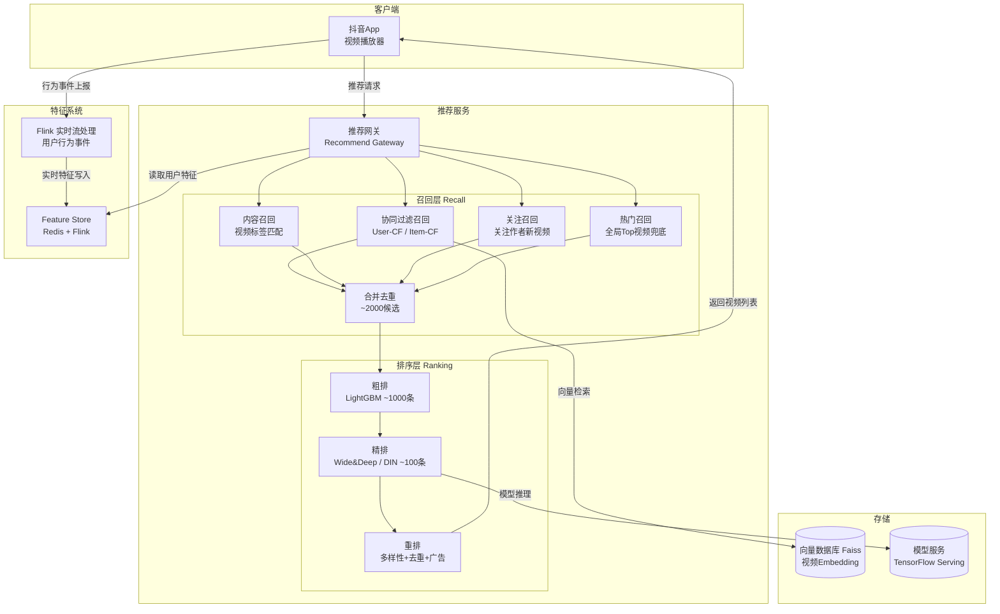
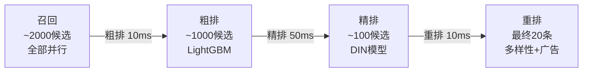
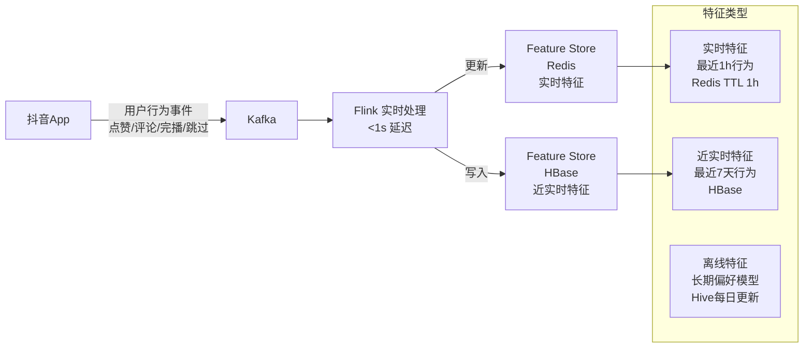
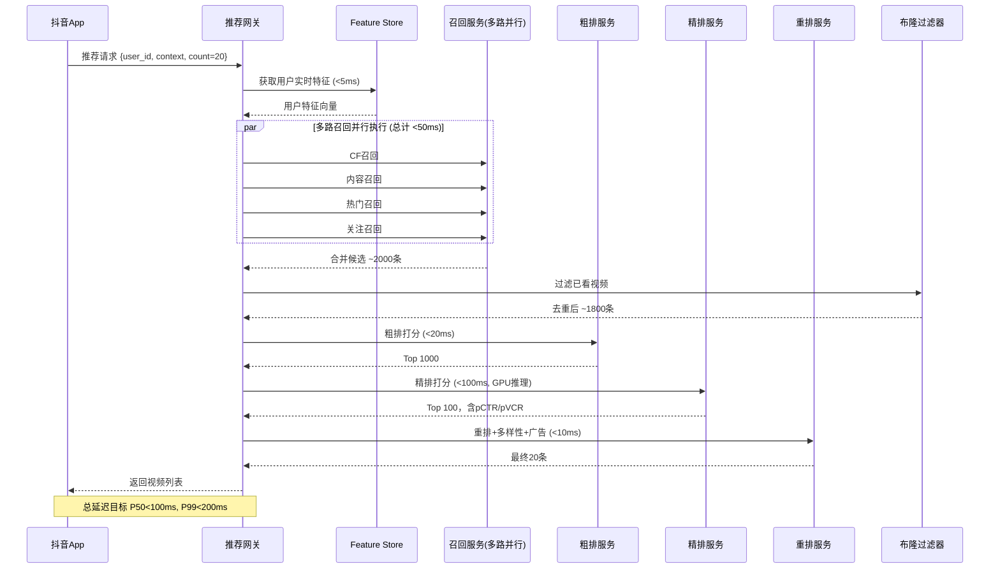

# 抖音推荐流系统设计

> **面试场景：** 字节跳动 / 快手 推荐系统 / 后端高级工程师 系统设计面试  
> **高频指数：** ⭐⭐⭐⭐⭐

## 题目背景

**面试官常见提问方式：**

> "请设计抖音的推荐流系统（For You Page）。用户打开抖音，需要立即看到个性化的视频推荐，无限下滑不重复。系统需要达到亿级 DAU，首刷延迟 P99 < 200ms，你如何设计？"

**业务背景：**

抖音推荐流是字节跳动最核心的技术资产，也是其商业模式的基础。推荐系统决定用户每次打开 App 看到什么内容，直接影响用户留存和时长（用户日均使用时长超过 100 分钟）。与传统搜索不同，推荐不依赖用户主动查询，而是主动"猜测"用户兴趣。

抖音推荐的核心技术挑战：
1. **实时性**：用户点了"不感兴趣"，下一条必须立刻变化
2. **多样性**：防止信息茧房，同时保证用户爱看
3. **新内容消费**：新发布的视频如何快速触达合适用户（冷启动）
4. **冷启动**：新用户如何快速建立兴趣模型

**规模量级（2024年数据）：**

- DAU：700,000,000+
- 视频总量：15,000,000,000+（150亿）
- 新增视频：10,000,000+ 条/天
- 每次推荐请求返回：约 10-20 条视频
- 推荐请求 QPS：700M × (100min/60min) ÷ 次均停留30s = 约 4,000,000 次/秒（含预加载）
- **首刷延迟 P99 < 200ms**（含召回+粗排+精排+重排全流程）

## 关键指标估算

| 指标 | 估算过程 | 结果 |
|------|----------|------|
| 推荐请求 QPS（峰值） | 700M DAU × 100min使用 ÷ 30s/次刷新 ÷ 86400s × 峰值3倍 | ~8,000,000 次/秒 |
| 精排模型推理 QPS | 每次推荐精排 ~200 个候选 × 800万请求/s | 理论约 1.6B/s（用批处理摊平） |
| Feature Store 写入 | 700M用户 × 每分钟更新行为特征 | ~12M 次/秒（Flink流处理） |
| 用户兴趣模型大小 | 700M用户 × 100维向量 × 4B | ~280 GB（需分布式存储） |
| 去重布隆过滤器 | 700M用户 × 7天 × 100视频/天 × 1 bit | ~87 GB |
| 日志数据量 | 700M用户 × 100次曝光 × 200B/次 | ~14 TB/天 |

## 高层架构



## 核心设计决策

### 决策1：多路召回架构

召回的目标是从 150 亿视频中快速筛选出 2000 个候选，每路召回独立并行执行，最后合并去重。

| 召回路 | 方法 | 覆盖场景 | 候选数量 |
|-------|------|---------|---------|
| 协同过滤召回（User-CF） | 找相似用户，推荐他们喜欢的视频 | 主力召回 | ~500 |
| Item-CF 召回 | 基于用户喜欢的视频，找相似视频 | 补充相关内容 | ~300 |
| 内容召回（Content-Based） | 用户兴趣标签 × 视频标签匹配 | 新视频冷启动 | ~300 |
| 关注召回 | 用户关注作者的最新视频 | 维系社交关系 | ~200 |
| 热门召回（Trending） | 全站热门视频（去重用户已看） | 兜底保证质量 | ~200 |
| 地域召回 | 同城/同地区热门内容 | 本地化内容 | ~100 |
| 搜索历史召回 | 用户最近搜索词相关视频 | 延续搜索兴趣 | ~100 |

**向量召回（ANN 检索）：**

协同过滤和 Item-CF 都依赖向量相似度检索：

```python
# 视频 Embedding 存储在 Faiss（Facebook 开源 ANN 库）
# 每个视频 128 维 Embedding 向量（由视频内容 + 交互数据训练）

def recall_similar_videos(user_watched_video_ids, top_k=500):
    # 获取用户最近喜欢的视频 Embedding 的加权平均
    user_interest_vec = weighted_avg([
        get_video_embedding(vid) 
        for vid in user_watched_video_ids[-20:]  # 最近20个
    ])
    
    # Faiss ANN 检索（HNSW 算法，毫秒级检索150亿向量的近似结果）
    distances, video_ids = faiss_index.search(
        user_interest_vec.reshape(1, -1), 
        k=top_k
    )
    
    return video_ids.tolist()
```

### 决策2：排序三级漏斗



**粗排（Coarse Ranking）：**

目标是快速从 2000 筛选到 1000，用轻量级模型（LightGBM/GBDT）快速打分：

特征：视频热度分、发布时间、用户与视频品类的历史交互率（离线特征为主）

**精排（Fine Ranking）——DIN 模型：**

DIN（Deep Interest Network）是字节系推荐的核心排序模型，关键创新是引入 **注意力机制**，对用户历史行为序列进行加权：

```
用户对候选视频的兴趣 = 注意力加权(用户历史行为序列, 候选视频)
```

用户看过 [搞笑视频A, 美食视频B, 搞笑视频C]，推荐搞笑视频D时，历史中的搞笑视频会获得更高的注意力权重，让模型更准确地预估用户对D的偏好。

精排输出 pCTR（预估点击率）和 pVCR（预估完播率），最终分 = α × pCTR + β × pVCR（完播率权重更高）。

**重排（Re-ranking）：**

解决精排结果的多样性问题：

```python
def rerank(candidates, user_id):
    # 1. 去除用户最近7天已看视频（布隆过滤器）
    bloom_key = f"watched:{user_id}"
    candidates = [v for v in candidates 
                  if not bloom_filter.contains(bloom_key, v.video_id)]
    
    # 2. 多样性控制：同一作者/标签不超过2条
    result = []
    author_count = defaultdict(int)
    tag_count = defaultdict(int)
    
    for video in sorted(candidates, key=lambda x: -x.score):
        if author_count[video.author_id] >= 2:
            continue
        if any(tag_count[t] >= 3 for t in video.main_tags):
            continue
        result.append(video)
        author_count[video.author_id] += 1
        for t in video.main_tags:
            tag_count[t] += 1
        if len(result) >= 20:
            break
    
    # 3. 广告插入（第3位、第7位插入广告，确保不连续）
    result = insert_ads(result, positions=[2, 6])
    
    # 4. ε-greedy 探索：5% 概率插入随机高质量视频（打破信息茧房）
    if random.random() < 0.05:
        explore_video = get_random_quality_video(exclude=result)
        result[random.randint(10, 19)] = explore_video
    
    return result
```

### 决策3：实时特征系统

推荐效果依赖特征的实时性，用户刚点了"不感兴趣"，下一次请求就必须反映这个偏好变化。

**实时特征流水线：**



**关键实时特征：**

```python
# Redis Hash 存储用户实时特征（TTL 1小时）
user_realtime_features = {
    "recent_tags": ["搞笑", "美食", "宠物"],     # 最近1h兴趣标签
    "recent_authors": ["author_123", "author_456"], # 最近互动作者
    "dislike_tags": ["广告", "政治"],             # 最近不感兴趣标签
    "last_watch_duration": 45.3,                  # 最近一次完播时长(s)
    "session_video_count": 23,                    # 本次会话已看视频数
    "negative_feedback_count": 2                  # 本次会话负反馈次数
}
```

### 决策4：冷启动策略

**新用户冷启动（没有历史行为）：**

```python
def cold_start_recommend(user_id, device_info, location):
    # 第一步：展示热门视频（Top100，按完播率过滤低质量）
    base_videos = get_trending_videos(category="diverse", count=20)
    
    # 第二步：根据设备信息做基础个性化
    if device_info.language == "en":
        base_videos = filter_by_language(base_videos, "english")
    
    # 第三步：添加"探针视频"——覆盖不同品类，观察用户反应
    probe_videos = select_probe_videos(categories=[
        "搞笑", "美食", "音乐", "体育", "美妆", "科技"
    ])
    
    return interleave(base_videos, probe_videos)

# 用户观看3条后开始建立兴趣模型
def update_cold_start_model(user_id, watch_events):
    interested_categories = [
        event.category 
        for event in watch_events 
        if event.watch_ratio > 0.5  # 看了超过50%认为感兴趣
    ]
    
    if len(interested_categories) >= 2:
        # 已有足够信号，切换到正式推荐模型
        activate_personalized_recommend(user_id, interested_categories)
```

**新视频冷启动（没有交互数据）：**

流量池机制（字节跳动公开的"赛马机制"）：

```
新视频发布
    ↓
第1层流量池：随机推送给 200 人
    ↓ 观察完播率、点赞率
完播率 > 30% → 进入第2层
    ↓
第2层流量池：随机推送给 5,000 人
    ↓
完播率 > 40% → 进入第3层
    ↓
...逐层扩大，最终决定是否成为"爆款"
```

### 决策5：视频预加载

用户体验的关键——切换视频无卡顿：

```python
# 客户端预加载策略
def preload_next_video(current_video, playlist):
    watch_progress = current_video.current_position / current_video.duration
    
    if watch_progress >= 0.5:  # 播放到50%时预加载下一条
        next_video = playlist[current_index + 1]
        
        # HTTP Range Request：只下载视频前3秒（首屏快开）
        preload_range = f"bytes=0-{next_video.first_3s_bytes}"
        http_client.prefetch(next_video.url, range=preload_range)

# 服务端：为每条视频生成首屏分段信息
video_metadata = {
    "video_id": "xxx",
    "url": "https://cdn.tiktok.com/video/xxx.mp4",
    "first_3s_bytes": 524288,    # 前3秒约 0.5MB（720p）
    "duration": 45.3,
    "bitrate_720p": 1200000      # bps
}
```

### 决策6：完播率作为核心指标

**为什么完播率比点赞率更重要？**

| 指标 | 问题 | 原因 |
|------|------|------|
| 点赞数 | 可以被刷 | 机器可以批量点赞 |
| 评论数 | 量少噪声大 | 只有少数用户会评论 |
| 点击率 | 诱导性标题 | 封面党、标题党会虚高CTR |
| **完播率** | **更难造假** | **用户停留时长是真实兴趣的体现** |

**完播率计算：**

```python
def compute_vtr(watch_events):
    """Video Through Rate = 完播率"""
    completed = sum(1 for e in watch_events if e.watch_ratio >= 0.9)
    return completed / len(watch_events)

# 样本标注策略
def label_sample(watch_event):
    ratio = watch_event.watch_ratio
    if ratio >= 0.8:
        return 1   # 正样本（感兴趣）
    elif ratio <= 0.2:
        return 0   # 负样本（不感兴趣）
    else:
        return None  # 中间区间不确定，丢弃（减少噪声）
```

## 详细设计

### 推荐请求时序



### 数据模型

**视频索引（Elasticsearch）**

```json
{
  "video_id": "7123456789",
  "author_id": "author_001",
  "title": "这个猫也太可爱了",
  "tags": ["宠物", "猫咪", "搞笑"],
  "category": "宠物",
  "duration": 32.5,
  "upload_time": "2024-06-01T12:00:00Z",
  "status": "active",
  "quality_score": 0.85,
  "vtr_7d": 0.72,         // 近7天完播率
  "ctr_7d": 0.15,         // 近7天点击率
  "embedding": [0.12, -0.34, ...]  // 128维视频Embedding（存Faiss）
}
```

**用户行为日志（用于模型训练）**

```
user_id | video_id | action | watch_ratio | timestamp | context
-------------------------------------------------------------------
u_001   | v_123    | complete | 0.95      | 1716800000 | {session_id, device, network}
u_001   | v_456    | skip     | 0.08      | 1716800030 | {...}
u_001   | v_789    | like     | 1.0       | 1716800090 | {...}
```

## 踩过的坑 / 生产经验

### 坑1：信息茧房——越推越窄

**现象：** 用户开始多样浏览，但推荐系统优化 CTR 后，给用户推的越来越集中在一个品类（比如用户稍微对健身感兴趣，系统就全部推健身视频），导致用户抱怨"只有一种内容"，最终流失。

**解决方案：ε-greedy 探索机制**

```python
def add_exploration(final_list, user_id, epsilon=0.05):
    n = len(final_list)
    explore_count = max(1, int(n * epsilon))  # 至少1条探索视频
    
    for _ in range(explore_count):
        # 从用户较少接触的品类中随机选取高质量视频
        underexplored_categories = get_underexplored_categories(user_id)
        explore_video = get_quality_video_from_category(
            category=random.choice(underexplored_categories),
            min_vtr=0.4  # 质量兜底
        )
        
        # 替换列表中靠后位置的一条（不影响前几条体验）
        replace_idx = random.randint(n // 2, n - 1)
        final_list[replace_idx] = explore_video
    
    return final_list
```

### 坑2：重复推送——用户已看过的视频再次出现

**现象：** 用户今天刷了某搞笑视频，第二天同一条视频又出现在推荐流中。用户体验极差。

**解决方案：用户级布隆过滤器**

```python
# 每个用户维护一个布隆过滤器，记录最近7天看过的视频
# 误判率 0.1%（10个里最多漏掉1个，可接受）
# 存储在 Redis，Key = watched_bloom:{user_id}，TTL 7天

class UserWatchedBloom:
    def __init__(self, user_id, capacity=10000, error_rate=0.001):
        self.key = f"watched_bloom:{user_id}"
        self.bloom = BloomFilter(capacity, error_rate)
    
    def add(self, video_id):
        self.bloom.add(str(video_id))
        redis.set(self.key, self.bloom.serialize(), ex=7*86400)
    
    def is_watched(self, video_id):
        cached = redis.get(self.key)
        if not cached:
            return False
        bf = BloomFilter.deserialize(cached)
        return bf.check(str(video_id))
```

### 坑3：模型更新不及时导致推荐"过时"

**现象：** 用户对某话题（比如"世界杯"）突然感兴趣，但离线模型每天才更新一次，第二天才能捕捉到用户的新兴趣。推荐严重滞后。

**解决方案：离线+在线双通道**

- **离线模型**（每天更新）：捕捉用户长期偏好，训练全量特征
- **在线实时特征**（Flink，<1s 延迟）：捕捉用户本次会话行为（最近 N 条交互），实时拼接到精排特征中
- 在线特征权重 > 离线特征权重，让最新行为快速影响推荐

### 坑4：精排 GPU 推理延迟不稳定（P99 超标）

**现象：** 精排使用深度学习模型（GPU 推理），正常 P50 约 50ms，但 P99 偶尔超过 500ms，导致整体推荐 P99 超标。

**解决方案：**

1. **批处理推理**：将多个用户的精排请求合并成 batch，提高 GPU 利用率（NVIDIA TensorRT 优化）
2. **超时降级**：精排 > 150ms 时，降级使用粗排结果作为最终结果
3. **模型量化**：FP32 → INT8 量化，推理速度提升 2-4 倍，精度损失 < 1%

## 扩展考点

### 追问方向

**Q：如何评估推荐系统的效果（离线评估 + 在线评估）？**

- **离线指标**：AUC（预估点击率的排序能力）、GAUC（分用户计算 AUC 再平均，更公平）
- **在线指标（A/B Test）**：CTR、完播率、人均时长、留存率（次日/7日留存）
- **A/B Test 流程**：流量分桶（用户级别，保证同一用户在实验期内稳定分组）→ 双侧 t 检验判断显著性 → 灰度放量 → 全量上线

**Q：如何处理推荐系统中的位置偏差（Position Bias）？**

靠前的视频天然有更高的点击率（不一定是因为视频质量好，而是因为排在第一位），如果直接用原始 CTR 训练模型，会强化位置偏差。解决方案：
- 训练时加入位置特征，让模型学会区分"因为位置好才被点"和"因为内容好才被点"
- Inverse Propensity Score（IPS）纠偏：给靠后位置被点击的样本更高权重

**Q：推荐系统的架构如何应对 8M QPS？**

- 召回层：无状态服务，水平扩展
- Feature Store：Redis Cluster（Partition by user_id），读 QPS 约 8M × 10特征读取 = 80M/s（Redis Cluster 可支撑）
- 精排 GPU 集群：按 QPS 弹性扩缩容（K8s + GPU 节点池）

### 边界 Case

- **用户网络差**：返回低码率视频（480p）+ 更少的预加载
- **连续高频刷新**（机器人）：限流（同一用户 1 秒内最多 2 次推荐请求）
- **视频被举报/违规下线**：实时从推荐池中移除（布隆过滤器 + 黑名单 Set）
- **用户清除历史记录**：清除布隆过滤器 + 用户兴趣模型重置为冷启动状态

### 演进路径

```
v1.0：基于规则的推荐（热门 + 随机）
  ↓
v2.0：协同过滤 + 内容召回
  ↓
v3.0：Deep Learning 精排（Wide&Deep）
  ↓
v4.0：实时特征 + DIN 注意力模型
  ↓
v5.0：多目标优化（完播率 + 时长 + 互动 + 多样性 联合建模）
  ↓
v6.0：强化学习推荐（以长期留存为reward，而非短期点击）
```

## 面试评分维度

| 维度 | 基础分（60分） | 加分项（80+分） | 满分项（100分） |
|------|---------------|----------------|----------------|
| **整体架构** | 说出召回+排序两阶段 | 说清楚三级漏斗（召回→粗排→精排→重排） | 完整的数据流 + 各阶段延迟预算分配 |
| **召回设计** | 知道协同过滤和热门召回 | 说出多路并行召回+合并去重 | ANN向量检索、流量池冷启动机制 |
| **排序模型** | 知道机器学习排序 | 说出Wide&Deep / DIN模型特点 | 完播率作为核心目标，位置偏差处理 |
| **实时性** | 提到实时特征 | 说出 Flink 实时处理用户行为 | Feature Store 三层架构（实时/近实时/离线） |
| **工程挑战** | GPU 推理延迟问题 | 预加载策略，P99降级 | 布隆过滤器去重 + ε-greedy 探索机制 |
| **生产经验** | 了解信息茧房问题 | 提出 ε-greedy 探索解法 | 结合实际案例（模型更新滞后、GPU P99超标）说出优化方案 |
