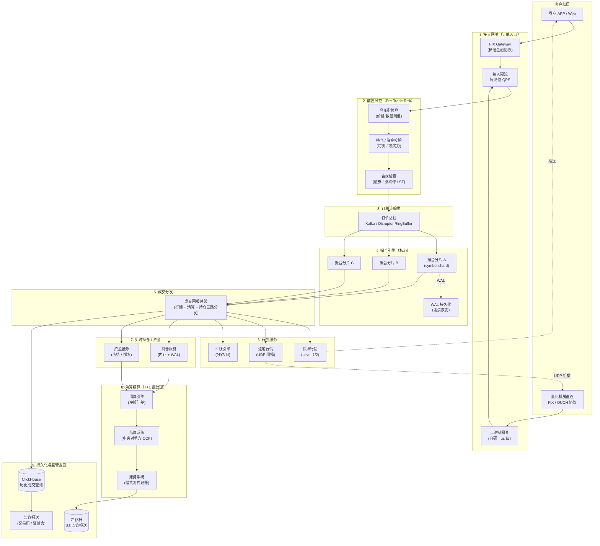
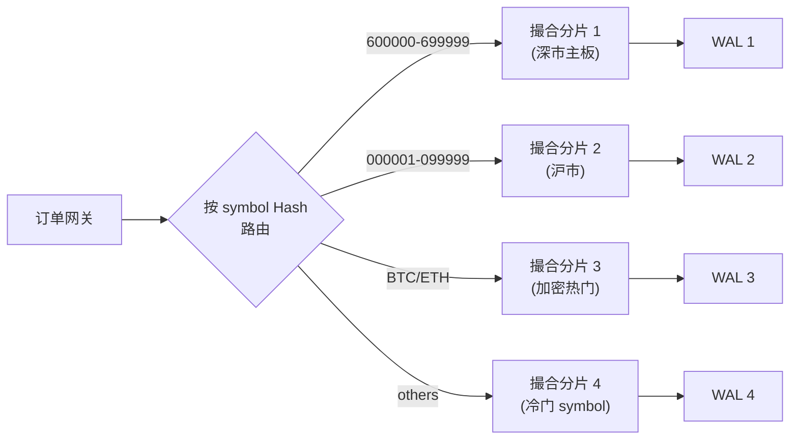
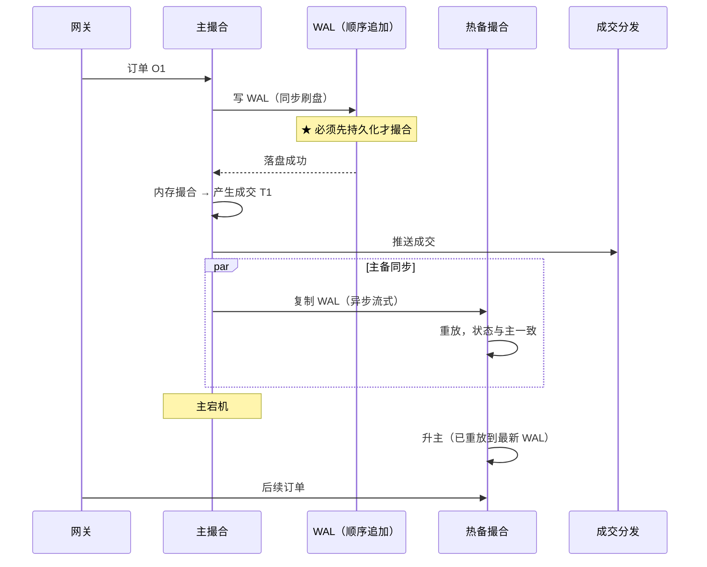

# 证券交易系统设计（Order Book / 撮合 / 清算）

> **面试场景：** 券商 / 加密交易所 / 量化基金 / 摩根 / 高盛 / Citadel / Jump / 蚂蚁数科 高级后端工程师 / 架构师  
> **高频指数：** ⭐⭐⭐⭐⭐（金融科技岗必考、其他岗高频问的进阶题）

## 题目背景

**面试官原话：**
> "请设计一个证券交易系统，类似纳斯达克或者币安的核心。重点说说订单进系统到撮合成交、结算入账整个链路怎么做，以及怎么扛住高并发、保证撮合公平、防止资金错账。"

**业务背景：**

| 系统 | 峰值订单 TPS | 单笔时延（接单到回报） | 撮合方式 |
|------|------|------|------|
| **NASDAQ INET** | 10w+/秒（单 symbol）| < 50μs | 单线程 + 共享内存 |
| **LSE Millennium** | 数十万/秒（全市场）| < 100μs | 同上 |
| **LMAX Disruptor** | 600w/秒（单核！）| < 10μs | Disruptor ring buffer |
| **币安 Spot** | 140 万/秒 | < 5ms | 内存撮合 + 集群 |
| **A 股集合竞价 9:15-9:25** | 数百万委托 | 9:25 一次性出清算价 | 集合竞价算法 |
| **A 股连续竞价 9:30-15:00** | 几十万 TPS | < 100ms（券商→交易所） | 价格优先 + 时间优先 |

**与普通业务系统的本质区别：**

| 维度 | 普通系统（如电商）| 交易系统 |
|------|------|------|
| **时延要求** | 100ms 可接受 | **微秒级**（HFT 高频争 1μs）|
| **撮合公平** | 不需要 | **价格优先 + 时间优先**铁律 |
| **数据准确** | 偶尔丢条订单可接受 | **0 容错**（多吃 1 分钱面临监管罚款）|
| **复盘要求** | 一般 | 每笔订单全链路时间戳可追溯（监管 7 年保存）|
| **熔断** | 限流即可 | 涨跌停 / 异常波动暂停撮合（监管规则）|
| **并发模型** | 多线程加锁 | **单线程撮合**（消除锁、cache miss）|

---

## 关键指标估算

| 指标 | 估算 | 结果 |
|------|------|------|
| **峰值订单 TPS（A 股开盘后 10 分钟）**| 5000 个 symbol × 1000 单/秒/symbol | **500w TPS** 全市场峰值 |
| **单 symbol 峰值** | 茅台 / Apple / BTC 等热门 | **10w TPS**（撮合核心瓶颈）|
| **撮合时延** | 接单 → 回报客户 | **P99 < 1ms**（券商 RTT），交易所内 < 100μs |
| **行情推送 QPS** | 5000 symbol × 100 订阅者 × 10 次/秒 update | **500w QPS** 推送（用 UDP 组播）|
| **日订单存储** | 500w TPS × 4 小时高峰 + 4 小时平峰 ≈ **300 亿条/天** | 单条 200B → **6TB/天**，需 ClickHouse + 冷存 |
| **行情快照** | 5000 symbol × Level-2 50 档 × 100ms/次 | 持续 **50MB/s** 落盘 |
| **集合竞价瞬时** | A 股 9:25 集合竞价出清算 | 5000 symbol 在 **1 秒内**完成全部计算 |
| **结算批次** | T+1 日终清算 | 单日 **300 亿笔成交** × 2 边 = 600 亿账务记录 |

---

## 系统架构（端到端 9 层）



---

## 核心设计决策

### 决策一：撮合引擎为什么单线程 + Disruptor

**问题：** 撮合 = 内存里改两个 TreeMap。看似可以多线程加速，但实际所有顶级交易所都用**单线程**。

**LMAX Disruptor 哲学（2010 年震惊金融业）**：

| 多线程方案的隐藏成本 | 损耗 |
|------|------|
| `synchronized` 加锁 | 100ns 级 |
| 锁竞争失败 → 上下文切换 | 5μs+ |
| Cache line false sharing | 50–100 cycle 浪费 |
| GC 跨线程指针追踪 | 不可控 |
| 内存屏障 / volatile 读写 | 数十 cycle |

**单线程 + Disruptor 收益**：单核 600w TPS（LMAX 2010 年实测，4 核机器），**比当时多线程撮合快 10×**。

```
       订单总线（Disruptor Ring Buffer，无锁 SPSC）
       ┌─────────────────────────────────────────┐
       │  [O1] [O2] [O3] [O4] ... [On]            │
       └──────────────────────────┬──────────────┘
       Producer (Gateway) ─────────┤
                                   │
                          ┌────────▼────────┐
                          │  撮合线程（单线程）│ ← 永远只有这一个
                          │                  │
                          │  TreeMap<Bid>    │
                          │  TreeMap<Ask>    │
                          │  Map<OrderId>    │
                          └────────┬────────┘
                                   │
                          ┌────────▼────────┐
                          │  成交 Ring Buffer │
                          └───┬──────┬──────┘
                              ▼      ▼      ▼
                          行情   清算   持仓
                         (并行消费)
```

**Disruptor 关键技术**：
- **Ring Buffer**：固定大小数组，避免 GC 和分配开销
- **CAS 替代锁**：生产/消费指针用 `AtomicLong`，无锁推进
- **Padding 防 false sharing**：序列号变量前后各加 7 个 long 字段，独占 cache line
- **批量处理**：一次取多个事件减少 cache miss
- **Wait Strategy**：BusySpin（μs 级延迟）/ Yielding / Sleeping，按延迟预算选

**详细的撮合引擎代码实现** 见算法章节：[撮合引擎手撕](../../data-structures-and-algorithms/tree/matching-engine)，本页只讲架构。

---

### 决策二：怎么撮合公平——价格优先 + 时间优先

**铁律**（几乎所有正规交易所都用）：

1. **价格优先（Price Priority）**：买单中**最高价**优先，卖单中**最低价**优先
2. **时间优先（Time Priority）**：同价档内**先挂的单先成交**

**数据结构选择**：

| 方案 | 取最优价 | 同档 FIFO | 撤单 | 适用 |
|------|------|------|------|------|
| `TreeMap<Price, Deque<Order>>` | O(log n) | ✅ Deque | O(log n) | **生产标准** |
| `PriorityQueue<Order>` | O(1) | ❌ **堆不保证 FIFO** | O(n) | ❌ 违反时间优先 |
| `SkipList<Price>` | O(log n) | ✅ | O(log n) | 同 TreeMap |

**为什么不能用堆**：堆只保证父子关系，同优先级元素顺序不确定，**违反时间优先原则**。这是面试爆点 —— 90% 的候选人第一反应是 PriorityQueue，是错的。

### 撮合规则的变种（深度追问）

| 规则 | 描述 | 使用市场 |
|------|------|------|
| **Price-Time Priority** | 价格优先 + 时间优先 | NASDAQ / NYSE / A 股 / 币安 |
| **Pro-Rata** | 同价档按订单量按比例分配 | CME 部分合约（国债期货）|
| **Pro-Rata with Top** | 第一个挂的单优先成交，剩余按比例 | CBOT |
| **集合竞价（Call Auction）** | 一段时间内累积委托，统一在某时刻按算法出清算价 | A 股开盘 9:25 / 收盘 14:57-15:00 |
| **暗池（Dark Pool）** | 不公开 Order Book，按中间价撮合 | 美国机构投资者 |

### 集合竞价的算法（A 股开盘价怎么算）

**目标**：找一个价格 P 使得**成交量最大**（满足条件的多个价格再按"未成交量最小"等次级规则）。

```
所有买单按价格降序、所有卖单按价格升序，对每个候选价 P 计算：
  - 买方累积量 = 所有报价 ≥ P 的买单总量
  - 卖方累积量 = 所有报价 ≤ P 的卖单总量
  - 成交量(P) = min(买方累积, 卖方累积)

取使 成交量(P) 最大的 P 作为开盘价。
```

复杂度：O(N log N) 排序 + O(N) 扫描候选价。

---

### 决策三：怎么扛 500w TPS——按 symbol 分片

**单线程撮合的天花板**：单核 600w TPS（LMAX 数据），但**单 symbol 单线程**——茅台 / Apple / BTC 等热门 symbol 单股 10w TPS 即可应付。

**分片策略**：按 symbol 路由到不同撮合线程



**关键约束**：同一个 symbol 的订单**必须**进同一个分片（撮合需要全局视图）。**不能 round-robin**！

**热点 symbol 处理**：

| 场景 | 方案 |
|------|------|
| 单 symbol 超过 10w TPS（极少见）| 拆分撮合：按时间窗口分段（毫秒级聚合）|
| Hot symbol 集中在某分片导致 CPU 100% | **手动调度**：单独给该 symbol 一台独占机器 |
| 新股上市 / 重大新闻日 | 提前预热 → 单独物理隔离 |

---

### 决策四：怎么保证不丢单——WAL + 主备同步

**问题**：撮合引擎全内存运行，机器宕机内存全没；订单簿丢失意味着挂单全部失效，违反监管。

**双重保护：WAL + 热备**



**WAL 设计要点**：

| 维度 | 实现 |
|------|------|
| **写入策略** | 顺序 append（O_DIRECT 绕过 page cache）+ fsync 后才确认 |
| **格式** | 二进制定长记录 + CRC32 校验 |
| **吞吐** | NVMe SSD 顺序写 **2-5GB/s**，可支撑百万 TPS |
| **延迟** | fsync ~100μs（**这是瓶颈**），可批量 fsync（group commit）|
| **崩溃恢复** | 启动时按序重放 WAL，**< 5 分钟恢复 500w 单**|
| **快照** | 定期 dump 内存订单簿 + 截断老 WAL（控制重放时间）|

**异地多活（监管要求）**：
- 同城双活：主备数据中心同步复制（< 1ms 距离）
- 异地灾备：异步复制到 200km 外（< 10ms），切换时可能丢秒级数据但合规接受
- 三机房：上海 + 深圳 + 北京（金融云通常这么搭）

---

### 决策五：行情推送——为什么用 UDP 组播

**问题**：每个成交事件要推送给**所有订阅者**（券商、量化、行情终端），TCP 单播 N×M 复杂度爆炸。

**对比**：

| 协议 | 优点 | 缺点 | 适用 |
|------|------|------|------|
| **TCP 单播** | 可靠、易实现 | 1 个成交 → N 次发送，N 大时爆炸 | 个人投资者 APP（少量订阅）|
| **WebSocket 单播** | 兼容浏览器 | 同上 | Web 行情终端 |
| **UDP 组播（Multicast）**| 1 次发送 → 路由器复制到 N 个订阅者 | **可能丢包**、要重传机制 | 交易所内部 / 量化机房直连 |
| **Kafka** | 高吞吐、可重放 | ms 级延迟，对 HFT 太慢 | 内部异步流转 |

**生产架构**：双通道

```
                  ┌─────────────────────┐
       成交 ────> │  Snapshot Builder    │  → TCP 推送（API 用户）
                  │  增量 + 快照（10ms）│
                  └─────────────────────┘
                  
                  ┌─────────────────────┐
       成交 ────> │  UDP Multicast       │  → 组播（量化机房）
                  │  (按 symbol 分组)    │     收单 + 缺失检测请求重传
                  └─────────────────────┘
```

**Level-1 / Level-2 / Level-3 行情**：

| 等级 | 内容 | 频率 | 价格 |
|------|------|------|------|
| **L1** | 最优买/卖 1 档 + 成交价量 | 3-5 秒 | 免费 |
| **L2** | 买卖 5 档 / 10 档 + 成交 | 实时 | 几百元/月 |
| **L3 / DMA** | 全订单簿 + 逐笔委托 / 逐笔成交 | 实时 | 几千-万元/月（券商成本）|

---

### 决策六：T+1 清算与净额轧差

**核心问题**：A 股 1 天 5w+ 投资者，平均每人 50 笔成交，单日 250w 笔交易。如果每笔都银行间转账，**TPS 银行体系扛不住**。

**净额轧差（Netting）**：

```
原始成交（每笔都要转账）：
  小明 买 茅台 100 股 @1800     (- 18 万)
  小明 卖 茅台 50 股  @1810     (+ 9.05 万)
  小明 买 五粮液 200 股 @200    (- 4 万)
  小明 卖 茅台 30 股  @1820     (+ 5.46 万)
  → 4 笔交易，4 次资金调拨

净额轧差后：
  小明 净持仓：茅台 +20 股、五粮液 +200 股
  小明 净资金：-7.49 万
  → 1 次资金调拨完成
```

**资金调拨笔数：250w → 5w**（按投资者数），降 **50×**。

### 中央对手方（CCP）

**问题**：买卖双方互不信任（不知道对方有没有钱 / 股）。

**方案**：中央对手方插入两侧成为合约对手方

```
原始：小明（买）⇄ 小红（卖）   ← 双方互为对手方
                ↓
插入 CCP：
    小明 ⇄ CCP ⇄ 小红
    
小明只跟 CCP 结算（不用关心小红有没有股票）
小红只跟 CCP 结算（不用关心小明有没有钱）
CCP 通过保证金 + 风险准备金扛极端风险
```

**A 股 CCP = 中国结算（CSDC）**，美国 = DTCC。

### T+0 / T+1 / T+2 区别

| 模式 | 含义 | 适用 |
|------|------|------|
| **T+0 撮合，T+0 结算** | 当天买当天能卖、当天到账 | 加密货币 / 港股部分品种 |
| **T+0 撮合，T+1 结算** | 当天买次日能卖 / 资金次日 | **A 股**（防过度投机）|
| **T+0 撮合，T+2 结算** | 当天买次日能卖、资金 T+2 | 美股 / 大部分欧洲市场 |
| **T+0 全程** | 实时结算 | 加密、央行数字货币（DCEP）目标 |

---

### 决策七：风控分层

**前置风控（Pre-Trade）—— 撮合前必过的关卡**：

| 检查 | 目的 | 时延 |
|------|------|------|
| **资金可用** | 买力 ≥ 委托金额 + 手续费 | < 10μs |
| **持仓可卖** | 卖出量 ≤ 可卖持仓 | < 10μs |
| **乌龙指**（Fat Finger）| 委托价 vs 当前价偏离 > 10% 拒绝 | < 5μs |
| **涨跌停** | A 股 ±10%、ST ±5% | < 5μs |
| **融资融券额度** | 融券余量充足 | < 50μs |
| **合规** | 内幕交易黑名单、敏感岗位 | < 50μs |

**实时风控（In-Flight）—— 撮合后立刻触发**：

| 检查 | 触发动作 |
|------|---------|
| 单日亏损 > 阈值 | 强制平仓 / 暂停下单 |
| 单 symbol 持仓 > 总仓 50% | 警告 + 限制加仓 |
| 异常订单模式（疑似刷量）| 人工审核 |

**事后风控（Post-Trade）—— T+1 监管报送**：

| 检查 | 目的 |
|------|------|
| 异常交易识别 | 拉抬打压 / 虚假申报 / 自买自卖 |
| 大单监控 | 反洗钱（AML）|
| 跨市场操纵 | 同一账户在多市场异常 |

**风控的金句**：**前置风控决定能不能下单，实时风控决定能不能继续交易，事后风控决定要不要罚款**。

---

### 决策八：异常交易暂停（熔断）

| 触发 | 动作 |
|------|------|
| **个股涨跌停**（A 股 ±10%）| 单 symbol 撮合**暂停涨/跌方向**，但反向可继续 |
| **熔断阈值**（沪深 300 ±5%、±7%）| 全市场 5 分钟暂停 / 7% 全天暂停（2016 年试行后取消，留作监管储备）|
| **异常波动**（1 分钟跌停回拉 5%）| 触发自我审查，可能停牌 |
| **重大新闻**（公司公告）| 临时停牌 |
| **闪崩**（美股 2010 闪崩、SEC Rule 48）| Limit Up / Limit Down 机制 |
| **系统故障** | 紧急停市，已成交保留 / 未撮合订单全部撤销 |

**实现要点**：撮合引擎接收熔断指令时，**当前 batch 必须完成**，下一批拒绝；状态写入 WAL，重启后保持。

---

## 数据存储

### 订单与成交存储

```sql
-- 订单表（每天分区）
CREATE TABLE orders_20260615 (
    order_id        BIGINT PRIMARY KEY,         -- 雪花算法
    client_order_id VARCHAR(40) NOT NULL,        -- 客户端自带的幂等 ID
    user_id         BIGINT NOT NULL,
    symbol          VARCHAR(16) NOT NULL,
    side            TINYINT NOT NULL,            -- 1 买 2 卖
    order_type      TINYINT NOT NULL,            -- 1 限价 2 市价 3 IOC 4 FOK
    price           BIGINT NOT NULL,             -- ★ 整数 ticks（×10000）
    qty             BIGINT NOT NULL,
    filled_qty      BIGINT DEFAULT 0,
    status          TINYINT NOT NULL,            -- 0 待撮合 1 部分成交 2 完全成交 3 已撤
    submit_time     BIGINT NOT NULL,             -- 纳秒时间戳
    UNIQUE KEY uk_client_order (user_id, client_order_id),
    KEY idx_user_symbol (user_id, symbol, submit_time)
) ENGINE=InnoDB
PARTITION BY HASH(user_id) PARTITIONS 1024;

-- 成交表
CREATE TABLE trades_20260615 (
    trade_id        BIGINT PRIMARY KEY,
    symbol          VARCHAR(16) NOT NULL,
    buy_order_id    BIGINT NOT NULL,
    sell_order_id   BIGINT NOT NULL,
    price           BIGINT NOT NULL,
    qty             BIGINT NOT NULL,
    trade_time      BIGINT NOT NULL,             -- 纳秒
    KEY idx_symbol_time (symbol, trade_time)
) ENGINE=InnoDB
PARTITION BY HASH(symbol) PARTITIONS 64;
```

**为什么价格用整数 ticks 不用 DECIMAL/double**：
- `double` 精度坑：`0.1 + 0.2 != 0.3`，金融场景**完全禁用**
- `DECIMAL(20,4)` 软件计算慢 + 占空间
- **整数 ticks**（如 18.0001 → 180001 × 10^4）：硬件 cmp/add **1 cycle**，10x 快

### 行情存储

| 数据 | 存储 |
|------|------|
| **实时订单簿** | 内存 + WAL（撮合引擎内）|
| **L1/L2 快照（10ms 一次）**| Redis / 自研内存 KV → ClickHouse 历史 |
| **逐笔成交** | Kafka 流转 + ClickHouse 落盘 |
| **K 线（1m/5m/...）** | TimescaleDB / ClickHouse / InfluxDB |
| **历史 K 线** | Parquet + S3（冷存）|

**ClickHouse 选择理由**：列存压缩比 10×、按时间分区扫描快、聚合 SQL μs 级。详见 [data-warehouse.md ClickHouse 章节](../../databases/data-warehouse#clickhouse-深度)。

---

## 踩过的坑 / 生产经验

### 坑一：撮合用了 PriorityQueue，时间优先失效被监管处罚

**事故经过**：早期某交易所用 Java `PriorityQueue<Order>`（按价格排序），堆中同价订单顺序不固定。结果：高频做市商发现同时下 100 单时**后挂的反而先成交**——违反"时间优先"铁律。监管检测到 → 罚款 + 系统停牌整改。

**解决方案**：改用 `TreeMap<Price, ArrayDeque<Order>>` 双层结构——价格用 TreeMap 有序，同价档用 ArrayDeque 严格 FIFO。

**面试金句**：**所有正规交易所撮合都不能用堆——这是面试官最爱的细节考点**。

---

### 坑二：单线程撮合的 GC 暂停 = 全市场冻结

**事故经过**：早期撮合引擎跑在 JDK 8 + CMS GC，单次 Full GC 暂停 500ms。9:30 开盘高峰恰好触发，全市场撮合冻结 500ms，期间数十万订单堆积，恢复后大量"延迟成交"导致价格瞬间剧烈波动。

**解决方案**：
1. **撮合机用 ZGC / Shenandoah**：单次 STW < 1ms（详见 [java-modern-features.md GC 演进章节](../../programming-languages/java-modern-features)）
2. **预分配对象池**：撮合热路径**零分配**（订单/成交对象复用）
3. **关闭 JIT 优化中的去优化**：JIT 编译完成后**禁止 deoptimize**
4. **更激进**：用 C++ 重写撮合核心（LMAX、Binance 都这么做）

---

### 坑三：行情推送丢包导致客户端订单簿不一致

**事故经过**：UDP 组播丢包 → 客户端漏掉一个成交 → 本地维护的订单簿与交易所不一致 → 量化策略基于错误数据交易亏损上百万。

**解决方案**：
1. **每条消息带 SeqNum**：客户端检测到不连续立即请求重传
2. **快照 + 增量 dual**：每 10s 推送一次全量快照，客户端可重建
3. **TCP 兜底通道**：组播丢失时回退到 TCP 拉取
4. **客户端 SDK 内置 Gap Detection**：自动处理重传，业务无感

---

### 坑四：跨日订单状态错乱

**事故经过**：9:00 - 9:25 集合竞价时段挂的限价单，9:25 集合竞价完成后状态未及时同步到下游持仓系统。9:30 连续竞价开始后，持仓系统仍认为该订单"待成交"，导致用户看到的可用资金错误。

**解决方案**：
1. **状态变更全链路事件化**：成交 → Kafka → 所有下游订阅（持仓 / 风控 / 客户端推送）
2. **状态机严格定义**：限定 `Pending → PartialFilled → Filled → Closed` 的合法转换
3. **对账**：每天收盘后对比撮合系统 vs 持仓系统的订单状态，差异告警

---

### 坑五：清算时账户不平衡（资金 ≠ 持仓 × 成交价）

**事故经过**：T+1 清算时发现 12 万用户中有 87 个账户出现 0.01-0.5 元的金额差。根因：撮合用整数 ticks，但下游某服务转 `double` 处理后又转回 `BigDecimal`，精度丢失。

**解决方案**：
1. **全链路统一用整数**（"分"或"厘"为基本单位，到展示层才除）
2. **借贷平衡校验**：每笔成交两边账（买方借资金贷股、卖方借股贷资金）必须**和为 0**，不为 0 立即告警
3. **T+0 对账**：实时检测当日账务平衡，不等到 T+1

---

### 坑六：FIX 协议解析慢导致接单时延爆涨

**事故经过**：用开源 QuickFIX/J 接 FIX 4.4 协议，单消息解析 50μs，市场开盘时单台网关 QPS 几千就 CPU 打满。

**解决方案**：
1. **自研二进制协议**（OUCH 类似）：消息定长、按 byte offset 解析，**< 1μs**
2. **量化客户必须用二进制**，FIX 通道只给传统券商
3. **网关旁路**：风控前置到网关内，省一次 RPC

---

## 扩展考点

### 追问方向

#### 1. 怎么扛"双 11" 级别的开盘潮（A 股 9:15-9:30）

```
9:15-9:25 集合竞价：累积委托不撮合 → 网关 + 风控压力大
9:25:00.000 集合撮合：单点瞬时算 5000 个 symbol 的开盘价 → CPU 短时 100%
9:25:00.001 - 9:30 期间：不能下新单（监管规则），等连续撮合启动
9:30:00 连续撮合开始：撮合引擎瞬时 TPS 拉爆
```

**对策**：
- 集合竞价撮合**预先扩容 5 倍 CPU**（云原生场景秒级伸缩）
- 网关层做**令牌桶预分配**，提前预扣可用单数
- 9:30 开盘前撮合引擎**预热 JIT**（用历史数据回放）

#### 2. 极端行情下系统怎么保命

| 极端事件 | 策略 |
|------|------|
| 单 symbol 1 秒 100w 单 | 单 symbol 临时**升级机器规格**或拒绝新挂单 |
| 全市场涨/跌停 | 触发熔断，5 分钟冷静期 |
| 网关 OOM | Pod 自动重启 + 滚动恢复，期间限流 |
| 撮合 WAL 写不动 | 立即停接新单（不能丢单），等 SSD 恢复 |
| 行情服务挂 | 客户端自动切到备用通道（DNS 故障转移）|

#### 3. 怎么实现 HFT 友好的低延迟

| 优化 | 收益 |
|------|------|
| **托管在交易所机房**（Colocation） | 网络 RTT 从 ms → μs |
| **专线直连** + **自研协议** | 省去公网 + HTTP 解析 |
| **内核旁路**（Solarflare、DPDK、io_uring）| 网络栈延迟 -90% |
| **CPU 亲和性绑定** + **关闭超线程** | 消除上下文切换 |
| **大页内存**（HugePages） | TLB miss -10× |
| **FPGA 硬件撮合** | μs → ns（NASDAQ 部分品种已用）|

#### 4. 加密交易所 vs 股票交易所架构差异

| 维度 | 股票交易所 | 加密交易所 |
|------|------|------|
| **撮合** | 同一交易所只撮内盘 | 内盘 + 跨所做市套利 |
| **结算** | T+1，CCP 兜底 | **T+0**（链上转账完成即结算）|
| **资金** | 法币 + 银行 | **多链多币**（BTC/ETH/USDT 各自不同链）|
| **持仓** | 集中式（证券公司账户）| 自托管 + 平台托管混合 |
| **风险** | 涨跌停 + 监管熔断 | 杠杆爆仓 + 链上提款 |
| **可用性** | 9:30-15:00 5h，周末停 | **7×24 不停**，灾备要求极高 |

#### 5. 怎么做单元化（异地多活）

**问题**：交易所必须异地多活，但订单簿是有状态的，不能两地同时撮合同一 symbol。

**单元化方案**：
- **按 symbol 划分单元**：A 股按板块（沪市单元 / 深市单元），单元间不需要同步
- **同单元内主备同步**：同城双活 + 异地灾备
- **客户端按 symbol 路由**：买茅台直连深圳单元，买宁德时代直连上海单元
- **跨单元交易禁止**：A 股没这需求；加密所则需要"撮合所"与"清算所"分离

### 边界 Case

- **市价单遇到对手盘干涸**：余下部分按规则**取消**（IOC）或**转挂单**
- **同账户买卖同 symbol**（自成交，wash trading）：监管视为操纵市场，**STP 防护**主动撤销
- **冰山订单（Iceberg）**：客户挂 10w 但只显示 1000 给市场，每成交 1000 自动补 1000
- **撤单速度战**：HFT 改单速度比新挂单快——支持**Modify in place** API
- **集合竞价价格无解**（没有任何价格能促成成交）：开盘价 = 前收盘价

### 演进路径

```
Phase 1：单机 Java + 多线程加锁撮合
    ↓ 1w TPS / 个人投资 demo
Phase 2：单线程撮合 + Disruptor + WAL
    ↓ 10w TPS / 单 symbol
Phase 3：按 symbol 分片 + 主备热切
    ↓ 100w TPS / 全市场
Phase 4：单元化 + 异地多活 + UDP 组播行情
    ↓ 500w TPS / 监管合规
Phase 5：FPGA 硬件撮合 + 内核旁路 + Colocation
    ↓ μs 级 HFT / 顶级交易所
Phase 6：T+0 实时结算 + 链上清算
    → 加密 / 未来 CBDC 方向
```

### 答题模板（10 分钟标准答法）

> 1. **澄清需求**：股票 / 期货 / 加密？需要 HFT 级延迟还是普通券商？日订单量？
> 2. **算 9 层架构图**：网关 → 风控 → 订单总线 → 撮合 → 成交分发 → 行情 / 持仓 / 清算 → 存储
> 3. **撮合核心 3 句话**：**单线程 + Disruptor**（消除锁/cache miss）+ **TreeMap 双层结构**（保证价格优先 + 时间优先，**不能用 PQ**）+ **WAL 持久化**（崩溃恢复）
> 4. **扩展性**：**按 symbol 分片**，单 symbol 单线程，热点 symbol 独占机器
> 5. **可靠性**：**主备热同步** + 异地多活 + UDP 组播 + Gap Detection
> 6. **正确性**：**价格用整数 ticks**（绝不用 double）+ **借贷平衡校验** + **T+1 对账**
> 7. **风控分层**：前置（资金/乌龙指）+ 实时（亏损/异常）+ 事后（监管报送）

## 相关章节

- 算法层：[撮合引擎手撕代码](../../data-structures-and-algorithms/tree/matching-engine) — TreeMap + Deque 双层结构、买卖盘对撮、撤单实现
- 支付侧：[支付宝支付系统](./alipay-payment) — TCC 分布式事务、幂等设计、对账系统
- 设计模式：[消息队列 Kafka 事务消息](../message-queue) — 成交分发的 Exactly-Once 保证
- 性能：[Java 并发 Disruptor](../../programming-languages/java-concurrency) — LMAX Disruptor 内部原理
- IO：[io_uring 深度](../../operating-systems/io-model#io_uring-深度解析) — 低延迟场景的内核旁路
