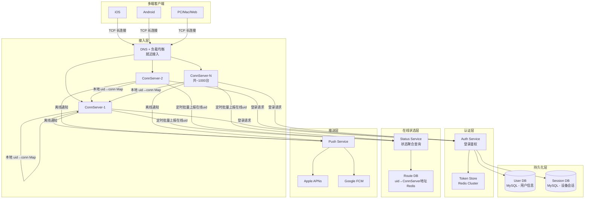
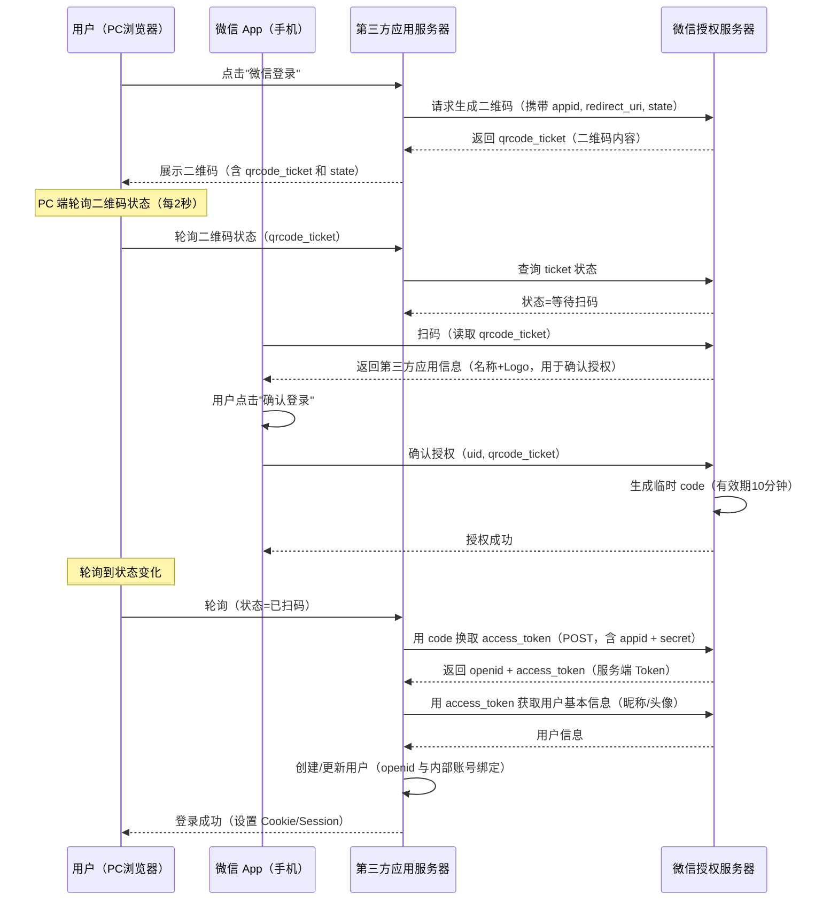
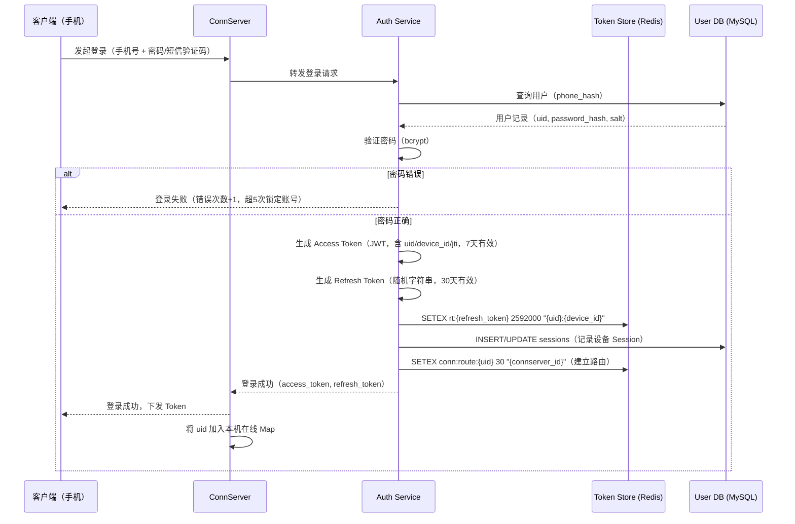
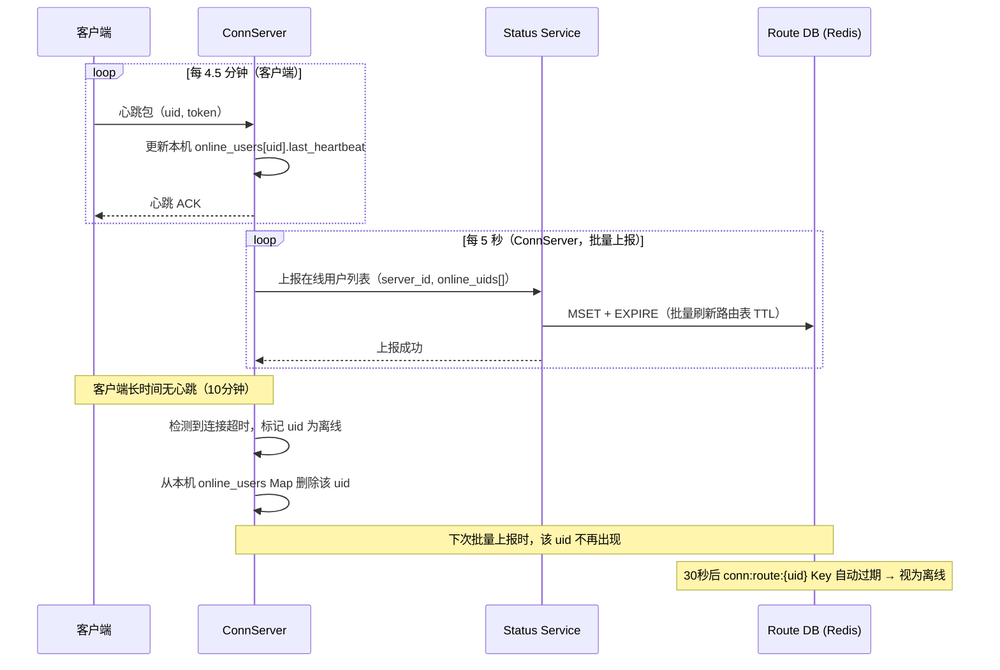

# 微信登录与10亿在线状态系统设计

> **面试场景：** 腾讯 / 阿里 / 美团 资深后端 / 架构师系统设计面试  
> **高频指数：** ⭐⭐⭐⭐⭐

## 题目背景

**面试官提问方式：**

> "微信有 13 亿注册用户，峰值同时在线超过 10 亿人。请设计一套登录认证系统，并解释如何高效存储和查询这 10 亿用户的在线状态。特别说明：当我查看好友是否在线时，系统是如何工作的？"

**业务背景：**

登录与在线状态是 IM 系统的基础能力，看似简单，实则蕴含大量工程难点：

- **登录**：如何安全签发凭证？如何支持多端同时在线？如何强制踢下线？
- **在线状态**：13 亿用户的状态数据如何存储？如何做到既节省内存，又能快速查询？
- **好友状态展示**：用户有 200 个好友，刷新时需要批量查询 200 个人的状态——这个操作每天触发数百亿次，如何避免成为系统瓶颈？

**规模量级：**

- 注册用户：13 亿
- 峰值同时在线：10 亿+
- 长连接数量（ConnServer 层）：10 亿个 TCP 连接
- ConnServer 集群：约 1000 台（每台维护 100 万连接）
- 登录 QPS（均值）：约 2 万 QPS（每天约 17 亿次登录，含自动续期）
- 在线状态查询 QPS：约 50 万 QPS（读多写少）
- 在线状态更新 QPS：约 10 万 QPS（登录/登出/心跳上报）
- 状态数据精度要求：1~2 分钟延迟可接受（不要求实时精确）

---

## 关键指标估算

| 指标 | 估算过程 | 结果 |
|------|----------|------|
| 峰值在线用户 | 13亿 × 80% 日活 × 90% 同时在线率 | ~9.4 亿，取整 ~10 亿 |
| 状态数据内存（全量 Redis） | 10亿 × 每条记录 64字节（uid + connserver地址） | ~64 GB（Redis 可承受） |
| ConnServer 台数 | 10亿连接 / 每台100万连接 | ~1000 台 |
| 心跳上报 QPS | 10亿连接 / 心跳间隔300s | ~333 万 QPS！（不可接受） |
| 心跳上报 QPS（优化后，批量聚合） | 1000台 ConnServer × 每台每5s上报一次 | ~200 QPS（可接受） |
| 状态查询 QPS | 9亿 DAU × 平均每天查10次好友状态 / 86400s | ~10.4万 QPS（均值），峰值 ~50万 QPS |
| Token 存储（Redis） | 10亿用户 × 2个Token（Access+Refresh） × 200字节 | ~400 GB（可接受，Redis Cluster） |

**心跳设计的关键洞察：**

```
错误方案：每个客户端直接向 Status Service 上报心跳
  10亿连接 / 300秒 = 333万 QPS → Status Service 无法承受

正确方案：客户端心跳打到 ConnServer（维护连接），
          ConnServer 定期聚合批量上报给 Status Service
  1000台 ConnServer × 每5秒上报一次 = 200 QPS → 完全可接受
```

---

## 高层架构



---

## 核心设计决策

### 决策一：认证方案——双 Token 机制

**为什么不用 Session + Cookie？**

- 移动端无 Cookie 机制，需要显式管理 Token
- Session 服务端有状态，水平扩展需要做 Session 共享（增加复杂度）
- JWT 无状态，适合分布式系统，但无法主动踢下线（是 JWT 的最大缺陷）

**微信实际方案：JWT Access Token + Opaque Refresh Token，双 Token 存 Redis**

```
Access Token（短期，7天）：
  - JWT 格式：Header.Payload.Signature
  - Payload 包含：uid, device_id, issued_at, expires_at
  - 用于所有 API 请求鉴权

Refresh Token（长期，30天）：
  - 非 JWT，是一个随机字符串（Opaque Token）
  - 存储在 Redis：Key = "rt:{refresh_token_value}" → Value = "{uid}:{device_id}"
  - 用于在 Access Token 过期后，换取新的 Access Token

双 Token 设计的原因：
  - Access Token 有效期短（7天）：泄露风险低，且允许无状态验证（不查 Redis）
  - Refresh Token 存 Redis：可以随时主动撤销（踢下线 = 删 Redis key）
  - 组合使用：既保留了 JWT 的无状态性能优势，又获得了可撤销能力
```

**Token 存储结构（Redis）：**

```
# Access Token（用于主动踢下线时使主动失效）
Key: "at:blacklist:{jti}"    # jti = JWT 唯一 ID
Value: "1"
TTL: Access Token 剩余有效期

# Refresh Token
Key: "rt:{token_value}"
Value: "{uid}:{device_id}:{created_at}"
TTL: 30天
```

**踢下线流程：**

```python
def force_logout(uid, device_id=None):
    """
    device_id=None 时踢出该用户所有设备
    device_id 指定时只踢出该设备
    """
    if device_id:
        # 踢出指定设备
        sessions = db.query("SELECT * FROM sessions WHERE uid=? AND device_id=?", [uid, device_id])
    else:
        # 踢出所有设备
        sessions = db.query("SELECT * FROM sessions WHERE uid=?", [uid])
    
    for session in sessions:
        # 1. 删除 Refresh Token（下次续期失败，强制重新登录）
        redis.delete(f"rt:{session.refresh_token}")
        
        # 2. 将 Access Token 的 jti 加入黑名单（让当前 Token 立即失效）
        remaining_ttl = session.access_token_expire - now()
        if remaining_ttl > 0:
            redis.setex(f"at:blacklist:{session.jti}", remaining_ttl, "1")
        
        # 3. 向对应 ConnServer 发送踢下线信令（通过 MQ 或 RPC）
        connserver_addr = redis.get(f"conn:route:{uid}:{device_id}")
        if connserver_addr:
            connserver_rpc.kick(uid, device_id, reason="FORCE_LOGOUT")
        
        # 4. 更新 Session 状态
        db.update("sessions", id=session.id, status="REVOKED")
```

### 决策二：在线状态存储架构

**朴素方案（错误）：**

所有 ConnServer 都将用户在线状态写入全局 Redis（Key: `online:{uid}` → Value: ConnServer 地址），每次心跳刷新 TTL。

问题：10 亿连接 / 300 秒 = **333 万 QPS** 写 Redis，即使是 Redis Cluster 也难以承受。

**正确方案：ConnServer 内存 + 批量上报**

**第一层（ConnServer 内存）：**

每台 ConnServer 在本机内存中维护它所负责的在线用户 Map：

```python
class ConnServer:
    def __init__(self):
        # 本机维护的在线用户 Map（内存，非 Redis）
        self.online_users: Dict[int, ConnInfo] = {}  # uid → ConnInfo
    
    def on_connect(self, uid, device_id, conn):
        self.online_users[uid] = ConnInfo(uid, device_id, conn, last_heartbeat=now())
    
    def on_disconnect(self, uid):
        if uid in self.online_users:
            del self.online_users[uid]
    
    def on_heartbeat(self, uid):
        if uid in self.online_users:
            self.online_users[uid].last_heartbeat = now()
```

**第二层（Status Service + Redis，批量上报）：**

每台 ConnServer 每 5 秒向 Status Service 上报一次本机在线用户的快照：

```python
class ConnServer:
    def report_online_status(self):
        """每5秒调用一次"""
        online_uids = list(self.online_users.keys())
        
        # 批量上报（1000台ConnServer × 每5秒 = 200 QPS，Status Service 轻松承受）
        status_service.batch_update(
            server_id=self.server_id,
            online_uids=online_uids,
            timestamp=now()
        )
    
    def get_route(self, uid):
        """查询 uid 在哪台 ConnServer 上（用于消息路由）"""
        # 路由表存在 Redis：Key = "conn:route:{uid}" → Value = "connserver_ip:port"
        return redis.get(f"conn:route:{uid}")
```

**Status Service 处理上报：**

```python
class StatusService:
    def batch_update(self, server_id, online_uids, timestamp):
        # 为该 ConnServer 的所有在线用户写入路由表（批量 MSET）
        route_updates = {}
        for uid in online_uids:
            route_updates[f"conn:route:{uid}"] = server_id
        
        # 批量写入 Redis，TTL = 30秒（两个上报周期后自动过期，容忍一次上报失败）
        pipeline = redis.pipeline()
        for key, value in route_updates.items():
            pipeline.setex(key, 30, value)
        pipeline.execute()
```

**这个方案的核心优势：**

| 维度 | 值 |
|------|-----|
| 连接状态存储 | ConnServer 本机内存（0 Redis QPS） |
| 路由表更新 QPS | 1000台 × 200次/秒 = 20万 QPS（批量 MSET，每批约1000个 uid） |
| 实际 Redis 命令数 | 20万 QPS / 1000 = **200个 pipeline/秒** |
| 状态精度 | 最大延迟 = 上报周期（5s）+ TTL 缓冲（30s）≈ 1~2分钟 |
| 内存占用（Redis） | 10亿 × 64字节 = 64GB（Redis Cluster 分片承受） |

**在线状态上报量推导（Delta 更新）：**

ConnServer 向 Status Service 上报的是**状态变化量（delta）**，而非全量在线用户列表：

| 参数 | 计算 | 结果 |
|------|------|------|
| 全量在线用户 | 峰值 | 10 亿 |
| 每 5s 窗口内状态变化用户比例 | 上下线 + 网络切换 | ~0.01%（经验值） |
| 每 5s delta 上报量 | 10亿 × 0.01% | **约 10 万条 delta** |
| Status Service 处理 QPS | 10万 ÷ 5s | **约 2 万 QPS** |

若上报全量：10亿 ÷ 5s = 2 亿 QPS → Status Service 不可能承受。**Delta 上报将写入压力降低了约 10,000 倍**。

ConnServer 本地维护 `prev_online_set`，每 5s 对比当前连接集合，只上报新增（上线）和消失（下线）的 uid。

### 决策三：好友在线状态查询（防广播风暴）

**错误方案：订阅推送**

当好友登录/登出时，推送状态变化给所有好友 → 一个用户登录，需要向 200 个好友推送通知 → 10亿用户每天登录 × 200 好友 = **2000亿次推送** → 系统爆炸。

**正确方案：按需查询 + 短 TTL 缓存**

```python
class FriendStatusService:
    def get_friends_online_status(self, viewer_uid):
        """查看好友在线状态（按需拉取，不订阅推送）"""
        # 1. 获取好友列表（缓存 5 分钟）
        cache_key = f"friends:{viewer_uid}"
        friend_uids = redis.get(cache_key)
        if not friend_uids:
            friend_uids = db.query_friends(viewer_uid)
            redis.setex(cache_key, 300, json.dumps(friend_uids))
        
        # 2. 批量查询在线状态（MGET，一次 Redis 命令）
        keys = [f"conn:route:{uid}" for uid in friend_uids]
        results = redis.mget(keys)
        
        # 3. 构建结果（有值=在线，None=离线）
        status = {}
        for uid, result in zip(friend_uids, results):
            status[uid] = "online" if result else "offline"
        
        return status
```

**结果缓存（防止频繁刷新）：**

```
客户端策略：
  - 进入聊天界面时查询好友状态（1次）
  - 结果缓存 30 秒，30 秒内不重复查询
  - 用户主动下拉刷新时才实时查询
  - 不显示精确在线时间（只显示"在线/离线"，不显示"3分钟前在线"）
```

### 决策四：多端登录策略

**微信的多端登录规则（2024年）：**

| 设备类型 | 同时在线规则 |
|----------|-------------|
| 手机（iOS / Android） | 同一平台只能有 1 个在线设备；iOS 和 Android 可以同时在线（少见） |
| PC / Mac | 可以与手机同时在线 |
| Web 版 | 可以与手机同时在线，需扫码授权 |

**Session 管理：**

```sql
-- 设备会话表
CREATE TABLE sessions (
    id              BIGINT PRIMARY KEY,
    uid             BIGINT NOT NULL,
    device_id       VARCHAR(64) NOT NULL,       -- 设备唯一 ID
    platform        TINYINT NOT NULL,            -- 1=iOS 2=Android 3=Windows 4=macOS 5=Web
    access_token    VARCHAR(512),                -- JWT
    jti             VARCHAR(64),                 -- JWT ID（用于加入黑名单）
    refresh_token   VARCHAR(256),
    access_expire   BIGINT NOT NULL,             -- Access Token 过期时间
    refresh_expire  BIGINT NOT NULL,             -- Refresh Token 过期时间
    status          TINYINT DEFAULT 1,           -- 1=活跃 2=已吊销
    last_active_at  BIGINT NOT NULL,
    created_at      BIGINT NOT NULL,
    INDEX idx_uid_platform (uid, platform, status)
);
```

**手机端登录踢出逻辑：**

```python
def login(uid, platform, device_id, password):
    # 验证密码...
    
    # 检查同平台是否已有活跃 Session
    if platform in [PLATFORM_IOS, PLATFORM_ANDROID]:
        existing_session = db.query_one(
            "SELECT * FROM sessions WHERE uid=? AND platform=? AND status=1",
            [uid, platform]
        )
        if existing_session and existing_session.device_id != device_id:
            # 踢出旧设备（发送系统消息："您的账号在另一台设备上登录"）
            force_logout_device(uid, existing_session.device_id)
    
    # 签发新 Token
    access_token = jwt.sign({"uid": uid, "device_id": device_id, "jti": uuid()})
    refresh_token = generate_refresh_token()
    
    # 写入 Session 记录
    db.insert("sessions", {...})
    redis.setex(f"rt:{refresh_token}", 30 * DAY, f"{uid}:{device_id}")
    
    return access_token, refresh_token
```

**设备级 Refresh Token 管理：**

Refresh Token 与设备绑定，支持单设备登出（不影响其他设备）：

```
Redis Key: session:{user_id}:{device_id}
Value: {
  "refresh_token_hash": "sha256(token)",
  "device_type": "iOS",
  "created_at": 1704067200,
  "last_active_at": 1704067200
}
TTL: 30天（每次刷新 Access Token 时续期）
```

- **本设备登出**：DELETE `session:{user_id}:{device_id}`，该设备 Refresh Token 立即失效
- **全部设备登出**：SCAN `session:{user_id}:*` 批量删除所有设备 session
- **查看登录设备**：KEYS `session:{user_id}:*` 返回所有在线设备列表（安全中心功能）

### 决策五：OAuth 2.0 微信扫码登录（第三方应用）

微信开放平台支持第三方应用使用微信扫码登录（如"微信登录"按钮）。

**扫码登录完整流程：**



**关键安全设计：**

1. `state` 参数：防 CSRF 攻击，第三方应用生成随机 state，回调时验证一致性
2. `code` 一次性：临时 code 只能使用一次，有效期 10 分钟
3. `secret` 只在服务端使用：appid + secret 换 token 的操作只在第三方服务端执行，不暴露给浏览器
4. `openid` 隔离：同一个微信用户在不同第三方应用有不同的 openid，保护用户隐私

---

## 详细设计

### 登录认证时序



### 在线状态心跳与上报时序



### 数据模型

```sql
-- 用户表
CREATE TABLE users (
    uid             BIGINT PRIMARY KEY,
    phone_hash      VARCHAR(64) UNIQUE NOT NULL,  -- SHA256(手机号)，不存明文
    password_hash   VARCHAR(128) NOT NULL,         -- bcrypt hash
    salt            VARCHAR(32) NOT NULL,
    nickname        VARCHAR(64),
    avatar_url      VARCHAR(512),
    status          TINYINT DEFAULT 1,             -- 1=正常 2=封禁
    created_at      BIGINT NOT NULL,
    last_login_at   BIGINT
);

-- 设备会话表（按 uid 分片）
CREATE TABLE sessions (
    id              BIGINT PRIMARY KEY,
    uid             BIGINT NOT NULL,
    device_id       VARCHAR(64) NOT NULL,
    platform        TINYINT NOT NULL,
    jti             VARCHAR(64) UNIQUE,            -- JWT ID，用于黑名单
    refresh_token   VARCHAR(256),
    access_expire   BIGINT NOT NULL,
    refresh_expire  BIGINT NOT NULL,
    status          TINYINT DEFAULT 1,
    last_active_at  BIGINT NOT NULL,
    created_at      BIGINT NOT NULL,
    INDEX idx_uid_status (uid, status, platform)
);

-- 第三方授权表（微信开放平台）
CREATE TABLE oauth_bindings (
    id              BIGINT PRIMARY KEY,
    uid             BIGINT NOT NULL,
    app_id          VARCHAR(64) NOT NULL,          -- 第三方应用 ID
    open_id         VARCHAR(128) NOT NULL,          -- 用户在该应用的 OpenID
    union_id        VARCHAR(128),                   -- 跨应用唯一 ID（UnionID）
    created_at      BIGINT NOT NULL,
    UNIQUE KEY uk_app_openid (app_id, open_id),
    INDEX idx_uid (uid)
);
```

### 核心 API 设计

```protobuf
// 手机号登录
rpc Login(LoginRequest) returns (LoginResponse) {}

message LoginRequest {
    string phone          = 1;
    string password       = 2;   // 与 sms_code 二选一
    string sms_code       = 3;   // 短信验证码
    string device_id      = 4;   // 设备唯一 ID
    int32  platform       = 5;   // 1=iOS 2=Android 3=Windows 4=macOS 5=Web
    string device_name    = 6;   // "iPhone 15 Pro"
}

message LoginResponse {
    string access_token   = 1;
    string refresh_token  = 2;
    int64  access_expire  = 3;   // 过期时间戳（毫秒）
    int64  uid            = 4;
    int32  status         = 5;   // 0=success 1=wrong_password 2=account_locked
}

// Token 续期
rpc RefreshToken(RefreshTokenRequest) returns (RefreshTokenResponse) {}

message RefreshTokenRequest {
    string refresh_token  = 1;
    string device_id      = 2;
}

// 查询好友在线状态
rpc GetFriendsOnlineStatus(GetFriendsStatusRequest) returns (GetFriendsStatusResponse) {}

message GetFriendsStatusRequest {
    int64  viewer_uid     = 1;
    repeated int64 friend_uids = 2;   // 批量查询（最多200个）
}

message GetFriendsStatusResponse {
    map<int64, bool> online_status = 1;  // uid → 是否在线
}
```

---

## 踩过的坑 / 生产经验

### 坑一：在线状态延迟被误用于实时显示

**问题描述：**

产品需求：在聊天界面顶部实时显示"对方正在输入..."和"对方在线"。工程师将在线状态（从 Status Service 查询，可能有 1~2 分钟延迟）用于展示"在线"标记，导致用户 A 已经退出微信 1 分钟后，用户 B 看到的界面上 A 仍显示"在线"，引起用户投诉（"我都不在，他说我在线"）。

**解决方案：**

1. **区分两类"在线"含义**：
   - **路由在线**（Status Service，1~2分钟延迟）：用于消息路由（把消息发到哪台 ConnServer），不适合用户展示
   - **正在输入状态**（实时）：用专门的 `typing_indicator` 信令，走长连接实时推送，TTL 5 秒，超时自动消失

2. **不显示精确在线状态**：微信 UI 设计上选择**不显示"在线/离线"状态**，这不是技术妥协，而是经过深思熟虑的产品决策（减少社交压力）。

3. **"最后活跃时间"的精度降级**：若要展示，只显示"今天/昨天/X天前"的粗粒度，而不是精确到分钟。

```python
def format_last_active(last_active_ts, now_ts):
    diff_seconds = now_ts - last_active_ts
    if diff_seconds < 300:      # 5分钟内
        return "刚刚"           # 不显示具体时间
    elif diff_seconds < 3600:   # 1小时内
        return f"{diff_seconds // 60}分钟前"
    elif diff_seconds < 86400:  # 今天
        return "今天"
    else:
        return f"{diff_seconds // 86400}天前"
```

### 坑二：大规模重连风暴（ConnServer 重启）

**问题描述：**

一台 ConnServer 维护了 100 万个 TCP 长连接。在服务发布重启时，这 100 万个客户端几乎同时检测到断线，然后立刻尝试重连。由于 DNS 可能把大量请求分配到刚重启的同一台 ConnServer（或其他 ConnServer），导致：

1. 单台 ConnServer 同时处理 100 万个 TLS 握手 → CPU 飙升 → 雪崩
2. Auth Service 瞬间收到 100 万个 Token 验证请求 → 数据库被打爆

**解决方案：**

**客户端侧：指数退避 + 随机抖动**

```javascript
// 客户端重连逻辑
class ReconnectManager {
    constructor() {
        this.retryCount = 0;
        this.maxRetry = 10;
        this.baseDelay = 1000;   // 1秒
        this.maxDelay = 30000;   // 30秒上限
    }
    
    getDelay() {
        // 指数退避：1s, 2s, 4s, 8s, ... 上限30s
        const exponentialDelay = this.baseDelay * Math.pow(2, this.retryCount);
        const cappedDelay = Math.min(exponentialDelay, this.maxDelay);
        
        // 随机抖动（±30%）：防止大量客户端在同一时刻重试
        const jitter = cappedDelay * 0.3 * (Math.random() * 2 - 1);
        
        return Math.floor(cappedDelay + jitter);
    }
    
    async reconnect() {
        while (this.retryCount < this.maxRetry) {
            const delay = this.getDelay();
            await sleep(delay);
            
            try {
                await this.connect();
                this.retryCount = 0;  // 成功后重置
                return;
            } catch (err) {
                this.retryCount++;
            }
        }
        // 超出重试次数，提示用户手动重连
    }
}
```

**服务端侧：灰度重启 + 连接平滑迁移**

```
1. 灰度重启：每次只重启 ConnServer 集群的 5%（50台），而非全量重启
2. 连接平滑迁移：重启前，先停止接受新连接（Graceful Shutdown），等待旧连接迁移到其他节点
3. 限流保护：Auth Service 开启入口限流（令牌桶），重连高峰时削峰（允许队列等待，不直接拒绝）
4. Token 缓存：Auth Service 在 Redis 缓存 Token 验证结果（TTL 1分钟），降低数据库查询压力
```

**效果：** 100万客户端重连时间从"30秒内全部涌入"分散到"3~5分钟内陆续完成"，峰值 QPS 下降 90%。

### 坑三：JWT 在主动踢下线场景下的失效问题

**问题描述：**

用户密码被盗，在管理后台将其账号强制踢下线。但 Access Token 是 JWT（无状态），只要 Token 未过期，任何服务都会认为它有效——即使已经踢下线，攻击者持有的 JWT 仍可以继续访问 API 长达 7 天。

**解决方案：**

维护 JWT 黑名单（jti → 过期时间），所有 API 鉴权时检查黑名单：

```python
class JWTAuthMiddleware:
    def verify_token(self, access_token):
        # 1. 验证签名 + 过期时间（JWT 标准验证）
        payload = jwt.decode(access_token, SECRET_KEY)
        
        # 2. 检查 jti 黑名单（Redis O(1) 查询）
        jti = payload["jti"]
        if redis.exists(f"at:blacklist:{jti}"):
            raise TokenRevokedException("Token 已被撤销")
        
        return payload
```

**黑名单的存储成本：**

- 正常情况下黑名单几乎为空（只有主动踢下线才加入）
- 每条记录 TTL = Access Token 剩余有效期，自动清理
- 实际存储量：黑名单条目数 × 100字节，通常 < 1MB，完全可接受

### 坑四：短信验证码被暴力破解（撞库）

**问题描述：**

攻击者大量请求短信验证码，针对目标手机号暴力尝试 6 位数字（100万种组合），绕过密码直接登录。

**解决方案（纵深防御）：**

```python
def send_sms_code(phone, ip):
    # 第一层：手机号维度限流
    phone_key = f"sms:phone:{phone}"
    count = redis.incr(phone_key)
    if count == 1:
        redis.expire(phone_key, 86400)  # 24小时窗口
    if count > 5:
        raise TooManyRequestsError("每日发送次数超限")
    
    # 第二层：IP 维度限流（防止单 IP 发大量不同手机号）
    ip_key = f"sms:ip:{ip}"
    ip_count = redis.incr(ip_key)
    if ip_count == 1:
        redis.expire(ip_key, 3600)      # 1小时窗口
    if ip_count > 20:
        raise TooManyRequestsError("IP 请求过于频繁")
    
    # 第三层：验证码有效期 + 使用次数限制
    code = generate_6digit_code()
    code_key = f"sms:code:{phone}"
    redis.setex(code_key, 300, json.dumps({
        "code": code,
        "attempts": 0,    # 已尝试次数
        "max_attempts": 3 # 最多尝试3次
    }))
    
    send_sms(phone, code)

def verify_sms_code(phone, input_code):
    code_key = f"sms:code:{phone}"
    data = json.loads(redis.get(code_key) or "null")
    
    if not data:
        raise CodeExpiredError()
    
    if data["attempts"] >= data["max_attempts"]:
        redis.delete(code_key)  # 超过尝试次数，使验证码失效
        raise TooManyAttemptsError()
    
    if data["code"] != input_code:
        data["attempts"] += 1
        redis.setex(code_key, 300, json.dumps(data))
        raise WrongCodeError()
    
    redis.delete(code_key)  # 使用后立即删除（一次性）
    return True
```

---

## 扩展考点

### 追问方向

**1. 微信如何保证用户密码安全（即使数据库被拖库）？**

- 密码存储：`bcrypt(password + salt)`，而非 MD5/SHA1
- salt 为每用户独立随机盐（防止彩虹表攻击）
- bcrypt work factor = 12（约 300ms/次，暴力破解成本极高）
- 不存储明文手机号，存储 `SHA256(手机号 + 全局盐)` 用于查找

**2. 如何检测账号异常登录（异地登录）？**

- 记录每次登录的 IP + 地理位置 + 设备信息
- 与历史登录记录对比，若出现"新设备 + 异地 IP + 新运营商"组合，触发二次验证
- 使用机器学习模型：输入特征（IP地理位置、登录时间、设备指纹、用户行为序列）→ 输出异常分数
- 高分异常触发：短信二次验证 or 要求人脸识别

**3. 如何实现"记住登录状态"（60天免密）？**

- 本质就是 Refresh Token 的有效期设置为 60 天
- 每次使用 Refresh Token 换新 Access Token 时，顺带续期 Refresh Token（滑动过期）
- 安全配置：仅在"可信设备"上启用（非浏览器无痕模式）

**4. 10 亿在线状态如何支持多数据中心（异地多活）？**

- 每个数据中心维护本区域用户的 ConnServer + Status Service
- 跨区路由：若目标用户在其他数据中心，通过区域路由表（全局 Redis 或 etcd 存储）找到对应数据中心，发送跨区消息
- 在线状态不做跨区同步（延迟太高，一致性代价太大），好友状态查询时若本区无结果，异步查询其他区域

### 边界 Case

| Case | 处理方式 |
|------|----------|
| 用户同时收到 2 条"被踢下线"通知 | Session 表的 CAS 更新（status=1→2）保证幂等，只有第一次踢下线生效；客户端收到踢下线信令后清除本地 Token |
| Refresh Token 泄露后如何应对？ | 检测到 Refresh Token 被使用超过1次（即使当前有效），立即吊销该 Token 并向用户发送安全告警 |
| 用户在海外（网络延迟高）如何优化登录？ | DNS 就近解析，将用户请求分配到最近的数据中心（如东南亚用户 → 新加坡节点），Token 在各区域共享（Redis 全球主从同步） |
| ConnServer 集群滚动发布期间的连接迁移 | 新版本 ConnServer 启动后，旧版本进入 Drain 模式（拒绝新连接，等待旧连接自然断开）；客户端断线重连后自动连到新版本 |
| 用户设备被盗后的紧急冻结 | 用户通过另一台设备或网页版触发"冻结账号"→ 删除所有 Refresh Token + 将当前所有 Access Token 的 jti 加入黑名单 + 向所有在线设备发送强制登出信令 |

### 演进路径

```
Phase 1（早期，单机）：
  - Session + MySQL 存储，服务端有状态
  - 在线状态存 MySQL（UPDATE user SET online=1）
  - 适合 100 万 DAU

Phase 2（中期，集群）：
  - JWT + Redis Token 存储
  - 在线状态迁移至 Redis（Key-Value）
  - 多机 ConnServer + ZooKeeper 路由注册
  - 适合 1 亿 DAU

Phase 3（大规模）：
  - 双 Token（Access + Refresh）
  - ConnServer 内存 + 批量上报（解决心跳 QPS 问题）
  - 好友状态短 TTL 缓存
  - 异地多活部署
  - 适合 10 亿 DAU

Phase 4（下一步）：
  - 零信任安全架构（每次请求验证设备完整性）
  - 基于 FIDO2 的无密码登录（生物识别 + 硬件密钥）
  - 去中心化身份（DID）探索
```

### 监控与告警指标

| 指标 | 类型 | 告警阈值 | 说明 |
|------|------|---------|------|
| `login_success_rate` | Counter | < 99.5% 触发告警 | 登录成功率，低于阈值排查 Token 服务 |
| `token_validation_latency_ms` | Histogram | P99 > 50ms 触发告警 | Token 校验耗时，影响所有接口 |
| `online_status_heartbeat_lag_ms` | Histogram | P99 > 10000ms 触发告警 | 状态上报延迟，超过心跳窗口导致误判离线 |
| `session_store_redis_hit_rate` | Counter | < 99% 触发告警 | Session Redis 命中率，低于阈值说明缓存异常 |
| `forced_logout_count` | Counter | 突增 3x 触发告警 | 主动踢下线次数，异常激增可能是账号被盗批量操作 |
| `connserver_reconnect_storm_rate` | Gauge | > 10万次/分钟 触发告警 | 重连风暴检测，服务重启后指数退避是否生效 |

---

## 面试评分维度

| 维度 | 基础分（60分） | 加分项（80+分） | 满分项（100分） |
|------|----------------|-----------------|-----------------|
| **认证方案** | 知道 JWT 或 Session Token | 说明 JWT 无法主动失效的问题，提出 Redis 黑名单方案 | 完整的双 Token 方案（Access + Refresh），说明各自有效期设计依据和 jti 黑名单实现 |
| **在线状态存储** | 知道用 Redis 存在线状态 | 估算出直接心跳上报 Redis 的 QPS（333万），说明不可行 | 提出 ConnServer 内存 + 批量上报的两层架构，量化上报后的实际 QPS（200），以及状态精度与延迟的权衡 |
| **好友状态查询** | 知道需要批量查询 | 说明用 MGET 批量查询 Redis，添加缓存 | 说明为什么不用订阅推送（广播风暴量级），以及"状态延迟 1~2 分钟不适合实时展示"的产品决策 |
| **多端登录** | 知道多端需要独立 Session | 说明同平台踢下线的逻辑 | 详细说明微信的多端策略（手机同平台互斥，PC/手机可同时在线），Session 表的 CAS 更新防并发踢下线 |
| **重连风暴** | 知道服务重启会有重连 | 提出指数退避方案 | 指数退避 + 随机抖动（量化说明抖动如何将峰值 QPS 降低 90%），服务端灰度重启策略 |
| **安全设计** | 知道密码要加密存储 | 说明 bcrypt + salt，短信验证码限流 | 完整的纵深防御：密码 bcrypt、手机号不存明文、SMS 三层限流（手机号/IP/尝试次数）、异常登录检测 |
