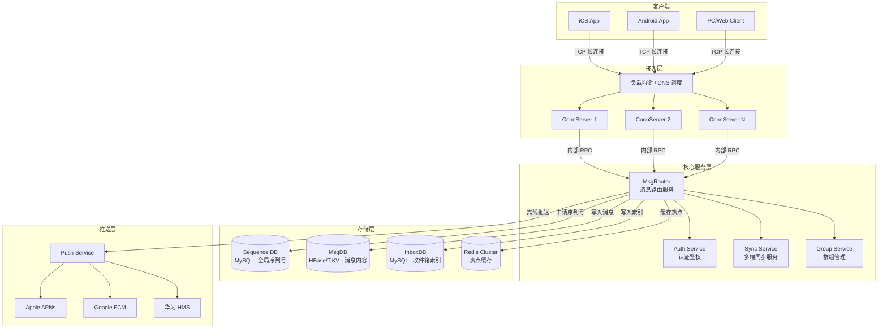
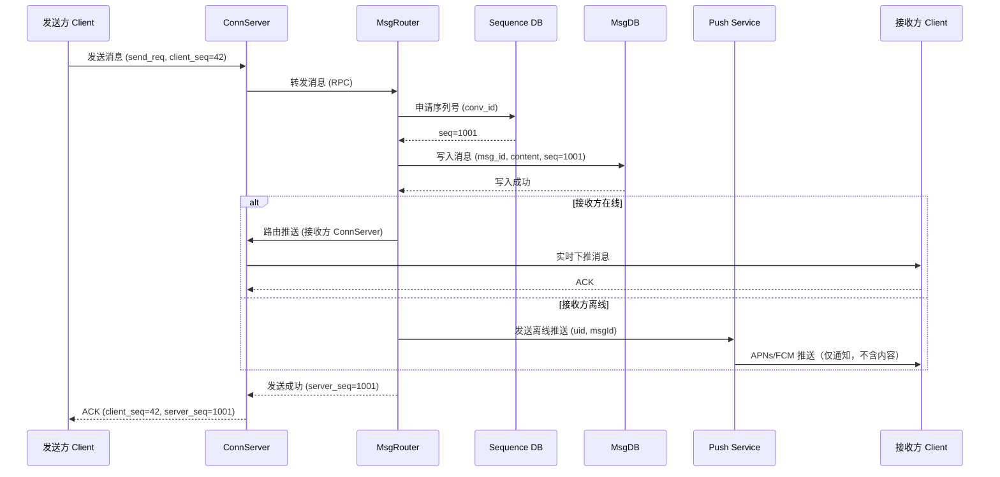
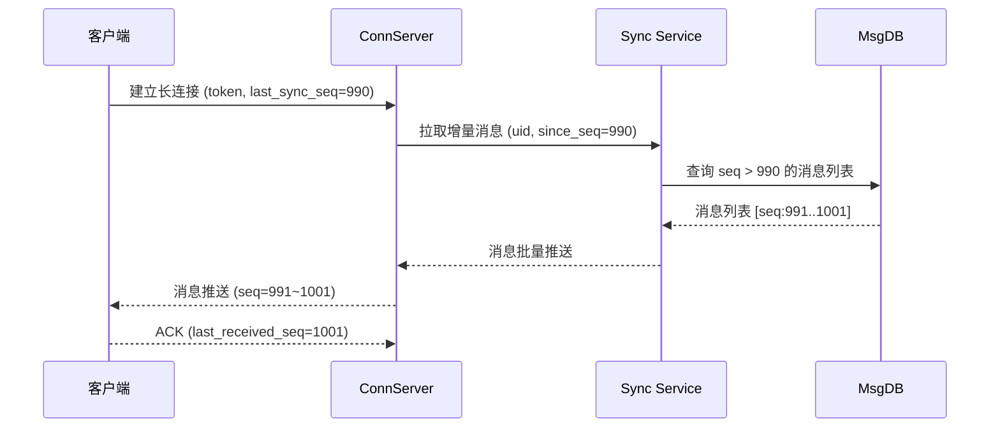

# 微信消息系统设计

> **面试场景：** 腾讯 / 字节跳动 / 阿里 高级后端工程师系统设计面试  
> **高频指数：** ⭐⭐⭐⭐⭐

## 题目背景

**面试官提问方式：**

> "请设计一个类似微信的即时通讯系统，支持单聊和群聊，要求消息实时送达、不丢失、有序。请从架构层面讲解你的设计思路，并重点讨论消息存储和顺序保证方案。"

**业务背景：**

微信是全球最大的即时通讯平台之一，核心功能包括单聊、群聊、消息推送和多端同步。IM 系统设计是面试中最常见的系统设计题目，考察点涵盖：网络连接管理、消息可靠传输、分布式存储、在线/离线状态处理等多个维度。

**规模量级：**

- 注册用户：13亿
- 日活跃用户（DAU）：约 9 亿
- 每日消息量：超过 1000 亿条
- 峰值消息吞吐：约 5 万条/秒（节假日高峰可达 10 万+）
- 单条消息平均延迟 P99：< 500ms
- 消息可靠性要求：不丢失、不重复、严格有序（会话内）

---

## 关键指标估算

| 指标 | 估算过程 | 结果 |
|------|----------|------|
| 日活用户 | 13亿 × 70% DAU 比例 | ~9 亿 DAU |
| 每日消息量 | 9亿 DAU × 平均每人发送 11 条 | ~100 亿条/天 |
| 消息 QPS（均值） | 100亿 / 86400s | ~11.5 万 QPS（含读写） |
| 发送 QPS（峰值） | 均值 × 4倍峰值系数 | ~5 万发送 QPS |
| 消息存储（单日新增） | 100亿 × 平均 1KB/消息 | ~10 TB/天 |
| 长连接数量（峰值） | 9亿 DAU × 90% 同时在线 | ~8 亿个 TCP 连接 |
| ConnServer 数量 | 每台 ConnServer 维护 100万长连接 | ~800 台 ConnServer |
| 消息 P99 延迟目标 | 包含网络 + 存储 + 路由 | < 500ms |

**存储容量规划：**

```
单日新增：100亿条 × 1KB = 10TB/天
保留3年：10TB × 365 × 3 ≈ 10.9PB
3副本：10.9PB × 3 ≈ 32.7PB
压缩比（约0.5）：32.7PB × 0.5 ≈ 16PB
```

---

## 高层架构



**架构层次说明：**

1. **接入层（ConnServer）**：维护客户端的 TCP 长连接，只负责连接管理和消息收发，不做业务逻辑。
2. **路由层（MsgRouter）**：负责消息的路由、序列号分配、存储写入和推送分发，是核心业务模块。
3. **存储层**：按职责拆分为 Sequence DB（序列号）、MsgDB（消息内容）、InboxDB（收件箱索引）三类。
4. **推送层**：处理离线用户的第三方通道推送（APNs / FCM / HMS）。

---

## 核心设计决策

### 决策一：连接协议选型

**方案对比：**

| 方案 | 优点 | 缺点 |
|------|------|------|
| WebSocket | 标准协议，浏览器原生支持，研发成本低 | 头部开销大（约10字节），移动端穿透 NAT 能力差 |
| XMPP | 开源协议，生态成熟 | XML 格式冗余，在移动端带宽消耗高，扩展性差 |
| HTTP 长轮询 | 实现简单，穿透性好 | 延迟高（秒级），服务端连接数浪费 |
| **私有二进制协议** | 头部极小（约8字节），定制心跳，NAT 穿透策略可控 | 需自行实现协议栈，研发成本高 |

**微信实际选择：私有二进制协议（MMTls / MMTLS over TCP）**

核心原因：
- 移动端网络环境复杂，私有协议可定制 4.5 分钟心跳间隔（匹配运营商 NAT 超时阈值）
- 自定义字段压缩，减少移动端流量消耗约 40%
- 单 TCP 长连接复用多路消息，减少握手开销
- 自行实现重连逻辑，避免 WebSocket 的指数退避问题

**心跳机制：**

```
客户端每隔 4.5 分钟发送一个心跳包（约 10 bytes）
服务端在 10 分钟内未收到心跳则判断连接断开
客户端进入后台时延长心跳间隔至 10 分钟（iOS 后台推送依赖 APNs）
```

### 决策二：消息时序保证

**核心问题**：分布式系统中如何保证同一会话内消息严格有序？

**方案对比：**

| 方案 | 优点 | 缺点 |
|------|------|------|
| 全局唯一时间戳（机器时钟） | 实现简单 | 时钟漂移导致乱序，不可靠 |
| Snowflake ID | 全局唯一，有序性好 | 时钟回拨问题；跨会话不严格有序 |
| 全局递增 Sequence ID | 全局严格有序 | 单点瓶颈，写入性能受限 |
| **会话级递增 Sequence ID** | 每个会话独立计数，避免全局热点；满足会话内有序 | 多会话之间无法比较顺序（业务上无需） |

**微信实际选择：会话级别的全局自增 Sequence ID**

具体实现：
- 为每个会话（单聊 conversation_id = min(uid_a, uid_b) + ":" + max(uid_a, uid_b)）在 MySQL 中维护一个 `max_seq` 计数器
- 每次发消息时，通过 `UPDATE seq_table SET seq=seq+1 WHERE conv_id=? RETURNING seq` 原子获取下一个序列号
- 群聊同理，每个群维护独立序列号

```sql
-- Sequence 服务核心 SQL（乐观锁）
UPDATE conversation_seq 
SET max_seq = max_seq + 1 
WHERE conversation_id = 'conv:uid1:uid2'
RETURNING max_seq;
```

**为什么不用 Redis INCR？**

MySQL 的好处在于可以和消息写入在同一个事务中（避免序列号分配成功但消息写失败导致空洞），且 MySQL 主从可以保证 sequence 持久化。

### 决策三：消息存储模型（收件箱模型 vs 发件箱模型）

**发件箱模型（Write-on-Read）：**
- 消息写入发送方 outbox
- 接收方读取时，聚合所有联系人的 outbox
- 缺点：读放大严重（N个联系人 = N次读）

**写扩散（Fanout-on-Write）：**
- 消息写入时，同时写入所有接收方的 inbox
- 读取时直接读自己的 inbox
- 缺点：群聊写放大（1000人群 = 1000次写）

**微信实际选择：收件箱模型（单聊） + 有限写扩散（群聊）**

单聊消息存储结构：
```
MsgDB（消息内容，按 conversation_id 分片）：
  msg_id        BIGINT PRIMARY KEY    -- 全局唯一，Snowflake 生成
  conversation_id VARCHAR             -- 会话 ID
  sender_uid    BIGINT
  content       BLOB                  -- 加密内容
  msg_type      TINYINT               -- 1=文本 2=图片 3=语音
  created_at    BIGINT                -- 发送时间戳（毫秒）
  seq           BIGINT                -- 会话内序列号

InboxDB（收件箱索引，按 uid 分片）：
  uid           BIGINT
  conversation_id VARCHAR
  last_msg_id   BIGINT
  unread_count  INT
  updated_at    BIGINT
```

消息只存一份（MsgDB），InboxDB 只存指向关系。接收方通过 InboxDB 找到 conversation_id，再到 MsgDB 拉取具体消息内容。

### 决策四：离线消息推送

**在线用户：** ConnServer 直接将消息下推到 TCP 连接，无需经过第三方推送。

**离线用户推送策略：**

```
1. MsgRouter 检查用户是否在线（查路由表）
2. 若离线，向 Push Service 发送推送任务
3. Push Service 发送"信封式"通知：只推送 msgId（不含内容）
4. 用户点击通知 → App 启动 → 建立长连接 → 主动拉取未读消息
```

**为什么不直接推消息内容？**

- 安全考虑：消息内容经端对端加密，APNs/FCM 服务器不应持有明文
- 可靠性：用户在离线期间可能收到 N 条消息，只需推一次"你有新消息"即可，避免 APNs 推送超限（iOS APNs 限制连续推送会被合并）
- 幂等：App 启动后统一拉取，不依赖推送数量

### 决策五：已读回执

**方案：** 服务端维护 `ack_seq`，客户端定时上报

```
客户端维护：last_read_seq（本地记录已读到哪一条）
服务端维护：ack_seq_table(uid, conversation_id, ack_seq)

上报时机：
  - 用户打开会话时，上报 max_seq 作为 ack
  - 每 3 秒批量上报一次，而非每条消息都 ack
```

**已读人数（群聊）：**

对于群聊已读人数，服务端维护 `msg_read_count(msg_id, read_uid_list)`，发送方可查询，但不会实时推送给所有成员（避免推送风暴）。

---

## 详细设计

### 消息发送时序



### 消息接收拉取时序



### 数据模型

```sql
-- 消息内容表（按 conversation_id Hash 分片，存入 HBase/TiKV）
CREATE TABLE messages (
    msg_id          BIGINT NOT NULL,          -- Snowflake ID
    conversation_id VARCHAR(64) NOT NULL,      -- 会话 ID
    sender_uid      BIGINT NOT NULL,
    receiver_uid    BIGINT,                    -- 单聊时有值，群聊为 NULL
    group_id        BIGINT,                    -- 群聊时有值
    content         VARBINARY(65535),          -- 加密消息体
    msg_type        TINYINT NOT NULL,          -- 1=文本 2=图片 3=语音 4=视频 5=文件
    seq             BIGINT NOT NULL,           -- 会话内序列号
    created_at      BIGINT NOT NULL,           -- 发送时间戳（毫秒）
    is_recalled     TINYINT DEFAULT 0,         -- 是否撤回
    PRIMARY KEY (msg_id),
    INDEX idx_conv_seq (conversation_id, seq)
);

-- 会话序列号表（MySQL，专门用于序列号分配）
CREATE TABLE conversation_seq (
    conversation_id VARCHAR(64) PRIMARY KEY,
    max_seq         BIGINT NOT NULL DEFAULT 0,
    updated_at      BIGINT NOT NULL
);

-- 收件箱索引表（按 uid 分片，MySQL/TiDB）
CREATE TABLE user_inbox (
    uid             BIGINT NOT NULL,
    conversation_id VARCHAR(64) NOT NULL,
    last_msg_id     BIGINT NOT NULL,
    last_msg_seq    BIGINT NOT NULL,
    unread_count    INT NOT NULL DEFAULT 0,
    updated_at      BIGINT NOT NULL,
    PRIMARY KEY (uid, conversation_id),
    INDEX idx_uid_updated (uid, updated_at DESC)
);

-- 用户路由表（ConnServer 地址映射，Redis 存储）
-- Key: "conn:uid:{uid}" → Value: "connserver-ip:port"
-- TTL: 随心跳刷新，过期即视为离线
```

### 核心 API 接口

```protobuf
// 发送消息
rpc SendMessage(SendMessageRequest) returns (SendMessageResponse) {}

message SendMessageRequest {
    string  conversation_id = 1;
    int64   sender_uid      = 2;
    bytes   content         = 3;   // 加密内容
    int32   msg_type        = 4;
    int64   client_msg_id   = 5;   // 客户端生成，用于幂等去重
}

message SendMessageResponse {
    int64  server_msg_id   = 1;
    int64  server_seq      = 2;
    int64  server_timestamp = 3;
    int32  status          = 4;   // 0=success
}

// 拉取历史消息
rpc GetMessages(GetMessagesRequest) returns (GetMessagesResponse) {}

message GetMessagesRequest {
    string conversation_id = 1;
    int64  since_seq       = 2;   // 从哪个序列号开始拉取
    int32  limit           = 3;   // 最多拉取条数，默认20
}
```

---

## 踩过的坑 / 生产经验

### 坑一：消息重复投递（客户端 ACK 超时触发重传）

**问题描述：**

客户端发送消息后，等待服务端 ACK，若 ACK 超时（网络抖动），客户端会重传该消息。此时服务端可能已成功写入了第一次请求，重传导致消息出现两条完全相同的内容。

**解决方案：**

基于 `client_msg_id` 的幂等去重机制：

```python
# 服务端处理逻辑
def handle_send_message(req):
    # 1. 先查 Redis 幂等缓存（TTL 10分钟）
    cache_key = f"msg_idem:{req.sender_uid}:{req.client_msg_id}"
    cached = redis.get(cache_key)
    if cached:
        # 已处理过，直接返回之前的结果
        return parse_response(cached)
    
    # 2. 分配序列号 + 写入消息（原子操作或用分布式事务）
    seq = allocate_seq(req.conversation_id)
    msg_id = write_message(req, seq)
    
    # 3. 写入幂等缓存
    response = build_response(msg_id, seq)
    redis.setex(cache_key, 600, serialize(response))
    
    return response
```

**client_msg_id 生成规则：** 客户端用 `timestamp_ms + random(4bytes)` 生成，保证同一设备在 10 分钟窗口内唯一。

### 坑二：网络闪断导致消息乱序

**问题描述：**

用户网络出现 1 秒抖动，客户端断线重连后，ConnServer 可能将这 1 秒内积压的消息和新消息混合推送，导致客户端显示消息乱序。

**解决方案：**

客户端维护本地消息 `seq` 顺序队列，所有收到的消息先放入 pending buffer，等待按 seq 排序后再渲染：

```javascript
class MessageBuffer {
    constructor() {
        this.buffer = new Map(); // seq -> message
        this.nextExpectedSeq = null;
    }

    onMessageReceived(msg) {
        if (!this.nextExpectedSeq) {
            this.nextExpectedSeq = msg.seq;
        }
        this.buffer.set(msg.seq, msg);
        this.flushOrdered();
    }

    flushOrdered() {
        while (this.buffer.has(this.nextExpectedSeq)) {
            const msg = this.buffer.get(this.nextExpectedSeq);
            this.buffer.delete(this.nextExpectedSeq);
            this.renderMessage(msg); // 按序渲染
            this.nextExpectedSeq++;
        }
    }
}
```

若 5 秒内 pending buffer 中出现 seq 空洞（某条消息迟迟未到），则主动向服务端拉取该 seq 的消息（防止永久卡住）。

### 坑三：群聊消息写扩散的数据库热点

**问题描述：**

一个 500 人的群发送一条消息，InboxDB 需要写入 500 条索引记录，若瞬时有 1000 个群同时活跃，每秒写入压力 = 1000 × 500 = 50 万 IOPS。

**解决方案：**

1. 群聊改用 MQ 异步写扩散（Kafka 批量消费，攒批写入，降低 IOPS）
2. 超大群（>500人）改为读扩散：成员读取时主动去拉群消息 timeline，不预写 inbox
3. InboxDB 写入合并（同一 uid 在同一批次内的更新合并为一次 UPSERT）

### 坑四：消息撤回的最终一致性

**问题：** 消息发出后 2 分钟内可撤回，但接收方可能已经在本地缓存了该消息内容。

**方案：**
- 服务端将 `is_recalled` 置为 true，内容字段清空
- 通过长连接向所有在线的接收方推送"撤回事件"（包含 msg_id）
- 接收方客户端收到撤回事件后，将本地该条消息替换为"对方撤回了一条消息"
- 离线接收方上线时，通过 sync 接口拉取时自然看到已撤回状态

---

## 扩展考点

### 追问方向

**1. 如何实现端对端加密（E2E Encryption）？**

- 使用 Signal Protocol（双棘轮算法），每个会话独立密钥
- 服务端只存储密文，无法解密
- 密钥通过设备公钥在端侧协商，服务端只做密钥分发（不存储私钥）
- 注意：E2E 加密与消息云备份矛盾，需要用户自行导出密钥备份

**2. 如何设计群聊（万人群）？**

- 群聊消息改用读扩散（拉模型）：消息只写入一份群 timeline
- 成员读取时携带 `last_sync_seq`，服务端返回增量消息
- 写扩散上限（<500人）用于小群，保证实时性；超大群用读扩散，允许轻微延迟

**3. 多端同步如何保证一致性？**

- 每个设备维护独立的 `last_sync_seq`（存在 ConnServer Session 中）
- 设备登录时上报本地 `last_sync_seq`，服务端推送所有 seq > last_sync_seq 的消息
- 已读状态通过专门的 `read_ack_seq` 同步，保证多端已读状态一致

**4. 消息全文搜索如何实现？**

- 消息索引走独立的 Elasticsearch 集群
- 因为消息是加密的，E2E 加密消息无法服务端搜索（只能客户端本地搜索）
- 普通消息（服务端加密）写入时异步投递到 ES，按 uid + 关键词检索

### 边界 Case

| Case | 处理方式 |
|------|----------|
| 消息发送时接收方账号被注销 | 消息写入 MsgDB，InboxDB 写入失败不影响发送方；定期清理已注销用户的 inbox |
| 超大文件消息（>500MB 视频） | 走独立文件上传流程，消息只存文件 URL + 缩略图，实际内容放对象存储 CDN |
| 网络分区期间消息堆积 | ConnServer 恢复后批量推送积压消息，客户端按 seq 排序；服务端设置积压上限（5 万条/用户），超出截断并提示 |
| 消息炸弹（恶意高频发消息） | 服务端限流：单 uid 发送 QPS 限制 10 条/秒，超限返回 429；ConnServer 层令牌桶限流 |
| 时区问题（跨国消息） | 所有时间戳统一用 UTC 毫秒级时间戳存储，客户端根据本地时区转换显示 |

### 演进路径

```
Phase 1（MVP）：
  - 单机 ConnServer + MySQL 存储
  - 简单轮询（无长连接）
  - 适合 10 万 DAU

Phase 2（水平扩展）：
  - ConnServer 集群 + ZooKeeper 路由注册
  - MySQL 主从分离 + 读写分离
  - 适合 1000 万 DAU

Phase 3（大规模）：
  - Kafka 异步写扩散 + HBase 消息存储
  - 多机房部署 + 同城双活
  - 适合 1 亿 DAU

Phase 4（超大规模，微信现状）：
  - 私有协议 + 自研存储引擎
  - 全球多活 + 区域就近接入
  - 适合 10 亿 DAU
```

---

## 面试评分维度

| 维度 | 基础分（60分） | 加分项（80+分） | 满分项（100分） |
|------|----------------|-----------------|-----------------|
| **连接管理** | 能说出长连接的必要性，提到 WebSocket | 对比分析 WebSocket vs 私有协议的优劣，提到心跳机制和 NAT 穿透 | 详细说明心跳间隔选择依据（4.5min 匹配运营商 NAT），连接复用和背压控制 |
| **消息时序** | 提到用时间戳排序 | 指出时间戳的问题，提出 Sequence ID 方案 | 区分全局序列号 vs 会话级序列号的权衡，说明 MySQL 原子更新实现 |
| **消息存储** | 能设计基本的消息表结构 | 区分 MsgDB（内容） vs InboxDB（索引），提到消息只存一份 | 详细说明收件箱模型、写扩散/读扩散权衡，按 conversation_id 分片策略 |
| **可靠性** | 知道需要 ACK 确认 | 说明重传机制和 client_msg_id 幂等去重 | 完整的消息可靠性闭环：发送确认 + 重传 + 幂等 + 顺序重排 |
| **离线推送** | 知道 APNs / FCM | 说明只推 msgId 不推内容的原因 | 说明通知合并、App 启动后拉取增量消息的完整流程 |
| **扩展性思考** | 能提到水平扩展 ConnServer | 说明 Kafka 异步写扩散降低数据库压力 | 完整讨论群聊写扩散/读扩散阈值、多机房同城双活方案 |
