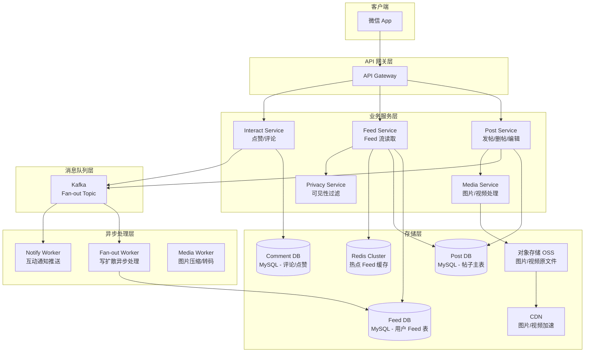
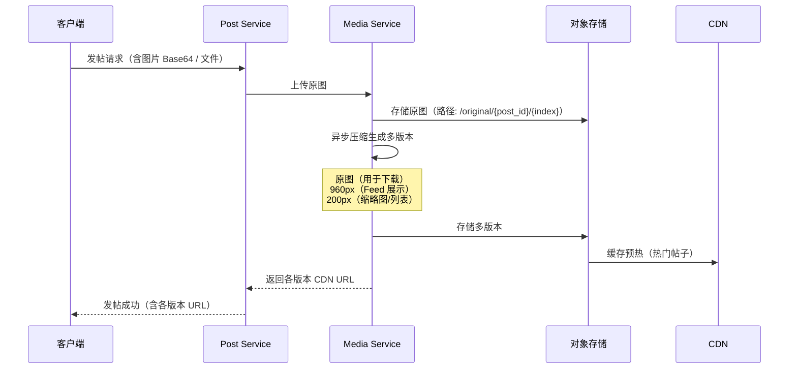
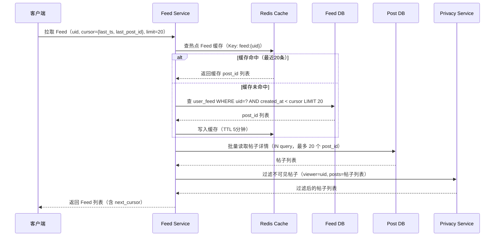

# 微信朋友圈系统设计

> **面试场景：** 腾讯 / 抖音 / 微博 高级后端 / 架构师系统设计面试  
> **高频指数：** ⭐⭐⭐⭐⭐

## 题目背景

**面试官提问方式：**

> "请设计一个类似微信朋友圈的 Feed 流系统。用户可以发布图文动态，好友可以看到、点赞和评论。重点讲讲 Feed 流如何生成和存储，以及如何处理大V用户（好友数很多的用户）。"

**业务背景：**

朋友圈（Moments）是社交类产品中最核心的 Feed 流场景。与微博不同，朋友圈的关系链是**双向好友关系**，且有严格的**隐私可见性控制**（可见范围：所有人/部分好友/仅自己）。Feed 系统设计是面试中的高频考点，考察写扩散与读扩散策略、隐私过滤、存储设计和大规模数据访问模式。

**规模量级：**

- 日活跃用户（DAU）：约 9 亿
- 每日发帖量：1 亿条以上
- 用户平均好友数：200 人
- 用户最大好友数：5000 人（上限）
- 朋友圈浏览量：每日数千亿次
- 每条动态平均评论 + 点赞：3~10 次互动
- P99 读取 Feed 延迟：< 200ms
- 图片/视频大小：图片最大 25MB，视频最大 100MB

---

## 关键指标估算

| 指标 | 估算过程 | 结果 |
|------|----------|------|
| 每日发帖 QPS（均值） | 1亿条 / 86400s | ~1160 QPS |
| 发帖 QPS（峰值） | 均值 × 10倍（节假日/晚高峰） | ~12000 QPS |
| 写扩散（Fan-out）QPS | 发帖 QPS 峰值 × 平均好友200人 | ~240 万 QPS |
| 读 QPS（Feed 刷新） | 9亿 DAU × 平均每天刷10次 / 86400s | ~10.4 万 QPS（均值），峰值 ~50 万 QPS |
| 帖子存储（单日新增） | 1亿条 × 平均2KB/条（含图片URL） | ~200GB/天元数据，图片另计 |
| 图片存储（单日新增） | 1亿条 × 平均3张图 × 平均200KB/张（压缩后） | ~60TB/天 |
| Feed 表（单用户 inbox 大小） | 200好友 × 每天3条 × 保留3个月 | ~5.4万条 |
| 评论+点赞写入 QPS | 1亿条 × 8次互动 / 86400s | ~9250 QPS |

**写扩散量级验证：**

```
高峰时发帖 QPS = 12000
平均好友 = 200
Fan-out QPS = 12000 × 200 = 240万
这就是为什么写扩散需要异步化（Kafka + Worker Pool），无法同步完成
```

---

## 高层架构



**架构层次说明：**

1. **Post Service**：处理发帖请求，写入帖子主表，异步投递 Kafka 触发写扩散。
2. **Fan-out Worker**：从 Kafka 消费发帖事件，将帖子 ID 写入所有粉丝/好友的 Feed 表。
3. **Feed Service**：负责 Feed 流的读取，综合 Feed 表 + Post 表 + Privacy 过滤，返回结果。
4. **Media Service**：处理图片上传、压缩、生成多分辨率版本，写入 OSS，下发 CDN URL。

---

## 核心设计决策

### 决策一：写扩散 vs 读扩散 vs 推拉结合

这是 Feed 系统最核心的设计决策，深刻影响读写放大比例。

**写扩散（Push/Fanout-on-Write）：**

- 发帖时，立即将 post_id 写入所有好友的 Feed 表
- 好友打开朋友圈时，直接读自己的 Feed 表（已经预计算好）
- 优点：读取速度快（O(1)）；缺点：写放大（发一条帖子 = 写 N 条 Feed 记录）

**读扩散（Pull/Fanout-on-Read）：**

- 发帖时只写一条帖子记录
- 用户打开朋友圈时，聚合所有好友的帖子列表
- 优点：写入简单；缺点：读放大（200个好友 = 200次读），延迟高

**推拉结合（微信实际方案）：**

| 用户类型 | 策略 | 原因 |
|----------|------|------|
| 活跃用户（好友 ≤ 150人，近7天有登录） | 写扩散（Push） | 好友数少，写放大可控；用户常读，预计算收益高 |
| 超高好友数用户（>150人，或大V账号） | 只推送给活跃好友 | 好友数多，写扩散代价高；仍保证高频用户体验 |
| 非活跃用户（超过7天未登录） | 不写入 Feed 表 | 避免写入大量永远不被读的数据 |
| 用户上线时 | Pull 补偿：拉取离线期间的增量帖子 | 保证离线后重新上线的用户能看到完整时间线 |

**阈值设计（150人）的依据：**

- 微信官方好友上限 5000 人
- 实测中位数好友数约 150 人
- 超出 150 人后写扩散的边际收益（减少读延迟）低于写放大成本

```python
# Fan-out Worker 核心逻辑（伪代码）
def fanout_post(post_id, author_uid, created_at):
    friends = get_friends(author_uid)
    active_friends = [f for f in friends if is_active(f)]
    
    # 批量写入活跃好友的 Feed 表
    batch_insert_feed([
        FeedRecord(uid=f, post_id=post_id, created_at=created_at)
        for f in active_friends
    ])
    
    # 非活跃好友：上线时 Pull 补偿（不预写）
    inactive_friends = [f for f in friends if not is_active(f)]
    # 记录"有新帖子未推送"标记，上线时触发 pull
    mark_pull_needed(inactive_friends, author_uid, created_at)
```

### 决策二：隐私可见性控制

朋友圈的隐私控制有多个维度：

- **全部朋友可见**：所有双向好友均可看到
- **部分朋友可见**：指定白名单 uid 列表（最多500人）
- **不给某些人看**：黑名单 uid 列表
- **仅自己可见**：私密日记
- **陌生人3天可见**：非好友只能看最近3天的内容

**存储方案：**

```sql
-- 帖子可见性表
CREATE TABLE post_visibility (
    post_id         BIGINT NOT NULL,
    visibility_type TINYINT NOT NULL,
    -- 1=所有好友 2=部分好友（白名单）3=不给某人看（黑名单）4=仅自己
    uid_list        JSON,           -- 白名单/黑名单 uid 数组
    PRIMARY KEY (post_id)
);
```

**服务端过滤策略（不在客户端过滤！）：**

```python
# Feed 读取时的可见性过滤（在服务端执行）
def filter_visible_posts(viewer_uid, posts):
    result = []
    for post in posts:
        vis = get_visibility(post.post_id)
        if vis.type == VISIBILITY_ALL:
            result.append(post)
        elif vis.type == VISIBILITY_WHITELIST:
            if viewer_uid in vis.uid_list:
                result.append(post)
        elif vis.type == VISIBILITY_BLACKLIST:
            if viewer_uid not in vis.uid_list:
                result.append(post)
        elif vis.type == VISIBILITY_SELF:
            if viewer_uid == post.author_uid:
                result.append(post)
        # 3天可见：非好友且帖子超过3天则过滤
        if not is_friend(viewer_uid, post.author_uid):
            if post.created_at < now() - 3 * DAY:
                result.remove(post)
    return result
```

**重要原则：** 可见性过滤**必须在服务端完成**，不能把帖子数据先发给客户端再由客户端过滤，否则存在隐私泄露风险。

### 决策三：评论与点赞设计

**附着模型：** 评论和点赞附着在帖子上，单独存储，但通过 post_id 关联。

```sql
-- 评论表（按 post_id 分片）
CREATE TABLE comments (
    comment_id      BIGINT PRIMARY KEY,   -- Snowflake ID
    post_id         BIGINT NOT NULL,
    author_uid      BIGINT NOT NULL,
    reply_to_uid    BIGINT,               -- 回复某人（NULL 表示直接评论帖子）
    reply_comment_id BIGINT,              -- 回复哪条评论
    content         VARCHAR(2000) NOT NULL,
    created_at      BIGINT NOT NULL,
    is_deleted      TINYINT DEFAULT 0,
    INDEX idx_post_id (post_id, created_at)
);

-- 点赞表（按 post_id 分片）
CREATE TABLE likes (
    post_id         BIGINT NOT NULL,
    user_uid        BIGINT NOT NULL,
    created_at      BIGINT NOT NULL,
    PRIMARY KEY (post_id, user_uid),
    INDEX idx_user_uid (user_uid, created_at)
);
```

**互动通知流程：**

1. 用户 A 评论帖子 → 写入 CommentDB
2. 异步投递 Kafka 事件（comment_event）
3. Notify Worker 消费事件，向帖子作者推送"有人评论了你的朋友圈"
4. 若是回复评论（reply），还需通知被回复的评论作者

**点赞数缓存：**

```
点赞数不实时查 MySQL COUNT，而是维护在 Redis：
Key: "likes:count:{post_id}" → Value: 点赞数
用户点赞：Redis INCR + 写 MySQL（异步）
展示时读 Redis（允许短暂不一致，误差 < 1秒）
```

### 决策四：Feed 流分页——游标分页（非 offset 分页）

**错误方案（offset 分页）：**

```sql
-- 错误！深分页时性能极差
SELECT * FROM user_feed WHERE uid=? ORDER BY created_at DESC LIMIT 20 OFFSET 100;
```

深翻页时 offset 越大，性能越差（需扫描并丢弃前 N 条记录）。

**正确方案（游标分页）：**

```sql
-- 正确！用 last_post_id 作为游标
SELECT post_id, created_at FROM user_feed 
WHERE uid = ? 
  AND (created_at < :last_ts OR (created_at = :last_ts AND post_id < :last_post_id))
ORDER BY created_at DESC, post_id DESC
LIMIT 20;
```

- 客户端每次请求携带上一次返回的最后一条记录的 `(created_at, post_id)` 作为游标
- 服务端用 `WHERE` 过滤而非 `OFFSET`，性能稳定 O(log N)
- 缺点：无法跳页（只能上下翻），朋友圈场景下用户几乎不会跳页，此缺点可接受

### 决策五：图片存储与多分辨率策略

**上传流程：**



**CDN 策略：**

- 缩略图（200px）：全球 CDN 节点缓存，TTL 永久（内容不变）
- 960px Feed 图：就近 CDN 节点缓存，TTL 7天
- 原图：按需加载，用户主动点击"查看原图"才下载，不预加载

---

## 详细设计

### 数据模型

```sql
-- 帖子主表（按 post_id Hash 分片，1024 片）
CREATE TABLE posts (
    post_id         BIGINT NOT NULL,           -- Snowflake ID
    author_uid      BIGINT NOT NULL,
    content         VARCHAR(10000),             -- 文字内容
    image_urls      JSON,                       -- 各版本图片 URL 列表
    video_url       VARCHAR(512),               -- 视频 URL（可选）
    location        VARCHAR(256),               -- 位置信息（可选）
    visibility_type TINYINT NOT NULL DEFAULT 1, -- 1=所有好友
    like_count      INT NOT NULL DEFAULT 0,     -- 点赞数缓存（定期同步）
    comment_count   INT NOT NULL DEFAULT 0,     -- 评论数缓存
    created_at      BIGINT NOT NULL,
    updated_at      BIGINT NOT NULL,
    is_deleted      TINYINT DEFAULT 0,
    PRIMARY KEY (post_id),
    INDEX idx_author_uid (author_uid, created_at DESC)
);

-- 用户 Feed 表（按 uid Hash 分片，1024 片）
-- 只存 post_id 和 created_at，实际内容去 posts 表读
CREATE TABLE user_feed (
    uid             BIGINT NOT NULL,
    post_id         BIGINT NOT NULL,
    author_uid      BIGINT NOT NULL,            -- 冗余，用于快速过滤已取关的人
    created_at      BIGINT NOT NULL,
    PRIMARY KEY (uid, post_id),
    INDEX idx_uid_created (uid, created_at DESC, post_id DESC)
);

-- 好友关系表（双向存储）
CREATE TABLE friendships (
    uid_a           BIGINT NOT NULL,            -- 较小的 uid
    uid_b           BIGINT NOT NULL,            -- 较大的 uid
    status          TINYINT NOT NULL,           -- 1=互为好友
    created_at      BIGINT NOT NULL,
    PRIMARY KEY (uid_a, uid_b),
    INDEX idx_uid_b (uid_b, uid_a)
);
```

### Feed 流读取时序



### 核心 API

```protobuf
// 发布朋友圈
rpc PublishPost(PublishPostRequest) returns (PublishPostResponse) {}

message PublishPostRequest {
    int64  author_uid      = 1;
    string content         = 2;
    repeated string image_keys = 3;   // 已上传到 OSS 的 key
    string video_key       = 4;
    VisibilityConfig visibility = 5;
}

message VisibilityConfig {
    int32  type            = 1;   // 1=所有好友 2=白名单 3=黑名单 4=仅自己
    repeated int64 uid_list = 2;  // 白名单/黑名单 uid
}

// 拉取 Feed 流
rpc GetFeed(GetFeedRequest) returns (GetFeedResponse) {}

message GetFeedRequest {
    int64  viewer_uid      = 1;
    string cursor          = 2;   // Base64(created_at:post_id)，首次为空
    int32  limit           = 3;   // 默认20
}

message GetFeedResponse {
    repeated Post posts    = 1;
    string next_cursor     = 2;   // 下一页游标，为空表示已到末尾
    bool   has_more        = 3;
}
```

---

## 踩过的坑 / 生产经验

### 坑一：大V发帖导致数据库写热点

**问题描述：**

某明星用户（5000个好友）在高峰期发帖，Fan-out Worker 需要在 1 秒内向 5000 个好友的 Feed 表写入记录。若用同步方式，单次发帖触发 5000 个 INSERT，直接打爆数据库连接池。

**解决方案：**

1. **异步批量写入**：Fan-out Worker 从 Kafka 消费事件后，攒批（batch_size=500）写入 Feed 表，单次 BULK INSERT 500 条远比 500 次 INSERT 高效。
2. **分片写入**：将 5000 个好友按 uid 分成多个批次，分配到多个 Worker 实例并行写入，避免单个 Worker 成为瓶颈。
3. **延迟写入（非活跃用户）**：好友列表中超过 7 天未登录的用户不写 Feed 表，等他们上线时 Pull 补偿，减少约 40% 的写入量。

```python
# 批量写入优化示例
def bulk_insert_feed(feed_records, batch_size=500):
    for i in range(0, len(feed_records), batch_size):
        batch = feed_records[i:i+batch_size]
        db.execute(
            "INSERT IGNORE INTO user_feed (uid, post_id, author_uid, created_at) VALUES %s",
            batch
        )
```

### 坑二：节假日发帖量暴增导致 Kafka 消费积压

**问题描述：**

春节期间发帖量激增 5 倍，Fan-out 消息在 Kafka 中积压超过 30 分钟，导致用户看到好友的帖子严重延迟。

**解决方案：**

1. **消费者弹性扩容**：在 Kubernetes 上，根据 Kafka consumer lag 指标自动 HPA 扩容 Fan-out Worker Pod（lag > 10万条触发扩容）。
2. **Topic 分区预扩容**：节假日前手动将 Kafka Topic 分区从 64 扩到 256，提升并行消费能力。
3. **优先级队列**：新消息优先于老消息处理——若积压超过 5 分钟，跳过旧消息直接处理最新消息，保证用户看到最新内容（旧内容 Pull 补偿）。

### 坑三：Feed 流出现"幽灵帖子"（已删除的帖子仍显示）

**问题描述：**

用户删除了自己发的一条朋友圈，但该帖子的 post_id 已经写入了所有好友的 Feed 表。好友刷新 Feed 时仍能看到这个 post_id，服务端去 PostDB 查询时返回空，客户端显示加载失败或出现空白格。

**解决方案：**

1. **软删除 + 过滤**：删帖时仅将 `is_deleted=1`，PostDB 不物理删除。Feed Service 读取帖子详情后过滤掉 `is_deleted=1` 的帖子。
2. **异步清理 Feed 表**：发帖删除事件投递 Kafka，异步 Worker 扫描并删除相关用户 Feed 表中的 post_id（延迟约 1~5 分钟，最终一致）。
3. **客户端容错**：Feed 中某条帖子加载失败时，跳过该条而不是展示错误，用户体验更佳。

### 坑四：隐私过滤成为读取热点

**问题描述：**

用户刷新 Feed 时，Privacy Service 需要对每个帖子检查 visibility_list，若 visibility_list 是一个 500 人的白名单，每次检查都要做一次 O(N) 的 uid 查找，20 条帖子 × 500人 = 1 万次比较，QPS 高时成为性能瓶颈。

**解决方案：**

1. **uid_list 存为 Set**：在 PostDB 中用 JSON 存储，读取后转为 HashSet，查找 O(1)。
2. **visibility 结果缓存**：对于同一个 (viewer_uid, post_id) 组合，将可见性结果缓存在 Redis（TTL 30s），避免重复计算（适合热点帖子）。
3. **前置过滤**：在 Fan-out 阶段即判断可见性——若帖子设置"不给某人看"，直接在写扩散时跳过该 uid，不写入其 Feed 表。

---

## 扩展考点

### 追问方向

**1. 如何实现"好友的评论也能看到"功能？**

- 朋友圈的社交过滤：显示"好友 A 和好友 B 都点赞了"需要对点赞列表做好友关系过滤
- 实现：读取点赞列表时，与当前用户的好友列表取交集，只展示共同好友的互动
- 好友列表缓存在 Redis（TTL 5分钟），好友列表变化时异步更新

**2. 附近的人 / 位置分享如何实现？**

- 帖子发布时可选择携带地理位置（经纬度 + 地名）
- 存储：帖子表中存 `latitude, longitude`，使用 GeoHash 索引
- 附近帖子查询：GeoHash 前缀匹配，查询半径 N 公里内的帖子
- 隐私保护：位置信息精度降级（精确到街道，不精确到门牌号）

**3. 如何统计"谁看过我的朋友圈"？**

- 微信目前不提供此功能（隐私设计）
- 若要实现：记录 `post_views(post_id, viewer_uid, view_at)` 表，仅帖子作者可查
- 超高访问量帖子（明星）的浏览记录写入 HBase，防止 MySQL 热点
- 仅保留最近 N 个浏览者（如最近500人），不全量记录

**4. 朋友圈广告如何插入？**

- 广告系统维护独立的 Ad Feed
- Feed Service 读取用户 Feed 时，按照固定规则（如每 10 条插入 1 条广告）混合插入广告
- 广告选取：根据用户画像（年龄、地区、兴趣标签）定向投放
- 广告不写入 user_feed 表，而是在请求时实时召回，避免广告更新时需要重写 Feed 表

### 边界 Case

| Case | 处理方式 |
|------|----------|
| 用户注销账号后，好友还能看到其历史帖子吗？ | 注销时批量软删除所有帖子，Fan-out Worker 异步清理好友 Feed 表 |
| 发帖时网络中断，是否会重复发帖？ | 客户端生成唯一 `client_post_id`，服务端幂等检查，重复请求返回原帖子 ID |
| 好友列表更新后（新加好友/删除好友），Feed 如何处理？ | 加好友：拉取该好友最近 N 条帖子写入自己的 Feed（Pull 补偿）；删除好友：异步清理 Feed 表中该好友的帖子 |
| 帖子内容被举报/违规，如何快速下架？ | 写入 PostDB `status=BLOCKED`，CDN 图片 URL 失效（调用 CDN 刷新接口），无需修改 Feed 表 |
| 一条帖子被 10 万人点赞（明星帖子） | 点赞数用 Redis 计数，MySQL 周期性同步；点赞列表用 HBase 存储，防止 MySQL 单行热点 |

### 演进路径

```
Phase 1（早期，千万 DAU）：
  - 单一 MySQL 存储 posts + user_feed
  - 同步写扩散（发帖时直接写 Feed 表）
  - 无 CDN，图片存 MySQL BLOB

Phase 2（中期，亿级 DAU）：
  - 异步 Fan-out（Kafka + Worker）
  - 图片迁移至对象存储 + CDN
  - MySQL 按 uid 分库分表（1024 片）

Phase 3（大规模，十亿 DAU）：
  - 推拉结合（活跃用户推，大V拉）
  - Redis 热点 Feed 缓存
  - 多机房部署 + 就近读写

Phase 4（当前）：
  - 全面自研存储（KV Store + Timeline DB）
  - 弹性计算（节假日自动扩缩容）
  - 流量录制 + 回放压测
```

---

## 面试评分维度

| 维度 | 基础分（60分） | 加分项（80+分） | 满分项（100分） |
|------|----------------|-----------------|-----------------|
| **Fan-out 策略** | 能说出写扩散和读扩散的概念 | 对比分析两者优劣，提出推拉结合方案 | 详细说明活跃用户阈值（150人）、非活跃用户 Pull 补偿的完整逻辑 |
| **隐私过滤** | 知道需要权限控制 | 提出服务端过滤而非客户端过滤，说明原因 | 详细设计 visibility_type + uid_list 存储方案，并提到过滤性能优化（HashSet、缓存） |
| **分页设计** | 能实现基本的分页查询 | 知道 offset 分页的问题，提出游标分页 | 完整的游标方案设计（含 cursor = created_at:post_id 组合游标，处理相同时间戳的情况） |
| **图片存储** | 知道用对象存储 + CDN | 提出多分辨率版本（原图/960px/200px） | 说明上传预签名 URL、CDN 预热策略、图片懒加载 + 渐进式加载的用户体验设计 |
| **高可用设计** | 能说出数据库要做主从 | 说明 Redis 缓存层的必要性，提到 Kafka 异步化 | 完整的容灾方案：写扩散失败时的重试机制、Feed 表与 Post 表的最终一致性保证 |
| **扩展性思考** | 提到数据库分片 | 说明按 uid 分片的策略 | 讨论跨片查询问题、数据倾斜（大V用户）处理、节假日弹性扩容方案 |
