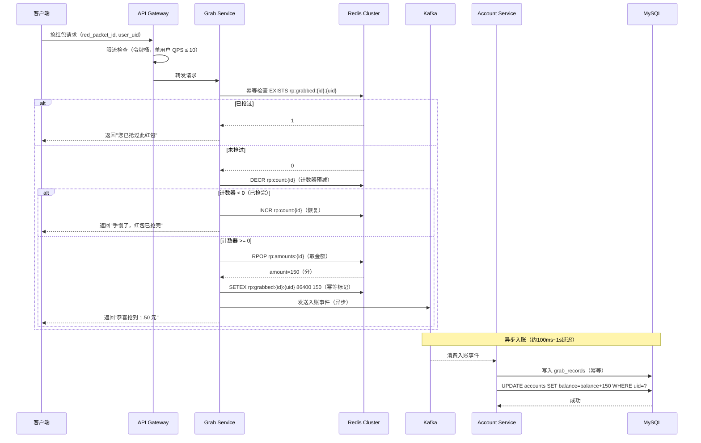
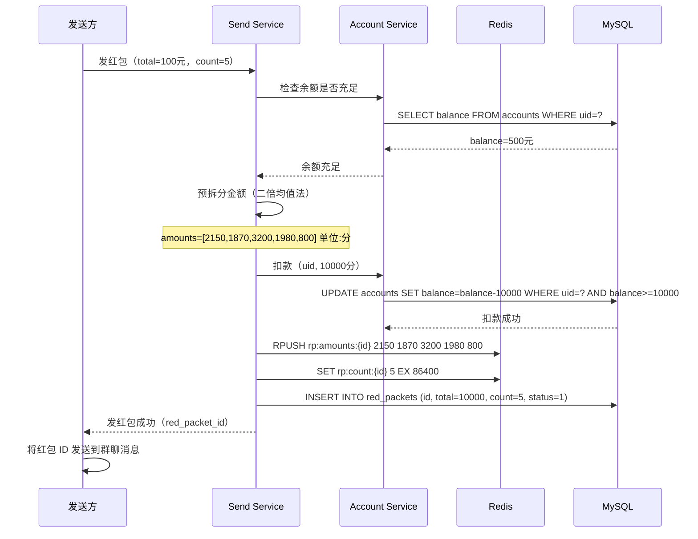

# 微信红包系统设计

> **面试场景：** 腾讯 / 蚂蚁金服 / 字节跳动 资深后端 / 系统架构师面试  
> **高频指数：** ⭐⭐⭐⭐⭐

## 题目背景

**面试官提问方式：**

> "微信红包是一个非常经典的高并发设计案例。请你设计一个红包系统，支持发红包和抢红包功能。重点讲讲怎么在峰值每秒 250 万次抢红包的情况下保证不超发、不少发，且系统不宕机。"

**业务背景：**

微信红包于 2014 年春节推出，通过"摇一摇抢红包"一夜之间绑定了数亿张银行卡，被马云称为"珍珠港偷袭"。红包系统的技术挑战在于：**单个红包可能被数千人同时抢夺**，这是典型的单热点高并发写场景，传统数据库加锁方案完全无法应对。

**规模量级：**

- 2023 年春节：发出红包总数 52 亿个
- 2015 年除夕峰值：8.1 亿次摇一摇/分钟（约 1350 万次/秒）
- 2016 年除夕抢红包峰值：**抢红包 QPS 约 250 万次/秒**
- 单个群红包最大人数：500 人群，20 个红包，并发抢夺
- 资金安全：严格不超发（绝对不能多分钱）、不少发（最终金额和等于红包总金额）
- 幂等性：同一用户对同一红包只能抢一次

---

## 关键指标估算

| 指标 | 估算过程 | 结果 |
|------|----------|------|
| 除夕抢红包峰值 QPS | 历史数据 | ~250 万次/秒 |
| 发红包 QPS（峰值） | 抢红包 × 0.01（发:抢约为1:100） | ~2.5 万次/秒 |
| 单个热点红包并发 | 明星红包：10 万人同时抢 1 个红包 | 10 万并发写同一行 |
| 抢红包平均耗时 | 用户操作时间 + 网络 + 服务端处理 | < 100ms P99 |
| 红包金额存储精度 | 最小单位 0.01 元（1分钱）= INT 存储（分为单位） | INT 不用 DECIMAL |
| 单日红包记录量 | 52亿 个 / 365天 | ~1400 万/天（均值） |
| 除夕单日红包量 | 历史峰值 | ~80 亿个/天 |
| 账户表分片数 | 13亿用户 / 每片 100万行 | ~1300 片（取 2048 次方） |

**核心挑战量化：**

```
假设某个热点红包被 10 万人同时抢：
- 传统方案（MySQL行锁）：每次抢需 5ms 持锁，10万 / 5ms = 串行化处理
  → 需要 10万 × 5ms = 500秒 才能处理完 → 完全不可用

- Redis RPOP 方案：O(1) 操作，10万 QPS 单 Redis 实例可轻松承受
  → 毫秒级处理完所有请求 → 可行
```

---

## 高层架构

```mermaid
graph TB
    subgraph Client["客户端"]
        App[微信 App]
    end

    subgraph GW["网关层"]
        GW[API Gateway\n限流 + 鉴权]
    end

    subgraph Services["业务层"]
        SendSvc[Send Service\n发红包]
        GrabSvc[Grab Service\n抢红包]
        AccountSvc[Account Service\n账务入账]
        RefundSvc[Refund Service\n退款服务]
    end

    subgraph Cache["缓存层"]
        Redis[Redis Cluster\n红包库存 + 预拆分金额]
    end

    subgraph MQ["消息队列"]
        Kafka[Kafka\n异步入账 Topic]
    end

    subgraph DB["持久化层"]
        RedPacketDB[(RedPacket DB\nMySQL - 红包主表)]
        GrabDB[(Grab DB\nMySQL - 抢红包记录)]
        AccountDB[(Account DB\nMySQL - 账户余额)]
    end

    subgraph Scheduler["定时任务"]
        ExpireSvc[Expire Service\n24小时退款]
    end

    App --> GW
    GW --> SendSvc
    GW --> GrabSvc
    SendSvc --> Redis
    SendSvc --> RedPacketDB
    GrabSvc --> Redis
    GrabSvc --> Kafka
    Kafka --> AccountSvc
    AccountSvc --> AccountDB
    AccountSvc --> GrabDB
    RefundSvc --> AccountDB
    ExpireSvc --> RedPacketDB
    ExpireSvc --> RefundSvc
```

**核心思路：** 将"抢红包"的高并发写操作全部挡在 Redis 层，只有抢到红包后才走 Kafka 异步入账到 MySQL，彻底解耦高并发抢夺和数据库持久化两个操作。

---

## 核心设计决策

### 决策一：预拆分金额（核心创新）

**传统方案（错误）：**

```python
# 抢红包时实时计算金额 → 问题：高并发时需要加锁，性能极差
def grab_red_packet(red_packet_id, user_uid):
    with db_lock(red_packet_id):
        rp = db.get(red_packet_id)
        if rp.remaining_count == 0:
            return FAIL_NO_MORE
        amount = calculate_amount(rp.remaining_amount, rp.remaining_count)
        rp.remaining_count -= 1
        rp.remaining_amount -= amount
        db.update(rp)
        db.insert(GrabRecord(user_uid, amount))
```

这个方案在高并发下，`db_lock` 会让所有请求串行化，单个热点红包最多每秒几千次，远不够。

**微信实际方案：发红包时预先拆分金额**

```python
# 发红包时，直接计算好所有子包的金额，存入 Redis List
def send_red_packet(sender_uid, total_amount, count):
    red_packet_id = generate_id()
    
    # 1. 预拆分金额（二倍均值法）
    amounts = split_amount(total_amount, count)  # 返回 [150, 320, 87, ...] 单位：分
    
    # 2. 写入 Redis List（每个金额为一个元素）
    redis_key = f"rp:amounts:{red_packet_id}"
    redis.rpush(redis_key, *amounts)            # 批量 PUSH
    redis.expire(redis_key, 86400)              # 24小时过期（过期后退款）
    
    # 3. 写入 Redis 计数器（用于快速判断是否抢完）
    redis.set(f"rp:count:{red_packet_id}", count, ex=86400)
    
    # 4. 异步写入 MySQL（持久化）
    db.insert(RedPacket(id=red_packet_id, sender=sender_uid, 
                        total=total_amount, count=count, status=ACTIVE))
    
    # 5. 从发送者账户扣款（同步，需要保证资金安全）
    debit_account(sender_uid, total_amount)
    
    return red_packet_id
```

**抢红包时，一个 RPOP 搞定：**

```python
def grab_red_packet(red_packet_id, user_uid):
    # 1. 幂等检查（防止同一用户多次抢）
    idem_key = f"rp:grabbed:{red_packet_id}:{user_uid}"
    if redis.exists(idem_key):
        return FAIL_ALREADY_GRABBED
    
    # 2. RPOP 取出预拆分的金额（O(1)，无锁，原子操作）
    redis_key = f"rp:amounts:{red_packet_id}"
    amount = redis.rpop(redis_key)
    if amount is None:
        return FAIL_NO_MORE    # 红包已抢完
    
    # 3. 设置幂等标记（防止网络重试导致重复抢）
    redis.setex(idem_key, 86400, amount)
    
    # 4. 异步入账（投递 Kafka，非同步写 DB）
    kafka.send("grab_topic", {
        "red_packet_id": red_packet_id,
        "user_uid": user_uid,
        "amount": amount,
        "grab_time": now()
    })
    
    return SUCCESS, amount
```

**RPOP 方案的关键优势：**
- Redis RPOP 是原子操作，天然避免并发超发
- O(1) 时间复杂度，性能与红包数量无关
- 无行锁争抢，100万 QPS 单 Redis 实例可以承受
- 预拆分使抢红包逻辑极度简化，降低出错概率

### 决策二：金额拆分算法——二倍均值法

**简单随机分配的问题：**

`random(0.01, remaining_amount)` 会导致先抢的人拿大份，最后一个人可能只剩 0.01 元，体验不公平。

**二倍均值法（微信使用）：**

```python
def split_amount(total_amount_fen, count):
    """
    total_amount_fen: 总金额（单位：分）
    count: 红包个数
    返回：每个子包的金额列表（单位：分）
    """
    amounts = []
    remaining = total_amount_fen
    
    for i in range(count - 1):
        remaining_count = count - i
        # 二倍均值法：每次随机在 [1, 剩余均值×2] 范围内取值
        avg = remaining // remaining_count
        # 保证最小 1 分钱，最大不超过剩余金额的2倍均值
        max_amount = min(avg * 2, remaining - (remaining_count - 1))
        amount = random.randint(1, max(1, max_amount))
        amounts.append(amount)
        remaining -= amount
    
    # 最后一个红包取剩余所有金额
    amounts.append(remaining)
    
    # 打乱顺序（避免先发后的红包金额有规律）
    random.shuffle(amounts)
    return amounts
```

**二倍均值法的数学特性：**
- 每个红包期望金额 = 均值（公平性保证）
- 方差适中（有惊喜感，但不过于悬殊）
- 保证每个红包至少 0.01 元
- 所有子包金额之和严格等于 `total_amount`（精确性保证）

**验证示例：** 100分钱（1元）分4个红包

```
第1个：avg=25分，随机[1,50]，假设得30分，剩余70分
第2个：avg=23分，随机[1,46]，假设得20分，剩余50分
第3个：avg=25分，随机[1,50]，假设得35分，剩余15分
第4个：直接取15分
结果：[30, 20, 35, 15]，总和=100 ✓
```

### 决策三：库存扣减与防超发

**两层防护机制：**

**第一层（Redis）：** RPOP 天然防超发，List 中有多少元素就能抢多少个，RPOP 返回 nil 即表示抢完。

**第二层（Redis 计数器）：** 维护 `rp:count:{id}` 计数器，作为快速预检（DECR 到 0 即直接拒绝，无需再尝试 RPOP）。

```python
def grab_with_counter(red_packet_id, user_uid):
    count_key = f"rp:count:{red_packet_id}"
    
    # 快速预减计数（若返回 < 0，则已抢完，直接拒绝）
    remaining = redis.decr(count_key)
    if remaining < 0:
        redis.incr(count_key)  # 恢复计数（避免计数器无限减少）
        return FAIL_NO_MORE
    
    # 进入抢夺流程...
    amount = redis.rpop(f"rp:amounts:{red_packet_id}")
    if amount is None:
        # 理论上不应发生（计数器和 List 大小应一致）
        redis.incr(count_key)
        return FAIL_NO_MORE
    
    return SUCCESS, int(amount)
```

**原子化 Lua 脚本（推荐方案）：** 将以上流程合并为单一 Lua 脚本，确保幂等检查、库存扣减、金额弹出三步不可分割：

```lua
-- 原子化抢红包：幂等检查 + 库存扣减 + 金额弹出
local idem_key  = KEYS[1]   -- rp:grabbed:{red_packet_id}:{uid}
local count_key = KEYS[2]   -- rp:count:{red_packet_id}
local list_key  = KEYS[3]   -- rp:amounts:{red_packet_id}

-- 幂等检查
if redis.call('EXISTS', idem_key) == 1 then
    return {-1, 0}  -- 已抢过
end

-- 原子扣减库存
local remaining = redis.call('DECR', count_key)
if remaining < 0 then
    redis.call('INCR', count_key)  -- 回滚
    return {-2, 0}  -- 已抢完
end

-- 弹出金额
local amount = redis.call('RPOP', list_key)
if not amount then
    redis.call('INCR', count_key)  -- 回滚（理论上不应发生）
    return {-2, 0}
end

-- 标记已抢（设置幂等 key，TTL 24h）
redis.call('SETEX', idem_key, 86400, amount)
return {0, tonumber(amount)}
```

将 EXISTS + DECR + RPOP + SETEX 放入同一 Lua 脚本，确保原子性。所有 key 使用 `{red_packet_id}` 作为 hash tag，保证在 Redis Cluster 中路由到同一 slot。

> **注意**：`rp:count:{id}` 计数器是快速失败的优化屏障，RPOP 返回 nil 才是「红包抢完」的权威信号。count 因并发 DECR 可能短暂出现负值（已由 Lua 脚本中的 INCR 回滚处理），两者通过 Lua 原子脚本保持最终一致。

### 决策四：异步入账与幂等保证

**为什么不同步写 MySQL？**

- 抢红包的 QPS 峰值 250 万/秒，MySQL 无法同步承受
- 用户抢到红包后，只需知道"抢到了 X 元"即可，实际到账可以有秒级延迟
- 将抢红包（高并发）和入账（低延迟、高一致性）解耦

**Kafka + 幂等消费实现异步入账：**

```python
# Account Service：消费 Kafka，写入 MySQL
def consume_grab_event(event):
    red_packet_id = event["red_packet_id"]
    user_uid = event["user_uid"]
    amount = event["amount"]
    
    # 幂等检查（防止 Kafka 重复消费）
    idem_key = f"grab:{red_packet_id}:{user_uid}"
    if db.exists("grab_records", idem_key=idem_key):
        return  # 已入账，跳过（幂等）
    
    # 开启事务：同时写入 grab_records 和 account_balance
    with db.transaction():
        # 1. 写入抢红包记录（幂等 key 防重）
        db.insert("grab_records", {
            "red_packet_id": red_packet_id,
            "user_uid": user_uid,
            "amount": amount,
            "idem_key": idem_key,
            "status": "SUCCESS"
        })
        
        # 2. 用户账户余额 +amount（乐观锁更新）
        updated = db.execute(
            "UPDATE accounts SET balance = balance + %s, version = version + 1 "
            "WHERE uid = %s AND version = %s",
            [amount, user_uid, current_version]
        )
        if updated == 0:
            raise OptimisticLockException()  # 触发重试
```

### 决策五：分库分表策略

**红包表（按 red_packet_id 分片）：**

```sql
-- 分片键：red_packet_id % 1024
-- 1024个分片，分布在 64 台 MySQL 实例上（每台 16 个分片）
CREATE TABLE red_packets_{shard_id} (
    id              BIGINT PRIMARY KEY,         -- Snowflake ID，编码分片信息
    sender_uid      BIGINT NOT NULL,
    total_amount    INT NOT NULL,               -- 单位：分
    total_count     INT NOT NULL,
    grabbed_count   INT NOT NULL DEFAULT 0,
    status          TINYINT NOT NULL DEFAULT 1, -- 1=进行中 2=已抢完 3=已退款
    created_at      BIGINT NOT NULL,
    expire_at       BIGINT NOT NULL,            -- created_at + 86400s
    group_id        BIGINT,                     -- 群红包所属群 ID
    INDEX idx_sender (sender_uid, created_at DESC),
    INDEX idx_expire (status, expire_at)        -- 退款定时任务使用
);

-- 抢红包记录表（按 user_uid 分片，方便查"我的红包"）
CREATE TABLE grab_records_{shard_id} (
    id              BIGINT PRIMARY KEY,
    red_packet_id   BIGINT NOT NULL,
    user_uid        BIGINT NOT NULL,
    amount          INT NOT NULL,               -- 单位：分
    grab_at         BIGINT NOT NULL,
    idem_key        VARCHAR(128) UNIQUE,        -- 幂等 key
    INDEX idx_uid (user_uid, grab_at DESC),
    INDEX idx_red_packet (red_packet_id)
);

-- 账户表（按 uid 分片）
CREATE TABLE accounts_{shard_id} (
    uid             BIGINT PRIMARY KEY,
    balance         BIGINT NOT NULL DEFAULT 0,  -- 单位：分
    version         INT NOT NULL DEFAULT 0,     -- 乐观锁版本号
    updated_at      BIGINT NOT NULL
);
```

**Snowflake ID 编码分片信息的技巧：**

```
Snowflake ID 结构：
| 41位时间戳 | 10位机器ID | 12位序列号 |

对于红包 ID，在机器 ID 部分编码分片号（取 id % 1024），
这样通过 ID 本身就能直接路由到正确的分片，无需额外查路由表。
```

### 决策六：24小时过期退款

**退款流程：**

```python
# 定时任务：每分钟扫描一次到期红包
def expire_refund_job():
    now = current_timestamp()
    
    # 查询所有已到期但未退款的红包（按分片并行扫描）
    expired_packets = db.query(
        "SELECT * FROM red_packets WHERE status=1 AND expire_at <= %s LIMIT 1000",
        [now]
    )
    
    for packet in expired_packets:
        # 1. CAS 更新状态（防止并发退款）
        updated = db.execute(
            "UPDATE red_packets SET status=3 WHERE id=%s AND status=1",
            [packet.id]
        )
        if updated == 0:
            continue  # 已被其他进程处理，跳过
        
        # 2. 计算未领取金额
        grabbed_amount = db.sum("grab_records", red_packet_id=packet.id)
        refund_amount = packet.total_amount - grabbed_amount
        
        if refund_amount > 0:
            # 3. 退款给发送者（写入退款记录 + 账户加钱，同一事务）
            refund_to_sender(packet.sender_uid, refund_amount, packet.id)
        
        # 4. 清理 Redis 缓存（此时 Redis Key 可能已自然过期，做一次显式清理）
        redis.delete(f"rp:amounts:{packet.id}")
        redis.delete(f"rp:count:{packet.id}")
```

**幂等退款保证：** 退款操作使用 `red_packet_id` 作为幂等 key，确保即使定时任务重复执行也不会多次退款。

---

## 详细设计

### 完整抢红包时序图



### 发红包时序图



---

## 踩过的坑 / 生产经验

### 坑一：热点红包导致 Redis 单 Key 热点

**问题描述：**

某明星在微博互动中发出一个 10 万元的微信红包（1000个，每人 100 元），并公开了红包链接。10 万粉丝同时涌入，所有请求都打到 Redis 中同一个 Key（`rp:amounts:{id}`）。单个 Redis 节点虽然理论上能支撑 10 万 QPS，但若同一微秒内有 5 万个 RPOP 请求排队，Redis 的单线程模型仍会出现响应延迟飙升（P99 从 1ms 升到 50ms）。

**解决方案：Key 分片（本地缓存聚合）**

```python
# 发红包时将金额分散到多个 Redis Key
NUM_SHARDS = 100  # 分片数量

def send_red_packet_sharded(red_packet_id, amounts):
    # 将金额均匀分散到 100 个分片 Key 上
    shards = [[] for _ in range(NUM_SHARDS)]
    for i, amount in enumerate(amounts):
        shards[i % NUM_SHARDS].append(amount)
    
    for shard_idx, shard_amounts in enumerate(shards):
        if shard_amounts:
            key = f"rp:amounts:{red_packet_id}:{shard_idx}"
            redis.rpush(key, *shard_amounts)
            redis.expire(key, 86400)

# 抢红包时随机选一个分片
def grab_from_sharded(red_packet_id):
    shard_idx = random.randint(0, NUM_SHARDS - 1)
    key = f"rp:amounts:{red_packet_id}:{shard_idx}"
    amount = redis.rpop(key)
    if amount is None:
        # 该分片已空，尝试其他分片
        for i in range(NUM_SHARDS):
            key = f"rp:amounts:{red_packet_id}:{i}"
            amount = redis.rpop(key)
            if amount is not None:
                return amount
    return amount  # None 表示全部抢完
```

通过 Key 分片，将热点从 1 个 Redis 节点分散到 100 个不同的 Key（可能落在不同节点），QPS 压力下降 100 倍。

### 坑二：Redis 宕机导致金额数据丢失

**问题描述：**

发红包时将金额写入 Redis，若 Redis 在发红包成功返回后、AOF 刷盘前宕机，金额数据丢失，但用户已经被扣款。

**解决方案：**

1. **Redis 持久化**：开启 AOF（appendfsync=everysec），最多丢失 1 秒数据
2. **MySQL 兜底**：发红包时同步写入 MySQL（`red_packet_sub_amount` 表存储预拆分金额）。Redis 宕机重启后，从 MySQL 重新加载 Redis 数据
3. **双写一致性**：先写 MySQL，再写 Redis。若 Redis 写失败，数据在 MySQL 中是安全的，下次请求时再从 MySQL 恢复到 Redis

```python
def send_red_packet_safe(red_packet_id, amounts):
    # 1. 先写 MySQL（持久化，资金安全的基础）
    db.bulk_insert("red_packet_sub_amounts", [
        {"red_packet_id": red_packet_id, "amount": a, "status": "AVAILABLE"}
        for a in amounts
    ])
    
    # 2. 再写 Redis（性能层）
    try:
        redis.rpush(f"rp:amounts:{red_packet_id}", *amounts)
    except RedisException:
        # Redis 写失败不影响发红包成功
        # 抢红包时若 Redis 没有数据，从 MySQL 恢复
        pass
```

### 坑三：退款幂等问题（定时任务重复执行）

**问题描述：**

退款定时任务在多实例部署时（分布式任务调度），同一个红包可能被两个实例同时处理，导致给发送者退款两次。

**解决方案：**

使用 CAS（Compare-And-Set）更新状态作为分布式锁：

```sql
-- 原子性更新：只有 status=1（进行中）的红包才能被处理
-- 若两个实例同时执行，只有第一个能成功（行锁保证）
UPDATE red_packets 
SET status = 3, refund_at = NOW() 
WHERE id = ? AND status = 1;

-- affected_rows = 0：说明已被其他实例处理，跳过
```

### 坑四：账户余额乐观锁失败率过高

**问题描述：**

抢红包高峰时，账户表的乐观锁更新（version 字段）因大量并发更新而频繁失败，触发重试，导致数据库压力倍增。

**解决方案：**

对于账户余额更新，改用**无版本号的直接加减**（因为余额加减是交换律满足的操作，不需要强顺序）：

```sql
-- 不需要乐观锁！余额增加是安全的幂等操作
-- 只需保证 grab_records 有幂等 key 防止重复入账
UPDATE accounts SET balance = balance + ? WHERE uid = ?;
```

幂等性通过 `grab_records.idem_key` UNIQUE 约束保证（同一 idem_key 的 INSERT 会失败，触发事务回滚，不执行余额更新），而不是通过账户版本号控制。

---

## 扩展考点

### 追问方向

**1. 如何保证 Redis 预拆分金额与 MySQL 账务的强一致性？**

- 严格来说，Redis 和 MySQL 之间是**最终一致性**（Redis RPOP 后异步写 MySQL）
- 资金安全的保证是：RPOP 之前已从发送者账户扣款（同步）；RPOP 得到的金额一定会最终入账到抢红包者账户（Kafka at-least-once + 幂等消费）
- 极端情况：若 Kafka 消息丢失，需要一个对账系统（每日扫描 Redis 已领取但 MySQL 无记录的条目，补偿入账）

**2. 群红包如何实现"只有群成员才能抢"？**

- 发红包时记录 `group_id`
- 抢红包时，GrabSvc 查询 Group Service 验证 `user_uid ∈ group_members`
- 为避免群成员查询成为热点，使用 Redis 缓存群成员列表（TTL 60s）
- 群成员变化时（踢人/退群），异步更新 Redis 缓存

**3. 如何防止刷红包（机器人抢红包）？**

- 设备指纹识别：同一设备短时间内抢多个红包，触发限流
- 速率限制：单 uid 每秒最多发出 5 次抢红包请求（令牌桶限流在 Gateway 层）
- 行为分析：抢红包速度 < 100ms 的请求标记为异常（正常人反应时间 > 200ms）
- 人机验证：异常请求要求滑动验证码（CAPTCHA）

**4. 红包金额的财务对账如何设计？**

- 每日 T+0 生成对账文件：所有发红包（扣款）和抢红包（入账）的流水
- 对账逻辑：`总扣款 = 已领取金额 + 退款金额`
- 对账系统独立部署，读取 MySQL 从库（不影响主库）
- 误差容忍：系统误差应为 0（金融级精度），若发现误差立即告警人工介入

### 边界 Case

| Case | 处理方式 |
|------|----------|
| 发红包后立即取消 | 在 Redis List 非空时不允许取消；所有金额未被 RPOP 时可以原子清空 + 退款 |
| 群解散后的未领红包 | 仍按 24 小时后自动退款，群是否解散不影响红包退款逻辑 |
| 跨境红包（不同货币） | 目前仅支持人民币（CNY）；国际版用 WeChat Pay International，单独系统 |
| 红包金额为奇数（无法整除）时的精度 | 所有金额用"分"为单位的整数存储，最后一个子包取剩余金额，保证总和精确 |
| 发红包者账户余额在扣款期间不足 | 乐观锁扣款：`UPDATE accounts SET balance=balance-? WHERE uid=? AND balance>=?`，失败则返回余额不足 |
| Redis 缓存被穿透（大量查询不存在的红包） | Bloom Filter 前置过滤：所有红包 ID 写入 Bloom Filter，不存在的 ID 直接拒绝，不查 Redis |

### 演进路径

```
Phase 1（早期，百万 QPS 以内）：
  - MySQL 行锁实现抢红包（性能上限约 1万 QPS/红包）
  - 适合日常小红包，春节高峰会有问题

Phase 2（千万 QPS）：
  - Redis RPOP 预拆分方案
  - 单 Redis 实例，同步写入 MySQL
  - 可支撑大多数场景，但热点单 Key 有压力

Phase 3（亿级 QPS，当前）：
  - Redis Key 分片（100个分片）
  - Kafka 异步入账
  - 分库分表（1024片）
  - 多机房部署

Phase 4（下一步探索）：
  - 基于内存数据库（如 Redis Enterprise）实现强一致性
  - 引入 CRDT 数据结构，支持多活写入
```

### Redis 不可用时的降级方案

| 场景 | 降级策略 |
|------|---------|
| Redis 主节点宕机 | Sentinel 自动切换（10-30s），期间返回「系统繁忙，请稍后」，客户端展示重试按钮 |
| Redis Cluster 分区 | 请求路由到可用分片，不可用 slot 的红包暂停参与，活动结束后补偿发放 |
| Redis 写入超时 | 返回失败，客户端重试；幂等 key 防止重复到账 |

大促期间 Redis 集群做主从切换需提前演练，Sentinel quorum 选举时间建议配置 `down-after-milliseconds 3000`，减少切换窗口。

### 监控与告警指标

| 指标 | 类型 | 告警阈值 | 说明 |
|------|------|---------|------|
| `redis_rpop_success_rate` | Counter | < 99% 触发告警 | 弹出金额成功率，直接反映红包可达性 |
| `kafka_consumer_lag{topic="grab"}` | Gauge | > 5万 触发告警 | 入账消费堆积，延迟入账影响用户体验 |
| `redis_list_length{key="rp:amounts:*"}` | Gauge | 监控热点红包剩余量 | 实时剩余金额包数 |
| `refund_job_success_rate` | Counter | < 99.9% 触发告警 | 24h 过期退款任务成功率 |
| `grab_p99_latency_ms` | Histogram | P99 > 200ms 触发告警 | 抢红包端到端延迟 |
| `hot_key_redirect_rate` | Counter | > 10% 触发告警 | 热点分片本地缓存命中率下降说明热点未被分散 |

---

## 面试评分维度

| 维度 | 基础分（60分） | 加分项（80+分） | 满分项（100分） |
|------|----------------|-----------------|-----------------|
| **核心方案** | 知道用 Redis 解决高并发 | 说出 RPOP 预拆分方案，解释为什么能避免超发 | 完整说明预拆分时机（发红包时）、金额算法（二倍均值法）、RPOP 原子性保证 |
| **幂等设计** | 知道需要防止重复抢 | 说明用 Redis SETNX 实现幂等标记 | 完整的两层幂等：Redis SET NX（快速拦截）+ MySQL grab_records UNIQUE idem_key（持久化幂等） |
| **异步入账** | 知道用消息队列异步化 | 说明 Kafka at-least-once 消费的幂等消费方案 | 完整说明：Redis RPOP → Kafka → 幂等消费 → MySQL 事务（写入记录 + 账户余额更新）的完整链路 |
| **分库分表** | 知道需要分库分表 | 说明按 red_packet_id 分片策略 | 说明 Snowflake ID 中编码分片信息的技巧；以及 grab_records 按 user_uid 分片（支持"我的红包"查询）与按 red_packet_id 分片的取舍 |
| **退款与对账** | 知道有退款需求 | 说明 24 小时后定时退款，使用 CAS 防并发退款 | 说明资金对账系统设计：每日对账文件、零误差要求、异常告警机制 |
| **热点问题** | 知道热点红包是个问题 | 提出 Redis Key 分片方案 | 说明分片数量选择（100片）的依据，以及分片后的"取空分片需扫描其他分片"问题的处理 |
