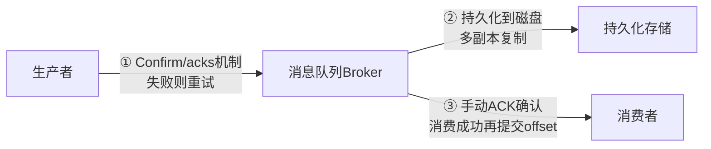

# 消息队列 Message Queue

## 概念

消息队列（Message Queue）是分布式系统中实现服务解耦、异步处理和削峰填谷的核心中间件。

### 为什么需要消息队列？

**1. 服务解耦 (Decoupling)**

没有消息队列时，上游服务需要知道所有下游服务的接口并逐一调用：

```
订单服务 ──► 库存服务
   │
   ├──► 积分服务
   │
   ├──► 通知服务
   │
   └──► 物流服务     ← 新增一个下游就要修改订单服务代码
```

引入消息队列后，上游只需发送一条消息，下游按需订阅：

```
订单服务 ──► MQ ──► 库存服务
              ├──► 积分服务
              ├──► 通知服务
              └──► 物流服务     ← 新增下游无需修改订单服务
```

**2. 异步处理 (Async Processing)**

同步调用：用户下单 → 扣库存（50ms）→ 发积分（50ms）→ 发短信（100ms） = **200ms**

异步消息：用户下单 → 扣库存（50ms）→ 发消息到 MQ（5ms） = **55ms**
积分、短信等由消费者异步处理，用户无需等待。

**3. 削峰填谷 (Peak Shaving)**

```
请求量
  ▲
  │    ┌──────┐
  │    │ 峰值  │
  │    │10000 │        消息队列作为缓冲
  │    │ QPS  │        ┌─────────────────────
  │    │      │        │ 消费者以固定速率处理
  │────┘      └────────│ 如 2000 QPS
  │                    └─────────────────────
  └───────────────────────────────────────► 时间
```

秒杀场景下，瞬时请求写入 MQ，消费者以稳定速率处理，避免数据库被瞬时流量压垮。

### 核心概念

| 概念 | 说明 |
|------|------|
| **Producer（生产者）** | 消息的发送方，负责将消息发送到 Broker |
| **Consumer（消费者）** | 消息的接收方，负责从 Broker 拉取或接收消息并处理 |
| **Broker（代理/服务端）** | 消息队列服务器，负责存储和转发消息 |
| **Topic（主题）** | 消息的逻辑分类，Producer 将消息发送到指定 Topic |
| **Partition（分区）** | Topic 的物理分片，用于并行处理和水平扩展 |
| **Consumer Group（消费者组）** | 一组消费者共同消费一个 Topic，每条消息只被组内一个消费者处理 |
| **Offset（偏移量）** | 消息在分区中的位置标识，消费者通过 Offset 追踪消费进度 |

### 消息模型

**点对点模型 (Point-to-Point)**

每条消息只能被**一个消费者**消费，消费后即从队列中移除。

```
Producer ──► Queue ──► Consumer A（消费消息 1）
                  ──► Consumer B（消费消息 2）
                  ──► Consumer A（消费消息 3）
```

适用场景：任务分发、工单处理（每个任务只需处理一次）。

**发布/订阅模型 (Pub/Sub)**

每条消息可以被**多个订阅者**消费，每个订阅者独立接收完整的消息副本。

```
Producer ──► Topic ──► Consumer Group A（订单处理）
                  ├──► Consumer Group B（日志记录）
                  └──► Consumer Group C（数据分析）
```

Kafka 采用的就是 Pub/Sub 模型，通过 Consumer Group 实现灵活的消费模式：
- **不同 Group** 订阅同一 Topic → 每个 Group 都能收到全量消息（广播）
- **同一 Group** 内的多个 Consumer → 分担消费（负载均衡）

## 核心原理

### 消息投递语义

| 语义 | 说明 | 可能的问题 | 实现难度 |
|------|------|-----------|---------|
| **At-most-once** | 消息最多投递一次，可能丢失 | 消息丢失 | 低 |
| **At-least-once** | 消息至少投递一次，不会丢失但可能重复 | 消息重复 | 中 |
| **Exactly-once** | 消息恰好投递一次，不丢不重 | 无 | 高 |

**At-most-once（最多一次）**

Producer 发送消息后不等待确认，Consumer 收到消息后先提交 Offset 再处理。如果处理失败，消息不会重新投递。

```
Producer ──发送──► Broker（不等 ACK）
Consumer ──► 提交 Offset ──► 处理消息（失败则消息丢失）
```

适用场景：日志采集、监控指标上报（允许少量数据丢失）。

**At-least-once（至少一次）**

Producer 发送消息后等待 Broker 的 ACK 确认，失败则重试。Consumer 先处理消息再提交 Offset，如果提交 Offset 前崩溃，重启后会重新消费。

```
Producer ──发送──► Broker ──ACK──► Producer（确认收到）
Consumer ──► 处理消息 ──► 提交 Offset（处理完才提交）
```

适用场景：大多数业务场景（订单、支付），配合幂等性保证不重复处理。

**Exactly-once（恰好一次）**

最难实现的语义，通常通过幂等 Producer + 事务性消费来实现。Kafka 0.11+ 支持幂等 Producer 和事务（Transactional API），但有性能开销。

> 实际工程中，大多数系统采用 **At-least-once + 业务幂等** 的方案，兼顾可靠性和性能。

### Kafka 架构详解

**整体架构**

```
┌─────────────────────────────────────────────────────────┐
│                     Kafka Cluster                        │
│                                                          │
│  ┌──────────┐   ┌──────────┐   ┌──────────┐             │
│  │ Broker 0  │   │ Broker 1  │   │ Broker 2  │             │
│  │           │   │           │   │           │             │
│  │ Topic-A   │   │ Topic-A   │   │ Topic-A   │             │
│  │ P0(Leader)│   │ P1(Leader)│   │ P2(Leader)│             │
│  │ P1(Replica│   │ P2(Replica│   │ P0(Replica│             │
│  └──────────┘   └──────────┘   └──────────┘             │
│                                                          │
│  ┌─────────────────────────────────────────┐             │
│  │             ZooKeeper / KRaft            │             │
│  │   （集群元数据管理、Leader 选举）           │             │
│  └─────────────────────────────────────────┘             │
└─────────────────────────────────────────────────────────┘

Producer ──►  Broker（根据 Partition 策略路由）

Consumer Group A:
  Consumer 1 ← P0
  Consumer 2 ← P1
  Consumer 3 ← P2
```

**Partition 与 Offset**

每个 Partition 是一个有序的、不可变的消息序列，新消息追加到末尾。Offset 是消息在 Partition 中的唯一编号。

```
Partition 0:
┌───┬───┬───┬───┬───┬───┬───┬───┐
│ 0 │ 1 │ 2 │ 3 │ 4 │ 5 │ 6 │ 7 │  ← Offset
└───┴───┴───┴───┴───┴───┴───┴───┘
                          ▲
                     Consumer 当前消费位置

Partition 1:
┌───┬───┬───┬───┬───┐
│ 0 │ 1 │ 2 │ 3 │ 4 │  ← Offset
└───┴───┴───┴───┴───┘
              ▲
         Consumer 当前消费位置
```

**ISR（In-Sync Replicas）机制**

ISR 是与 Leader 保持完全同步的副本集合。只有 ISR 中的副本才有资格参与 ACK 确认和 Leader 选举。

```
Leader (Broker 0)          Follower (Broker 1)        Follower (Broker 2)
      │                           │                           │
      │◄── 持续同步（已追上）────────│                           │
      │                           │◄── 落后太多（滞后）─────────│
      │                           │                           │
ISR = { Broker 0, Broker 1 }    ← Broker 2 已被踢出 ISR
```

`acks` 配置对可靠性和性能的影响：

| acks 值 | 含义 | 丢消息风险 | 吞吐量 |
|---------|------|-----------|--------|
| `acks=0` | Producer 不等待任何确认，即发即忘 | 高 | 最高 |
| `acks=1` | Leader 写入本地日志即返回成功 | 中（Leader 宕机未同步则丢失）| 中 |
| `acks=all`（或 `-1`） | 等待所有 ISR 副本确认写入 | 最低 | 最低 |

`min.insync.replicas` 配置：指定 ISR 中至少需要多少个副本确认，写入才算成功。与 `acks=all` 配合使用：

```
# 典型高可靠配置
replication.factor=3         # 3 个副本
min.insync.replicas=2        # 至少 2 个 ISR 副本确认
acks=all                     # 等待所有 ISR
```

上述配置意味着：即使 1 个副本宕机，写入仍然成功；若 2 个副本宕机，写入会失败（抛出 `NotEnoughReplicasException`），从而防止数据丢失。

**ISR 收缩时发生什么：**

当 Follower 副本的消息同步滞后超过 `replica.lag.time.max.ms`（默认 30s），该副本会被踢出 ISR。此时：
- 若 ISR 大小降至 `min.insync.replicas` 以下，且 `acks=all`，新的写请求会直接报错
- Leader 会继续工作，等待落后副本追上后重新加入 ISR

`unclean.leader.election.enable`（默认 false）：
- `false`：只允许 ISR 中的副本成为新 Leader，避免数据丢失，但若 ISR 为空则分区不可用
- `true`：允许落后的副本（不在 ISR 中）成为 Leader，牺牲一致性换取可用性，**生产环境强烈建议保持 false**

#### 高水位（HW）与 LEO：Kafka 数据可见性的核心

**HW（High Watermark）和 LEO（Log End Offset）是 Kafka 副本机制最容易被深挖的细节**——能讲清楚这两个，立刻显出对 Kafka 有真正的理解。

```
                          Leader Partition
  ┌────┬────┬────┬────┬────┬────┬────┬────┐
  │ m0 │ m1 │ m2 │ m3 │ m4 │ m5 │ m6 │ m7 │
  └────┴────┴────┴────┴────┴────┴────┴────┘
                          ▲              ▲
                          │              │
                          HW=5           LEO=8
              消费者只能看到 < HW         Leader 自己写到 LEO
              的数据 (m0..m4)           （还未被所有 ISR 复制）

  Follower 1 (in ISR):  m0..m6   LEO=7  ← 比 Leader 落后 1 条
  Follower 2 (in ISR):  m0..m5   LEO=6  ← 比 Leader 落后 2 条

  → HW = min(所有 ISR 的 LEO) = min(8, 7, 6) = 6  (写错了，应该是 5)
  → 等所有 ISR 都同步到 m6, HW 才推到 6
```

| 术语 | 含义 | 影响 |
|------|------|------|
| **LEO（Log End Offset）** | 每个副本各自的"最新位移+1" | 每写一条消息 +1 |
| **HW（High Watermark）** | **所有 ISR 中最小的 LEO** | **消费者只能消费到 HW-1** |
| **ISR 全部确认** | 一条消息写入到所有 ISR 副本 | HW 才会推进 |

**为什么消费者只能消费到 HW**：保证已经被消费者读到的数据**就算 Leader 挂了，新 Leader 上也一定有**——避免"读到了又消失了"的灾难。

::: warning ⚠️ HW 截断引发的丢消息坑（Leader Epoch 解决）

旧版 Kafka 在 Leader 切换时，新 Leader 会让 Follower **截断到自己的 HW** → 可能丢数据。Kafka 0.11+ 引入 **Leader Epoch**：每次 Leader 变更 epoch +1，截断时查询 epoch 对应的位移，避免误截。**面试加分点**：能说出"HW 截断 + Leader Epoch 修复"。

:::

#### 幂等 Producer 与事务 API

**幂等 Producer（idempotent producer）** 是 Kafka 0.11+ 的关键特性，解决"网络抖动重试导致重复消息"：

```
关键机制:
  ① Producer 启动时分配唯一 PID（Producer ID）
  ② 每条消息带 <PID, Partition, SequenceNumber>
  ③ Broker 端按 <PID, Partition> 维护期望的 sequence
  ④ 收到 sequence == expected → 接受
     收到 sequence < expected → **去重丢弃**（这就是幂等保证）
     收到 sequence > expected → 拒绝（OutOfOrderSequence）
```

**配置**：
```properties
enable.idempotence=true       # 启用幂等
acks=all                       # 必须配合
retries=Integer.MAX_VALUE      # 安全重试
max.in.flight.requests.per.connection=5  # ≤ 5 才能保证有序
```

::: tip 💡 幂等 Producer ≠ 跨分区幂等

> **幂等 Producer 只保证"同一 Producer、同一 Partition 内"消息不重复**。要做到跨分区、跨会话的精确一次（exactly-once）必须用**事务 API**。

:::

**事务 API**（exactly-once 语义关键）：
```java
producer.initTransactions();
producer.beginTransaction();
producer.send(new ProducerRecord<>("orders", order));
producer.send(new ProducerRecord<>("inventory", deduct));
producer.commitTransaction();   // 全部成功才可见
// 或 producer.abortTransaction();
```

#### 为什么 Kafka 这么快：零拷贝 + 顺序 IO

**Kafka 单机几十万 TPS 的核心三招**：

| 技术 | 收益 |
|------|------|
| **顺序写磁盘** | 顺序写性能 ≈ 内存随机写（~600 MB/s 机械盘）|
| **PageCache** | 操作系统页缓存，**所有读写先走内存** |
| **零拷贝 sendfile** | 消费时数据从 PageCache 直接到网卡，**省 4 次拷贝 + 2 次上下文切换**（详见 [OS — 零拷贝](../operating-systems/io-model#_4-零拷贝-zero-copy)）|

```
传统模式（4 次拷贝）:
  磁盘 → 内核 PageCache → 用户态 buffer → 内核 socket buffer → 网卡

零拷贝模式（sendfile）:
  磁盘 → 内核 PageCache → 网卡    ← 全程不出内核态
```

::: tip 💡 面试黄金回答

> **"Kafka 的吞吐能到几十万 TPS，靠的是三件事：① 顺序写磁盘（不是随机写），机械盘的顺序写都能跑到 600MB/s；② 充分利用 OS PageCache 而非自建缓存；③ 消费用 sendfile 零拷贝，数据从内核 PageCache 直接到网卡。"**

:::

**Consumer Group Rebalance**

当 Consumer Group 中的成员数量发生变化时（消费者加入或离开），Kafka 会触发 **Rebalance（重平衡）**，重新分配 Partition 与 Consumer 的绑定关系。

```
Rebalance 前：                    Rebalance 后（Consumer 3 离开）：
┌──────────┐                     ┌──────────┐
│Consumer 1│← P0                 │Consumer 1│← P0, P2
│Consumer 2│← P1                 │Consumer 2│← P1
│Consumer 3│← P2  (下线)         └──────────┘
└──────────┘
```

**Rebalance 的缺点：**
- 重平衡期间整个 Consumer Group 暂停消费（Stop The World）
- 频繁 Rebalance 会影响吞吐量
- 可能导致消息重复消费（Offset 还未提交就发生了 Rebalance）

**优化方案：**
- 增大 `session.timeout.ms` 和 `heartbeat.interval.ms`，减少误判消费者离线
- 使用 Kafka 2.3+ 的 **Cooperative Sticky Assignor**，支持增量 Rebalance，减少影响范围

### 消息顺序性

Kafka 保证**同一 Partition 内的消息是有序的**。要保证某类消息的顺序，需要将它们路由到同一个 Partition。

```java
// 通过指定 key 保证同一订单的消息进入同一 Partition
producer.send(new ProducerRecord<>("order-topic", orderId, message));
// Kafka 默认按 key 的 hash 值 % partition 数来选择分区
```

全局有序要求 Topic 只设 1 个 Partition，但这意味着只能有 1 个 Consumer，完全丧失了并行消费的能力，**吞吐量极低**。

> 实际工程中，大多数场景只需要**业务维度的有序**（如同一用户的操作有序），通过 Partition Key 即可实现，不需要全局有序。

### 死信队列与重试机制

当消息消费失败且达到最大重试次数后，将消息转移到**死信队列**，避免阻塞正常消息的消费。

```
正常 Topic ──► Consumer ──处理失败──► 重试队列（最多 3 次）
                                         │
                                    重试仍失败
                                         ▼
                                    死信队列 (DLQ)
                                         │
                                    人工排查 / 告警
```

```java
@KafkaListener(topics = "order-topic")
public void consume(ConsumerRecord<String, String> record) {
    int maxRetries = 3;
    int retryCount = getRetryCount(record); // 从 Header 获取重试次数

    try {
        processOrder(record.value());
    } catch (Exception e) {
        if (retryCount < maxRetries) {
            // 发送到重试 Topic，携带重试次数
            sendToRetryTopic(record, retryCount + 1);
        } else {
            // 超过最大重试次数，发送到死信队列
            sendToDeadLetterQueue(record);
            log.error("消息处理失败，已发送至 DLQ: {}", record.value());
        }
    }
}
```

**重试策略建议：**
- 使用**指数退避**（Exponential Backoff）：第 1 次重试等 1s，第 2 次等 4s，第 3 次等 16s
- 设置合理的最大重试次数（通常 3~5 次）
- 死信队列需要配套监控告警和人工处理机制

### 消息幂等性

由于 At-least-once 语义下消息可能重复投递，消费者必须保证**幂等处理**（处理多次和处理一次的结果相同）。

**方案一：数据库唯一约束**

```java
// 利用数据库唯一索引防止重复插入
try {
    orderMapper.insert(order); // orderId 设置唯一索引
} catch (DuplicateKeyException e) {
    log.info("订单已存在，忽略重复消息: {}", order.getOrderId());
}
```

**方案二：Redis 去重**

```java
public boolean processMessage(String messageId, String payload) {
    // SETNX: 如果 key 不存在则设置，返回 true；已存在则返回 false
    Boolean isNew = redis.opsForValue()
        .setIfAbsent("msg:dedup:" + messageId, "1", 24, TimeUnit.HOURS);

    if (Boolean.FALSE.equals(isNew)) {
        log.info("重复消息，跳过处理: {}", messageId);
        return false;
    }

    // 首次处理
    doProcess(payload);
    return true;
}
```

**方案三：幂等性 Key（Idempotency Key）**

Producer 为每条消息生成全局唯一的幂等 Key，Consumer 处理前检查是否已处理过。

```java
// Producer 端
String idempotencyKey = UUID.randomUUID().toString();
ProducerRecord<String, String> record = new ProducerRecord<>("topic", key, value);
record.headers().add("idempotency-key", idempotencyKey.getBytes());

// Consumer 端
String idempotencyKey = new String(record.headers().lastHeader("idempotency-key").value());
if (idempotencyStore.exists(idempotencyKey)) {
    return; // 已处理，跳过
}
idempotencyStore.save(idempotencyKey);
processMessage(record.value());
```

### RocketMQ 事务消息

RocketMQ 通过**半消息（Half Message）机制**实现分布式事务，保证本地事务与消息发送的原子性。

**半消息流程：**

```
Producer                    Broker                     Consumer
   │                           │                           │
   │──① 发送半消息─────────────►│                           │
   │                           │（存入内部 half topic，     │
   │                           │  消费者不可见）            │
   │◄─② 返回发送结果────────────│                           │
   │                           │                           │
   │──③ 执行本地事务            │                           │
   │   （本地 DB 操作）         │                           │
   │                           │                           │
   │──④ 发送 Commit/Rollback──►│                           │
   │   （成功→Commit，失败→     │                           │
   │     Rollback）            │                           │
   │                           │──⑤ Commit: 消息可见──────►│
   │                           │   Rollback: 消息删除      │
   │                           │                           │
   │         （若 Producer 崩溃，Broker 发起回查）          │
   │◄─⑥ Broker 回查本地事务状态─│                           │
   │──⑦ 返回事务状态────────────►│                           │
```

**Java 代码示例（TransactionListener 实现）：**

```java
// 1. 定义事务监听器
public class OrderTransactionListener implements TransactionListener {

    @Autowired
    private OrderService orderService;

    // 执行本地事务（半消息发送成功后调用）
    @Override
    public LocalTransactionState executeLocalTransaction(Message msg, Object arg) {
        try {
            String orderId = new String(msg.getBody());
            // 执行本地数据库操作
            orderService.createOrder(orderId);
            return LocalTransactionState.COMMIT_MESSAGE; // 本地事务成功，提交消息
        } catch (Exception e) {
            log.error("本地事务执行失败", e);
            return LocalTransactionState.ROLLBACK_MESSAGE; // 本地事务失败，回滚消息
        }
    }

    // Broker 回查时调用（用于 Producer 崩溃恢复）
    @Override
    public LocalTransactionState checkLocalTransaction(MessageExt msg) {
        String orderId = new String(msg.getBody());
        // 查询本地事务是否已完成
        boolean exists = orderService.orderExists(orderId);
        return exists
            ? LocalTransactionState.COMMIT_MESSAGE
            : LocalTransactionState.ROLLBACK_MESSAGE;
    }
}

// 2. 发送事务消息
TransactionMQProducer producer = new TransactionMQProducer("order-producer-group");
producer.setTransactionListener(new OrderTransactionListener());
producer.start();

Message msg = new Message("order-topic", orderId.getBytes());
// sendMessageInTransaction 会自动走半消息流程
TransactionSendResult result = producer.sendMessageInTransaction(msg, null);
```

## 技术选型与对比

| 特性 | Kafka | RabbitMQ | RocketMQ |
|------|-------|----------|----------|
| **开发语言** | Scala/Java | Erlang | Java |
| **单机吞吐量** | 百万级 TPS | 万级 TPS | 十万级 TPS |
| **消息延迟** | ms 级 | us 级（微秒） | ms 级 |
| **消息可靠性** | 高（副本机制） | 高（镜像队列） | 高（同步刷盘） |
| **消息顺序** | Partition 级别有序 | 不保证 | Queue 级别有序 |
| **事务消息** | 支持（Kafka Transactions） | 不支持原生事务 | 支持（半消息机制） |
| **延迟消息** | 不原生支持 | 支持（TTL + DLX） | 原生支持 |
| **消息回溯** | 支持（按 Offset 回溯） | 不支持 | 支持（按时间回溯） |
| **社区生态** | 大数据生态丰富 | 插件丰富 | 阿里巴巴开源 |
| **典型场景** | 日志、大数据流处理、事件溯源 | 企业级消息集成、复杂路由 | 电商、金融交易 |

**选型建议：**
- **大数据/日志流处理** → Kafka（高吞吐、持久化、与 Flink/Spark 生态集成好）
- **企业应用/复杂路由** → RabbitMQ（灵活的路由机制、低延迟、协议标准化）
- **电商/金融** → RocketMQ（事务消息、延迟消息、阿里巴巴大规模验证）

### Pulsar：云原生时代的新选择

**Apache Pulsar**（Yahoo 开源 → Apache 顶级项目）是 2024-2025 年崛起的"**云原生流处理平台**"，**StreamNative、Splunk、腾讯、华为**等已大规模采用。能讲清楚 Pulsar 和 Kafka 的本质差异，是 MQ 面试的加分项。

#### 核心差异：存算分离

```
Kafka:                          Pulsar:
┌────────────────┐              ┌────────────────┐
│  Broker        │              │  Broker        │  ← 只负责调度（无状态）
│  ├─ 数据存储    │              │  (stateless)   │
│  └─ 路由调度    │              └────────────────┘
└────────────────┘                      ↓
                                ┌────────────────┐
                                │  BookKeeper    │  ← 专门的分布式存储
                                │  (data layer)  │
                                └────────────────┘
存储与计算耦合                    存算分离 → 任意扩展、Broker 秒级重启
```

#### Pulsar vs Kafka 深度对比

| 维度 | Kafka | **Pulsar** |
|------|-------|----------|
| **架构** | 存算耦合 | **存算分离**（Broker + BookKeeper）|
| **扩容** | 涉及数据迁移，慢 | **Broker 秒级扩容**，数据不动 |
| **多租户** | 弱（依赖独立集群隔离）| **强**（namespace 原生隔离）|
| **地理复制** | MirrorMaker 2（异步）| **原生 geo-replication** |
| **消息模型** | 仅流式（partition）| **流式 + 队列**（Shared/Exclusive/Failover 订阅）|
| **分层存储** | 3.6+ 才支持 | **原生**（热数据 BookKeeper + 冷数据 S3）|
| **延迟消息** | 不支持 | **原生**（毫秒级精度）|
| **生态** | **最成熟**（Flink、Spark）| 较新但快速增长 |
| **适合** | 通用流处理、有 Kafka 历史 | **云原生、多租户、地理复制** |

#### Pulsar 关键优势

::: tip 💡 Pulsar 适合什么场景

> ① **K8s 上跑 MQ**：Broker 无状态，pod 重启秒级 vs Kafka 分钟级；② **多租户 SaaS**：单集群隔离上百个租户；③ **跨地域多活**：geo-replication 比 MirrorMaker 简单太多；④ **延迟消息**：原生毫秒级精度，无需 RocketMQ；⑤ **存储成本敏感**：分层存储自动把老消息推到 S3。

:::

#### 为什么 Kafka 仍是主流

- **生态最成熟**：Flink、Spark、Beam、Debezium 都首先支持 Kafka
- **企业熟悉度高**：99% 大数据工程师都用过
- **Kafka 4.0**（2025）也引入分层存储和 KRaft（去 ZK 化），追上 Pulsar 的部分优势

### 消息可靠性三端方案（必背）

**面试 Top 1 题目**：消息怎么保证不丢？答题必须**完整覆盖 Producer/Broker/Consumer 三端**。

```
┌─────────────────────────────────────────────────┐
│ Producer 端                                       │
│  ├─ acks=all                                     │
│  ├─ retries=MAX, max.in.flight=1（保序）         │
│  ├─ 同步发送 (send().get())                       │
│  └─ enable.idempotence=true（防重）              │
├─────────────────────────────────────────────────┤
│ Broker 端                                         │
│  ├─ replication.factor >= 3                      │
│  ├─ min.insync.replicas >= 2                     │
│  ├─ unclean.leader.election.enable=false         │
│  └─ flush.messages / log.flush.interval.messages │
├─────────────────────────────────────────────────┤
│ Consumer 端                                       │
│  ├─ enable.auto.commit=false                     │
│  ├─ 业务处理成功后才 commit offset                │
│  ├─ 消费端做幂等                                  │
│  └─ 失败消息进 DLQ（死信队列）                    │
└─────────────────────────────────────────────────┘
```

::: warning ⚠️ 三个端少一个都白搭

> **Producer 设了 acks=all 但 Broker 只 1 个副本** = 副本挂了消息丢；**Broker 配了 3 副本但 Consumer 自动提交 offset** = 消费失败但 offset 已提交，消息丢。**必须三端配合**。

:::

### 实战案例：延迟消息实现订单超时取消

**场景：** 用户下单后 30 分钟未付款，自动取消订单。

**方案一：RocketMQ 延迟消息**

RocketMQ 原生支持延迟消息，通过预设的延迟级别实现：

```
延迟级别（delayLevel）:
1s 5s 10s 30s 1m 2m 3m 4m 5m 6m 7m 8m 9m 10m 20m 30m 1h 2h
                                                  ↑
                                              级别 16 = 30 分钟
```

```java
Message msg = new Message("order-cancel-topic", orderId.getBytes());
msg.setDelayTimeLevel(16); // 第 16 级 = 30 分钟后投递
producer.send(msg);

// Consumer 收到消息时订单已经过了 30 分钟
@RocketMQMessageListener(topic = "order-cancel-topic", consumerGroup = "cancel-group")
public class OrderCancelConsumer implements RocketMQListener<String> {
    @Override
    public void onMessage(String orderId) {
        orderService.cancelIfUnpaid(orderId); // 检查未付款则取消
    }
}
```

**方案二：Redis ZSET**

以超时时间戳作为 score，轮询工作线程定期扫描到期任务：

```java
// 下单时将 orderId 放入 ZSET，score = 当前时间 + 30分钟
long expireAt = System.currentTimeMillis() + 30 * 60 * 1000;
redis.opsForZSet().add("order:timeout", orderId, expireAt);

// 定时任务（每隔 5s 扫描一次）
@Scheduled(fixedDelay = 5000)
public void scanTimeoutOrders() {
    long now = System.currentTimeMillis();
    // 取出 score <= now 的所有订单（已到期）
    Set<String> timeoutOrders = redis.opsForZSet()
        .rangeByScore("order:timeout", 0, now);
    for (String orderId : timeoutOrders) {
        orderService.cancelIfUnpaid(orderId);
        redis.opsForZSet().remove("order:timeout", orderId);
    }
}
```

**方案三：Kafka + TTL**

Kafka 不原生支持延迟消息，通常通过专门的延迟 Topic + 时间轮调度实现：

```
Producer ──► delay-30m-topic（带时间戳）
                  │
            延迟消费服务（检查消息时间戳，未到期则 sleep/重放）
                  │
            到期 ──► order-cancel-topic ──► Consumer 处理
```

**三种方案对比：**

| 对比维度 | RocketMQ 延迟消息 | Redis ZSET | Kafka + 延迟服务 |
|---------|-----------------|------------|-----------------|
| **实现复杂度** | 低（原生支持） | 中 | 高 |
| **精度** | 固定级别（30m 等） | 秒级（取决于轮询间隔） | 自定义 |
| **可靠性** | 高（持久化） | 中（依赖 Redis 持久化） | 高（Kafka 持久化） |
| **扩展性** | 受限于预设级别 | 好（任意时间） | 好（任意时间） |
| **适用场景** | 电商标准延迟场景 | 中小规模、已有 Redis 基础设施 | 大数据量、已有 Kafka 基础设施 |

> 实际工程中，**RocketMQ 延迟消息**是最简单可靠的方案；若技术栈已有 Redis 且规模不大，**Redis ZSET** 也是轻量选择。

## 面试常问 & 怎么答

### Q1: 如何保证消息不丢失？

从三个环节分别保障：

**Producer 端：**
- 使用同步发送（`producer.send().get()`）或带回调的异步发送
- 设置 `acks=all`（等待所有 ISR 副本确认），确保消息写入多个副本
- 配置合理的重试次数（`retries`）和重试间隔

**Broker 端：**
- 设置 `replication.factor >= 3`（至少 3 个副本）
- 设置 `min.insync.replicas >= 2`（至少 2 个副本确认写入）
- 配合 `acks=all`，确保 ISR 中有足够副本同步后才返回成功
- `unclean.leader.election.enable=false`，防止落后的副本成为 Leader 导致数据丢失

**Consumer 端：**
- 关闭自动提交 Offset（`enable.auto.commit=false`）
- 消息处理成功后再手动提交 Offset
- 配合幂等消费，防止重复处理

### Q2: Kafka 如何保证消息顺序性？

Kafka 保证的是 **Partition 级别的有序性**，而非全局有序。

**实现方式：** 将需要保序的消息发送到同一 Partition，通过指定同一个 key（如 orderId、userId）：

```java
producer.send(new ProducerRecord<>("topic", orderId, message));
```

Kafka 默认使用 key 的 hash 值对 Partition 数取模来选择分区，同一 key 的消息一定进入同一 Partition。

**注意事项：**
- 如果 Partition 数量发生变化（扩容），hash 映射会改变，历史消息的顺序关系可能被打破
- 同一 Partition 只能被同一 Consumer Group 中的一个 Consumer 消费，天然保证顺序
- 如果需要全局有序，只能设置 1 个 Partition，但吞吐量会大幅下降

### Q3: 如何实现幂等消费？

由于网络抖动、Consumer Rebalance 等原因，消息可能被重复投递。消费者需要保证**幂等性** —— 处理多次和处理一次的结果相同。

**常用方案：**

| 方案 | 原理 | 适用场景 |
|------|------|---------|
| 数据库唯一约束 | 利用唯一索引防止重复插入 | 订单创建、用户注册 |
| Redis 去重 | SETNX 记录已处理的 messageId | 通用场景，高性能 |
| 幂等 Key | Producer 生成唯一 Key，Consumer 处理前检查 | 跨系统消息去重 |
| 状态机 | 业务状态只能单向流转（如待支付→已支付），重复消费不影响 | 订单状态变更 |

**最佳实践：** 采用 At-least-once 投递语义 + 业务侧幂等处理，是兼顾可靠性和性能的主流方案。

### Q4: Kafka 为什么吞吐量高？

Kafka 的高吞吐量来自多个层面的设计：

| 技术点 | 说明 |
|--------|------|
| **顺序磁盘 I/O** | 消息追加写入，顺序读写比随机读写快 2~3 个数量级 |
| **零拷贝（Zero Copy）** | 使用 `sendfile` 系统调用，数据从磁盘直接到网卡，跳过用户态拷贝 |
| **批量发送与压缩** | Producer 将多条消息打包为一个批次（batch）发送，减少网络往返次数 |
| **Partition 并行** | 多个 Partition 可并行读写，线性扩展吞吐量 |
| **Page Cache** | 写入先到操作系统 Page Cache（内存），由 OS 异步刷盘，读取优先命中 Cache |

> 面试回答时，把"顺序写 + 零拷贝 + 批量 + 分区并行 + Page Cache"五点串联起来，完整展示对 Kafka 底层的理解。

## 看到什么就先想到这类

| 关键词 / 场景 | 第一反应 |
|-------------|---------|
| 异步解耦、削峰填谷 | 引入消息队列 |
| 高吞吐日志、事件流、大数据 | Kafka |
| 事务消息、电商订单、金融 | RocketMQ 半消息机制 |
| 复杂路由、灵活协议、企业集成 | RabbitMQ |
| 消息丢失问题 | acks=all + min.insync.replicas + 手动提交 Offset |
| 消息重复问题 | ACK + 幂等消费（数据库唯一键 / Redis SETNX） |
| 延迟任务、订单超时取消 | RocketMQ 延迟消息 / Redis ZSET |
| ISR 收缩、脑裂、数据一致性 | unclean.leader.election.enable=false |

## 延伸阅读

- [Kafka 官方文档 - Design](https://kafka.apache.org/documentation/#design)
- [RabbitMQ 官方教程](https://www.rabbitmq.com/tutorials)
- [RocketMQ 设计理念](https://rocketmq.apache.org/docs/)
- 《Kafka 权威指南》第 4 章：Kafka 消费者
- 《企业集成模式》（Enterprise Integration Patterns）

## 思考题

**Q: 如何保证消息不丢失（三端保证）？**

A: 消息全链路分三段，每段都要保证：



① **生产者**：Kafka开启 `acks=all`（等待所有副本确认）+ `enable.idempotence=true`（幂等发送）；RabbitMQ开启Confirm机制，失败触发重试；② **Broker**：Kafka设 `replication.factor>=3` + `min.insync.replicas=2`，消息持久化+多副本；③ **消费者**：手动提交offset（Kafka）或手动ACK（RabbitMQ），消费成功后再确认，失败进死信队列（DLQ）重试。

**Q: 如何保证消息的顺序性？**

A: 两个层面：① **全局顺序**——同一Topic只用一个分区/队列（Kafka单Partition），牺牲并发，极少使用；② **局部顺序**（推荐）——同一业务key的消息路由到同一分区（Kafka按key hash，RocketMQ通过MessageQueueSelector），同一分区内单线程消费。消费端不能并发消费同一分区，否则顺序仍无法保证。实践中绝大多数业务只需局部顺序（如同一订单的状态变更有序即可）。

**Q: 如何保证消息幂等（不重复消费）？**

A: Broker无法保证不重复投递（网络重试可能导致重复），消费端必须自己保证幂等：① **唯一消息ID + 幂等表**——消费时将message_id插入数据库唯一索引表，重复消息触发唯一键冲突被忽略；② **Redis去重**——`SETNX message_id 1 EX 86400`，已处理返回0直接跳过；③ **业务层幂等**——如UPDATE加版本号（`WHERE version = 1 AND status = 'PENDING'`），重复执行影响0行则幂等；④ **数据库唯一索引兜底**——关键业务（如创建订单）依赖唯一索引防重复写入。

**Q: 什么是事务消息？RocketMQ如何实现？**

A: 事务消息解决**本地事务与消息发送的原子性**问题（防止本地事务成功但消息未发，或消息发出但事务回滚）。RocketMQ半消息机制：① 发送**半消息**（half message）到Broker，对消费者不可见；② 执行**本地事务**（如扣减库存）；③ 成功→发送Commit，消息对消费者可见；失败→发送Rollback，删除半消息；④ 若Broker未收到Commit/Rollback，**定时回查**本地事务状态（默认最多15次），根据回查结果决定提交或回滚。

**Q: 消息积压如何处理？**

A: 分紧急处理和预防两个维度。**紧急处理**：① 新建Topic并扩大分区数，将积压消息迁移到新Topic，同时扩容消费者实例；② 对非关键消息临时降级（跳过或丢弃），保证关键消息优先处理；③ 暂时关闭耗时的业务逻辑（如发短信），让消费者快速消费。**预防**：根据峰值流量设计分区数和消费者数（1个分区对应1个消费者线程上限）；监控consumer lag，设置告警阈值；生产者做背压控制，避免无限堆积。
