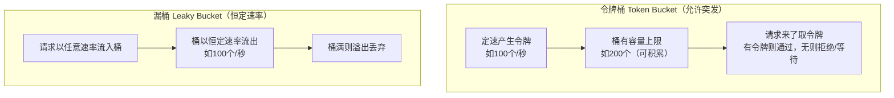

# 限流与熔断 Rate Limiting & Circuit Breaker

## 概念

限流（Rate Limiting）保护服务免受流量洪峰冲击，熔断（Circuit Breaker）在下游服务不可用时快速失败、防止级联故障。两者是分布式系统高可用保障的核心机制，也是系统设计面试的高频考点。

**为什么需要限流？**

在分布式系统中，突发流量（秒杀活动、爬虫、恶意攻击）可能在瞬间打垮服务。限流的目标是：

- **保护服务稳定性：** 防止超出系统处理能力的请求压垮服务
- **公平分配资源：** 避免少数用户或调用方消耗过多资源
- **防御恶意攻击：** 抵御 DDoS、CC 攻击等异常流量
- **降低成本：** 控制下游 API 的调用量，避免超额账单

**限流的常见维度：**
- 用户级别（每用户每秒 N 次请求）
- IP 级别（每 IP 每分钟 N 次请求）
- 接口级别（某接口全局 QPS 上限）
- 服务级别（整体入口流量上限）

**为什么需要熔断？**

当下游服务故障时，如果继续发送请求，会导致：
1. 调用方线程被阻塞，资源耗尽
2. 故障沿调用链向上传播，引发**级联故障（Cascading Failure）**

熔断器模式的核心思想：**快速失败，保护自身**。

## 核心原理

### 四大限流算法

#### 1. 固定窗口 (Fixed Window)

将时间划分为固定长度的窗口（如每秒），在每个窗口内维护一个计数器，计数器达到阈值则拒绝请求。

```
时间轴：
|---- 窗口 1 (00:00-00:01) ----|---- 窗口 2 (00:01-00:02) ----|
     请求计数: 98/100                请求计数: 0/100
     （允许通过）                     （重新计数）
```

```java
public class FixedWindowRateLimiter {
    private final int maxRequests;
    private final long windowSizeMs;
    private long windowStart;
    private int counter;

    public FixedWindowRateLimiter(int maxRequests, long windowSizeMs) {
        this.maxRequests = maxRequests;
        this.windowSizeMs = windowSizeMs;
        this.windowStart = System.currentTimeMillis();
        this.counter = 0;
    }

    public synchronized boolean tryAcquire() {
        long now = System.currentTimeMillis();
        if (now - windowStart >= windowSizeMs) {
            // 进入新窗口，重置计数
            windowStart = now;
            counter = 0;
        }
        if (counter < maxRequests) {
            counter++;
            return true;
        }
        return false; // 限流
    }
}
```

**优点：** 简单高效，内存占用小。

**缺点：** 存在**临界突刺问题** —— 在窗口交界处（如 00:59 发 100 个请求 + 01:00 发 100 个请求），实际 1 秒内通过了 200 个请求，超出预期限制。

#### 2. 滑动窗口 (Sliding Window)

将固定窗口进一步细分为多个小窗口，统计当前时间向前滑动一个窗口长度内的请求总数，解决固定窗口的临界突刺问题。

```
时间分为 10 个子窗口（每个 100ms）:
|s1|s2|s3|s4|s5|s6|s7|s8|s9|s10|s1'|s2'|...
         ↑                   ↑
    滑动窗口起点          当前时间
    ←── 统计这个范围内的请求总数 ──→
```

```java
public class SlidingWindowRateLimiter {
    private final int maxRequests;
    private final long windowSizeMs;
    private final int subWindowCount;
    private final long subWindowSizeMs;
    private final int[] subWindows;
    private long currentSubWindowStart;
    private int currentSubWindowIndex;

    public SlidingWindowRateLimiter(int maxRequests, long windowSizeMs, int subWindowCount) {
        this.maxRequests = maxRequests;
        this.windowSizeMs = windowSizeMs;
        this.subWindowCount = subWindowCount;
        this.subWindowSizeMs = windowSizeMs / subWindowCount;
        this.subWindows = new int[subWindowCount];
        this.currentSubWindowStart = System.currentTimeMillis();
        this.currentSubWindowIndex = 0;
    }

    public synchronized boolean tryAcquire() {
        long now = System.currentTimeMillis();
        // 滑动到当前子窗口，清除过期的子窗口
        while (now - currentSubWindowStart >= subWindowSizeMs) {
            currentSubWindowStart += subWindowSizeMs;
            currentSubWindowIndex = (currentSubWindowIndex + 1) % subWindowCount;
            subWindows[currentSubWindowIndex] = 0;
        }
        // 统计整个窗口内的请求数
        int total = 0;
        for (int count : subWindows) {
            total += count;
        }
        if (total < maxRequests) {
            subWindows[currentSubWindowIndex]++;
            return true;
        }
        return false;
    }
}
```

**优点：** 解决固定窗口的临界突刺问题，限流更平滑。

**缺点：** 需要维护多个子窗口计数，内存占用相对更大。

#### 3. 令牌桶 (Token Bucket)

系统以固定速率往桶中放入令牌，每个请求需要取走一个令牌。桶满时多余的令牌被丢弃。桶空时请求被拒绝。

```
令牌生成器 ──► ┌─────────────┐
  (固定速率)    │  令牌桶       │
               │  容量=100     │ ──► 取走令牌 → 请求通过
               │  当前=73      │
               └─────────────┘
                      ↑
               桶满时令牌溢出丢弃
```

```java
public class TokenBucketRateLimiter {
    private final int maxTokens;       // 桶容量
    private final double refillRate;   // 每秒填充令牌数
    private double currentTokens;
    private long lastRefillTime;

    public TokenBucketRateLimiter(int maxTokens, double refillRate) {
        this.maxTokens = maxTokens;
        this.refillRate = refillRate;
        this.currentTokens = maxTokens;
        this.lastRefillTime = System.currentTimeMillis();
    }

    public synchronized boolean tryAcquire() {
        refill();
        if (currentTokens >= 1) {
            currentTokens -= 1;
            return true;
        }
        return false;
    }

    private void refill() {
        long now = System.currentTimeMillis();
        double elapsed = (now - lastRefillTime) / 1000.0;
        currentTokens = Math.min(maxTokens, currentTokens + elapsed * refillRate);
        lastRefillTime = now;
    }
}
```

**优点：** 允许**突发流量**（桶中有存量令牌时可以瞬间消耗），同时保证长期平均速率不超过上限。

**缺点：** 突发流量可能在短时间内消耗所有令牌，造成后续请求全被拒绝。

> Google Guava 的 `RateLimiter` 就是基于令牌桶算法实现的。

#### 4. 漏桶 (Leaky Bucket)

请求被放入桶中，桶以**固定速率**处理请求。桶满时新请求被拒绝。不管请求到达的速度如何波动，处理速率始终恒定。

```
请求涌入 ──► ┌─────────────┐
             │  漏桶         │
             │  容量=100     │ ──► 以固定速率漏出处理
             │  当前=45      │     （匀速消费）
             └──────┬──────┘
                    │
              恒定速率流出
```

```java
public class LeakyBucketRateLimiter {
    private final int capacity;       // 桶容量
    private final double leakRate;    // 每秒漏出速率
    private double currentWater;
    private long lastLeakTime;

    public LeakyBucketRateLimiter(int capacity, double leakRate) {
        this.capacity = capacity;
        this.leakRate = leakRate;
        this.currentWater = 0;
        this.lastLeakTime = System.currentTimeMillis();
    }

    public synchronized boolean tryAcquire() {
        leak();
        if (currentWater < capacity) {
            currentWater += 1;
            return true;
        }
        return false; // 桶满，拒绝
    }

    private void leak() {
        long now = System.currentTimeMillis();
        double elapsed = (now - lastLeakTime) / 1000.0;
        double leaked = elapsed * leakRate;
        currentWater = Math.max(0, currentWater - leaked);
        lastLeakTime = now;
    }
}
```

**优点：** 输出速率严格恒定，适合对下游调用要求匀速的场景。

**缺点：** 无法利用突发处理能力，即使系统空闲也不会提速。

#### 四种算法对比

| 算法 | 突发流量 | 平滑度 | 实现复杂度 | 典型应用 |
|------|---------|--------|-----------|---------|
| 固定窗口 | 有突刺 | 低 | 简单 | 简单计数场景 |
| 滑动窗口 | 较平滑 | 中 | 中等 | Sentinel、Nginx |
| 令牌桶 | 允许突发 | 高 | 中等 | Guava RateLimiter、API Gateway |
| 漏桶 | 严格匀速 | 最高 | 中等 | 流量整形、消息队列消费 |

#### 复杂度与决策矩阵

四个算法不是简单"哪个好"，而是按场景选——这是 2025-2026 年最常被追问的点。

| 算法 | 时间复杂度 | 空间复杂度 | 状态结构 | 何时**必选** | 何时**不要用** |
|------|----------|-----------|---------|-----------|-------------|
| **固定窗口** | O(1) | O(1) 一个计数器 | `count + windowStart` | 监控统计、调用计费 | 严格限流（边界双倍流量问题）|
| **滑动窗口（日志）** | O(N) 清理过期记录 | O(N) 存每个请求时间戳 | ZSet / List | 精确限流 + 中小流量 | 高 QPS（内存爆炸）|
| **滑动窗口（计数）** | O(1) 摊还 | O(M) M=窗口分桶数 | 数组桶 | 高 QPS 精确限流 | 需要请求级粒度溯源 |
| **令牌桶** | O(1) | O(1) 两个变量 | `tokens + lastRefillTime` | 允许突发的 API 限流 | 严格匀速（如下游脆弱）|
| **漏桶** | O(1) | O(1) 两个变量 | `water + lastLeakTime` | 流量整形、下游保护 | 用户体验优先（突发被削平）|

::: tip 💡 一个例子区分四者

某接口限制 **100 req/min**，瞬间来 200 个请求会怎样？

- **固定窗口**：第 0-59 秒挡掉后 100 个，第 60 秒立刻又能再放 100 个 → **边界双倍流量风险**
- **滑动窗口**：任意 60 秒内只能 100 个，第 100 个之后全挡，**最精确**
- **令牌桶**（容量 100，速率 100/分）：桶内有 100 token 时秒放 100 个，后 100 个排队等令牌补充 → **允许突发**
- **漏桶**（容量 100，漏速 100/分）：先收 100 个进桶，按 600ms/个匀速漏给下游，**对下游最友好**

:::

#### 三种"边界双倍流量"问题图解

```
固定窗口 100/min 的问题:
  时刻 0-59s:  ████████████████████ 100 req  允许
  时刻 60-119s:████████████████████ 100 req  允许
  但 第 59 秒末 → 第 60 秒初 (2 秒内 = 200 req) → 实际峰值 2x
                  ↑ 因为窗口重置

滑动窗口（计数）解法:
  把 1 分钟切成 10 个 6 秒的桶，每次只看最近 60 秒覆盖到的桶之和
  → 内存 O(M), 精度高
```

### 分布式限流（Redis 实现）

单机限流只能保护单个实例。在微服务场景下，通常需要**全局限流**，使用 Redis 作为中心化计数器。

**Redis + Lua 实现滑动窗口限流：**

```lua
-- KEYS[1]: 限流的 key（如 rate_limit:user:1001）
-- ARGV[1]: 窗口大小（毫秒）
-- ARGV[2]: 最大请求数
-- ARGV[3]: 当前时间戳（毫秒）

local key = KEYS[1]
local windowMs = tonumber(ARGV[1])
local maxCount = tonumber(ARGV[2])
local now = tonumber(ARGV[3])

-- 移除窗口外的数据
redis.call('ZREMRANGEBYSCORE', key, 0, now - windowMs)

-- 统计当前窗口内的请求数
local count = redis.call('ZCARD', key)

if count < maxCount then
    -- 未超限，添加当前请求
    redis.call('ZADD', key, now, now .. ':' .. math.random(10000))
    redis.call('PEXPIRE', key, windowMs)
    return 1  -- 允许
else
    return 0  -- 限流
end
```

```java
// Java 调用 Lua 脚本
public boolean isAllowed(String userId, int maxRequests, long windowMs) {
    String key = "rate_limit:" + userId;
    long now = System.currentTimeMillis();
    Long result = redisTemplate.execute(
        rateLimitScript,
        Collections.singletonList(key),
        String.valueOf(windowMs),
        String.valueOf(maxRequests),
        String.valueOf(now)
    );
    return result != null && result == 1L;
}
```

> 使用 Lua 脚本的目的是保证**原子性** —— 读取计数和更新计数在同一次 Redis 操作中完成，避免并发竞争。

#### 分布式限流的一致性权衡

中心化 Redis 限流虽然能做到"全局精确"，但每次请求都走 Redis 会带来**性能瓶颈和单点风险**。生产中需要权衡三种刷新策略：

| 策略 | 准确性 | 延迟 | Redis 压力 | 适用 |
|------|-------|------|-----------|------|
| **同步精确**（每请求都打 Redis）| 100% | +0.5-2ms | 高 | 计费类、对超限零容忍 |
| **本地+异步同步**（Token Bucket 本地，周期上报）| ~95% | +0μs | 极低 | 高 QPS 通用场景 |
| **本地分片配额**（按节点平均分总配额）| 80-95% | 0 | 0 | 限速容忍误差、Redis 不可用兜底 |

::: warning ⚠️ 高 QPS 场景的"假精确"陷阱

很多人以为 Redis 限流就是精确的——实际上当 QPS > 10w 时，**Redis 本身成为瓶颈**，加上网络抖动会出现：
1. 客户端排队等 Redis 响应 → 实际放过的流量低于设定值
2. Redis 故障时全部熔断 → **限流变阻断**

**生产最佳实践**：**两级限流**——本地 Token Bucket 兜底（防限流系统挂掉）+ Redis 全局精确（防节点间不均），Sentinel Cluster Flow Control 就是这个模式。

:::

```java
// 两级限流示例：本地 + 全局
public boolean tryAcquire(String userId) {
    // 第一层：本地令牌桶（防御 Redis 挂掉）
    if (!localLimiter.tryAcquire()) return false;
    // 第二层：Redis 精确限流（防止节点间不均）
    try {
        return redisLimiter.tryAcquire(userId);
    } catch (Exception e) {
        // Redis 故障时退化为只用本地限流，不阻断业务
        log.warn("Redis limiter failed, fallback to local", e);
        return true;
    }
}
```

### 自适应限流（Adaptive Rate Limiting）

**概念：** 根据系统当前负载（CPU 使用率、线程池利用率、响应时间）动态调整限流阈值，而非固定一个静态 QPS 上限。

**为什么需要自适应限流？**

静态限流的问题在于阈值难以精准设定：设太低浪费资源，设太高在系统压力大时仍然打垮服务。自适应限流让系统在健康时尽量多放流量，在压力升高时主动收缩。

**Sentinel 系统自适应保护（System Rule）：**

Sentinel 提供基于以下指标的系统级保护规则：

| 指标 | 说明 |
|------|------|
| Load（仅 Linux） | 系统 load1 超过阈值时触发保护 |
| CPU 使用率 | CPU 使用率超过阈值（如 80%）时限流 |
| 平均 RT | 所有入口流量的平均响应时间 |
| 并发线程数 | 当前处理请求的线程总数 |
| 入口 QPS | 所有入口流量的总 QPS |

```java
// Sentinel 系统规则配置
SystemRule rule = new SystemRule();
rule.setHighestSystemLoad(3.0);   // load1 阈值
rule.setHighestCpuUsage(0.8);     // CPU 使用率 80%
rule.setAvgRt(200);               // 平均 RT 200ms
rule.setMaxThread(200);           // 最大并发线程数
rule.setQps(1000);                // 最大入口 QPS
SystemRuleManager.loadRules(Collections.singletonList(rule));
```

**TCP BBR 启发的算法思路：**

类似 TCP BBR 拥塞控制，自适应限流持续探测系统的"最大承载吞吐量"与"最小延迟"，在两者之间寻找最优工作点：
- 当响应时间开始升高，说明系统接近饱和，主动降低发送速率
- 当系统空闲（响应时间低），逐步提升允许通过的流量
- 目标是让系统始终工作在高吞吐、低延迟的甜蜜点

**适用场景：**
- 流量模式不固定、峰谷明显的在线业务
- 无法提前预估合理 QPS 阈值的场景
- 与 Sentinel 系统规则配合，作为最后一道防线

### 熔断器模式 Circuit Breaker Pattern

#### 三个状态

```
                     失败率超过阈值
    ┌─────────┐   ─────────────────►   ┌──────────┐
    │  Closed  │                        │   Open   │
    │ (正常通行) │   ◄───────────────────  │ (快速失败) │
    └────┬────┘      恢复成功            └────┬─────┘
         │                                    │
         │           超时后进入                  │
         │      ┌──────────────┐              │
         │      │  Half-Open   │◄─────────────┘
         │      │ (试探性放行)   │   等待超时
         │      └──────┬───────┘
         │             │
         └─────────────┘
           试探请求成功
           → 回到 Closed
           试探请求失败
           → 回到 Open
```

| 状态 | 描述 | 行为 |
|------|------|------|
| **Closed（关闭）** | 正常状态 | 所有请求正常通过，同时监控失败率 |
| **Open（打开）** | 熔断状态 | 所有请求直接失败，返回降级响应，不调用下游 |
| **Half-Open（半开）** | 探测恢复 | 允许少量请求通过以探测下游是否恢复 |

#### Resilience4j 实现

```java
// 1. 配置熔断器
CircuitBreakerConfig config = CircuitBreakerConfig.custom()
    .failureRateThreshold(50)              // 失败率达到 50% 时触发熔断
    .waitDurationInOpenState(Duration.ofSeconds(30)) // 熔断 30 秒后进入 Half-Open
    .slidingWindowSize(10)                 // 统计最近 10 次调用
    .minimumNumberOfCalls(5)               // 至少 5 次调用才开始计算失败率
    .permittedNumberOfCallsInHalfOpenState(3) // Half-Open 时允许 3 个探测请求
    .build();

CircuitBreaker circuitBreaker = CircuitBreaker.of("orderService", config);

// 2. 使用熔断器包装调用
Supplier<Order> supplier = CircuitBreaker.decorateSupplier(
    circuitBreaker,
    () -> orderServiceClient.getOrder(orderId)
);

// 3. 结合降级处理
Try<Order> result = Try.ofSupplier(supplier)
    .recover(CallNotPermittedException.class, e -> {
        // 熔断器打开时的降级逻辑
        log.warn("Circuit breaker is open, returning fallback");
        return Order.defaultOrder();
    })
    .recover(Exception.class, e -> {
        log.error("Order service call failed", e);
        return Order.defaultOrder();
    });
```

**Spring Boot 集成（application.yml）：**
```yaml
resilience4j:
  circuitbreaker:
    instances:
      orderService:
        failure-rate-threshold: 50
        wait-duration-in-open-state: 30s
        sliding-window-size: 10
        minimum-number-of-calls: 5
        permitted-number-of-calls-in-half-open-state: 3
```

```java
@Service
public class OrderService {

    @CircuitBreaker(name = "orderService", fallbackMethod = "getOrderFallback")
    public Order getOrder(Long orderId) {
        return restTemplate.getForObject("/orders/" + orderId, Order.class);
    }

    private Order getOrderFallback(Long orderId, Throwable t) {
        log.warn("Fallback for order {}: {}", orderId, t.getMessage());
        return Order.defaultOrder();
    }
}
```

### 舱壁模式 Bulkhead Pattern

舱壁模式借鉴了船舶设计 —— 船体被隔舱板分为多个独立隔舱，一个隔舱进水不会导致整艘船沉没。

在微服务中，舱壁模式通过**资源隔离**防止某个下游服务的故障耗尽调用方的所有资源。

```
┌────────────────────────────────────────┐
│              服务 A                      │
│                                          │
│  ┌──────────┐  ┌──────────┐  ┌────────┐ │
│  │ 线程池 1   │  │ 线程池 2   │  │ 线程池 3│ │
│  │ 调用服务 B │  │ 调用服务 C │  │ 调用DB │ │
│  │ max=10   │  │ max=5    │  │ max=20 │ │
│  └──────────┘  └──────────┘  └────────┘ │
│                                          │
│  服务 B 故障 → 只有线程池 1 受影响          │
│  服务 C、DB 调用正常运行                   │
└────────────────────────────────────────┘
```

两种实现方式：
- **线程池隔离（Thread Pool）：** 每个下游服务使用独立线程池，彼此互不影响。隔离性强但线程切换有开销。
- **信号量隔离（Semaphore）：** 使用信号量控制并发数，无线程切换开销，但无法设置超时。

## 技术选型与对比

| 维度 | Sentinel | Hystrix | Resilience4j |
|------|----------|---------|--------------|
| 维护状态 | 阿里活跃维护 | Netflix 停止维护 | 活跃维护 |
| 限流 | 支持（QPS/线程数） | 不支持 | 支持（RateLimiter） |
| 熔断 | 支持 | 支持 | 支持 |
| 降级 | 支持 | 支持 | 支持 |
| 热点参数限流 | 支持 | 不支持 | 不支持 |
| 系统自适应限流 | 支持 | 不支持 | 不支持 |
| 控制台 | 有（Sentinel Dashboard） | 有（Hystrix Dashboard） | 无（依赖 Actuator） |
| 依赖 | 轻量 | 依赖 Archaius | 轻量，Java 8+ |
| 推荐场景 | Spring Cloud Alibaba 项目 | 遗留项目维护 | Spring Boot / 新项目 |

**选型建议：**
- 新建 Spring Cloud Alibaba 项目 → **Sentinel**（功能最全，有可视化控制台）
- 新建 Spring Boot 项目、非阿里生态 → **Resilience4j**（轻量，符合 Spring 生态）
- 维护历史 Hystrix 项目 → 暂时保留，规划迁移至 Resilience4j

## 实战案例：API 网关多维度限流

### 场景描述

API 网关作为所有流量的入口，需要从多个维度同时进行限流，而非单一维度。

### 限流维度与 Redis Key 设计

| 维度 | Redis Key 格式 | 示例 | 说明 |
|------|---------------|------|------|
| 全局总量 | `rl:global:{endpoint}` | `rl:global:POST:/orders` | 保护整个接口不被打垮 |
| 按接口 | `rl:endpoint:{method}:{path}` | `rl:endpoint:GET:/products` | 各接口独立限流 |
| 按用户 | `rl:user:{userId}:{endpoint}` | `rl:user:1001:POST:/orders` | 防单用户滥用 |
| 按 IP | `rl:ip:{ip}` | `rl:ip:192.168.1.1` | 防爬虫/DDoS |

```java
@Component
public class MultiDimensionRateLimiter {

    // 检查顺序：全局 → 按接口 → 按用户 → 按 IP
    public RateLimitResult check(HttpRequest request, String userId) {
        String endpoint = request.getMethod() + ":" + request.getPath();
        String ip = request.getClientIp();

        // 1. 全局限流（最高优先级，保护服务整体）
        String globalKey = "rl:global:" + endpoint;
        if (!isAllowed(globalKey, GLOBAL_LIMIT, WINDOW_MS)) {
            return RateLimitResult.denied("全局限流");
        }

        // 2. 按接口限流
        String endpointKey = "rl:endpoint:" + endpoint;
        if (!isAllowed(endpointKey, ENDPOINT_LIMIT, WINDOW_MS)) {
            return RateLimitResult.denied("接口限流");
        }

        // 3. 按用户限流（已登录用户）
        if (userId != null) {
            String userKey = "rl:user:" + userId + ":" + endpoint;
            if (!isAllowed(userKey, USER_LIMIT, WINDOW_MS)) {
                return RateLimitResult.denied("用户限流");
            }
        }

        // 4. 按 IP 限流（最后一道防线，针对未登录/恶意请求）
        String ipKey = "rl:ip:" + ip;
        if (!isAllowed(ipKey, IP_LIMIT, WINDOW_MS)) {
            return RateLimitResult.denied("IP 限流");
        }

        return RateLimitResult.allowed();
    }
}
```

### 优先级与组合策略

```
请求进入
    │
    ▼
全局限流（10000 QPS）─── 超限 ──► 503 服务繁忙
    │通过
    ▼
接口限流（如 /search 5000 QPS）─── 超限 ──► 429 Too Many Requests
    │通过
    ▼
用户限流（100 次/分钟/用户）─── 超限 ──► 429 + Retry-After Header
    │通过
    ▼
IP 限流（200 次/分钟/IP）─── 超限 ──► 429 + 封禁提示
    │通过
    ▼
业务处理
```

**设计要点：**
- 全局和接口维度用于整体保护，返回通用错误
- 用户维度返回个性化限流提示，可附带 `Retry-After` 响应头
- IP 维度异常时可触发告警，考虑加入临时黑名单
- 各维度阈值独立配置，支持运行时热更新（结合 Sentinel Dashboard 或配置中心）

## 面试常问 & 怎么答

### Q1: 令牌桶 vs 漏桶

| 对比维度 | 令牌桶 (Token Bucket) | 漏桶 (Leaky Bucket) |
|---------|----------------------|---------------------|
| 核心思想 | 以固定速率生成令牌，请求消耗令牌 | 请求进入桶中，以固定速率处理 |
| 突发流量 | **允许** —— 桶中有存量令牌可瞬间消耗 | **不允许** —— 始终匀速输出 |
| 输出速率 | 可变，最大速率=桶容量（瞬间），长期速率=令牌生成速率 | 恒定，始终等于漏出速率 |
| 适用场景 | API 网关（允许短暂突发）、Guava RateLimiter | 流量整形、消息队列消费端（需匀速处理） |
| 实际应用 | Nginx limit_req（实际是漏桶变体）、Spring Cloud Gateway | 流量整形、网络 QoS |

**回答要点：** 如果系统需要利用空闲时期积累的处理能力来应对短时突发，选令牌桶；如果需要严格控制输出速率保护下游，选漏桶。

### Q2: 如何在分布式系统中实现全局限流？

**方案一：Redis + Lua 脚本（主流）**
- 使用 Redis 的 Sorted Set 实现滑动窗口（按时间戳排序）
- 用 Lua 脚本保证"清除过期记录 → 计数 → 添加请求"三步操作的原子性
- 适合大多数 Web 应用的全局限流场景

**方案二：Redis + 令牌桶**
- 使用 Redis 存储令牌数量和上次填充时间
- 每次请求先计算应补充的令牌数，再尝试消耗
- 适合需要允许突发流量的场景

**方案三：专用限流中间件**
- Sentinel（阿里巴巴）：支持流控、熔断、热点参数限流，带控制台
- Envoy / Istio：基于 Service Mesh 的限流，对应用无侵入

**注意事项：**
- Redis 集群部署时要考虑节点间数据同步延迟（非强一致）
- 高并发场景下 Redis 本身可能成为瓶颈，需评估 Redis 的 QPS 承载能力
- 可以采用本地限流 + 全局限流两级策略，本地限流先拦截大部分超限请求，减轻 Redis 压力

### Q3: 熔断器的三个状态是什么？什么时候触发状态转换？

**Closed（关闭/正常）→ Open（打开/熔断）→ Half-Open（半开/探测）**

状态转换规则：
1. **Closed → Open：** 在滑动窗口内，调用失败率达到阈值（如 50%），且调用次数达到最小统计数量（如至少 5 次调用），自动切换到 Open 状态
2. **Open → Half-Open：** 熔断器打开后，经过一段等待时间（如 30 秒），自动进入 Half-Open 状态
3. **Half-Open → Closed：** 在半开状态，放行少量探测请求（如 3 个），如果全部成功（或成功率达标），切换回 Closed
4. **Half-Open → Open：** 探测请求失败率仍然超过阈值，重新回到 Open 状态

**面试加分点：**
- 熔断通常配合**降级（Fallback）**使用，返回缓存数据、默认值或友好提示
- 与**重试（Retry）**配合时要注意：熔断打开后不应重试，否则违背快速失败的目的
- Resilience4j 中可以配置 `slowCallRateThreshold` 和 `slowCallDurationThreshold` 来处理响应时间过长的情况（慢调用熔断）

### Q4: 常见误区

1. **令牌桶 vs 漏桶混淆：** 令牌桶允许突发流量（桶中有积攒的令牌可瞬间消耗），漏桶输出严格匀速。面试中务必区分清楚
2. **固定窗口的临界突刺问题：** 窗口交界处可能瞬间通过 2 倍阈值的请求，生产环境建议使用滑动窗口或令牌桶
3. **单机限流 ≠ 分布式限流：** 微服务多实例部署时，每台机器 100 QPS 限制意味着全局可能有 N×100 QPS，应使用 Redis 做全局限流
4. **熔断器不是限流器：** 限流是主动限制请求速率；熔断是被动保护 —— 当下游故障达到阈值才会触发。两者互补，不能替代
5. **熔断需要配合降级：** 熔断打开后必须返回合理的降级响应（默认值、缓存数据等），不能简单返回错误给用户

## 看到什么就先想到这类

| 场景关键词 | 优先想到 |
|-----------|---------|
| 秒杀 / 突发流量 / 允许短时爆发 | 令牌桶（积攒令牌可瞬间消耗） |
| 匀速消费 / 流量整形 / 保护下游 | 漏桶（严格恒定输出速率） |
| 微服务间调用故障 / 下游超时 | 熔断器（Resilience4j CircuitBreaker） |
| 分布式全局限流 / 多实例共享计数 | Redis + Lua 原子脚本 |
| 系统 CPU 过高 / 自适应保护 | Sentinel 系统规则（自适应限流） |
| 资源隔离 / 防止故障扩散 / 线程池 | 舱壁模式（Bulkhead） |

## 延伸阅读

- [Resilience4j 官方文档](https://resilience4j.readme.io/docs/circuitbreaker)
- [Sentinel Wiki - 流量控制](https://github.com/alibaba/Sentinel/wiki/%E6%B5%81%E9%87%8F%E6%8E%A7%E5%88%B6)
- [Google Guava RateLimiter 源码分析](https://github.com/google/guava/blob/master/guava/src/com/google/common/util/concurrent/RateLimiter.java)
- 《微服务设计模式》第 3 章：进程间通信

## 深度补充

### 令牌桶 vs 漏桶对比



| 维度 | 令牌桶 | 漏桶 |
|------|--------|------|
| 突发流量 | ✅ 允许（桶内积累令牌） | ❌ 不允许（恒定流出） |
| 速率控制 | 平均速率受控 | 严格恒定速率 |
| 适用场景 | API限流（允许短时突发） | 流量整形（保护下游服务） |
| 代表实现 | Guava RateLimiter、Redis Lua | Nginx limit_req |

**Guava RateLimiter 使用示例：**
```java
// 创建令牌桶，每秒产生100个令牌
RateLimiter limiter = RateLimiter.create(100.0);

// 阻塞等待获取1个令牌（会等到有令牌为止）
limiter.acquire();

// 非阻塞：超时50ms未获取则返回false
boolean acquired = limiter.tryAcquire(50, TimeUnit.MILLISECONDS);
if (!acquired) {
    return ResponseEntity.status(429).body("请求过于频繁");
}
```

---

**Q: Sentinel 和 Hystrix 有什么区别？**

A: 两个维度对比：

| 维度 | Sentinel（阿里开源） | Hystrix（Netflix，已停更） |
|------|--------------------|-----------------------|
| 熔断策略 | 异常比例/RT/异常数三种 | 仅异常比例 |
| 限流 | ✅ QPS限流/并发线程数限流 | ❌ 仅并发线程数/信号量 |
| 流量整形 | ✅ 匀速排队、冷启动预热 | ❌ 不支持 |
| 规则持久化 | ✅ Nacos/ZK/文件 | ❌ 不支持 |
| 实时监控 | ✅ 控制台Dashboard | ✅ Hystrix Dashboard |
| 线程隔离 | 基于信号量（低开销） | 线程池隔离（高开销） |

**结论：** 国内生产推荐 Sentinel，功能更完善，与 Spring Cloud Alibaba 生态集成好，且持续维护更新。

**Q: 分布式环境下如何实现全局限流？**

A: 三种方案：① **网关集中限流**（推荐）——在 Spring Cloud Gateway / Nginx / Kong 统一限流，所有流量经过同一入口，天然全局，无需各服务协调；② **Redis分布式限流**——各服务实例通过Redis共享计数器（Lua脚本保证原子性），滑动窗口精确，但有Redis访问延迟；③ **近似限流**——各实例本地限流（Sentinel），定期同步到中心节点，允许短暂超限但延迟低，适合对精度要求不高的场景。选择：对精确性要求高用Redis方案，对性能要求高用网关+本地限流结合。

**Q: 如何设计一个高可用的限流系统？**

A: 四个关键点：① **降级策略**——限流组件自身故障时，自动降级为不限流（fail open），避免误伤正常流量；② **规则动态下发**——限流规则通过配置中心（Nacos）实时推送，无需重启服务；③ **多维度限流**——同时支持全局/用户/IP/API多个维度精细化控制；④ **监控告警**——实时监控通过率和拒绝率，超过阈值自动告警，保留限流日志便于审计分析。
