本页使用[系统设计方法论](./system-design-methodology)中的六步框架，完整走读四个高频面试案例。

---

## 案例一：秒杀系统

### 1. 需求澄清

- 核心功能：限量商品在固定时间点开始售卖，用户抢购
- 高并发写入：库存扣减须保证不超卖
- 读多写少：活动开始前大量用户刷新页面，写请求集中在开始瞬间
- 非功能要求：高可用、低延迟、防作弊

### 2. 容量估算

| 指标 | 数值 |
|------|------|
| 峰值并发用户 | 100,000 |
| 峰值写 QPS（下单） | 10,000 |
| 峰值读 QPS（查库存/页面） | 100,000 |
| 库存数量（示例） | 1,000 件 |

- 库存数据量极小，完全可以放入 Redis 内存
- 订单写入需异步削峰，DB 不直接承受 10K QPS

### 3. 高层设计

```
用户 → CDN（静态资源）
     → Nginx 负载均衡
       → 限流层（令牌桶 / Redis 计数）
         → 订单服务（Order Service）
           → 库存服务（Inventory Service）──→ Redis（原子扣减）
                                         ──→ MQ（Kafka/RocketMQ）
                                               → DB（MySQL 最终落盘）
```

### 4. 详细设计

**库存预热**

活动开始前将库存写入 Redis：

```bash
SET stock:{itemId} 1000
```

**原子扣减（Lua 脚本）**

使用 Lua 脚本保证"检查 + 扣减"的原子性，彻底避免超卖：

```lua
local stock = tonumber(redis.call('GET', KEYS[1]))
if stock <= 0 then
    return -1  -- 库存不足
end
redis.call('DECR', KEYS[1])
return stock - 1
```

**异步下单流程**

1. 库存扣减成功后，向 MQ 发送订单创建消息
2. 订单消费者异步写入 MySQL，生成正式订单
3. 用户通过轮询或 WebSocket 获取下单结果

**防作弊措施**

- 请求携带活动 Token，服务端校验一次性有效
- 同一用户 ID 限购一件，Redis `SETNX user:{userId}:{itemId}` 去重
- 前端随机延迟 + 验证码，打散流量峰值

### 5. 扩展与优化

- **Redis 集群**：库存分片，水平扩展读写能力
- **MQ 削峰**：Kafka 分区并行消费，订单服务无状态横向扩展
- **本地缓存**：Nginx/应用层缓存活动配置，减少 Redis 压力
- **限流降级**：令牌桶限流，超出流量直接返回"活动火爆，请稍后重试"

### 6. 权衡讨论

| 方案 | 优点 | 缺点 |
|------|------|------|
| 强一致（DB 行锁） | 绝对不超卖 | 并发极低，性能瓶颈 |
| Redis 原子扣减 + MQ | 高吞吐，不超卖 | 最终一致，需处理消息失败补偿 |
| 预扣库存 + 超卖补偿 | 吞吐最高 | 实现复杂，需业务兜底 |

**面试要点**：重点说明 Lua 脚本原子性如何解决超卖，以及 MQ 带来的最终一致性挑战（消息幂等、失败重试）。

**深入思考**

**Redis 集群策略**

单个 Redis 实例无法承受 10K QPS 的库存扣减，需要分片策略：

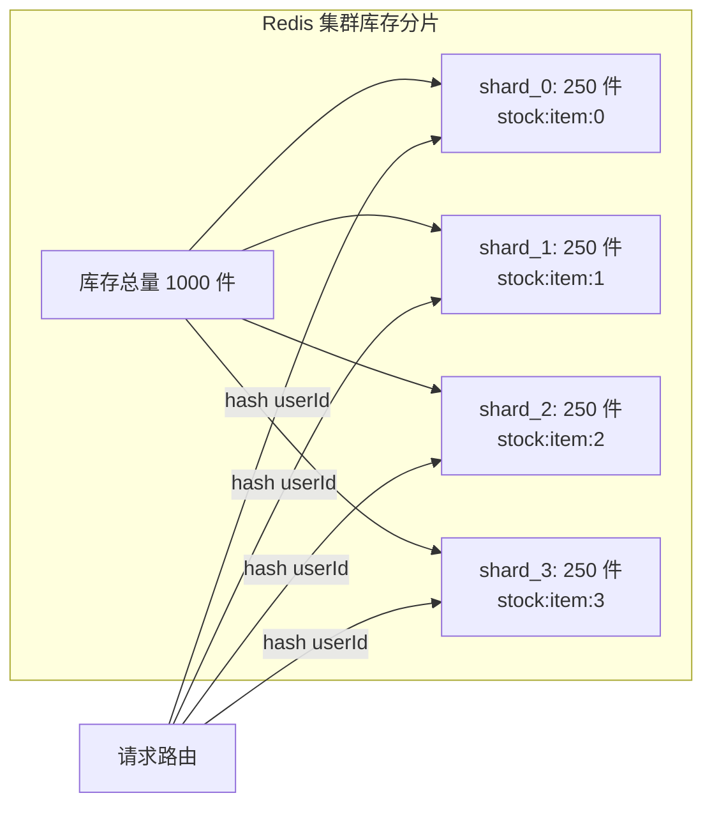

每个分片独立执行 Lua 脚本，互不影响，写 QPS 线性扩展。某个分片库存耗尽后，可以从其他分片"借调"库存（通过后台协调任务）。

**订单去重与防重提交**

```
防重设计（三层防护）：
1. 前端：按钮点击后置灰，防止重复提交
2. 网关层：Redis SETNX lock:{userId}:{itemId} EX 5（5秒幂等窗口）
3. 数据库：订单表唯一索引 (userId, itemId, activityId)
```

**超时未支付处理**

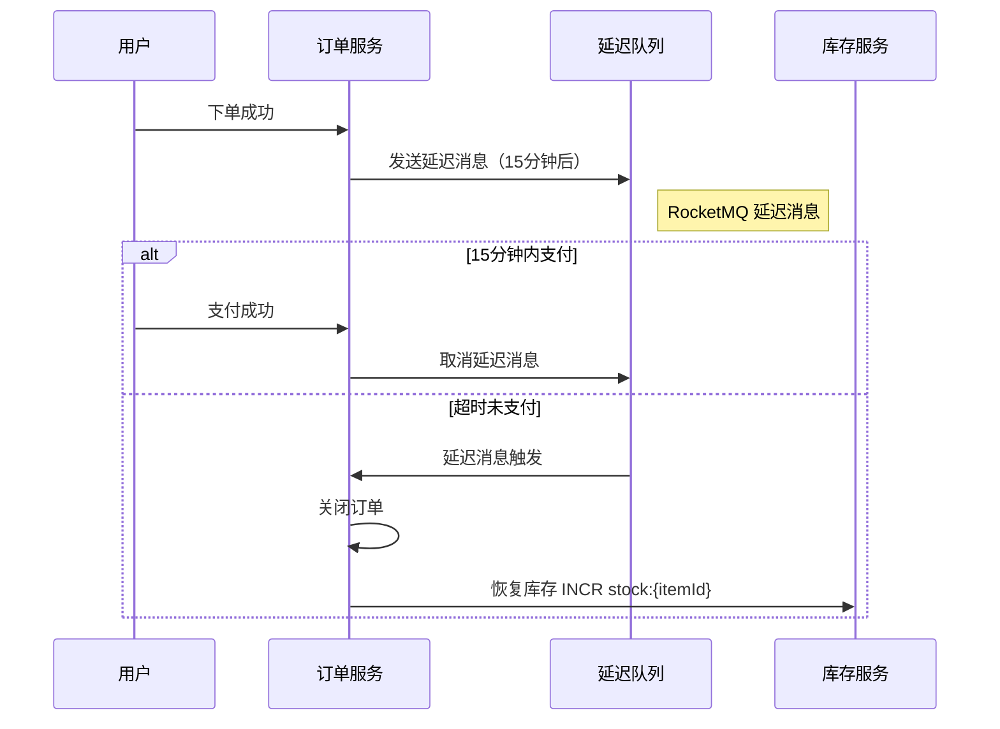

**流量漏斗分层过滤**

秒杀系统的核心设计思想是**层层过滤**，让尽可能少的请求到达数据库：

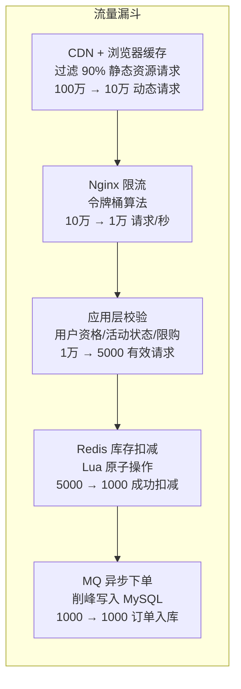

每一层的职责是**过滤无效请求**，只放行有价值的请求到下一层。这样即使有百万用户同时刷新，最终到达 MySQL 的写入量也被控制在可承受范围内。

**MQ 消费失败补偿**

MQ 异步下单的最大风险是消息丢失或消费失败，导致用户扣了库存但订单没创建：

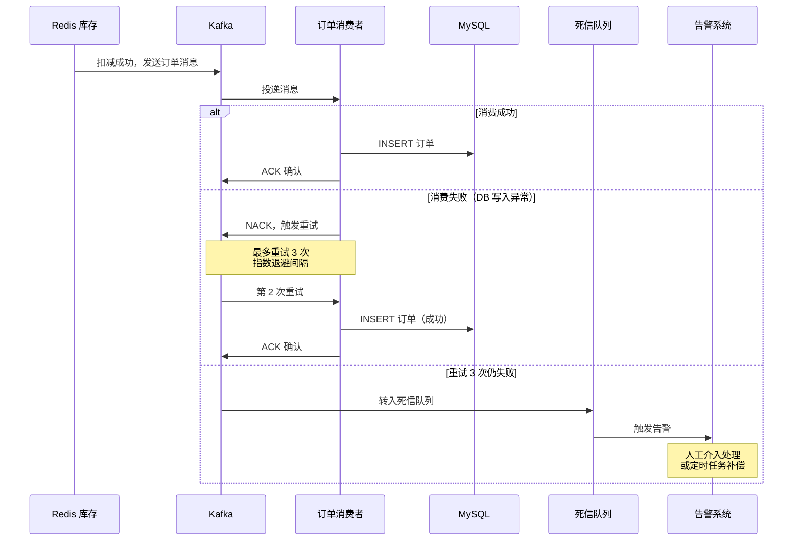

**补偿机制设计要点：**
- **消费幂等**：以 `(userId, itemId, activityId)` 为幂等键，重复消费直接返回成功
- **对账任务**：每 5 分钟执行对账，比对 Redis 扣减记录与 MySQL 订单记录，发现差异自动补偿
- **兜底策略**：若补偿仍失败，恢复 Redis 库存（`INCR`），向用户发送抢购失败通知

**库存扣减方案深度对比**

| 维度 | 数据库悲观锁 | 数据库乐观锁 | Redis Lua | Redis 分片 Lua |
|------|-------------|-------------|-----------|---------------|
| 实现 | `SELECT ... FOR UPDATE` | `UPDATE ... WHERE stock > 0` | 单实例 Lua 脚本 | 库存分片 + Lua |
| QPS 上限 | ~500 | ~2,000 | ~50,000 | ~200,000+ |
| 超卖风险 | 无 | 无 | 无 | 无（单分片原子） |
| 复杂度 | 低 | 低 | 中 | 高（需协调分片） |
| 适用场景 | 低并发活动 | 中等并发 | 大部分秒杀 | 超高并发（万级 QPS） |

---

## 案例二：即时通讯系统（IM）

### 1. 需求澄清

- 支持单聊、群聊（上限 500 人）
- 在线状态显示
- 消息历史记录（可查询最近 N 条）
- 离线推送通知（APNs / FCM）
- 消息送达回执（已发送、已送达、已读）

### 2. 容量估算

| 指标 | 数值 |
|------|------|
| DAU | 10,000,000 |
| 人均发消息数/天 | 50 条 |
| 每日消息总量 | 5 亿条 |
| 峰值 QPS（发消息） | ~6,000 |
| P99 消息延迟目标 | < 200ms |
| 消息存储（按 1 年） | ~100 TB |

### 3. 高层设计

```
客户端 ←──WebSocket──→ WebSocket 网关（Gateway）
                          ↓
                    消息服务（Message Service）
                     ↙            ↘
          消息存储                推送服务
       (Cassandra/HBase)      (APNs / FCM)
                     ↘
                  在线状态
                   (Redis)
```

### 4. 详细设计

**WebSocket 连接管理**

- 每台 Gateway 节点维护本地连接表 `{ userId → socket }`
- 同时在 Redis 记录路由信息：`HSET gateway:user {userId} {gatewayNodeId}`
- 消息路由时先查 Redis 找到目标 Gateway 节点，再通过内部 RPC 转发

**单聊消息投递流程**

```
发送方 ─→ Gateway A ─→ Message Service
                          ├─ 写 Cassandra（持久化）
                          ├─ 查 Redis 路由（接收方在哪个 Gateway）
                          ├─ 若在线：RPC → Gateway B → 推送 WebSocket
                          └─ 若离线：写推送队列 → APNs/FCM
```

**群聊 Fan-out 策略**

| 策略 | 适用场景 | 说明 |
|------|----------|------|
| 写扩散（Fan-out on Write） | 小群（< 200 人） | 发消息时同步写入每个成员的消息队列 |
| 读扩散（Fan-out on Read） | 大群 / 超级群 | 消息只写一份，成员读取时拉取 |

实践中采用**混合策略**：群成员数小于阈值用写扩散，超过后切换读扩散。

**消息存储（Cassandra）**

```
表结构（按会话分区，时间排序）：
  partition key: conversationId
  clustering key: messageId（基于时间的 Snowflake ID，降序）
  columns: senderId, content, type, timestamp, status
```

- 查询最近消息：`SELECT * FROM messages WHERE conversationId=? LIMIT 50`
- 消息 ID 使用全局唯一且有序的 Snowflake ID，便于排序与去重

**在线状态**

- 客户端每 30 秒发送心跳，Gateway 刷新 Redis TTL：`SETEX online:{userId} 60 {gatewayId}`
- TTL 过期即视为离线，避免状态不一致

**消息回执**

- 已送达：接收方 Gateway 收到消息后回 ACK，Message Service 更新状态
- 已读：接收方打开会话后发送 Read Receipt 事件

### 5. 扩展与优化

- **Gateway 水平扩展**：无状态，WebSocket 连接通过 L4 负载均衡分发
- **Message Service 分区**：按 conversationId 哈希路由，保证同一会话消息有序
- **Cassandra 分片**：自动分片，写入吞吐随节点数线性扩展
- **推送合并**：离线期间多条消息合并为一条推送，减少唤醒次数

### 6. 权衡讨论

| 方案 | 优点 | 缺点 |
|------|------|------|
| 写扩散 | 读取简单，延迟低 | 大群写放大严重 |
| 读扩散 | 写入压力小 | 读取需聚合，延迟高 |
| 混合策略 | 兼顾两者 | 实现复杂，阈值需调优 |

**面试要点**：重点讨论大群消息的 Fan-out 策略选择，以及 WebSocket 网关的连接路由机制。

**深入思考**

**消息存储方案对比图**

```mermaid
graph TB
    subgraph 写扩散（小群 ≤ 200人）
    direction TB
    A1[用户A 发消息] --> B1[写入 A 的发件箱]
    A1 --> C1[写入 用户B 收件箱]
    A1 --> D1[写入 用户C 收件箱]
    A1 --> E1[写入 用户D 收件箱]
    end
    
    subgraph 读扩散（大群 > 200人）
    direction TB
    A2[用户A 发消息] --> B2[写入群消息表<br/>（只写一份）]
    C2[用户B 读消息] --> B2
    D2[用户C 读消息] --> B2
    E2[用户D 读消息] --> B2
    end
```

**已读回执实现**

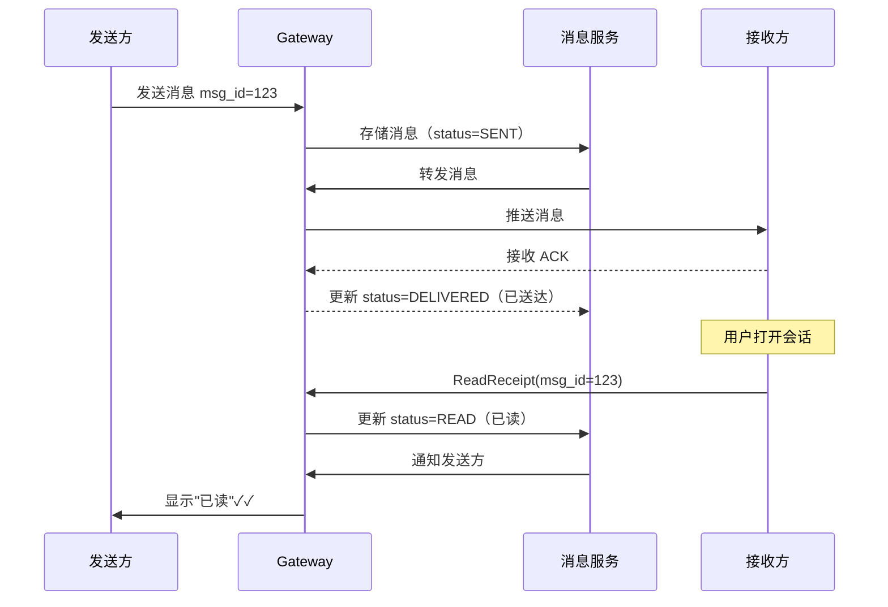

**群聊已读回执优化**：群消息不逐条发已读回执，而是记录每个成员在该会话中的最后阅读位置（`last_read_msg_id`），查询时用 `COUNT(member WHERE last_read >= msg_id)` 获取已读人数。

**消息序号与顺序保证**

IM 系统中消息顺序是核心难题。仅靠客户端时间戳无法保证全局顺序（时钟不同步）。

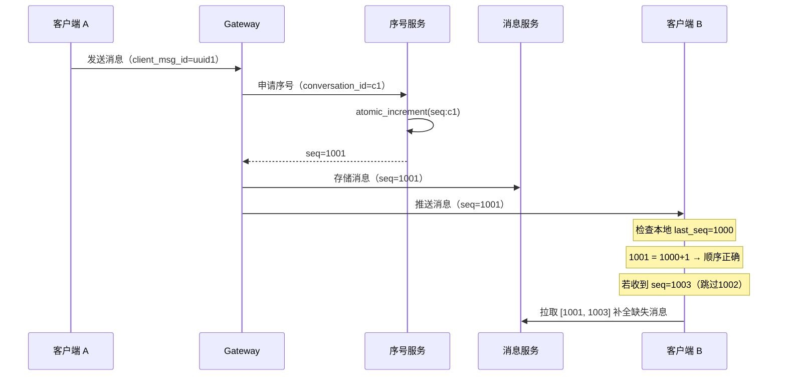

**序号服务设计要点：**
- 每个会话维护独立的递增序号（`conversation_id → atomic counter`）
- 使用 Redis `INCR` 或数据库自增序列实现
- 客户端缓存 `last_seq`，收到消息时检查是否连续，不连续则主动拉取补全
- 单聊和群聊使用不同的序号空间

**多端同步**

用户可能同时在手机、电脑、Pad 登录，需要保证所有设备看到一致的消息：

```mermaid
graph TB
    subgraph 多端同步模型
    direction TB
    
    A[用户 A 发消息] --> MS[消息服务]
    MS --> GW[Gateway 路由层]
    
    GW --> D1[设备1: iPhone<br/>在线 → WebSocket 推送]
    GW --> D2[设备2: MacBook<br/>在线 → WebSocket 推送]
    GW --> D3[设备3: iPad<br/>离线 → APNs 推送]
    
    Note over D1,D3: 每个设备维护独立的<br/>同步位点 sync_seq
    end
```

**同步位点机制：**
- 每个 `(userId, deviceId)` 维护一个 `sync_seq`（已同步到的最新消息序号）
- 设备上线时：拉取 `sync_seq` 之后的所有消息（增量同步）
- 设备长期离线后上线：若缺失消息过多（> 1000 条），只拉取最近 N 条 + 提示"查看更多历史消息"

**消息撤回实现**

```
撤回流程：
1. 客户端发送撤回请求：POST /api/v1/messages/{msgId}/recall
2. 服务端校验：
   - 是否是本人发送的消息？
   - 是否在 2 分钟内？
3. 更新消息状态：UPDATE messages SET status='RECALLED', content='[已撤回]' WHERE id=?
4. 向该会话所有在线成员推送撤回通知（携带 msgId）
5. 客户端收到通知后，本地 DB 更新消息显示为"对方撤回了一条消息"
6. 离线成员上线后，通过增量同步获取撤回事件
```

**消息存储分层**

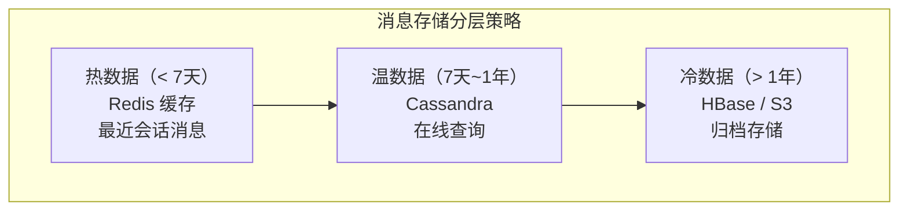

| 层级 | 存储 | 访问延迟 | 使用场景 |
|------|------|----------|----------|
| 热数据 | Redis | < 5ms | 最近 7 天消息，聊天窗口直接展示 |
| 温数据 | Cassandra | < 50ms | 7天~1年，用户主动搜索/翻看历史 |
| 冷数据 | S3 + Athena | 秒级 | 超过 1 年，合规审计需要时查询 |

---

## 案例三：Feed 流 / Timeline

### 1. 需求澄清

- Twitter 类时间线：关注的人发布的内容按时间倒序展示
- 支持发帖、关注、取消关注
- 时间线近实时更新
- 读写比例约 20:1（读多写少）

### 2. 容量估算

| 指标 | 数值 |
|------|------|
| DAU | 100,000,000 |
| 人均发帖/天 | 1 条 |
| 日发帖总量 | 1 亿条 |
| 人均读 Feed/天 | 20 次 |
| 峰值读 QPS | ~500,000 |
| 峰值写 QPS | ~25,000 |

### 3. 高层设计

```
发帖：Post Service → Fan-out Service → Timeline Cache（Redis）
                                     → 持久化存储（MySQL/Cassandra）

读取：Feed Service → Timeline Cache（Redis）→ 返回用户时间线
                  → （缓存 miss）→ 持久化存储重建
```

### 4. 详细设计

**三种 Fan-out 模型**

**推模型（Push / Fan-out on Write）**

发帖时立即将帖子 ID 写入所有粉丝的 Timeline Cache：

```
发帖 → Fan-out Service → 遍历粉丝列表
                        → ZADD timeline:{followerId} {timestamp} {postId}
                        → ZREMRANGEBYRANK timeline:{followerId} 0 -1001  （保留最新 1000 条）
```

- 优点：读取 O(1)，延迟极低
- 缺点：大 V（粉丝百万级）发帖时写放大严重

**拉模型（Pull / Fan-out on Read）**

读取时实时合并关注列表中每个人的最新帖子：

```
读取 → 获取关注列表 → 并行查询每个人的最新帖子 → 归并排序 → 返回
```

- 优点：写入简单，无写放大
- 缺点：读取耗时高，关注人数多时延迟不可控

**混合模型（Hybrid）**

- 普通用户（粉丝 < 100K）：推模型，发帖后 Fan-out 到粉丝 Timeline Cache
- 大 V（粉丝 ≥ 100K）：拉模型，Timeline Cache 中只存普通用户帖子
- 读取时：`Timeline Cache（普通用户帖子）` + `实时拉取已关注大 V 的最新帖子` → 归并

**Redis ZSET Timeline**

```bash
# 写入帖子
ZADD timeline:{userId} {timestamp} {postId}

# 读取最新 20 条
ZREVRANGEBYSCORE timeline:{userId} +inf -inf LIMIT 0 20

# 控制缓存大小，保留最新 1000 条
ZREMRANGEBYRANK timeline:{userId} 0 -1001
```

**帖子内容存储**

- 帖子元数据（作者、时间、文本）存 MySQL，按 postId 查询
- 图片/视频资源存对象存储（S3），通过 CDN 加速

### 5. 扩展与优化

- **Fan-out 异步化**：大量粉丝的 Fan-out 通过 Kafka 异步处理，避免发帖接口超时
- **Timeline Cache 冷启动**：用户长时间未登录后 Cache 过期，首次读取触发异步重建
- **热点帖子缓存**：爆款内容单独缓存，减少 DB 压力
- **地理分布**：多 Region 部署，就近读取

### 6. 权衡讨论

| 方案 | 读延迟 | 写开销 | 适用场景 |
|------|--------|--------|----------|
| 纯推模型 | 极低 | 高（大 V 写放大） | 粉丝数均匀的平台 |
| 纯拉模型 | 高 | 低 | 写多读少，关注数少 |
| 混合模型 | 低 | 适中 | 存在大 V 的社交平台 |

**面试要点**：清晰解释混合模型中大 V 的判断阈值及切换机制，以及 ZSET 裁剪策略对存储的控制。

**深入思考**

**大 V 发帖决策流程**

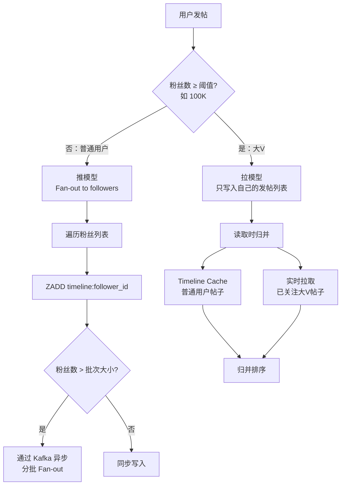

**关注/取关的 Cache 一致性**

- **关注**：将该用户的最近 N 条帖子批量写入当前用户 Timeline Cache
- **取关**：异步清除 Timeline Cache 中该用户的帖子（可延迟，不影响体验）
- **边界问题**：关注后立即刷新 Feed 时，Fan-out 可能还未完成 → 兜底策略是先拉取该用户最新帖子补充到 Feed

**Feed 分页与游标设计**

Feed 翻页不能使用传统的 `OFFSET + LIMIT`，因为新帖子不断插入会导致数据偏移（用户看到重复帖子或遗漏帖子）。

```
传统 OFFSET 翻页的问题：
  用户在看第 1 页时，有 3 条新帖插入
  → 翻第 2 页时，OFFSET 10 实际跳过了 13 条数据
  → 第 1 页最后 3 条帖子出现在第 2 页（重复）

游标翻页（Cursor-based Pagination）：
  请求：GET /api/v1/feed?cursor=1716432000&limit=20
  含义：返回 timestamp < 1716432000 的最新 20 条帖子
  响应：{ posts: [...], next_cursor: 1716428400 }
  
  下一页请求：GET /api/v1/feed?cursor=1716428400&limit=20
```

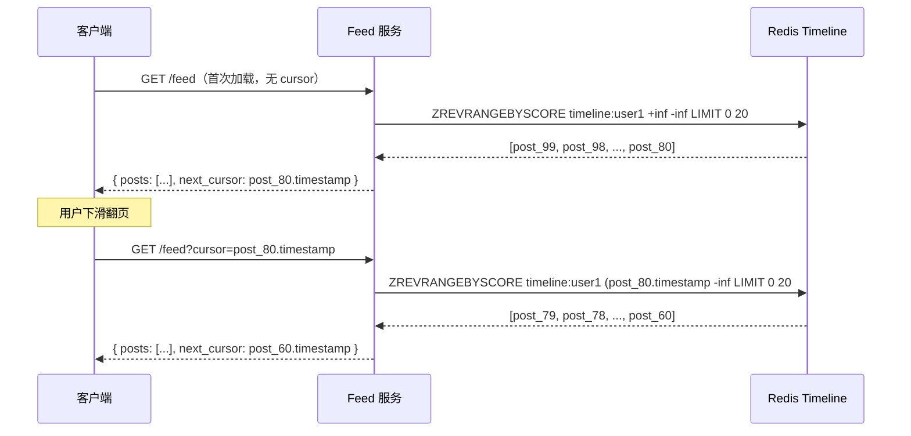

**Timeline Cache 预热策略**

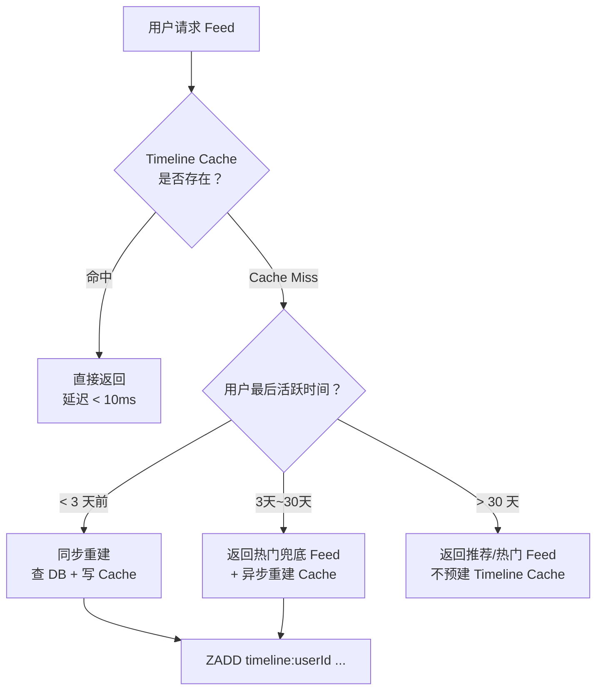

**删帖在 Timeline 中的传播**

用户删帖后，需要从所有粉丝的 Timeline Cache 中清除该帖子：

```
删帖流程：
1. 标记帖子为已删除（软删除）：UPDATE posts SET deleted=1 WHERE id=?
2. 删除 Redis 中该帖子的缓存
3. 发送删除事件到 Kafka
4. Fan-out 消费者异步处理：
   - 小规模（粉丝 < 10K）：直接 ZREM timeline:{followerId} {postId}
   - 大规模（大V）：不主动清除粉丝 Timeline
     → 读取时 Feed 服务拉取帖子详情发现已删除，跳过并返回下一条
     → 懒删除策略，避免大V删帖时的写放大
```

**互动数据（点赞/评论/转发）**

| 数据 | 存储方案 | 读取方式 |
|------|----------|----------|
| 点赞数 | Redis `INCR like_count:{postId}` | Feed 接口批量 MGET |
| 是否点赞 | Redis `SISMEMBER liked:{postId} {userId}` | Feed 接口批量判断 |
| 评论 | MySQL 评论表 + Redis 缓存热门评论 | 点击帖子后加载 |
| 转发数 | Redis `INCR repost_count:{postId}` | 同点赞数 |

---

## 案例四：短视频推荐系统

### 1. 需求澄清

- 个性化视频 Feed，无限下拉
- 冷启动（新用户/新视频）处理
- 内容安全审核
- 支持 A/B 实验
- 非功能：推荐延迟 < 200ms，结果多样性

### 2. 容量估算

| 指标 | 数值 |
|------|------|
| DAU | 50,000,000 |
| 人均观看视频/天 | 100 条 |
| 每日推荐请求量 | 50 亿次 |
| 峰值推荐 QPS | ~100,000 |
| 视频库规模 | 10 亿+ |

### 3. 高层设计

```
客户端
  → API Gateway
    → 推荐服务（Recommendation Service）
        ├─ 召回层（Recall）：从海量视频中初筛候选集
        ├─ 排序层（Rank）：ML 模型精排
        └─ 重排层（Re-rank）：多样性 + 业务规则
    → 视频服务（Video Service）：获取视频元数据
    → CDN：视频流分发
```

### 4. 详细设计

**推荐三层漏斗**

```
视频库（10亿）
    ↓ 召回（多路）
候选集（~10,000）
    ↓ 粗排（轻量模型）
候选集（~1,000）
    ↓ 精排（重模型）
候选集（~100）
    ↓ 重排（多样性 + 规则）
最终推荐列表（20 条）
```

**召回层（多路召回）**

| 召回通道 | 说明 |
|----------|------|
| 协同过滤 | 相似用户喜欢的视频 |
| 内容相似 | 与历史观看视频相似的内容 |
| 热门召回 | 当前热门视频兜底 |
| 关注博主 | 已关注账号的最新发布 |
| 探索召回 | 随机探索，解决信息茧房 |

**排序层（ML 模型）**

- 特征维度：用户特征（历史行为、画像）、视频特征（标签、时长、完播率）、上下文特征（时间、设备、网络）
- 预测目标：完播率、点赞率、分享率的加权综合分
- 模型部署：TensorFlow Serving / Triton，GPU 推理加速

**重排层**

- **多样性**：同一作者/标签的视频不连续出现（Sliding Window 去重）
- **已看过滤**：Bloom Filter 过滤近期已推送视频
- **业务规则**：广告位插入、违规内容降权、新人扶持
- **时效性**：优先推送 24 小时内的新视频

**实时特征更新（Flink）**

```
用户行为事件（Kafka）
  → Flink 实时计算
    → 更新实时特征（Redis）：短期兴趣、近 1 小时完播率
    → 更新离线特征（Hive）：长期画像，次日生效
```

**内容审核流水线**

```
视频上传 → 转码服务
         → 审核服务（OCR + 音频识别 + 图像分类）
           ├─ 机器初审（秒级）
           └─ 人工复审（分钟级）
         → 审核通过 → 进入推荐候选池
```

**A/B 实验**

- 用户按 userId 哈希分桶，不同桶命中不同实验组
- 实验配置中心实时下发，推荐服务读取对应策略
- 指标监控：完播率、CTR、留存率，统计显著后全量

### 5. 扩展与优化

- **预计算推荐列表**：离线预生成部分用户的推荐列表缓存到 Redis，降低在线延迟
- **模型蒸馏**：将大模型知识蒸馏到轻量模型，降低推理延迟
- **召回并行化**：多路召回并行请求，取并集后去重，控制总耗时
- **CDN 预加载**：推荐返回后，客户端预加载下一屏视频，提升体验

### 6. 权衡讨论

| 维度 | 选项 A | 选项 B | 取舍 |
|------|--------|--------|------|
| 实时 vs 批量特征 | 实时（Flink）：低延迟、捕捉瞬时兴趣 | 批量（Hive）：高质量、稳定 | 混合：实时特征捕捉短期兴趣，批量特征描述长期画像 |
| 参与度 vs 多样性 | 纯优化 CTR：信息茧房风险 | 强制多样性：短期指标下降 | 重排层引入多样性惩罚项，长期留存更优 |
| 质量 vs 延迟 | 重模型精排：效果好，耗时长 | 轻模型：延迟低，效果差 | 粗排用轻模型缩小候选集，精排只处理 1000 条 |

**面试要点**：清晰描述三层漏斗架构（召回 → 排序 → 重排），解释各层的目标与技术选型；重点讨论冷启动问题（新用户用热门召回 + 探索，新视频用内容召回 + 流量扶持）。

**深入思考**

**特征工程三层存储架构**

```mermaid
graph TB
    subgraph 特征存储三层架构
    direction TB
    
    subgraph 离线层（T+1 生效）
    H1[Hive / Spark] -->|日级批处理| H2[HDFS<br/>用户长期画像<br/>物品统计特征]
    end
    
    subgraph 近线层（分钟级）
    N1[Flink 窗口聚合] -->|写入| N2[Redis / Feature Store<br/>近1小时CTR<br/>近期兴趣变化]
    end
    
    subgraph 实时层（秒级）
    R1[用户行为事件] -->|Kafka → Flink| R2[Redis<br/>当前会话行为序列<br/>最近5次点击]
    end
    end
    
    H2 --> Model[排序模型<br/>在线推理]
    N2 --> Model
    R2 --> Model
```

- **离线特征**：用户历史行为聚合（30天完播率、收藏偏好分布），物品全局统计（总播放数、平均完播率）
- **近线特征**：用户短期兴趣漂移（最近1小时点击类目分布），物品近期热度变化
- **实时特征**：当前会话行为序列（刚刚点赞的3个视频），用于捕捉即时兴趣

**冷启动详细方案**

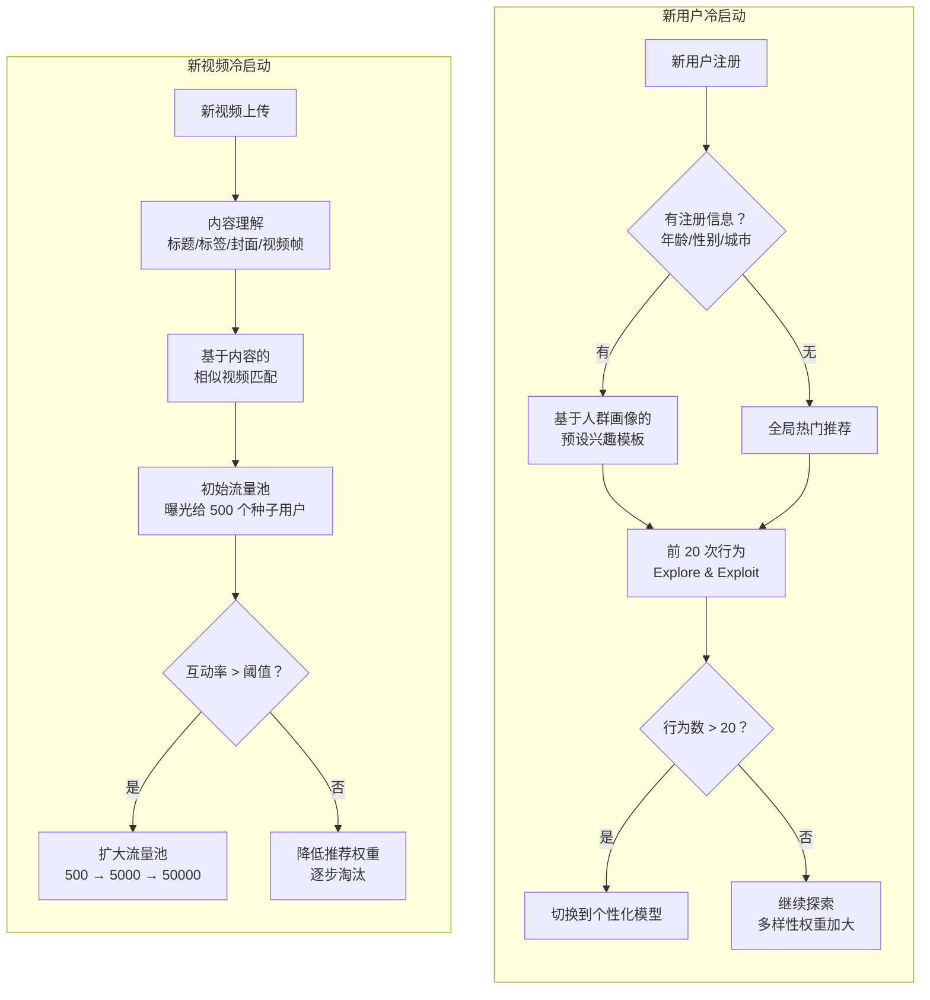

**流量池分级机制（类抖音）：**

| 流量池级别 | 曝光量 | 进入条件 | 核心指标 |
|-----------|--------|----------|----------|
| 初级池 | 200~500 | 审核通过自动进入 | 完播率 > 15% |
| 二级池 | 3,000~5,000 | 初级池指标达标 | 完播率 > 25%，点赞率 > 5% |
| 三级池 | 10,000~50,000 | 二级池指标达标 | 完播率 > 35%，互动率 > 8% |
| 热门池 | 100,000+ | 三级池指标达标 | 由编辑/算法综合判定 |

每个视频从初级池开始，根据互动数据决定是否"晋级"到更大的流量池，确保**好内容能被发现、差内容快速淘汰**。

**Embedding 向量召回**

```mermaid
graph LR
    subgraph 双塔模型（Two-Tower）
    direction TB
    U[用户特征<br/>行为序列+画像] --> UE[用户 Embedding<br/>128维向量]
    V[视频特征<br/>标签+内容+统计] --> VE[视频 Embedding<br/>128维向量]
    end
    
    UE --> ANN[ANN 近似检索<br/>Faiss / Milvus]
    VE --> Index[(向量索引<br/>10亿视频)]
    Index --> ANN
    ANN --> Result[Top-1000<br/>召回候选集]
```

**向量召回优势：**
- 能发现**跨类目的隐性关联**（如喜欢做饭的人可能也喜欢旅行 vlog）
- 协同过滤无法覆盖的长尾内容，向量召回可以通过内容相似性触达
- 离线训练用户/视频 Embedding，在线通过 ANN（Approximate Nearest Neighbor）检索，延迟 < 10ms

| ANN 引擎 | 特点 | 适用规模 |
|----------|------|---------|
| Faiss（Facebook） | 高性能 GPU/CPU 检索 | 亿级向量 |
| Milvus | 云原生，支持增量更新 | 亿级向量 |
| HNSWlib | 轻量，纯内存 | 千万级向量 |
| Elasticsearch KNN | 与 ES 生态集成 | 百万~千万级 |

**在线学习与实时模型更新**

传统推荐模型按天级别离线训练，无法快速适应用户兴趣变化。在线学习（Online Learning）是进阶方案：

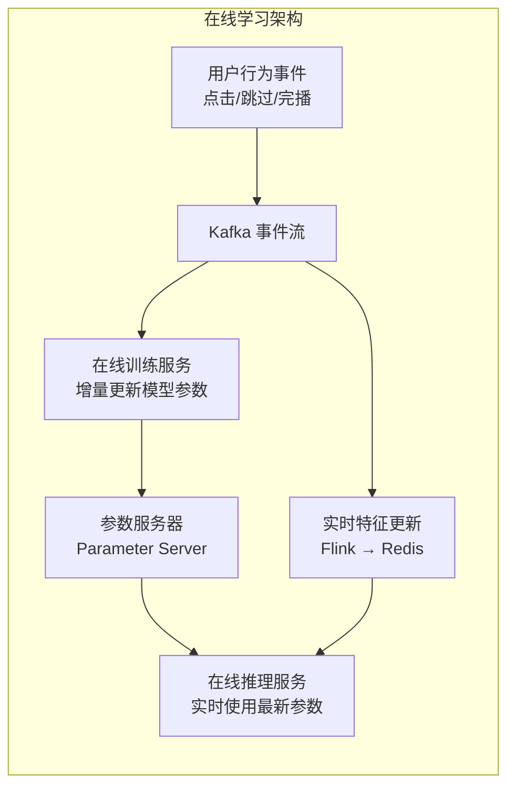

| 更新方式 | 更新频率 | 优势 | 风险 |
|----------|---------|------|------|
| 离线全量训练 | 每天 / 每周 | 稳定、可回滚 | 响应慢，新热点适应滞后 |
| 近线增量训练 | 每小时 | 较快适应，风险可控 | 仍有小时级延迟 |
| 在线学习 | 实时（秒级） | 即时响应用户兴趣变化 | 数据噪声大，需要稳定性保障 |

**实际策略**：大多数公司采用**离线全量 + 近线增量**的组合，只有头部公司（字节、Meta）在核心推荐场景使用在线学习。面试中提到这一点并分析其 trade-off 是显著加分项。
