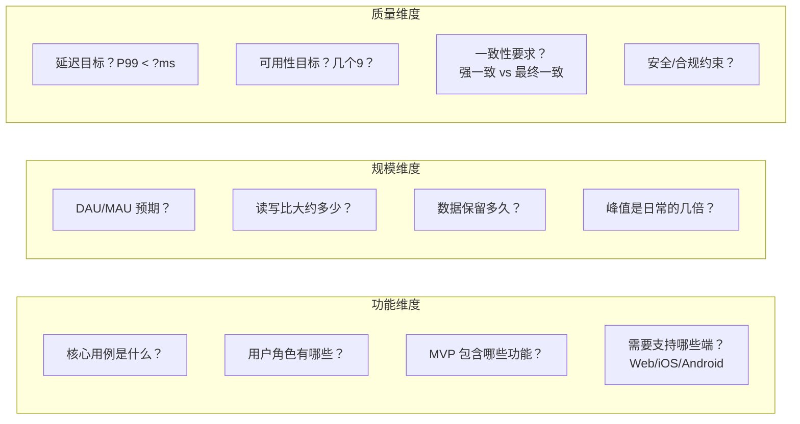
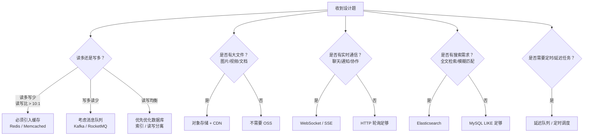
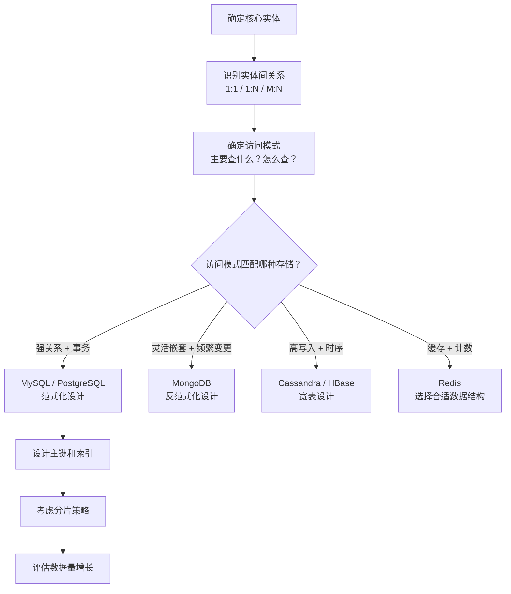
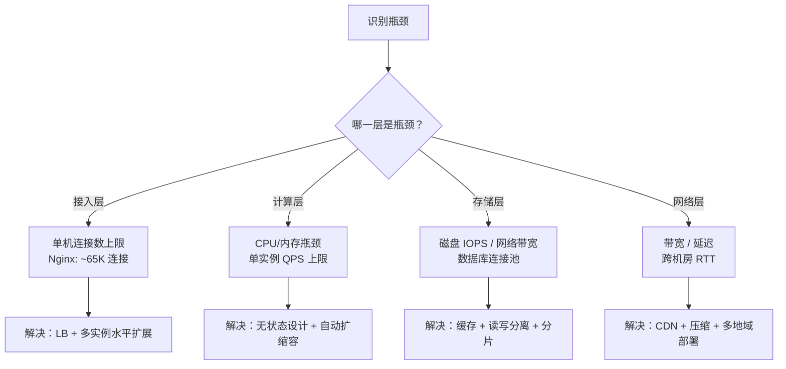
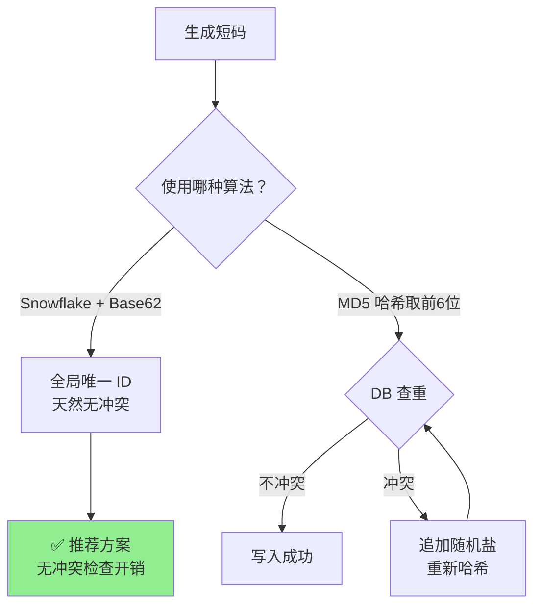
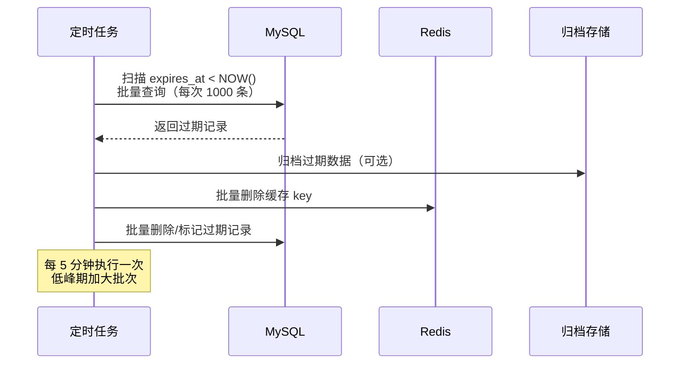
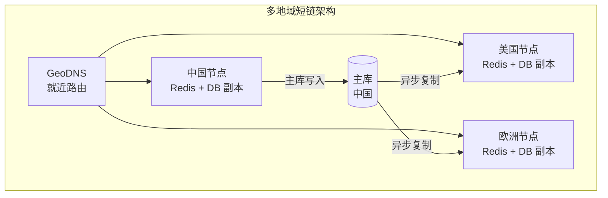

# 系统设计方法论

## 概念

系统设计面试考察候选人从零开始设计一个大规模分布式系统的能力。面试官关注的不仅仅是最终答案，更重要的是**思考过程**：你如何分解问题、如何权衡取舍、如何在约束条件下做出合理决策。

与算法题不同，系统设计没有唯一正确答案。面试官希望看到：
- 结构化的思维方式
- 对分布式系统核心概念的掌握
- 主动识别瓶颈并提出优化方案的能力
- 清晰表达技术决策的沟通能力

## 核心原理

### 系统设计面试的标准步骤

#### 第一步：需求澄清（约 5 分钟）

在动笔之前，先把问题搞清楚。一个模糊的题目背后可能隐藏着截然不同的设计方向。

**功能需求（Functional Requirements）**
- 系统需要支持哪些核心功能？
- 用户能做什么操作？
- 哪些功能是 MVP，哪些是 Nice-to-have？

**非功能需求（Non-Functional Requirements）**
- 用户量级：DAU（日活）是多少？峰值流量是平时的几倍？
- 读写比：读多还是写多？（如微博 timeline 读写比可达 100:1）
- 数据量：系统需要存储多少数据？数据增长速度如何？
- 延迟要求：P99 延迟需要控制在多少毫秒以内？
- 可用性要求：需要几个 9（99.9% vs 99.99%）？
- 一致性要求：能否接受最终一致性？

> 面试技巧：不要假设，要询问。主动提问体现了你的工程经验，面试官希望看到这一点。

**需求澄清提问模板**

面试中可以直接套用的提问清单，根据题目类型选择相关问题：



**不同题型的关键提问**

| 题目类型 | 必须问的关键问题 | 为什么重要 |
|----------|-----------------|-----------|
| 存储类（短链、KV Store） | 数据量级？读写比？需要持久化吗？ | 决定是用 Redis 还是 MySQL，是否需要分库分表 |
| 社交类（Feed、IM） | 关系链密度？大 V 比例？群聊上限？ | 决定推拉模型选择和 Fan-out 策略 |
| 计算类（搜索、推荐） | 候选集规模？延迟容忍？需要实时更新吗？ | 决定召回策略和模型复杂度 |
| 实时类（监控、支付） | 数据到达延迟容忍？精确度要求？ | 决定是流式还是批处理 |

**常见陷阱**

::: warning 需求阶段常见错误
1. **直接开画架构图**：没搞清需求就开始设计，后面推翻重来浪费时间
2. **功能贪多**：试图在 45 分钟内设计一个完整的系统，应聚焦 2-3 个核心功能
3. **忽略非功能需求**：只考虑"能不能做"，不考虑"能做多大"，面试官会追问你没准备好的规模问题
4. **不与面试官互动**：单向输出 10 分钟没有一个问题，面试官认为你缺乏协作能力
:::

---

#### 第二步：容量估算（约 5 分钟）

用数字说话，帮助确定系统规模，指导后续的架构决策。

**QPS 估算公式**

$$\text{QPS} = \frac{\text{DAU} \times \text{每用户日均操作次数}}{86400}$$

以设计 Twitter 为例：
- DAU = 1 亿
- 每用户每天平均读 Timeline 20 次，发推 1 次
- 读 QPS = 100,000,000 × 20 / 86,400 ≈ **23,000 QPS**
- 写 QPS = 100,000,000 × 1 / 86,400 ≈ **1,200 QPS**
- 峰值通常取均值的 **2~3 倍**

**存储估算**

$$\text{日存储增量} = \text{写 QPS} \times 86400 \times \text{单条数据大小}$$

以 Twitter 为例：
- 每条推文约 300 bytes（文本） + 平均 10% 附带图片
- 纯文本日增量 = 1,200 × 86,400 × 300 bytes ≈ **31 GB/day**
- 5 年总存储 ≈ 31 GB × 365 × 5 ≈ **56 TB**

**带宽估算**

$$\text{出口带宽} = \text{读 QPS} \times \text{平均响应大小}$$

常用单位换算：
- 1 KB = 1,000 bytes
- 1 MB = 1,000 KB
- 1 TB = 1,000 GB
- 1 billion = 10 亿

> 估算不需要精确，数量级正确即可。重要的是展示你的思考逻辑。

---

#### 第三步：高层设计（约 10 分钟）

画出核心组件和数据流。用 ASCII 图或白板快速勾勒架构全貌。

**标准组件清单**

| 组件 | 缩写 | 作用 |
|------|------|------|
| 客户端 | Client | 浏览器、移动端 App |
| 负载均衡 | LB | 流量分发，健康检查 |
| API 网关 | API GW | 鉴权、限流、路由 |
| 应用服务 | Service | 业务逻辑处理 |
| 数据库 | DB | 持久化存储 |
| 缓存 | Cache | 降低延迟，减少 DB 压力 |
| 消息队列 | MQ | 异步解耦，削峰填谷 |
| CDN | CDN | 静态资源加速 |
| 对象存储 | OSS | 图片、视频等大文件 |

**组件选型决策指南**

面试中需要快速判断架构中应该引入哪些组件。以下是通用决策流程：



**组件引入原则**：不要为了展示知识面而堆砌组件。每引入一个组件都要说出**为什么需要它**以及它解决的**具体瓶颈**。面试官更看重你对每个组件职责的深刻理解，而非数量。

**典型架构图示例**

```
Client
  │
  ▼
CDN ──── 静态资源
  │
  ▼
Load Balancer
  │
  ▼
API Gateway (Auth / Rate Limit)
  │
  ├──► Service A ──► Cache (Redis)
  │         │              │
  │         └──────────────┤
  │                        ▼
  └──► Service B ──► Primary DB ──► Replica DB
              │
              ▼
           Message Queue
              │
              ▼
         Worker Service ──► Object Storage
```

> 先画主流程，再补充边缘情况。不要一开始就陷入细节。

---

#### 第四步：详细设计（约 15 分钟）

深入核心模块，展示你对技术细节的掌握。

**数据库 Schema 设计**
- 明确主键和索引策略
- 考虑数据访问模式（按用户 ID 查、按时间排序等）
- 关系型 vs NoSQL 的选型理由

**API 设计（RESTful 风格）**

```
POST   /api/v1/links          # 创建短链
GET    /api/v1/links/{code}   # 获取原始链接（内部）
GET    /{code}                # 重定向（对外）
DELETE /api/v1/links/{code}   # 删除短链
GET    /api/v1/links/{code}/stats  # 查看统计
```

**核心算法与数据结构选择**
- 用 Redis Sorted Set 实现排行榜
- 用 Bloom Filter 快速判断数据是否存在
- 用一致性哈希（Consistent Hashing）实现分布式缓存节点分配

**数据建模思维框架**

面试中设计数据库 Schema 时，按以下步骤思考：



**常见数据建模决策**

| 决策点 | 选项 A | 选项 B | 判断依据 |
|--------|--------|--------|----------|
| 范式化 vs 反范式化 | 第三范式（无冗余） | 冗余存储（空间换时间） | 读多用反范式减少 JOIN；写多用范式减少更新量 |
| 自增 ID vs UUID | 自增（有序、紧凑） | UUID / Snowflake（全局唯一） | 单库用自增；分布式必须 Snowflake/UUID |
| 软删除 vs 硬删除 | `is_deleted` 标记 | 直接 DELETE | 需要审计/恢复用软删；简单场景用硬删 |
| 单表 vs 多表 | 所有字段一张表 | 拆分（基本信息 + 扩展信息） | 字段 > 30 个或有大字段（TEXT/BLOB）时拆分 |

**API 设计深入**

```
RESTful 核心原则：
1. 资源用名词复数：/api/v1/users（不是 /getUser）
2. HTTP 动词表示操作：GET 读 / POST 创建 / PUT 全量更新 / PATCH 部分更新 / DELETE 删除
3. 状态码表达语义：200 成功 / 201 已创建 / 400 参数错误 / 404 不存在 / 429 限流 / 500 内部错误
4. 分页用 cursor 优于 offset：offset 大页码性能差，cursor 基于上一页最后一条记录 ID
5. 版本管理：URL 路径（/v1/）比 Header 更直观，面试中优先选这种
```

**幂等性设计**

在面试中提及 API 幂等性是加分项：

| HTTP 方法 | 天然幂等？ | 需要额外处理？ |
|-----------|-----------|--------------|
| GET | 是 | 不需要 |
| PUT | 是 | 不需要（全量替换） |
| DELETE | 是 | 不需要（删除已删除的资源返回 404） |
| POST | 否 | **需要**：通过幂等 key（`Idempotency-Key` Header）防重 |

```
POST /api/v1/orders
Header: Idempotency-Key: uuid-abc-123
Body: { "itemId": 1001, "quantity": 1 }

服务端逻辑：
1. 查 Redis：GET idempotency:uuid-abc-123
2. 若存在 → 直接返回上次结果（不重复创建订单）
3. 若不存在 → 创建订单，结果写入 Redis（TTL 24h）
```

---

#### 第五步：扩展与优化（约 10 分钟）

识别系统瓶颈，提出可落地的优化方案。

**水平扩展（Scale Out）**
- 应用层：无状态设计，Session 外置到 Redis
- 数据层：数据库分片（Sharding），按用户 ID 取模

**缓存策略**
- Cache-Aside（旁路缓存）：最常用，先查 Cache，Miss 则查 DB 并回填
- Write-Through：写操作同时更新 DB 和 Cache，强一致但写延迟高
- Cache 失效策略：TTL + LRU 淘汰

**数据库优化**
- 读写分离：写 Primary，读 Replica，适合读多写少场景
- 分库分表：按业务分库，按数据量分表，注意跨分片查询问题

**异步化**
- 非关键路径操作（发通知、更新统计）移入消息队列
- 削峰填谷：应对流量突刺，保护下游服务

**瓶颈分析方法论**

面试中系统设计的加分项之一是**主动识别瓶颈**。以下是系统化的分析思路：



**经典系统各层吞吐量参考值**

这些数字不需要精确记忆，但量级要对：

| 组件 | 单实例吞吐参考 | 瓶颈在哪 |
|------|---------------|---------|
| Nginx（反向代理） | 10K~50K QPS | 连接数、CPU |
| Spring Boot 应用 | 1K~5K QPS | CPU、线程池 |
| MySQL（单机） | 3K~8K QPS（混合读写） | 磁盘 IOPS、锁竞争 |
| Redis（单机） | 50K~100K QPS | 内存、网络带宽 |
| Kafka（单分区） | 10K~100K msg/s | 磁盘顺序写 |
| Elasticsearch | 5K~20K QPS（搜索） | 内存、CPU |

> 面试时说"MySQL 单机大概能承受 5K QPS 的混合负载"比说"MySQL 很快"专业得多。有具体数字支撑的架构决策更有说服力。

---

#### 第六步：权衡讨论

系统设计没有银弹，所有选择都是权衡。主动讨论取舍展示了你的成熟度。

| 维度 | 选项 A | 选项 B | 如何权衡 |
|------|--------|--------|---------|
| 一致性 vs 可用性 | 强一致（CP） | 高可用（AP） | CAP 定理，根据业务容忍度选择 |
| 性能 vs 成本 | 全量缓存 | 按需缓存 | 热数据比例、内存成本 |
| 简单 vs 灵活 | 单体架构 | 微服务 | 团队规模、业务复杂度 |
| 延迟 vs 吞吐 | 同步处理 | 异步处理 | 用户体验要求、数据实时性要求 |

**更多权衡维度**

| 维度 | 选项 A | 选项 B | 判断依据 |
|------|--------|--------|----------|
| SQL vs NoSQL | 关系型数据库 | 文档/列族/KV | 数据模型、一致性需求、扩展方式 |
| 推模型 vs 拉模型 | 写时扩散 | 读时聚合 | 读写比、Fan-out 规模、延迟容忍 |
| 长连接 vs 短连接 | WebSocket / gRPC 流 | HTTP 轮询 | 实时性要求、客户端数量 |
| 集中式 vs 去中心化 | 单点协调器 | 事件驱动 / P2P | 故障域、延迟、可观测性 |
| 预计算 vs 实时计算 | 离线预生成结果 | 在线实时计算 | 数据新鲜度要求、计算成本 |

**权衡讨论的面试话术**

面试中讨论权衡时，建议用以下句式展示思考深度：

> "我选择方案 A 而不是方案 B，是因为在当前场景下 [具体约束]。如果 [条件变化]，我会考虑切换到方案 B。"

示例：
> "我选择 Redis 缓存而不是本地缓存，是因为这是多实例部署，需要所有实例共享同一份缓存数据。如果是单实例部署或者热点数据需要微秒级访问，我会加一层 Caffeine 本地缓存。"

这种**条件化表述**比单纯选 A 或选 B 更显深度，面试官会认为你有工程经验而非纸上谈兵。

---

### 完整案例走读：设计一个短链接系统

#### 需求澄清

**功能需求**
- 输入长 URL，生成唯一短链（如 `https://short.ly/abc123`）
- 访问短链，301/302 重定向到原始 URL
- 支持自定义短码（可选）
- 统计每条短链的点击次数

**非功能需求**
- 高可用：99.99%（短链失效影响业务）
- 低延迟：重定向 P99 < 10ms
- 短码不可预测（安全考虑）
- 短链有效期支持设置

#### 容量估算

```
写操作：1 亿条短链 / 月 = 100M / (30 × 86400) ≈ 40 写/秒
读操作：读写比 100:1 → 4,000 读/秒（峰值 ~40,000 读/秒）

存储：
  每条记录约 500 bytes（短码 + 原始 URL + 元数据）
  10 年数据量 = 100M × 12 × 10 × 500 bytes ≈ 6 TB
```

#### 高层设计

```
用户
  │
  ├── 创建短链 ──► API Service ──► DB (写)
  │                    │
  │                    └──► ID Generator (短码生成)
  │
  └── 访问短链 ──► Redirect Service
                       │
                       ├──► Cache (Redis) ──► 命中则直接返回
                       │
                       └──► DB (读) ──► 回填 Cache
                                │
                                └──► 异步更新点击统计 (MQ → Worker)
```

#### 短链生成算法

**方案一：Base62 编码 + 自增 ID**

```
自增 ID（如 12345678）→ Base62 编码 → "dnh75"（6位可表示 62^6 ≈ 568 亿条）

Base62 字符集：0-9, a-z, A-Z
优点：简单，无冲突
缺点：短码连续可预测，需要分布式 ID 生成器（如 Snowflake）
```

**方案二：哈希 + 冲突处理**

```
MD5(原始 URL) → 取前 6 位 → 检查 DB 是否冲突
若冲突 → 追加随机盐重新哈希

优点：相同 URL 可生成相同短码（去重）
缺点：冲突检查需要 DB 查询，高并发下压力大
```

推荐方案：**Snowflake ID + Base62 编码**，兼顾唯一性、性能和不可预测性。

#### 数据库设计

```sql
CREATE TABLE short_links (
    id          BIGINT PRIMARY KEY,        -- Snowflake ID
    short_code  VARCHAR(8) UNIQUE NOT NULL, -- 短码，建索引
    original_url TEXT NOT NULL,
    user_id     BIGINT,                    -- 创建者（可为空，匿名）
    expires_at  DATETIME,                  -- 过期时间（NULL 表示永久）
    created_at  DATETIME DEFAULT NOW(),
    click_count BIGINT DEFAULT 0           -- 近似统计，精确统计走独立表
);

CREATE INDEX idx_short_code ON short_links(short_code);
```

点击统计使用独立表，避免高频更新锁住主表：

```sql
CREATE TABLE click_events (
    id         BIGINT PRIMARY KEY,
    short_code VARCHAR(8),
    clicked_at DATETIME,
    ip         VARCHAR(45),
    user_agent TEXT
) PARTITION BY RANGE (clicked_at); -- 按时间分区，便于归档
```

#### 缓存策略

```
短链重定向是典型的读多写少场景，缓存命中率应 > 90%。

Key:   short_code（如 "abc123"）
Value: original_url
TTL:   与短链过期时间对齐，最长 24 小时

缓存穿透防护：对不存在的短码缓存空值（TTL 60s）
缓存击穿防护：热点短码加互斥锁，防止并发 DB 查询
```

#### 扩展考虑

| 瓶颈 | 解决方案 |
|------|---------|
| 单点 Redis | Redis Cluster，按 short_code 分片 |
| 单 DB 写瓶颈 | 按 short_code 前缀分库（16 个分片） |
| 点击统计写压力 | 写入 Kafka，批量聚合后落库 |
| 全球访问延迟 | 多地域部署 + GeoDNS 就近路由 |
| 短码生成单点 | 多实例 Snowflake，机器 ID 不同 |

#### 深入思考：边界情况

**短码冲突处理方案对比**



| 方案 | 冲突概率 | 性能 | 复杂度 | 适用场景 |
|------|----------|------|--------|----------|
| Snowflake + Base62 | 0（全局唯一） | 高（无需查重） | 低 | 首选方案 |
| MD5 取前 N 位 | N=6 时约 $\frac{1}{62^6}$ | 中（需查重） | 中 | 需要相同 URL 生成相同短码 |
| 自增 ID + Base62 | 0 | 高 | 低 | 可接受短码可预测 |
| 随机字符串 | 低（但存在） | 中（需查重） | 低 | 简单场景 |

**过期清理策略**

短链过期后需要及时清理，释放短码供后续复用：



**关键设计点：**
- 使用 `expires_at` 索引加速扫描，避免全表查询
- 批量处理（每次 1000 条），避免长事务锁表
- 先删缓存再删 DB，防止已过期短链仍被缓存命中
- 低峰期（凌晨）执行大批量清理，高峰期减小批次

**多地域部署的一致性挑战**

全球化短链服务需要多地域部署以降低用户访问延迟：



**核心挑战与解决方案：**
- **短码唯一性**：所有写入集中在主库，或使用分段 Snowflake（不同地域使用不同机器 ID 段）
- **复制延迟**：新创建的短链在其他地域可能短暂不可用（通常 < 1s），可接受
- **缓存一致性**：各地域 Redis 独立缓存，通过 TTL 自然过期保持最终一致
- **就近读取**：读请求（重定向）完全在本地节点处理，延迟 < 10ms

## 面试常问 & 怎么答

**Q1：系统设计面试应该怎么展开？时间怎么分配？**

按照六步框架推进，时间分配参考：

| 阶段 | 时长 | 关键输出 |
|------|------|---------|
| 需求澄清 | 5 min | 功能列表、非功能指标 |
| 容量估算 | 5 min | QPS、存储、带宽数字 |
| 高层设计 | 10 min | 架构图、核心组件 |
| 详细设计 | 15 min | Schema、API、核心算法 |
| 扩展优化 | 10 min | 瓶颈识别、优化方案 |

**核心技巧**：全程主动引导面试官，不要等待被问。说出你正在考虑什么，你排除了哪些方案以及原因。思考过程比最终方案更重要。

---

**Q2：设计一个短链接系统**

参考上方「完整案例走读」，回答要点：

1. **先澄清需求**：读写比、日活、是否需要自定义短码、统计维度
2. **给出估算**：100M URLs/月，读写比 100:1，峰值 4 万读 QPS
3. **架构分层**：写链路（API + ID生成 + DB）和读链路（重定向 + Cache + DB）分开讨论
4. **短码算法**：重点讲 Snowflake + Base62，对比哈希方案的优缺点
5. **缓存是核心**：重定向路径上 Redis 缓存是降延迟的关键，Cache-Aside 模式
6. **主动提扩展**：分库分表、Kafka 异步统计、多地域部署

---

**Q3：如何估算系统的 QPS 和存储需求？**

**QPS 估算三步法**：

1. 确定 DAU（日活用户数）
2. 估算每用户每天的操作频率（读/写分别估算）
3. 套公式：$\text{QPS} = \frac{\text{DAU} \times \text{操作频率}}{86400}$，峰值乘以 2~3 倍系数

**存储估算三步法**：

1. 确定写 QPS 和单条记录大小
2. 计算日增量：$\text{日增} = \text{写 QPS} \times 86400 \times \text{记录大小}$
3. 推算总量：日增 × 保留年限 × 副本数

**常用数量级记忆**：

| 数量 | 说明 |
|------|------|
| $10^3$ | 千，1 KB |
| $10^6$ | 百万，1 MB |
| $10^9$ | 十亿，1 GB |
| $10^{12}$ | 万亿，1 TB |
| 86,400 | 一天的秒数 |
| 2,592,000 | 一个月的秒数（30天） |

回答时要自信地报出具体数字，不要说"大概差不多"。数量级正确即可，过程清晰比结果精确更重要。

## 看到什么就先想到这类

看到以下关键词或场景，优先联想系统设计方法论：

| 触发词 | 对应思路 |
|--------|---------|
| "设计一个 XX 系统" | 启动六步框架，先澄清需求 |
| "支持百万/亿级用户" | 容量估算 + 水平扩展方案 |
| "高并发、低延迟" | 缓存策略、读写分离、CDN |
| "高可用、不能宕机" | 冗余副本、健康检查、熔断降级 |
| "数据量很大" | 分库分表、归档冷热数据、对象存储 |
| "读多写少" | Cache-Aside 缓存 + 读写分离 |
| "写多读少" | 消息队列缓冲 + 批量写入 |
| "全球用户" | 多地域部署 + GeoDNS + CDN |
| "短链/TinyURL" | Snowflake ID + Base62 + Redis 缓存 |
| "Feed/Timeline" | 推模型（Push）vs 拉模型（Pull）权衡 |
| "排行榜/计数器" | Redis Sorted Set / HyperLogLog |
| "限流/防刷" | Token Bucket / Leaky Bucket 算法 |
