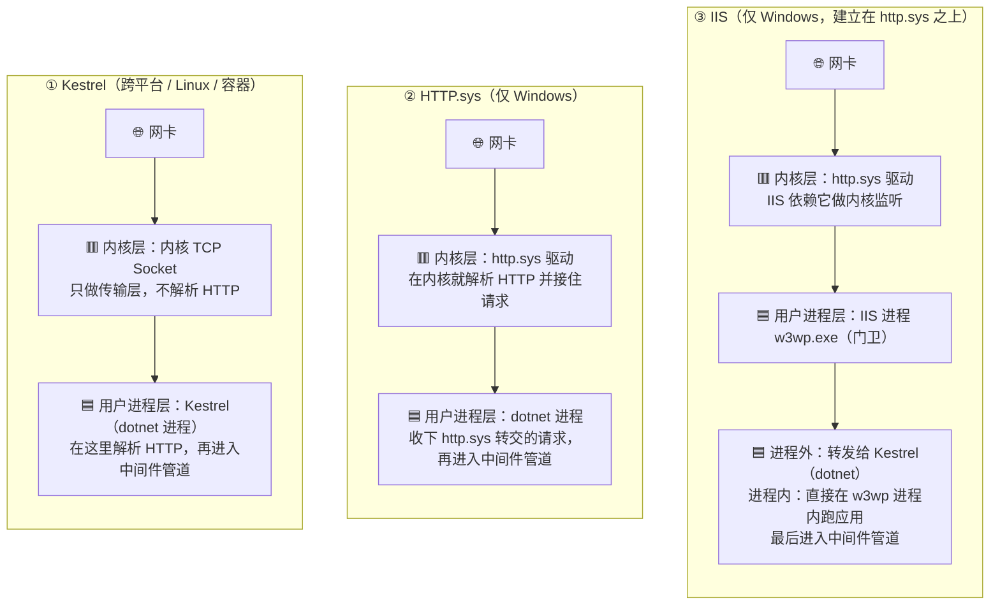
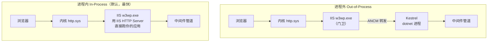

# ASP.NET Core 托管模型与服务器

<span class="dig-tag dig-tag--category">Web 与框架</span> <span class="dig-tag dig-tag--hot">🔥 高频</span>

::: tip 💡 核心要点
ASP.NET Core 应用内部一定跑着一个 **HTTP 服务器实现**，负责监听端口、解析 HTTP、把请求交给中间件管道。框架内置三种实现：**Kestrel**（默认、跨平台）、**HTTP.sys**（Windows 内核态）、**IIS HTTP Server**（IIS 进程内宿主）。而 **IIS / Nginx / YARP** 是它们前面的**反向代理**。理解"请求落在哪一层、谁解析 HTTP"，就掌握了这一章。
:::

---

## Web 服务器是什么

你的 C# 业务代码本身不会"上网"。它需要一个 **Web 服务器**站在前面，干三件事：

1. **监听端口**：守在 `80` / `443` 端口等连接
2. **解析协议**：把网络字节流翻译成"这是一个 `GET /orders` 请求"
3. **交给应用并写回响应**：调用你的中间件管道，再把结果发回客户端

```
客户端 ⇄ Web 服务器（Kestrel / IIS / HTTP.sys）⇄ 你的中间件管道与业务代码
```

一句话：**Web 服务器是"应用"与"网络"之间的桥梁，没有它应用就只是个不能联网的普通程序。**

---

## ASP.NET Core 的服务器全景

这是本章最容易被讲错的地方，先把概念分两层说清。

### 两类角色：服务器实现 vs 反向代理

| 角色 | 是什么 | 成员 |
|------|--------|------|
| **服务器实现**（server implementation） | 真正监听并把请求变成 `HttpContext` 交给你应用的组件 | **Kestrel** · **HTTP.sys** · **IIS HTTP Server** |
| **反向代理**（reverse proxy） | 站在服务器实现前面，做 TLS、限流、负载均衡、转发 | **IIS** · **Nginx** · **Apache** · **YARP** |

### 三种服务器实现

| 实现 | 平台 | 定位 | 一句话 |
|------|------|------|--------|
| **Kestrel** | 跨平台 | **默认、首选** | 用 C# 写的高性能服务器，哪都能跑 |
| **HTTP.sys** | 仅 Windows | 特殊场景 | 直接复用 Windows 内核的 HTTP 监听 |
| **IIS HTTP Server** | 仅 Windows | IIS 进程内宿主 | IIS **进程内**托管时应用用的就是它（不是 Kestrel） |

### IIS 到底算不算服务器

这是高频追问，答案分两层：

- **作为产品**：IIS（Internet Information Services）是 Windows 上一个**完整的 Web 服务器**，能托管 PHP、静态站点、.NET Framework 等。
- **在 ASP.NET Core 语境里**：IIS 不直接充当那个"服务器实现"，而是当**反向代理 + 进程宿主**——
  - **进程外**：IIS 转发给独立进程里的 **Kestrel**；
  - **进程内**：应用跑在 IIS 工作进程里，用 **IIS HTTP Server**。

所以"IIS 是不是服务器"——是 Web 服务器产品，但**不是 ASP.NET Core 那三种"服务器实现"之一**。详见下文 [IIS 与两种托管模式](#iis-与两种托管模式)。

---

## 请求落在哪一层：内核态 vs 用户态

三种服务器实现的根本差异，是**请求在哪一层被解析**。一台机器从下到上分：硬件 → 操作系统内核 → 用户进程。把三种实现分开看：



| 实现 | 谁解析 HTTP | 在哪一层 | 关键点 |
|------|------------|---------|--------|
| **Kestrel** | Kestrel 自己 | 用户进程 | 内核只做 TCP 传输，没有 http.sys |
| **HTTP.sys** | http.sys 驱动 | **内核态** | Windows 内核就接住请求，再转交进程 |
| **IIS** | http.sys + IIS | 内核 + 用户进程 | 先经 http.sys，再到 IIS，最后到应用 |

记忆：**HTTP.sys 在"楼下大堂"（内核），Kestrel 在"你的办公室"（进程），IIS 是"前台保安"（用户态，挡在你前面）。**

---

## Kestrel —— 默认的跨平台服务器

Kestrel 是 ASP.NET Core **内置、默认启用**的跨平台服务器。`dotnet run` 后控制台打印的 `Now listening on: http://localhost:5000` 就是它。`WebApplication.CreateBuilder` 内部已默认 `UseKestrel()`，无需手写。

```csharp
var builder = WebApplication.CreateBuilder(args);

// 显式配置（可选）
builder.WebHost.ConfigureKestrel(options =>
{
    options.ListenAnyIP(5000);                            // HTTP
    options.ListenAnyIP(5001, lo => lo.UseHttps());       // HTTPS
    options.Limits.MaxConcurrentConnections = 10000;      // 最大并发连接
    options.Limits.MaxRequestBodySize = 10 * 1024 * 1024; // 请求体上限 10MB
});

var app = builder.Build();
app.MapGet("/", () => "Hello from Kestrel!");
app.Run();
```

**为什么快**：全异步 I/O（少量线程扛大量连接）、大量用 `Span<T>` / `Memory<T>` 减少分配、支持 HTTP/1.1 ~ HTTP/3。TechEmpower 基准常年第一梯队。

**能否直接对外网**：技术上能，但生产不建议裸奔——Kestrel 专注"快"，限流、防慢速攻击、统一证书、多站点托管这些"门卫脏活"不如专业反向代理。生产推荐 **Kestrel 在内，前面加反向代理**（见 [生产部署](#生产部署反向代理与容器)）。

---

## HTTP.sys —— Windows 专属服务器

HTTP.sys 直接复用 Windows 内核的 `http.sys` 驱动做 HTTP 监听，**绕过 Kestrel**。

```csharp
builder.WebHost.UseHttpSys(options =>
{
    options.Authentication.Schemes =
        AuthenticationSchemes.NTLM | AuthenticationSchemes.Negotiate; // Windows 集成认证
    options.UrlPrefixes.Add("http://localhost:5005");
});
```

**只在需要 Windows 专属能力时才用它**，否则一律 Kestrel：

| 维度 | Kestrel | HTTP.sys |
|------|---------|----------|
| 平台 | 跨平台 ✅ | 仅 Windows |
| 默认 | 是 | 否 |
| Windows 集成认证（NTLM/Kerberos） | 不支持 | **原生支持** |
| 端口共享（多进程共用 443） | 不支持 | **支持** |
| 适用 | 绝大多数场景 | Windows 特定需求 |

> ⚠️ 用了 HTTP.sys，应用就绑死在 Windows，失去跨平台能力。

---

## IIS 与两种托管模式

到了 ASP.NET Core 时代，IIS 的角色变成**反向代理 + 进程管理**。它是否运行你的代码，取决于托管模式；连接 IIS 与应用的是 **ASP.NET Core Module (ANCM)** 这个原生模块。



| 维度 | 进程内 (In-Process) | 进程外 (Out-of-Process) |
|------|---------------------|-------------------------|
| 应用跑在哪 | IIS 工作进程 `w3wp.exe` 内 | 独立的 `dotnet` 进程 |
| 用的服务器实现 | **IIS HTTP Server** | **Kestrel** |
| IIS 是否运行你的代码 | 是 | 否，只转发 |
| 性能 | **更高**（少一跳进程转发） | 略低（多一跳代理） |
| 默认 | ✅ .NET Core 3.0+ 默认 | 需手动配置 |

```xml
<!-- web.config：切换托管模式 -->
<aspNetCore processPath="dotnet" arguments=".\MyApp.dll"
            hostingModel="InProcess" />   <!-- 或 OutOfProcess -->
```

**什么时候用 IIS**：公司已有 Windows Server + IIS 运维体系，或需要 IIS 的 URL 重写、Windows 认证、统一证书、应用池管理等能力。

---

## 生产部署：反向代理与容器

生产环境最主流的是 **"反向代理 + Kestrel"** 结构。反向代理在外层负责"脏活"，Kestrel 专注处理动态请求。

```
公网 → 反向代理（Nginx / IIS / YARP / 云 LB）→ Kestrel → 你的业务代码
        TLS 终止 / 负载均衡 / 限流 / 缓存压缩
```

**Linux 典型部署（Nginx + Kestrel + systemd）**：

```nginx
server {
    listen 80;
    server_name myapp.com;
    location / {
        proxy_pass         http://localhost:5000;   # 转发给 Kestrel
        proxy_http_version 1.1;
        proxy_set_header   Upgrade $http_upgrade;    # 支持 WebSocket
        proxy_set_header   Connection keep-alive;
        proxy_set_header   X-Forwarded-For   $proxy_add_x_forwarded_for;
        proxy_set_header   X-Forwarded-Proto $scheme;
    }
}
```

> ⚠️ **反向代理后必须启用 `ForwardedHeaders`**，否则 Kestrel 看到的客户端 IP 是代理的 IP，HTTPS 重定向、限流、日志全乱：
> ```csharp
> app.UseForwardedHeaders(new ForwardedHeadersOptions {
>     ForwardedHeaders = ForwardedHeaders.XForwardedFor | ForwardedHeaders.XForwardedProto
> });
> ```

**容器部署（云原生主流）**：容器里直接跑 Kestrel，反向代理交给 K8s Ingress / 云 LB，**容器内不再套 IIS**。

```dockerfile
FROM mcr.microsoft.com/dotnet/sdk:8.0 AS build
WORKDIR /src
COPY . .
RUN dotnet publish -c Release -o /app

FROM mcr.microsoft.com/dotnet/aspnet:8.0
WORKDIR /app
COPY --from=build /app .
EXPOSE 8080
ENV ASPNETCORE_URLS=http://+:8080
ENTRYPOINT ["dotnet", "MyApp.dll"]
```

**YARP**（Yet Another Reverse Proxy）是微软用 ASP.NET Core 写的反向代理库，可用 C# 自定义网关逻辑，对标 Spring Cloud Gateway。

---

## Host 托管模型与后台服务

服务器只负责收发 HTTP，而把**服务器、DI、配置、日志、生命周期**组装起来并启动的，是 **Host（主机）**。

```
WebApplication (.NET 6+)
   ├─ 配置系统 (appsettings.json / 环境变量)
   ├─ 日志系统 (ILogger)
   ├─ DI 容器
   ├─ Web 服务器 (Kestrel / HTTP.sys / IIS HTTP Server)
   └─ 后台服务 (BackgroundService)
```

| 托管类型 | 用途 | 入口 |
|---------|------|------|
| **WebApplication** | Web 应用（.NET 6+ 默认） | `WebApplication.CreateBuilder` |
| **Generic Host** | 需要 `Startup.cs` 的传统 Web 应用 | `Host.CreateDefaultBuilder` |
| **Worker Service** | 无 Web 的后台服务（定时任务、消息消费） | `Host.CreateApplicationBuilder` |

后台任务用 `BackgroundService`（对标 Spring 的 `@Scheduled`）：

```csharp
public class CleanupWorker : BackgroundService
{
    protected override async Task ExecuteAsync(CancellationToken token)
    {
        while (!token.IsCancellationRequested)
        {
            // 定时清理逻辑
            await Task.Delay(TimeSpan.FromMinutes(5), token);
        }
    }
}

builder.Services.AddHostedService<CleanupWorker>();
```

---

## 选型决策

| 部署环境 | 推荐方案 |
|---------|---------|
| Linux 服务器 | Kestrel + Nginx + systemd |
| Docker / K8s | Kestrel + Ingress（不用 IIS） |
| Windows Server | IIS（进程内）+ IIS HTTP Server |
| 需 Windows 集成认证 | HTTP.sys 或 IIS |
| 微服务网关 | YARP + 多个 Kestrel 实例 |

请求主线：**反向代理 → 服务器实现（Kestrel/IIS/HTTP.sys）→ 中间件管道**，下一页 [请求管道与鉴权](./request-pipeline) 接着讲管道内部。

---

## 面试常问 & 怎么答

### Q1: ASP.NET Core 默认用什么服务器？三种实现是哪三个？

默认是 **Kestrel**（跨平台、高性能，`CreateBuilder` 默认启用）。框架内置三种**服务器实现**：Kestrel、HTTP.sys、IIS HTTP Server。注意 **IIS / Nginx / YARP 是反向代理**，不属于这三种实现——这是最容易被讲错的点。

### Q2: IIS 在 ASP.NET Core 里还运行 .NET 代码吗？

取决于托管模式。**进程内（In-Process，默认）**：应用跑在 IIS 工作进程 `w3wp.exe` 内，用 IIS HTTP Server，IIS 直接运行你的代码；**进程外（Out-of-Process）**：IIS 只当反向代理，把请求转发给独立进程里的 Kestrel，不运行你的代码。

### Q3: 进程内 vs 进程外怎么选？

进程内更快（少一跳进程间转发）、是默认，绝大多数场景用它；进程外进程隔离更好、能让一个应用池托管多个应用，但多一跳代理略慢。用 `web.config` 的 `hostingModel` 切换。

### Q4: Kestrel 能直接对外网吗？

技术上能，但生产不建议裸奔。Kestrel 专注"快"，TLS 统一管理、限流、防慢速攻击、多站点、缓存压缩这些"门卫脏活"不如专业反向代理。生产推荐 **Kestrel 在内 + 反向代理（Nginx/IIS/YARP）在外**。

### Q5: 什么时候用 HTTP.sys 而不是 Kestrel？

只在需要 **Windows 专属能力**时：Windows 集成认证（NTLM/Kerberos）、内核级端口共享。代价是绑死 Windows、失去跨平台。其余一律 Kestrel。

### Q6: 应用在反向代理后面拿不到真实客户端 IP 怎么办？

启用 `UseForwardedHeaders` 中间件，从 `X-Forwarded-For` / `X-Forwarded-Proto` 还原真实 IP 和协议，否则 HTTPS 重定向、限流、日志全会基于代理 IP 出错。

## 看到什么就先想到这类

- 出现 Kestrel / HTTP.sys / IIS HTTP Server、服务器实现 vs 反向代理。
- 出现进程内 / 进程外、`w3wp.exe`、ANCM、`hostingModel`。
- 出现 Nginx / YARP 反向代理、`UseForwardedHeaders`、systemd 部署。
- 出现 Host、Worker Service、`BackgroundService`。
